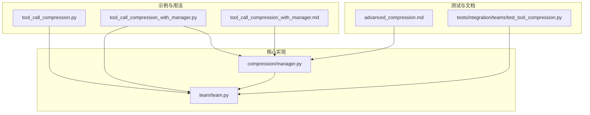
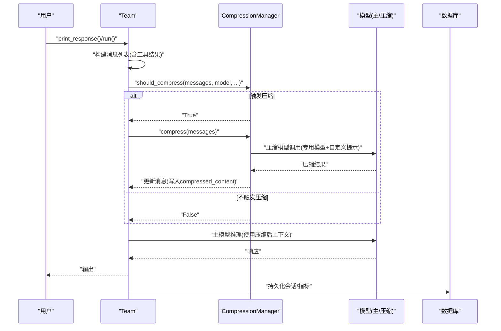
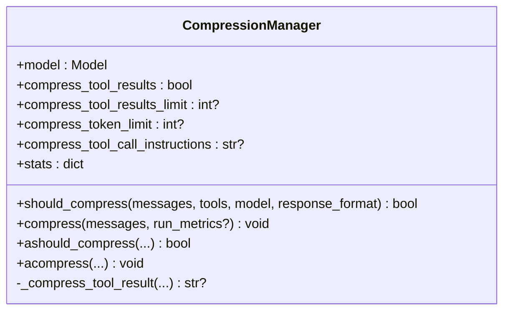
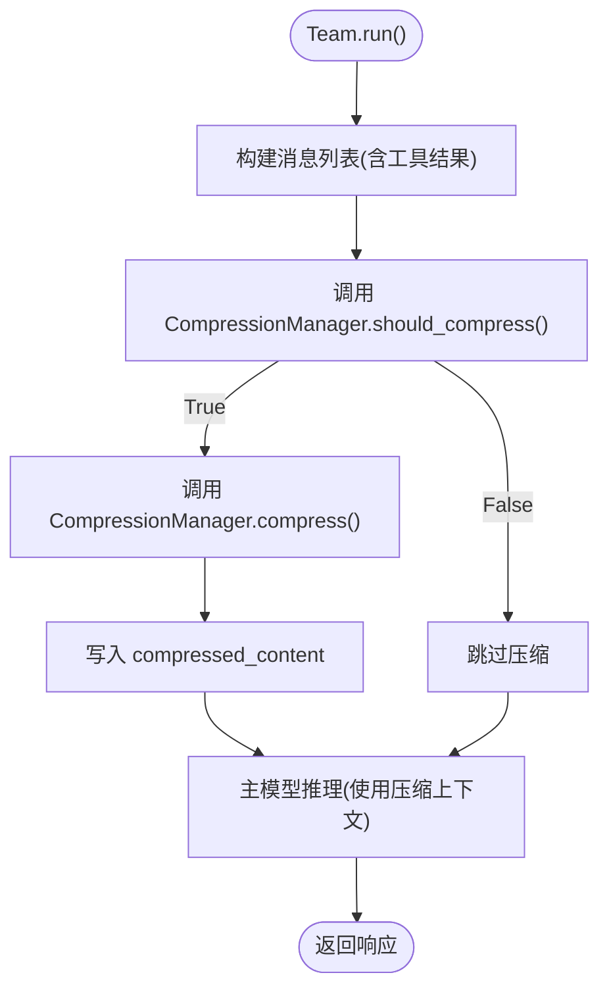
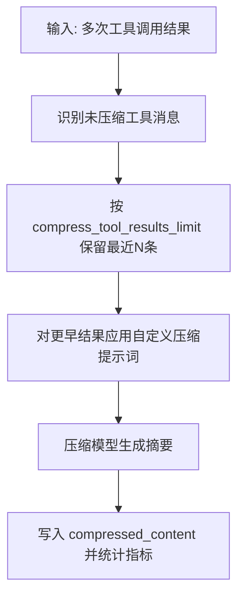
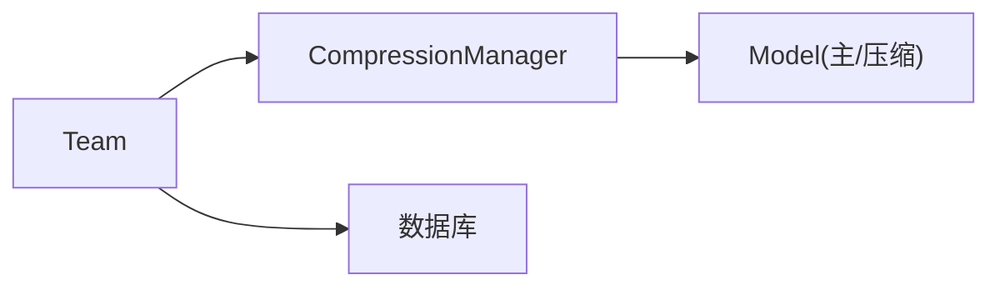

# 上下文压缩优化

<cite>
**本文引用的文件**
- [tool_call_compression.py](file://cookbook/03_teams/10_context_compression/tool_call_compression.py)
- [tool_call_compression_with_manager.py](file://cookbook/03_teams/10_context_compression/tool_call_compression_with_manager.py)
- [tool_call_compression_with_manager.md](file://cookbook/03_teams/10_context_compression/tool_call_compression_with_manager.md)
- [manager.py](file://libs/agno/agno/compression/manager.py)
- [team.py](file://libs/agno/agno/team/team.py)
- [advanced_compression.md](file://cookbook/02_agents/14_advanced/advanced_compression.md)
- [test_tool_compression.py](file://libs/agno/tests/integration/teams/test_tool_compression.py)
</cite>

## 目录
1. [简介](#简介)
2. [项目结构](#项目结构)
3. [核心组件](#核心组件)
4. [架构总览](#架构总览)
5. [详细组件分析](#详细组件分析)
6. [依赖关系分析](#依赖关系分析)
7. [性能考量](#性能考量)
8. [故障排查指南](#故障排查指南)
9. [结论](#结论)
10. [附录](#附录)

## 简介
本文件系统性阐述团队上下文压缩优化方案，聚焦于工具调用结果的压缩与上下文管理器的使用。内容涵盖：
- 上下文压缩的必要性与收益（降低 token 消耗、提升长对话与复杂任务的稳定性）
- 压缩策略与阈值配置（基于计数与 token 限额两种触发机制）
- 自定义压缩管理器的实现与调优（专用压缩模型、提示词工程、保留最近 N 条未压缩结果）
- 压缩前后对比、资源消耗分析与效果评估方法
- 团队在长对话与复杂任务场景下的性能影响与最佳实践

## 项目结构
与上下文压缩直接相关的代码分布在以下位置：
- 示例与用法：cookbook/03_teams/10_context_compression
- 压缩核心实现：libs/agno/agno/compression/manager.py
- 团队集成点：libs/agno/agno/team/team.py
- 相关高级示例与文档：cookbook/02_agents/14_advanced/advanced_compression.md
- 单元测试与集成测试：libs/agno/tests/integration/teams/test_tool_compression.py

图表来源
- [tool_call_compression.py:1-142](file://cookbook/03_teams/10_context_compression/tool_call_compression.py#L1-L142)
- [tool_call_compression_with_manager.py:1-119](file://cookbook/03_teams/10_context_compression/tool_call_compression_with_manager.py#L1-L119)
- [tool_call_compression_with_manager.md:1-68](file://cookbook/03_teams/10_context_compression/tool_call_compression_with_manager.md#L1-L68)
- [manager.py:1-281](file://libs/agno/agno/compression/manager.py#L1-L281)
- [team.py:308-313](file://libs/agno/agno/team/team.py#L308-L313)
- [advanced_compression.md:31-50](file://cookbook/02_agents/14_advanced/advanced_compression.md#L31-L50)
- [test_tool_compression.py:30-58](file://libs/agno/tests/integration/teams/test_tool_compression.py#L30-L58)

章节来源
- [tool_call_compression.py:1-142](file://cookbook/03_teams/10_context_compression/tool_call_compression.py#L1-L142)
- [tool_call_compression_with_manager.py:1-119](file://cookbook/03_teams/10_context_compression/tool_call_compression_with_manager.py#L1-L119)
- [tool_call_compression_with_manager.md:1-68](file://cookbook/03_teams/10_context_compression/tool_call_compression_with_manager.md#L1-L68)
- [manager.py:1-281](file://libs/agno/agno/compression/manager.py#L1-L281)
- [team.py:308-313](file://libs/agno/agno/team/team.py#L308-L313)
- [advanced_compression.md:31-50](file://cookbook/02_agents/14_advanced/advanced_compression.md#L31-L50)
- [test_tool_compression.py:30-58](file://libs/agno/tests/integration/teams/test_tool_compression.py#L30-L58)

## 核心组件
- 压缩管理器（CompressionManager）
  - 提供同步与异步两种压缩路径
  - 支持基于“工具结果数量阈值”和“token 限额”的双重触发策略
  - 可配置专用压缩模型与自定义压缩提示词
  - 统计压缩效果（原始大小、压缩后大小、压缩条目数）
- 团队（Team）
  - 通过 compress_tool_results 与 compression_manager 开启压缩
  - 在运行流程中调用压缩管理器进行上下文压缩
- 示例与用法
  - 默认压缩：compress_tool_results=True
  - 自定义压缩：通过 CompressionManager 注入专用模型与提示词

章节来源
- [manager.py:52-104](file://libs/agno/agno/compression/manager.py#L52-L104)
- [team.py:308-313](file://libs/agno/agno/team/team.py#L308-L313)
- [tool_call_compression.py:90-120](file://cookbook/03_teams/10_context_compression/tool_call_compression.py#L90-L120)
- [tool_call_compression_with_manager.py:49-109](file://cookbook/03_teams/10_context_compression/tool_call_compression_with_manager.py#L49-L109)

## 架构总览
上下文压缩在团队执行链路中的位置如下：

图表来源
- [team.py:308-313](file://libs/agno/agno/team/team.py#L308-L313)
- [manager.py:69-104](file://libs/agno/agno/compression/manager.py#L69-L104)
- [manager.py:142-171](file://libs/agno/agno/compression/manager.py#L142-L171)
- [tool_call_compression.py:133-142](file://cookbook/03_teams/10_context_compression/tool_call_compression.py#L133-L142)
- [tool_call_compression_with_manager.py:114-119](file://cookbook/03_teams/10_context_compression/tool_call_compression_with_manager.py#L114-L119)

## 详细组件分析

### 压缩管理器（CompressionManager）
- 设计要点
  - 数据类封装：model、compress_tool_results、compress_tool_results_limit、compress_token_limit、compress_tool_call_instructions、stats
  - 双触发策略：计数阈值（最近 N 条未压缩）与 token 限额（基于模型 token 计数）
  - 异步支持：ashould_compress、acompress 与同步版本并行
  - 统计追踪：记录压缩条目数、原始大小、压缩后大小
- 关键流程
  - should_compress：综合判断是否需要压缩
  - compress：对未压缩工具结果逐一压缩，并写入 compressed_content
  - _compress_tool_result：构造压缩提示词与消息，调用压缩模型，累积指标

图表来源
- [manager.py:52-104](file://libs/agno/agno/compression/manager.py#L52-L104)
- [manager.py:142-171](file://libs/agno/agno/compression/manager.py#L142-L171)
- [manager.py:173-208](file://libs/agno/agno/compression/manager.py#L173-L208)
- [manager.py:247-281](file://libs/agno/agno/compression/manager.py#L247-L281)

章节来源
- [manager.py:52-104](file://libs/agno/agno/compression/manager.py#L52-L104)
- [manager.py:142-171](file://libs/agno/agno/compression/manager.py#L142-L171)
- [manager.py:173-208](file://libs/agno/agno/compression/manager.py#L173-L208)
- [manager.py:247-281](file://libs/agno/agno/compression/manager.py#L247-L281)

### 团队（Team）与上下文压缩集成
- 关键字段
  - compress_tool_results：是否启用工具结果压缩
  - compression_manager：自定义压缩管理器实例
- 集成方式
  - Team 初始化时可直接传入 compression_manager
  - 运行时根据 should_compress 判断是否压缩
  - 压缩后使用 compressed_content 参与后续推理

图表来源
- [team.py:308-313](file://libs/agno/agno/team/team.py#L308-L313)
- [manager.py:69-104](file://libs/agno/agno/compression/manager.py#L69-L104)
- [manager.py:142-171](file://libs/agno/agno/compression/manager.py#L142-L171)

章节来源
- [team.py:308-313](file://libs/agno/agno/team/team.py#L308-L313)
- [manager.py:69-104](file://libs/agno/agno/compression/manager.py#L69-L104)
- [manager.py:142-171](file://libs/agno/agno/compression/manager.py#L142-L171)

### 示例一：默认压缩（compress_tool_results=True）
- 特点
  - 使用默认压缩提示词与阈值策略
  - 适合快速启用压缩，无需额外配置
- 适用场景
  - 对压缩质量要求一般、希望最小成本开启压缩的团队

章节来源
- [tool_call_compression.py:90-120](file://cookbook/03_teams/10_context_compression/tool_call_compression.py#L90-L120)

### 示例二：自定义压缩管理器（CompressionManager）
- 特点
  - 指定专用压缩模型
  - 自定义压缩提示词（如竞争情报格式）
  - 保留最近 N 条工具结果不压缩（compress_tool_results_limit）
- 价值
  - 专业压缩显著降低 token，同时保留关键事实
  - 更强的可控性与可解释性

图表来源
- [tool_call_compression_with_manager.py:49-109](file://cookbook/03_teams/10_context_compression/tool_call_compression_with_manager.py#L49-L109)
- [tool_call_compression_with_manager.md:46-60](file://cookbook/03_teams/10_context_compression/tool_call_compression_with_manager.md#L46-L60)

章节来源
- [tool_call_compression_with_manager.py:49-109](file://cookbook/03_teams/10_context_compression/tool_call_compression_with_manager.py#L49-L109)
- [tool_call_compression_with_manager.md:1-68](file://cookbook/03_teams/10_context_compression/tool_call_compression_with_manager.md#L1-L68)

### 压缩策略选择与配置
- 触发策略
  - 计数阈值：compress_tool_results_limit（默认 3；自定义示例设为 2）
  - Token 限额：compress_token_limit（基于模型 token 计数）
- 提示词工程
  - 默认提示词强调“保留关键事实、去除冗余”
  - 自定义提示词聚焦领域知识（如竞争情报格式）
- 模型选择
  - 默认复用主模型或自动注入压缩模型
  - 建议为压缩单独配置轻量模型以降低成本

章节来源
- [manager.py:62-65](file://libs/agno/agno/compression/manager.py#L62-L65)
- [manager.py:87-103](file://libs/agno/agno/compression/manager.py#L87-L103)
- [manager.py:120-129](file://libs/agno/agno/compression/manager.py#L120-L129)
- [tool_call_compression_with_manager.py:20-48](file://cookbook/03_teams/10_context_compression/tool_call_compression_with_manager.py#L20-L48)

### 压缩前后对比与效果评估
- 对比维度
  - 原始大小 vs 压缩后大小
  - 压缩条目数
  - token 节省率与推理成本变化
- 评估方法
  - 单元/集成测试验证：所有工具消息被压缩且长度缩短
  - 性能监控：压缩前后 token 数、调用次数、延迟对比
  - 业务指标：响应质量、任务完成率、错误率

章节来源
- [test_tool_compression.py:46-58](file://libs/agno/tests/integration/teams/test_tool_compression.py#L46-L58)

### 团队性能影响（长对话与复杂任务）
- 长对话场景
  - 逐步积累工具结果易超上下文上限
  - 通过“保留最近 N 条 + 旧结果压缩”平衡信息完整性与上下文长度
- 复杂任务场景
  - 多轮检索与专家分析结合
  - 压缩后的高质量摘要有助于主模型决策
- 资源消耗
  - 压缩模型调用成本与主模型成本权衡
  - 异步压缩（acompress）在高并发下提升吞吐

章节来源
- [advanced_compression.md:31-50](file://cookbook/02_agents/14_advanced/advanced_compression.md#L31-L50)
- [manager.py:247-281](file://libs/agno/agno/compression/manager.py#L247-L281)

## 依赖关系分析
- 组件耦合
  - Team 依赖 CompressionManager 进行上下文压缩
  - CompressionManager 依赖 Model 进行压缩调用
- 外部依赖
  - 模型计数接口（token 计算）
  - 日志与指标收集（运行时统计）

图表来源
- [team.py:308-313](file://libs/agno/agno/team/team.py#L308-L313)
- [manager.py:115-136](file://libs/agno/agno/compression/manager.py#L115-L136)

章节来源
- [team.py:308-313](file://libs/agno/agno/team/team.py#L308-L313)
- [manager.py:115-136](file://libs/agno/agno/compression/manager.py#L115-L136)

## 性能考量
- 触发阈值调优
  - 计数阈值：根据任务复杂度与工具调用频率调整（示例从默认 3 调整为 2）
  - Token 限额：结合模型上下文窗口与历史消息规模设定
- 异步压缩
  - 在高并发场景使用 acompress，利用 asyncio.gather 并行压缩
- 模型成本
  - 压缩模型与主模型分离，避免主模型被压缩调用拖累
- 统计与可观测性
  - 通过 stats 字段记录压缩效果，持续迭代提示词与阈值

章节来源
- [manager.py:62-65](file://libs/agno/agno/compression/manager.py#L62-L65)
- [manager.py:191-207](file://libs/agno/agno/compression/manager.py#L191-L207)
- [manager.py:247-281](file://libs/agno/agno/compression/manager.py#L247-L281)

## 故障排查指南
- 常见问题
  - 压缩未生效：检查 compress_tool_results 是否开启，或 compression_manager 是否正确注入
  - 压缩失败回退：当压缩模型不可用时，回退到原始内容并记录警告
  - 提示词无效：确认 compress_tool_call_instructions 是否覆盖默认提示词
- 排查步骤
  - 查看日志：should_compress 与 compress 的触发与统计
  - 核对阈值：确认 compress_tool_results_limit 与 compress_token_limit 设置
  - 验证测试：参考集成测试断言工具消息被压缩且长度缩短

章节来源
- [manager.py:115-141](file://libs/agno/agno/compression/manager.py#L115-L141)
- [manager.py:138-141](file://libs/agno/agno/compression/manager.py#L138-L141)
- [test_tool_compression.py:46-58](file://libs/agno/tests/integration/teams/test_tool_compression.py#L46-L58)

## 结论
上下文压缩是团队在长对话与复杂任务中保持稳定性能的关键手段。通过 CompressionManager 的双触发策略、自定义提示词与专用压缩模型，可在显著节省 token 的同时保留关键信息。建议以“保留最近 N 条 + 旧结果压缩”的策略起步，结合业务指标与测试用例持续调优阈值与提示词，最终实现成本与效果的最佳平衡。

## 附录
- 快速上手
  - 默认压缩：将 Team 的 compress_tool_results 设为 True
  - 自定义压缩：创建 CompressionManager，设置 compress_tool_results_limit 与 compress_tool_call_instructions，并注入到 Team
- 参考示例
  - 默认压缩示例：[tool_call_compression.py:90-120](file://cookbook/03_teams/10_context_compression/tool_call_compression.py#L90-L120)
  - 自定义压缩示例：[tool_call_compression_with_manager.py:49-109](file://cookbook/03_teams/10_context_compression/tool_call_compression_with_manager.py#L49-L109)
  - 架构分层说明：[advanced_compression.md:31-50](file://cookbook/02_agents/14_advanced/advanced_compression.md#L31-L50)