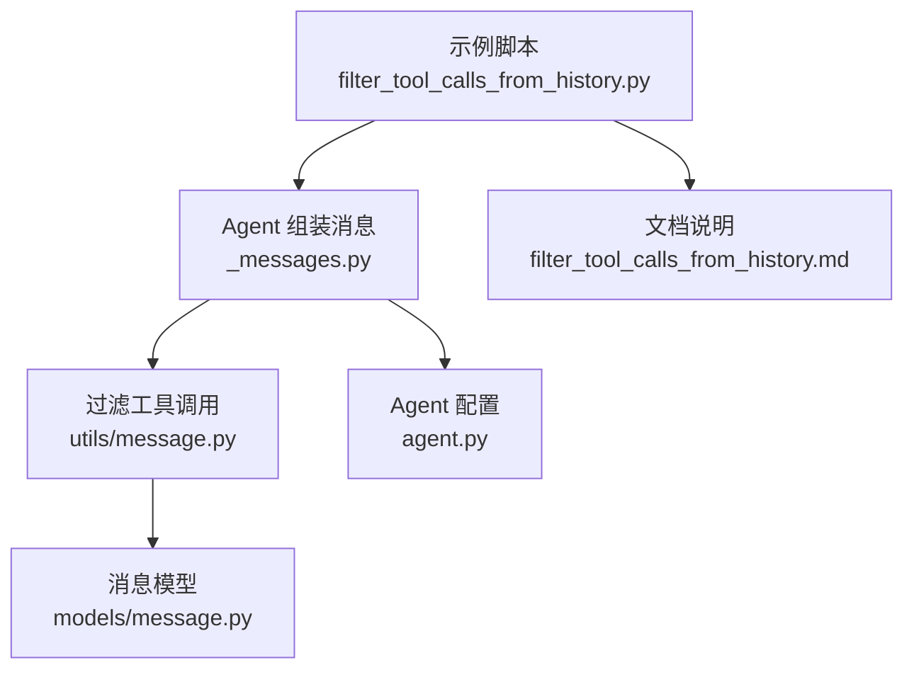
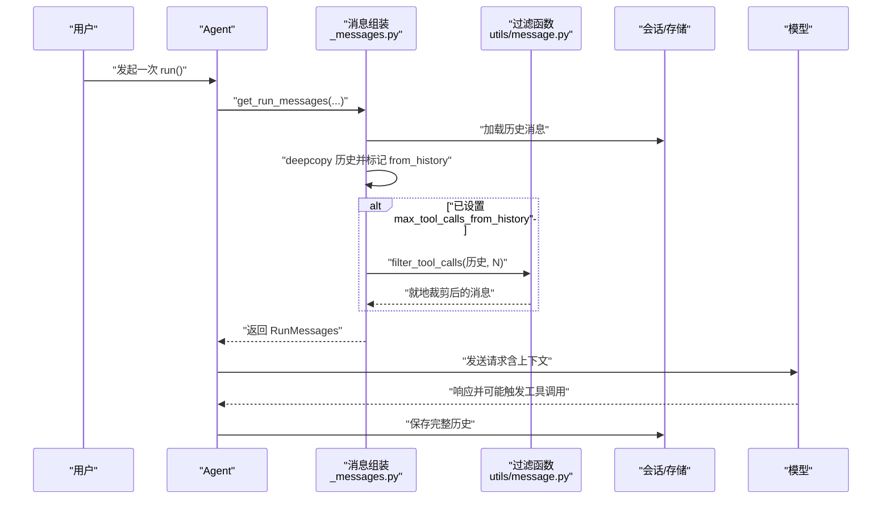
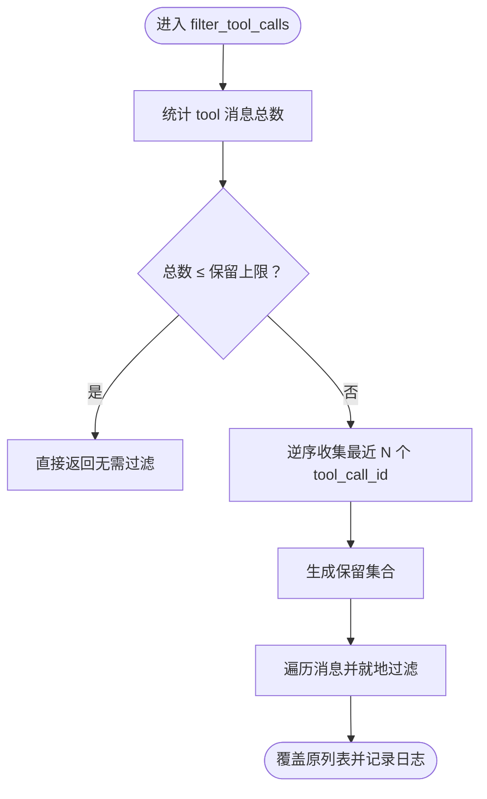
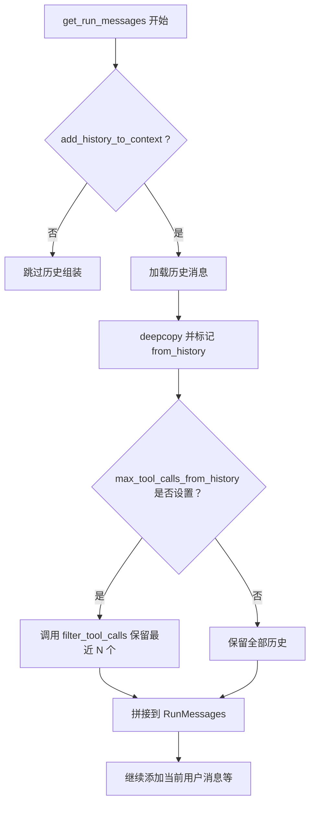
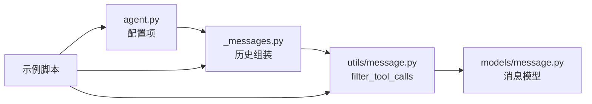

# 历史记录过滤

<cite>
**本文引用的文件**
- [filter_tool_calls_from_history.py](file://cookbook/02_agents/03_context_management/filter_tool_calls_from_history.py)
- [filter_tool_calls_from_history.md](file://cookbook/02_agents/03_context_management/filter_tool_calls_from_history.md)
- [message.py（工具函数）](file://libs/agno/agno/utils/message.py)
- [_messages.py（消息组装）](file://libs/agno/agno/agent/_messages.py)
- [message.py（消息模型）](file://libs/agno/agno/models/message.py)
- [agent.py（Agent 配置）](file://libs/agno/agno/agent/agent.py)
</cite>

## 目录
1. [简介](#简介)
2. [项目结构](#项目结构)
3. [核心组件](#核心组件)
4. [架构总览](#架构总览)
5. [组件详解](#组件详解)
6. [依赖关系分析](#依赖关系分析)
7. [性能考量](#性能考量)
8. [故障排查指南](#故障排查指南)
9. [结论](#结论)
10. [附录](#附录)

## 简介
本篇文档围绕“团队历史记录过滤”能力展开，重点讲解如何通过限制发送至模型的历史工具调用数量，在保证上下文连贯的同时显著降低 token 消耗，并确保完整历史持久化。我们将系统梳理过滤机制、相关性分析与隐私保护策略，给出可复用的配置与使用范式，并结合实际示例路径帮助读者快速落地。

## 项目结构
与历史记录过滤直接相关的代码分布在以下模块：
- 示例演示：cookbook/02_agents/03_context_management/filter_tool_calls_from_history.py
- 文档说明与流程图：cookbook/02_agents/03_context_management/filter_tool_calls_from_history.md
- 过滤算法实现：libs/agno/agno/utils/message.py
- 历史消息组装与过滤触发点：libs/agno/agno/agent/_messages.py
- 消息模型与字段：libs/agno/agno/models/message.py
- Agent 配置项：libs/agno/agno/agent/agent.py

图表来源
- [filter_tool_calls_from_history.py:1-104](file://cookbook/02_agents/03_context_management/filter_tool_calls_from_history.py#L1-L104)
- [_messages.py:1240-1272](file://libs/agno/agno/agent/_messages.py#L1240-L1272)
- [message.py（工具函数）:10-66](file://libs/agno/agno/utils/message.py#L10-L66)
- [message.py（消息模型）:55-121](file://libs/agno/agno/models/message.py#L55-L121)
- [agent.py:127-135](file://libs/agno/agno/agent/agent.py#L127-L135)

章节来源
- [filter_tool_calls_from_history.py:1-104](file://cookbook/02_agents/03_context_management/filter_tool_calls_from_history.py#L1-L104)
- [filter_tool_calls_from_history.md:1-233](file://cookbook/02_agents/03_context_management/filter_tool_calls_from_history.md#L1-L233)

## 核心组件
- 过滤算法：在就地修改的消息列表上，按工具调用 ID 保留最近 N 条工具调用，并同步裁剪对应 assistant 的 tool_calls 字段。
- 历史消息组装：在构建本次运行消息时，从会话中加载历史消息，打上 from_history 标记，并在必要时调用过滤函数。
- Agent 配置：max_tool_calls_from_history 控制最大保留数量；add_history_to_context 决定是否将历史加入上下文；db 控制持久化。
- 消息模型：Message 提供 tool_call_id、tool_calls、from_history 等关键字段，支撑过滤逻辑与调试输出。

章节来源
- [message.py（工具函数）:10-66](file://libs/agno/agno/utils/message.py#L10-L66)
- [_messages.py:1240-1272](file://libs/agno/agno/agent/_messages.py#L1240-L1272)
- [agent.py:127-135](file://libs/agno/agno/agent/agent.py#L127-L135)
- [message.py（消息模型）:55-121](file://libs/agno/agno/models/message.py#L55-L121)

## 架构总览
下图展示了从用户调用到模型请求的端到端流程，以及过滤发生的关键节点。

图表来源
- [_messages.py:1240-1272](file://libs/agno/agno/agent/_messages.py#L1240-L1272)
- [message.py（工具函数）:10-66](file://libs/agno/agno/utils/message.py#L10-L66)

## 组件详解

### 过滤算法实现（filter_tool_calls）
- 输入：消息列表、最大保留数量
- 行为：
  - 统计 tool 角色消息总数，若不超过阈值则直接返回
  - 逆序遍历收集最近 N 个 tool_call_id
  - 仅保留这些 ID 对应的 tool 结果消息
  - 对 assistant 的 tool_calls 字段做内层过滤，必要时保留非空 content 的 assistant 消息
  - 就地替换原列表并记录日志
- 复杂度：时间 O(M+N)，空间 O(N)，其中 M 为历史消息数，N 为保留上限
- 边界：当 tool_call_id 缺失或重复时，算法以 ID 匹配为准，避免误删

图表来源
- [message.py（工具函数）:10-66](file://libs/agno/agno/utils/message.py#L10-L66)

章节来源
- [message.py（工具函数）:10-66](file://libs/agno/agno/utils/message.py#L10-L66)

### 历史消息组装与过滤触发点
- 在 get_run_messages 中，当 add_history_to_context 为真时：
  - 从会话加载历史消息
  - deepcopy 并标记 from_history=True
  - 若 agent.max_tool_calls_from_history 非空，则调用 filter_tool_calls
  - 将过滤后的历史拼接到本次 RunMessages
- 这一设计确保：
  - 上下文构建阶段仅发送必要历史，降低 token 使用
  - 存储层保留完整历史，便于审计与回溯

图表来源
- [_messages.py:1240-1272](file://libs/agno/agno/agent/_messages.py#L1240-L1272)

章节来源
- [_messages.py:1240-1272](file://libs/agno/agno/agent/_messages.py#L1240-L1272)

### Agent 配置与使用要点
- max_tool_calls_from_history：限制历史中保留的工具调用数量（None 表示不限制）
- add_history_to_context：是否将历史消息加入本次上下文
- db：持久化存储（如 SqliteDb），用于保存完整历史
- 示例脚本展示了如何在多轮对话中逐步累积工具调用，并在超过阈值后进行截断

章节来源
- [agent.py:127-135](file://libs/agno/agno/agent/agent.py#L127-L135)
- [filter_tool_calls_from_history.py:42-52](file://cookbook/02_agents/03_context_management/filter_tool_calls_from_history.py#L42-L52)

### 消息模型与相关字段
- Message.tool_call_id：工具调用唯一标识，用于匹配与保留
- Message.tool_calls：assistant 发出的工具调用数组，需与 tool_call_id 对齐
- Message.from_history：标记消息来自历史，便于调试与追踪
- Message.temporary：临时消息不会被持久化，有助于隐私保护

章节来源
- [message.py（消息模型）:55-121](file://libs/agno/agno/models/message.py#L55-L121)

### 示例：时间范围、工具类型与调用频率控制
- 时间范围筛选：通过 num_history_runs 与 num_history_messages 控制加载的历史轮次与消息数量，间接限定时间窗口内的调用频率
- 工具类型过滤：过滤算法基于 tool_call_id 匹配，天然适用于单一工具类型；若需跨工具类型，可在上游对工具调用进行归并或重命名
- 调用频率控制：通过 max_tool_calls_from_history 限制每轮上下文中的工具调用数量，避免高频调用导致 token 激增

章节来源
- [_messages.py:1251-1256](file://libs/agno/agno/agent/_messages.py#L1251-L1256)
- [message.py（工具函数）:10-66](file://libs/agno/agno/utils/message.py#L10-L66)

### 隐私保护与最小化原则
- 临时消息：使用 Message.temporary 标记，避免写入持久化存储
- 选择性保留：仅保留必要的 tool_call_id，减少敏感信息暴露
- 审计与回溯：完整历史保存在 db 中，满足合规要求

章节来源
- [message.py（消息模型）:117-121](file://libs/agno/agno/models/message.py#L117-L121)
- [filter_tool_calls_from_history.py:48-52](file://cookbook/02_agents/03_context_management/filter_tool_calls_from_history.py#L48-L52)

### 性能优化与结果验证
- 性能优化：
  - 逆序收集最近 N 个 ID，避免全量扫描
  - 就地修改列表，减少内存拷贝
  - deepcopy 仅在需要过滤时进行，且在过滤后再拼接，避免重复深拷贝
- 结果验证：
  - 示例脚本通过统计 assistant 中 tool_calls 数量与数据库中总数量，验证过滤效果
  - 建议在生产环境增加日志与指标监控，跟踪 token 使用与过滤命中率

章节来源
- [message.py（工具函数）:10-66](file://libs/agno/agno/utils/message.py#L10-L66)
- [filter_tool_calls_from_history.py:66-104](file://cookbook/02_agents/03_context_management/filter_tool_calls_from_history.py#L66-L104)

## 依赖关系分析
- Agent 配置依赖：max_tool_calls_from_history、add_history_to_context、db
- 消息组装依赖：session.get_messages、deepcopy、from_history 标记
- 过滤函数依赖：Message.tool_call_id、Message.tool_calls
- 示例脚本依赖：Agent、SqliteDb、OpenAIResponses

图表来源
- [agent.py:127-135](file://libs/agno/agno/agent/agent.py#L127-L135)
- [_messages.py:1240-1272](file://libs/agno/agno/agent/_messages.py#L1240-L1272)
- [message.py（工具函数）:10-66](file://libs/agno/agno/utils/message.py#L10-L66)
- [message.py（消息模型）:55-121](file://libs/agno/agno/models/message.py#L55-L121)
- [filter_tool_calls_from_history.py:42-52](file://cookbook/02_agents/03_context_management/filter_tool_calls_from_history.py#L42-L52)

章节来源
- [agent.py:127-135](file://libs/agno/agno/agent/agent.py#L127-L135)
- [_messages.py:1240-1272](file://libs/agno/agno/agent/_messages.py#L1240-L1272)
- [message.py（工具函数）:10-66](file://libs/agno/agno/utils/message.py#L10-L66)
- [message.py（消息模型）:55-121](file://libs/agno/agno/models/message.py#L55-L121)
- [filter_tool_calls_from_history.py:42-52](file://cookbook/02_agents/03_context_management/filter_tool_calls_from_history.py#L42-L52)

## 性能考量
- 时间复杂度：O(M+N)，适合大规模历史场景
- 空间复杂度：O(N)，仅保留必要 ID 与裁剪后的消息
- 建议：
  - 合理设置 num_history_runs/num_history_messages，避免加载过多历史
  - 对高频工具调用场景，优先使用较小的 max_tool_calls_from_history
  - 在高并发或多会话场景下，结合缓存与批量写入优化 db 性能

## 故障排查指南
- 过滤未生效
  - 检查 add_history_to_context 是否为真
  - 确认 max_tool_calls_from_history 是否设置为非空
  - 查看日志中“过滤工具调用”的记录
- 工具调用缺失
  - 确保 tool_call_id 字段存在且唯一
  - 检查 assistant 的 tool_calls 是否与 tool 结果一一对应
- 存储异常
  - 确认 db 配置正确且可写
  - 检查临时消息是否被错误持久化

章节来源
- [message.py（工具函数）:63-66](file://libs/agno/agno/utils/message.py#L63-L66)
- [_messages.py:1240-1272](file://libs/agno/agno/agent/_messages.py#L1240-L1272)
- [message.py（消息模型）:117-121](file://libs/agno/agno/models/message.py#L117-L121)

## 结论
通过在上下文构建阶段对历史工具调用进行就地裁剪，系统在保持完整历史可追溯的前提下，显著降低了 token 消耗与推理延迟。配合合理的配置与监控，该方案在团队协作与大规模历史数据场景下具备良好的扩展性与稳定性。

## 附录

### 快速上手：配置与使用范式
- 设置最大历史工具调用数：在 Agent 初始化时传入 max_tool_calls_from_history
- 启用历史上下文：add_history_to_context=True
- 持久化存储：配置 db（如 SqliteDb）
- 示例参考：
  - [示例脚本入口:57-104](file://cookbook/02_agents/03_context_management/filter_tool_calls_from_history.py#L57-L104)
  - [过滤算法实现:10-66](file://libs/agno/agno/utils/message.py#L10-L66)
  - [历史组装与过滤触发点:1240-1272](file://libs/agno/agno/agent/_messages.py#L1240-L1272)

### 团队协作效率影响
- 减少 token 消耗：在长对话与多轮工具调用场景下，显著降低模型成本
- 提升响应速度：上下文更精简，推理更快
- 保障可审计性：完整历史保存，满足合规与审计需求
- 降低维护成本：统一的过滤策略与配置，便于团队标准化