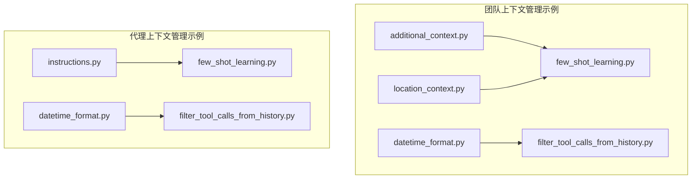
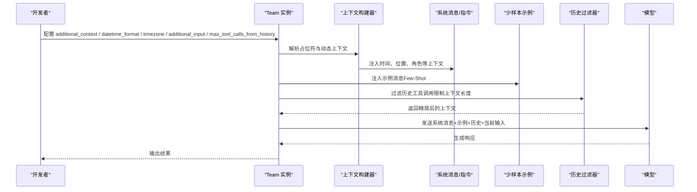
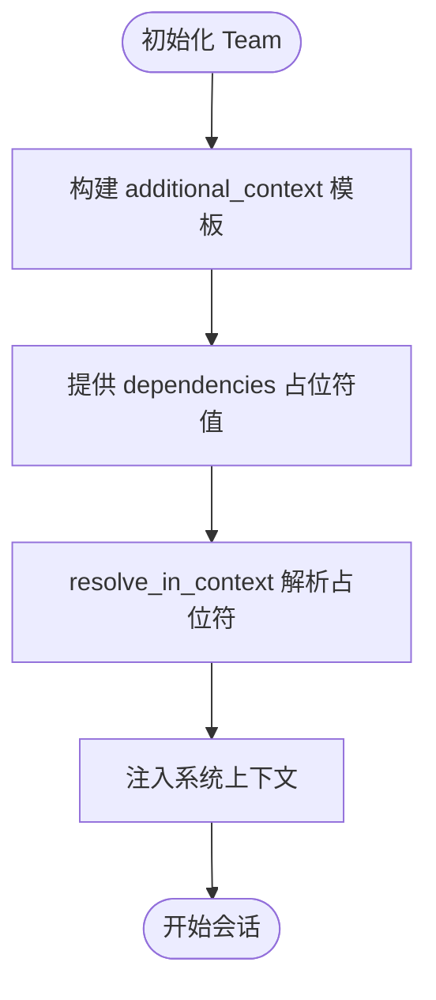
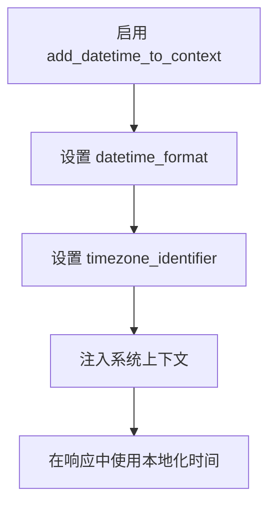
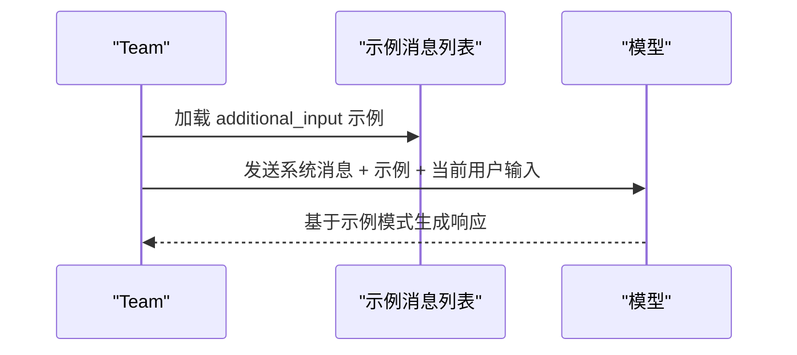
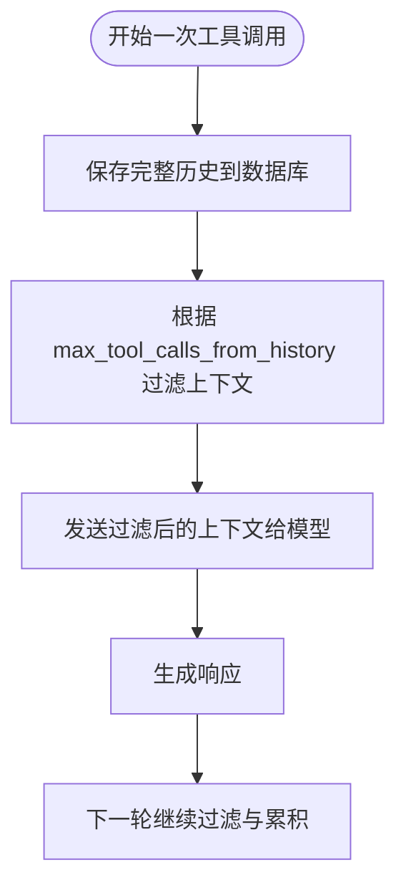
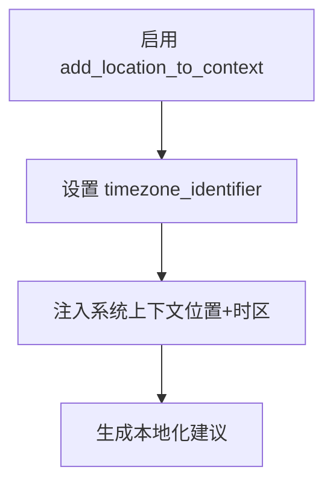
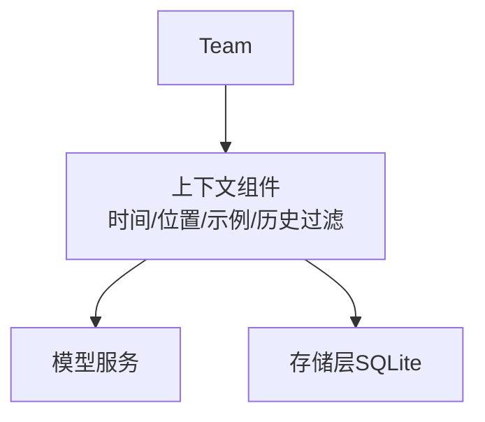

# 团队上下文管理

<cite>
**本文引用的文件**
- [cookbook/03_teams/09_context_management/additional_context.py](file://cookbook/03_teams/09_context_management/additional_context.py)
- [cookbook/03_teams/09_context_management/datetime_format.py](file://cookbook/03_teams/09_context_management/datetime_format.py)
- [cookbook/03_teams/09_context_management/few_shot_learning.py](file://cookbook/03_teams/09_context_management/few_shot_learning.py)
- [cookbook/03_teams/09_context_management/filter_tool_calls_from_history.py](file://cookbook/03_teams/09_context_management/filter_tool_calls_from_history.py)
- [cookbook/03_teams/09_context_management/location_context.py](file://cookbook/03_teams/09_context_management/location_context.py)
- [cookbook/02_agents/03_context_management/instructions.py](file://cookbook/02_agents/03_context_management/instructions.py)
- [cookbook/02_agents/03_context_management/datetime_format.py](file://cookbook/02_agents/03_context_management/datetime_format.py)
- [cookbook/02_agents/03_context_management/few_shot_learning.py](file://cookbook/02_agents/03_context_management/few_shot_learning.py)
- [cookbook/02_agents/03_context_management/filter_tool_calls_from_history.py](file://cookbook/02_agents/03_context_management/filter_tool_calls_from_history.py)
</cite>

## 目录
1. [简介](#简介)
2. [项目结构](#项目结构)
3. [核心组件](#核心组件)
4. [架构总览](#架构总览)
5. [详细组件分析](#详细组件分析)
6. [依赖关系分析](#依赖关系分析)
7. [性能考量](#性能考量)
8. [故障排查指南](#故障排查指南)
9. [结论](#结论)
10. [附录](#附录)

## 简介
本文件围绕“团队上下文管理”主题，系统梳理并解释以下能力在团队协作中的应用与落地方式：
- 上下文的创建、维护与优化：通过额外上下文注入、占位符解析、系统消息定制等手段，确保团队始终基于准确、相关且最新的背景信息进行决策与输出。
- 日期时间格式处理：统一本地化、时区转换与显示格式，保证跨时区团队协作的一致性与可读性。
- 少样本学习（Few-Shot）：通过示例注入与学习策略，提升团队在客户服务、问题分类与响应模式上的稳定性与一致性。
- 工具调用历史过滤：在控制上下文长度的同时保留完整运行历史，兼顾成本与可追溯性。
- 位置上下文管理：结合地理位置与时区，为跨区域协作提供本地化建议与时间协调。
- 上下文压缩与性能优化：在长对话与多轮交互中保持高效与稳定。
- 最佳实践与协作效果优化：总结常见陷阱与改进策略，帮助团队持续提升协作质量。

## 项目结构
本仓库以“食谱式教程（cookbook）”组织了大量可直接运行的示例，涵盖代理（Agent）、团队（Team）、上下文管理、学习与历史过滤等多个维度。与“团队上下文管理”直接相关的示例集中在：
- 团队上下文管理示例：additional_context、datetime_format、few_shot_learning、filter_tool_calls_from_history、location_context
- 代理上下文管理示例：instructions、datetime_format、few_shot_learning、filter_tool_calls_from_history

这些示例展示了如何在 Team/Agent 层面配置上下文参数，并通过实际运行观察效果。

**图表来源**
- [cookbook/03_teams/09_context_management/additional_context.py:1-51](file://cookbook/03_teams/09_context_management/additional_context.py#L1-L51)
- [cookbook/03_teams/09_context_management/datetime_format.py:1-40](file://cookbook/03_teams/09_context_management/datetime_format.py#L1-L40)
- [cookbook/03_teams/09_context_management/few_shot_learning.py:1-121](file://cookbook/03_teams/09_context_management/few_shot_learning.py#L1-L121)
- [cookbook/03_teams/09_context_management/filter_tool_calls_from_history.py:1-93](file://cookbook/03_teams/09_context_management/filter_tool_calls_from_history.py#L1-L93)
- [cookbook/03_teams/09_context_management/location_context.py:1-49](file://cookbook/03_teams/09_context_management/location_context.py#L1-L49)
- [cookbook/02_agents/03_context_management/instructions.py:1-27](file://cookbook/02_agents/03_context_management/instructions.py#L1-L27)
- [cookbook/02_agents/03_context_management/datetime_format.py:1-26](file://cookbook/02_agents/03_context_management/datetime_format.py#L1-L26)
- [cookbook/02_agents/03_context_management/few_shot_learning.py:1-100](file://cookbook/02_agents/03_context_management/few_shot_learning.py#L1-L100)
- [cookbook/02_agents/03_context_management/filter_tool_calls_from_history.py:1-104](file://cookbook/02_agents/03_context_management/filter_tool_calls_from_history.py#L1-L104)

**章节来源**
- [cookbook/03_teams/09_context_management/additional_context.py:1-51](file://cookbook/03_teams/09_context_management/additional_context.py#L1-L51)
- [cookbook/03_teams/09_context_management/datetime_format.py:1-40](file://cookbook/03_teams/09_context_management/datetime_format.py#L1-L40)
- [cookbook/03_teams/09_context_management/few_shot_learning.py:1-121](file://cookbook/03_teams/09_context_management/few_shot_learning.py#L1-L121)
- [cookbook/03_teams/09_context_management/filter_tool_calls_from_history.py:1-93](file://cookbook/03_teams/09_context_management/filter_tool_calls_from_history.py#L1-L93)
- [cookbook/03_teams/09_context_management/location_context.py:1-49](file://cookbook/03_teams/09_context_management/location_context.py#L1-L49)
- [cookbook/02_agents/03_context_management/instructions.py:1-27](file://cookbook/02_agents/03_context_management/instructions.py#L1-L27)
- [cookbook/02_agents/03_context_management/datetime_format.py:1-26](file://cookbook/02_agents/03_context_management/datetime_format.py#L1-L26)
- [cookbook/02_agents/03_context_management/few_shot_learning.py:1-100](file://cookbook/02_agents/03_context_management/few_shot_learning.py#L1-L100)
- [cookbook/02_agents/03_context_management/filter_tool_calls_from_history.py:1-104](file://cookbook/02_agents/03_context_management/filter_tool_calls_from_history.py#L1-L104)

## 核心组件
- 额外上下文注入与占位符解析：通过 Team 的 additional_context 与 resolve_in_context，允许在运行时注入动态上下文（如角色、区域），并在系统提示中解析占位符，使输出更贴合受众与场景。
- 日期时间格式与本地化：通过 add_datetime_to_context、datetime_format、timezone_identifier 控制时间注入格式与时区标识，确保跨时区团队对当前时间有一致理解。
- 少样本学习（Few-Shot）：通过 additional_input 注入示例消息，引导模型遵循既定模式，提升响应一致性与专业度。
- 工具调用历史过滤：通过 max_tool_calls_from_history 控制进入上下文的历史工具调用数量，降低上下文长度与成本，同时保留数据库中的完整历史以便审计与复盘。
- 位置上下文与时区：通过 add_location_to_context 与 timezone_identifier 提供地理位置与时区信息，辅助生成本地化的建议与时间协调。
- 自定义系统消息与指令：通过 instructions 与系统消息配置，明确角色定位、流程与约束，确保团队行为与预期一致。

**章节来源**
- [cookbook/03_teams/09_context_management/additional_context.py:28-40](file://cookbook/03_teams/09_context_management/additional_context.py#L28-L40)
- [cookbook/03_teams/09_context_management/datetime_format.py:24-31](file://cookbook/03_teams/09_context_management/datetime_format.py#L24-L31)
- [cookbook/03_teams/09_context_management/few_shot_learning.py:93-105](file://cookbook/03_teams/09_context_management/few_shot_learning.py#L93-L105)
- [cookbook/03_teams/09_context_management/filter_tool_calls_from_history.py:44-71](file://cookbook/03_teams/09_context_management/filter_tool_calls_from_history.py#L44-L71)
- [cookbook/03_teams/09_context_management/location_context.py:28-38](file://cookbook/03_teams/09_context_management/location_context.py#L28-L38)
- [cookbook/02_agents/03_context_management/instructions.py:14-18](file://cookbook/02_agents/03_context_management/instructions.py#L14-L18)

## 架构总览
下图展示了团队上下文管理的关键路径：从 Team 初始化到运行时上下文构建、示例注入、历史过滤与最终输出。

**图表来源**
- [cookbook/03_teams/09_context_management/additional_context.py:28-40](file://cookbook/03_teams/09_context_management/additional_context.py#L28-L40)
- [cookbook/03_teams/09_context_management/datetime_format.py:24-31](file://cookbook/03_teams/09_context_management/datetime_format.py#L24-L31)
- [cookbook/03_teams/09_context_management/few_shot_learning.py:93-105](file://cookbook/03_teams/09_context_management/few_shot_learning.py#L93-L105)
- [cookbook/03_teams/09_context_management/filter_tool_calls_from_history.py:44-71](file://cookbook/03_teams/09_context_management/filter_tool_calls_from_history.py#L44-L71)

## 详细组件分析

### 额外上下文注入与占位符解析
- 功能要点
  - 使用 additional_context 定义模板字符串，包含占位符（如 {role}、{region}）。
  - 通过 dependencies 提供占位符值，在运行时解析并注入系统上下文。
  - resolve_in_context 控制是否在上下文中解析占位符，确保输出贴合受众与场景。
- 典型应用场景
  - 针对不同地区或角色的内部流程说明，自动调整语言风格与责任归属。
  - 在合规或运营支持场景中，快速注入组织政策与时限要求。
- 示例参考
  - [团队额外上下文示例:28-40](file://cookbook/03_teams/09_context_management/additional_context.py#L28-L40)
  - [代理指令示例:14-18](file://cookbook/02_agents/03_context_management/instructions.py#L14-L18)

**图表来源**
- [cookbook/03_teams/09_context_management/additional_context.py:28-40](file://cookbook/03_teams/09_context_management/additional_context.py#L28-L40)

**章节来源**
- [cookbook/03_teams/09_context_management/additional_context.py:28-40](file://cookbook/03_teams/09_context_management/additional_context.py#L28-L40)
- [cookbook/02_agents/03_context_management/instructions.py:14-18](file://cookbook/02_agents/03_context_management/instructions.py#L14-L18)

### 日期时间格式与本地化
- 功能要点
  - add_datetime_to_context 启用时间注入。
  - datetime_format 自定义显示格式（如人类可读或 ISO 8601）。
  - timezone_identifier 指定时区标识，确保跨时区团队对当前时间有一致理解。
- 典型应用场景
  - 跨时区会议安排、任务截止时间提醒与日志记录。
  - 需要精确时间戳的审计与排障场景。
- 示例参考
  - [团队时间格式示例:24-31](file://cookbook/03_teams/09_context_management/datetime_format.py#L24-L31)
  - [代理时间格式示例:14-19](file://cookbook/02_agents/03_context_management/datetime_format.py#L14-L19)

**图表来源**
- [cookbook/03_teams/09_context_management/datetime_format.py:24-31](file://cookbook/03_teams/09_context_management/datetime_format.py#L24-L31)
- [cookbook/02_agents/03_context_management/datetime_format.py:14-19](file://cookbook/02_agents/03_context_management/datetime_format.py#L14-L19)

**章节来源**
- [cookbook/03_teams/09_context_management/datetime_format.py:24-31](file://cookbook/03_teams/09_context_management/datetime_format.py#L24-L31)
- [cookbook/02_agents/03_context_management/datetime_format.py:14-19](file://cookbook/02_agents/03_context_management/datetime_format.py#L14-L19)

### 少样本学习（Few-Shot）
- 功能要点
  - 通过 additional_input 注入示例消息（Message 列表），引导模型遵循既定模式。
  - 示例覆盖常见问题类型与解决步骤，提升响应一致性与专业度。
- 典型应用场景
  - 客户支持：密码重置、账单争议、技术故障等场景的标准化处理。
  - 团队协作：在复杂问题上快速形成共识与行动清单。
- 示例参考
  - [团队少样本学习示例:93-105](file://cookbook/03_teams/09_context_management/few_shot_learning.py#L93-L105)
  - [代理少样本学习示例:83-97](file://cookbook/02_agents/03_context_management/few_shot_learning.py#L83-L97)

**图表来源**
- [cookbook/03_teams/09_context_management/few_shot_learning.py:93-105](file://cookbook/03_teams/09_context_management/few_shot_learning.py#L93-L105)
- [cookbook/02_agents/03_context_management/few_shot_learning.py#L83-L97:83-97](file://cookbook/02_agents/03_context_management/few_shot_learning.py#L83-L97)

**章节来源**
- [cookbook/03_teams/09_context_management/few_shot_learning.py:93-105](file://cookbook/03_teams/09_context_management/few_shot_learning.py#L93-L105)
- [cookbook/02_agents/03_context_management/few_shot_learning.py:83-97](file://cookbook/02_agents/03_context_management/few_shot_learning.py#L83-L97)

### 工具调用历史过滤
- 功能要点
  - 通过 max_tool_calls_from_history 限制进入上下文的历史工具调用数量，降低上下文长度与成本。
  - 数据库中仍保存完整历史，便于审计与复盘；仅对模型输入进行过滤。
- 典型应用场景
  - 长对话与高频率工具调用场景，避免上下文溢出与昂贵的 token 消耗。
  - 需要平衡“上下文效率”与“历史完整性”的工作流。
- 示例参考
  - [团队工具调用历史过滤示例:44-71](file://cookbook/03_teams/09_context_management/filter_tool_calls_from_history.py#L44-L71)
  - [代理工具调用历史过滤示例:42-52](file://cookbook/02_agents/03_context_management/filter_tool_calls_from_history.py#L42-L52)

**图表来源**
- [cookbook/03_teams/09_context_management/filter_tool_calls_from_history.py:44-71](file://cookbook/03_teams/09_context_management/filter_tool_calls_from_history.py#L44-L71)
- [cookbook/02_agents/03_context_management/filter_tool_calls_from_history.py:42-52](file://cookbook/02_agents/03_context_management/filter_tool_calls_from_history.py#L42-L52)

**章节来源**
- [cookbook/03_teams/09_context_management/filter_tool_calls_from_history.py:44-71](file://cookbook/03_teams/09_context_management/filter_tool_calls_from_history.py#L44-L71)
- [cookbook/02_agents/03_context_management/filter_tool_calls_from_history.py:42-52](file://cookbook/02_agents/03_context_management/filter_tool_calls_from_history.py#L42-L52)

### 位置上下文与时区
- 功能要点
  - add_location_to_context 启用地理位置与时区注入。
  - timezone_identifier 指定时区，辅助生成本地化建议与时间协调。
- 典型应用场景
  - 跨区域旅行规划、会议协调与资源调度。
  - 需要考虑季节、气候与当地工作节奏的建议场景。
- 示例参考
  - [团队位置上下文示例:28-38](file://cookbook/03_teams/09_context_management/location_context.py#L28-L38)
  - [代理指令示例:14-18](file://cookbook/02_agents/03_context_management/instructions.py#L14-L18)

**图表来源**
- [cookbook/03_teams/09_context_management/location_context.py:28-38](file://cookbook/03_teams/09_context_management/location_context.py#L28-L38)

**章节来源**
- [cookbook/03_teams/09_context_management/location_context.py:28-38](file://cookbook/03_teams/09_context_management/location_context.py#L28-L38)
- [cookbook/02_agents/03_context_management/instructions.py:14-18](file://cookbook/02_agents/03_context_management/instructions.py#L14-L18)

### 自定义系统消息与指令
- 功能要点
  - 通过 instructions 明确角色定位、流程与约束，确保团队行为与预期一致。
  - 可与上述上下文组件协同，形成完整的系统提示。
- 典型应用场景
  - 角色分工清晰的工作流、合规审查与风险控制。
  - 需要强调特定价值观或沟通风格的协作场景。
- 示例参考
  - [代理指令示例:14-18](file://cookbook/02_agents/03_context_management/instructions.py#L14-L18)

**章节来源**
- [cookbook/02_agents/03_context_management/instructions.py:14-18](file://cookbook/02_agents/03_context_management/instructions.py#L14-L18)

## 依赖关系分析
- 组件耦合
  - Team 作为上下文管理的核心入口，依赖各上下文组件（时间、位置、示例、历史过滤）共同构成最终提示。
  - 历史过滤与数据库存储解耦，既保证成本可控又保留审计能力。
- 外部依赖
  - 模型服务（如 OpenAI Responses）负责执行上下文到响应的映射。
  - 存储层（如 SQLite）用于持久化会话历史，支撑历史过滤与审计。
- 潜在循环依赖
  - 示例中未见循环导入；上下文组件以配置形式注入，无直接循环调用。

**图表来源**
- [cookbook/03_teams/09_context_management/filter_tool_calls_from_history.py:44-71](file://cookbook/03_teams/09_context_management/filter_tool_calls_from_history.py#L44-L71)
- [cookbook/02_agents/03_context_management/filter_tool_calls_from_history.py:42-52](file://cookbook/02_agents/03_context_management/filter_tool_calls_from_history.py#L42-L52)

**章节来源**
- [cookbook/03_teams/09_context_management/filter_tool_calls_from_history.py:44-71](file://cookbook/03_teams/09_context_management/filter_tool_calls_from_history.py#L44-L71)
- [cookbook/02_agents/03_context_management/filter_tool_calls_from_history.py:42-52](file://cookbook/02_agents/03_context_management/filter_tool_calls_from_history.py#L42-L52)

## 性能考量
- 上下文长度控制
  - 使用 max_tool_calls_from_history 限制进入模型输入的历史工具调用数量，显著降低 token 成本。
  - 对于长对话，建议定期清理无关历史，保留关键决策点与结果。
- 时间与位置注入的成本
  - 合理设置 datetime_format 与 timezone_identifier，避免冗长的时间描述导致上下文膨胀。
- 示例注入的权衡
  - Few-Shot 示例有助于提升一致性，但过多示例会增加上下文长度；建议精选代表性示例。
- 存储与检索
  - 将完整历史存入数据库，按需检索；仅在必要时将历史片段拼接到上下文中。

[本节为通用指导，无需具体文件分析]

## 故障排查指南
- 问题：上下文过长导致成本过高或超限
  - 措施：启用 max_tool_calls_from_history 并设置合理阈值；定期归档旧历史。
  - 参考：[团队历史过滤示例:44-71](file://cookbook/03_teams/09_context_management/filter_tool_calls_from_history.py#L44-L71)，[代理历史过滤示例:42-52](file://cookbook/02_agents/03_context_management/filter_tool_calls_from_history.py#L42-L52)
- 问题：跨时区时间不一致
  - 措施：统一 timezone_identifier；在 datetime_format 中选择易读格式。
  - 参考：[团队时间格式示例:24-31](file://cookbook/03_teams/09_context_management/datetime_format.py#L24-L31)，[代理时间格式示例:14-19](file://cookbook/02_agents/03_context_management/datetime_format.py#L14-L19)
- 问题：输出不符合预期或缺乏一致性
  - 措施：完善 additional_input 示例；明确 instructions；使用 resolve_in_context 确保占位符正确解析。
  - 参考：[团队少样本学习示例:93-105](file://cookbook/03_teams/09_context_management/few_shot_learning.py#L93-L105)，[代理少样本学习示例:83-97](file://cookbook/02_agents/03_context_management/few_shot_learning.py#L83-L97)，[团队额外上下文示例:28-40](file://cookbook/03_teams/09_context_management/additional_context.py#L28-L40)
- 问题：位置与时区信息缺失
  - 措施：启用 add_location_to_context 与时区标识；在系统消息中显式提及本地化建议。
  - 参考：[团队位置上下文示例:28-38](file://cookbook/03_teams/09_context_management/location_context.py#L28-L38)

**章节来源**
- [cookbook/03_teams/09_context_management/filter_tool_calls_from_history.py:44-71](file://cookbook/03_teams/09_context_management/filter_tool_calls_from_history.py#L44-L71)
- [cookbook/02_agents/03_context_management/filter_tool_calls_from_history.py:42-52](file://cookbook/02_agents/03_context_management/filter_tool_calls_from_history.py#L42-L52)
- [cookbook/03_teams/09_context_management/datetime_format.py:24-31](file://cookbook/03_teams/09_context_management/datetime_format.py#L24-L31)
- [cookbook/02_agents/03_context_management/datetime_format.py:14-19](file://cookbook/02_agents/03_context_management/datetime_format.py#L14-L19)
- [cookbook/03_teams/09_context_management/few_shot_learning.py:93-105](file://cookbook/03_teams/09_context_management/few_shot_learning.py#L93-L105)
- [cookbook/02_agents/03_context_management/few_shot_learning.py:83-97](file://cookbook/02_agents/03_context_management/few_shot_learning.py#L83-L97)
- [cookbook/03_teams/09_context_management/additional_context.py:28-40](file://cookbook/03_teams/09_context_management/additional_context.py#L28-L40)
- [cookbook/03_teams/09_context_management/location_context.py:28-38](file://cookbook/03_teams/09_context_management/location_context.py#L28-L38)

## 结论
通过在团队层面系统地引入与管理上下文，可以显著提升协作的准确性、一致性和效率。结合以下实践，可进一步优化团队协作效果：
- 使用额外上下文与占位符解析，确保输出贴合受众与场景。
- 统一时间与时区格式，减少跨时区沟通成本。
- 通过少样本学习固化高质量响应模式，降低不确定性。
- 采用历史过滤策略，在成本与可追溯性之间取得平衡。
- 引入位置与时区上下文，增强本地化建议与时间协调能力。
- 持续评估与迭代上下文配置，形成团队最佳实践。

[本节为总结性内容，无需具体文件分析]

## 附录
- 代码示例路径（不含代码内容，仅提供路径）
  - 额外上下文注入与占位符解析
    - [团队额外上下文示例:28-40](file://cookbook/03_teams/09_context_management/additional_context.py#L28-L40)
    - [代理指令示例:14-18](file://cookbook/02_agents/03_context_management/instructions.py#L14-L18)
  - 日期时间格式处理
    - [团队时间格式示例:24-31](file://cookbook/03_teams/09_context_management/datetime_format.py#L24-L31)
    - [代理时间格式示例:14-19](file://cookbook/02_agents/03_context_management/datetime_format.py#L14-L19)
  - 少样本学习配置
    - [团队少样本学习示例:93-105](file://cookbook/03_teams/09_context_management/few_shot_learning.py#L93-L105)
    - [代理少样本学习示例:83-97](file://cookbook/02_agents/03_context_management/few_shot_learning.py#L83-L97)
  - 工具调用历史过滤
    - [团队历史过滤示例:44-71](file://cookbook/03_teams/09_context_management/filter_tool_calls_from_history.py#L44-L71)
    - [代理历史过滤示例:42-52](file://cookbook/02_agents/03_context_management/filter_tool_calls_from_history.py#L42-L52)
  - 位置上下文管理
    - [团队位置上下文示例:28-38](file://cookbook/03_teams/09_context_management/location_context.py#L28-L38)
    - [代理指令示例:14-18](file://cookbook/02_agents/03_context_management/instructions.py#L14-L18)