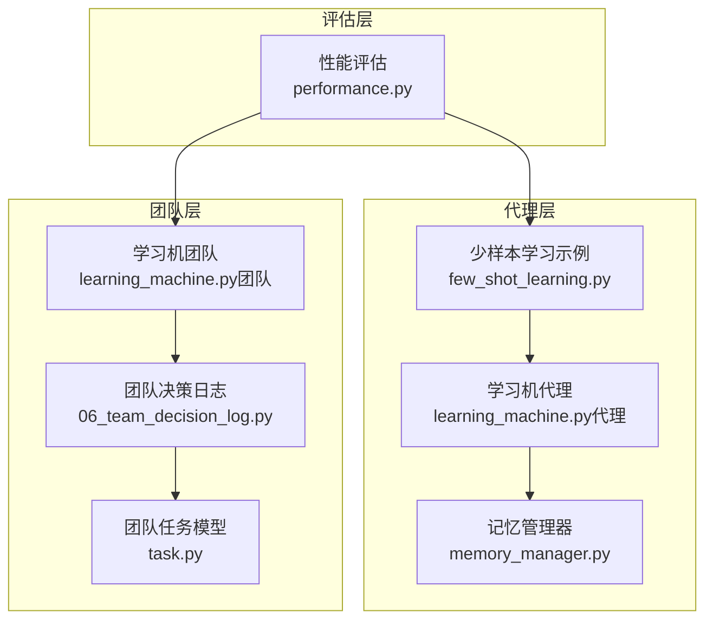
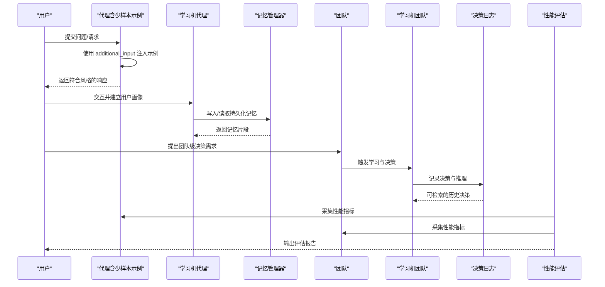
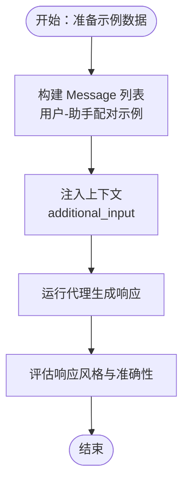
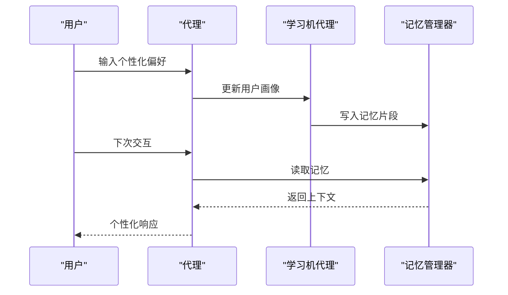
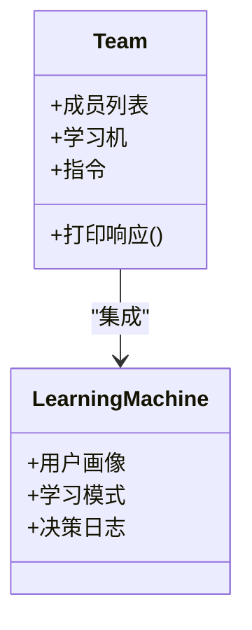
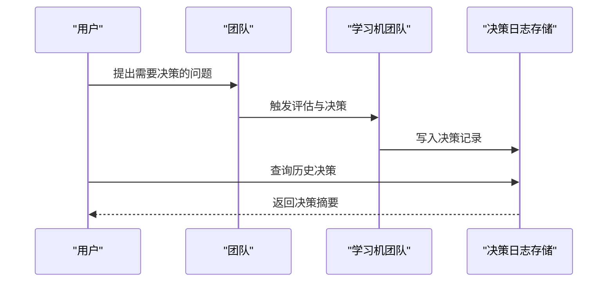
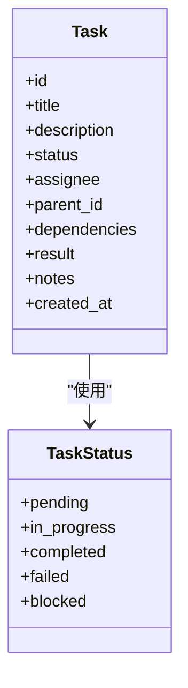
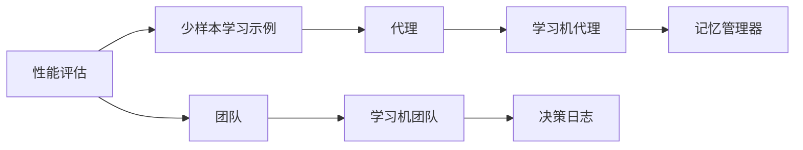
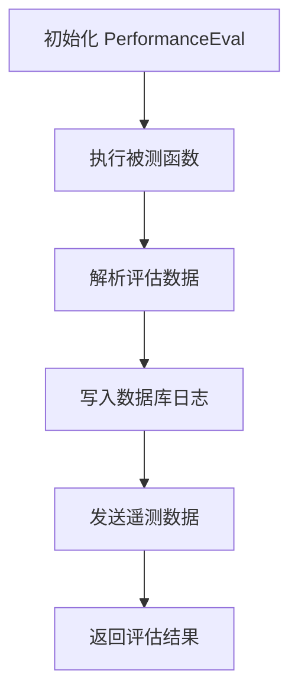

# 少样本学习应用

<cite>
**本文引用的文件**
- [few_shot_learning.py](file://cookbook/02_agents/03_context_management/few_shot_learning.py)
- [few_shot_learning.md](file://cookbook/02_agents/03_context_management/few_shot_learning.md)
- [learning_machine.py（代理）](file://cookbook/02_agents/06_memory_and_learning/learning_machine.py)
- [memory_manager.py](file://cookbook/02_agents/06_memory_and_learning/memory_manager.py)
- [learning_machine.py（团队）](file://cookbook/03_teams/06_memory/learning_machine.py)
- [06_team_decision_log.py](file://cookbook/03_teams/12_learning/06_team_decision_log.py)
- [performance.py](file://libs/agno/agno/eval/performance.py)
- [task.py](file://libs/agno/agno/team/task.py)
</cite>

## 目录
1. [简介](#简介)
2. [项目结构](#项目结构)
3. [核心组件](#核心组件)
4. [架构总览](#架构总览)
5. [组件详解](#组件详解)
6. [依赖关系分析](#依赖关系分析)
7. [性能与效果评估](#性能与效果评估)
8. [故障排查指南](#故障排查指南)
9. [结论](#结论)
10. [附录](#附录)

## 简介
本文件面向团队在少样本学习场景下的落地实践，系统阐述如何在团队协作中应用少样本学习技术，包括示例数据准备、学习策略选择、效果评估与持续优化。文档以仓库中的“示例-少样本学习”“学习机-记忆与学习”“团队学习-决策日志”等样例为依据，结合团队任务与评估工具，给出可操作的实施路径与可视化流程，帮助团队在任务分配、决策支持与行为预测等方向提升智能决策能力。

## 项目结构
围绕少样本学习与团队智能决策，相关示例主要分布在以下路径：
- 代理上下文管理与少样本学习：cookbook/02_agents/03_context_management/few_shot_learning.*
- 代理记忆与学习：cookbook/02_agents/06_memory_and_learning/*
- 团队学习与决策日志：cookbook/03_teams/06_memory/* 与 cookbook/03_teams/12_learning/*
- 团队任务模型：libs/agno/agno/team/task.py
- 性能评估工具：libs/agno/agno/eval/performance.py

**图表来源**
- [few_shot_learning.py:1-100](file://cookbook/02_agents/03_context_management/few_shot_learning.py#L1-L100)
- [learning_machine.py（代理）:1-50](file://cookbook/02_agents/06_memory_and_learning/learning_machine.py#L1-L50)
- [memory_manager.py:1-48](file://cookbook/02_agents/06_memory_and_learning/memory_manager.py#L1-L48)
- [learning_machine.py（团队）:1-67](file://cookbook/03_teams/06_memory/learning_machine.py#L1-L67)
- [06_team_decision_log.py:1-113](file://cookbook/03_teams/12_learning/06_team_decision_log.py#L1-L113)
- [task.py:1-41](file://libs/agno/agno/team/task.py#L1-L41)
- [performance.py:598-779](file://libs/agno/agno/eval/performance.py#L598-L779)

**章节来源**
- [few_shot_learning.py:1-100](file://cookbook/02_agents/03_context_management/few_shot_learning.py#L1-L100)
- [few_shot_learning.md:1-149](file://cookbook/02_agents/03_context_management/few_shot_learning.md#L1-L149)
- [learning_machine.py（代理）:1-50](file://cookbook/02_agents/06_memory_and_learning/learning_machine.py#L1-L50)
- [memory_manager.py:1-48](file://cookbook/02_agents/06_memory_and_learning/memory_manager.py#L1-L48)
- [learning_machine.py（团队）:1-67](file://cookbook/03_teams/06_memory/learning_machine.py#L1-L67)
- [06_team_decision_log.py:1-113](file://cookbook/03_teams/12_learning/06_team_decision_log.py#L1-L113)
- [task.py:1-41](file://libs/agno/agno/team/task.py#L1-L41)
- [performance.py:598-779](file://libs/agno/agno/eval/performance.py#L598-L779)

## 核心组件
- 少样本学习注入（Agent 上下文）：通过 additional_input 注入少量高质量示例，引导模型遵循特定风格与格式输出。
- 学习机（LearningMachine）：为代理或团队提供用户画像、决策日志、知识沉淀等学习能力，支持 AGENTIC 模式。
- 记忆管理器（MemoryManager）：为代理提供跨会话持久化记忆，支撑个性化与上下文增强。
- 团队任务与决策日志：将团队协作中的关键决策结构化记录，便于回溯、审计与持续优化。
- 性能评估（PerformanceEval）：提供运行时长、内存增长等指标采集，用于评估与优化。

**章节来源**
- [few_shot_learning.py:15-77](file://cookbook/02_agents/03_context_management/few_shot_learning.py#L15-L77)
- [few_shot_learning.md:9-22](file://cookbook/02_agents/03_context_management/few_shot_learning.md#L9-L22)
- [learning_machine.py（代理）:21-29](file://cookbook/02_agents/06_memory_and_learning/learning_machine.py#L21-L29)
- [memory_manager.py:18-29](file://cookbook/02_agents/06_memory_and_learning/memory_manager.py#L18-L29)
- [learning_machine.py（团队）:37-46](file://cookbook/03_teams/06_memory/learning_machine.py#L37-L46)
- [06_team_decision_log.py:48-68](file://cookbook/03_teams/12_learning/06_team_decision_log.py#L48-L68)
- [performance.py:598-779](file://libs/agno/agno/eval/performance.py#L598-L779)

## 架构总览
下图展示了从“示例注入”到“团队学习与评估”的整体流程，体现少样本学习在团队智能决策中的位置与作用。

**图表来源**
- [few_shot_learning.py:83-99](file://cookbook/02_agents/03_context_management/few_shot_learning.py#L83-L99)
- [learning_machine.py（代理）:34-49](file://cookbook/02_agents/06_memory_and_learning/learning_machine.py#L34-L49)
- [memory_manager.py:34-47](file://cookbook/02_agents/06_memory_and_learning/memory_manager.py#L34-L47)
- [learning_machine.py（团队）:51-66](file://cookbook/03_teams/06_memory/learning_machine.py#L51-L66)
- [06_team_decision_log.py:82-112](file://cookbook/03_teams/12_learning/06_team_decision_log.py#L82-L112)
- [performance.py:598-779](file://libs/agno/agno/eval/performance.py#L598-L779)

## 组件详解

### 少样本学习注入（Agent）
- 示例数据准备：以 Message 形式组织少量高质量 user/assistant 对话示例，覆盖典型问题与标准回答格式。
- 学习策略：通过 additional_input 将示例注入系统提示与用户消息之间，使模型快速适配团队风格。
- 效果评估：结合性能评估工具观察响应一致性与质量变化。

**图表来源**
- [few_shot_learning.py:15-77](file://cookbook/02_agents/03_context_management/few_shot_learning.py#L15-L77)
- [few_shot_learning.md:125-149](file://cookbook/02_agents/03_context_management/few_shot_learning.md#L125-L149)

**章节来源**
- [few_shot_learning.py:15-77](file://cookbook/02_agents/03_context_management/few_shot_learning.py#L15-L77)
- [few_shot_learning.md:9-22](file://cookbook/02_agents/03_context_management/few_shot_learning.md#L9-L22)

### 学习机（代理）
- 用户画像与个性化：通过 LearningMachine 的 AGENTIC 模式，基于交互历史提取用户偏好，持续优化输出风格。
- 记忆协同：结合 MemoryManager 进行跨会话记忆存储与检索，提升上下文连贯性。

**图表来源**
- [learning_machine.py（代理）:21-29](file://cookbook/02_agents/06_memory_and_learning/learning_machine.py#L21-L29)
- [memory_manager.py:18-29](file://cookbook/02_agents/06_memory_and_learning/memory_manager.py#L18-L29)

**章节来源**
- [learning_machine.py（代理）:21-29](file://cookbook/02_agents/06_memory_and_learning/learning_machine.py#L21-L29)
- [memory_manager.py:18-29](file://cookbook/02_agents/06_memory_and_learning/memory_manager.py#L18-L29)

### 学习机（团队）
- 团队级学习：通过 Team 集成 LearningMachine，实现成员间的知识共享与经验沉淀。
- 用户画像与团队偏好：同样采用 AGENTIC 模式，支持跨成员的个性化与一致性。

**图表来源**
- [learning_machine.py（团队）:37-46](file://cookbook/03_teams/06_memory/learning_machine.py#L37-L46)

**章节来源**
- [learning_machine.py（团队）:37-46](file://cookbook/03_teams/06_memory/learning_machine.py#L37-L46)

### 团队决策日志
- 决策记录：在团队讨论与决策过程中，使用决策日志工具记录“做了什么、为什么做、考虑了哪些替代方案”。
- 可追溯性：通过 DecisionLogStore 支持按会话检索与审计，辅助持续改进。

**图表来源**
- [06_team_decision_log.py:48-68](file://cookbook/03_teams/12_learning/06_team_decision_log.py#L48-L68)
- [06_team_decision_log.py:92-112](file://cookbook/03_teams/12_learning/06_team_decision_log.py#L92-L112)

**章节来源**
- [06_team_decision_log.py:48-68](file://cookbook/03_teams/12_learning/06_team_decision_log.py#L48-L68)
- [06_team_decision_log.py:92-112](file://cookbook/03_teams/12_learning/06_team_decision_log.py#L92-L112)

### 团队任务模型
- 任务状态：支持 pending、in_progress、completed、failed、blocked 等状态流转。
- 分配与依赖：支持 assignee、parent_id、dependencies 等字段，便于复杂任务编排与追踪。

**图表来源**
- [task.py:22-41](file://libs/agno/agno/team/task.py#L22-L41)

**章节来源**
- [task.py:22-41](file://libs/agno/agno/team/task.py#L22-L41)

## 依赖关系分析
- 组件耦合：少样本学习示例与代理运行强耦合；学习机与记忆管理器弱耦合但可组合；团队学习机与决策日志强耦合。
- 外部依赖：OpenAIResponses 模型、Sqlite/Postgres 数据库、评估工具链。
- 潜在循环依赖：示例与评估工具相互独立，不构成循环；学习机与存储通过接口解耦。

**图表来源**
- [few_shot_learning.py:83-99](file://cookbook/02_agents/03_context_management/few_shot_learning.py#L83-L99)
- [learning_machine.py（代理）:21-29](file://cookbook/02_agents/06_memory_and_learning/learning_machine.py#L21-L29)
- [memory_manager.py:18-29](file://cookbook/02_agents/06_memory_and_learning/memory_manager.py#L18-L29)
- [learning_machine.py（团队）:37-46](file://cookbook/03_teams/06_memory/learning_machine.py#L37-L46)
- [06_team_decision_log.py:48-68](file://cookbook/03_teams/12_learning/06_team_decision_log.py#L48-L68)
- [performance.py:598-779](file://libs/agno/agno/eval/performance.py#L598-L779)

**章节来源**
- [few_shot_learning.py:83-99](file://cookbook/02_agents/03_context_management/few_shot_learning.py#L83-L99)
- [learning_machine.py（代理）:21-29](file://cookbook/02_agents/06_memory_and_learning/learning_machine.py#L21-L29)
- [memory_manager.py:18-29](file://cookbook/02_agents/06_memory_and_learning/memory_manager.py#L18-L29)
- [learning_machine.py（团队）:37-46](file://cookbook/03_teams/06_memory/learning_machine.py#L37-L46)
- [06_team_decision_log.py:48-68](file://cookbook/03_teams/12_learning/06_team_decision_log.py#L48-L68)
- [performance.py:598-779](file://libs/agno/agno/eval/performance.py#L598-L779)

## 性能与效果评估
- 性能评估：通过 PerformanceEval 采集运行时长、内存增长等指标，支持同步与异步执行，并可写入数据库与遥测上报。
- 评估流程：初始化评估器、执行被测函数、解析结果、写入日志与遥测、返回评估结果。
- 适用范围：可用于少样本学习注入前后对比、学习机启用与否对比、团队协作效率对比等。

**图表来源**
- [performance.py:598-779](file://libs/agno/agno/eval/performance.py#L598-L779)

**章节来源**
- [performance.py:598-779](file://libs/agno/agno/eval/performance.py#L598-L779)

## 故障排查指南
- 少样本示例无效：检查 additional_input 是否正确传入 Message 列表，确保 role 与 content 合法。
- 学习机未生效：确认 LearningMachine 已正确初始化并启用 AGENTIC 模式，核对用户 ID 与会话 ID。
- 决策日志为空：确认 DecisionLogConfig 已开启 agent_can_save/search，检查数据库连接与权限。
- 性能评估异常：检查评估器参数（如 measure_memory、measure_runtime），确认数据库与遥测配置可用。

**章节来源**
- [few_shot_learning.py:83-99](file://cookbook/02_agents/03_context_management/few_shot_learning.py#L83-L99)
- [learning_machine.py（代理）:21-29](file://cookbook/02_agents/06_memory_and_learning/learning_machine.py#L21-L29)
- [06_team_decision_log.py:48-68](file://cookbook/03_teams/12_learning/06_team_decision_log.py#L48-L68)
- [performance.py:598-779](file://libs/agno/agno/eval/performance.py#L598-L779)

## 结论
通过在团队上下文中引入少样本学习（示例注入）、学习机（用户画像与记忆）、决策日志与任务模型，并辅以性能评估，可以显著提升团队在任务分配、决策支持与行为预测等方面的智能决策能力。建议在实际落地中先以小范围试点验证效果，再逐步扩大到更多团队与场景，同时建立持续优化闭环。

## 附录
- 示例数据格式：使用 Message(role, content) 组织 user/assistant 对话示例，确保风格一致、结构清晰。
- 学习策略选择：优先采用 AGENTIC 模式进行个性化学习；在团队场景中结合决策日志与任务模型实现可追溯与可编排。
- 持续优化：定期使用 PerformanceEval 对比不同策略的效果，结合决策日志与任务完成度进行迭代。