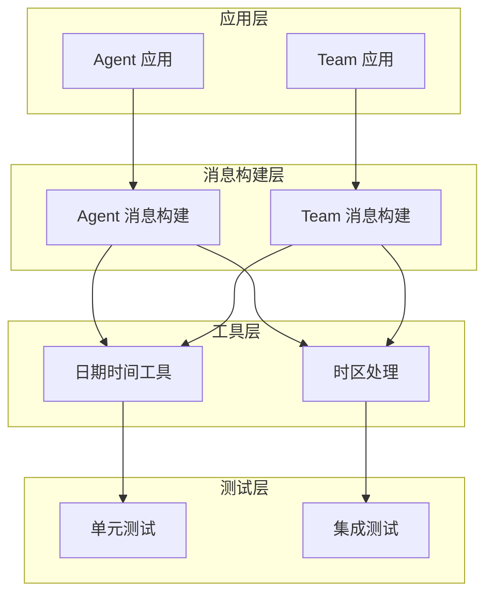
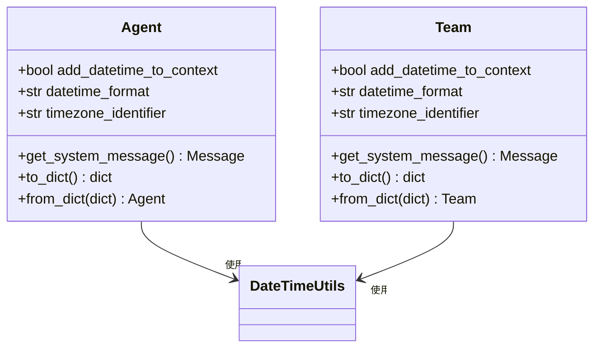
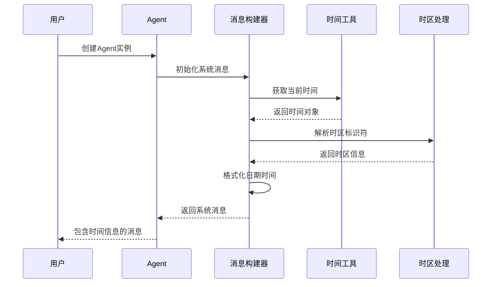
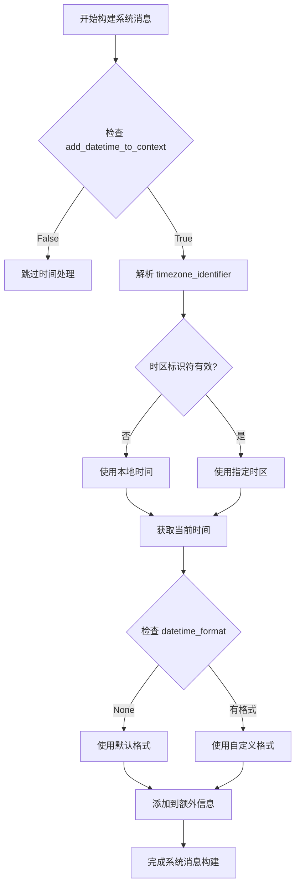
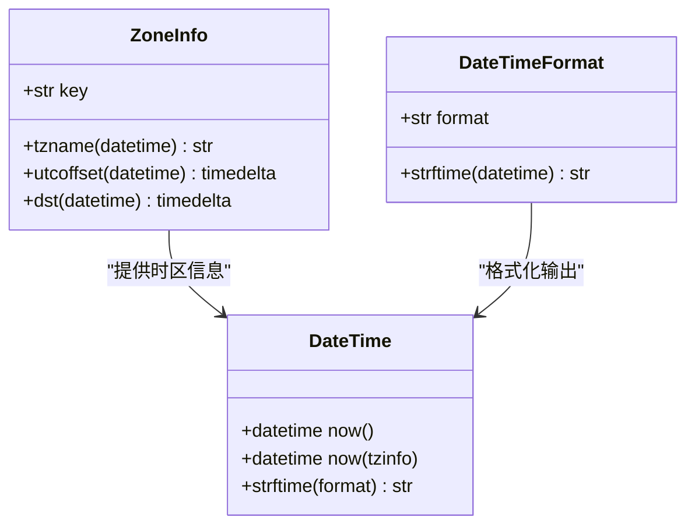
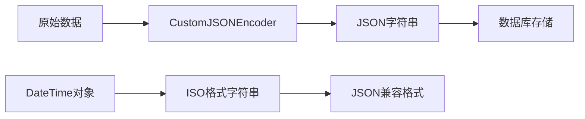
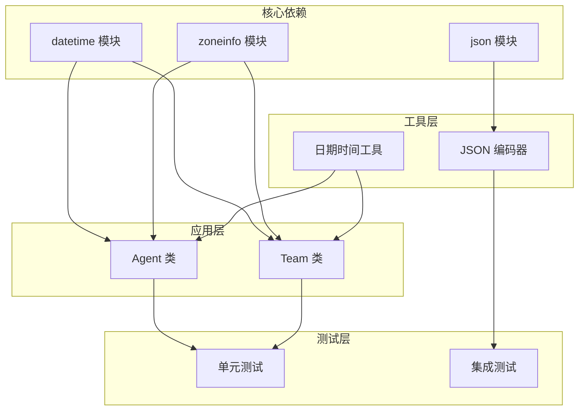

# 日期时间格式处理

<cite>
**本文档引用的文件**
- [cookbook/02_agents/03_context_management/datetime_format.py](file://cookbook/02_agents/03_context_management/datetime_format.py)
- [cookbook/03_teams/09_context_management/datetime_format.py](file://cookbook/03_teams/09_context_management/datetime_format.py)
- [libs/agno/agno/utils/dttm.py](file://libs/agno/agno/utils/dttm.py)
- [libs/agno/agno/agent/_messages.py](file://libs/agno/agno/agent/_messages.py)
- [libs/agno/agno/agent/agent.py](file://libs/agno/agno/agent/agent.py)
- [libs/agno/agno/team/team.py](file://libs/agno/agno/team/team.py)
- [libs/agno/tests/unit/agent/test_datetime_format.py](file://libs/agno/tests/unit/agent/test_datetime_format.py)
- [libs/agno/tests/unit/team/test_datetime_format.py](file://libs/agno/tests/unit/team/test_datetime_format.py)
- [libs/agno/tests/unit/db/test_datetime_serialization.py](file://libs/agno/tests/unit/db/test_datetime_serialization.py)
</cite>

## 目录
1. [简介](#简介)
2. [项目结构](#项目结构)
3. [核心组件](#核心组件)
4. [架构概览](#架构概览)
5. [详细组件分析](#详细组件分析)
6. [依赖关系分析](#依赖关系分析)
7. [性能考虑](#性能考虑)
8. [故障排除指南](#故障排除指南)
9. [结论](#结论)

## 简介

本文件系统性地介绍了团队上下文中日期时间信息的处理方法，涵盖本地化支持、时区转换和显示格式配置。文档基于实际代码库实现，详细解释了不同地区和文化背景下的日期时间格式差异，并提供在团队协作中保持一致性的策略。

该功能的核心价值在于：
- **统一时间基准**：通过标准化的时区处理确保跨时区团队的一致性
- **灵活格式化**：支持多种日期时间格式以适应不同地区的习惯
- **可扩展性**：为未来的国际化需求提供基础架构
- **错误处理**：完善的异常处理机制保证系统的稳定性

## 项目结构

日期时间处理功能分布在多个层次中：

**图表来源**
- [libs/agno/agno/agent/_messages.py:180-208](file://libs/agno/agno/agent/_messages.py#L180-L208)
- [libs/agno/agno/utils/dttm.py:1-47](file://libs/agno/agno/utils/dttm.py#L1-L47)

**章节来源**
- [cookbook/02_agents/03_context_management/datetime_format.py:1-26](file://cookbook/02_agents/03_context_management/datetime_format.py#L1-L26)
- [cookbook/03_teams/09_context_management/datetime_format.py:1-40](file://cookbook/03_teams/09_context_management/datetime_format.py#L1-L40)

## 核心组件

### Agent 类的日期时间配置

Agent 类提供了完整的日期时间处理能力，包括：

- **add_datetime_to_context**: 控制是否在系统消息中添加当前时间信息
- **datetime_format**: 自定义日期时间格式字符串
- **timezone_identifier**: 指定时区标识符（遵循TZ Database格式）

**图表来源**
- [libs/agno/agno/agent/agent.py:242-252](file://libs/agno/agno/agent/agent.py#L242-L252)
- [libs/agno/agno/team/team.py:160-167](file://libs/agno/agno/team/team.py#L160-L167)

### 日期时间工具模块

提供底层的日期时间处理功能：

- **current_datetime()**: 获取本地当前时间
- **current_datetime_utc()**: 获取UTC当前时间
- **to_epoch_s()**: 将各种格式的时间转换为UTC秒数

**章节来源**
- [libs/agno/agno/utils/dttm.py:1-47](file://libs/agno/agno/utils/dttm.py#L1-L47)

## 架构概览

日期时间处理的完整流程如下：

**图表来源**
- [libs/agno/agno/agent/_messages.py:187-207](file://libs/agno/agno/agent/_messages.py#L187-L207)
- [libs/agno/agno/utils/dttm.py:5-18](file://libs/agno/agno/utils/dttm.py#L5-L18)

## 详细组件分析

### Agent 系统消息构建

Agent 的系统消息构建过程包含日期时间处理的关键步骤：

**图表来源**
- [libs/agno/agno/agent/_messages.py:187-207](file://libs/agno/agno/agent/_messages.py#L187-L207)

### Team 团队消息构建

Team 的实现与 Agent 类似，但提供了更丰富的配置选项：

**章节来源**
- [libs/agno/agno/team/team.py:160-167](file://libs/agno/agno/team/team.py#L160-L167)
- [libs/agno/agno/agent/_messages.py:187-207](file://libs/agno/agno/agent/_messages.py#L187-L207)

### 时区处理机制

系统使用Python标准库的 `zoneinfo.ZoneInfo` 来处理时区转换：

**图表来源**
- [libs/agno/agno/agent/_messages.py:192-200](file://libs/agno/agno/agent/_messages.py#L192-L200)

**章节来源**
- [libs/agno/agno/agent/_messages.py:192-200](file://libs/agno/agno/agent/_messages.py#L192-L200)

### 数据库序列化处理

为了解决数据库存储中的日期时间序列化问题，系统实现了专门的编码器：

**图表来源**
- [libs/agno/tests/unit/db/test_datetime_serialization.py:19-28](file://libs/agno/tests/unit/db/test_datetime_serialization.py#L19-L28)

**章节来源**
- [libs/agno/tests/unit/db/test_datetime_serialization.py:1-302](file://libs/agno/tests/unit/db/test_datetime_serialization.py#L1-L302)

## 依赖关系分析

### 组件间依赖关系

**图表来源**
- [libs/agno/agno/agent/_messages.py:187-207](file://libs/agno/agno/agent/_messages.py#L187-L207)
- [libs/agno/agno/utils/dttm.py:1-47](file://libs/agno/agno/utils/dttm.py#L1-L47)

### 外部依赖分析

系统对外部依赖的处理：

- **Python 标准库**: 依赖 `datetime`、`zoneinfo`、`json` 模块
- **时区数据库**: 使用TZ Database标准
- **JSON序列化**: 实现自定义编码器处理非标准类型

**章节来源**
- [libs/agno/agno/agent/_messages.py:192-198](file://libs/agno/agno/agent/_messages.py#L192-L198)

## 性能考虑

### 时间处理性能优化

1. **缓存机制**: 时区信息解析结果可以进行缓存以避免重复计算
2. **延迟初始化**: 仅在需要时才进行时区解析
3. **格式化优化**: 预编译格式字符串以提高性能

### 内存使用优化

- **按需加载**: 仅在系统消息构建时才处理日期时间信息
- **临时对象**: 及时释放不需要的中间对象

## 故障排除指南

### 常见问题及解决方案

#### 时区标识符无效

**问题**: 当提供无效的时区标识符时，系统会记录警告并回退到本地时间。

**解决方案**: 
- 使用标准TZ Database格式（如 "Etc/UTC"、"Asia/Shanghai"）
- 验证时区标识符的有效性

#### 日期时间格式不匹配

**问题**: 自定义格式字符串可能导致格式化失败。

**解决方案**:
- 使用标准的strftime格式代码
- 提供默认回退格式

#### 数据库序列化错误

**问题**: 保存包含datetime对象的会话时出现JSON序列化错误。

**解决方案**:
- 使用CustomJSONEncoder自动处理datetime对象
- 确保所有JSON字段都经过适当的序列化

**章节来源**
- [libs/agno/tests/unit/agent/test_datetime_format.py:88-127](file://libs/agno/tests/unit/agent/test_datetime_format.py#L88-L127)
- [libs/agno/tests/unit/team/test_datetime_format.py:91-129](file://libs/agno/tests/unit/team/test_datetime_format.py#L91-L129)
- [libs/agno/tests/unit/db/test_datetime_serialization.py:242-301](file://libs/agno/tests/unit/db/test_datetime_serialization.py#L242-L301)

### 最佳实践建议

1. **统一时区策略**: 在团队内部约定统一的时区标准
2. **格式标准化**: 定义团队内部的标准日期时间格式
3. **错误处理**: 实现完善的异常处理和日志记录
4. **测试覆盖**: 确保所有日期时间处理路径都有充分的测试

## 结论

该日期时间格式处理系统为团队协作提供了强大的时间管理能力。通过灵活的配置选项、完善的时区处理机制和健壮的错误处理，系统能够满足跨时区团队的各种需求。

关键优势包括：
- **一致性**: 统一的时区和格式处理确保团队成员之间的协调
- **可扩展性**: 支持新的格式和时区需求
- **可靠性**: 完善的测试和错误处理保证系统稳定运行
- **易用性**: 简洁的API设计降低了使用复杂度

建议在团队实施中：
1. 制定统一的日期时间格式标准
2. 建立时区配置的最佳实践
3. 定期审查和更新日期时间处理逻辑
4. 加强相关文档和培训