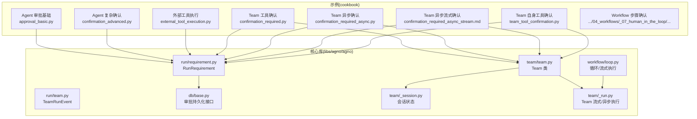
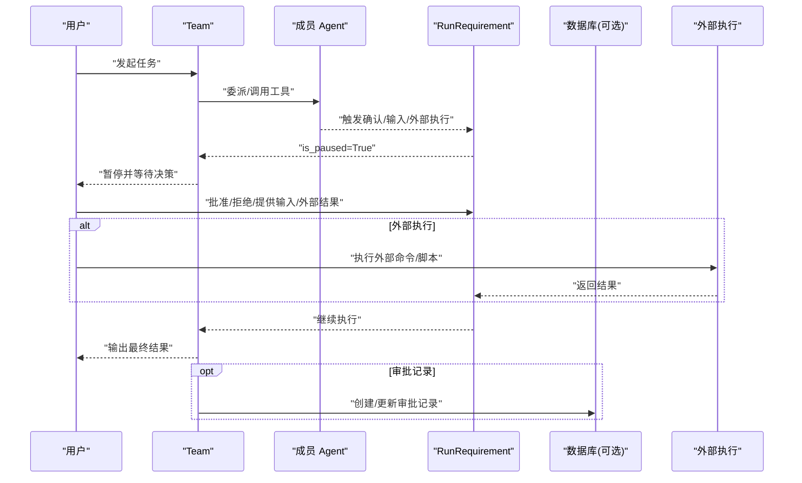
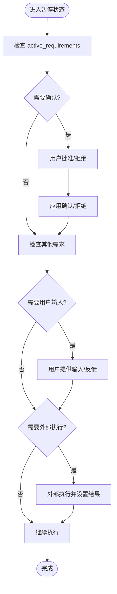
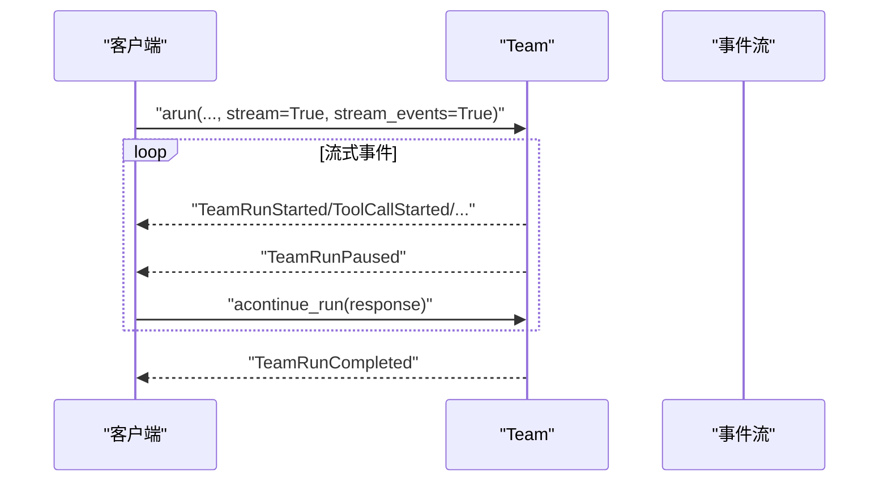
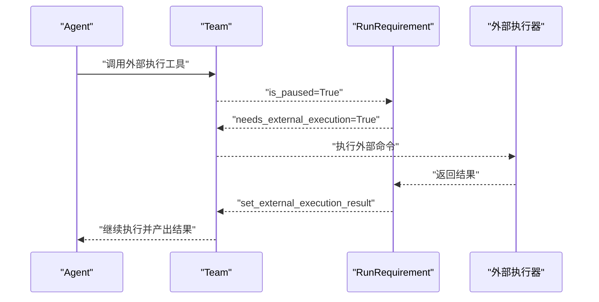
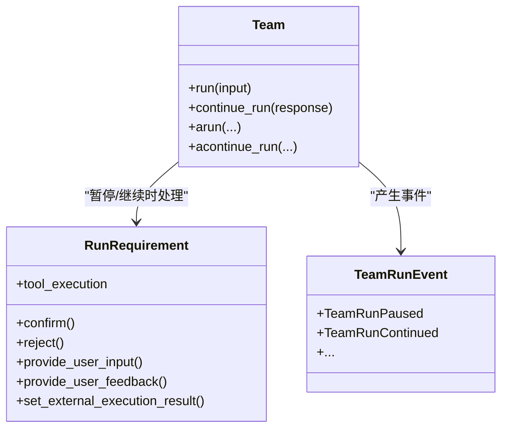
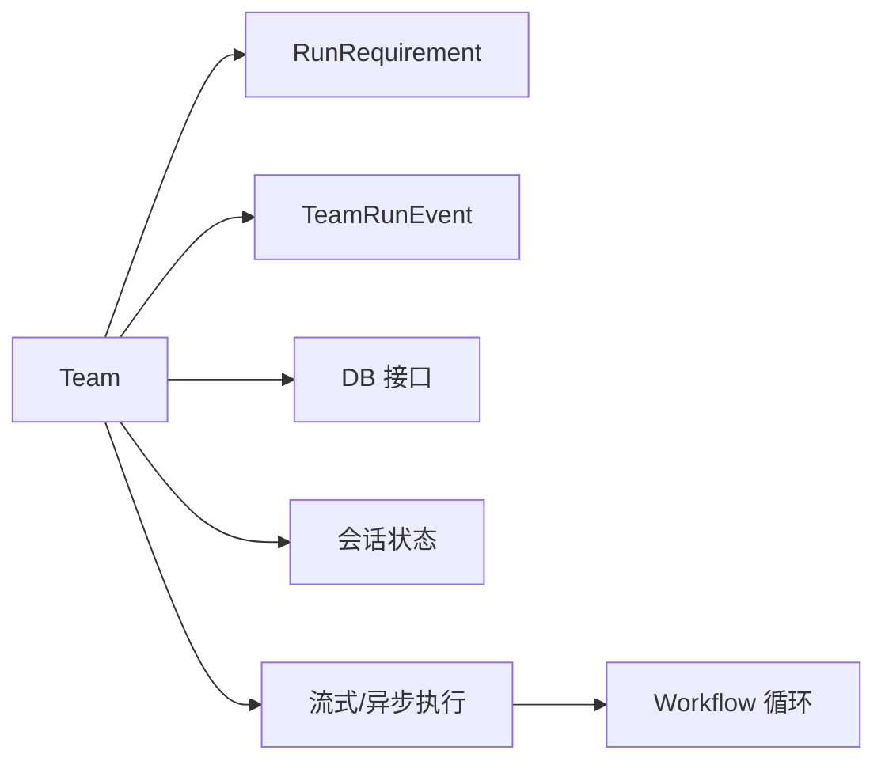

# 团队人机协作

<cite>
**本文引用的文件**
- [cookbook/02_agents/11_approvals/approval_basic.py](file://cookbook/02_agents/11_approvals/approval_basic.py)
- [cookbook/02_agents/10_human_in_the_loop/confirmation_advanced.py](file://cookbook/02_agents/10_human_in_the_loop/confirmation_advanced.py)
- [cookbook/02_agents/10_human_in_the_loop/external_tool_execution.py](file://cookbook/02_agents/10_human_in_the_loop/external_tool_execution.py)
- [cookbook/03_teams/20_human_in_the_loop/confirmation_required.py](file://cookbook/03_teams/20_human_in_the_loop/confirmation_required.py)
- [cookbook/03_teams/20_human_in_the_loop/confirmation_required_async.py](file://cookbook/03_teams/20_human_in_the_loop/confirmation_required_async.py)
- [cookbook/03_teams/20_human_in_the_loop/confirmation_required_async_stream.md](file://cookbook/03_teams/20_human_in_the_loop/confirmation_required_async_stream.md)
- [cookbook/03_teams/20_human_in_the_loop/team_tool_confirmation.py](file://cookbook/03_teams/20_human_in_the_loop/team_tool_confirmation.py)
- [cookbook/03_teams/20_human_in_the_loop/team_tool_confirmation_stream.md](file://cookbook/03_teams/20_human_in_the_loop/team_tool_confirmation_stream.md)
- [libs/agno/agno/run/requirement.py](file://libs/agno/agno/run/requirement.py)
- [libs/agno/agno/run/team.py](file://libs/agno/agno/run/team.py)
- [libs/agno/agno/team/team.py](file://libs/agno/agno/team/team.py)
- [libs/agno/agno/db/base.py](file://libs/agno/agno/db/base.py)
- [libs/agno/agno/team/_session.py](file://libs/agno/agno/team/_session.py)
- [libs/agno/agno/team/_run.py](file://libs/agno/agno/team/_run.py)
- [libs/agno/agno/workflow/loop.py](file://libs/agno/agno/workflow/loop.py)
- [libs/agno/tests/integration/teams/test_session_state.py](file://libs/agno/tests/integration/teams/test_session_state.py)
- [libs/agno/tests/integration/teams/test_session.py](file://libs/agno/tests/integration/teams/test_session.py)
- [libs/agno/tests/integration/session/test_share_sessions.py](file://libs/agno/tests/integration/session/test_share_sessions.py)
- [libs/agno/tests/system/tests/test_teams_routes.py](file://libs/agno/tests/system/tests/test_teams_routes.py)
- [libs/agno/tests/system/tests/test_utils.py](file://libs/agno/tests/system/tests/test_utils.py)
</cite>

## 目录
1. [简介](#简介)
2. [项目结构](#项目结构)
3. [核心组件](#核心组件)
4. [架构总览](#架构总览)
5. [详细组件分析](#详细组件分析)
6. [依赖分析](#依赖分析)
7. [性能考量](#性能考量)
8. [故障排查指南](#故障排查指南)
9. [结论](#结论)
10. [附录](#附录)

## 简介
本文件面向“团队人机协作系统”，围绕以下目标展开：  
- 解释团队中的“人机协作机制”（工具确认、用户输入、审批流程）  
- 详解“确认机制”的实现（确认要求、确认流程、确认状态管理）  
- 阐述“异步协作”（异步确认、流式确认、状态同步）  
- 介绍“外部工具执行”的集成（触发、状态跟踪、结果处理）  
- 提供可定位的代码示例路径，帮助快速落地  
- 总结协作流程优化、用户体验改进与故障处理建议

## 项目结构
该仓库以“食谱式示例 + 核心库”组织：  
- cookbook 目录提供大量端到端示例，覆盖 Agent/Team/Workflow/Human-in-the-Loop/Approvals 等主题  
- libs/agno/agno 是核心运行时与基础设施，包含 run/requirement/team/db 等模块

**图表来源**
- [libs/agno/agno/run/requirement.py:1-200](file://libs/agno/agno/run/requirement.py#L1-L200)
- [libs/agno/agno/run/team.py:1-200](file://libs/agno/agno/run/team.py#L1-L200)
- [libs/agno/agno/team/team.py:1-200](file://libs/agno/agno/team/team.py#L1-L200)
- [libs/agno/agno/db/base.py:1761-1794](file://libs/agno/agno/db/base.py#L1761-L1794)
- [libs/agno/agno/team/_session.py:419-444](file://libs/agno/agno/team/_session.py#L419-L444)
- [libs/agno/agno/team/_run.py:865-892](file://libs/agno/agno/team/_run.py#L865-L892)
- [libs/agno/agno/workflow/loop.py:765-789](file://libs/agno/agno/workflow/loop.py#L765-L789)

**章节来源**
- [libs/agno/agno/run/requirement.py:1-200](file://libs/agno/agno/run/requirement.py#L1-L200)
- [libs/agno/agno/run/team.py:1-200](file://libs/agno/agno/run/team.py#L1-L200)
- [libs/agno/agno/team/team.py:1-200](file://libs/agno/agno/team/team.py#L1-L200)
- [libs/agno/agno/db/base.py:1761-1794](file://libs/agno/agno/db/base.py#L1761-L1794)
- [libs/agno/agno/team/_session.py:419-444](file://libs/agno/agno/team/_session.py#L419-L444)
- [libs/agno/agno/team/_run.py:865-892](file://libs/agno/agno/team/_run.py#L865-L892)
- [libs/agno/agno/workflow/loop.py:765-789](file://libs/agno/agno/workflow/loop.py#L765-L789)

## 核心组件
- RunRequirement：封装一次暂停所需的“需求”，包括工具调用、用户确认、用户输入、反馈、外部执行结果等
- TeamRunEvent：Team 运行期间产生的事件类型，如暂停、继续、任务状态变更等
- Team：团队执行主体，支持多成员、会话状态、任务模式、事件流等
- 数据库接口：审批记录的创建/查询/更新（可选）
- 会话状态：跨 run/成员共享的状态管理
- 流式/异步执行：Team 支持异步与事件流，便于与前端/外部系统对接

**章节来源**
- [libs/agno/agno/run/requirement.py:1-200](file://libs/agno/agno/run/requirement.py#L1-L200)
- [libs/agno/agno/run/team.py:130-185](file://libs/agno/agno/run/team.py#L130-L185)
- [libs/agno/agno/team/team.py:70-200](file://libs/agno/agno/team/team.py#L70-L200)
- [libs/agno/agno/db/base.py:1761-1794](file://libs/agno/agno/db/base.py#L1761-L1794)
- [libs/agno/agno/team/_session.py:419-444](file://libs/agno/agno/team/_session.py#L419-L444)
- [libs/agno/agno/team/_run.py:865-892](file://libs/agno/agno/team/_run.py#L865-L892)

## 架构总览
下图展示了从“用户输入”到“工具执行/外部执行/审批”的整体协作链路，以及 Team 层如何协调成员与暂停恢复。

**图表来源**
- [libs/agno/agno/run/requirement.py:55-113](file://libs/agno/agno/run/requirement.py#L55-L113)
- [libs/agno/agno/run/team.py:130-185](file://libs/agno/agno/run/team.py#L130-L185)
- [libs/agno/agno/db/base.py:1761-1794](file://libs/agno/agno/db/base.py#L1761-L1794)
- [libs/agno/agno/team/team.py:70-200](file://libs/agno/agno/team/team.py#L70-L200)

## 详细组件分析

### 确认机制：要求、流程与状态管理
- 确认要求判定：RunRequirement 通过工具声明与内部状态判断是否需要确认/用户输入/外部执行
- 确认流程：用户在暂停时对每个 active_requirement 进行 confirm/reject；Team 继续执行
- 状态管理：RunRequirement 内部维护 confirmation、external_execution_result、user_input_schema 等字段；TeamRunEvent 提供暂停/继续事件

**图表来源**
- [libs/agno/agno/run/requirement.py:55-113](file://libs/agno/agno/run/requirement.py#L55-L113)
- [libs/agno/agno/run/requirement.py:114-168](file://libs/agno/agno/run/requirement.py#L114-L168)
- [libs/agno/agno/run/team.py:130-185](file://libs/agno/agno/run/team.py#L130-L185)

**章节来源**
- [libs/agno/agno/run/requirement.py:55-113](file://libs/agno/agno/run/requirement.py#L55-L113)
- [libs/agno/agno/run/requirement.py:114-168](file://libs/agno/agno/run/requirement.py#L114-L168)
- [libs/agno/agno/run/team.py:130-185](file://libs/agno/agno/run/team.py#L130-L185)

### 异步协作：异步确认、流式确认与状态同步
- 异步确认：Team 支持异步运行与继续，适用于高并发/长任务场景
- 流式确认：Team 支持流式事件，通过 TeamRunPausedEvent 检测暂停，再继续执行
- 状态同步：TeamRunEvent 提供 run_started/run_completed 等事件，便于前端/外部系统实时感知状态

**图表来源**
- [libs/agno/agno/team/_run.py:865-892](file://libs/agno/agno/team/_run.py#L865-L892)
- [libs/agno/agno/run/team.py:130-185](file://libs/agno/agno/run/team.py#L130-L185)
- [libs/agno/tests/system/tests/test_teams_routes.py:248-365](file://libs/agno/tests/system/tests/test_teams_routes.py#L248-L365)
- [libs/agno/tests/system/tests/test_utils.py:172-212](file://libs/agno/tests/system/tests/test_utils.py#L172-L212)

**章节来源**
- [libs/agno/agno/team/_run.py:865-892](file://libs/agno/agno/team/_run.py#L865-L892)
- [libs/agno/agno/run/team.py:130-185](file://libs/agno/agno/run/team.py#L130-L185)
- [libs/agno/tests/system/tests/test_teams_routes.py:248-365](file://libs/agno/tests/system/tests/test_teams_routes.py#L248-L365)
- [libs/agno/tests/system/tests/test_utils.py:172-212](file://libs/agno/tests/system/tests/test_utils.py#L172-L212)

### 外部工具执行：触发、状态跟踪与结果处理
- 触发：工具声明 external_execution=True 后，在暂停时由 requirement.needs_external_execution 判定
- 状态跟踪：通过 requirement.set_external_execution_result 设置结果
- 结果处理：Team 在继续执行时读取外部结果，完成工具调用闭环

**图表来源**
- [libs/agno/agno/run/requirement.py:90-97](file://libs/agno/agno/run/requirement.py#L90-L97)
- [libs/agno/agno/run/requirement.py:162-168](file://libs/agno/agno/run/requirement.py#L162-L168)
- [cookbook/02_agents/10_human_in_the_loop/external_tool_execution.py:1-72](file://cookbook/02_agents/10_human_in_the_loop/external_tool_execution.py#L1-L72)

**章节来源**
- [libs/agno/agno/run/requirement.py:90-97](file://libs/agno/agno/run/requirement.py#L90-L97)
- [libs/agno/agno/run/requirement.py:162-168](file://libs/agno/agno/run/requirement.py#L162-L168)
- [cookbook/02_agents/10_human_in_the_loop/external_tool_execution.py:1-72](file://cookbook/02_agents/10_human_in_the_loop/external_tool_execution.py#L1-L72)

### 审批与团队协作：从 Agent 到 Team 的扩展
- Agent 审批：工具 + @approval 装饰器，配合 SqliteDb 记录审批状态
- Team 审批：Team 成员工具触发暂停，Team 层继续执行；审批记录可写入统一数据库
- Team 自身工具确认：Team 自身挂载的工具也可触发确认，处理方式一致

**图表来源**
- [libs/agno/agno/run/requirement.py:1-200](file://libs/agno/agno/run/requirement.py#L1-L200)
- [libs/agno/agno/team/team.py:70-200](file://libs/agno/agno/team/team.py#L70-L200)
- [libs/agno/agno/run/team.py:130-185](file://libs/agno/agno/run/team.py#L130-L185)

**章节来源**
- [libs/agno/agno/run/requirement.py:1-200](file://libs/agno/agno/run/requirement.py#L1-L200)
- [libs/agno/agno/team/team.py:70-200](file://libs/agno/agno/team/team.py#L70-L200)
- [libs/agno/agno/run/team.py:130-185](file://libs/agno/agno/run/team.py#L130-L185)

### 示例路径与最佳实践
- Agent 审批基础：[approval_basic.py:1-132](file://cookbook/02_agents/11_approvals/approval_basic.py#L1-L132)
  - 关键点：工具 + @approval + requires_confirmation；暂停后确认并继续；数据库记录审批
- Agent 复杂确认：[confirmation_advanced.py:1-97](file://cookbook/02_agents/10_human_in_the_loop/confirmation_advanced.py#L1-L97)
  - 关键点：多工具确认、交互式确认、拒绝与继续
- 外部工具执行：[external_tool_execution.py:1-72](file://cookbook/02_agents/10_human_in_the_loop/external_tool_execution.py#L1-L72)
  - 关键点：external_execution=True；set_external_execution_result；继续执行
- Team 工具确认：[confirmation_required.py:1-45](file://cookbook/03_teams/20_human_in_the_loop/confirmation_required.py#L1-L45)
  - 关键点：成员工具触发暂停；用户确认；team.continue_run
- Team 异步确认：[confirmation_required_async.py:1-71](file://cookbook/03_teams/20_human_in_the_loop/confirmation_required_async.py#L1-L71)
  - 关键点：异步运行与继续
- Team 异步流式确认：[confirmation_required_async_stream.md:1-8](file://cookbook/03_teams/20_human_in_the_loop/confirmation_required_async_stream.md#L1-L8)
  - 关键点：arun + stream + TeamRunPausedEvent
- Team 自身工具确认：[team_tool_confirmation.py:1-23](file://cookbook/03_teams/20_human_in_the_loop/team_tool_confirmation.py#L1-L23)
  - 关键点：Team 自身工具触发确认，与成员工具一致

**章节来源**
- [cookbook/02_agents/11_approvals/approval_basic.py:1-132](file://cookbook/02_agents/11_approvals/approval_basic.py#L1-L132)
- [cookbook/02_agents/10_human_in_the_loop/confirmation_advanced.py:1-97](file://cookbook/02_agents/10_human_in_the_loop/confirmation_advanced.py#L1-L97)
- [cookbook/02_agents/10_human_in_the_loop/external_tool_execution.py:1-72](file://cookbook/02_agents/10_human_in_the_loop/external_tool_execution.py#L1-L72)
- [cookbook/03_teams/20_human_in_the_loop/confirmation_required.py:1-45](file://cookbook/03_teams/20_human_in_the_loop/confirmation_required.py#L1-L45)
- [cookbook/03_teams/20_human_in_the_loop/confirmation_required_async.py:1-71](file://cookbook/03_teams/20_human_in_the_loop/confirmation_required_async.py#L1-L71)
- [cookbook/03_teams/20_human_in_the_loop/confirmation_required_async_stream.md:1-8](file://cookbook/03_teams/20_human_in_the_loop/confirmation_required_async_stream.md#L1-L8)
- [cookbook/03_teams/20_human_in_the_loop/team_tool_confirmation.py:1-23](file://cookbook/03_teams/20_human_in_the_loop/team_tool_confirmation.py#L1-L23)

## 依赖分析
- Team 依赖 RunRequirement 管理暂停需求
- Team 通过 TeamRunEvent 发出运行期事件
- 数据库接口用于审批记录的持久化
- 会话状态在 Team 与成员之间共享
- 流式/异步执行由 TeamRun 与 Workflow 循环支撑

**图表来源**
- [libs/agno/agno/team/team.py:70-200](file://libs/agno/agno/team/team.py#L70-L200)
- [libs/agno/agno/run/requirement.py:1-200](file://libs/agno/agno/run/requirement.py#L1-L200)
- [libs/agno/agno/run/team.py:130-185](file://libs/agno/agno/run/team.py#L130-L185)
- [libs/agno/agno/db/base.py:1761-1794](file://libs/agno/agno/db/base.py#L1761-L1794)
- [libs/agno/agno/team/_session.py:419-444](file://libs/agno/agno/team/_session.py#L419-L444)
- [libs/agno/agno/workflow/loop.py:765-789](file://libs/agno/agno/workflow/loop.py#L765-L789)

**章节来源**
- [libs/agno/agno/team/team.py:70-200](file://libs/agno/agno/team/team.py#L70-L200)
- [libs/agno/agno/run/requirement.py:1-200](file://libs/agno/agno/run/requirement.py#L1-L200)
- [libs/agno/agno/run/team.py:130-185](file://libs/agno/agno/run/team.py#L130-L185)
- [libs/agno/agno/db/base.py:1761-1794](file://libs/agno/agno/db/base.py#L1761-L1794)
- [libs/agno/agno/team/_session.py:419-444](file://libs/agno/agno/team/_session.py#L419-L444)
- [libs/agno/agno/workflow/loop.py:765-789](file://libs/agno/agno/workflow/loop.py#L765-L789)

## 性能考量
- 异步与流式：在高并发/长任务场景优先采用 Team.arun + stream_events，减少阻塞与内存占用
- 事件粒度：合理使用 TeamRunEvent 的细分事件，避免过度订阅导致的前端压力
- 审批持久化：审批记录写入数据库会引入 IO，建议批量/异步落盘或使用高性能存储
- 会话状态：跨 run/成员共享状态时，注意序列化开销与并发写入冲突

## 故障排查指南
- 暂停未恢复：确认 active_requirements 中的 needs_confirmation 是否已处理，是否调用了 continue_run
- 外部执行失败：检查 needs_external_execution 与 set_external_execution_result 是否正确设置
- 审批记录异常：核对数据库接口实现与原子更新逻辑
- 流式事件缺失：验证 TeamRunPausedEvent 是否被消费，以及客户端是否正确处理 SSE

**章节来源**
- [libs/agno/agno/run/requirement.py:55-113](file://libs/agno/agno/run/requirement.py#L55-L113)
- [libs/agno/agno/run/requirement.py:162-168](file://libs/agno/agno/run/requirement.py#L162-L168)
- [libs/agno/agno/db/base.py:1761-1794](file://libs/agno/agno/db/base.py#L1761-L1794)
- [libs/agno/tests/system/tests/test_teams_routes.py:248-365](file://libs/agno/tests/system/tests/test_teams_routes.py#L248-L365)

## 结论
本系统通过 RunRequirement 将“确认/输入/外部执行”抽象为统一的需求对象，Team 作为协调者在成员与用户之间建立人机协作桥梁。配合异步/流式执行与事件系统，既能保证安全性（审批/确认），又能提升用户体验（即时反馈/可中断）。建议在生产环境完善审批持久化、事件监控与会话状态一致性保障。

## 附录
- 会话状态跨 run/成员共享测试参考：
  - [test_session_state.py:48-328](file://libs/agno/tests/integration/teams/test_session_state.py#L48-L328)
  - [test_session.py:557-566](file://libs/agno/tests/integration/teams/test_session.py#L557-L566)
  - [test_share_sessions.py:257-270](file://libs/agno/tests/integration/session/test_share_sessions.py#L257-L270)

**章节来源**
- [libs/agno/tests/integration/teams/test_session_state.py:48-328](file://libs/agno/tests/integration/teams/test_session_state.py#L48-L328)
- [libs/agno/tests/integration/teams/test_session.py:557-566](file://libs/agno/tests/integration/teams/test_session.py#L557-L566)
- [libs/agno/tests/integration/session/test_share_sessions.py:257-270](file://libs/agno/tests/integration/session/test_share_sessions.py#L257-L270)