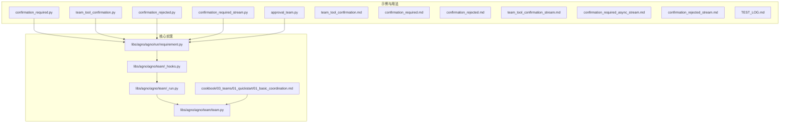
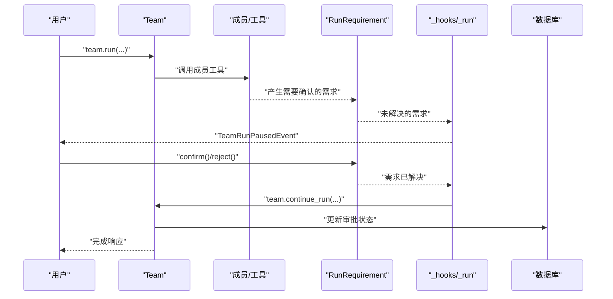
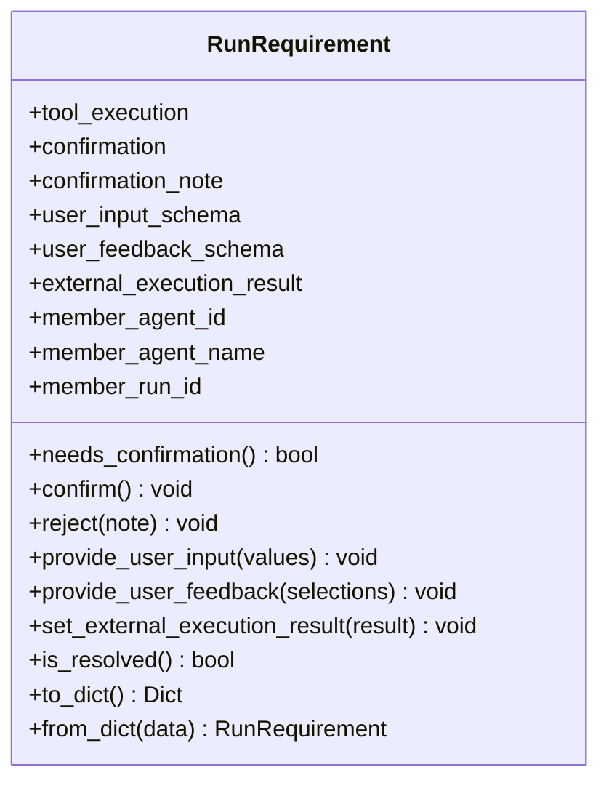
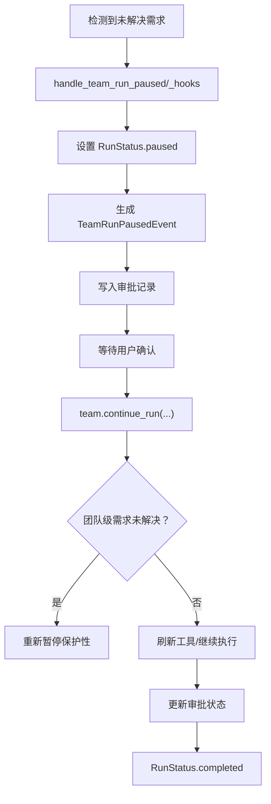
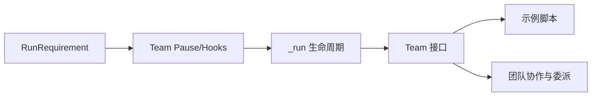

# 团队工具确认

<cite>
**本文档引用的文件**
- [team_tool_confirmation.py](file://cookbook/03_teams/20_human_in_the_loop/team_tool_confirmation.py)
- [confirmation_required.py](file://cookbook/03_teams/20_human_in_the_loop/confirmation_required.py)
- [confirmation_rejected.py](file://cookbook/03_teams/20_human_in_the_loop/confirmation_rejected.py)
- [confirmation_required_stream.py](file://cookbook/03_teams/20_human_in_the_loop/confirmation_required_stream.py)
- [approval_team.py](file://cookbook/02_agents/11_approvals/approval_team.py)
- [requirement.py](file://libs/agno/agno/run/requirement.py)
- [_hooks.py](file://libs/agno/agno/team/_hooks.py)
- [_run.py](file://libs/agno/agno/team/_run.py)
- [team.py](file://libs/agno/agno/team/team.py)
- [01_basic_coordination.md](file://cookbook/03_teams/01_quickstart/01_basic_coordination.md)
- [team_tool_confirmation.md](file://cookbook/03_teams/20_human_in_the_loop/team_tool_confirmation.md)
- [confirmation_required.md](file://cookbook/03_teams/20_human_in_the_loop/confirmation_required.md)
- [confirmation_rejected.md](file://cookbook/03_teams/20_human_in_the_loop/confirmation_rejected.md)
- [team_tool_confirmation_stream.md](file://cookbook/03_teams/20_human_in_the_loop/team_tool_confirmation_stream.md)
- [confirmation_required_async_stream.md](file://cookbook/03_teams/20_human_in_the_loop/confirmation_required_async_stream.md)
- [confirmation_rejected_stream.md](file://cookbook/03_teams/20_human_in_the_loop/confirmation_rejected_stream.md)
- [TEST_LOG.md](file://cookbook/03_teams/20_human_in_the_loop/TEST_LOG.md)
</cite>

## 目录
1. [简介](#简介)
2. [项目结构](#项目结构)
3. [核心组件](#核心组件)
4. [架构总览](#架构总览)
5. [详细组件分析](#详细组件分析)
6. [依赖关系分析](#依赖关系分析)
7. [性能考虑](#性能考虑)
8. [故障排除指南](#故障排除指南)
9. [结论](#结论)
10. [附录](#附录)

## 简介
本文件系统性阐述“团队工具确认”机制，覆盖以下主题：
- 工具调用确认、团队级确认与流式确认处理
- 团队工具确认的流程控制：确认要求设置、确认状态管理、确认结果处理
- 团队协作中的工具调用协调：多成员工具调用、资源冲突解决、执行顺序控制
- 具体代码示例路径：基本团队确认流程、流式确认处理、确认状态同步
- 团队工具确认对协作效率与决策质量的影响，以及最佳实践建议

## 项目结构
围绕团队工具确认的相关代码主要分布在两个区域：
- 示例与用法：cookbook/03_teams/20_human_in_the_loop 下的多个示例脚本与说明文档
- 核心实现：libs/agno/agno/team 与 libs/agno/agno/run 下的运行时与要求处理模块

**图表来源**
- [requirement.py](file://libs/agno/agno/run/requirement.py)
- [_hooks.py](file://libs/agno/agno/team/_hooks.py)
- [_run.py](file://libs/agno/agno/team/_run.py)
- [team.py](file://libs/agno/agno/team/team.py)
- [01_basic_coordination.md](file://cookbook/03_teams/01_quickstart/01_basic_coordination.md)

**章节来源**
- [requirement.py](file://libs/agno/agno/run/requirement.py)
- [_hooks.py](file://libs/agno/agno/team/_hooks.py)
- [_run.py](file://libs/agno/agno/team/_run.py)
- [team.py](file://libs/agno/agno/team/team.py)
- [01_basic_coordination.md](file://cookbook/03_teams/01_quickstart/01_basic_coordination.md)

## 核心组件
- RunRequirement：封装一次暂停运行所需的确认/输入/外部执行等需求，提供 confirm/reject 等方法
- Team.pause 处理：在检测到未解决的需求时，统一进入暂停状态并生成 TeamRunPausedEvent
- Team.continue_run：恢复执行，支持从 run_id+requirements 或完整 response 恢复
- 流式与异步：提供流式事件与异步继续执行的能力

关键要点：
- 需求分类：成员级 vs 团队级（通过 member_agent_id 判定）
- 数据持久化：暂停时写入审批记录，恢复时更新状态
- 事件驱动：暂停/恢复通过事件与会话存储协同

**章节来源**
- [requirement.py](file://libs/agno/agno/run/requirement.py)
- [_hooks.py](file://libs/agno/agno/team/_hooks.py)
- [_run.py](file://libs/agno/agno/team/_run.py)
- [approval_team.py](file://cookbook/02_agents/11_approvals/approval_team.py)

## 架构总览
团队工具确认的整体流程由“触发暂停—用户确认—恢复执行—结果落库”构成。

**图表来源**
- [requirement.py](file://libs/agno/agno/run/requirement.py)
- [_hooks.py](file://libs/agno/agno/team/_hooks.py)
- [_run.py](file://libs/agno/agno/team/_run.py)
- [approval_team.py](file://cookbook/02_agents/11_approvals/approval_team.py)

## 详细组件分析

### 组件A：RunRequirement（确认需求载体）
- 职责：承载一次暂停运行所需的信息，包括工具调用、确认状态、用户输入、反馈、外部执行结果等
- 关键属性与方法：
  - needs_confirmation：判定是否仍需人工确认
  - confirm()/reject()：批准或拒绝
  - needs_user_input/needs_user_feedback/needs_external_execution：分别对应用户输入、反馈与外部执行需求
  - is_resolved()：需求是否全部解决
  - to_dict/from_dict：持久化支持

**图表来源**
- [requirement.py](file://libs/agno/agno/run/requirement.py)

**章节来源**
- [requirement.py](file://libs/agno/agno/run/requirement.py)

### 组件B：Team.pause 与 Team.continue_run（暂停/恢复）
- Team.pause：
  - 将 run_response 状态置为 paused
  - 生成 TeamRunPausedEvent 并持久化
  - 用于成员工具确认与团队级工具确认
- Team.continue_run：
  - 支持从 run_id+requirements 或完整 response 恢复
  - 对团队级未解决需求进行保护性重暂停（避免自动拒绝）
  - 更新审批记录状态

**图表来源**
- [_hooks.py](file://libs/agno/agno/team/_hooks.py)
- [_run.py](file://libs/agno/agno/team/_run.py)

**章节来源**
- [_hooks.py](file://libs/agno/agno/team/_hooks.py)
- [_run.py](file://libs/agno/agno/team/_run.py)

### 组件C：示例一——成员工具确认（基本）
- 场景：成员 Agent 调用带 requires_confirmation 的工具，Team 暂停，用户批准后继续
- 关键步骤：
  - run_response.is_paused 检查暂停
  - 遍历 active_requirements，识别 needs_confirmation
  - 调用 requirement.confirm()/reject()
  - team.continue_run(run_response)

参考路径：
- [confirmation_required.py](file://cookbook/03_teams/20_human_in_the_loop/confirmation_required.py)

**章节来源**
- [confirmation_required.py](file://cookbook/03_teams/20_human_in_the_loop/confirmation_required.py)
- [confirmation_required.md](file://cookbook/03_teams/20_human_in_the_loop/confirmation_required.md)

### 组件D：示例二——团队级工具确认（Team Leader 自身工具）
- 场景：Team.tools 中直接挂载的工具（非成员）触发确认，Team 暂停，用户批准后继续
- 关键差异：requirement.member_agent_name 为 None（表示团队级）

参考路径：
- [team_tool_confirmation.py](file://cookbook/03_teams/20_human_in_the_loop/team_tool_confirmation.py)
- [team_tool_confirmation.md](file://cookbook/03_teams/20_human_in_the_loop/team_tool_confirmation.md)

**章节来源**
- [team_tool_confirmation.py](file://cookbook/03_teams/20_human_in_the_loop/team_tool_confirmation.py)
- [team_tool_confirmation.md](file://cookbook/03_teams/20_human_in_the_loop/team_tool_confirmation.md)

### 组件E：示例三——拒绝确认（拒绝后继续）
- 场景：用户拒绝危险操作（如删除账户），Team 暂停后继续，模型生成“已拒绝”的响应
- 关键点：reject(note) 后 team.continue_run()

参考路径：
- [confirmation_rejected.py](file://cookbook/03_teams/20_human_in_the_loop/confirmation_rejected.py)
- [confirmation_rejected.md](file://cookbook/03_teams/20_human_in_the_loop/confirmation_rejected.md)

**章节来源**
- [confirmation_rejected.py](file://cookbook/03_teams/20_human_in_the_loop/confirmation_rejected.py)
- [confirmation_rejected.md](file://cookbook/03_teams/20_human_in_the_loop/confirmation_rejected.md)

### 组件F：示例四——流式确认（Streaming）
- 场景：在流式模式下，使用 isinstance(run_event, TeamRunPausedEvent) 检测暂停，处理确认后 team.continue_run(...)
- 关键点：区分 Team 暂停与成员暂停；流式事件驱动

参考路径：
- [confirmation_required_stream.py](file://cookbook/03_teams/20_human_in_the_loop/confirmation_required_stream.py)
- [team_tool_confirmation_stream.md](file://cookbook/03_teams/20_human_in_the_loop/team_tool_confirmation_stream.md)
- [confirmation_required_async_stream.md](file://cookbook/03_teams/20_human_in_the_loop/confirmation_required_async_stream.md)
- [confirmation_rejected_stream.md](file://cookbook/03_teams/20_human_in_the_loop/confirmation_rejected_stream.md)

**章节来源**
- [confirmation_required_stream.py](file://cookbook/03_teams/20_human_in_the_loop/confirmation_required_stream.py)
- [team_tool_confirmation_stream.md](file://cookbook/03_teams/20_human_in_the_loop/team_tool_confirmation_stream.md)
- [confirmation_required_async_stream.md](file://cookbook/03_teams/20_human_in_the_loop/confirmation_required_async_stream.md)
- [confirmation_rejected_stream.md](file://cookbook/03_teams/20_human_in_the_loop/confirmation_rejected_stream.md)

### 组件G：示例五——团队审批与数据库集成（Approval Team）
- 场景：成员工具调用触发 @approval 暂停，DB 记录 source_type/source_name，后续手动批准并继续
- 关键点：continue_run 接收 response 对象；DB 更新审批状态

参考路径：
- [approval_team.py](file://cookbook/02_agents/11_approvals/approval_team.py)

**章节来源**
- [approval_team.py](file://cookbook/02_agents/11_approvals/approval_team.py)

### 组件H：团队协作与委派（背景知识）
- Team 通过内置工具 delegate_task_to_member 在成员间委派任务
- Leader 的 system prompt 注入成员信息，指导 coordinate 模式下的响应合并

参考路径：
- [01_basic_coordination.md](file://cookbook/03_teams/01_quickstart/01_basic_coordination.md)

**章节来源**
- [01_basic_coordination.md](file://cookbook/03_teams/01_quickstart/01_basic_coordination.md)

## 依赖关系分析
- RunRequirement 是确认机制的核心数据结构，贯穿 Team.pause 与 Team.continue_run
- _hooks 提供 pause 事件生成与会话清理
- _run 提供 run 生命周期管理、暂停/恢复逻辑与事件流
- team.py 定义 Team 的公共接口与配置
- 示例脚本演示不同场景下的使用方式

**图表来源**
- [requirement.py](file://libs/agno/agno/run/requirement.py)
- [_hooks.py](file://libs/agno/agno/team/_hooks.py)
- [_run.py](file://libs/agno/agno/team/_run.py)
- [team.py](file://libs/agno/agno/team/team.py)
- [01_basic_coordination.md](file://cookbook/03_teams/01_quickstart/01_basic_coordination.md)

**章节来源**
- [requirement.py](file://libs/agno/agno/run/requirement.py)
- [_hooks.py](file://libs/agno/agno/team/_hooks.py)
- [_run.py](file://libs/agno/agno/team/_run.py)
- [team.py](file://libs/agno/agno/team/team.py)

## 性能考虑
- 事件与会话存储：暂停/恢复涉及事件与会话持久化，建议合理设置存储与缓存策略
- 流式处理：流式模式下事件生成与处理开销较大，注意控制事件粒度与存储频率
- 异步与并发：异步继续执行可提升吞吐，但需注意资源竞争与状态一致性
- 数据库事务：审批记录的写入与更新应保证原子性，避免脏读

[本节为通用指导，无需特定文件引用]

## 故障排除指南
常见问题与定位思路：
- 暂停未触发：检查工具是否正确标注 requires_confirmation，确认需求未被提前解决
- 恢复失败：确认传入 run_id 与 requirements 是否完整，或直接传入 response 对象
- 流式事件误判：使用 isinstance(run_event, TeamRunPausedEvent) 区分 Team 暂停与成员暂停
- 数据库状态异常：核对审批记录的 source_type/source_name 与 context 字段，确保与成员信息一致

参考路径：
- [TEST_LOG.md](file://cookbook/03_teams/20_human_in_the_loop/TEST_LOG.md)

**章节来源**
- [TEST_LOG.md](file://cookbook/03_teams/20_human_in_the_loop/TEST_LOG.md)

## 结论
团队工具确认通过“需求—暂停—确认—恢复—落库”的闭环，实现了对高风险或关键工具调用的可控执行。它既保障了协作效率（通过流式与异步能力），也提升了决策质量（通过明确的确认与审计）。实践中应重视：
- 明确确认要求与状态管理
- 正确区分成员级与团队级需求
- 合理使用流式与异步模式
- 建立完善的审批与审计机制

[本节为总结性内容，无需特定文件引用]

## 附录

### A. 基本团队确认流程（代码示例路径）
- 成员工具确认：[confirmation_required.py](file://cookbook/03_teams/20_human_in_the_loop/confirmation_required.py)
- 团队级工具确认：[team_tool_confirmation.py](file://cookbook/03_teams/20_human_in_the_loop/team_tool_confirmation.py)
- 拒绝后继续：[confirmation_rejected.py](file://cookbook/03_teams/20_human_in_the_loop/confirmation_rejected.py)

**章节来源**
- [confirmation_required.py](file://cookbook/03_teams/20_human_in_the_loop/confirmation_required.py)
- [team_tool_confirmation.py](file://cookbook/03_teams/20_human_in_the_loop/team_tool_confirmation.py)
- [confirmation_rejected.py](file://cookbook/03_teams/20_human_in_the_loop/confirmation_rejected.py)

### B. 流式确认处理（代码示例路径）
- 成员工具流式确认：[confirmation_required_stream.py](file://cookbook/03_teams/20_human_in_the_loop/confirmation_required_stream.py)
- 团队级工具流式确认：[team_tool_confirmation_stream.md](file://cookbook/03_teams/20_human_in_the_loop/team_tool_confirmation_stream.md)
- 异步流式确认：[confirmation_required_async_stream.md](file://cookbook/03_teams/20_human_in_the_loop/confirmation_required_async_stream.md)
- 流式拒绝确认：[confirmation_rejected_stream.md](file://cookbook/03_teams/20_human_in_the_loop/confirmation_rejected_stream.md)

**章节来源**
- [confirmation_required_stream.py](file://cookbook/03_teams/20_human_in_the_loop/confirmation_required_stream.py)
- [team_tool_confirmation_stream.md](file://cookbook/03_teams/20_human_in_the_loop/team_tool_confirmation_stream.md)
- [confirmation_required_async_stream.md](file://cookbook/03_teams/20_human_in_the_loop/confirmation_required_async_stream.md)
- [confirmation_rejected_stream.md](file://cookbook/03_teams/20_human_in_the_loop/confirmation_rejected_stream.md)

### C. 确认状态同步（代码示例路径）
- 团队审批与数据库集成：[approval_team.py](file://cookbook/02_agents/11_approvals/approval_team.py)
- RunRequirement 状态字段与持久化：[requirement.py](file://libs/agno/agno/run/requirement.py)

**章节来源**
- [approval_team.py](file://cookbook/02_agents/11_approvals/approval_team.py)
- [requirement.py](file://libs/agno/agno/run/requirement.py)

### D. 团队协作与委派（背景知识）
- 基础协作与委派：[01_basic_coordination.md](file://cookbook/03_teams/01_quickstart/01_basic_coordination.md)

**章节来源**
- [01_basic_coordination.md](file://cookbook/03_teams/01_quickstart/01_basic_coordination.md)