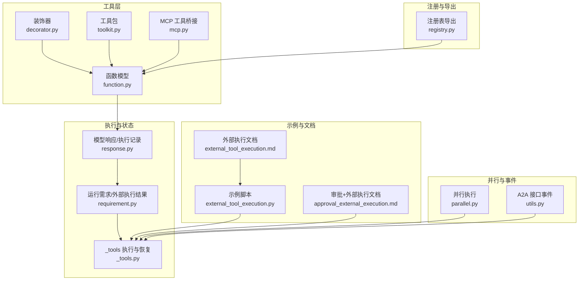
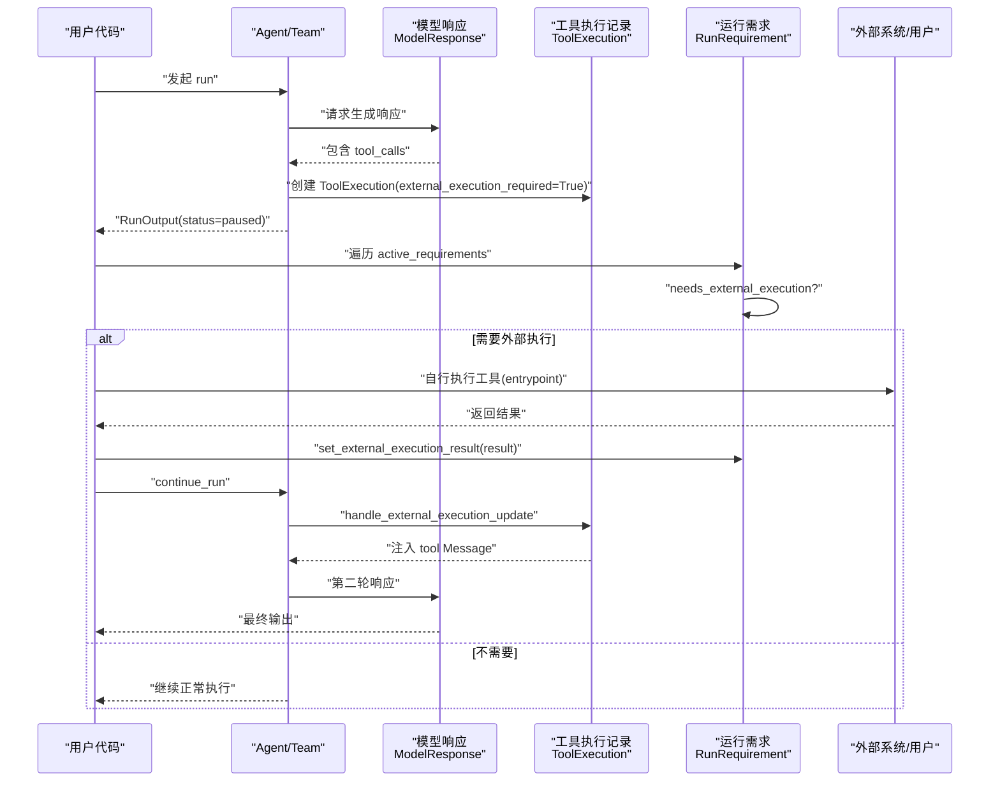
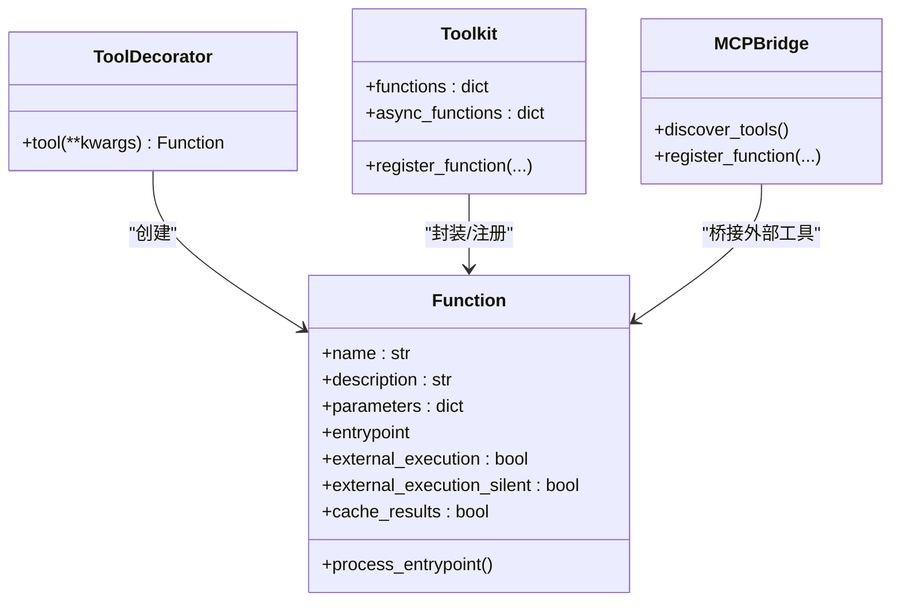
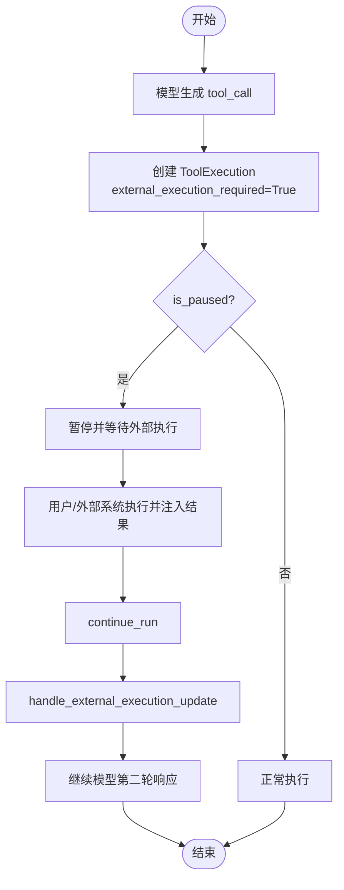
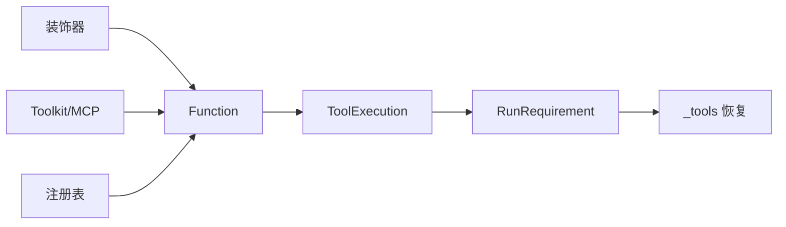

# 外部工具执行

<cite>
**本文引用的文件**
- [external_tool_execution.py](file://cookbook/02_agents/10_human_in_the_loop/external_tool_execution.py)
- [external_tool_execution.md](file://cookbook/02_agents/10_human_in_the_loop/external_tool_execution.md)
- [approval_external_execution.md](file://cookbook/02_agents/11_approvals/approval_external_execution.md)
- [function.py](file://libs/agno/agno/tools/function.py)
- [decorator.py](file://libs/agno/agno/tools/decorator.py)
- [_tools.py](file://libs/agno/agno/team/_run.py)
- [response.py](file://libs/agno/agno/models/response.py)
- [requirement.py](file://libs/agno/agno/run/requirement.py)
- [registry.py](file://libs/agno/agno/os/routers/registry/registry.py)
- [toolkit.py](file://libs/agno/agno/tools/toolkit.py)
- [mcp.py](file://libs/agno/agno/tools/mcp/mcp.py)
- [parallel.py](file://libs/agno/agno/workflow/parallel.py)
- [utils.py](file://libs/agno/agno/os/interfaces/a2a/utils.py)
- [log.py](file://libs/agno/agno/utils/log.py)
</cite>

## 目录
1. [简介](#简介)
2. [项目结构](#项目结构)
3. [核心组件](#核心组件)
4. [架构总览](#架构总览)
5. [详细组件分析](#详细组件分析)
6. [依赖分析](#依赖分析)
7. [性能考虑](#性能考虑)
8. [故障排查指南](#故障排查指南)
9. [结论](#结论)
10. [附录](#附录)

## 简介
本文件面向团队外部工具执行系统，系统性阐述外部工具的注册、配置、调用与执行状态管理机制，覆盖以下关键主题：
- 外部工具调用与执行状态跟踪
- 工具参数传递、执行权限控制与安全验证
- 异步工具执行的处理、状态监控、进度反馈与结果回调
- 工具执行监控、错误处理与性能优化最佳实践
- 对团队工作流程的影响与集成策略

## 项目结构
围绕外部工具执行的关键代码分布在如下模块：
- 工具定义与装饰器：decorator.py、function.py、toolkit.py、mcp.py
- 执行状态与暂停控制：response.py、requirement.py
- 执行调度与继续流程：_tools.py
- 注册与元数据导出：registry.py
- 示例与使用说明：external_tool_execution.py、external_tool_execution.md、approval_external_execution.md
- 并行与事件流：parallel.py、utils.py
- 日志与可观测性：log.py



图表来源
- [decorator.py](file://libs/agno/agno/tools/decorator.py)
- [function.py](file://libs/agno/agno/tools/function.py)
- [toolkit.py](file://libs/agno/agno/tools/toolkit.py)
- [mcp.py](file://libs/agno/agno/tools/mcp/mcp.py)
- [response.py](file://libs/agno/agno/models/response.py)
- [requirement.py](file://libs/agno/agno/run/requirement.py)
- [_tools.py](file://libs/agno/agno/team/_run.py)
- [registry.py](file://libs/agno/agno/os/routers/registry/registry.py)
- [external_tool_execution.py](file://cookbook/02_agents/10_human_in_the_loop/external_tool_execution.py)
- [external_tool_execution.md](file://cookbook/02_agents/10_human_in_the_loop/external_tool_execution.md)
- [approval_external_execution.md](file://cookbook/02_agents/11_approvals/approval_external_execution.md)
- [parallel.py](file://libs/agno/agno/workflow/parallel.py)
- [utils.py](file://libs/agno/agno/os/interfaces/a2a/utils.py)

章节来源
- [external_tool_execution.py](file://cookbook/02_agents/10_human_in_the_loop/external_tool_execution.py)
- [external_tool_execution.md](file://cookbook/02_agents/10_human_in_the_loop/external_tool_execution.md)
- [approval_external_execution.md](file://cookbook/02_agents/11_approvals/approval_external_execution.md)
- [decorator.py](file://libs/agno/agno/tools/decorator.py)
- [function.py](file://libs/agno/agno/tools/function.py)
- [toolkit.py](file://libs/agno/agno/tools/toolkit.py)
- [mcp.py](file://libs/agno/agno/tools/mcp/mcp.py)
- [response.py](file://libs/agno/agno/models/response.py)
- [requirement.py](file://libs/agno/agno/run/requirement.py)
- [_tools.py](file://libs/agno/agno/team/_run.py)
- [registry.py](file://libs/agno/agno/os/routers/registry/registry.py)
- [parallel.py](file://libs/agno/agno/workflow/parallel.py)
- [utils.py](file://libs/agno/agno/os/interfaces/a2a/utils.py)
- [log.py](file://libs/agno/agno/utils/log.py)

## 核心组件
- 工具函数与装饰器
  - @tool 装饰器支持 external_execution、external_execution_silent、requires_confirmation、requires_user_input 等标志位，确保三者互斥；同时支持缓存、钩子、严格模式等高级特性。
  - Function 类承载函数签名、参数模式、入口点、执行钩子、缓存策略等。
- 执行状态与暂停控制
  - ToolExecution 记录一次工具调用的执行上下文，包括是否需要外部执行、暂停原因、结果与指标。
  - RunRequirement 表达一次暂停运行所需的“需求”，其中 needs_external_execution 判断是否需要外部执行，并通过 set_external_execution_result 注入结果。
- 执行调度与继续流程
  - 在团队/代理运行过程中，遇到 external_execution_required 时，系统暂停并等待外部执行结果；随后通过 handle_external_execution_update 将外部结果注入消息流，继续后续推理。

章节来源
- [decorator.py](file://libs/agno/agno/tools/decorator.py)
- [function.py](file://libs/agno/agno/tools/function.py)
- [response.py](file://libs/agno/agno/models/response.py)
- [requirement.py](file://libs/agno/agno/run/requirement.py)
- [_tools.py](file://libs/agno/agno/team/_run.py)

## 架构总览
下图展示了外部工具执行从“模型调用工具”到“外部执行与结果注入”的完整链路。



图表来源
- [external_tool_execution.md](file://cookbook/02_agents/10_human_in_the_loop/external_tool_execution.md)
- [response.py](file://libs/agno/agno/models/response.py)
- [requirement.py](file://libs/agno/agno/run/requirement.py)
- [_tools.py](file://libs/agno/agno/team/_run.py)

## 详细组件分析

### 组件A：外部工具注册与配置
- 装饰器与函数模型
  - @tool 支持 external_execution=True 标记，使工具在 Agent 控制流之外执行；external_execution_silent 可抑制暂停时的冗长提示。
  - 装饰器内部校验 requires_user_input、requires_confirmation、external_execution 三者互斥，避免语义冲突。
  - Function.process_entrypoint 解析函数签名、参数模式与文档字符串，生成 JSON Schema；支持严格模式与缓存策略。
- 工具包与 MCP 桥接
  - Toolkit 与 MCP 工具桥接会将外部工具映射为 Function，并保留装饰器设置（如 requires_confirmation、external_execution）。
- 注册表导出
  - 注册表路由可导出工具元数据（含 Function 信息），便于前端或外部系统发现与调用。



图表来源
- [decorator.py](file://libs/agno/agno/tools/decorator.py)
- [function.py](file://libs/agno/agno/tools/function.py)
- [toolkit.py](file://libs/agno/agno/tools/toolkit.py)
- [mcp.py](file://libs/agno/agno/tools/mcp/mcp.py)

章节来源
- [decorator.py](file://libs/agno/agno/tools/decorator.py)
- [function.py](file://libs/agno/agno/tools/function.py)
- [toolkit.py](file://libs/agno/agno/tools/toolkit.py)
- [mcp.py](file://libs/agno/agno/tools/mcp/mcp.py)
- [registry.py](file://libs/agno/agno/os/routers/registry/registry.py)

### 组件B：外部工具调用与执行状态跟踪
- 暂停与恢复
  - ToolExecution.is_paused 由 requires_confirmation、requires_user_input、external_execution_required 任一满足即为真。
  - RunRequirement.needs_external_execution 基于 ToolExecution.external_execution_required 与已注入结果判断。
  - handle_external_execution_update 将外部结果转换为工具消息注入消息流，清除外部执行标记，继续后续推理。
- 结果注入与继续
  - 用户代码在外部系统执行后，调用 requirement.set_external_execution_result 注入结果；随后 agent.continue_run 触发恢复流程。



图表来源
- [response.py](file://libs/agno/agno/models/response.py)
- [requirement.py](file://libs/agno/agno/run/requirement.py)
- [_tools.py](file://libs/agno/agno/team/_run.py)

章节来源
- [response.py](file://libs/agno/agno/models/response.py)
- [requirement.py](file://libs/agno/agno/run/requirement.py)
- [_tools.py](file://libs/agno/agno/team/_run.py)

### 组件C：异步工具执行与并行处理
- 异步与并行
  - 并行执行器在多步骤中使用线程池/事件队列收集事件，支持错误事件与完成事件的统一处理。
  - A2A 接口将任务状态更新为 SSE 事件，便于前端实时感知并行步骤的启动与完成。
- 事件驱动的进度反馈
  - 并行步骤事件与完成事件通过事件队列异步产出，结合日志与事件流实现进度反馈。

```mermaid
sequenceDiagram
participant WF as "Workflow"
participant PAR as "Parallel 执行器"
participant EQ as "事件队列"
participant UI as "前端/A2A"
WF->>PAR : "提交并行步骤"
PAR->>EQ : "推送步骤开始事件"
UI-->>EQ : "接收事件流"
PAR->>EQ : "推送步骤完成/错误事件"
EQ-->>UI : "SSE 事件 : 步骤状态更新"
```

图表来源
- [parallel.py](file://libs/agno/agno/workflow/parallel.py)
- [utils.py](file://libs/agno/agno/os/interfaces/a2a/utils.py)

章节来源
- [parallel.py](file://libs/agno/agno/workflow/parallel.py)
- [utils.py](file://libs/agno/agno/os/interfaces/a2a/utils.py)

### 组件D：参数传递、权限控制与安全验证
- 参数传递
  - @tool 将函数签名解析为 JSON Schema，自动提取参数类型与描述；支持严格模式强制所有字段为必填。
- 权限与审批
  - external_execution 与 requires_confirmation、requires_user_input 三者互斥，避免权限与控制流冲突。
  - 审批型外部执行（approval_external_execution 文档）可结合审批系统，先创建待审批记录，再由外部系统执行并回注结果。
- 安全验证
  - 外部执行由用户代码或外部系统自行调用 entrypoint，框架不对执行环境做限制，建议在外部侧实施沙箱、权限与输入校验。

章节来源
- [decorator.py](file://libs/agno/agno/tools/decorator.py)
- [function.py](file://libs/agno/agno/tools/function.py)
- [approval_external_execution.md](file://cookbook/02_agents/11_approvals/approval_external_execution.md)

### 组件E：执行监控、错误处理与性能优化
- 监控与日志
  - 使用统一日志接口输出调试/信息/警告/错误级别日志，支持切换不同源类型的日志器。
- 错误处理
  - 并行执行器捕获异常并生成错误事件，保证事件流的完整性；外部执行结果缺失时抛出明确错误，防止继续运行。
- 性能优化
  - Function 支持结果缓存（基于函数名与参数哈希），减少重复外部调用开销；并行执行器通过线程池并发提升吞吐。

章节来源
- [log.py](file://libs/agno/agno/utils/log.py)
- [function.py](file://libs/agno/agno/tools/function.py)
- [parallel.py](file://libs/agno/agno/workflow/parallel.py)

## 依赖分析
- 组件耦合
  - @tool 与 Function：装饰器负责装配 Function，后者承载执行细节。
  - ToolExecution 与 RunRequirement：前者记录执行上下文，后者表达暂停需求与结果注入。
  - _tools 执行与恢复：在团队/代理运行中根据 ToolExecution 状态决定是否进行外部执行更新。
- 外部依赖
  - MCP 工具桥接与注册表导出：将外部工具无缝接入系统。



图表来源
- [decorator.py](file://libs/agno/agno/tools/decorator.py)
- [function.py](file://libs/agno/agno/tools/function.py)
- [response.py](file://libs/agno/agno/models/response.py)
- [requirement.py](file://libs/agno/agno/run/requirement.py)
- [_tools.py](file://libs/agno/agno/team/_run.py)
- [toolkit.py](file://libs/agno/agno/tools/toolkit.py)
- [mcp.py](file://libs/agno/agno/tools/mcp/mcp.py)
- [registry.py](file://libs/agno/agno/os/routers/registry/registry.py)

章节来源
- [decorator.py](file://libs/agno/agno/tools/decorator.py)
- [function.py](file://libs/agno/agno/tools/function.py)
- [response.py](file://libs/agno/agno/models/response.py)
- [requirement.py](file://libs/agno/agno/run/requirement.py)
- [_tools.py](file://libs/agno/agno/team/_run.py)
- [toolkit.py](file://libs/agno/agno/tools/toolkit.py)
- [mcp.py](file://libs/agno/agno/tools/mcp/mcp.py)
- [registry.py](file://libs/agno/agno/os/routers/registry/registry.py)

## 性能考虑
- 缓存策略：启用 cache_results 与合理 cache_ttl，显著降低重复外部调用成本。
- 并行化：利用并行执行器并发处理多个步骤，提高整体吞吐。
- 日志级别：生产环境建议使用 INFO 或 WARNING，避免过度调试日志影响性能。

## 故障排查指南
- 外部执行未注入结果
  - 现象：继续运行时报错，提示工具仍需外部执行。
  - 排查：确认 requirement.needs_external_execution 为真，检查 set_external_execution_result 是否被调用。
- 三者标志冲突
  - 现象：装饰器抛出参数冲突错误。
  - 排查：确保 requires_user_input、requires_confirmation、external_execution 仅设置其一。
- 并行步骤失败
  - 现象：事件流出现错误事件。
  - 排查：查看并行执行器的日志与错误事件内容，定位具体步骤与异常原因。

章节来源
- [requirement.py](file://libs/agno/agno/run/requirement.py)
- [decorator.py](file://libs/agno/agno/tools/decorator.py)
- [parallel.py](file://libs/agno/agno/workflow/parallel.py)

## 结论
外部工具执行系统通过“装饰器+函数模型+执行状态+需求注入”的组合，实现了灵活可控的外部执行能力。配合并行执行与事件流，系统能够高效地处理复杂工作流中的外部调用与状态管理。建议在外部侧落实权限与安全控制，并结合缓存与并行化策略以获得更好的性能与可观测性。

## 附录
- 快速参考
  - 外部工具示例与流程：见示例脚本与文档。
  - 审批+外部执行：见审批外部执行文档。
  - 并行与事件：见并行执行与 A2A 事件工具。

章节来源
- [external_tool_execution.py](file://cookbook/02_agents/10_human_in_the_loop/external_tool_execution.py)
- [external_tool_execution.md](file://cookbook/02_agents/10_human_in_the_loop/external_tool_execution.md)
- [approval_external_execution.md](file://cookbook/02_agents/11_approvals/approval_external_execution.md)
- [parallel.py](file://libs/agno/agno/workflow/parallel.py)
- [utils.py](file://libs/agno/agno/os/interfaces/a2a/utils.py)