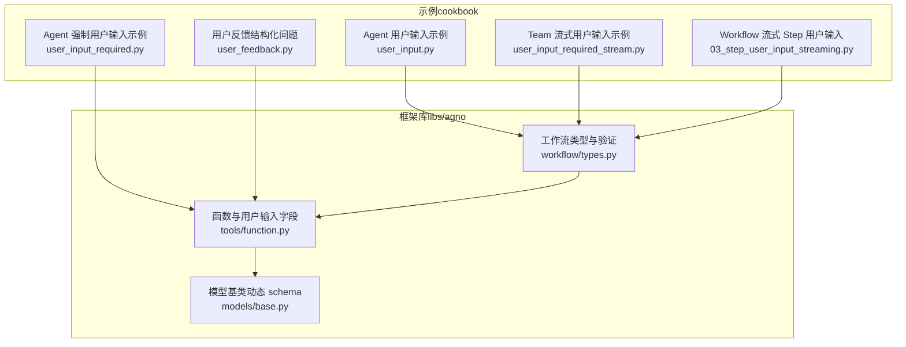
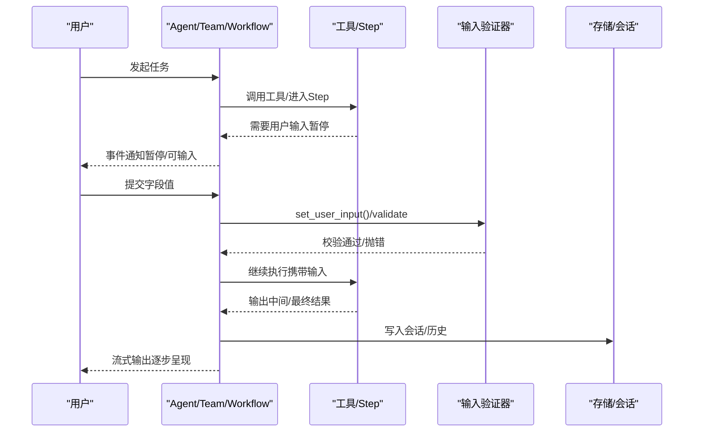
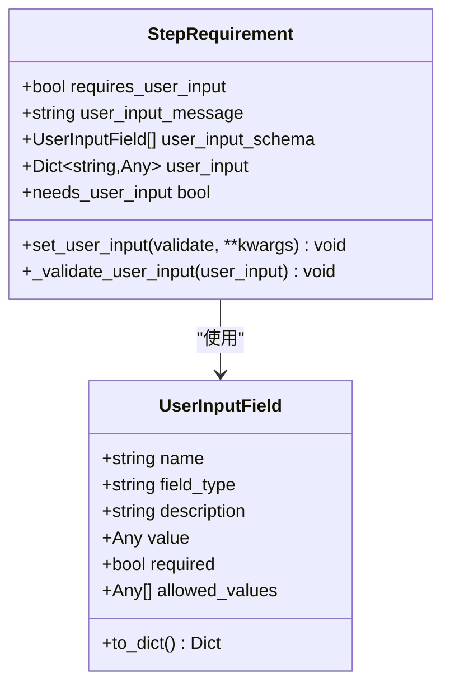
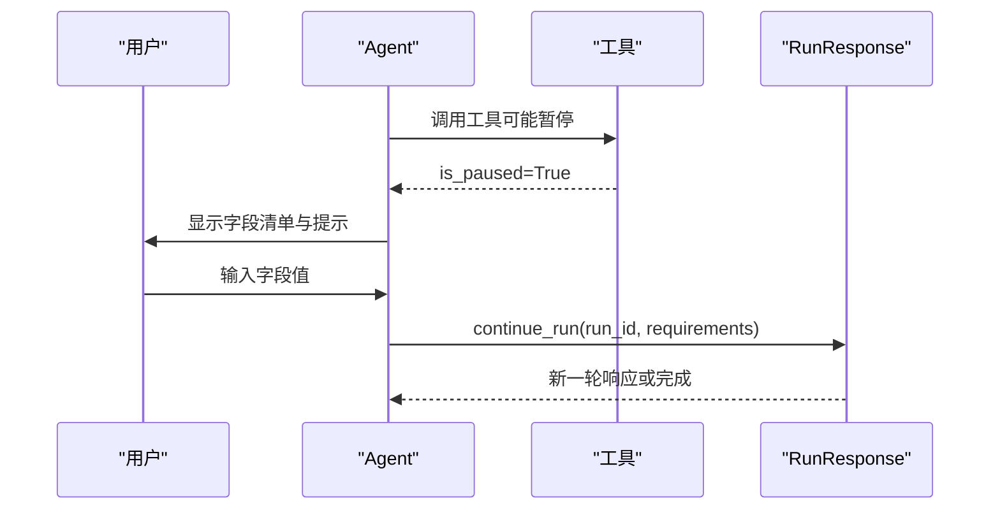
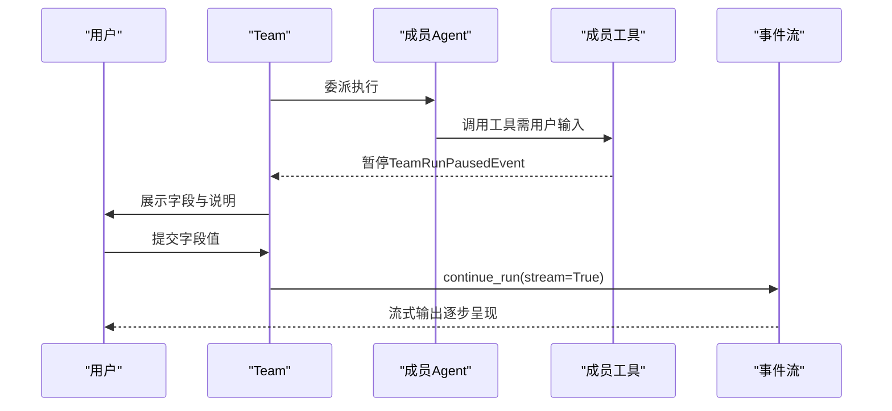
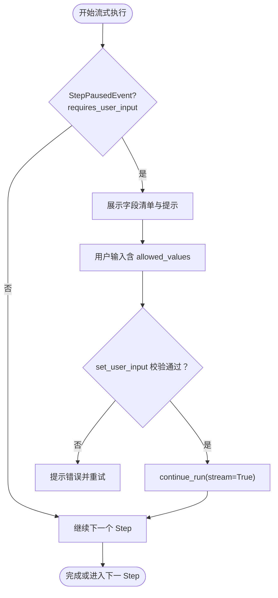
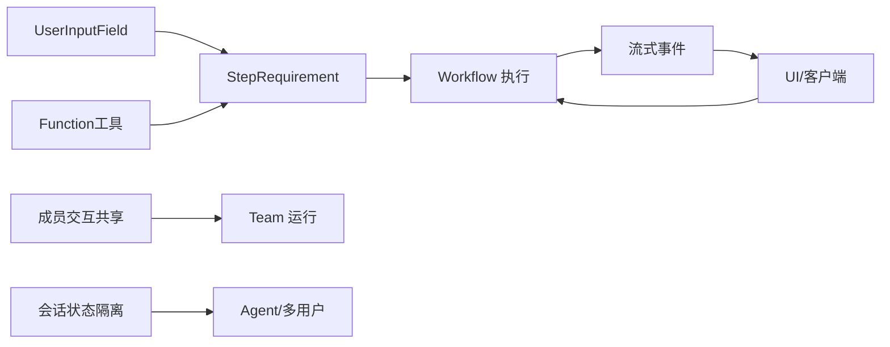

# 用户交互

<cite>
**本文引用的文件**
- [cookbook/02_agents/10_human_in_the_loop/user_input.py](file://cookbook/02_agents/10_human_in_the_loop/user_input.py)
- [cookbook/02_agents/10_human_in_the_loop/user_input_required.py](file://cookbook/02_agents/10_human_in_the_loop/user_input_required.py)
- [cookbook/02_agents/10_human_in_the_loop/user_feedback.py](file://cookbook/02_agents/10_human_in_the_loop/user_feedback.py)
- [cookbook/03_teams/20_human_in_the_loop/user_input_required_stream.py](file://cookbook/03_teams/20_human_in_the_loop/user_input_required_stream.py)
- [cookbook/04_workflows/_07_human_in_the_loop/user_input/03_step_user_input_streaming.py](file://cookbook/04_workflows/_07_human_in_the_loop/user_input/03_step_user_input_streaming.py)
- [libs/agno/agno/workflow/types.py](file://libs/agno/agno/workflow/types.py)
- [libs/agno/agno/tools/function.py](file://libs/agno/agno/tools/function.py)
- [cookbook/03_teams/01_quickstart/07_share_member_interactions.md](file://cookbook/03_teams/01_quickstart/07_share_member_interactions.md)
- [cookbook/03_teams/01_quickstart/05_team_history.md](file://cookbook/03_teams/01_quickstart/05_team_history.md)
- [cookbook/02_agents/05_state_and_session/session_state_multiple_users.py](file://cookbook/02_agents/05_state_and_session/session_state_multiple_users.py)
- [libs/agno/agno/os/router.py](file://libs/agno/agno/os/router.py)
- [libs/agno/agno/os/routers/workflows/router.py](file://libs/agno/agno/os/routers/workflows/router.py)
- [libs/agno/agno/models/base.py](file://libs/agno/agno/models/base.py)
</cite>

## 目录
1. [简介](#简介)
2. [项目结构](#项目结构)
3. [核心组件](#核心组件)
4. [架构总览](#架构总览)
5. [详细组件分析](#详细组件分析)
6. [依赖分析](#依赖分析)
7. [性能考虑](#性能考虑)
8. [故障排查指南](#故障排查指南)
9. [结论](#结论)
10. [附录](#附录)

## 简介
本文件围绕“团队用户交互系统”展开，聚焦人类用户的输入要求、输入验证与流式交互实现。文档从三个维度构建：输入收集与处理（字段定义、类型与业务规则校验）、流式交互（实时暂停/恢复、事件驱动）、以及团队协作效率提升（成员间上下文共享、会话状态隔离）。文中提供可追溯的代码路径与可视化图示，帮助读者快速定位实现细节并进行最佳实践迁移。

## 项目结构
本仓库以“食谱（cookbook）+ 框架库（libs/agno）”组织，其中：
- cookbook 提供端到端示例，覆盖 Agent、Team、Workflow 的用户输入与流式交互场景；
- libs/agno 提供核心类型、工具与运行时事件模型，支撑输入字段、验证逻辑与流式事件的统一抽象。

图表来源
- [cookbook/02_agents/10_human_in_the_loop/user_input.py:1-145](file://cookbook/02_agents/10_human_in_the_loop/user_input.py#L1-L145)
- [cookbook/02_agents/10_human_in_the_loop/user_input_required.py:1-82](file://cookbook/02_agents/10_human_in_the_loop/user_input_required.py#L1-L82)
- [cookbook/02_agents/10_human_in_the_loop/user_feedback.py:1-83](file://cookbook/02_agents/10_human_in_the_loop/user_feedback.py#L1-L83)
- [cookbook/03_teams/20_human_in_the_loop/user_input_required_stream.py:1-86](file://cookbook/03_teams/20_human_in_the_loop/user_input_required_stream.py#L1-L86)
- [cookbook/04_workflows/_07_human_in_the_loop/user_input/03_step_user_input_streaming.py:1-278](file://cookbook/04_workflows/_07_human_in_the_loop/user_input/03_step_user_input_streaming.py#L1-L278)
- [libs/agno/agno/workflow/types.py:533-799](file://libs/agno/agno/workflow/types.py#L533-L799)
- [libs/agno/agno/tools/function.py:40-800](file://libs/agno/agno/tools/function.py#L40-L800)
- [libs/agno/agno/models/base.py:2506-2521](file://libs/agno/agno/models/base.py#L2506-L2521)

章节来源
- [cookbook/02_agents/10_human_in_the_loop/user_input.py:1-145](file://cookbook/02_agents/10_human_in_the_loop/user_input.py#L1-L145)
- [cookbook/02_agents/10_human_in_the_loop/user_input_required.py:1-82](file://cookbook/02_agents/10_human_in_the_loop/user_input_required.py#L1-L82)
- [cookbook/02_agents/10_human_in_the_loop/user_feedback.py:1-83](file://cookbook/02_agents/10_human_in_the_loop/user_feedback.py#L1-L83)
- [cookbook/03_teams/20_human_in_the_loop/user_input_required_stream.py:1-86](file://cookbook/03_teams/20_human_in_the_loop/user_input_required_stream.py#L1-L86)
- [cookbook/04_workflows/_07_human_in_the_loop/user_input/03_step_user_input_streaming.py:1-278](file://cookbook/04_workflows/_07_human_in_the_loop/user_input/03_step_user_input_streaming.py#L1-L278)
- [libs/agno/agno/workflow/types.py:533-799](file://libs/agno/agno/workflow/types.py#L533-L799)
- [libs/agno/agno/tools/function.py:40-800](file://libs/agno/agno/tools/function.py#L40-L800)
- [libs/agno/agno/models/base.py:2506-2521](file://libs/agno/agno/models/base.py#L2506-L2521)

## 核心组件
- 用户输入字段模型：用于描述每个待采集字段的名称、类型、是否必填、允许值集合等元信息，并支持序列化/反序列化。
- 输入验证器：在 Step 或工具层对用户输入进行类型与取值范围校验，必要时抛出异常以触发重提示。
- 流式事件与暂停恢复：在 Agent/Team/Workflow 的流式执行中，遇到用户输入需求时产生暂停事件，用户补充后继续流式输出。
- 团队协作上下文：成员间交互可在同一次运行内共享，减少重复输入与查询；会话状态按用户/会话隔离，保障多租户一致性。

章节来源
- [libs/agno/agno/workflow/types.py:533-799](file://libs/agno/agno/workflow/types.py#L533-L799)
- [libs/agno/agno/tools/function.py:40-800](file://libs/agno/agno/tools/function.py#L40-L800)
- [cookbook/03_teams/01_quickstart/07_share_member_interactions.md:60-91](file://cookbook/03_teams/01_quickstart/07_share_member_interactions.md#L60-L91)
- [cookbook/02_agents/05_state_and_session/session_state_multiple_users.py:1-135](file://cookbook/02_agents/05_state_and_session/session_state_multiple_users.py#L1-L135)

## 架构总览
下图展示了从“用户输入触发”到“流式输出恢复”的整体链路，涵盖 Agent、Team、Workflow 三种运行体，以及输入字段与验证器的协作关系。

图表来源
- [cookbook/04_workflows/_07_human_in_the_loop/user_input/03_step_user_input_streaming.py:106-164](file://cookbook/04_workflows/_07_human_in_the_loop/user_input/03_step_user_input_streaming.py#L106-L164)
- [libs/agno/agno/workflow/types.py:634-703](file://libs/agno/agno/workflow/types.py#L634-L703)
- [libs/agno/agno/tools/function.py:417-502](file://libs/agno/agno/tools/function.py#L417-L502)

## 详细组件分析

### 组件A：用户输入字段与验证（Step/工具层）
- 字段模型：支持 name、field_type、description、value、required、allowed_values 等属性，便于 UI 展示与校验。
- 验证策略：必填校验、类型匹配（str/int/float/bool）、取值范围约束（allowed_values），失败时抛出异常，驱动重提示。
- 动态 schema：模型基类可将输入字段映射为 UserInputField，便于统一处理。

图表来源
- [libs/agno/agno/workflow/types.py:533-799](file://libs/agno/agno/workflow/types.py#L533-L799)
- [libs/agno/agno/models/base.py:2506-2521](file://libs/agno/agno/models/base.py#L2506-L2521)

章节来源
- [libs/agno/agno/workflow/types.py:634-703](file://libs/agno/agno/workflow/types.py#L634-L703)
- [libs/agno/agno/models/base.py:2506-2521](file://libs/agno/agno/models/base.py#L2506-L2521)

### 组件B：Agent 级用户输入（非流式）
- 场景：工具声明 requires_user_input 或通过 get_user_input 返回值后，Agent 在本地循环等待用户输入，更新字段值后继续运行。
- 特点：简单直观，适合小规模交互与调试。

图表来源
- [cookbook/02_agents/10_human_in_the_loop/user_input.py:76-108](file://cookbook/02_agents/10_human_in_the_loop/user_input.py#L76-L108)
- [cookbook/02_agents/10_human_in_the_loop/user_input_required.py:45-78](file://cookbook/02_agents/10_human_in_the_loop/user_input_required.py#L45-L78)

章节来源
- [cookbook/02_agents/10_human_in_the_loop/user_input.py:76-145](file://cookbook/02_agents/10_human_in_the_loop/user_input.py#L76-L145)
- [cookbook/02_agents/10_human_in_the_loop/user_input_required.py:45-82](file://cookbook/02_agents/10_human_in_the_loop/user_input_required.py#L45-L82)

### 组件C：Team 级流式用户输入
- 场景：Team 在成员工具需要用户输入时触发 TeamRunPausedEvent，UI 可识别并提示用户，随后通过 provide_user_input 提交，再 continue_run(stream=True) 恢复流式输出。
- 关键点：区分 Team 暂停与成员暂停，仅在 Team 层面处理用户输入。

图表来源
- [cookbook/03_teams/20_human_in_the_loop/user_input_required_stream.py:67-85](file://cookbook/03_teams/20_human_in_the_loop/user_input_required_stream.py#L67-L85)

章节来源
- [cookbook/03_teams/20_human_in_the_loop/user_input_required_stream.py:67-86](file://cookbook/03_teams/20_human_in_the_loop/user_input_required_stream.py#L67-L86)

### 组件D：Workflow 级流式 Step 用户输入
- 场景：Step 级别配置 requires_user_input，流式执行中通过 StepPausedEvent 捕获暂停，UI 展示字段清单与 allowed_values，set_user_input 内置校验，失败则重提示。
- 特性：支持字段类型转换（str/int/float/bool），并可显示允许值列表辅助选择。

图表来源
- [cookbook/04_workflows/_07_human_in_the_loop/user_input/03_step_user_input_streaming.py:106-164](file://cookbook/04_workflows/_07_human_in_the_loop/user_input/03_step_user_input_streaming.py#L106-L164)
- [libs/agno/agno/workflow/types.py:634-703](file://libs/agno/agno/workflow/types.py#L634-L703)

章节来源
- [cookbook/04_workflows/_07_human_in_the_loop/user_input/03_step_user_input_streaming.py:106-278](file://cookbook/04_workflows/_07_human_in_the_loop/user_input/03_step_user_input_streaming.py#L106-L278)
- [libs/agno/agno/workflow/types.py:634-703](file://libs/agno/agno/workflow/types.py#L634-L703)

### 组件E：用户反馈（结构化问题）
- 场景：通过 UserFeedbackTools 提供结构化问题与选项，用户多选/单选后提交，Agent 继续执行。
- 适用：偏好设置、确认流程等标准化交互。

章节来源
- [cookbook/02_agents/10_human_in_the_loop/user_feedback.py:32-83](file://cookbook/02_agents/10_human_in_the_loop/user_feedback.py#L32-L83)

### 组件F：团队协作上下文共享与会话隔离
- 成员交互共享：在同一运行内，前序成员的交互会被注入到后续成员上下文，减少重复输入与查询。
- 会话状态隔离：多用户/多会话通过 user_id 与 session_id 区分，避免交叉污染。

章节来源
- [cookbook/03_teams/01_quickstart/07_share_member_interactions.md:60-91](file://cookbook/03_teams/01_quickstart/07_share_member_interactions.md#L60-L91)
- [cookbook/03_teams/01_quickstart/05_team_history.md:88-113](file://cookbook/03_teams/01_quickstart/05_team_history.md#L88-L113)
- [cookbook/02_agents/05_state_and_session/session_state_multiple_users.py:78-135](file://cookbook/02_agents/05_state_and_session/session_state_multiple_users.py#L78-L135)

## 依赖分析
- 输入字段与验证：StepRequirement 依赖 UserInputField 完成字段级校验；工具层 Function 通过 process_entrypoint 生成 user_input_schema，二者协同保证输入质量。
- 流式事件：Agent/Team/Workflow 在暂停时发出事件，UI 侧监听并处理；恢复时通过 continue_run 恢复流式输出。
- 上下文与状态：Team 的成员交互共享与会话状态隔离分别由运行内注入与用户/会话标识控制，避免数据串扰。

图表来源
- [libs/agno/agno/workflow/types.py:533-799](file://libs/agno/agno/workflow/types.py#L533-L799)
- [libs/agno/agno/tools/function.py:417-502](file://libs/agno/agno/tools/function.py#L417-L502)
- [cookbook/03_teams/01_quickstart/07_share_member_interactions.md:60-91](file://cookbook/03_teams/01_quickstart/07_share_member_interactions.md#L60-L91)
- [cookbook/02_agents/05_state_and_session/session_state_multiple_users.py:78-135](file://cookbook/02_agents/05_state_and_session/session_state_multiple_users.py#L78-L135)

章节来源
- [libs/agno/agno/workflow/types.py:533-799](file://libs/agno/agno/workflow/types.py#L533-L799)
- [libs/agno/agno/tools/function.py:417-502](file://libs/agno/agno/tools/function.py#L417-L502)
- [cookbook/03_teams/01_quickstart/07_share_member_interactions.md:60-91](file://cookbook/03_teams/01_quickstart/07_share_member_interactions.md#L60-L91)
- [cookbook/02_agents/05_state_and_session/session_state_multiple_users.py:78-135](file://cookbook/02_agents/05_state_and_session/session_state_multiple_users.py#L78-L135)

## 性能考虑
- 流式事件处理：在长流程中建议仅启用必要的流式事件（如 stream_events=True），避免过多事件带来的内存与带宽压力。
- 输入验证前置：在 UI 侧进行基础类型与范围校验，减少无效请求与服务端重试。
- 缓存与去重：对重复输入（如成员交互共享）进行缓存与去重，降低重复计算与网络开销。
- 会话分片：多用户/多会话场景下，合理划分 session_id，避免单会话过大导致查询与写入延迟。

## 故障排查指南
- 输入验证失败
  - 现象：set_user_input 抛出异常，提示必填缺失或类型不匹配。
  - 排查：检查 required 与 allowed_values 配置，确认 UI 是否正确传递字段类型。
  - 参考实现路径：[libs/agno/agno/workflow/types.py:659-703](file://libs/agno/agno/workflow/types.py#L659-L703)
- 流式暂停未恢复
  - 现象：收到 StepPausedEvent/TeamRunPausedEvent 后未继续。
  - 排查：确认是否使用 continue_run(stream=True)，并正确提交用户输入。
  - 参考实现路径：[cookbook/04_workflows/_07_human_in_the_loop/user_input/03_step_user_input_streaming.py:235-262](file://cookbook/04_workflows/_07_human_in_the_loop/user_input/03_step_user_input_streaming.py#L235-L262)
- WebSocket 认证与事件回放
  - 现象：WebSocket 未认证或事件丢失。
  - 排查：确保发送 authenticate 动作并携带有效 token；关注 replay 事件与事件索引。
  - 参考实现路径：[libs/agno/agno/os/router.py:263-290](file://libs/agno/agno/os/router.py#L263-L290)，[libs/agno/agno/os/routers/workflows/router.py:203-230](file://libs/agno/agno/os/routers/workflows/router.py#L203-L230)

章节来源
- [libs/agno/agno/workflow/types.py:659-703](file://libs/agno/agno/workflow/types.py#L659-L703)
- [cookbook/04_workflows/_07_human_in_the_loop/user_input/03_step_user_input_streaming.py:235-262](file://cookbook/04_workflows/_07_human_in_the_loop/user_input/03_step_user_input_streaming.py#L235-L262)
- [libs/agno/agno/os/router.py:263-290](file://libs/agno/agno/os/router.py#L263-L290)
- [libs/agno/agno/os/routers/workflows/router.py:203-230](file://libs/agno/agno/os/routers/workflows/router.py#L203-L230)

## 结论
该系统通过统一的用户输入字段模型与验证器，结合 Agent/Team/Workflow 的流式事件机制，实现了从“输入收集—验证—执行—反馈”的闭环。团队协作层面，成员交互共享与会话状态隔离进一步提升了跨成员的一致性与效率。建议在实际落地中优先完善 UI 前置校验、优化事件流与回放策略，并在多用户场景下强化会话隔离与权限控制。

## 附录
- 示例代码路径（不含具体代码内容，仅供定位）
  - 基本用户输入收集：[cookbook/02_agents/10_human_in_the_loop/user_input.py:76-145](file://cookbook/02_agents/10_human_in_the_loop/user_input.py#L76-L145)
  - 强制用户输入工具：[cookbook/02_agents/10_human_in_the_loop/user_input_required.py:45-82](file://cookbook/02_agents/10_human_in_the_loop/user_input_required.py#L45-L82)
  - 用户反馈（结构化问题）：[cookbook/02_agents/10_human_in_the_loop/user_feedback.py:32-83](file://cookbook/02_agents/10_human_in_the_loop/user_feedback.py#L32-L83)
  - Team 流式用户输入：[cookbook/03_teams/20_human_in_the_loop/user_input_required_stream.py:67-85](file://cookbook/03_teams/20_human_in_the_loop/user_input_required_stream.py#L67-L85)
  - Workflow 流式 Step 用户输入：[cookbook/04_workflows/_07_human_in_the_loop/user_input/03_step_user_input_streaming.py:166-278](file://cookbook/04_workflows/_07_human_in_the_loop/user_input/03_step_user_input_streaming.py#L166-L278)
  - 输入字段与验证（框架）：[libs/agno/agno/workflow/types.py:533-799](file://libs/agno/agno/workflow/types.py#L533-L799)
  - 工具层输入 schema 生成：[libs/agno/agno/tools/function.py:417-502](file://libs/agno/agno/tools/function.py#L417-L502)
  - 成员交互共享说明：[cookbook/03_teams/01_quickstart/07_share_member_interactions.md:60-91](file://cookbook/03_teams/01_quickstart/07_share_member_interactions.md#L60-L91)
  - 会话状态多用户示例：[cookbook/02_agents/05_state_and_session/session_state_multiple_users.py:78-135](file://cookbook/02_agents/05_state_and_session/session_state_multiple_users.py#L78-L135)
  - WebSocket 认证与回放：[libs/agno/agno/os/router.py:263-290](file://libs/agno/agno/os/router.py#L263-L290)，[libs/agno/agno/os/routers/workflows/router.py:203-230](file://libs/agno/agno/os/routers/workflows/router.py#L203-L230)