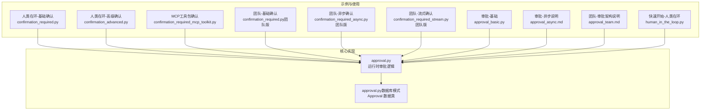
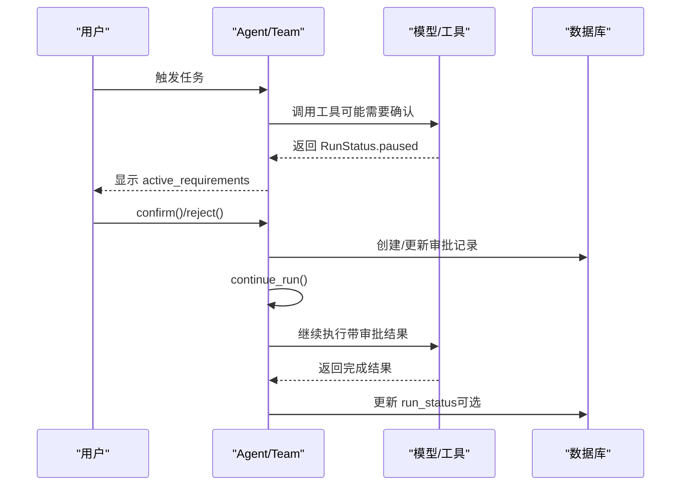
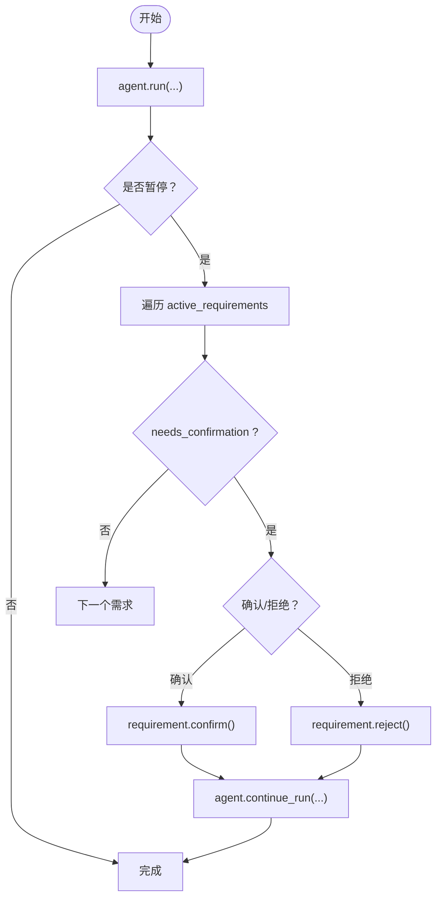
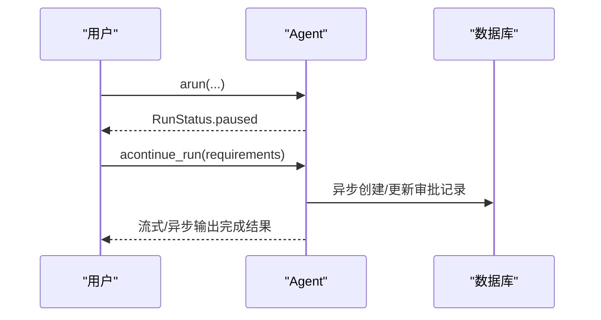
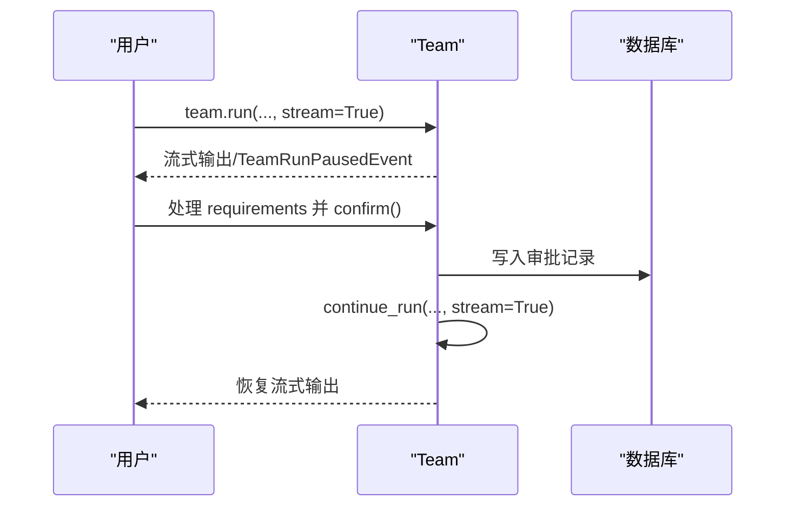
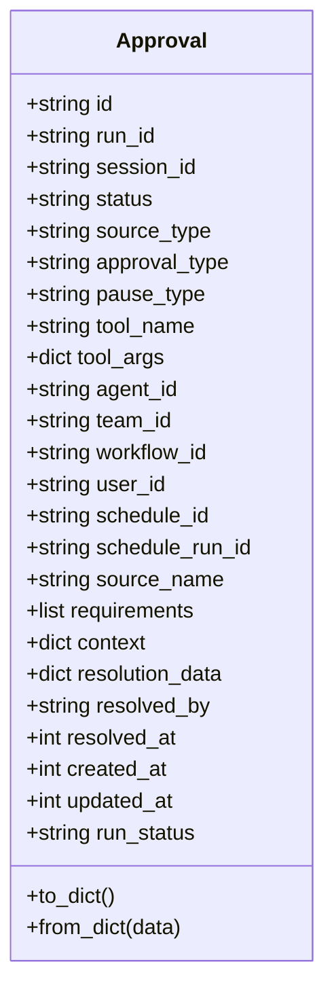
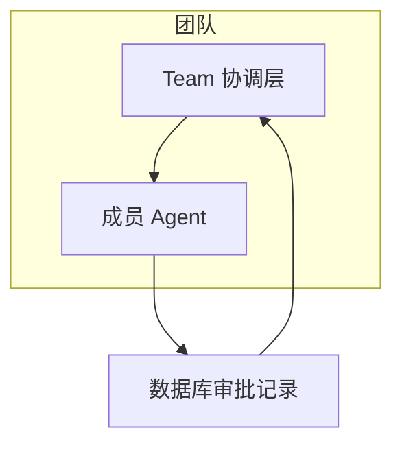
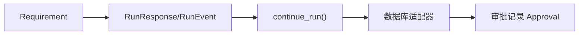

# 确认机制

<cite>
**本文引用的文件**   
- [confirmation_required.py](file://cookbook/02_agents/10_human_in_the_loop/confirmation_required.py)
- [confirmation_advanced.py](file://cookbook/02_agents/10_human_in_the_loop/confirmation_advanced.py)
- [confirmation_required_mcp_toolkit.py](file://cookbook/02_agents/10_human_in_the_loop/confirmation_required_mcp_toolkit.py)
- [confirmation_required.py（团队版）](file://cookbook/03_teams/20_human_in_the_loop/confirmation_required.py)
- [confirmation_required_async.py（团队版）](file://cookbook/03_teams/20_human_in_the_loop/confirmation_required_async.py)
- [confirmation_required_stream.py（团队版）](file://cookbook/03_teams/20_human_in_the_loop/confirmation_required_stream.py)
- [approval_basic.py](file://cookbook/02_agents/11_approvals/approval_basic.py)
- [approval_async.md](file://cookbook/02_agents/11_approvals/approval_async.md)
- [approval_team.md](file://cookbook/03_teams/20_human_in_the_loop/approval_team.md)
- [approval.py](file://libs/agno/agno/run/approval.py)
- [approval.py（数据库模式）](file://libs/agno/agno/db/schemas/approval.py)
- [human_in_the_loop.py（快速开始）](file://cookbook/00_quickstart/human_in_the_loop.py)
</cite>

## 目录
1. [简介](#简介)
2. [项目结构](#项目结构)
3. [核心组件](#核心组件)
4. [架构总览](#架构总览)
5. [详细组件分析](#详细组件分析)
6. [依赖分析](#依赖分析)
7. [性能考虑](#性能考虑)
8. [故障排查指南](#故障排查指南)
9. [结论](#结论)
10. [附录](#附录)

## 简介
本文件系统化梳理团队中的“确认机制”，覆盖以下能力与场景：
- 基本确认：在工具调用前要求人工确认，支持同步与异步两种模式
- 异步确认：通过异步运行与继续流程，实现非阻塞等待审批
- 流式确认：在流式输出中识别团队暂停事件，完成确认后再恢复
- 拒绝确认：允许用户拒绝特定需求，拒绝后可选择终止或继续其他流程
- 状态管理：RunStatus、RunPausedEvent、active_requirements 等状态与事件驱动
- 审批记录：持久化审批记录（required/audit），支持查询、更新与审计
- 超时与清理：审批记录过期与清理策略（概念性说明）

该机制在团队协作中承担“决策质量保证、风险控制与合规性管理”的职责，既保障高风险动作的可控执行，又通过流式与异步提升团队效率。

## 项目结构
围绕确认机制的相关代码主要分布在以下位置：
- 人类在环（HITL）示例：cookbook/02_agents/10_human_in_the_loop
- 团队级确认示例：cookbook/03_teams/20_human_in_the_loop
- 审批（Approval）示例：cookbook/02_agents/11_approvals
- 核心实现：libs/agno/agno/run/approval.py
- 数据库模式：libs/agno/agno/db/schemas/approval.py
- 快速开始示例：cookbook/00_quickstart/human_in_the_loop.py

图表来源
- [confirmation_required.py:1-96](file://cookbook/02_agents/10_human_in_the_loop/confirmation_required.py#L1-L96)
- [confirmation_advanced.py:1-97](file://cookbook/02_agents/10_human_in_the_loop/confirmation_advanced.py#L1-L97)
- [confirmation_required_mcp_toolkit.py:1-80](file://cookbook/02_agents/10_human_in_the_loop/confirmation_required_mcp_toolkit.py#L1-L80)
- [confirmation_required.py（团队版）:1-88](file://cookbook/03_teams/20_human_in_the_loop/confirmation_required.py#L1-L88)
- [confirmation_required_async.py（团队版）:1-71](file://cookbook/03_teams/20_human_in_the_loop/confirmation_required_async.py#L1-L71)
- [confirmation_required_stream.py（团队版）:1-87](file://cookbook/03_teams/20_human_in_the_loop/confirmation_required_stream.py#L1-L87)
- [approval_basic.py:1-132](file://cookbook/02_agents/11_approvals/approval_basic.py#L1-L132)
- [approval_async.md:100-156](file://cookbook/02_agents/11_approvals/approval_async.md#L100-L156)
- [approval_team.md:20-152](file://cookbook/03_teams/20_human_in_the_loop/approval_team.md#L20-L152)
- [approval.py:1-570](file://libs/agno/agno/run/approval.py#L1-L570)
- [approval.py（数据库模式）:1-108](file://libs/agno/agno/db/schemas/approval.py#L1-L108)

章节来源
- [confirmation_required.py:1-96](file://cookbook/02_agents/10_human_in_the_loop/confirmation_required.py#L1-L96)
- [confirmation_advanced.py:1-97](file://cookbook/02_agents/10_human_in_the_loop/confirmation_advanced.py#L1-L97)
- [confirmation_required_mcp_toolkit.py:1-80](file://cookbook/02_agents/10_human_in_the_loop/confirmation_required_mcp_toolkit.py#L1-L80)
- [confirmation_required.py（团队版）:1-88](file://cookbook/03_teams/20_human_in_the_loop/confirmation_required.py#L1-L88)
- [confirmation_required_async.py（团队版）:1-71](file://cookbook/03_teams/20_human_in_the_loop/confirmation_required_async.py#L1-L71)
- [confirmation_required_stream.py（团队版）:1-87](file://cookbook/03_teams/20_human_in_the_loop/confirmation_required_stream.py#L1-L87)
- [approval_basic.py:1-132](file://cookbook/02_agents/11_approvals/approval_basic.py#L1-L132)
- [approval_async.md:100-156](file://cookbook/02_agents/11_approvals/approval_async.md#L100-L156)
- [approval_team.md:20-152](file://cookbook/03_teams/20_human_in_the_loop/approval_team.md#L20-L152)
- [approval.py:1-570](file://libs/agno/agno/run/approval.py#L1-L570)
- [approval.py（数据库模式）:1-108](file://libs/agno/agno/db/schemas/approval.py#L1-L108)

## 核心组件
- Requirement 对象与 active_requirements：表示当前待处理的人工确认需求，包含 needs_confirmation、tool_execution 等字段
- RunResponse/RunEvent：包含 run_id、is_paused、status、requirements 等，驱动确认流程
- TeamRunPausedEvent：团队级暂停事件，区分于成员 Agent 的暂停
- 审批记录 Approval：持久化记录 approval_type（required/audit）、pause_type（confirmation/user_input/external_execution）、status（pending/approved/rejected/expired/cancelled）等
- 审批门控与应用：check_and_apply_approval_resolution / acheck_and_apply_approval_resolution 在继续运行前校验审批状态，并将审批结果应用到工具

章节来源
- [approval_basic.py:98-109](file://cookbook/02_agents/11_approvals/approval_basic.py#L98-L109)
- [confirmation_required.py（团队版）:61-85](file://cookbook/03_teams/20_human_in_the_loop/confirmation_required.py#L61-L85)
- [confirmation_required_stream.py（团队版）:71-85](file://cookbook/03_teams/20_human_in_the_loop/confirmation_required_stream.py#L71-L85)
- [approval.py:394-440](file://libs/agno/agno/run/approval.py#L394-L440)
- [approval.py（数据库模式）:7-38](file://libs/agno/agno/db/schemas/approval.py#L7-L38)

## 架构总览
确认机制以“工具暂停 → 人工确认 → 继续运行”为主线，贯穿 Agent 与 Team 两种层级。团队模式下，成员 Agent 的工具调用可能触发团队暂停事件，需通过 team.continue_run 恢复；同时，审批记录会在数据库中持久化，支持后续审计与状态更新。

图表来源
- [approval_basic.py:78-129](file://cookbook/02_agents/11_approvals/approval_basic.py#L78-L129)
- [confirmation_required.py（团队版）:57-87](file://cookbook/03_teams/20_human_in_the_loop/confirmation_required.py#L57-L87)
- [approval.py:152-201](file://libs/agno/agno/run/approval.py#L152-L201)

## 详细组件分析

### 基本确认（同步）
- 场景：工具调用前需要人工确认，确认后继续运行
- 关键点：
  - 使用 @tool(requires_confirmation=True) 标记工具
  - run_response.is_paused 为真时遍历 active_requirements
  - requirement.confirm() 或 requirement.reject() 控制是否继续
  - agent.continue_run(run_id, requirements) 恢复执行
- 示例路径：
  - [confirmation_required.py:63-95](file://cookbook/02_agents/10_human_in_the_loop/confirmation_required.py#L63-L95)
  - [human_in_the_loop.py（快速开始）:63-95](file://cookbook/00_quickstart/human_in_the_loop.py#L63-L95)

图表来源
- [confirmation_required.py:63-95](file://cookbook/02_agents/10_human_in_the_loop/confirmation_required.py#L63-L95)
- [human_in_the_loop.py（快速开始）:172-233](file://cookbook/00_quickstart/human_in_the_loop.py#L172-L233)

章节来源
- [confirmation_required.py:1-96](file://cookbook/02_agents/10_human_in_the_loop/confirmation_required.py#L1-L96)
- [human_in_the_loop.py（快速开始）:63-95](file://cookbook/00_quickstart/human_in_the_loop.py#L63-L95)

### 异步确认
- 场景：异步运行与继续，避免阻塞主线程
- 关键点：
  - 使用 agent.arun/acontinue_run 实现异步
  - 在暂停时处理 requirements，随后异步继续
  - 适用于高延迟或外部交互场景
- 示例路径：
  - [approval_async.md:100-156](file://cookbook/02_agents/11_approvals/approval_async.md#L100-L156)

图表来源
- [approval_async.md:100-156](file://cookbook/02_agents/11_approvals/approval_async.md#L100-L156)

章节来源
- [approval_async.md:100-156](file://cookbook/02_agents/11_approvals/approval_async.md#L100-L156)

### 流式确认
- 场景：在流式输出中识别团队暂停事件，完成确认后再恢复
- 关键点：
  - 使用 isinstance(run_event, TeamRunPausedEvent) 区分团队暂停
  - 在暂停事件中处理 requirements，再 team.continue_run(stream=True)
- 示例路径：
  - [confirmation_required_stream.py（团队版）:67-86](file://cookbook/03_teams/20_human_in_the_loop/confirmation_required_stream.py#L67-L86)

图表来源
- [confirmation_required_stream.py（团队版）:67-86](file://cookbook/03_teams/20_human_in_the_loop/confirmation_required_stream.py#L67-L86)

章节来源
- [confirmation_required_stream.py（团队版）:1-87](file://cookbook/03_teams/20_human_in_the_loop/confirmation_required_stream.py#L1-L87)

### 拒绝确认
- 场景：用户拒绝某项需求，拒绝后可选择终止或继续其他流程
- 关键点：
  - requirement.reject(note="...") 支持附带拒绝原因
  - 团队模式下，拒绝后仍可通过 team.continue_run 恢复（取决于具体业务）
- 示例路径：
  - [confirmation_advanced.py:85-90](file://cookbook/02_agents/10_human_in_the_loop/confirmation_advanced.py#L85-L90)
  - [confirmation_rejected_stream.py（团队版）:1-8](file://cookbook/03_teams/20_human_in_the_loop/confirmation_rejected_stream.py#L1-L8)

章节来源
- [confirmation_advanced.py:70-96](file://cookbook/02_agents/10_human_in_the_loop/confirmation_advanced.py#L70-L96)
- [confirmation_rejected_stream.py（团队版）:1-8](file://cookbook/03_teams/20_human_in_the_loop/confirmation_rejected_stream.py#L1-L8)

### 审批记录与状态管理
- 审批类型：
  - required：执行前需要审批（预审批），需手动更新状态
  - audit：执行后记录审计（事后审计），自动创建
- 审批字段：
  - id、run_id、session_id、status、approval_type、pause_type、tool_name、tool_args、source_type、context、resolution_data、resolved_by、resolved_at、created_at、updated_at、run_status
- 核心流程：
  - create_approval_from_pause：从暂停创建审批记录，并打上 approval_id
  - check_and_apply_approval_resolution：继续前检查审批状态并应用结果
  - update_approval_run_status：运行完成后更新审批记录中的 run_status
- 示例路径：
  - [approval_basic.py:85-129](file://cookbook/02_agents/11_approvals/approval_basic.py#L85-L129)
  - [approval.py:152-201](file://libs/agno/agno/run/approval.py#L152-L201)
  - [approval.py（数据库模式）:7-38](file://libs/agno/agno/db/schemas/approval.py#L7-L38)

图表来源
- [approval.py（数据库模式）:7-108](file://libs/agno/agno/db/schemas/approval.py#L7-L108)

章节来源
- [approval_basic.py:85-129](file://cookbook/02_agents/11_approvals/approval_basic.py#L85-L129)
- [approval.py:152-201](file://libs/agno/agno/run/approval.py#L152-L201)
- [approval.py（数据库模式）:1-108](file://libs/agno/agno/db/schemas/approval.py#L1-L108)

### 团队协作中的确认机制
- 团队协调层与成员 Agent 各自拥有独立的 system prompt
- Team 层负责委派与协调，成员 Agent 执行具体工具调用
- 当成员工具触发审批时，DB 记录包含 source_type/source_name/context 等上下文
- 示例路径：
  - [approval_team.md:20-152](file://cookbook/03_teams/20_human_in_the_loop/approval_team.md#L20-L152)

图表来源
- [approval_team.md:20-152](file://cookbook/03_teams/20_human_in_the_loop/approval_team.md#L20-L152)

章节来源
- [approval_team.md:20-152](file://cookbook/03_teams/20_human_in_the_loop/approval_team.md#L20-L152)

## 依赖分析
- Requirement 与 RunResponse/RunEvent 的耦合：确认流程依赖 run_response.is_paused、requirements、active_requirements
- Team 与 Agent 的差异：Team 的 continue_run 接收整个 response 对象，而 Agent 的 continue_run 接收 run_id 和 requirements
- 审批记录与数据库适配器的耦合：create_approval、get_approvals、update_approval、update_approval_run_status 等接口由数据库适配器提供

图表来源
- [approval.py:394-440](file://libs/agno/agno/run/approval.py#L394-L440)

章节来源
- [approval.py:394-440](file://libs/agno/agno/run/approval.py#L394-L440)

## 性能考虑
- 异步与流式：异步运行与流式输出可减少等待时间，提升整体吞吐
- 审批门控：在继续运行前进行审批状态检查，避免无效重试
- 数据库写入：批量或合并写入审批记录，降低 I/O 压力
- 超时与清理：为审批记录设置过期时间并在 UI 中提示，避免长期悬挂

## 故障排查指南
- 无法继续运行：检查是否存在 approval_type='required' 的审批且状态为 pending
  - 参考：[approval.py:394-440](file://libs/agno/agno/run/approval.py#L394-L440)
- 审批记录未创建：确认工具是否标记了 requires_confirmation 或 approval_type
  - 参考：[approval.py:152-201](file://libs/agno/agno/run/approval.py#L152-L201)
- 团队暂停事件误判：使用 isinstance(run_event, TeamRunPausedEvent) 区分团队暂停
  - 参考：[confirmation_required_stream.py（团队版）:71-73](file://cookbook/03_teams/20_human_in_the_loop/confirmation_required_stream.py#L71-L73)
- 审批状态不一致：核对 db.update_approval 的乐观锁参数 expected_status
  - 参考：[approval_basic.py:113-121](file://cookbook/02_agents/11_approvals/approval_basic.py#L113-L121)

章节来源
- [approval.py:394-440](file://libs/agno/agno/run/approval.py#L394-L440)
- [approval.py:152-201](file://libs/agno/agno/run/approval.py#L152-L201)
- [confirmation_required_stream.py（团队版）:71-73](file://cookbook/03_teams/20_human_in_the_loop/confirmation_required_stream.py#L71-L73)
- [approval_basic.py:113-121](file://cookbook/02_agents/11_approvals/approval_basic.py#L113-L121)

## 结论
确认机制通过“暂停-确认-继续”的闭环，将高风险动作置于可控范围内，同时借助异步与流式能力提升团队协作效率。配合审批记录的持久化与审计，实现决策质量保证、风险控制与合规性管理的统一。

## 附录
- 快速开始示例：人类在环基础用法
  - [human_in_the_loop.py（快速开始）:63-95](file://cookbook/00_quickstart/human_in_the_loop.py#L63-L95)
- 团队工具包确认示例：MCP 工具集成
  - [confirmation_required_mcp_toolkit.py:1-80](file://cookbook/02_agents/10_human_in_the_loop/confirmation_required_mcp_toolkit.py#L1-L80)