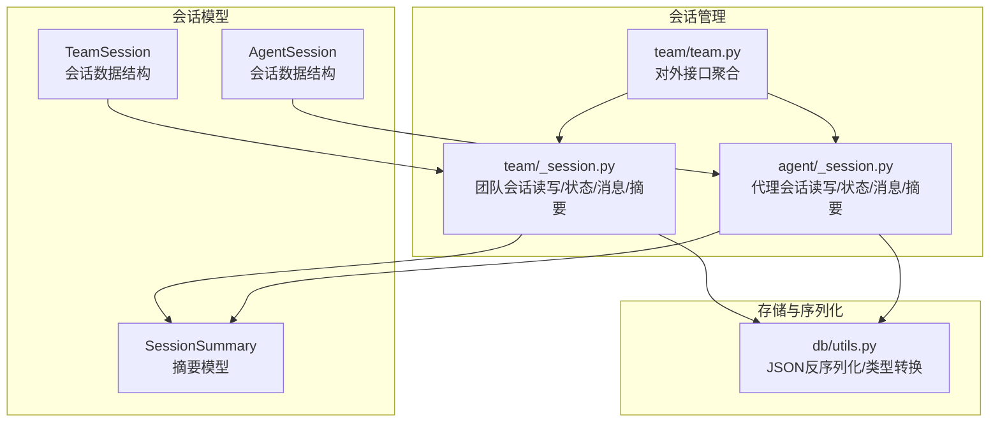
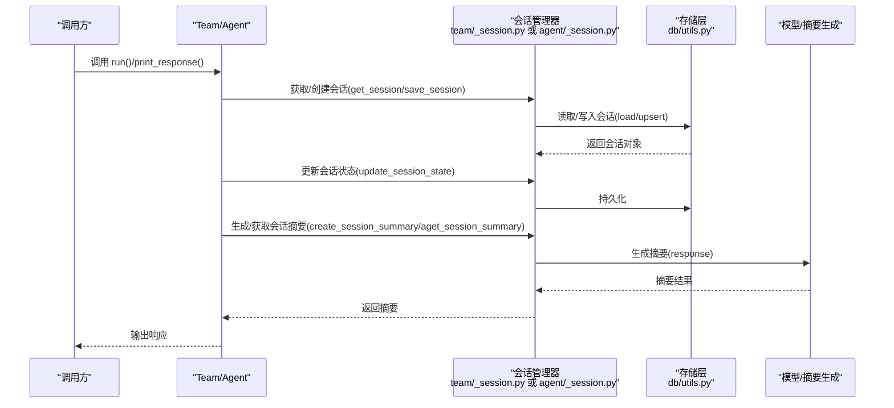
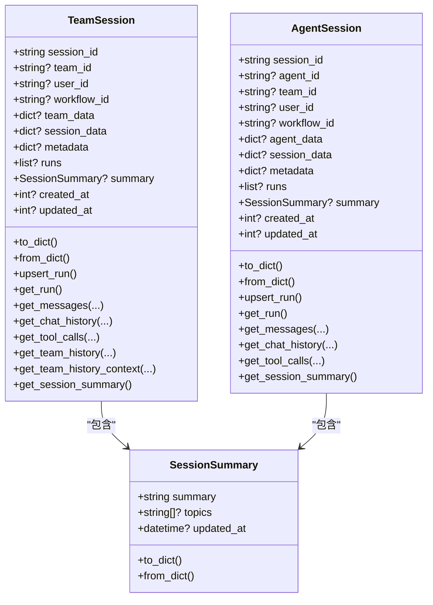
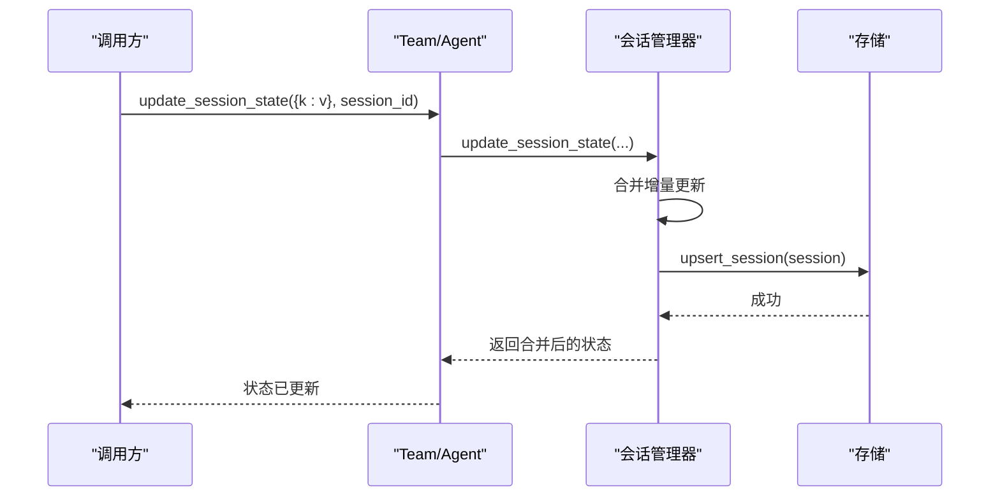
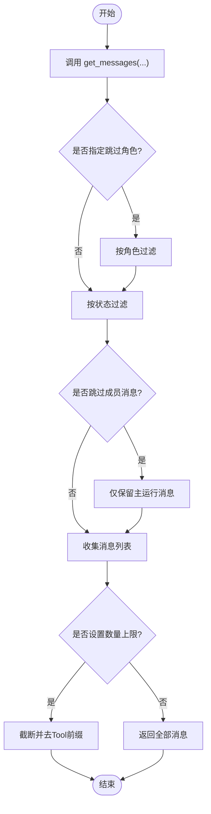
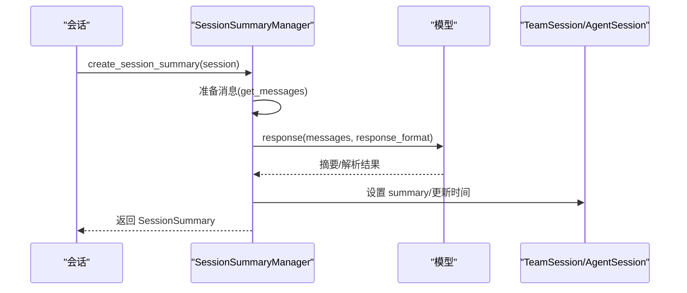
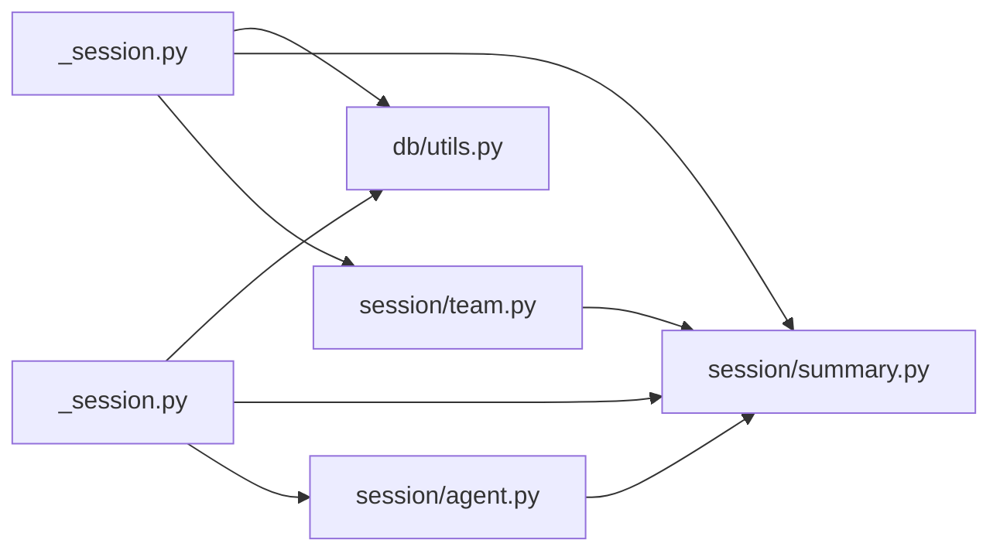

# 团队会话

<cite>
**本文引用的文件**
- [libs/agno/agno/session/team.py](file://libs/agno/agno/session/team.py)
- [libs/agno/agno/session/agent.py](file://libs/agno/agno/session/agent.py)
- [libs/agno/agno/session/summary.py](file://libs/agno/agno/session/summary.py)
- [libs/agno/agno/team/_session.py](file://libs/agno/agno/team/_session.py)
- [libs/agno/agno/agent/_session.py](file://libs/agno/agno/agent/_session.py)
- [libs/agno/agno/team/team.py](file://libs/agno/agno/team/team.py)
- [libs/agno/agno/db/utils.py](file://libs/agno/agno/db/utils.py)
- [libs/agno/tests/integration/teams/test_session.py](file://libs/agno/tests/integration/teams/test_session.py)
- [libs/agno/tests/integration/teams/test_session_state.py](file://libs/agno/tests/integration/teams/test_session_state.py)
- [libs/agno/tests/integration/teams/test_storage_and_memory.py](file://libs/agno/tests/integration/teams/test_storage_and_memory.py)
- [cookbook/06_storage/01_persistent_session_storage.py](file://cookbook/06_storage/01_persistent_session_storage.py)
- [cookbook/06_storage/02_session_summary.py](file://cookbook/06_storage/02_session_summary.py)
- [cookbook/06_storage/03_chat_history.py](file://cookbook/06_storage/03_chat_history.py)
</cite>

## 目录
1. [简介](#简介)
2. [项目结构](#项目结构)
3. [核心组件](#核心组件)
4. [架构总览](#架构总览)
5. [详细组件分析](#详细组件分析)
6. [依赖分析](#依赖分析)
7. [性能考虑](#性能考虑)
8. [故障排查指南](#故障排查指南)
9. [结论](#结论)
10. [附录：使用示例与最佳实践](#附录使用示例与最佳实践)

## 简介
本文件系统性梳理团队会话管理系统的设计与实现，覆盖会话状态的创建、更新与持久化；聊天历史的存储、检索与清理策略；会话摘要的生成机制（内容选择、格式化与优化）；持久化会话的存储、恢复与迁移；以及团队成员间会话数据共享与状态同步。文档同时提供面向开发者的代码级图示与面向非技术读者的概念性说明，并给出性能优化、数据安全与备份恢复建议。

## 项目结构
围绕“会话”主题，核心代码分布在以下模块：
- 会话模型与工具：session/team.py、session/agent.py、session/summary.py
- 会话生命周期与状态管理：team/_session.py、agent/_session.py
- 组件入口与对外接口：team/team.py
- 数据库工具与序列化：db/utils.py
- 示例与测试：cookbook/06_storage/*.py、tests/integration/teams/test_*.py

图表来源
- [libs/agno/agno/session/team.py:15-348](file://libs/agno/agno/session/team.py#L15-L348)
- [libs/agno/agno/session/agent.py:14-261](file://libs/agno/agno/session/agent.py#L14-L261)
- [libs/agno/agno/session/summary.py:21-283](file://libs/agno/agno/session/summary.py#L21-L283)
- [libs/agno/agno/team/_session.py:43-740](file://libs/agno/agno/team/_session.py#L43-L740)
- [libs/agno/agno/agent/_session.py:75-768](file://libs/agno/agno/agent/_session.py#L75-L768)
- [libs/agno/agno/team/team.py:1520-1550](file://libs/agno/agno/team/team.py#L1520-L1550)
- [libs/agno/agno/db/utils.py:132-154](file://libs/agno/agno/db/utils.py#L132-L154)

章节来源
- [libs/agno/agno/session/team.py:15-348](file://libs/agno/agno/session/team.py#L15-L348)
- [libs/agno/agno/session/agent.py:14-261](file://libs/agno/agno/session/agent.py#L14-L261)
- [libs/agno/agno/session/summary.py:21-283](file://libs/agno/agno/session/summary.py#L21-L283)
- [libs/agno/agno/team/_session.py:43-740](file://libs/agno/agno/team/_session.py#L43-L740)
- [libs/agno/agno/agent/_session.py:75-768](file://libs/agno/agno/agent/_session.py#L75-L768)
- [libs/agno/agno/team/team.py:1520-1550](file://libs/agno/agno/team/team.py#L1520-L1550)
- [libs/agno/agno/db/utils.py:132-154](file://libs/agno/agno/db/utils.py#L132-L154)

## 核心组件
- TeamSession/AgentSession：会话数据载体，包含会话标识、关联实体（团队/代理/工作流）、会话数据（名称、状态、媒体等）、运行记录、摘要与时间戳。
- SessionSummary：会话摘要模型，支持结构化输出或JSON对象输出，包含摘要文本与话题列表。
- 会话管理器（team/_session.py、agent/_session.py）：提供会话读取/保存、命名、状态更新、消息检索、摘要获取等能力，并处理缓存与异步数据库适配。
- 对外接口（team/team.py）：封装常用操作，如保存会话、生成/设置/获取会话名、获取/更新会话状态等。

章节来源
- [libs/agno/agno/session/team.py:15-348](file://libs/agno/agno/session/team.py#L15-L348)
- [libs/agno/agno/session/agent.py:14-261](file://libs/agno/agno/session/agent.py#L14-L261)
- [libs/agno/agno/session/summary.py:21-283](file://libs/agno/agno/session/summary.py#L21-L283)
- [libs/agno/agno/team/_session.py:43-740](file://libs/agno/agno/team/_session.py#L43-L740)
- [libs/agno/agno/agent/_session.py:75-768](file://libs/agno/agno/agent/_session.py#L75-L768)
- [libs/agno/agno/team/team.py:1520-1550](file://libs/agno/agno/team/team.py#L1520-L1550)

## 架构总览
下图展示了从调用方到会话模型与存储的交互路径，以及摘要生成与消息检索的关键流程。

图表来源
- [libs/agno/agno/team/_session.py:176-243](file://libs/agno/agno/team/_session.py#L176-L243)
- [libs/agno/agno/agent/_session.py:216-262](file://libs/agno/agno/agent/_session.py#L216-L262)
- [libs/agno/agno/db/utils.py:132-154](file://libs/agno/agno/db/utils.py#L132-L154)
- [libs/agno/agno/session/summary.py:212-246](file://libs/agno/agno/session/summary.py#L212-L246)

## 详细组件分析

### 会话模型与数据结构
- TeamSession/AgentSession：统一承载会话元信息、会话数据、运行记录、摘要与时间戳；提供 to_dict/from_dict 序列化与反序列化，支持 runs 与 summary 的嵌套转换。
- 消息检索与过滤：get_messages 支持按角色、状态、成员、最近N轮等条件过滤，支持跳过历史消息与成员消息，便于构建上下文。
- 聊天历史：get_chat_history 基于 get_messages 的简化封装，返回用户与助手消息。
- 工具调用提取：get_tool_calls 从历史消息中抽取工具调用。
- 团队历史与上下文：get_team_history/get_team_history_context 提供团队领导视角的历史结构化输出与格式化上下文。

图表来源
- [libs/agno/agno/session/team.py:15-348](file://libs/agno/agno/session/team.py#L15-L348)
- [libs/agno/agno/session/agent.py:14-261](file://libs/agno/agno/session/agent.py#L14-L261)
- [libs/agno/agno/session/summary.py:21-60](file://libs/agno/agno/session/summary.py#L21-L60)

章节来源
- [libs/agno/agno/session/team.py:113-348](file://libs/agno/agno/session/team.py#L113-L348)
- [libs/agno/agno/session/agent.py:115-261](file://libs/agno/agno/session/agent.py#L115-L261)
- [libs/agno/agno/session/summary.py:21-60](file://libs/agno/agno/session/summary.py#L21-L60)

### 会话状态管理与持久化
- 读取/保存：get_session/asession 与 save_session/asave_session 支持同步与异步数据库适配；对成员响应进行清洗（根据配置移除或保留），避免冗余数据写入。
- 状态更新：update_session_state/aupdate_session_state 合并增量更新，确保原有键值不丢失；写入后自动持久化。
- 缓存策略：若启用缓存，优先命中内存缓存，减少数据库往返。
- 删除：delete_session/adelete_session 提供会话删除能力。

图表来源
- [libs/agno/agno/team/_session.py:430-465](file://libs/agno/agno/team/_session.py#L430-L465)
- [libs/agno/agno/agent/_session.py:505-536](file://libs/agno/agno/agent/_session.py#L505-L536)
- [libs/agno/agno/team/_session.py:176-243](file://libs/agno/agno/team/_session.py#L176-L243)
- [libs/agno/agno/agent/_session.py:216-262](file://libs/agno/agno/agent/_session.py#L216-L262)

章节来源
- [libs/agno/agno/team/_session.py:176-243](file://libs/agno/agno/team/_session.py#L176-L243)
- [libs/agno/agno/agent/_session.py:216-262](file://libs/agno/agno/agent/_session.py#L216-L262)
- [libs/agno/agno/team/_session.py:430-465](file://libs/agno/agno/team/_session.py#L430-L465)
- [libs/agno/agno/agent/_session.py:505-536](file://libs/agno/agno/agent/_session.py#L505-L536)

### 聊天历史管理与清理策略
- 检索：get_session_messages/aget_session_messages 支持按角色、状态、最近N轮、限制数量等过滤；可跳过历史消息与成员消息，保证上下文质量。
- 清理：通过 skip_history_messages 与 skip_statuses 控制历史与无效状态消息的剔除；limit 参数可限制返回的消息数量，控制上下文长度。
- 团队场景：TeamSession.get_messages 支持按 team_id/member_ids 过滤，避免成员消息干扰主上下文。

图表来源
- [libs/agno/agno/session/team.py:123-237](file://libs/agno/agno/session/team.py#L123-L237)
- [libs/agno/agno/session/agent.py:124-225](file://libs/agno/agno/session/agent.py#L124-L225)

章节来源
- [libs/agno/agno/session/team.py:123-237](file://libs/agno/agno/session/team.py#L123-L237)
- [libs/agno/agno/session/agent.py:124-225](file://libs/agno/agno/session/agent.py#L124-L225)

### 会话摘要生成机制
- 内容选择：基于会话消息构造系统提示，支持空用户消息的媒体类型标注；仅提取有意义对话片段。
- 格式化与优化：支持原生结构化输出、JSON Schema 输出或JSON对象输出；失败时回退至JSON对象模式。
- 生成流程：准备消息 → 选择响应格式 → 模型推理 → 处理响应 → 写入会话 → 记录指标。

图表来源
- [libs/agno/agno/session/summary.py:139-246](file://libs/agno/agno/session/summary.py#L139-L246)

章节来源
- [libs/agno/agno/session/summary.py:62-283](file://libs/agno/agno/session/summary.py#L62-L283)

### 持久化会话的存储、恢复与迁移
- 存储：save_session/asave_session 将会话写入数据库；对 session_state 中的临时键进行清理，避免污染持久化数据。
- 恢复：get_session/asession 从数据库加载会话；支持缓存命中与多类型会话（Agent/Team/Workflow）识别。
- 迁移：db/utils.py 在读取时尝试将字符串字段反序列化为JSON，增强兼容性与迁移能力。

章节来源
- [libs/agno/agno/team/_session.py:176-243](file://libs/agno/agno/team/_session.py#L176-L243)
- [libs/agno/agno/agent/_session.py:216-262](file://libs/agno/agno/agent/_session.py#L216-L262)
- [libs/agno/agno/db/utils.py:132-154](file://libs/agno/agno/db/utils.py#L132-L154)

### 会话共享与状态同步
- 多会话切换：测试覆盖同一团队在不同 session_id 之间切换，验证 session_state 在不同会话中独立且可恢复。
- 用户隔离：通过 user_id 实现租户隔离，确保不同用户会话互不影响。
- 成员响应清洗：根据 store_member_responses 配置决定是否保留成员响应，避免跨会话泄露。

章节来源
- [libs/agno/tests/integration/teams/test_session_state.py:48-77](file://libs/agno/tests/integration/teams/test_session_state.py#L48-L77)
- [libs/agno/tests/integration/teams/test_storage_and_memory.py:273-289](file://libs/agno/tests/integration/teams/test_storage_and_memory.py#L273-L289)
- [libs/agno/agno/team/_session.py:190-206](file://libs/agno/agno/team/_session.py#L190-L206)

## 依赖分析
- 组件耦合：会话管理器依赖存储层与模型；会话模型被管理器与存储层共同使用。
- 外部依赖：模型响应用于摘要生成；数据库工具负责JSON反序列化与类型转换。
- 可能的循环依赖：当前模块划分清晰，未发现循环导入。

图表来源
- [libs/agno/agno/team/_session.py:176-243](file://libs/agno/agno/team/_session.py#L176-L243)
- [libs/agno/agno/agent/_session.py:216-262](file://libs/agno/agno/agent/_session.py#L216-L262)
- [libs/agno/agno/db/utils.py:132-154](file://libs/agno/agno/db/utils.py#L132-L154)
- [libs/agno/agno/session/summary.py:212-246](file://libs/agno/agno/session/summary.py#L212-L246)
- [libs/agno/agno/session/team.py:15-348](file://libs/agno/agno/session/team.py#L15-L348)
- [libs/agno/agno/session/agent.py:14-261](file://libs/agno/agno/session/agent.py#L14-L261)

章节来源
- [libs/agno/agno/team/_session.py:176-243](file://libs/agno/agno/team/_session.py#L176-L243)
- [libs/agno/agno/agent/_session.py:216-262](file://libs/agno/agno/agent/_session.py#L216-L262)
- [libs/agno/agno/db/utils.py:132-154](file://libs/agno/agno/db/utils.py#L132-L154)
- [libs/agno/agno/session/summary.py:212-246](file://libs/agno/agno/session/summary.py#L212-L246)
- [libs/agno/agno/session/team.py:15-348](file://libs/agno/agno/session/team.py#L15-L348)
- [libs/agno/agno/session/agent.py:14-261](file://libs/agno/agno/session/agent.py#L14-L261)

## 性能考虑
- 上下文裁剪：通过 limit 与 last_n_runs 控制消息数量，降低上下文长度，提升响应速度与成本控制。
- 缓存策略：启用 cache_session 可显著减少数据库访问；注意在多实例或多进程场景下的缓存一致性。
- 异步存储：优先使用异步数据库与异步接口（aget_session/save_session），避免阻塞。
- 摘要生成：合理设置摘要触发频率与消息窗口，避免频繁生成带来的额外开销。
- 成员响应清洗：关闭 store_member_responses 可减少存储体积与写入开销。

## 故障排查指南
- 会话ID缺失：当 session_id 未设置时，读取/更新会抛出异常。请在首次运行时显式传入或由系统生成并粘滞。
- 异步/同步混用：使用异步数据库时禁止调用同步接口（如 get_session/save_session），应使用对应异步版本。
- JSON反序列化失败：db/utils.py 对 metadata/chat_history/summary/session_data 字段尝试JSON解析，失败时保留原始字符串并记录警告。
- 摘要生成失败：若模型返回非预期格式，将尝试解析为结构化对象；失败则记录警告并跳过摘要更新。

章节来源
- [libs/agno/agno/team/_session.py:410-413](file://libs/agno/agno/team/_session.py#L410-L413)
- [libs/agno/agno/agent/_session.py:473-486](file://libs/agno/agno/agent/_session.py#L473-L486)
- [libs/agno/agno/db/utils.py:132-154](file://libs/agno/agno/db/utils.py#L132-L154)
- [libs/agno/agno/session/summary.py:166-210](file://libs/agno/agno/session/summary.py#L166-L210)

## 结论
该团队会话系统以清晰的数据模型与管理器分层实现，覆盖了从会话创建、状态更新、历史检索、摘要生成到持久化的完整闭环。通过灵活的过滤与裁剪策略、异步存储适配与缓存机制，系统在可扩展性与性能上具备良好基础。结合测试用例与示例脚本，团队可在实际项目中快速落地并迭代优化。

## 附录：使用示例与最佳实践

### 会话历史管理
- 使用 get_chat_history/aget_chat_history 获取用户与助手消息，适合直接注入上下文。
- 使用 get_session_messages/aget_session_messages 进行更细粒度的过滤（角色、状态、成员、最近N轮）。

章节来源
- [libs/agno/agno/session/team.py:239-249](file://libs/agno/agno/session/team.py#L239-L249)
- [libs/agno/agno/session/agent.py:227-237](file://libs/agno/agno/session/agent.py#L227-L237)
- [libs/agno/agno/team/_session.py:665-694](file://libs/agno/agno/team/_session.py#L665-L694)
- [libs/agno/agno/agent/_session.py:696-719](file://libs/agno/agno/agent/_session.py#L696-L719)

### 自定义会话摘要
- 通过 SessionSummaryManager 指定模型与提示，控制摘要内容与格式。
- 支持原生结构化输出、JSON Schema 或 JSON 对象三种响应格式。

章节来源
- [libs/agno/agno/session/summary.py:62-91](file://libs/agno/agno/session/summary.py#L62-L91)
- [libs/agno/agno/session/summary.py:212-246](file://libs/agno/agno/session/summary.py#L212-L246)

### 持久化会话配置
- 使用 PostgresDb 等数据库作为存储后端，配置表名与连接参数。
- 通过 save_session/asave_session 写入会话；db/utils.py 提供JSON反序列化兼容。

章节来源
- [cookbook/06_storage/01_persistent_session_storage.py:16-28](file://cookbook/06_storage/01_persistent_session_storage.py#L16-L28)
- [libs/agno/agno/team/_session.py:176-243](file://libs/agno/agno/team/_session.py#L176-L243)
- [libs/agno/agno/db/utils.py:132-154](file://libs/agno/agno/db/utils.py#L132-L154)

### 会话选项设置
- 会话命名：set_session_name/aset_session_name 或 generate_session_name 自动生成。
- 会话状态：update_session_state/aupdate_session_state 合并更新。
- 会话删除：delete_session/adelete_session 清理不再需要的会话。

章节来源
- [libs/agno/agno/team/_session.py:309-394](file://libs/agno/agno/team/_session.py#L309-L394)
- [libs/agno/agno/agent/_session.py:328-383](file://libs/agno/agno/agent/_session.py#L328-L383)
- [libs/agno/agno/team/_session.py:546-564](file://libs/agno/agno/team/_session.py#L546-L564)
- [libs/agno/agno/agent/_session.py:264-281](file://libs/agno/agno/agent/_session.py#L264-L281)

### 会话状态共享
- 多会话切换：测试验证同一团队在不同 session_id 间切换，session_state 保持独立。
- 用户隔离：通过 user_id 区分不同用户的会话集合。
- 成员响应清洗：根据 store_member_responses 控制成员响应的存储策略。

章节来源
- [libs/agno/tests/integration/teams/test_session_state.py:48-77](file://libs/agno/tests/integration/teams/test_session_state.py#L48-L77)
- [libs/agno/tests/integration/teams/test_storage_and_memory.py:273-289](file://libs/agno/tests/integration/teams/test_storage_and_memory.py#L273-L289)
- [libs/agno/agno/team/_session.py:190-206](file://libs/agno/agno/team/_session.py#L190-L206)

### 团队协作中的重要性与最佳实践
- 重要性：统一的会话模型与管理器确保团队成员在不同上下文中保持一致的上下文与状态，提升协作效率与可追溯性。
- 最佳实践：
  - 明确会话边界与生命周期，及时清理历史消息与无效状态。
  - 合理设置摘要生成频率，平衡成本与收益。
  - 使用异步接口与缓存，提升高并发场景下的吞吐。
  - 严格区分用户与成员数据，遵循最小暴露原则。