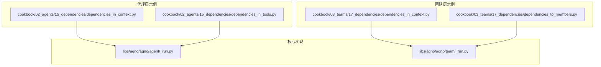
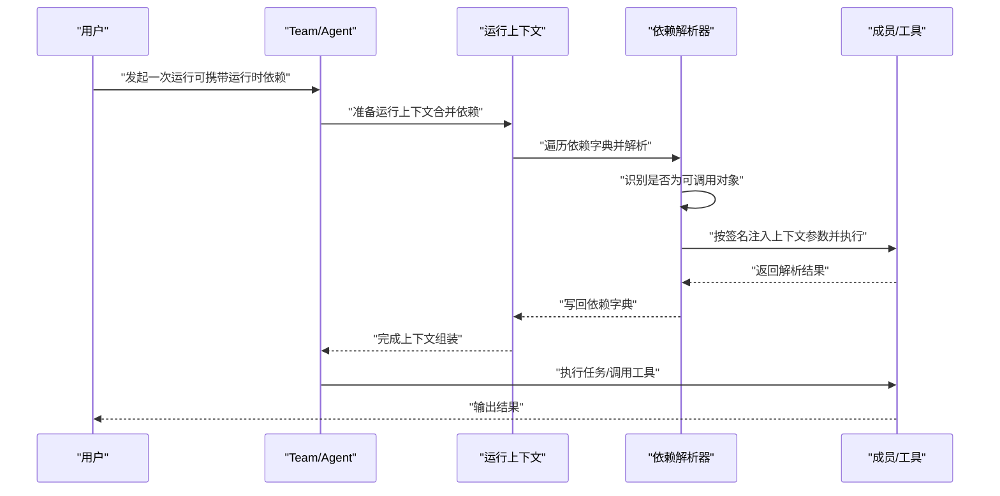
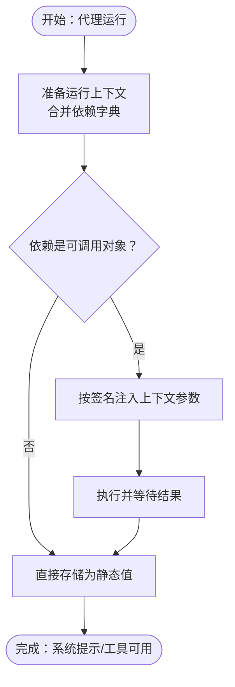
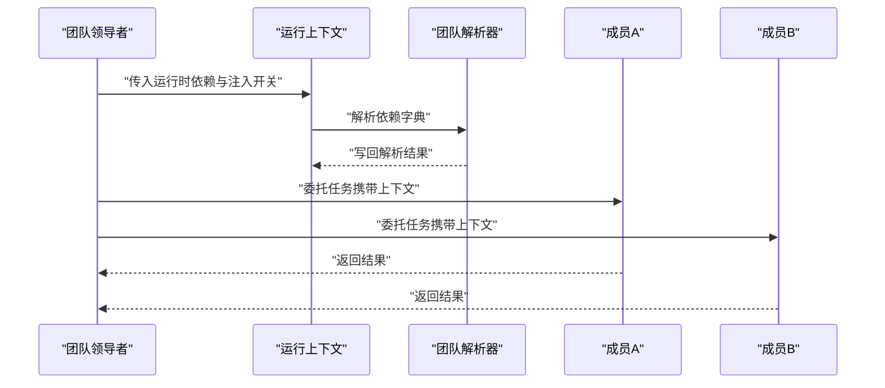
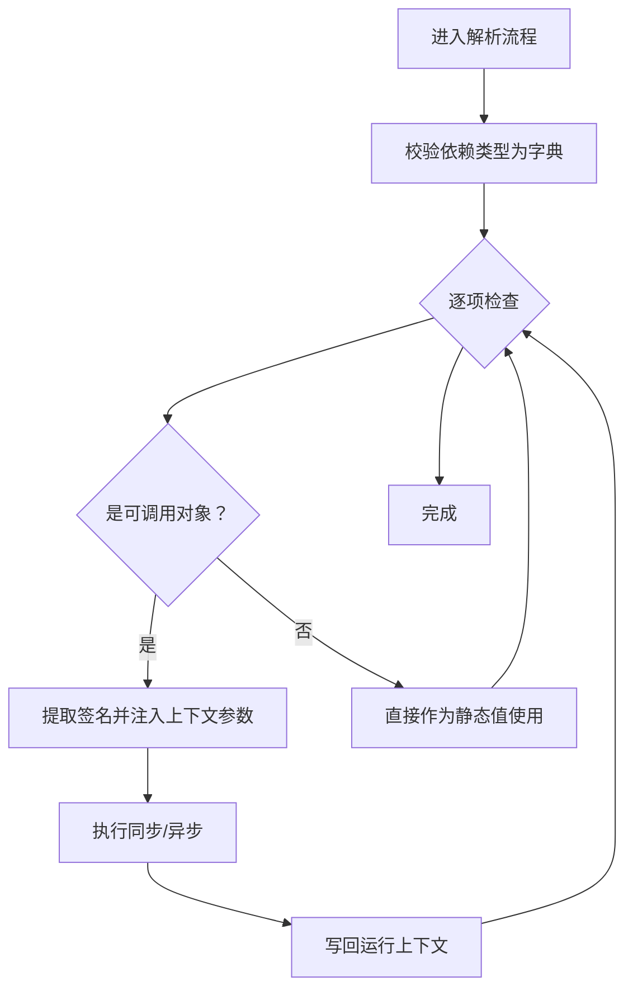

# 上下文依赖

<cite>
**本文引用的文件**
- [dependencies_in_context.py](file://cookbook/02_agents/15_dependencies/dependencies_in_context.py)
- [dependencies_in_context.md](file://cookbook/02_agents/15_dependencies/dependencies_in_context.md)
- [dependencies_in_tools.py](file://cookbook/02_agents/15_dependencies/dependencies_in_tools.py)
- [dependencies_in_context.py](file://cookbook/03_teams/17_dependencies/dependencies_in_context.py)
- [dependencies_in_context.md](file://cookbook/03_teams/17_dependencies/dependencies_in_context.md)
- [dependencies_to_members.py](file://cookbook/03_teams/17_dependencies/dependencies_to_members.py)
- [dependencies_to_members.md](file://cookbook/03_teams/17_dependencies/dependencies_to_members.md)
- [_run.py（Agent）](file://libs/agno/agno/agent/_run.py)
- [_run.py（Team）](file://libs/agno/agno/team/_run.py)
- [test_run_regressions.py](file://libs/agno/tests/unit/agent/test_run_regressions.py)
</cite>

## 目录
1. [简介](#简介)
2. [项目结构](#项目结构)
3. [核心组件](#核心组件)
4. [架构总览](#架构总览)
5. [详细组件分析](#详细组件分析)
6. [依赖关系分析](#依赖关系分析)
7. [性能考量](#性能考量)
8. [故障排查指南](#故障排查指南)
9. [结论](#结论)
10. [附录](#附录)

## 简介
本篇文档围绕“上下文依赖”展开，系统性阐述在团队上下文中如何声明、传播与解析依赖关系，覆盖以下主题：
- 上下文依赖的定义、传递机制与解析过程
- 依赖声明语法、依赖类型与依赖优先级
- 对团队协作的影响：依赖传播、状态同步与性能优化
- 具体示例路径：依赖声明、解析与使用
- 最佳实践：依赖设计原则、错误处理与调试技巧

## 项目结构
本仓库提供了两类上下文依赖的示例路径：
- 代理（Agent）层：将依赖注入到系统提示或工具中
- 团队（Team）层：将依赖注入到指令占位符，并在成员间传播

图表来源
- [dependencies_in_context.py:45-53](file://cookbook/02_agents/15_dependencies/dependencies_in_context.py#L45-L53)
- [dependencies_in_tools.py:74-86](file://cookbook/02_agents/15_dependencies/dependencies_in_tools.py#L74-L86)
- [dependencies_in_context.py:63-79](file://cookbook/03_teams/17_dependencies/dependencies_in_context.py#L63-L79)
- [dependencies_to_members.py:63-69](file://cookbook/03_teams/17_dependencies/dependencies_to_members.py#L63-L69)
- [_run.py（Agent）:142-180](file://libs/agno/agno/agent/_run.py#L142-L180)
- [_run.py（Team）:4098-4137](file://libs/agno/agno/team/_run.py#L4098-L4137)

章节来源
- [dependencies_in_context.py:1-64](file://cookbook/02_agents/15_dependencies/dependencies_in_context.py#L1-L64)
- [dependencies_in_tools.py:1-109](file://cookbook/02_agents/15_dependencies/dependencies_in_tools.py#L1-L109)
- [dependencies_in_context.py:1-90](file://cookbook/03_teams/17_dependencies/dependencies_in_context.py#L1-L90)
- [dependencies_to_members.py:1-84](file://cookbook/03_teams/17_dependencies/dependencies_to_members.py#L1-L84)
- [_run.py（Agent）:142-180](file://libs/agno/agno/agent/_run.py#L142-L180)
- [_run.py（Team）:4098-4137](file://libs/agno/agno/team/_run.py#L4098-L4137)

## 核心组件
- 依赖声明与类型
  - 字典式声明：以键值对形式提供依赖，值可以是可调用对象（函数/协程）或静态值
  - 依赖类型：函数型依赖会在运行时解析；静态值直接使用
- 依赖解析
  - 代理与团队分别在各自的运行流程中解析依赖字典
  - 解析时会根据签名自动注入上下文参数（如 agent、team、run_context）
  - 支持同步与异步解析
- 依赖传播
  - 在团队层，可通过开关将依赖结果注入到指令占位符，并在成员间保持一致
  - 运行时传入的依赖优先于构造时的静态依赖

章节来源
- [dependencies_in_context.py:45-53](file://cookbook/02_agents/15_dependencies/dependencies_in_context.py#L45-L53)
- [dependencies_in_tools.py:24-67](file://cookbook/02_agents/15_dependencies/dependencies_in_tools.py#L24-L67)
- [dependencies_in_context.py:63-79](file://cookbook/03_teams/17_dependencies/dependencies_in_context.py#L63-L79)
- [dependencies_to_members.py:63-69](file://cookbook/03_teams/17_dependencies/dependencies_to_members.py#L63-L69)
- [_run.py（Agent）:142-180](file://libs/agno/agno/agent/_run.py#L142-L180)
- [_run.py（Team）:4098-4137](file://libs/agno/agno/team/_run.py#L4098-L4137)

## 架构总览
下图展示了从“依赖声明”到“依赖解析与传播”的整体流程。

图表来源
- [dependencies_in_context.py:63-79](file://cookbook/03_teams/17_dependencies/dependencies_in_context.py#L63-L79)
- [dependencies_to_members.py:75-83](file://cookbook/03_teams/17_dependencies/dependencies_to_members.py#L75-L83)
- [_run.py（Team）:4098-4137](file://libs/agno/agno/team/_run.py#L4098-L4137)
- [_run.py（Agent）:142-180](file://libs/agno/agno/agent/_run.py#L142-L180)

## 详细组件分析

### 代理层：依赖注入到系统提示与工具
- 依赖注入到系统提示
  - 通过开关将依赖结果注入到指令占位符，使 LLM 直接看到解析后的数据
  - 示例路径：[dependencies_in_context.py:45-53](file://cookbook/02_agents/15_dependencies/dependencies_in_context.py#L45-L53)
- 依赖在工具中的使用
  - 工具通过运行上下文访问依赖，适用于需要内部使用的场景
  - 示例路径：[dependencies_in_tools.py:24-67](file://cookbook/02_agents/15_dependencies/dependencies_in_tools.py#L24-L67)

图表来源
- [_run.py（Agent）:142-180](file://libs/agno/agno/agent/_run.py#L142-L180)
- [dependencies_in_context.py:45-53](file://cookbook/02_agents/15_dependencies/dependencies_in_context.py#L45-L53)
- [dependencies_in_tools.py:24-67](file://cookbook/02_agents/15_dependencies/dependencies_in_tools.py#L24-L67)

章节来源
- [dependencies_in_context.py:1-64](file://cookbook/02_agents/15_dependencies/dependencies_in_context.py#L1-L64)
- [dependencies_in_tools.py:1-109](file://cookbook/02_agents/15_dependencies/dependencies_in_tools.py#L1-L109)
- [_run.py（Agent）:142-180](file://libs/agno/agno/agent/_run.py#L142-L180)

### 团队层：依赖注入到指令占位符与成员传播
- 指令占位符注入
  - 将依赖结果注入到团队指令中的占位符，动态生成个性化系统提示
  - 示例路径：[dependencies_in_context.py:63-79](file://cookbook/03_teams/17_dependencies/dependencies_in_context.py#L63-L79)
- 成员传播
  - 运行时传入的依赖与开关可传播到成员，确保全链路上下文一致性
  - 示例路径：[dependencies_to_members.py:75-83](file://cookbook/03_teams/17_dependencies/dependencies_to_members.py#L75-L83)

图表来源
- [dependencies_in_context.py:63-79](file://cookbook/03_teams/17_dependencies/dependencies_in_context.py#L63-L79)
- [dependencies_to_members.py:75-83](file://cookbook/03_teams/17_dependencies/dependencies_to_members.py#L75-L83)
- [_run.py（Team）:4098-4137](file://libs/agno/agno/team/_run.py#L4098-L4137)

章节来源
- [dependencies_in_context.py:1-90](file://cookbook/03_teams/17_dependencies/dependencies_in_context.py#L1-L90)
- [dependencies_to_members.py:1-84](file://cookbook/03_teams/17_dependencies/dependencies_to_members.py#L1-L84)
- [_run.py（Team）:4098-4137](file://libs/agno/agno/team/_run.py#L4098-L4137)

### 依赖解析流程（代码级）
- 代理依赖解析
  - 遍历依赖字典，识别可调用对象，按签名注入 agent 与 run_context，执行并写回结果
  - 异步支持：若返回协程则等待其完成
- 团队依赖解析
  - 类似代理，但签名参数包含 agent、team、run_context，便于在团队场景中使用

图表来源
- [_run.py（Agent）:142-180](file://libs/agno/agno/agent/_run.py#L142-L180)
- [_run.py（Team）:4098-4137](file://libs/agno/agno/team/_run.py#L4098-L4137)

章节来源
- [_run.py（Agent）:142-180](file://libs/agno/agno/agent/_run.py#L142-L180)
- [_run.py（Team）:4098-4137](file://libs/agno/agno/team/_run.py#L4098-L4137)

## 依赖关系分析
- 依赖声明语法
  - 键为字符串标识，值为可调用对象或静态值
  - 可在构造时（静态）或运行时（动态）传入
- 依赖类型与优先级
  - 函数型依赖在运行时解析，优先级高于静态值
  - 运行时传入的依赖覆盖构造时的静态依赖
- 依赖传播与一致性
  - 团队层通过注入开关将依赖结果注入指令占位符，并在成员间传播
  - 测试用例验证了运行时覆盖与上下文保留的行为

章节来源
- [dependencies_in_context.py:45-53](file://cookbook/02_agents/15_dependencies/dependencies_in_context.py#L45-L53)
- [dependencies_to_members.py:22-37](file://cookbook/03_teams/17_dependencies/dependencies_to_members.py#L22-L37)
- [test_run_regressions.py:429-545](file://libs/agno/tests/unit/agent/test_run_regressions.py#L429-L545)

## 性能考量
- 异步解析
  - 支持协程依赖，避免阻塞主线程
- 依赖缓存与复用
  - 对于多次使用的静态值，建议在运行前预计算并传入静态值
- 依赖数量与复杂度
  - 控制依赖数量与深度，避免在解析阶段产生过多 IO 或计算开销
- 团队传播成本
  - 在大型团队中谨慎使用占位符注入，避免指令膨胀导致上下文长度增加

## 故障排查指南
- 常见问题
  - 依赖不是字典：解析器会记录警告并跳过
  - 可调用对象签名不匹配：注入参数不足会导致调用失败
  - 异步依赖未正确等待：可能导致结果为空
- 调试技巧
  - 使用运行时开关开启调试模式，观察解析过程
  - 在工具中打印依赖键集合，确认依赖是否正确注入
  - 使用测试用例验证运行时覆盖与上下文保留行为

章节来源
- [_run.py（Agent）:142-180](file://libs/agno/agno/agent/_run.py#L142-L180)
- [_run.py（Team）:4098-4137](file://libs/agno/agno/team/_run.py#L4098-L4137)
- [dependencies_in_tools.py:38-67](file://cookbook/02_agents/15_dependencies/dependencies_in_tools.py#L38-L67)
- [test_run_regressions.py:429-545](file://libs/agno/tests/unit/agent/test_run_regressions.py#L429-L545)

## 结论
上下文依赖是实现“按需注入、按需解析、按需传播”的关键机制。通过合理的依赖声明与解析策略，可以在代理与团队层面实现高内聚、低耦合的上下文管理，提升协作效率与系统性能。建议遵循“最小必要依赖、明确优先级、可控传播”的设计原则，并结合调试与测试手段保障稳定性。

## 附录
- 示例清单
  - 代理层：依赖注入到系统提示与工具
    - [dependencies_in_context.py:45-53](file://cookbook/02_agents/15_dependencies/dependencies_in_context.py#L45-L53)
    - [dependencies_in_tools.py:24-67](file://cookbook/02_agents/15_dependencies/dependencies_in_tools.py#L24-L67)
  - 团队层：依赖注入到指令占位符与成员传播
    - [dependencies_in_context.py:63-79](file://cookbook/03_teams/17_dependencies/dependencies_in_context.py#L63-L79)
    - [dependencies_to_members.py:75-83](file://cookbook/03_teams/17_dependencies/dependencies_to_members.py#L75-L83)
- 核心实现
  - 代理依赖解析：[_run.py（Agent）:142-180](file://libs/agno/agno/agent/_run.py#L142-L180)
  - 团队依赖解析：[_run.py（Team）:4098-4137](file://libs/agno/agno/team/_run.py#L4098-L4137)
- 行为验证
  - 运行时覆盖与上下文保留：[test_run_regressions.py:429-545](file://libs/agno/tests/unit/agent/test_run_regressions.py#L429-L545)