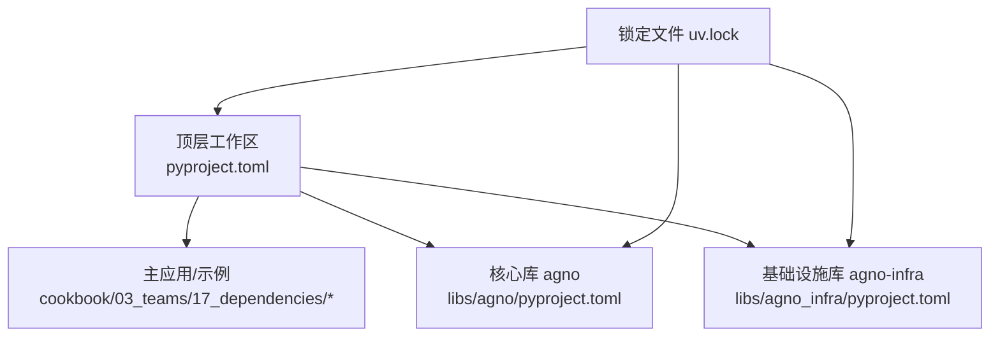
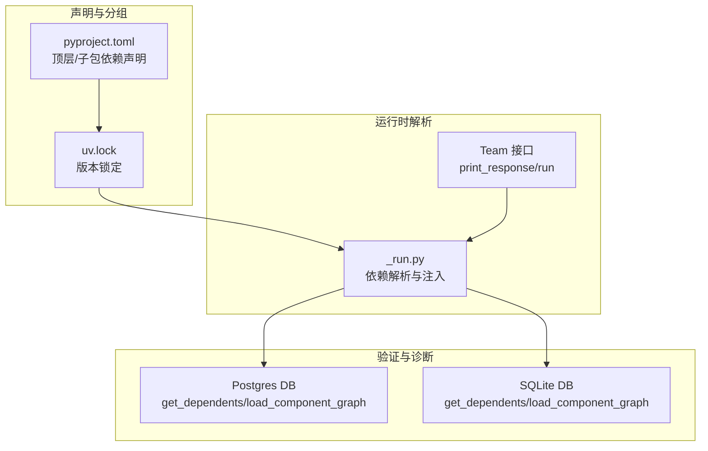
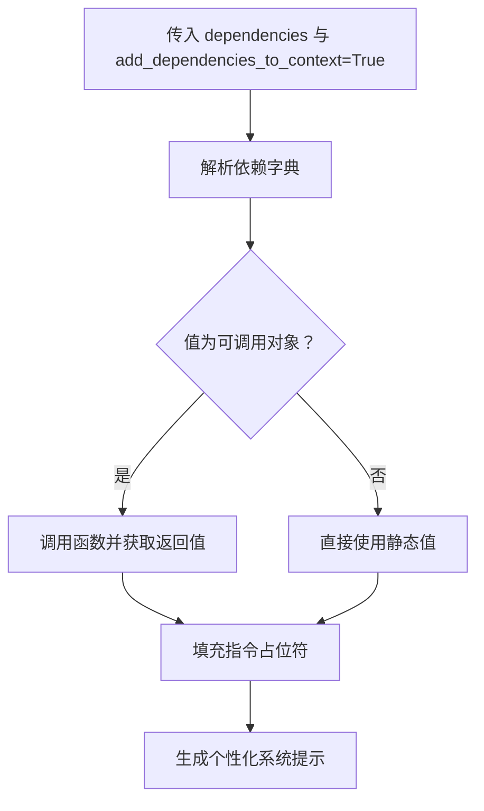
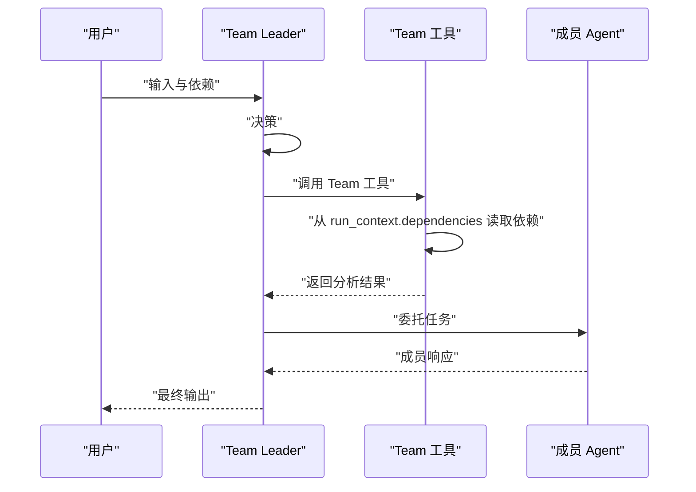
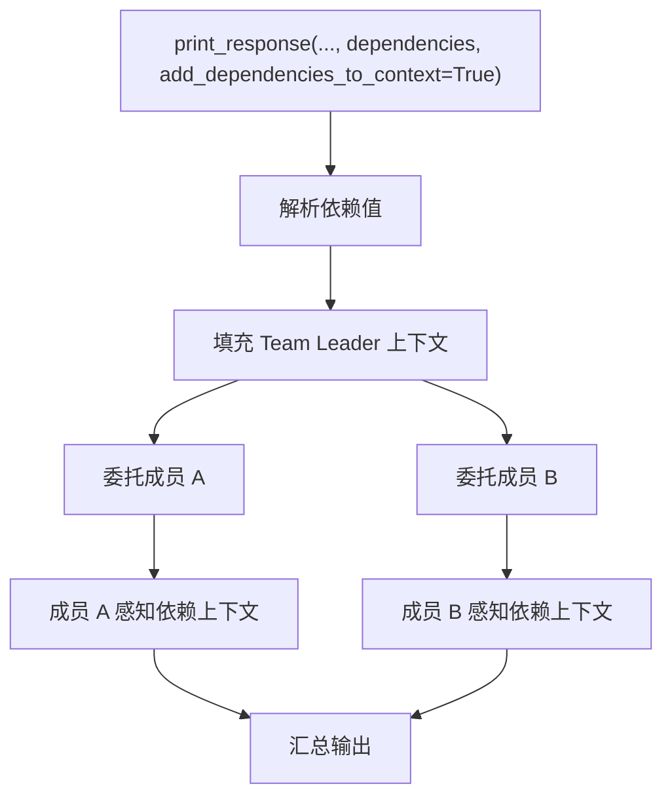
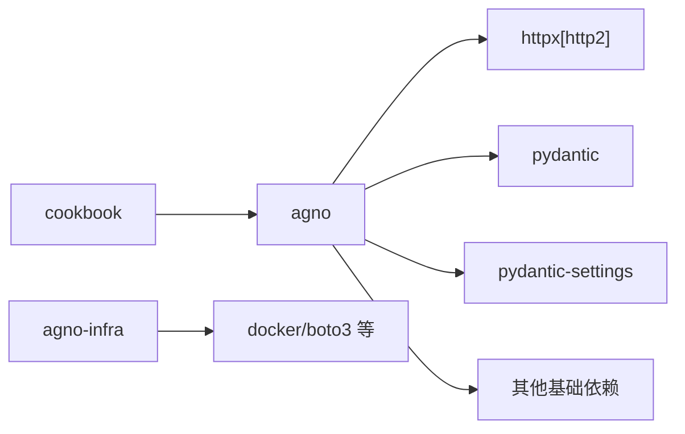

# 团队依赖

<cite>
**本文引用的文件**
- [pyproject.toml](file://pyproject.toml)
- [libs/agno/pyproject.toml](file://libs/agno/pyproject.toml)
- [libs/agno_infra/pyproject.toml](file://libs/agno_infra/pyproject.toml)
- [uv.lock](file://uv.lock)
- [cookbook/03_teams/17_dependencies/README.md](file://cookbook/03_teams/17_dependencies/README.md)
- [cookbook/03_teams/17_dependencies/dependencies_in_context.md](file://cookbook/03_teams/17_dependencies/dependencies_in_context.md)
- [cookbook/03_teams/17_dependencies/dependencies_in_tools.md](file://cookbook/03_teams/17_dependencies/dependencies_in_tools.md)
- [cookbook/03_teams/17_dependencies/dependencies_to_members.md](file://cookbook/03_teams/17_dependencies/dependencies_to_members.md)
- [libs/agno/agno/team/_run.py](file://libs/agno/agno/team/_run.py)
- [libs/agno/agno/db/postgres/postgres.py](file://libs/agno/agno/db/postgres/postgres.py)
- [libs/agno/agno/db/sqlite/sqlite.py](file://libs/agno/agno/db/sqlite/sqlite.py)
</cite>

## 目录
1. [简介](#简介)
2. [项目结构](#项目结构)
3. [核心组件](#核心组件)
4. [架构总览](#架构总览)
5. [详细组件分析](#详细组件分析)
6. [依赖关系分析](#依赖关系分析)
7. [性能考量](#性能考量)
8. [故障排查指南](#故障排查指南)
9. [结论](#结论)
10. [附录](#附录)

## 简介
本文件围绕团队依赖管理系统进行深入说明，涵盖依赖声明、版本兼容性与更新策略；解释上下文中依赖的传递、解析与冲突解决；阐述工具依赖的声明、加载与版本控制；介绍成员依赖的配置、成员间依赖关系、权限控制与状态同步；并通过具体示例路径展示团队依赖的实现，包括上下文依赖声明、工具依赖配置与成员依赖设置。最后总结依赖管理对团队协作稳定性与性能的影响，并给出冲突解决、版本升级与最佳实践建议。

## 项目结构
该仓库采用多包工作区结构，核心依赖定义集中在顶层与各子包的 pyproject.toml 中，使用 uv 锁定文件统一管理版本解析与传递依赖。团队依赖示例位于 cookbook/03_teams/17_dependencies 下，分别演示了“上下文中的依赖”“工具中的依赖”“传递给成员的依赖”。

图表来源
- [pyproject.toml:1-15](file://pyproject.toml#L1-L15)
- [libs/agno/pyproject.toml:1-574](file://libs/agno/pyproject.toml#L1-L574)
- [libs/agno_infra/pyproject.toml:1-111](file://libs/agno_infra/pyproject.toml#L1-L111)
- [uv.lock:1-502](file://uv.lock#L1-L502)

章节来源
- [pyproject.toml:1-15](file://pyproject.toml#L1-L15)
- [libs/agno/pyproject.toml:1-574](file://libs/agno/pyproject.toml#L1-L574)
- [libs/agno_infra/pyproject.toml:1-111](file://libs/agno_infra/pyproject.toml#L1-L111)
- [uv.lock:1-502](file://uv.lock#L1-L502)

## 核心组件
- 依赖声明与分组
  - 核心库 agno 提供丰富的可选依赖分组（模型、工具、存储、向量库、知识、嵌入器等），便于按需安装与组合使用。
  - 基础设施库 agno-infra 提供与云与容器相关的可选依赖，支持部署与运维场景。
  - 顶层工作区与示例工程 cookbook 声明对 agno 的最低版本要求，确保环境一致性。
- 运行时依赖解析
  - 团队运行时会根据传入的 dependencies 字典，动态解析可调用对象，将结果注入到上下文或指令占位符中，实现“按次运行”的灵活依赖注入。
- 组件依赖图与版本解析
  - 数据库层提供“反向依赖查询”能力（查找依赖某组件的所有组件），以及“组件图加载与版本解析”，用于检测循环依赖与版本不一致问题。

章节来源
- [libs/agno/pyproject.toml:45-384](file://libs/agno/pyproject.toml#L45-L384)
- [libs/agno_infra/pyproject.toml:43-56](file://libs/agno_infra/pyproject.toml#L43-L56)
- [pyproject.toml:6-9](file://pyproject.toml#L6-L9)
- [libs/agno/agno/team/_run.py:4098-4137](file://libs/agno/agno/team/_run.py#L4098-L4137)
- [libs/agno/agno/db/postgres/postgres.py:4213-4366](file://libs/agno/agno/db/postgres/postgres.py#L4213-L4366)
- [libs/agno/agno/db/sqlite/sqlite.py:4074-4195](file://libs/agno/agno/db/sqlite/sqlite.py#L4074-L4195)

## 架构总览
团队依赖管理贯穿“声明—解析—传递—执行—验证”全流程。顶层工作区与子包通过 pyproject.toml 声明依赖与可选分组；uv.lock 统一锁定版本；运行时通过 Team 的 print_response/run 接口传入 dependencies 并启用 add_dependencies_to_context 控制是否将依赖注入到上下文；数据库层提供组件依赖图与版本解析能力，辅助诊断循环依赖与版本冲突。

图表来源
- [pyproject.toml:1-15](file://pyproject.toml#L1-L15)
- [uv.lock:1-502](file://uv.lock#L1-L502)
- [libs/agno/agno/team/_run.py:4098-4137](file://libs/agno/agno/team/_run.py#L4098-L4137)
- [libs/agno/agno/db/postgres/postgres.py:4213-4366](file://libs/agno/agno/db/postgres/postgres.py#L4213-L4366)
- [libs/agno/agno/db/sqlite/sqlite.py:4074-4195](file://libs/agno/agno/db/sqlite/sqlite.py#L4074-L4195)

## 详细组件分析

### 依赖声明与版本兼容性
- 可选依赖分组
  - agno 提供大量可选分组，如模型、工具、存储、向量库、知识、嵌入器、测试与演示等，便于按需组合，避免不必要的安装与冲突。
  - 示例：模型分组包含多个大模型 SDK；工具分组覆盖多种外部服务；存储与向量库分组覆盖主流数据库与向量引擎。
- 版本约束
  - 顶层工作区对 agno 的最低版本要求为 >=2.5.6，确保示例与核心库的兼容性。
  - uv.lock 记录了实际解析后的依赖树与版本，保证跨环境一致性。
- 更新策略
  - 建议先在本地更新依赖，再通过 uv.lock 同步到工作区，以减少 CI/CD 中的解析差异。

章节来源
- [libs/agno/pyproject.toml:212-384](file://libs/agno/pyproject.toml#L212-L384)
- [pyproject.toml:6-9](file://pyproject.toml#L6-L9)
- [uv.lock:11-44](file://uv.lock#L11-L44)

### 上下文中的依赖（占位符注入）
- 机制概述
  - 通过在 Team 的 instructions 中使用占位符（如 {user_profile}），结合 add_dependencies_to_context=True，运行时将依赖函数的返回值注入到指令中，形成个性化的系统提示。
- 关键流程
  - 传入 dependencies 字典（可包含可调用函数与静态值）
  - 启用 add_dependencies_to_context
  - 运行时解析依赖并填充占位符
- 示例参考
  - [上下文依赖示例说明:1-39](file://cookbook/03_teams/17_dependencies/dependencies_in_context.md#L1-L39)

图表来源
- [libs/agno/agno/team/_run.py:4098-4137](file://libs/agno/agno/team/_run.py#L4098-L4137)

章节来源
- [cookbook/03_teams/17_dependencies/dependencies_in_context.md:1-39](file://cookbook/03_teams/17_dependencies/dependencies_in_context.md#L1-L39)
- [libs/agno/agno/team/_run.py:4098-4137](file://libs/agno/agno/team/_run.py#L4098-L4137)

### 工具中的依赖（Team 工具与成员工具）
- 机制概述
  - Team 级工具（如 analyze_team_performance）挂载在 team.tools 下，由 Team Leader 直接调用；成员（Data Analyst、Team Lead）处理 Leader 的分析结果。
  - 依赖既可作为静态值传入，也可在运行时通过可调用对象解析。
- 关键流程
  - team.run(input, dependencies={...})
  - Team Leader 决策并调用 Team 工具
  - 工具从 run_context.dependencies 获取依赖值
  - 委托成员处理结果并输出
- 示例参考
  - [工具依赖示例说明:32-79](file://cookbook/03_teams/17_dependencies/dependencies_in_tools.md#L32-L79)

图表来源
- [libs/agno/agno/team/_run.py:4098-4137](file://libs/agno/agno/team/_run.py#L4098-L4137)

章节来源
- [cookbook/03_teams/17_dependencies/dependencies_in_tools.md:32-79](file://cookbook/03_teams/17_dependencies/dependencies_in_tools.md#L32-L79)
- [libs/agno/agno/team/_run.py:4098-4137](file://libs/agno/agno/team/_run.py#L4098-L4137)

### 传递给成员的依赖（add_dependencies_to_context）
- 机制概述
  - 当 add_dependencies_to_context=True 时，不仅 Team Leader 的系统提示会被填充，被委托的成员 Agent 也能感知到相同的依赖上下文，确保全链路一致性。
- 关键流程
  - team.print_response(..., dependencies={...}, add_dependencies_to_context=True)
  - 解析依赖并填充上下文
  - 委托成员时携带上下文
- 示例参考
  - [成员依赖示例说明:1-80](file://cookbook/03_teams/17_dependencies/dependencies_to_members.md#L1-L80)

图表来源
- [libs/agno/agno/team/_run.py:4098-4137](file://libs/agno/agno/team/_run.py#L4098-L4137)

章节来源
- [cookbook/03_teams/17_dependencies/dependencies_to_members.md:1-80](file://cookbook/03_teams/17_dependencies/dependencies_to_members.md#L1-L80)
- [libs/agno/agno/team/_run.py:4098-4137](file://libs/agno/agno/team/_run.py#L4098-L4137)

### 工具依赖的声明、加载与版本控制
- 声明
  - agno 的 pyproject.toml 定义了大量可选依赖分组，例如模型、工具、存储、向量库、知识、嵌入器等，便于按需组合。
- 加载
  - 通过 pip/uv 安装对应分组，如 agno[models]、agno[tools]、agno[storage] 等。
- 版本控制
  - 使用 uv.lock 统一锁定版本，确保团队成员与 CI 环境一致。

章节来源
- [libs/agno/pyproject.toml:45-384](file://libs/agno/pyproject.toml#L45-L384)
- [uv.lock:1-502](file://uv.lock#L1-L502)

### 成员依赖的配置（成员间依赖关系、权限控制与状态同步）
- 成员间依赖关系
  - 通过 Team 的依赖注入机制，Leader 可将上下文与数据传递给成员，成员在执行任务时共享依赖上下文。
- 权限控制
  - 依赖值可包含敏感信息（如凭证、令牌）。建议通过受控的可调用对象或环境变量注入，避免硬编码。
- 状态同步
  - 依赖解析发生在运行时，每次 run 的 dependencies 可不同，适合多租户或多用户的场景。

章节来源
- [cookbook/03_teams/17_dependencies/dependencies_to_members.md:1-80](file://cookbook/03_teams/17_dependencies/dependencies_to_members.md#L1-L80)
- [libs/agno/agno/team/_run.py:4098-4137](file://libs/agno/agno/team/_run.py#L4098-L4137)

## 依赖关系分析
- 顶层工作区与子包
  - 顶层 pyproject.toml 声明对 agno 的最低版本要求，并将 cookbook 作为工作区成员。
  - 子包 agno 与 agno-infra 分别声明核心依赖与可选依赖分组。
- 依赖传递与解析
  - uv.lock 记录了实际解析后的依赖树，包含直接与间接依赖，以及可选 extras 的选择情况。
- 组件依赖图与版本解析
  - 数据库层提供“反向依赖查询”与“组件图加载”，用于发现依赖链、检测循环依赖与版本不一致。

图表来源
- [uv.lock:11-44](file://uv.lock#L11-L44)
- [libs/agno/pyproject.toml:29-43](file://libs/agno/pyproject.toml#L29-L43)
- [libs/agno_infra/pyproject.toml:30-41](file://libs/agno_infra/pyproject.toml#L30-L41)

章节来源
- [pyproject.toml:10-13](file://pyproject.toml#L10-L13)
- [uv.lock:11-44](file://uv.lock#L11-L44)
- [libs/agno/pyproject.toml:29-43](file://libs/agno/pyproject.toml#L29-L43)
- [libs/agno_infra/pyproject.toml:30-41](file://libs/agno_infra/pyproject.toml#L30-L41)

## 性能考量
- 依赖解析开销
  - 运行时对可调用依赖进行解析，若依赖函数复杂或涉及网络请求，可能增加延迟。建议缓存频繁使用的依赖值或使用异步解析。
- 依赖数量与安装时间
  - 可选依赖分组较多时，一次性安装耗时较长。建议按需安装或使用增量安装策略。
- 版本锁定与一致性
  - 使用 uv.lock 可显著降低解析时间与环境差异带来的不稳定因素，提升整体性能与可靠性。

## 故障排查指南
- 依赖解析失败
  - 现象：运行时报错提示无法解析某个依赖键。
  - 处理：检查依赖函数签名是否匹配（agent、team、run_context 等参数），确认异常捕获日志并修复函数实现。
  - 参考：[依赖解析实现:4105-4137](file://libs/agno/agno/team/_run.py#L4105-L4137)
- 循环依赖与版本不一致
  - 现象：组件图加载报错或出现循环依赖。
  - 处理：使用数据库层提供的“反向依赖查询”定位依赖链，检查版本解析逻辑，必要时调整版本或移除循环。
  - 参考：[Postgres 组件图加载:4244-4366](file://libs/agno/agno/db/postgres/postgres.py#L4244-L4366)、[SQLite 组件图加载:4105-4195](file://libs/agno/agno/db/sqlite/sqlite.py#L4105-L4195)
- 占位符未填充
  - 现象：指令中占位符未被替换。
  - 处理：确认 add_dependencies_to_context 是否启用，检查占位符名称与依赖键一致。
  - 参考：[上下文依赖示例说明:1-39](file://cookbook/03_teams/17_dependencies/dependencies_in_context.md#L1-L39)

章节来源
- [libs/agno/agno/team/_run.py:4105-4137](file://libs/agno/agno/team/_run.py#L4105-L4137)
- [libs/agno/agno/db/postgres/postgres.py:4244-4366](file://libs/agno/agno/db/postgres/postgres.py#L4244-L4366)
- [libs/agno/agno/db/sqlite/sqlite.py:4105-4195](file://libs/agno/agno/db/sqlite/sqlite.py#L4105-L4195)
- [cookbook/03_teams/17_dependencies/dependencies_in_context.md:1-39](file://cookbook/03_teams/17_dependencies/dependencies_in_context.md#L1-L39)

## 结论
团队依赖管理系统通过“声明—解析—传递—执行—验证”的闭环，实现了灵活、可控且可扩展的依赖管理。顶层与子包的依赖声明配合 uv.lock 的版本锁定，确保环境一致性；运行时的依赖解析与占位符注入机制，满足多租户与动态上下文需求；数据库层的组件依赖图与版本解析能力，为冲突诊断与版本治理提供了坚实支撑。遵循本文的最佳实践，可在保证团队协作稳定性的同时，获得更好的性能表现。

## 附录
- 示例清单
  - 上下文依赖示例：[dependencies_in_context.md:1-39](file://cookbook/03_teams/17_dependencies/dependencies_in_context.md#L1-L39)
  - 工具依赖示例：[dependencies_in_tools.md:32-79](file://cookbook/03_teams/17_dependencies/dependencies_in_tools.md#L32-L79)
  - 成员依赖示例：[dependencies_to_members.md:1-80](file://cookbook/03_teams/17_dependencies/dependencies_to_members.md#L1-L80)
- 相关实现
  - 依赖解析与注入：[libs/agno/agno/team/_run.py:4098-4137](file://libs/agno/agno/team/_run.py#L4098-L4137)
  - 组件依赖图与版本解析（Postgres）：[libs/agno/agno/db/postgres/postgres.py:4213-4366](file://libs/agno/agno/db/postgres/postgres.py#L4213-L4366)
  - 组件依赖图与版本解析（SQLite）：[libs/agno/agno/db/sqlite/sqlite.py:4074-4195](file://libs/agno/agno/db/sqlite/sqlite.py#L4074-L4195)