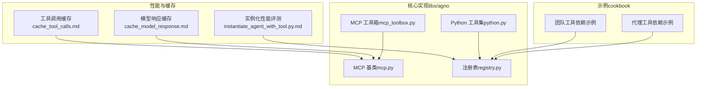
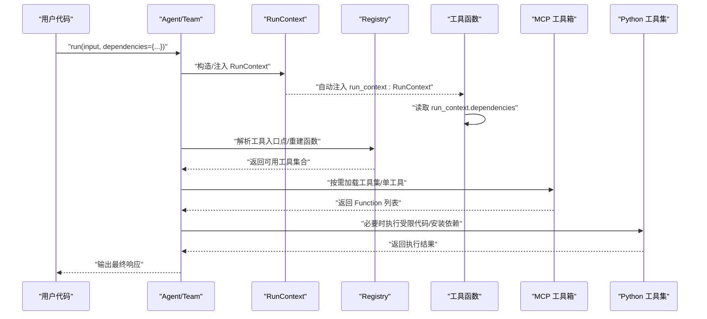
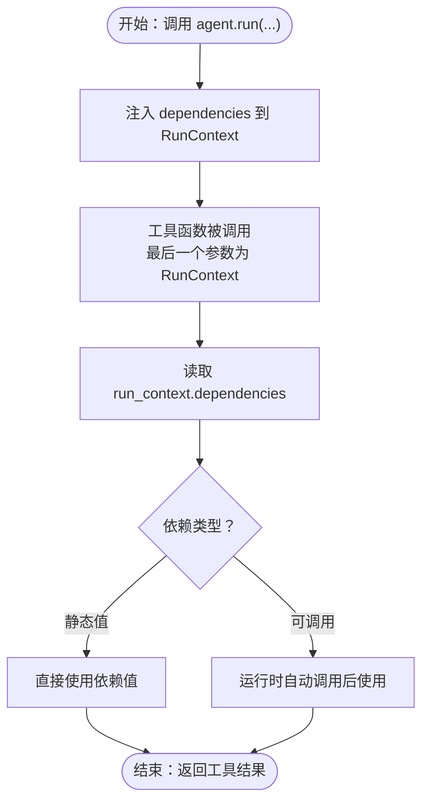
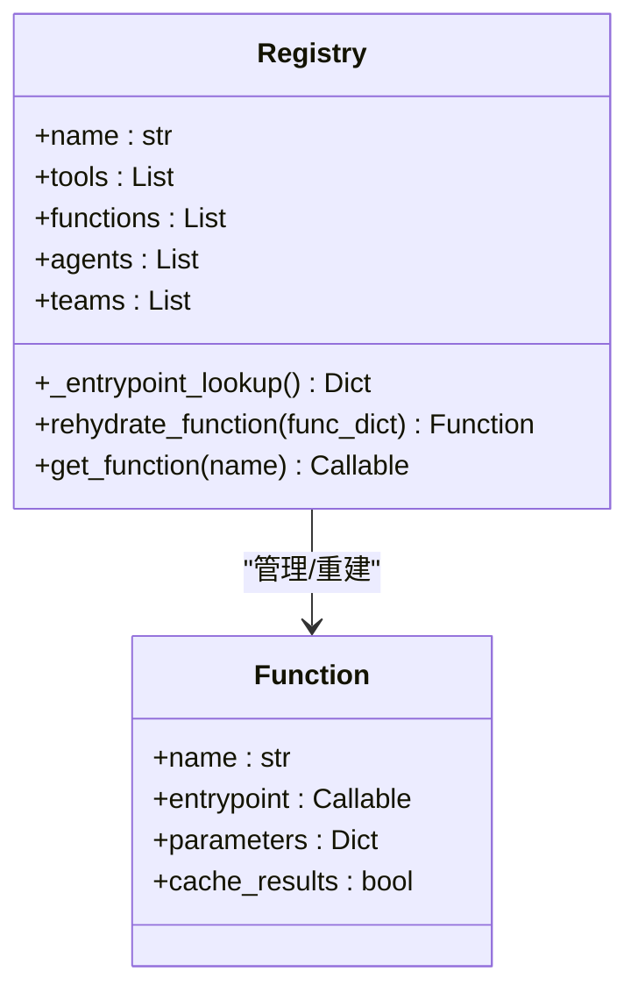
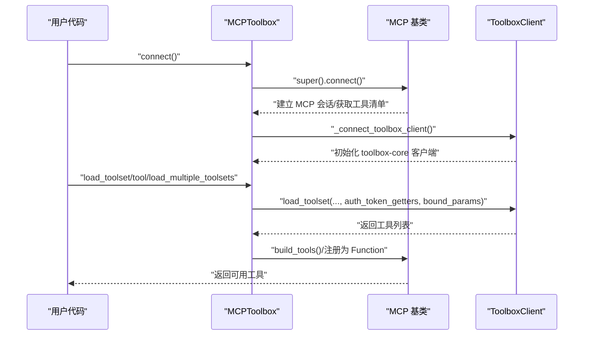
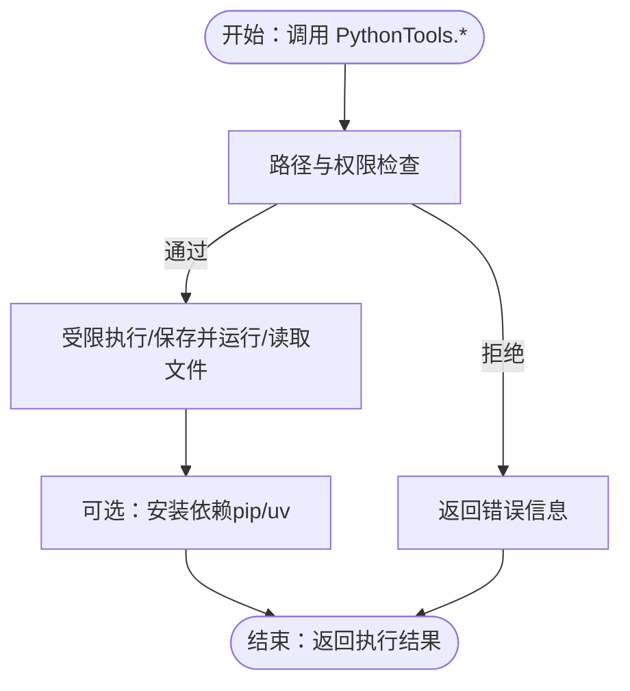
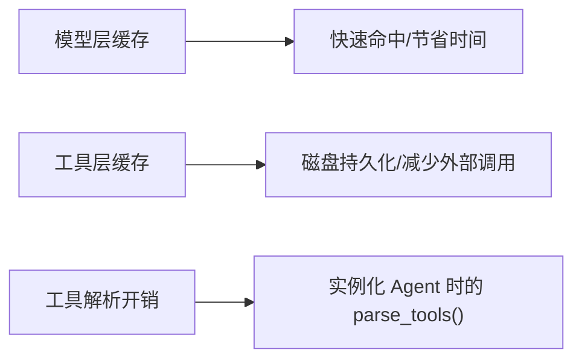
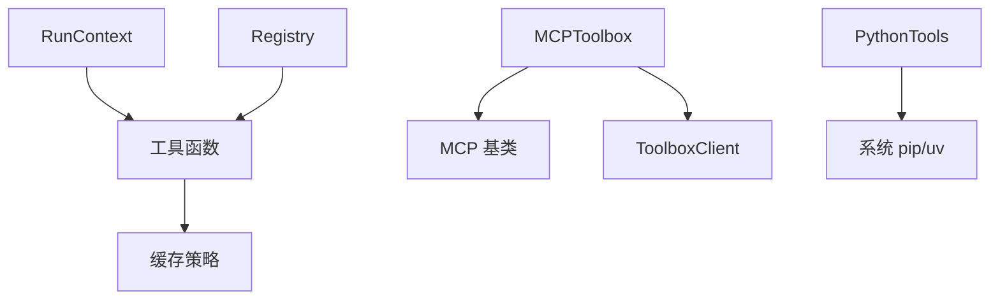

# 工具依赖

<cite>
**本文引用的文件**
- [dependencies_in_tools.py（示例：代理）](file://cookbook/02_agents/15_dependencies/dependencies_in_tools.py)
- [dependencies_in_tools.py（示例：团队）](file://cookbook/03_teams/17_dependencies/dependencies_in_tools.py)
- [mcp_toolbox.py（MCP 工具箱）](file://libs/agno/agno/tools/mcp_toolbox.py)
- [mcp.py（MCP 基类）](file://libs/agno/agno/tools/mcp/mcp.py)
- [python.py（Python 工具集）](file://libs/agno/agno/tools/python.py)
- [registry.py（注册表）](file://libs/agno/agno/registry/registry.py)
- [test_registry.py（注册表单元测试）](file://libs/agno/tests/unit/registry/test_registry.py)
- [instantiate_agent_with_tool.py.md（性能评测）](file://cookbook/09_evals/performance/instantiate_agent_with_tool.py.md)
- [cache_model_response.md（模型响应缓存）](file://cookbook/02_agents/14_advanced/cache_model_response.md)
- [cache_tool_calls.md（工具调用缓存）](file://cookbook/91_tools/other/cache_tool_calls.md)
- [generate_requirements.sh（依赖生成脚本）](file://libs/agno_infra/scripts/generate_requirements.sh)
- [generate_requirements.sh（示例：quickstart）](file://cookbook/00_quickstart/generate_requirements.sh)
- [generate_requirements.sh（示例：levels_of_agentic_software）](file://cookbook/levels_of_agentic_software/generate_requirements.sh)
- [generate_requirements.sh（示例：08_learning）](file://cookbook/08_learning/generate_requirements.sh)
</cite>

## 目录
1. [引言](#引言)
2. [项目结构](#项目结构)
3. [核心组件](#核心组件)
4. [架构总览](#架构总览)
5. [详细组件分析](#详细组件分析)
6. [依赖关系分析](#依赖关系分析)
7. [性能考量](#性能考量)
8. [故障排查指南](#故障排查指南)
9. [结论](#结论)
10. [附录](#附录)

## 引言
本文件围绕“工具依赖管理”主题，系统阐述在团队工具中如何声明、加载与版本控制工具依赖；解释依赖配置方法（依赖声明语法、依赖解析与依赖缓存）；分析工具依赖对性能（加载时间、内存占用、执行效率）的影响；并通过具体示例路径展示依赖声明、依赖注入与依赖使用；最后总结最佳实践（依赖优化、版本管理与错误处理策略）。

## 项目结构
本仓库包含两类与“工具依赖”密切相关的知识载体：
- 示例与用法：cookbook 中的“依赖在工具中”示例，演示如何在代理与团队工具中通过 RunContext 注入与使用依赖。
- 核心实现：libs/agno 中的工具系统（MCP 工具箱、Python 工具集、注册表等），以及缓存与性能评测相关内容。

**图表来源**
- [dependencies_in_tools.py（示例：代理）:1-109](file://cookbook/02_agents/15_dependencies/dependencies_in_tools.py#L1-L109)
- [dependencies_in_tools.py（示例：团队）:1-175](file://cookbook/03_teams/17_dependencies/dependencies_in_tools.py#L1-L175)
- [mcp_toolbox.py（MCP 工具箱）:1-285](file://libs/agno/agno/tools/mcp_toolbox.py#L1-L285)
- [mcp.py（MCP 基类）:577-622](file://libs/agno/agno/tools/mcp/mcp.py#L577-L622)
- [python.py（Python 工具集）:1-214](file://libs/agno/agno/tools/python.py#L1-L214)
- [registry.py（注册表）:1-111](file://libs/agno/agno/registry/registry.py#L1-L111)
- [cache_model_response.md（模型响应缓存）:1-53](file://cookbook/02_agents/14_advanced/cache_model_response.md#L1-L53)
- [cache_tool_calls.md（工具调用缓存）:19-41](file://cookbook/91_tools/other/cache_tool_calls.md#L19-L41)
- [instantiate_agent_with_tool.py.md（性能评测）:1-50](file://cookbook/09_evals/performance/instantiate_agent_with_tool.py.md#L1-L50)

**章节来源**
- [dependencies_in_tools.py（示例：代理）:1-109](file://cookbook/02_agents/15_dependencies/dependencies_in_tools.py#L1-L109)
- [dependencies_in_tools.py（示例：团队）:1-175](file://cookbook/03_teams/17_dependencies/dependencies_in_tools.py#L1-L175)
- [mcp_toolbox.py（MCP 工具箱）:1-285](file://libs/agno/agno/tools/mcp_toolbox.py#L1-L285)
- [mcp.py（MCP 基类）:577-622](file://libs/agno/agno/tools/mcp/mcp.py#L577-L622)
- [python.py（Python 工具集）:1-214](file://libs/agno/agno/tools/python.py#L1-L214)
- [registry.py（注册表）:1-111](file://libs/agno/agno/registry/registry.py#L1-L111)
- [cache_model_response.md（模型响应缓存）:1-53](file://cookbook/02_agents/14_advanced/cache_model_response.md#L1-L53)
- [cache_tool_calls.md（工具调用缓存）:19-41](file://cookbook/91_tools/other/cache_tool_calls.md#L19-L41)
- [instantiate_agent_with_tool.py.md（性能评测）:1-50](file://cookbook/09_evals/performance/instantiate_agent_with_tool.py.md#L1-L50)

## 核心组件
- 运行时依赖注入（RunContext.dependencies）
  - 代理与团队工具可通过最后一个参数声明为 RunContext，运行时自动注入依赖字典。示例展示了如何在工具内部读取注入的依赖（如用户画像、当前上下文）。
- 工具注册与解析（Registry）
  - 注册表负责管理工具、模型、数据库等非序列化对象，并提供入口点查找与函数重建能力。其 cached_property 保证入口点查找的高效复用。
- MCP 工具链（MCPToolbox/MCP）
  - MCP 工具箱支持从 MCP 服务端加载工具集或单个工具，并结合 toolbox-core 客户端进行过滤与绑定参数；MCP 基类负责构建 Function 并注册到工具集。
- Python 工具集（PythonTools）
  - 提供受限执行环境下的文件读写、代码运行与包安装能力，内置安全警告与路径限制，便于在受控环境中扩展工具能力。
- 缓存与性能
  - 模型响应缓存与工具调用缓存分别在不同层级减少重复计算与外部调用；性能评测示例量化了工具解析带来的开销。

**章节来源**
- [dependencies_in_tools.py（示例：代理）:24-67](file://cookbook/02_agents/15_dependencies/dependencies_in_tools.py#L24-L67)
- [dependencies_in_tools.py（示例：团队）:46-83](file://cookbook/03_teams/17_dependencies/dependencies_in_tools.py#L46-L83)
- [registry.py（注册表）:41-54](file://libs/agno/agno/registry/registry.py#L41-L54)
- [mcp_toolbox.py（MCP 工具箱）:137-222](file://libs/agno/agno/tools/mcp_toolbox.py#L137-L222)
- [mcp.py（MCP 基类）:577-603](file://libs/agno/agno/tools/mcp/mcp.py#L577-L603)
- [python.py（Python 工具集）:15-41](file://libs/agno/agno/tools/python.py#L15-L41)
- [cache_model_response.md（模型响应缓存）:19-37](file://cookbook/02_agents/14_advanced/cache_model_response.md#L19-L37)
- [cache_tool_calls.md（工具调用缓存）:21-41](file://cookbook/91_tools/other/cache_tool_calls.md#L21-L41)
- [instantiate_agent_with_tool.py.md（性能评测）:20-34](file://cookbook/09_evals/performance/instantiate_agent_with_tool.py.md#L20-L34)

## 架构总览
下图展示了“依赖声明—注入—解析—缓存”的整体流程，以及与核心实现模块的关系。

**图表来源**
- [dependencies_in_tools.py（示例：代理）:94-106](file://cookbook/02_agents/15_dependencies/dependencies_in_tools.py#L94-L106)
- [dependencies_in_tools.py（示例：团队）:157-172](file://cookbook/03_teams/17_dependencies/dependencies_in_tools.py#L157-L172)
- [registry.py（注册表）:41-60](file://libs/agno/agno/registry/registry.py#L41-L60)
- [mcp_toolbox.py（MCP 工具箱）:137-222](file://libs/agno/agno/tools/mcp_toolbox.py#L137-L222)
- [python.py（Python 工具集）:15-41](file://libs/agno/agno/tools/python.py#L15-L41)

## 详细组件分析

### 组件一：运行时依赖注入（RunContext.dependencies）
- 依赖声明与注入
  - 在代理或团队的 run 调用中，通过 dependencies 参数传入任意键值对，工具函数最后一个参数声明为 RunContext，即可在工具内部读取 run_context.dependencies。
  - 示例展示了将“用户画像”和“当前上下文”作为依赖注入，并在工具内部直接使用。
- 依赖解析与使用
  - 工具内部可直接访问依赖字典，支持静态值或可调用对象（运行时会被自动调用）。
- 适用场景
  - 动态上下文（如时间、天气）、用户画像、权限令牌、外部状态等。

**图表来源**
- [dependencies_in_tools.py（示例：代理）:94-106](file://cookbook/02_agents/15_dependencies/dependencies_in_tools.py#L94-L106)
- [dependencies_in_tools.py（示例：团队）:157-172](file://cookbook/03_teams/17_dependencies/dependencies_in_tools.py#L157-L172)

**章节来源**
- [dependencies_in_tools.py（示例：代理）:24-67](file://cookbook/02_agents/15_dependencies/dependencies_in_tools.py#L24-L67)
- [dependencies_in_tools.py（示例：团队）:46-83](file://cookbook/03_teams/17_dependencies/dependencies_in_tools.py#L46-L83)

### 组件二：工具注册与解析（Registry）
- 入口点查找与缓存
  - Registry 使用 cached_property 缓存 _entrypoint_lookup，避免重复扫描工具集合，提升解析效率。
- 函数重建
  - 支持从字典重建 Function 并重新绑定入口点，便于工作流重水化与组件恢复。
- 与工具链集成
  - 注册表为 MCP 工具箱与普通工具提供统一的入口点管理，确保工具在运行时可被正确解析与调用。

**图表来源**
- [registry.py（注册表）:21-60](file://libs/agno/agno/registry/registry.py#L21-L60)
- [test_registry.py（注册表单元测试）:302-310](file://libs/agno/tests/unit/registry/test_registry.py#L302-L310)

**章节来源**
- [registry.py（注册表）:41-60](file://libs/agno/agno/registry/registry.py#L41-L60)
- [test_registry.py（注册表单元测试）:302-310](file://libs/agno/tests/unit/registry/test_registry.py#L302-L310)

### 组件三：MCP 工具箱与工具加载（MCPToolbox / MCP）
- 工具加载流程
  - 先连接 MCP 服务端获取可用工具，再通过 toolbox-core 客户端按工具集或工具名进行过滤与绑定参数，最终映射为 Function 并注册到工具集。
- 认证与参数绑定
  - 支持通过 auth_token_getters 绑定认证源，支持 bound_params 绑定固定参数；严格模式下若参数未被全部使用则抛错。
- 生命周期管理
  - 提供异步上下文管理器与 close 方法，确保底层客户端正确关闭。

**图表来源**
- [mcp_toolbox.py（MCP 工具箱）:70-101](file://libs/agno/agno/tools/mcp_toolbox.py#L70-L101)
- [mcp_toolbox.py（MCP 工具箱）:177-222](file://libs/agno/agno/tools/mcp_toolbox.py#L177-L222)
- [mcp.py（MCP 基类）:605-622](file://libs/agno/agno/tools/mcp/mcp.py#L605-L622)

**章节来源**
- [mcp_toolbox.py（MCP 工具箱）:137-222](file://libs/agno/agno/tools/mcp_toolbox.py#L137-L222)
- [mcp.py（MCP 基类）:577-603](file://libs/agno/agno/tools/mcp/mcp.py#L577-L603)

### 组件四：Python 工具集（受限执行与依赖安装）
- 受限执行
  - 通过限制全局/局部作用域与路径检查，仅允许在基目录范围内执行文件与代码，降低风险。
- 依赖安装
  - 提供 pip 与 uv 的包安装接口，便于在运行时动态安装所需依赖。
- 安全提示
  - 执行任意代码前发出警告，建议配合人工审核。

**图表来源**
- [python.py（Python 工具集）:43-83](file://libs/agno/agno/tools/python.py#L43-L83)
- [python.py（Python 工具集）:173-213](file://libs/agno/agno/tools/python.py#L173-L213)

**章节来源**
- [python.py（Python 工具集）:15-41](file://libs/agno/agno/tools/python.py#L15-L41)
- [python.py（Python 工具集）:173-213](file://libs/agno/agno/tools/python.py#L173-L213)

### 组件五：缓存与性能（模型响应缓存、工具调用缓存、实例化开销）
- 模型响应缓存
  - 在模型层开启缓存后，相同输入命中缓存可显著缩短响应时间。
- 工具调用缓存
  - 工具级缓存（如 YFinanceTools）可将结果持久化至磁盘缓存，避免重复外部调用。
- 实例化性能
  - 工具解析（如 Literal 类型参数生成 JSON Schema）会带来额外开销，评测示例量化了该成本。

**图表来源**
- [cache_model_response.md（模型响应缓存）:19-37](file://cookbook/02_agents/14_advanced/cache_model_response.md#L19-L37)
- [cache_tool_calls.md（工具调用缓存）:21-41](file://cookbook/91_tools/other/cache_tool_calls.md#L21-L41)
- [instantiate_agent_with_tool.py.md（性能评测）:20-34](file://cookbook/09_evals/performance/instantiate_agent_with_tool.py.md#L20-L34)

**章节来源**
- [cache_model_response.md（模型响应缓存）:19-37](file://cookbook/02_agents/14_advanced/cache_model_response.md#L19-L37)
- [cache_tool_calls.md（工具调用缓存）:19-41](file://cookbook/91_tools/other/cache_tool_calls.md#L19-L41)
- [instantiate_agent_with_tool.py.md（性能评测）:20-34](file://cookbook/09_evals/performance/instantiate_agent_with_tool.py.md#L20-L34)

## 依赖关系分析
- 组件耦合
  - RunContext 与工具函数强耦合于 RunContext.dependencies；Registry 为工具解析提供入口点缓存；MCPToolbox 依赖 MCP 基类与 toolbox-core 客户端；PythonTools 作为通用工具提供受限执行与依赖安装能力。
- 外部依赖与集成点
  - MCPToolbox 依赖 toolbox-core；PythonTools 依赖子进程与系统 pip/uv；缓存策略依赖模型与工具实现方的开关配置。
- 循环依赖与边界
  - 当前实现未见循环依赖迹象；入口点查找通过 Registry 缓存避免重复扫描。

**图表来源**
- [mcp_toolbox.py（MCP 工具箱）:81-101](file://libs/agno/agno/tools/mcp_toolbox.py#L81-L101)
- [mcp.py（MCP 基类）:605-622](file://libs/agno/agno/tools/mcp/mcp.py#L605-L622)
- [python.py（Python 工具集）:173-213](file://libs/agno/agno/tools/python.py#L173-L213)
- [registry.py（注册表）:41-60](file://libs/agno/agno/registry/registry.py#L41-L60)

**章节来源**
- [mcp_toolbox.py（MCP 工具箱）:81-101](file://libs/agno/agno/tools/mcp_toolbox.py#L81-L101)
- [mcp.py（MCP 基类）:605-622](file://libs/agno/agno/tools/mcp/mcp.py#L605-L622)
- [python.py（Python 工具集）:173-213](file://libs/agno/agno/tools/python.py#L173-L213)
- [registry.py（注册表）:41-60](file://libs/agno/agno/registry/registry.py#L41-L60)

## 性能考量
- 依赖加载时间
  - 工具解析（如 Literal 参数 Schema 生成）会增加实例化开销；建议预创建工具列表并在多次实例化时复用。
- 内存使用
  - 工具解析与缓存命中均会产生临时对象；Registry 的入口点缓存可降低重复扫描的内存压力。
- 执行效率
  - 模型响应缓存与工具调用缓存可显著降低重复调用的成本；MCP 工具箱的严格模式有助于提前发现参数未使用问题，避免无效调用。

**章节来源**
- [instantiate_agent_with_tool.py.md（性能评测）:20-34](file://cookbook/09_evals/performance/instantiate_agent_with_tool.py.md#L20-L34)
- [cache_model_response.md（模型响应缓存）:19-37](file://cookbook/02_agents/14_advanced/cache_model_response.md#L19-L37)
- [cache_tool_calls.md（工具调用缓存）:19-41](file://cookbook/91_tools/other/cache_tool_calls.md#L19-L41)
- [mcp_toolbox.py（MCP 工具箱）:194-198](file://libs/agno/agno/tools/mcp_toolbox.py#L194-L198)

## 故障排查指南
- 依赖注入失败
  - 确认工具函数最后一个参数类型为 RunContext；确认 run 调用时 dependencies 正确传入。
- 工具解析异常
  - 检查 Registry 的入口点缓存是否生效；确认工具函数具备 entrypoint 或 Toolkit 的 functions 映射正确。
- MCP 工具加载失败
  - 确认 MCP 服务端可达；检查工具集/工具名是否存在；严格模式下确保所有绑定参数都被使用。
- Python 工具执行失败
  - 检查路径限制与权限；确认代码在受限作用域内执行；关注安装依赖过程中的异常日志。
- 缓存未命中
  - 检查模型层与工具层缓存开关；确认输入哈希一致；核对缓存目录与 TTL 设置。

**章节来源**
- [dependencies_in_tools.py（示例：代理）:94-106](file://cookbook/02_agents/15_dependencies/dependencies_in_tools.py#L94-L106)
- [dependencies_in_tools.py（示例：团队）:157-172](file://cookbook/03_teams/17_dependencies/dependencies_in_tools.py#L157-L172)
- [registry.py（注册表）:41-60](file://libs/agno/agno/registry/registry.py#L41-L60)
- [mcp_toolbox.py（MCP 工具箱）:137-222](file://libs/agno/agno/tools/mcp_toolbox.py#L137-L222)
- [python.py（Python 工具集）:173-213](file://libs/agno/agno/tools/python.py#L173-L213)

## 结论
- 工具依赖管理的关键在于：清晰的依赖声明（RunContext.dependencies）、可靠的工具解析（Registry 缓存）、可控的工具加载（MCPToolbox 与严格模式）、以及高效的缓存策略（模型与工具层）。
- 在团队工具中，应优先采用运行时注入的方式传递上下文与数据源，避免硬编码与泄露敏感信息。
- 性能优化方面，建议复用工具列表、启用缓存、谨慎使用动态依赖安装，并在严格模式下确保参数绑定完整。

## 附录
- 依赖声明语法与示例路径
  - 代理工具依赖注入：[dependencies_in_tools.py（示例：代理）:94-106](file://cookbook/02_agents/15_dependencies/dependencies_in_tools.py#L94-L106)
  - 团队工具依赖注入：[dependencies_in_tools.py（示例：团队）:157-172](file://cookbook/03_teams/17_dependencies/dependencies_in_tools.py#L157-L172)
- 依赖解析与缓存
  - 注册表入口点缓存：[registry.py（注册表）:41-54](file://libs/agno/agno/registry/registry.py#L41-L54)
  - 模型响应缓存：[cache_model_response.md（模型响应缓存）:19-37](file://cookbook/02_agents/14_advanced/cache_model_response.md#L19-L37)
  - 工具调用缓存：[cache_tool_calls.md（工具调用缓存）:21-41](file://cookbook/91_tools/other/cache_tool_calls.md#L21-L41)
- 依赖安装与版本控制
  - Python 包安装：[python.py（Python 工具集）:173-213](file://libs/agno/agno/tools/python.py#L173-L213)
  - 依赖生成脚本（uv pip compile）：[generate_requirements.sh（示例：quickstart）:11-12](file://cookbook/00_quickstart/generate_requirements.sh#L11-L12)，[generate_requirements.sh（示例：levels_of_agentic_software）:11-12](file://cookbook/levels_of_agentic_software/generate_requirements.sh#L11-L12)，[generate_requirements.sh（示例：08_learning）:11-12](file://cookbook/08_learning/generate_requirements.sh#L11-L12)，[generate_requirements.sh（依赖生成脚本）:19-24](file://libs/agno_infra/scripts/generate_requirements.sh#L19-L24)