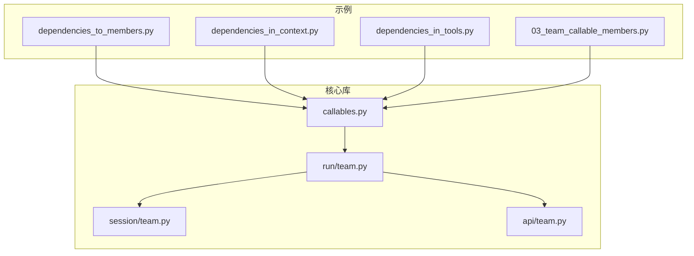
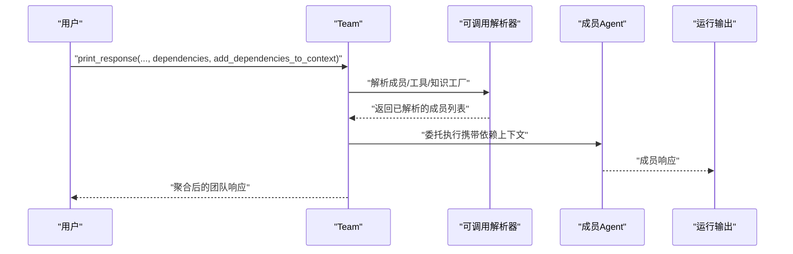
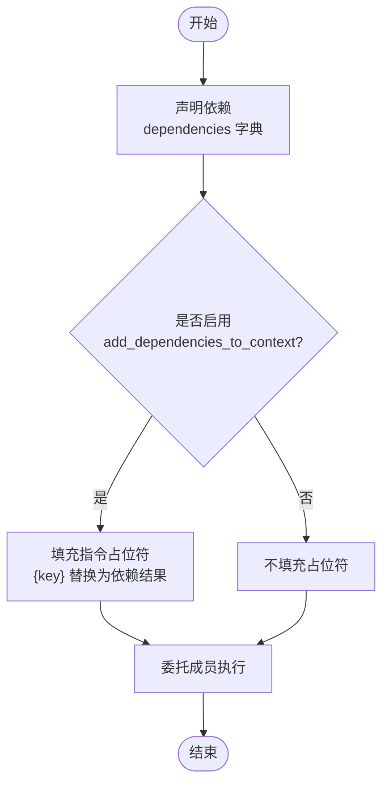
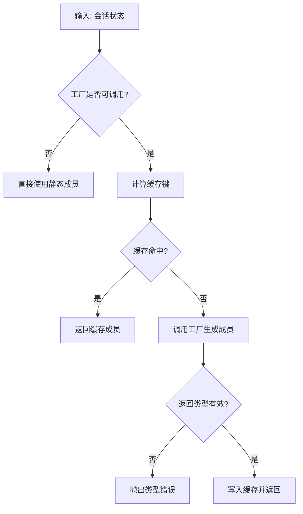
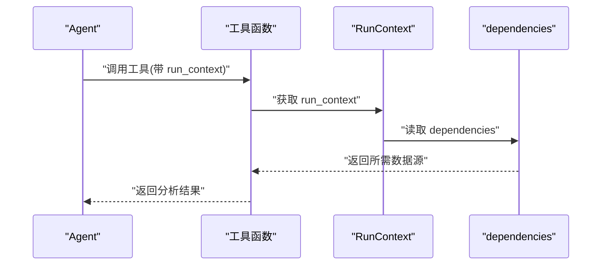
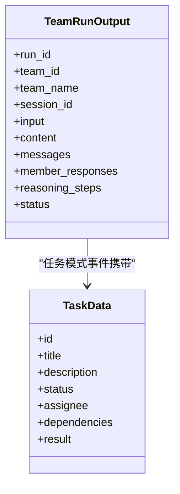
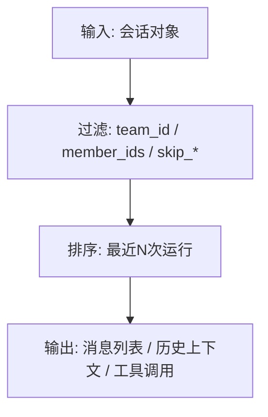
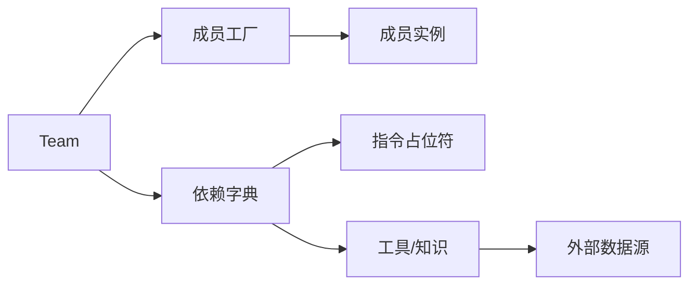

# 成员依赖

<cite>
**本文引用的文件**
- [dependencies_to_members.py](file://cookbook/03_teams/17_dependencies/dependencies_to_members.py)
- [dependencies_in_context.py](file://cookbook/02_agents/15_dependencies/dependencies_in_context.py)
- [dependencies_in_tools.py](file://cookbook/02_agents/15_dependencies/dependencies_in_tools.py)
- [dependencies_to_members.md](file://cookbook/03_teams/17_dependencies/dependencies_to_members.md)
- [dependencies_in_context.md](file://cookbook/03_teams/17_dependencies/dependencies_in_context.md)
- [03_team_callable_members.py](file://cookbook/02_agents/04_tools/03_team_callable_members.py)
- [callables.py](file://libs/agno/agno/utils/callables.py)
- [team.py](file://libs/agno/agno/run/team.py)
- [team.py](file://libs/agno/agno/api/team.py)
- [team.py](file://libs/agno/agno/session/team.py)
- [test_callable_resources.py](file://libs/agno/tests/unit/team/test_callable_resources.py)
- [test_dependencies.py](file://libs/agno/tests/integration/teams/test_dependencies.py)
</cite>

## 目录
1. [引言](#引言)
2. [项目结构](#项目结构)
3. [核心组件](#核心组件)
4. [架构总览](#架构总览)
5. [详细组件分析](#详细组件分析)
6. [依赖关系分析](#依赖关系分析)
7. [性能考量](#性能考量)
8. [故障排查指南](#故障排查指南)
9. [结论](#结论)
10. [附录](#附录)

## 引言
本文件围绕“成员依赖管理”展开，系统性阐述团队成员之间的依赖关系如何声明、配置与维护；解释成员依赖的类型与作用（直接依赖、间接依赖、循环依赖的识别与规避）；分析成员依赖对团队协作的影响（依赖传播、状态同步、冲突解决）；并通过仓库中的示例与源码路径，给出依赖声明、解析与使用的实现参考；最后总结最佳实践（设计原则、权限控制与性能优化策略）。

## 项目结构
本项目以示例与核心库分离的方式组织，示例位于 cookbook 下，核心运行与工具位于 libs/agno 中。与成员依赖相关的关键路径如下：
- 示例：cookbook/03_teams/17_dependencies 与 cookbook/02_agents/15_dependencies 展示依赖注入与传播
- 核心：libs/agno/agno/utils/callables.py 提供可调用资源（工具、知识、成员）的统一解析与缓存机制
- 团队运行：libs/agno/agno/run/team.py 定义团队运行数据结构与事件
- 会话与历史：libs/agno/agno/session/team.py 提供会话消息与历史检索能力
- API 记录：libs/agno/agno/api/team.py 提供团队运行的遥测记录接口

**图表来源**
- [dependencies_to_members.py:1-84](file://cookbook/03_teams/17_dependencies/dependencies_to_members.py#L1-L84)
- [dependencies_in_context.py:1-64](file://cookbook/02_agents/15_dependencies/dependencies_in_context.py#L1-L64)
- [dependencies_in_tools.py:1-109](file://cookbook/02_agents/15_dependencies/dependencies_in_tools.py#L1-L109)
- [03_team_callable_members.py:1-72](file://cookbook/02_agents/04_tools/03_team_callable_members.py#L1-L72)
- [callables.py:1-613](file://libs/agno/agno/utils/callables.py#L1-L613)
- [team.py:1-800](file://libs/agno/agno/run/team.py#L1-L800)
- [team.py:1-348](file://libs/agno/agno/session/team.py#L1-L348)
- [team.py:1-31](file://libs/agno/agno/api/team.py#L1-L31)

**章节来源**
- [dependencies_to_members.py:1-84](file://cookbook/03_teams/17_dependencies/dependencies_to_members.py#L1-L84)
- [dependencies_in_context.py:1-64](file://cookbook/02_agents/15_dependencies/dependencies_in_context.py#L1-L64)
- [dependencies_in_tools.py:1-109](file://cookbook/02_agents/15_dependencies/dependencies_in_tools.py#L1-L109)
- [03_team_callable_members.py:1-72](file://cookbook/02_agents/04_tools/03_team_callable_members.py#L1-L72)
- [callables.py:1-613](file://libs/agno/agno/utils/callables.py#L1-L613)
- [team.py:1-800](file://libs/agno/agno/run/team.py#L1-L800)
- [team.py:1-348](file://libs/agno/agno/session/team.py#L1-L348)
- [team.py:1-31](file://libs/agno/agno/api/team.py#L1-L31)

## 核心组件
- 可调用资源解析器（工具/知识/成员）：统一的工厂解析与缓存机制，支持同步与异步调用，支持自定义缓存键与清理
- 团队运行输出与事件：定义团队运行期间的消息、成员响应、任务状态等结构化数据
- 会话与历史：提供按条件筛选消息、获取聊天历史、工具调用统计与团队历史上下文格式化
- API 遥测：记录团队运行的遥测信息，便于观测与审计

**章节来源**
- [callables.py:213-445](file://libs/agno/agno/utils/callables.py#L213-L445)
- [team.py:704-800](file://libs/agno/agno/run/team.py#L704-L800)
- [team.py:15-348](file://libs/agno/agno/session/team.py#L15-L348)
- [team.py:1-31](file://libs/agno/agno/api/team.py#L1-L31)

## 架构总览
成员依赖管理贯穿“声明—解析—传播—使用”的闭环。示例展示了依赖在运行时注入到团队指令与成员上下文中，核心库提供了统一的可调用资源解析与缓存能力，确保成员在被委托执行时能感知一致的上下文。

**图表来源**
- [dependencies_to_members.py:74-83](file://cookbook/03_teams/17_dependencies/dependencies_to_members.py#L74-L83)
- [callables.py:374-445](file://libs/agno/agno/utils/callables.py#L374-L445)
- [team.py:704-800](file://libs/agno/agno/run/team.py#L704-L800)

## 详细组件分析

### 组件A：依赖声明与传播（示例）
- 运行时依赖声明：在团队运行时通过 print_response 的 dependencies 参数传入依赖字典，支持可调用函数与静态数据
- 指令占位符注入：add_dependencies_to_context=True 时，依赖结果会自动填充到 instructions 中的占位符，实现上下文一致性
- 成员可见性：当 add_dependencies_to_context=True 时，成员在被委托执行时也能感知到相同的依赖上下文

**图表来源**
- [dependencies_to_members.md:1-50](file://cookbook/03_teams/17_dependencies/dependencies_to_members.md#L1-L50)
- [dependencies_in_context.md:1-39](file://cookbook/03_teams/17_dependencies/dependencies_in_context.md#L1-L39)

**章节来源**
- [dependencies_to_members.py:74-83](file://cookbook/03_teams/17_dependencies/dependencies_to_members.py#L74-L83)
- [dependencies_to_members.md:1-50](file://cookbook/03_teams/17_dependencies/dependencies_to_members.md#L1-L50)
- [dependencies_in_context.md:1-39](file://cookbook/03_teams/17_dependencies/dependencies_in_context.md#L1-L39)

### 组件B：成员动态选择与缓存（示例）
- 可调用成员工厂：将成员列表改为可调用工厂，根据会话状态动态决定成员组合
- 缓存策略：默认启用缓存，支持自定义缓存键；相同用户或会话键复用解析结果，避免重复创建
- 错误处理：对无效返回类型抛出异常，None 返回视为空列表

**图表来源**
- [03_team_callable_members.py:31-38](file://cookbook/02_agents/04_tools/03_team_callable_members.py#L31-L38)
- [callables.py:374-445](file://libs/agno/agno/utils/callables.py#L374-L445)
- [test_callable_resources.py:157-234](file://libs/agno/tests/unit/team/test_callable_resources.py#L157-L234)

**章节来源**
- [03_team_callable_members.py:1-72](file://cookbook/02_agents/04_tools/03_team_callable_members.py#L1-L72)
- [callables.py:374-445](file://libs/agno/agno/utils/callables.py#L374-L445)
- [test_callable_resources.py:149-238](file://libs/agno/tests/unit/team/test_callable_resources.py#L149-L238)

### 组件C：依赖在工具中的使用（示例）
- 工具访问依赖：工具函数签名可接收 run_context，从而从 run_context.dependencies 获取依赖
- 多数据源整合：工具可同时使用用户画像与当前上下文等多源数据进行分析
- 输出格式化：工具将分析结果格式化后返回给代理，由代理进一步加工

**图表来源**
- [dependencies_in_tools.py:24-67](file://cookbook/02_agents/15_dependencies/dependencies_in_tools.py#L24-L67)

**章节来源**
- [dependencies_in_tools.py:1-109](file://cookbook/02_agents/15_dependencies/dependencies_in_tools.py#L1-L109)

### 组件D：团队运行数据结构与事件
- 运行输出：包含团队运行的输入、消息、成员响应、推理步骤、引用与元数据等
- 事件体系：涵盖运行开始/完成、推理、内存更新、模型请求、任务迭代等事件类型
- 任务模式：提供任务状态更新、创建与更新事件，支持前端渲染任务列表

**图表来源**
- [team.py:704-800](file://libs/agno/agno/run/team.py#L704-L800)
- [team.py:514-547](file://libs/agno/agno/run/team.py#L514-L547)

**章节来源**
- [team.py:704-800](file://libs/agno/agno/run/team.py#L704-L800)

### 组件E：会话与历史检索
- 消息过滤：支持按团队ID、成员ID、状态、角色等过滤消息
- 历史上下文：提供格式化的团队历史上下文字符串，便于在推理步骤中使用
- 工具调用统计：支持按顺序提取工具调用记录

**图表来源**
- [team.py:113-237](file://libs/agno/agno/session/team.py#L113-L237)
- [team.py:312-339](file://libs/agno/agno/session/team.py#L312-L339)

**章节来源**
- [team.py:113-237](file://libs/agno/agno/session/team.py#L113-L237)
- [team.py:312-339](file://libs/agno/agno/session/team.py#L312-L339)

## 依赖关系分析
- 直接依赖：成员在被委托时直接使用的依赖（如用户画像、当前上下文）
- 间接依赖：通过工具或知识模块间接访问的数据源（如外部API、数据库）
- 循环依赖：在成员工厂中避免基于成员自身状态的循环引用；在依赖解析中通过缓存键与工厂签名注入避免重复解析

**图表来源**
- [callables.py:374-445](file://libs/agno/agno/utils/callables.py#L374-L445)
- [dependencies_to_members.md:1-50](file://cookbook/03_teams/17_dependencies/dependencies_to_members.md#L1-L50)

**章节来源**
- [callables.py:374-445](file://libs/agno/agno/utils/callables.py#L374-L445)
- [dependencies_to_members.md:1-50](file://cookbook/03_teams/17_dependencies/dependencies_to_members.md#L1-L50)

## 性能考量
- 缓存策略：可调用资源解析默认启用缓存，建议为高成本工厂设置自定义缓存键，减少重复创建
- 异步支持：对于异步工厂与缓存键，使用异步解析与清理函数，避免阻塞
- 依赖粒度：将大型依赖拆分为细粒度函数，按需解析，降低一次性解析成本
- 事件与历史：在高频运行场景下，注意控制消息与事件数量，必要时限制最近N次运行的历史长度

## 故障排查指南
- 类型错误：可调用工厂必须返回列表或元组，否则抛出类型错误；确认工厂返回类型
- 空结果处理：None 返回被视为空列表；若期望非空，请检查工厂逻辑
- 缓存问题：若缓存导致状态不一致，可通过清理指定缓存或禁用缓存验证
- 异步错误：同步模式下不可使用异步工厂；请改用异步运行接口

**章节来源**
- [test_callable_resources.py:193-209](file://libs/agno/tests/unit/team/test_callable_resources.py#L193-L209)
- [test_callable_resources.py:211-234](file://libs/agno/tests/unit/team/test_callable_resources.py#L211-L234)
- [callables.py:453-484](file://libs/agno/agno/utils/callables.py#L453-L484)

## 结论
成员依赖管理的核心在于“声明灵活、解析统一、传播一致、使用可控”。通过示例与核心库的协同，团队可以在运行时灵活注入依赖，并确保成员在被委托时获得一致的上下文；同时，统一的可调用资源解析与缓存机制保障了性能与稳定性。遵循本文的最佳实践，可在复杂协作场景中有效避免循环依赖与状态不一致，提升系统的可维护性与可观测性。

## 附录
- 示例路径参考
  - [dependencies_to_members.py:74-83](file://cookbook/03_teams/17_dependencies/dependencies_to_members.py#L74-L83)
  - [dependencies_in_context.py:45-53](file://cookbook/02_agents/15_dependencies/dependencies_in_context.py#L45-L53)
  - [dependencies_in_tools.py:74-86](file://cookbook/02_agents/15_dependencies/dependencies_in_tools.py#L74-L86)
  - [03_team_callable_members.py:45-51](file://cookbook/02_agents/04_tools/03_team_callable_members.py#L45-L51)
- 核心库路径参考
  - [callables.py:374-445](file://libs/agno/agno/utils/callables.py#L374-L445)
  - [team.py:704-800](file://libs/agno/agno/run/team.py#L704-L800)
  - [team.py:113-237](file://libs/agno/agno/session/team.py#L113-L237)
  - [team.py:1-31](file://libs/agno/agno/api/team.py#L1-L31)
- 测试路径参考
  - [test_callable_resources.py:149-238](file://libs/agno/tests/unit/team/test_callable_resources.py#L149-L238)
  - [test_dependencies.py:110-138](file://libs/agno/tests/integration/teams/test_dependencies.py#L110-L138)