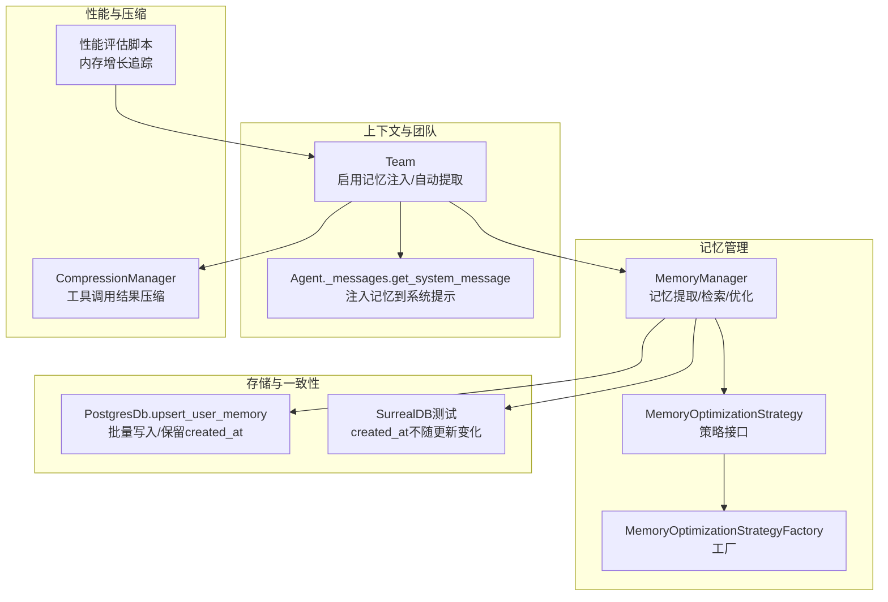
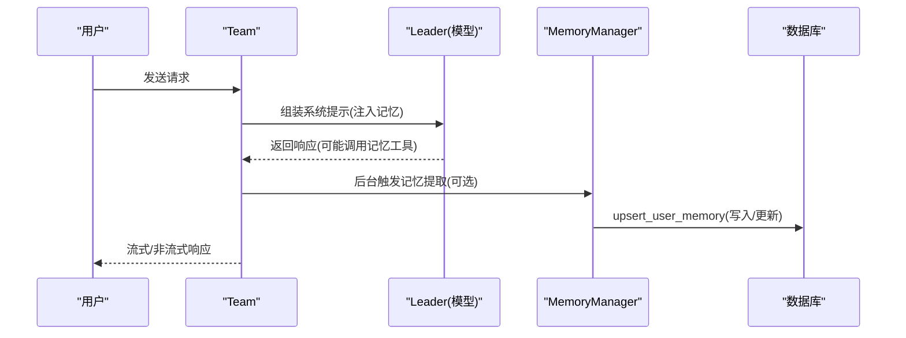
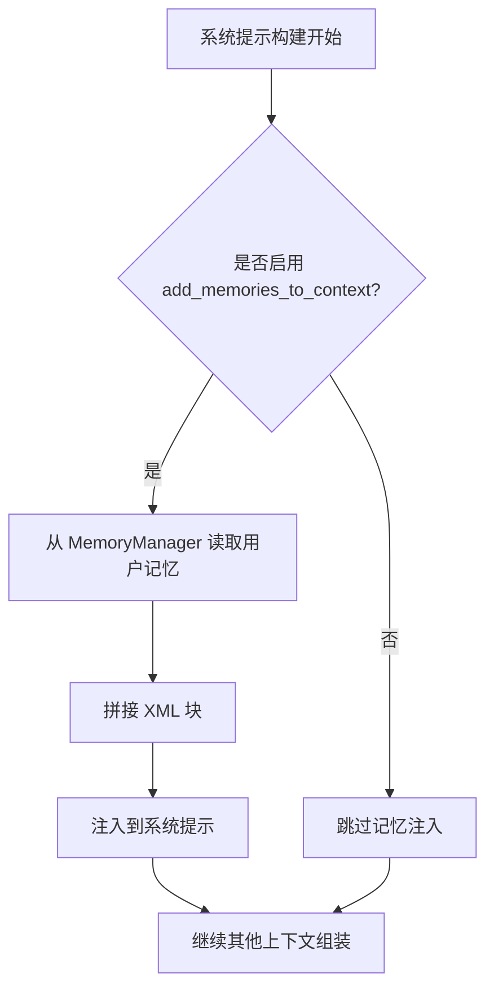
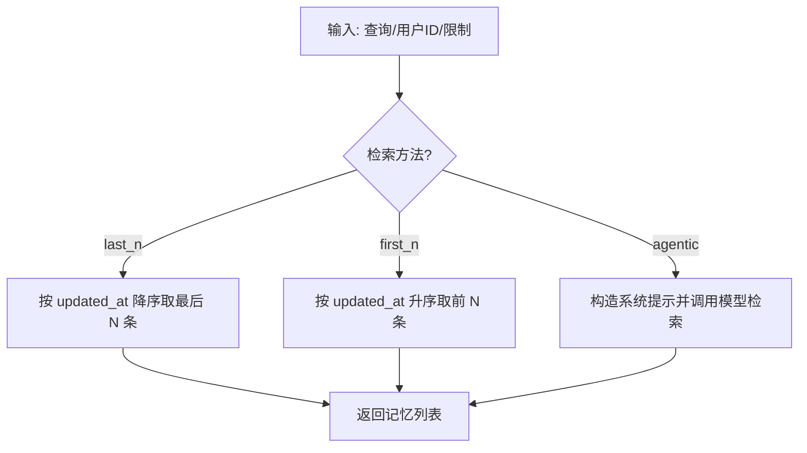
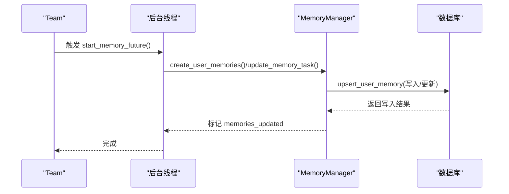
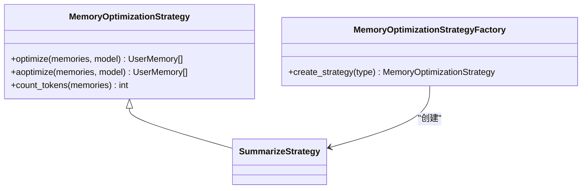
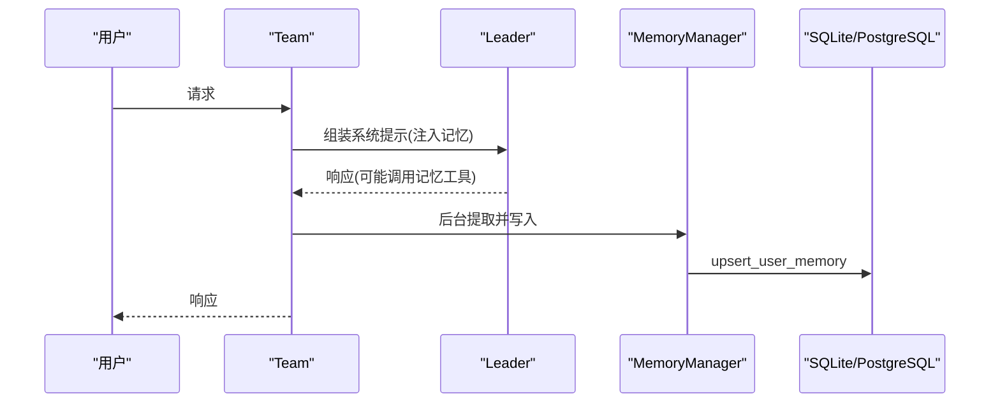
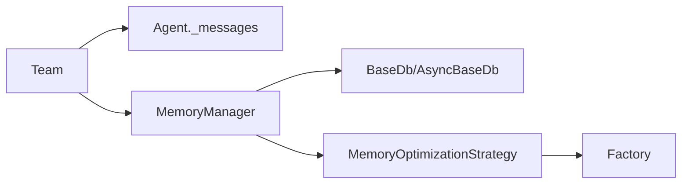

# 上下文中的记忆

<cite>
**本文引用的文件**
- [libs/agno/agno/memory/manager.py](file://libs/agno/agno/memory/manager.py)
- [libs/agno/agno/agent/_messages.py](file://libs/agno/agno/agent/_messages.py)
- [libs/agno/agno/team/team.py](file://libs/agno/agno/team/team.py)
- [libs/agno/agno/memory/strategies/types.py](file://libs/agno/agno/memory/strategies/types.py)
- [libs/agno/agno/memory/strategies/__init__.py](file://libs/agno/agno/memory/strategies/__init__.py)
- [libs/agno/agno/db/postgres/postgres.py](file://libs/agno/agno/db/postgres/postgres.py)
- [libs/agno/tests/integration/db/surrealdb/test_surrealdb_memory.py](file://libs/agno/tests/integration/db/surrealdb/test_surrealdb_memory.py)
- [libs/agno/tests/integration/teams/test_memory_impact.py](file://libs/agno/tests/integration/teams/test_memory_impact.py)
- [cookbook/03_teams/06_memory/03_memories_in_context.md](file://cookbook/03_teams/06_memory/03_memories_in_context.md)
- [cookbook/03_teams/06_memory/TEST_LOG.md](file://cookbook/03_teams/06_memory/TEST_LOG.md)
- [cookbook/02_agents/06_memory_and_learning/memory_manager.md](file://cookbook/02_agents/06_memory_and_learning/memory_manager.md)
- [cookbook/11_memory/optimize_memories/02_custom_memory_strategy.md](file://cookbook/11_memory/optimize_memories/02_custom_memory_strategy.md)
- [cookbook/09_evals/performance/team_response_with_memory_simple.py.md](file://cookbook/09_evals/performance/team_response_with_memory_simple.py.md)
- [cookbook/09_evals/performance/team_response_with_memory_multi_user.py.md](file://cookbook/09_evals/performance/team_response_with_memory_multi_user.py.md)
- [cookbook/06_storage/examples/selecting_tables.md](file://cookbook/06_storage/examples/selecting_tables.md)
- [cookbook/03_teams/10_context_compression/tool_call_compression_with_manager.md](file://cookbook/03_teams/10_context_compression/tool_call_compression_with_manager.md)
- [cookbook/02_agents/14_advanced/advanced_compression.md](file://cookbook/02_agents/14_advanced/advanced_compression.md)
</cite>

## 目录
1. [简介](#简介)
2. [项目结构](#项目结构)
3. [核心组件](#核心组件)
4. [架构总览](#架构总览)
5. [详细组件分析](#详细组件分析)
6. [依赖分析](#依赖分析)
7. [性能考量](#性能考量)
8. [故障排查指南](#故障排查指南)
9. [结论](#结论)
10. [附录](#附录)

## 简介
本文件围绕“上下文中的记忆”展开，系统阐述在团队协作场景下如何将记忆注入、过滤与优化策略落地，使相关记忆有效融入对话与决策过程。内容涵盖：
- 记忆的构建与注入：如何在系统提示中注入历史记忆，并区分“自动注入”与“模型主动召回”的两种模式。
- 记忆的选择、权重与排序：基于时间戳与检索策略的排序与筛选。
- 动态更新与实时同步：新增、更新、删除与清理记忆的机制，以及跨会话的一致性保障。
- 性能优化与资源管理：压缩上下文、策略化优化、批量写入与并发安全等。

## 项目结构
本仓库提供了完整的记忆管理与团队协作能力，核心文件分布如下：
- 记忆管理器：负责记忆的提取、存储、检索与优化。
- 上下文组装：在系统提示中注入记忆，形成“上下文记忆”。
- 团队协作：在 Team 中启用记忆注入与自动记忆提取，支持多成员共享记忆。
- 策略与工厂：内置与自定义记忆优化策略，支持按需替换。
- 存储与一致性：PostgreSQL、SurrealDB 等后端的 upsert 与时间戳保留策略。
- 性能评估：针对多用户并发与内存增长的追踪与分析。

**图表来源**
- [libs/agno/agno/memory/manager.py:44-110](file://libs/agno/agno/memory/manager.py#L44-L110)
- [libs/agno/agno/memory/strategies/types.py:8-37](file://libs/agno/agno/memory/strategies/types.py#L8-L37)
- [libs/agno/agno/agent/_messages.py:286-326](file://libs/agno/agno/agent/_messages.py#L286-L326)
- [libs/agno/agno/team/team.py:491-527](file://libs/agno/agno/team/team.py#L491-L527)
- [libs/agno/agno/db/postgres/postgres.py:1799-1827](file://libs/agno/agno/db/postgres/postgres.py#L1799-L1827)
- [libs/agno/tests/integration/db/surrealdb/test_surrealdb_memory.py:88-127](file://libs/agno/tests/integration/db/surrealdb/test_surrealdb_memory.py#L88-L127)
- [cookbook/09_evals/performance/team_response_with_memory_simple.py.md:23-41](file://cookbook/09_evals/performance/team_response_with_memory_simple.py.md#L23-L41)

**章节来源**
- [libs/agno/agno/memory/manager.py:44-110](file://libs/agno/agno/memory/manager.py#L44-L110)
- [libs/agno/agno/agent/_messages.py:286-326](file://libs/agno/agno/agent/_messages.py#L286-L326)
- [libs/agno/agno/team/team.py:491-527](file://libs/agno/agno/team/team.py#L491-L527)
- [libs/agno/agno/memory/strategies/types.py:8-37](file://libs/agno/agno/memory/strategies/types.py#L8-L37)
- [libs/agno/agno/db/postgres/postgres.py:1799-1827](file://libs/agno/agno/db/postgres/postgres.py#L1799-L1827)
- [libs/agno/tests/integration/db/surrealdb/test_surrealdb_memory.py:88-127](file://libs/agno/tests/integration/db/surrealdb/test_surrealdb_memory.py#L88-L127)
- [cookbook/09_evals/performance/team_response_with_memory_simple.py.md:23-41](file://cookbook/09_evals/performance/team_response_with_memory_simple.py.md#L23-L41)

## 核心组件
- MemoryManager：负责记忆的增删改查、检索（最近/最早/代理检索）、优化策略执行与工具函数生成。
- Agent._messages.get_system_message：在系统提示中注入用户记忆，支持“始终注入”与“模型主动召回”两种模式。
- Team：在团队中启用记忆注入与自动记忆提取，支持多成员共享记忆与上下文压缩。
- MemoryOptimizationStrategy 与 Factory：提供策略化优化入口，支持内置策略与自定义策略。
- 存储层：PostgreSQL 的 upsert 与时间戳保留；SurrealDB 的 created_at 不随更新变化测试。

**章节来源**
- [libs/agno/agno/memory/manager.py:44-110](file://libs/agno/agno/memory/manager.py#L44-L110)
- [libs/agno/agno/agent/_messages.py:286-326](file://libs/agno/agno/agent/_messages.py#L286-L326)
- [libs/agno/agno/team/team.py:491-527](file://libs/agno/agno/team/team.py#L491-L527)
- [libs/agno/agno/memory/strategies/types.py:8-37](file://libs/agno/agno/memory/strategies/types.py#L8-L37)
- [libs/agno/agno/db/postgres/postgres.py:1799-1827](file://libs/agno/agno/db/postgres/postgres.py#L1799-L1827)
- [libs/agno/tests/integration/db/surrealdb/test_surrealdb_memory.py:88-127](file://libs/agno/tests/integration/db/surrealdb/test_surrealdb_memory.py#L88-L127)

## 架构总览
记忆在团队上下文中的流转路径如下：
- 记忆注入：在系统提示中注入历史记忆，供模型直接使用。
- 自动记忆提取：每次运行结束后，后台线程触发记忆提取，写入数据库。
- 记忆检索与排序：按时间戳或检索策略返回记忆列表。
- 记忆优化：定期执行策略化优化，减少 token 占用或保持最新状态。
- 上下文压缩：对工具调用结果进行压缩，降低上下文长度。
- 性能评估：对多用户并发与内存增长进行追踪与分析。

**图表来源**
- [libs/agno/agno/agent/_messages.py:286-326](file://libs/agno/agno/agent/_messages.py#L286-L326)
- [libs/agno/agno/memory/manager.py:1040-1107](file://libs/agno/agno/memory/manager.py#L1040-L1107)
- [libs/agno/agno/db/postgres/postgres.py:1799-1827](file://libs/agno/agno/db/postgres/postgres.py#L1799-L1827)

## 详细组件分析

### 记忆注入与上下文构建
- 自动注入：当启用 add_memories_to_context 时，系统提示中会自动注入用户记忆块，无需模型主动搜索。
- 主动召回：当启用 enable_agentic_memory 时，模型可调用工具主动搜索/更新记忆。
- 记忆格式：在系统提示中以特定 XML 块形式呈现，便于模型理解与使用。

**图表来源**
- [libs/agno/agno/agent/_messages.py:286-326](file://libs/agno/agno/agent/_messages.py#L286-L326)

**章节来源**
- [libs/agno/agno/agent/_messages.py:286-326](file://libs/agno/agno/agent/_messages.py#L286-L326)
- [cookbook/03_teams/06_memory/03_memories_in_context.md:18-47](file://cookbook/03_teams/06_memory/03_memories_in_context.md#L18-L47)

### 记忆检索、权重与排序
- 检索方法：支持 last_n（最近）、first_n（最早）与 agentic（基于查询相似度）三种检索方式。
- 排序依据：默认按 updated_at 时间戳排序；若缺失则按 created_at 排序。
- 权重与混合：在向量检索中可设置向量权重与文本权重，组合出混合分数。

**图表来源**
- [libs/agno/agno/memory/manager.py:588-791](file://libs/agno/agno/memory/manager.py#L588-L791)
- [libs/agno/agno/memory/manager.py:656-728](file://libs/agno/agno/memory/manager.py#L656-L728)

**章节来源**
- [libs/agno/agno/memory/manager.py:588-791](file://libs/agno/agno/memory/manager.py#L588-L791)
- [libs/agno/agno/memory/manager.py:656-728](file://libs/agno/agno/memory/manager.py#L656-L728)

### 动态更新与实时同步
- 自动记忆提取：update_memory_on_run=True 时，每次运行后在后台线程触发记忆提取与写入。
- 工具函数：MemoryManager 提供 add/update/delete/clear 等工具，供模型调用。
- 一致性保障：PostgreSQL upsert 不覆盖 created_at；SurrealDB 测试验证 created_at 不随更新变化。

**图表来源**
- [cookbook/06_storage/examples/selecting_tables.md:59-76](file://cookbook/06_storage/examples/selecting_tables.md#L59-L76)
- [libs/agno/agno/memory/manager.py:1040-1107](file://libs/agno/agno/memory/manager.py#L1040-L1107)
- [libs/agno/agno/db/postgres/postgres.py:1799-1827](file://libs/agno/agno/db/postgres/postgres.py#L1799-L1827)
- [libs/agno/tests/integration/db/surrealdb/test_surrealdb_memory.py:88-127](file://libs/agno/tests/integration/db/surrealdb/test_surrealdb_memory.py#L88-L127)

**章节来源**
- [cookbook/06_storage/examples/selecting_tables.md:59-76](file://cookbook/06_storage/examples/selecting_tables.md#L59-L76)
- [libs/agno/agno/memory/manager.py:1040-1107](file://libs/agno/agno/memory/manager.py#L1040-L1107)
- [libs/agno/agno/db/postgres/postgres.py:1799-1827](file://libs/agno/agno/db/postgres/postgres.py#L1799-L1827)
- [libs/agno/tests/integration/db/surrealdb/test_surrealdb_memory.py:88-127](file://libs/agno/tests/integration/db/surrealdb/test_surrealdb_memory.py#L88-L127)

### 记忆优化与策略
- 内置策略：SUMMARIZE（摘要策略），用于将多条记忆合并为一条摘要，显著降低 token 占用。
- 自定义策略：实现 MemoryOptimizationStrategy 接口，支持纯 Python 排序与截断（如 RecentOnlyStrategy），零 LLM 调用。
- 策略工厂：通过工厂创建内置策略；自定义策略直接传入实例。

**图表来源**
- [libs/agno/agno/memory/strategies/types.py:8-37](file://libs/agno/agno/memory/strategies/types.py#L8-L37)
- [libs/agno/agno/memory/strategies/__init__.py:3-15](file://libs/agno/agno/memory/strategies/__init__.py#L3-L15)

**章节来源**
- [libs/agno/agno/memory/strategies/types.py:8-37](file://libs/agno/agno/memory/strategies/types.py#L8-L37)
- [libs/agno/agno/memory/strategies/__init__.py:3-15](file://libs/agno/agno/memory/strategies/__init__.py#L3-L15)
- [cookbook/11_memory/optimize_memories/02_custom_memory_strategy.md:42-99](file://cookbook/11_memory/optimize_memories/02_custom_memory_strategy.md#L42-L99)

### 团队协作中的记忆应用
- Team 配置：启用 add_memories_to_context 与 update_memory_on_run，确保每次运行后自动注入记忆并提取新记忆。
- 多成员共享：通过统一的数据库表（可自定义表名）实现跨成员的记忆共享。
- 日志与调试：示例日志展示了记忆注入与工具调用的完整流程。

**图表来源**
- [cookbook/03_teams/06_memory/03_memories_in_context.md:18-53](file://cookbook/03_teams/06_memory/03_memories_in_context.md#L18-L53)
- [cookbook/03_teams/06_memory/TEST_LOG.md:68-82](file://cookbook/03_teams/06_memory/TEST_LOG.md#L68-L82)

**章节来源**
- [cookbook/03_teams/06_memory/03_memories_in_context.md:18-53](file://cookbook/03_teams/06_memory/03_memories_in_context.md#L18-L53)
- [cookbook/03_teams/06_memory/TEST_LOG.md:68-82](file://cookbook/03_teams/06_memory/TEST_LOG.md#L68-L82)

### 上下文压缩与窗口管理
- 工具调用压缩：当工具结果超过 token 阈值时，使用专用压缩模型将结果压缩为结构化摘要，减少上下文长度。
- 自定义压缩管理器：可指定压缩模型、保留最近 N 条不压缩、自定义压缩指令等。
- 与记忆的关系：压缩后的上下文更利于模型关注关键记忆，提升决策效率。

**章节来源**
- [cookbook/03_teams/10_context_compression/tool_call_compression_with_manager.md:1-31](file://cookbook/03_teams/10_context_compression/tool_call_compression_with_manager.md#L1-L31)
- [cookbook/02_agents/14_advanced/advanced_compression.md:54-94](file://cookbook/02_agents/14_advanced/advanced_compression.md#L54-L94)

## 依赖分析
- 组件耦合：MemoryManager 与数据库层强耦合，提供 upsert、批量写入与工具函数；与 Agent 的系统提示组装弱耦合，通过配置开关控制注入行为。
- 外部依赖：PostgreSQL 的 upsert 支持 on conflict do update；SurrealDB 的记录查询与 created_at 保护。
- 循环依赖：未发现循环导入；模块职责清晰，策略通过工厂解耦。

**图表来源**
- [libs/agno/agno/team/team.py:491-527](file://libs/agno/agno/team/team.py#L491-L527)
- [libs/agno/agno/agent/_messages.py:286-326](file://libs/agno/agno/agent/_messages.py#L286-L326)
- [libs/agno/agno/memory/manager.py:1040-1107](file://libs/agno/agno/memory/manager.py#L1040-L1107)
- [libs/agno/agno/memory/strategies/types.py:8-37](file://libs/agno/agno/memory/strategies/types.py#L8-L37)

**章节来源**
- [libs/agno/agno/team/team.py:491-527](file://libs/agno/agno/team/team.py#L491-L527)
- [libs/agno/agno/agent/_messages.py:286-326](file://libs/agno/agno/agent/_messages.py#L286-L326)
- [libs/agno/agno/memory/manager.py:1040-1107](file://libs/agno/agno/memory/manager.py#L1040-L1107)
- [libs/agno/agno/memory/strategies/types.py:8-37](file://libs/agno/agno/memory/strategies/types.py#L8-L37)

## 性能考量
- 内存增长追踪：通过性能评估脚本对多用户并发下的内存增长进行追踪，定位增长来源。
- 上下文压缩：对工具调用结果进行压缩，降低 token 占用，缓解上下文膨胀。
- 批量写入：PostgreSQL 的 upsert 支持批量插入与冲突更新，减少往返次数。
- 并发与清理：在多用户场景下，严格控制最终内存上限，避免泄漏。

**章节来源**
- [cookbook/09_evals/performance/team_response_with_memory_simple.py.md:23-41](file://cookbook/09_evals/performance/team_response_with_memory_simple.py.md#L23-L41)
- [cookbook/09_evals/performance/team_response_with_memory_multi_user.py.md:236-277](file://cookbook/09_evals/performance/team_response_with_memory_multi_user.py.md#L236-L277)
- [libs/agno/tests/integration/teams/test_memory_impact.py:205-223](file://libs/agno/tests/integration/teams/test_memory_impact.py#L205-L223)
- [libs/agno/agno/db/postgres/postgres.py:1799-1827](file://libs/agno/agno/db/postgres/postgres.py#L1799-L1827)

## 故障排查指南
- 记忆未注入：检查 add_memories_to_context 是否启用，确认系统提示中是否存在记忆块。
- 记忆未更新：检查 update_memory_on_run 是否启用，确认后台线程是否成功执行。
- 记忆重复或冲突：检查检索策略与去重逻辑，必要时使用优化策略进行摘要或截断。
- 存储一致性问题：确认 created_at 是否被意外覆盖；在 PostgreSQL 中 upsert 不覆盖 created_at；在 SurrealDB 中 created_at 不随更新变化。
- 性能异常：使用内存增长追踪脚本定位热点；考虑启用上下文压缩与优化策略。

**章节来源**
- [libs/agno/tests/integration/db/surrealdb/test_surrealdb_memory.py:88-127](file://libs/agno/tests/integration/db/surrealdb/test_surrealdb_memory.py#L88-L127)
- [libs/agno/agno/db/postgres/postgres.py:1799-1827](file://libs/agno/agno/db/postgres/postgres.py#L1799-L1827)
- [cookbook/09_evals/performance/team_response_with_memory_simple.py.md:23-41](file://cookbook/09_evals/performance/team_response_with_memory_simple.py.md#L23-L41)

## 结论
通过将记忆注入、检索、优化与上下文压缩有机结合，团队能够在复杂对话与多轮交互中持续获得高质量上下文，从而：
- 提升决策准确性：模型可直接利用历史偏好与经验。
- 增强团队一致性：共享记忆减少重复探索，统一认知。
- 平滑知识传递：记忆作为隐式知识载体，在成员间自然流转。

建议在生产环境中：
- 明确记忆注入策略（自动注入 vs 主动召回）。
- 定期执行记忆优化策略，平衡信息完整性与 token 成本。
- 启用上下文压缩与内存增长监控，确保系统稳定。

## 附录
- 示例与最佳实践：参见团队记忆注入示例与性能评估脚本。
- 自定义策略：参考自定义记忆优化策略示例，实现纯 Python 截断或时间窗口策略。

**章节来源**
- [cookbook/03_teams/06_memory/03_memories_in_context.md:18-53](file://cookbook/03_teams/06_memory/03_memories_in_context.md#L18-L53)
- [cookbook/11_memory/optimize_memories/02_custom_memory_strategy.md:63-99](file://cookbook/11_memory/optimize_memories/02_custom_memory_strategy.md#L63-L99)
- [cookbook/09_evals/performance/team_response_with_memory_simple.py.md:23-41](file://cookbook/09_evals/performance/team_response_with_memory_simple.py.md#L23-L41)