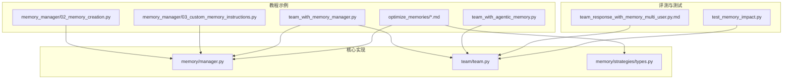
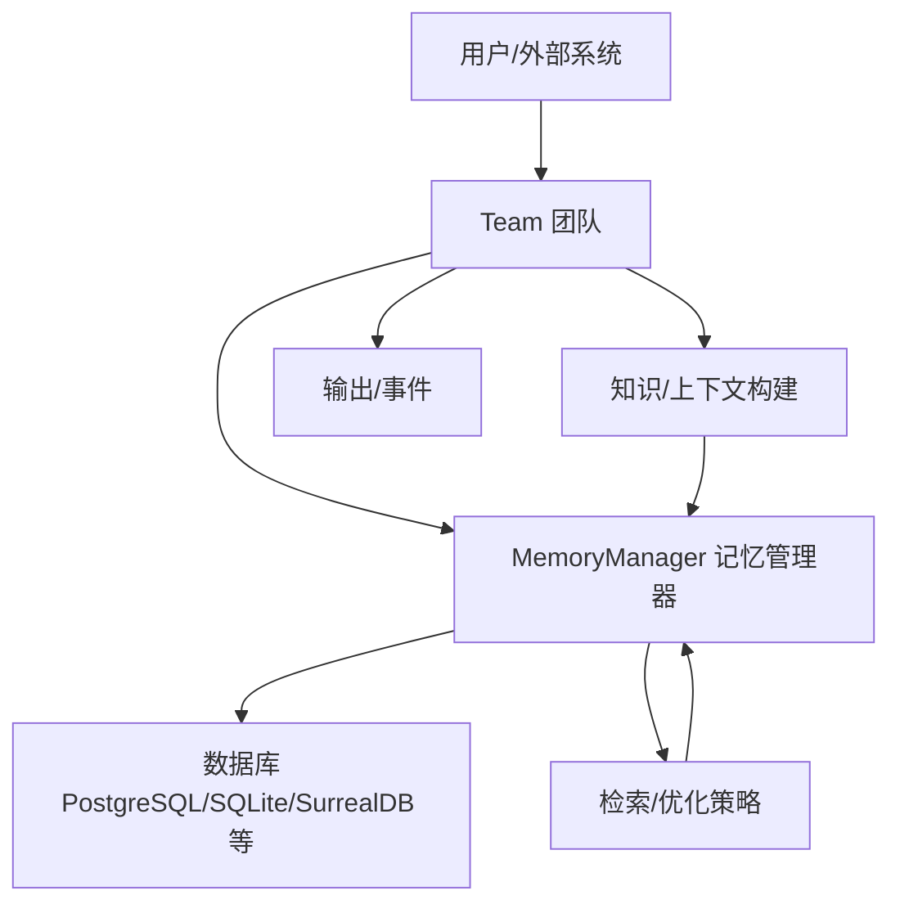
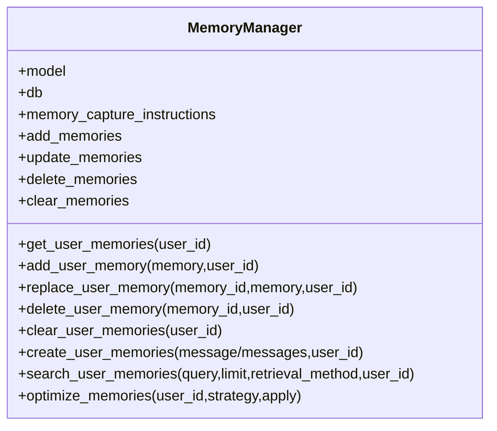
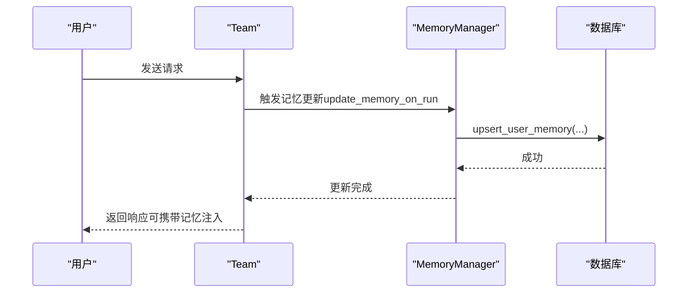
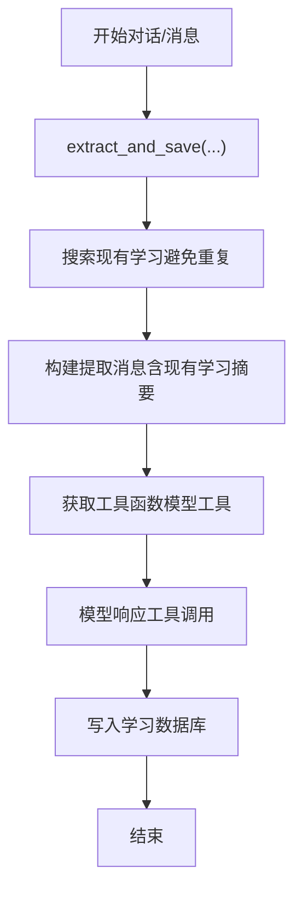
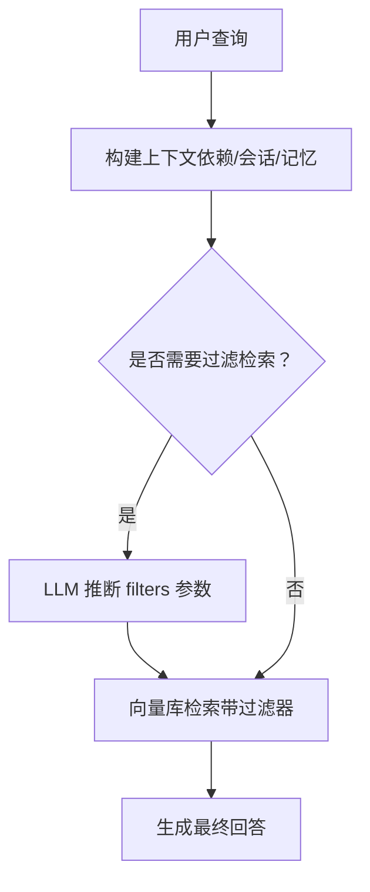
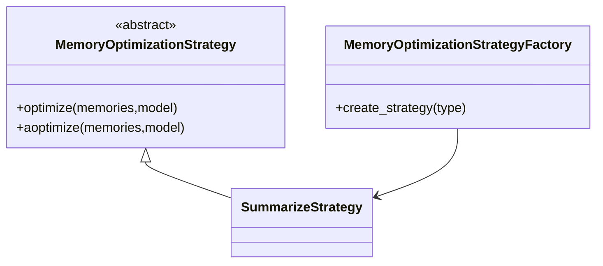
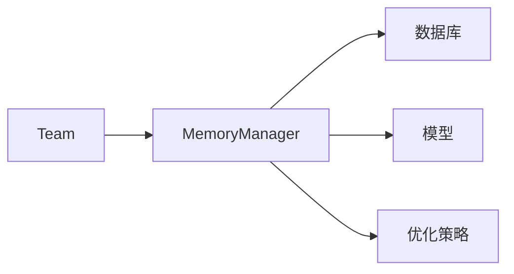

# 团队内存

<cite>
**本文引用的文件**
- [memory_manager/02_memory_creation.py](file://cookbook/11_memory/memory_manager/02_memory_creation.py)
- [memory_manager/03_custom_memory_instructions.py](file://cookbook/11_memory/memory_manager/03_custom_memory_instructions.py)
- [team_with_memory_manager.py](file://cookbook/03_teams/06_memory/01_team_with_memory_manager.py)
- [team_with_agentic_memory.py](file://cookbook/03_teams/06_memory/02_team_with_agentic_memory.py)
- [optimize_memories/01_memory_summarize_strategy.md](file://cookbook/11_memory/optimize_memories/01_memory_summarize_strategy.md)
- [optimize_memories/02_custom_memory_strategy.md](file://cookbook/11_memory/optimize_memories/02_custom_memory_strategy.md)
- [manager.py](file://libs/agno/agno/memory/manager.py)
- [team.py](file://libs/agno/agno/team/team.py)
- [types.py](file://libs/agno/agno/memory/strategies/types.py)
- [test_memory_impact.py](file://libs/agno/tests/integration/teams/test_memory_impact.py)
- [team_response_with_memory_multi_user.py.md](file://cookbook/09_evals/performance/team_response_with_memory_multi_user.py.md)
- [learned_knowledge.py](file://libs/agno/agno/learn/stores/learned_knowledge.py)
- [dependencies_in_context.md](file://cookbook/02_agents/15_dependencies/dependencies_in_context.md)
- [agentic_filtering.md](file://cookbook/07_knowledge/filters/agentic_filtering.md)
- [async_agentic_filtering.md](file://cookbook/07_knowledge/filters/async_agentic_filtering.md)
- [memory_manager/README.md](file://cookbook/11_memory/memory_manager/README.md)
</cite>

## 目录
1. [简介](#简介)
2. [项目结构](#项目结构)
3. [核心组件](#核心组件)
4. [架构总览](#架构总览)
5. [详细组件分析](#详细组件分析)
6. [依赖分析](#依赖分析)
7. [性能考虑](#性能考虑)
8. [故障排查指南](#故障排查指南)
9. [结论](#结论)
10. [附录](#附录)

## 简介
本文件系统性阐述团队内存的设计与实现，覆盖以下主题：
- 团队内存共享机制与同步策略
- 冲突解决与一致性保障
- 团队记忆管理器的使用（创建、更新、删除）
- 智能记忆功能（自动学习模式的记忆提取与知识总结）
- 记忆在上下文中的应用（注入、过滤、优化）
- 多代理协作效率影响与优化策略
- 性能优化、存储管理与故障恢复

## 项目结构
围绕“团队内存”的相关示例与实现主要分布在以下位置：
- 教程示例：cookbook/11_memory 与 cookbook/03_teams/06_memory
- 核心实现：libs/agno/agno/memory 与 libs/agno/agno/team
- 性能评测：cookbook/09_evals/performance 与 tests/integration/teams

**图表来源**
- [memory_manager/02_memory_creation.py:1-64](file://cookbook/11_memory/memory_manager/02_memory_creation.py#L1-L64)
- [memory_manager/03_custom_memory_instructions.py:1-92](file://cookbook/11_memory/memory_manager/03_custom_memory_instructions.py#L1-L92)
- [team_with_memory_manager.py:1-67](file://cookbook/03_teams/06_memory/01_team_with_memory_manager.py#L1-L67)
- [team_with_agentic_memory.py:1-48](file://cookbook/03_teams/06_memory/02_team_with_agentic_memory.py#L1-L48)
- [optimize_memories/01_memory_summarize_strategy.md:42-169](file://cookbook/11_memory/optimize_memories/01_memory_summarize_strategy.md#L42-L169)
- [optimize_memories/02_custom_memory_strategy.md:1-128](file://cookbook/11_memory/optimize_memories/02_custom_memory_strategy.md#L1-L128)
- [manager.py:44-1563](file://libs/agno/agno/memory/manager.py#L44-L1563)
- [team.py:71-1679](file://libs/agno/agno/team/team.py#L71-L1679)
- [types.py:1-37](file://libs/agno/agno/memory/strategies/types.py#L1-L37)
- [team_response_with_memory_multi_user.py.md:48-85](file://cookbook/09_evals/performance/team_response_with_memory_multi_user.py.md#L48-L85)
- [test_memory_impact.py:295-329](file://libs/agno/tests/integration/teams/test_memory_impact.py#L295-L329)

**章节来源**
- [memory_manager/README.md:1-14](file://cookbook/11_memory/memory_manager/README.md#L1-L14)

## 核心组件
- 团队记忆管理器（MemoryManager）
  - 负责用户记忆的增删改查、检索、优化与持久化
  - 支持同步/异步接口，适配不同数据库
- 团队（Team）
  - 支持启用“智能记忆”（agentic memory）、在运行结束时更新记忆
  - 支持将记忆注入上下文、历史注入、会话状态注入等
- 记忆优化策略（MemoryOptimizationStrategy）
  - 内置“摘要压缩”策略
  - 支持自定义策略（如“仅保留最近 N 条”）

**章节来源**
- [manager.py:44-1563](file://libs/agno/agno/memory/manager.py#L44-L1563)
- [team.py:71-1679](file://libs/agno/agno/team/team.py#L71-L1679)
- [types.py:1-37](file://libs/agno/agno/memory/strategies/types.py#L1-L37)

## 架构总览
团队内存的整体工作流如下：
- 记忆来源：用户输入、对话历史、学习机提取
- 记忆管理：MemoryManager 负责创建、更新、删除、检索与优化
- 记忆注入：Team 在系统消息或用户消息中注入记忆与上下文
- 记忆优化：定期或按需执行优化策略，降低 token 占用
- 存储与一致性：统一通过数据库持久化，确保跨会话与多用户一致

**图表来源**
- [team_with_memory_manager.py:39-45](file://cookbook/03_teams/06_memory/01_team_with_memory_manager.py#L39-L45)
- [manager.py:44-1563](file://libs/agno/agno/memory/manager.py#L44-L1563)
- [team.py:71-1679](file://libs/agno/agno/team/team.py#L71-L1679)

## 详细组件分析

### 团队记忆管理器（MemoryManager）
- 职责边界
  - 用户记忆 CRUD：add_user_memory、replace_user_memory、delete_user_memory、clear_user_memories
  - 记忆检索：get_user_memories、get_user_memory、search_user_memories
  - 记忆创建：create_user_memories（基于消息列表自动提取）
  - 记忆优化：optimize_memories（内置摘要策略，支持自定义策略）
- 同步/异步接口
  - 同步：create_user_memories、update_memory_task、optimize_memories
  - 异步：acreate_user_memories、aupdate_memory_task、aoptimize_memories
- 记忆检索策略
  - last_n：最近 N 条
  - first_n：最早 N 条
  - agentic：基于模型检索相似记忆 ID 列表
- 配置要点
  - model：用于记忆提取与优化的模型
  - db：持久化存储
  - memory_capture_instructions：自定义记忆捕获指令
  - add_memories、update_memories、delete_memories、clear_memories：控制 CRUD 行为

**图表来源**
- [manager.py:44-1563](file://libs/agno/agno/memory/manager.py#L44-L1563)

**章节来源**
- [manager.py:165-866](file://libs/agno/agno/memory/manager.py#L165-L866)
- [memory_manager/02_memory_creation.py:24-63](file://cookbook/11_memory/memory_manager/02_memory_creation.py#L24-L63)
- [memory_manager/03_custom_memory_instructions.py:25-91](file://cookbook/11_memory/memory_manager/03_custom_memory_instructions.py#L25-L91)

### 团队（Team）与记忆集成
- 智能记忆开关
  - enable_agentic_memory：启用团队级 agentic memory
  - update_memory_on_run：在每次运行结束后自动更新记忆
- 记忆注入上下文
  - add_memories_to_context：将记忆加入用户消息
  - add_history_to_context：将历史消息注入上下文
  - add_session_state_to_context：将会话状态注入上下文
- 与记忆管理器协作
  - memory_manager：共享 MemoryManager 实例，实现团队级记忆持久化
  - run 期间触发记忆更新事件（MemoryUpdateStartedEvent/MemoryUpdateCompletedEvent）

**图表来源**
- [team_with_memory_manager.py:39-66](file://cookbook/03_teams/06_memory/01_team_with_memory_manager.py#L39-L66)
- [team.py:284-301](file://libs/agno/agno/team/team.py#L284-L301)
- [manager.py:561-585](file://libs/agno/agno/memory/manager.py#L561-L585)

**章节来源**
- [team_with_memory_manager.py:26-66](file://cookbook/03_teams/06_memory/01_team_with_memory_manager.py#L26-L66)
- [team_with_agentic_memory.py:30-47](file://cookbook/03_teams/06_memory/02_team_with_agentic_memory.py#L30-L47)
- [team.py:284-301](file://libs/agno/agno/team/team.py#L284-L301)

### 智能记忆与学习机集成
- 自动学习模式
  - LearnedKnowledgeStore 支持从对话中提取“已学到的知识”，避免重复保存
  - 异步/同步提取接口：aextract_and_save / extract_and_save
  - 通过工具调用（tools）将学习结果写入存储
- 记忆与学习的协同
  - 记忆管理器负责用户层面的记忆
  - 学习机负责组织与总结“已学到的知识”，可注入上下文供团队使用

**图表来源**
- [learned_knowledge.py:1084-1184](file://libs/agno/agno/learn/stores/learned_knowledge.py#L1084-L1184)

**章节来源**
- [learned_knowledge.py:1084-1184](file://libs/agno/agno/learn/stores/learned_knowledge.py#L1084-L1184)

### 记忆在上下文中的应用（注入、过滤、优化）
- 注入上下文
  - 依赖注入：add_dependencies_to_context 将依赖函数结果附加到用户消息
  - 会话状态注入：add_session_state_to_context 将 session_state 注入上下文
  - 记忆注入：add_memories_to_context 将用户记忆注入到系统/用户消息
- 过滤与检索
  - agentic filtering：LLM 推断过滤器参数，向向量库执行带过滤器的检索
  - 支持同步与异步两种流程
- 上下文优化
  - 使用记忆优化策略（摘要/自定义）减少 token 占用，提升推理效率

**图表来源**
- [dependencies_in_context.md:18-47](file://cookbook/02_agents/15_dependencies/dependencies_in_context.md#L18-L47)
- [agentic_filtering.md:18-41](file://cookbook/07_knowledge/filters/agentic_filtering.md#L18-L41)
- [async_agentic_filtering.md:52-87](file://cookbook/07_knowledge/filters/async_agentic_filtering.md#L52-L87)

**章节来源**
- [dependencies_in_context.md:1-47](file://cookbook/02_agents/15_dependencies/dependencies_in_context.md#L1-L47)
- [agentic_filtering.md:18-41](file://cookbook/07_knowledge/filters/agentic_filtering.md#L18-L41)
- [async_agentic_filtering.md:52-87](file://cookbook/07_knowledge/filters/async_agentic_filtering.md#L52-L87)

### 记忆优化策略（摘要与自定义）
- 内置策略：SummarizeStrategy（将多条记忆汇总为一条）
- 自定义策略：RecentOnlyStrategy（仅保留最近 N 条，无需 LLM）
- 调用入口：optimize_memories（支持同步/异步，可选择是否写回数据库）

**图表来源**
- [types.py:1-37](file://libs/agno/agno/memory/strategies/types.py#L1-L37)
- [optimize_memories/01_memory_summarize_strategy.md:42-169](file://cookbook/11_memory/optimize_memories/01_memory_summarize_strategy.md#L42-L169)
- [optimize_memories/02_custom_memory_strategy.md:42-83](file://cookbook/11_memory/optimize_memories/02_custom_memory_strategy.md#L42-L83)

**章节来源**
- [optimize_memories/01_memory_summarize_strategy.md:42-169](file://cookbook/11_memory/optimize_memories/01_memory_summarize_strategy.md#L42-L169)
- [optimize_memories/02_custom_memory_strategy.md:1-128](file://cookbook/11_memory/optimize_memories/02_custom_memory_strategy.md#L1-L128)
- [types.py:1-37](file://libs/agno/agno/memory/strategies/types.py#L1-L37)

## 依赖分析
- 组件耦合
  - Team 依赖 MemoryManager 与数据库（db），用于持久化与检索
  - MemoryManager 依赖模型（model）与数据库（db），用于记忆提取与存储
  - 记忆优化策略通过工厂创建，支持扩展
- 外部依赖
  - 数据库：PostgreSQL、SQLite、SurrealDB 等
  - 模型：OpenAI、Claude 等（通过统一 Model 接口）
- 潜在循环依赖
  - 当前模块间通过接口解耦，未见明显循环依赖

**图表来源**
- [team.py:71-1679](file://libs/agno/agno/team/team.py#L71-L1679)
- [manager.py:44-1563](file://libs/agno/agno/memory/manager.py#L44-L1563)
- [types.py:1-37](file://libs/agno/agno/memory/strategies/types.py#L1-L37)

**章节来源**
- [team.py:71-1679](file://libs/agno/agno/team/team.py#L71-L1679)
- [manager.py:44-1563](file://libs/agno/agno/memory/manager.py#L44-L1563)
- [types.py:1-37](file://libs/agno/agno/memory/strategies/types.py#L1-L37)

## 性能考虑
- 内存增长与多用户并发
  - 评测脚本展示了多用户并发场景下的内存快照对比与增长追踪
  - 建议：定期清理旧会话、限制历史注入数量、启用记忆优化
- 记忆检索成本
  - agentic 检索需要模型参与，建议在高并发场景下缓存检索结果或限制检索范围
- 存储与 IO
  - 使用异步数据库接口（AsyncBaseDb）可提升吞吐
  - 批量删除/插入优于逐条操作
- 优化建议
  - 合理设置 retrieval_method（last_n/first_n/agentic）
  - 使用自定义策略（如 RecentOnlyStrategy）降低 token 占用
  - 在团队级别启用 update_memory_on_run，避免重复提取

**章节来源**
- [team_response_with_memory_multi_user.py.md:48-85](file://cookbook/09_evals/performance/team_response_with_memory_multi_user.py.md#L48-L85)
- [test_memory_impact.py:295-329](file://libs/agno/tests/integration/teams/test_memory_impact.py#L295-L329)

## 故障排查指南
- 记忆未持久化
  - 检查 db 是否正确初始化；MemoryManager 在无 db 时会给出警告
- 异步/同步接口混用
  - 使用异步数据库时，需调用 acreate_user_memories / aupdate_memory_task 等异步接口
- 记忆检索为空
  - 确认 retrieval_method 与 limit 设置；检查是否存在匹配的记忆
- 内存泄漏或增长异常
  - 使用评测脚本进行快照对比，定位增长点；确保及时清理旧会话与历史
- 优化失败
  - 检查策略工厂与自定义策略实现；确认 apply 参数与数据库权限

**章节来源**
- [manager.py:384-517](file://libs/agno/agno/memory/manager.py#L384-L517)
- [team_response_with_memory_multi_user.py.md:48-85](file://cookbook/09_evals/performance/team_response_with_memory_multi_user.py.md#L48-L85)
- [test_memory_impact.py:295-329](file://libs/agno/tests/integration/teams/test_memory_impact.py#L295-L329)

## 结论
团队内存通过 MemoryManager 与 Team 的协同，实现了：
- 跨会话、多用户的记忆共享与一致性
- 智能记忆提取与学习机知识总结
- 上下文注入、过滤与优化，显著提升多代理协作效率
- 可扩展的优化策略与异步存储，满足高并发与低延迟需求
建议在生产环境中结合性能评测与优化策略，持续监控内存与存储表现。

## 附录
- 示例与参考路径
  - 团队记忆管理器配置与使用：[memory_manager/02_memory_creation.py:24-63](file://cookbook/11_memory/memory_manager/02_memory_creation.py#L24-L63)
  - 自定义记忆捕获指令：[memory_manager/03_custom_memory_instructions.py:25-91](file://cookbook/11_memory/memory_manager/03_custom_memory_instructions.py#L25-L91)
  - 团队与记忆管理器集成：[team_with_memory_manager.py:39-66](file://cookbook/03_teams/06_memory/01_team_with_memory_manager.py#L39-L66)
  - 团队智能记忆：[team_with_agentic_memory.py:30-47](file://cookbook/03_teams/06_memory/02_team_with_agentic_memory.py#L30-L47)
  - 记忆优化（摘要策略）：[optimize_memories/01_memory_summarize_strategy.md:42-169](file://cookbook/11_memory/optimize_memories/01_memory_summarize_strategy.md#L42-L169)
  - 记忆优化（自定义策略）：[optimize_memories/02_custom_memory_strategy.md:42-83](file://cookbook/11_memory/optimize_memories/02_custom_memory_strategy.md#L42-L83)
  - 核心实现（MemoryManager）：[manager.py:44-1563](file://libs/agno/agno/memory/manager.py#L44-L1563)
  - 核心实现（Team）：[team.py:71-1679](file://libs/agno/agno/team/team.py#L71-L1679)
  - 优化策略工厂：[types.py:1-37](file://libs/agno/agno/memory/strategies/types.py#L1-L37)
  - 性能评测（多用户并发）：[team_response_with_memory_multi_user.py.md:48-85](file://cookbook/09_evals/performance/team_response_with_memory_multi_user.py.md#L48-L85)
  - 内存影响测试：[test_memory_impact.py:295-329](file://libs/agno/tests/integration/teams/test_memory_impact.py#L295-L329)
  - 学习机提取：[learned_knowledge.py:1084-1184](file://libs/agno/agno/learn/stores/learned_knowledge.py#L1084-L1184)
  - 上下文注入（依赖）：[dependencies_in_context.md:18-47](file://cookbook/02_agents/15_dependencies/dependencies_in_context.md#L18-L47)
  - 上下文过滤（agentic）：[agentic_filtering.md:18-41](file://cookbook/07_knowledge/filters/agentic_filtering.md#L18-L41)、[async_agentic_filtering.md:52-87](file://cookbook/07_knowledge/filters/async_agentic_filtering.md#L52-L87)