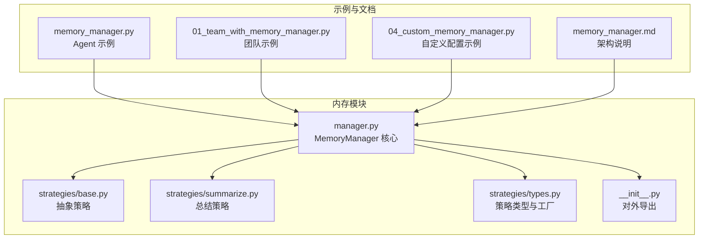
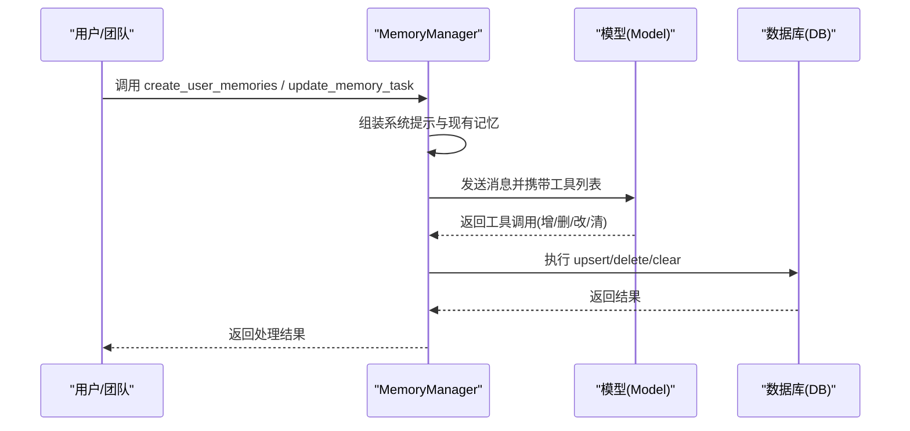
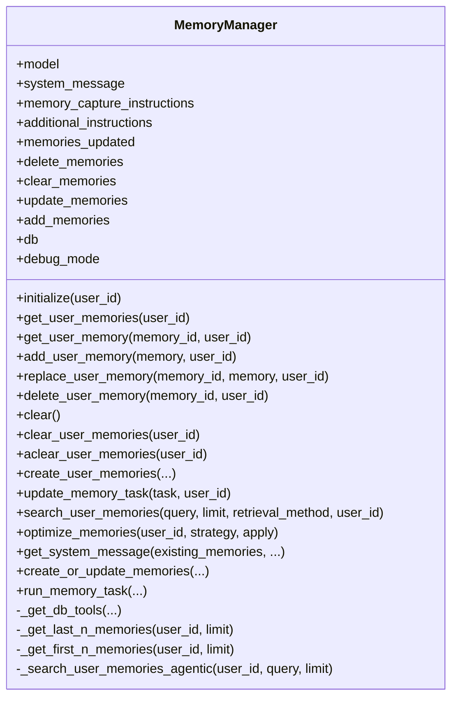
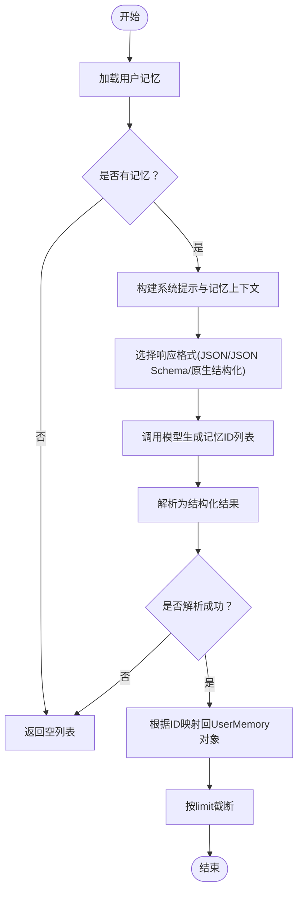
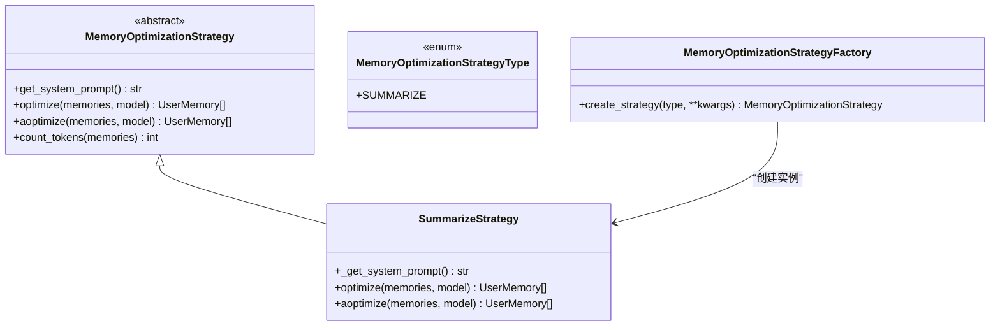
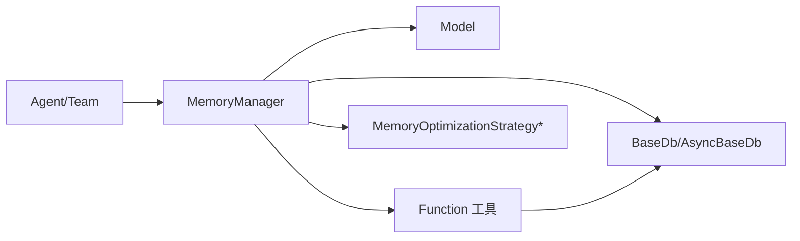

# 团队内存管理器

<cite>
**本文引用的文件**
- [libs/agno/agno/memory/manager.py](file://libs/agno/agno/memory/manager.py)
- [libs/agno/agno/memory/__init__.py](file://libs/agno/agno/memory/__init__.py)
- [libs/agno/agno/memory/strategies/base.py](file://libs/agno/agno/memory/strategies/base.py)
- [libs/agno/agno/memory/strategies/summarize.py](file://libs/agno/agno/memory/strategies/summarize.py)
- [libs/agno/agno/memory/strategies/types.py](file://libs/agno/agno/memory/strategies/types.py)
- [cookbook/02_agents/06_memory_and_learning/memory_manager.py](file://cookbook/02_agents/06_memory_and_learning/memory_manager.py)
- [cookbook/03_teams/06_memory/01_team_with_memory_manager.py](file://cookbook/03_teams/06_memory/01_team_with_memory_manager.py)
- [cookbook/11_memory/04_custom_memory_manager.py](file://cookbook/11_memory/04_custom_memory_manager.py)
- [cookbook/02_agents/06_memory_and_learning/memory_manager.md](file://cookbook/02_agents/06_memory_and_learning/memory_manager.md)
</cite>

## 目录
1. [简介](#简介)
2. [项目结构](#项目结构)
3. [核心组件](#核心组件)
4. [架构总览](#架构总览)
5. [详细组件分析](#详细组件分析)
6. [依赖关系分析](#依赖关系分析)
7. [性能考量](#性能考量)
8. [故障排查指南](#故障排查指南)
9. [结论](#结论)
10. [附录](#附录)

## 简介
本文件系统性地介绍团队内存管理器的设计与实现，涵盖其核心功能、API 接口、配置选项、数据与控制流、与工具系统/知识库/会话状态的集成方式，并提供最佳实践与性能优化建议。内存管理器通过统一的 MemoryManager 类对外提供增删改查、检索、批量优化等能力，支持同步与异步数据库后端，具备可扩展的记忆优化策略体系。

## 项目结构
围绕“内存管理器”的相关代码主要分布在以下位置：
- 核心实现：libs/agno/agno/memory/manager.py
- 策略体系：libs/agno/agno/memory/strategies/*
- 对外导出：libs/agno/agno/memory/__init__.py
- 使用示例：cookbook/02_agents/06_memory_and_learning/memory_manager.py
- 团队示例：cookbook/03_teams/06_memory/01_team_with_memory_manager.py
- 自定义配置示例：cookbook/11_memory/04_custom_memory_manager.py
- 架构说明：cookbook/02_agents/06_memory_and_learning/memory_manager.md

**图表来源**
- [libs/agno/agno/memory/manager.py:1-1564](file://libs/agno/agno/memory/manager.py#L1-L1564)
- [libs/agno/agno/memory/strategies/base.py:1-67](file://libs/agno/agno/memory/strategies/base.py#L1-L67)
- [libs/agno/agno/memory/strategies/summarize.py:1-197](file://libs/agno/agno/memory/strategies/summarize.py#L1-L197)
- [libs/agno/agno/memory/strategies/types.py:1-38](file://libs/agno/agno/memory/strategies/types.py#L1-L38)
- [libs/agno/agno/memory/__init__.py:1-17](file://libs/agno/agno/memory/__init__.py#L1-L17)
- [cookbook/02_agents/06_memory_and_learning/memory_manager.py:1-48](file://cookbook/02_agents/06_memory_and_learning/memory_manager.py#L1-L48)
- [cookbook/03_teams/06_memory/01_team_with_memory_manager.py:1-67](file://cookbook/03_teams/06_memory/01_team_with_memory_manager.py#L1-L67)
- [cookbook/11_memory/04_custom_memory_manager.py:1-58](file://cookbook/11_memory/04_custom_memory_manager.py#L1-L58)
- [cookbook/02_agents/06_memory_and_learning/memory_manager.md:1-120](file://cookbook/02_agents/06_memory_and_learning/memory_manager.md#L1-L120)

**章节来源**
- [libs/agno/agno/memory/manager.py:1-1564](file://libs/agno/agno/memory/manager.py#L1-L1564)
- [libs/agno/agno/memory/__init__.py:1-17](file://libs/agno/agno/memory/__init__.py#L1-L17)
- [cookbook/02_agents/06_memory_and_learning/memory_manager.py:1-48](file://cookbook/02_agents/06_memory_and_learning/memory_manager.py#L1-L48)
- [cookbook/03_teams/06_memory/01_team_with_memory_manager.py:1-67](file://cookbook/03_teams/06_memory/01_team_with_memory_manager.py#L1-L67)
- [cookbook/11_memory/04_custom_memory_manager.py:1-58](file://cookbook/11_memory/04_custom_memory_manager.py#L1-L58)
- [cookbook/02_agents/06_memory_and_learning/memory_manager.md:1-120](file://cookbook/02_agents/06_memory_and_learning/memory_manager.md#L1-L120)

## 核心组件
- MemoryManager：统一的内存管理入口，负责 CRUD、检索、任务执行、优化等。
- 策略体系：抽象策略基类与具体策略（如总结策略），支持同步/异步优化。
- 数据模型：UserMemory（来自数据库模式），作为内存条目的载体。
- 工具函数：基于模型的函数工具集，将 DB 操作暴露为可被模型调用的工具。

关键职责与特性
- 同步/异步数据库适配：支持 BaseDb 与 AsyncBaseDb。
- 记忆检索：支持按最近/最早/智能检索（agentic）三种模式。
- 记忆优化：提供策略工厂与总结策略，支持一键压缩与替换。
- 任务执行：将用户输入或任务转化为对 DB 的增删改清操作。

**章节来源**
- [libs/agno/agno/memory/manager.py:44-115](file://libs/agno/agno/memory/manager.py#L44-L115)
- [libs/agno/agno/memory/strategies/base.py:9-67](file://libs/agno/agno/memory/strategies/base.py#L9-L67)
- [libs/agno/agno/memory/strategies/summarize.py:15-197](file://libs/agno/agno/memory/strategies/summarize.py#L15-L197)
- [libs/agno/agno/memory/strategies/types.py:8-38](file://libs/agno/agno/memory/strategies/types.py#L8-L38)

## 架构总览
内存管理器通过“系统提示 + 函数工具 + 模型推理”的方式，将自然语言指令转换为对数据库的结构化操作。其核心流程如下：

**图表来源**
- [libs/agno/agno/memory/manager.py:1040-1107](file://libs/agno/agno/memory/manager.py#L1040-L1107)
- [libs/agno/agno/memory/manager.py:1193-1247](file://libs/agno/agno/memory/manager.py#L1193-L1247)
- [libs/agno/agno/memory/manager.py:1319-1426](file://libs/agno/agno/memory/manager.py#L1319-L1426)

## 详细组件分析

### MemoryManager 类与 API
- 初始化参数
  - model：用于记忆管理的模型实例或标识
  - system_message / memory_capture_instructions / additional_instructions：系统提示与附加指令
  - db：数据库实例（同步/异步）
  - CRUD 开关：delete_memories / clear_memories / update_memories / add_memories
  - debug_mode：调试日志开关
- 基础查询
  - get_user_memories(user_id)
  - get_user_memory(memory_id, user_id)
  - read_from_db(user_id) / aread_from_db(user_id)
- 增删改
  - add_user_memory(memory, user_id)
  - replace_user_memory(memory_id, memory, user_id)
  - delete_user_memory(memory_id, user_id)
  - clear() / clear_user_memories(user_id) / aclear_user_memories(user_id)
- 记忆创建与任务执行
  - create_user_memories(message/messages, user_id, ...)：从对话消息提取/更新记忆
  - update_memory_task(task, user_id)：以任务形式直接操作记忆
  - acreate_user_memories / aupdate_memory_task：异步版本
- 检索
  - search_user_memories(query, limit, retrieval_method, user_id)
  - _get_last_n_memories / _get_first_n_memories：按时间顺序返回
  - _search_user_memories_agentic：基于模型的语义检索
- 优化
  - optimize_memories / aoptimize_memories：调用策略工厂进行优化
- 工具
  - _get_db_tools / _aget_db_tools：生成 add/update/delete/clear 工具
  - get_system_message：构建系统提示

**图表来源**
- [libs/agno/agno/memory/manager.py:44-115](file://libs/agno/agno/memory/manager.py#L44-L115)
- [libs/agno/agno/memory/manager.py:165-558](file://libs/agno/agno/memory/manager.py#L165-L558)
- [libs/agno/agno/memory/manager.py:588-791](file://libs/agno/agno/memory/manager.py#L588-L791)
- [libs/agno/agno/memory/manager.py:793-935](file://libs/agno/agno/memory/manager.py#L793-L935)
- [libs/agno/agno/memory/manager.py:958-1038](file://libs/agno/agno/memory/manager.py#L958-L1038)
- [libs/agno/agno/memory/manager.py:1040-1316](file://libs/agno/agno/memory/manager.py#L1040-L1316)
- [libs/agno/agno/memory/manager.py:1319-1563](file://libs/agno/agno/memory/manager.py#L1319-L1563)

**章节来源**
- [libs/agno/agno/memory/manager.py:76-115](file://libs/agno/agno/memory/manager.py#L76-L115)
- [libs/agno/agno/memory/manager.py:165-558](file://libs/agno/agno/memory/manager.py#L165-L558)
- [libs/agno/agno/memory/manager.py:588-791](file://libs/agno/agno/memory/manager.py#L588-L791)
- [libs/agno/agno/memory/manager.py:793-935](file://libs/agno/agno/memory/manager.py#L793-L935)
- [libs/agno/agno/memory/manager.py:958-1316](file://libs/agno/agno/memory/manager.py#L958-L1316)

### 检索流程（agentic 模式）

**图表来源**
- [libs/agno/agno/memory/manager.py:656-728](file://libs/agno/agno/memory/manager.py#L656-L728)

**章节来源**
- [libs/agno/agno/memory/manager.py:588-728](file://libs/agno/agno/memory/manager.py#L588-L728)

### 策略体系与优化
- 抽象策略基类：定义 optimize/aoptimize/count_tokens 等接口
- 总结策略：将多条记忆合并为一条综合性摘要，保留 topics/user_id 等元信息
- 策略工厂：根据枚举类型创建具体策略实例

**图表来源**
- [libs/agno/agno/memory/strategies/base.py:9-67](file://libs/agno/agno/memory/strategies/base.py#L9-L67)
- [libs/agno/agno/memory/strategies/summarize.py:15-197](file://libs/agno/agno/memory/strategies/summarize.py#L15-L197)
- [libs/agno/agno/memory/strategies/types.py:8-38](file://libs/agno/agno/memory/strategies/types.py#L8-L38)

**章节来源**
- [libs/agno/agno/memory/strategies/base.py:9-67](file://libs/agno/agno/memory/strategies/base.py#L9-L67)
- [libs/agno/agno/memory/strategies/summarize.py:15-197](file://libs/agno/agno/memory/strategies/summarize.py#L15-L197)
- [libs/agno/agno/memory/strategies/types.py:8-38](file://libs/agno/agno/memory/strategies/types.py#L8-L38)

### 使用示例与最佳实践
- Agent 示例：演示启用代理记忆与 MemoryManager 的基础用法
- 团队示例：在 Team 中共享 MemoryManager 并开启运行时自动更新
- 自定义配置：通过 additional_instructions 控制记忆捕获行为

最佳实践
- 将 MemoryManager 与较小模型配合使用，降低记忆处理成本
- 在团队场景中统一注入 MemoryManager，确保跨成员共享记忆
- 使用检索方法时优先考虑 agentic 检索以提升相关性
- 定期调用 optimize_memories 进行压缩，减少 token 消耗

**章节来源**
- [cookbook/02_agents/06_memory_and_learning/memory_manager.py:1-48](file://cookbook/02_agents/06_memory_and_learning/memory_manager.py#L1-L48)
- [cookbook/03_teams/06_memory/01_team_with_memory_manager.py:1-67](file://cookbook/03_teams/06_memory/01_team_with_memory_manager.py#L1-L67)
- [cookbook/11_memory/04_custom_memory_manager.py:1-58](file://cookbook/11_memory/04_custom_memory_manager.py#L1-L58)
- [cookbook/02_agents/06_memory_and_learning/memory_manager.md:19-100](file://cookbook/02_agents/06_memory_and_learning/memory_manager.md#L19-L100)

## 依赖关系分析
- MemoryManager 依赖
  - 数据库接口：BaseDb / AsyncBaseDb
  - 模型接口：Model（用于记忆任务与检索）
  - 工具系统：Function（将 DB 操作包装为函数工具）
  - 日志与工具：log_*、get_model、get_json_output_prompt、parse_response_model_str
  - 策略体系：MemoryOptimizationStrategy 及工厂
- 外部集成点
  - Agent/Team：通过 enable_agentic_memory 与 update_memory_on_run 驱动记忆更新
  - 工具系统：将 add/update/delete/clear 包装为函数工具供模型调用

**图表来源**
- [libs/agno/agno/memory/manager.py:9-30](file://libs/agno/agno/memory/manager.py#L9-L30)
- [libs/agno/agno/memory/manager.py:1319-1563](file://libs/agno/agno/memory/manager.py#L1319-L1563)
- [libs/agno/agno/memory/strategies/base.py:1-67](file://libs/agno/agno/memory/strategies/base.py#L1-L67)

**章节来源**
- [libs/agno/agno/memory/manager.py:9-30](file://libs/agno/agno/memory/manager.py#L9-L30)
- [libs/agno/agno/memory/manager.py:1319-1563](file://libs/agno/agno/memory/manager.py#L1319-L1563)
- [libs/agno/agno/memory/strategies/base.py:1-67](file://libs/agno/agno/memory/strategies/base.py#L1-L67)

## 性能考量
- 检索效率
  - last_n/first_n：O(n log n) 排序，适合大体量但对顺序敏感的场景
  - agentic：需调用模型进行相似度计算，成本较高，建议在必要时使用
- 优化策略
  - summarize：将多条记忆合并为单条摘要，显著降低 token 使用量
  - apply=true 时会先清空再写入，注意批量写入的事务开销
- 异步支持
  - 提供 acreate_user_memories / aupdate_memory_task / aoptimize_memories 等异步接口，适合高并发场景
- 日志与调试
  - debug_mode 可切换日志级别，便于定位性能瓶颈

[本节为通用指导，不直接分析具体文件]

## 故障排查指南
常见问题与处理
- 未提供数据库实例
  - 现象：返回“请提供数据库”或警告
  - 处理：初始化 MemoryManager 时传入 db；或在调用前检查 db 是否可用
- 异步数据库不支持同步方法
  - 现象：抛出异常提示使用异步方法
  - 处理：使用 acreate_user_memories / aclear_user_memories 等异步接口
- 模型未提供
  - 现象：返回“未提供模型”
  - 处理：在构造 MemoryManager 时提供 model 或安装默认模型依赖
- 检索参数缺失
  - 现象：agentic 检索时报错缺少查询参数
  - 处理：为 agentic 指定 query 参数

**章节来源**
- [libs/agno/agno/memory/manager.py:380-421](file://libs/agno/agno/memory/manager.py#L380-L421)
- [libs/agno/agno/memory/manager.py:484-517](file://libs/agno/agno/memory/manager.py#L484-L517)
- [libs/agno/agno/memory/manager.py:1052-1107](file://libs/agno/agno/memory/manager.py#L1052-L1107)
- [libs/agno/agno/memory/manager.py:628-632](file://libs/agno/agno/memory/manager.py#L628-L632)

## 结论
团队内存管理器通过统一的 MemoryManager 将记忆的创建、检索与优化整合到一个可扩展的框架中，结合策略体系与工具系统，既能满足 Agent 的个性化记忆需求，也能在团队层面实现跨成员的记忆共享与治理。通过合理配置模型与数据库、选择合适的检索与优化策略，可在保证效果的同时显著降低资源消耗。

[本节为总结性内容，不直接分析具体文件]

## 附录

### API 一览（按功能分组）
- 查询
  - get_user_memories(user_id)
  - get_user_memory(memory_id, user_id)
  - search_user_memories(query, limit, retrieval_method, user_id)
- 新增/替换
  - add_user_memory(memory, user_id)
  - replace_user_memory(memory_id, memory, user_id)
- 删除/清空
  - delete_user_memory(memory_id, user_id)
  - clear() / clear_user_memories(user_id) / aclear_user_memories(user_id)
- 创建与任务
  - create_user_memories(message/messages, user_id, ...)
  - update_memory_task(task, user_id)
  - acreate_user_memories / aupdate_memory_task
- 优化
  - optimize_memories(user_id, strategy, apply)
  - aoptimize_memories(user_id, strategy, apply)

**章节来源**
- [libs/agno/agno/memory/manager.py:165-558](file://libs/agno/agno/memory/manager.py#L165-L558)
- [libs/agno/agno/memory/manager.py:793-935](file://libs/agno/agno/memory/manager.py#L793-L935)

### 配置选项参考
- 模型与提示
  - model：记忆处理使用的模型
  - system_message / memory_capture_instructions / additional_instructions：系统提示与附加指令
- CRUD 开关
  - add_memories / update_memories / delete_memories / clear_memories：控制允许的操作
- 数据库
  - db：BaseDb 或 AsyncBaseDb 实例
- 调试
  - debug_mode：开启调试日志

**章节来源**
- [libs/agno/agno/memory/manager.py:76-98](file://libs/agno/agno/memory/manager.py#L76-L98)
- [libs/agno/agno/memory/manager.py:154-160](file://libs/agno/agno/memory/manager.py#L154-L160)

### 与团队组件的集成要点
- Agent 集成
  - enable_agentic_memory=True：启用代理记忆能力
  - memory_manager=MemoryManager(...)：注入统一的记忆管理器
- Team 集成
  - team.memory_manager=MemoryManager(...)：团队级共享
  - update_memory_on_run=True：运行时自动更新记忆
- 工具系统
  - 通过 _get_db_tools 将 DB 操作封装为函数工具，供模型调用
- 知识库与会话状态
  - 可与知识检索/会话历史协同，形成“记忆+知识+上下文”的综合智能体

**章节来源**
- [cookbook/02_agents/06_memory_and_learning/memory_manager.py:18-29](file://cookbook/02_agents/06_memory_and_learning/memory_manager.py#L18-L29)
- [cookbook/03_teams/06_memory/01_team_with_memory_manager.py:39-45](file://cookbook/03_teams/06_memory/01_team_with_memory_manager.py#L39-L45)
- [libs/agno/agno/memory/manager.py:1319-1426](file://libs/agno/agno/memory/manager.py#L1319-L1426)