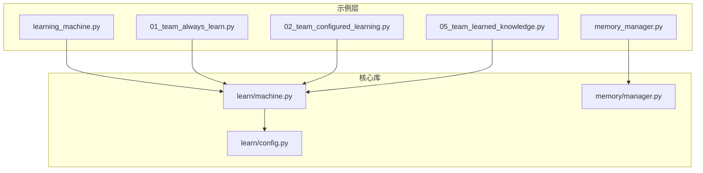
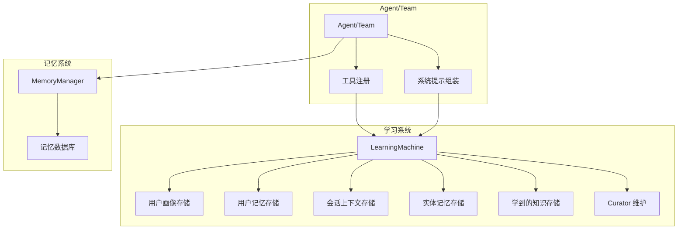
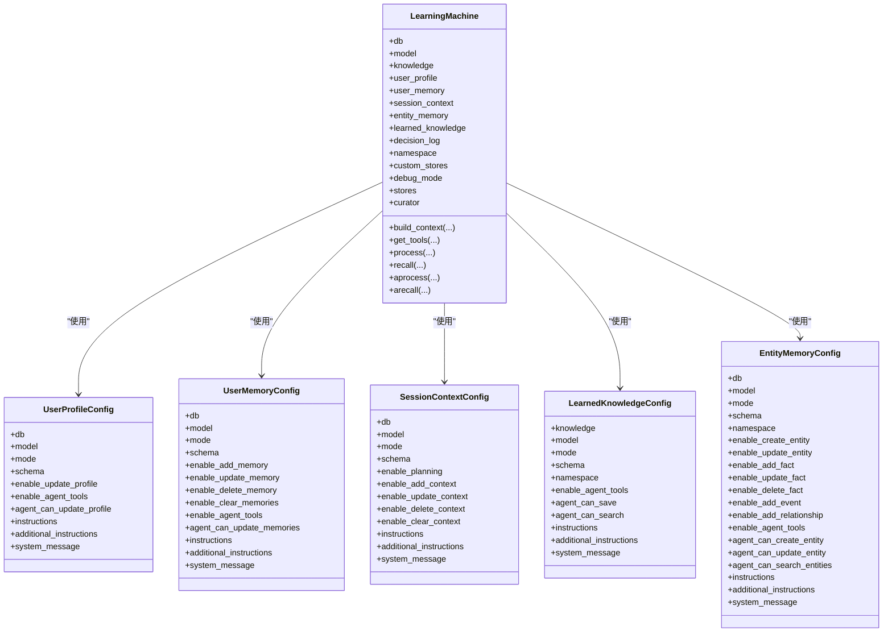
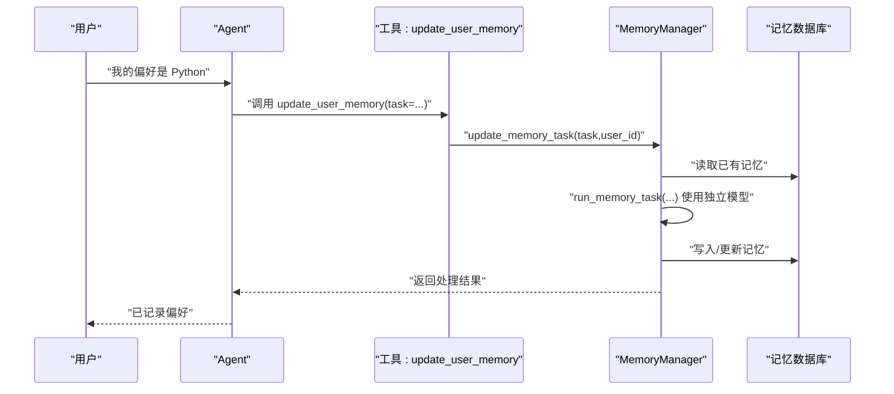
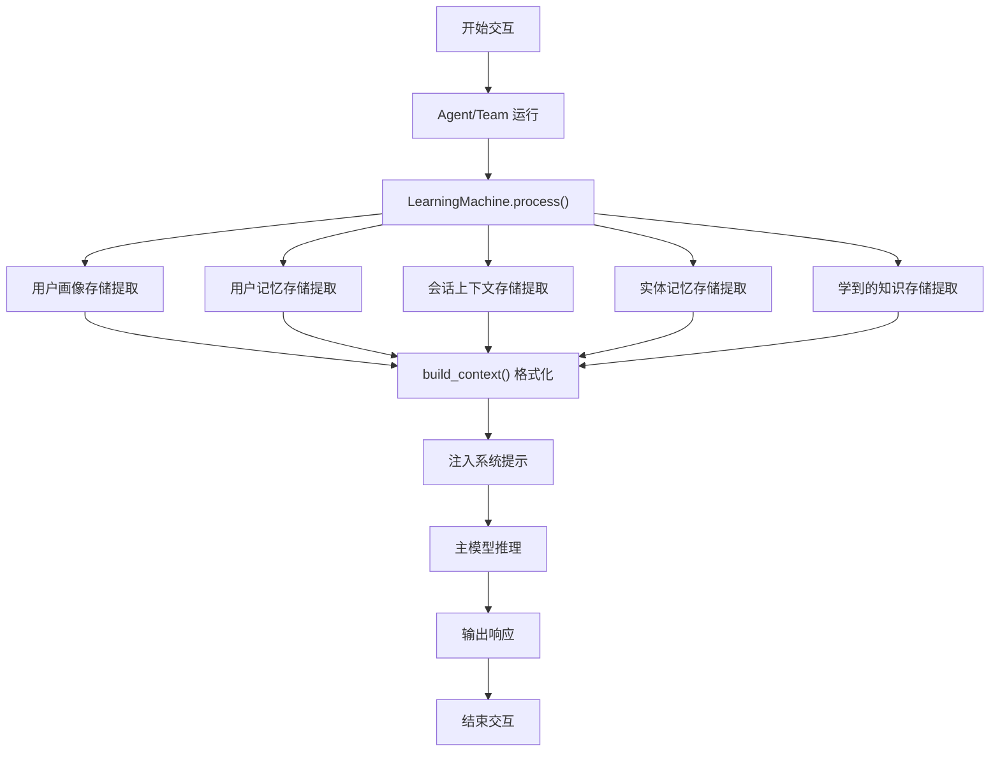
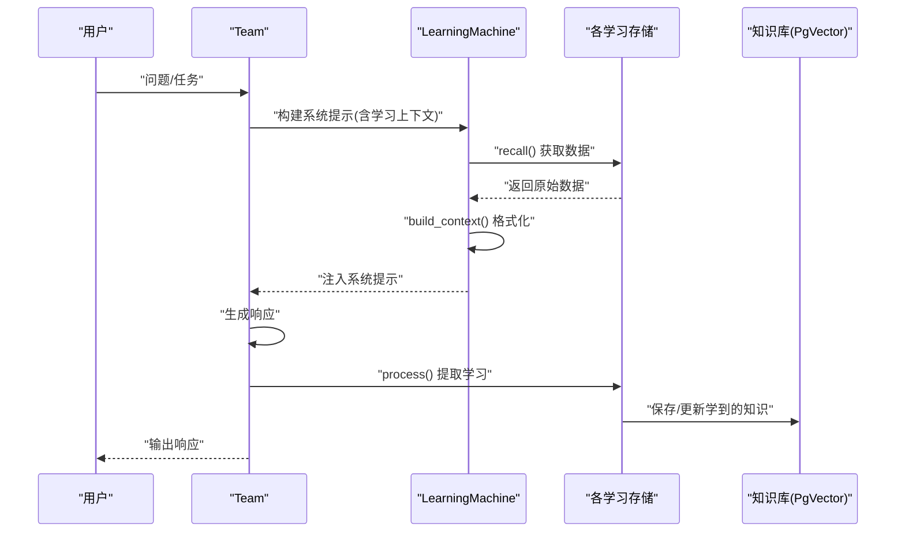
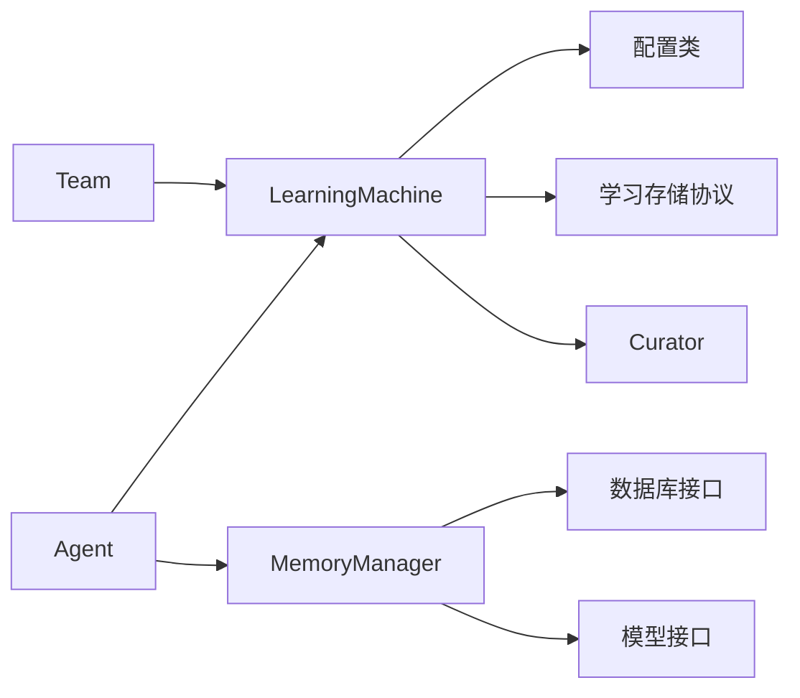

# 学习机器集成

<cite>
**本文档引用的文件**
- [learning_machine.py](file://cookbook/02_agents/06_memory_and_learning/learning_machine.py)
- [memory_manager.py](file://cookbook/02_agents/06_memory_and_learning/memory_manager.py)
- [learning_machine.md](file://cookbook/02_agents/06_memory_and_learning/learning_machine.md)
- [memory_manager.md](file://cookbook/02_agents/06_memory_and_learning/memory_manager.md)
- [machine.py](file://libs/agno/agno/learn/machine.py)
- [config.py](file://libs/agno/agno/learn/config.py)
- [manager.py](file://libs/agno/agno/memory/manager.py)
- [01_team_always_learn.py](file://cookbook/03_teams/12_learning/01_team_always_learn.py)
- [02_team_configured_learning.py](file://cookbook/03_teams/12_learning/02_team_configured_learning.py)
- [05_team_learned_knowledge.py](file://cookbook/03_teams/12_learning/05_team_learned_knowledge.py)
</cite>

## 目录
1. [简介](#简介)
2. [项目结构](#项目结构)
3. [核心组件](#核心组件)
4. [架构总览](#架构总览)
5. [详细组件分析](#详细组件分析)
6. [依赖关系分析](#依赖关系分析)
7. [性能考虑](#性能考虑)
8. [故障排除指南](#故障排除指南)
9. [结论](#结论)
10. [附录](#附录)

## 简介
本文件面向希望在团队智能系统中集成学习机器的开发者与架构师，系统性阐述学习机器与团队内存系统的集成机制与实践路径。内容涵盖：
- 如何利用学习机器增强团队的记忆能力与学习效率
- 学习机器的数据处理流程：从团队交互中提取学习素材、构建训练数据、执行模型训练
- 学习机器的配置与调优：模型参数、训练频率、性能监控
- 团队级学习集成：Always 模式、按存储类型配置、实体记忆与共享知识库
- 维护与故障排除：日志级别、调试模式、常见问题定位

## 项目结构
本项目采用“示例 + 核心库”的组织方式：
- 示例层（cookbook）：提供可直接运行的 Agent 与 Team 学习示例，演示学习机器与记忆管理器的使用
- 核心库层（libs/agno）：提供 LearningMachine、MemoryManager、学习存储协议与配置等基础设施

**图表来源**
- [learning_machine.py:1-50](file://cookbook/02_agents/06_memory_and_learning/learning_machine.py#L1-L50)
- [memory_manager.py:1-48](file://cookbook/02_agents/06_memory_and_learning/memory_manager.py#L1-L48)
- [machine.py:1-772](file://libs/agno/agno/learn/machine.py#L1-L772)
- [config.py:1-464](file://libs/agno/agno/learn/config.py#L1-L464)
- [manager.py:1-800](file://libs/agno/agno/memory/manager.py#L1-L800)
- [01_team_always_learn.py:1-89](file://cookbook/03_teams/12_learning/01_team_always_learn.py#L1-L89)
- [02_team_configured_learning.py:1-109](file://cookbook/03_teams/12_learning/02_team_configured_learning.py#L1-L109)
- [05_team_learned_knowledge.py:1-130](file://cookbook/03_teams/12_learning/05_team_learned_knowledge.py#L1-L130)

**章节来源**
- [learning_machine.py:1-50](file://cookbook/02_agents/06_memory_and_learning/learning_machine.py#L1-L50)
- [memory_manager.py:1-48](file://cookbook/02_agents/06_memory_and_learning/memory_manager.py#L1-L48)
- [machine.py:1-772](file://libs/agno/agno/learn/machine.py#L1-L772)
- [config.py:1-464](file://libs/agno/agno/learn/config.py#L1-L464)
- [manager.py:1-800](file://libs/agno/agno/memory/manager.py#L1-L800)
- [01_team_always_learn.py:1-89](file://cookbook/03_teams/12_learning/01_team_always_learn.py#L1-L89)
- [02_team_configured_learning.py:1-109](file://cookbook/03_teams/12_learning/02_team_configured_learning.py#L1-L109)
- [05_team_learned_knowledge.py:1-130](file://cookbook/03_teams/12_learning/05_team_learned_knowledge.py#L1-L130)

## 核心组件
- LearningMachine（统一学习系统）
  - 统一协调多类学习存储：用户画像、用户记忆、会话上下文、实体记忆、学到的知识、决策日志
  - 支持多种学习模式：ALWAYS（自动）、AGENTIC（模型主动）、PROPOSE（人工审批）、HITL（人类在环）
  - 提供工具注册、上下文构建、学习提取、异步处理、维护（Curator）等能力
- MemoryManager（记忆管理器）
  - 为 Agent 提供“代理式记忆”能力，通过内置工具允许模型在对话中主动增删改查用户记忆
  - 支持独立的小模型进行记忆管理，降低主模型成本
  - 提供检索策略（最近/最早/智能检索）与优化策略
- 学习存储协议与配置
  - UserProfileConfig/UserMemoryConfig/SessionContextConfig/LearnedKnowledgeConfig/EntityMemoryConfig 等配置类
  - LearningMode 枚举控制学习提取方式
- 团队学习集成
  - Team 可整体启用学习（learning=True）或精细化配置 LearningMachine
  - 支持实体记忆与共享知识库（向量数据库）

**章节来源**
- [machine.py:52-772](file://libs/agno/agno/learn/machine.py#L52-L772)
- [config.py:32-464](file://libs/agno/agno/learn/config.py#L32-L464)
- [manager.py:44-800](file://libs/agno/agno/memory/manager.py#L44-L800)
- [learning_machine.md:49-358](file://cookbook/02_agents/06_memory_and_learning/learning_machine.md#L49-L358)
- [memory_manager.md:80-380](file://cookbook/02_agents/06_memory_and_learning/memory_manager.md#L80-L380)

## 架构总览
学习机器与团队内存系统的集成以“Agent/Team 为中心”，通过 LearningMachine 统一调度各类学习存储，并在系统提示中注入学习上下文；MemoryManager 为 Agent 提供“代理式记忆”工具，使模型能在对话中主动更新记忆。

**图表来源**
- [machine.py:52-772](file://libs/agno/agno/learn/machine.py#L52-L772)
- [manager.py:44-800](file://libs/agno/agno/memory/manager.py#L44-L800)
- [learning_machine.md:19-45](file://cookbook/02_agents/06_memory_and_learning/learning_machine.md#L19-L45)
- [memory_manager.md:19-45](file://cookbook/02_agents/06_memory_and_learning/memory_manager.md#L19-L45)

## 详细组件分析

### LearningMachine 组件分析
- 统一学习协调器
  - 懒加载初始化：首次访问 stores 时按配置创建具体存储实例
  - 存储类型解析：根据输入（布尔/配置/存储实例）创建对应存储
  - 工具注册：聚合各存储的工具，暴露给 Agent/Team
  - 上下文构建：recall + build_context 将学习结果格式化注入系统提示
  - 后台学习提取：在运行结束后通过后台线程执行 process，逐个存储提取学习
- 关键接口
  - build_context/get_tools/process/recall/arecall/aprocess 等
  - curator 属性提供维护能力（裁剪、去重等）
- 配置与模式
  - LearningMode 控制提取方式
  - 各存储配置类支持自定义指令、系统提示、Schema 等

**图表来源**
- [machine.py:52-772](file://libs/agno/agno/learn/machine.py#L52-L772)
- [config.py:52-464](file://libs/agno/agno/learn/config.py#L52-L464)

**章节来源**
- [machine.py:104-772](file://libs/agno/agno/learn/machine.py#L104-L772)
- [config.py:32-464](file://libs/agno/agno/learn/config.py#L32-L464)
- [learning_machine.md:49-358](file://cookbook/02_agents/06_memory_and_learning/learning_machine.md#L49-L358)

### MemoryManager 组件分析
- 代理式记忆能力
  - enable_agentic_memory=True 时，自动注册 update_user_memory 工具
  - 工具调用由 MemoryManager.update_memory_task 接收，内部使用独立模型执行记忆任务
  - 支持增删改查与清空，具备 CRUD 开关
- 记忆检索与优化
  - 支持 last_n/first_n/agentic 三种检索策略
  - 提供 optimize_memories 等优化策略
- 系统提示注入
  - 在系统提示中注入已有记忆与工具使用说明，便于模型在后续对话中参考与更新

**图表来源**
- [memory_manager.py:481-517](file://libs/agno/agno/memory/manager.py#L481-L517)
- [memory_manager.md:102-181](file://cookbook/02_agents/06_memory_and_learning/memory_manager.md#L102-L181)

**章节来源**
- [manager.py:44-800](file://libs/agno/agno/memory/manager.py#L44-L800)
- [memory_manager.md:47-380](file://cookbook/02_agents/06_memory_and_learning/memory_manager.md#L47-L380)

### 数据处理流程（Agent/Team 级）
- 从交互中提取学习素材
  - Agent/Team 运行结束，LearningMachine.process 遍历各存储执行提取
  - AGENTIC 模式下，模型通过工具主动调用存储接口
- 构建训练数据
  - recall 返回原始数据，_format_results 格式化为上下文字符串
  - build_context 将学习上下文注入系统提示
- 执行模型训练/推理
  - 主模型基于注入的上下文生成响应
  - MemoryManager 使用独立模型执行记忆任务，降低主模型成本

**图表来源**
- [machine.py:498-656](file://libs/agno/agno/learn/machine.py#L498-L656)
- [learning_machine.md:168-200](file://cookbook/02_agents/06_memory_and_learning/learning_machine.md#L168-L200)

**章节来源**
- [machine.py:350-656](file://libs/agno/agno/learn/machine.py#L350-L656)
- [learning_machine.md:168-200](file://cookbook/02_agents/06_memory_and_learning/learning_machine.md#L168-L200)

### 团队学习集成（Team 级）
- Always 模式
  - Team.learning=True 时，自动启用用户画像与用户记忆的 ALWAYS 模式
  - 并行提取，无需人工干预
- 配置化学习
  - 使用 LearningMachine 精细控制各存储的模式与行为
  - 支持会话上下文、实体记忆、学到的知识等
- 共享知识库
  - 通过 Knowledge + LearnedKnowledgeConfig 构建团队共享知识库
  - 支持保存与搜索 reusable insights

**图表来源**
- [01_team_always_learn.py:41-89](file://cookbook/03_teams/12_learning/01_team_always_learn.py#L41-L89)
- [02_team_configured_learning.py:48-109](file://cookbook/03_teams/12_learning/02_team_configured_learning.py#L48-L109)
- [05_team_learned_knowledge.py:60-130](file://cookbook/03_teams/12_learning/05_team_learned_knowledge.py#L60-L130)

**章节来源**
- [01_team_always_learn.py:1-89](file://cookbook/03_teams/12_learning/01_team_always_learn.py#L1-L89)
- [02_team_configured_learning.py:1-109](file://cookbook/03_teams/12_learning/02_team_configured_learning.py#L1-L109)
- [05_team_learned_knowledge.py:1-130](file://cookbook/03_teams/12_learning/05_team_learned_knowledge.py#L1-L130)

## 依赖关系分析
- 组件耦合
  - LearningMachine 与各学习存储通过协议解耦，支持自定义存储扩展
  - MemoryManager 与数据库通过抽象接口解耦，支持多种存储后端
- 外部依赖
  - 模型接口：OpenAIResponses/OpenAIChat 等
  - 数据库接口：BaseDb/AsyncBaseDb
  - 知识库接口：Knowledge/PgVector
- 潜在循环依赖
  - LearningMachine 与 Curator 通过属性延迟创建避免循环导入

**图表来源**
- [machine.py:19-41](file://libs/agno/agno/learn/machine.py#L19-L41)
- [config.py:18-25](file://libs/agno/agno/learn/config.py#L18-L25)
- [manager.py:9-29](file://libs/agno/agno/memory/manager.py#L9-L29)

**章节来源**
- [machine.py:19-41](file://libs/agno/agno/learn/machine.py#L19-L41)
- [config.py:18-25](file://libs/agno/agno/learn/config.py#L18-L25)
- [manager.py:9-29](file://libs/agno/agno/memory/manager.py#L9-L29)

## 性能考虑
- 模型成本控制
  - MemoryManager 使用更小模型（如 gpt-5-mini）处理记忆任务，主模型（如 gpt-5.2）专注于对话
- 异步与并行
  - LearningMachine.process 支持异步版本 aprocess，适合高并发场景
  - Team 的 Always 模式下学习提取并行执行
- 存储与检索
  - LearnedKnowledge 结合向量数据库（PgVector）实现高效检索
  - MemoryManager 支持 last_n/first_n/agentic 三种检索策略，按需选择
- 日志与调试
  - debug_mode 与 AGNO_DEBUG 环境变量控制日志级别，便于性能分析与问题定位

[本节为通用指导，不直接分析具体文件]

## 故障排除指南
- 学习未生效
  - 检查 LearningMachine 配置是否启用相应存储（user_profile/user_memory/session_context/entity_memory/learned_knowledge）
  - 确认 LearningMode 设置正确（ALWAYS/AGENTIC/PROPOSE/HITL）
- 记忆未更新
  - 确认 enable_agentic_memory=True 且工具已注册
  - 检查 MemoryManager 的 CRUD 开关（add/update/delete/clear）
- 上下文未注入
  - 检查 add_learnings_to_context/add_memories_to_context 是否开启
  - 确认 build_context() 返回非空字符串
- 性能问题
  - 启用 debug_mode 或设置 AGNO_DEBUG=true 查看详细日志
  - 对高并发场景使用异步接口（aprocess/arecall/aupdate_memory_task）
- 知识库检索异常
  - 检查 Knowledge 初始化与向量数据库连接
  - 确认嵌入模型与表结构一致

**章节来源**
- [machine.py:698-705](file://libs/agno/agno/learn/machine.py#L698-L705)
- [manager.py:154-159](file://libs/agno/agno/memory/manager.py#L154-L159)
- [memory_manager.md:193-240](file://cookbook/02_agents/06_memory_and_learning/memory_manager.md#L193-L240)
- [learning_machine.md:201-241](file://cookbook/02_agents/06_memory_and_learning/learning_machine.md#L201-L241)

## 结论
学习机器与团队内存系统的集成提供了从“感知—提取—记忆—应用”的完整闭环：通过 LearningMachine 统一调度多类学习存储并在系统提示中注入上下文，借助 MemoryManager 实现模型主动记忆管理，最终在 Team 级别实现跨会话、跨成员的智能协作。结合合适的配置与调优策略，可在保证成本可控的前提下显著提升团队的预测能力、模式识别与自动化决策水平。

[本节为总结性内容，不直接分析具体文件]

## 附录

### 配置与调优要点
- LearningMode 选择
  - ALWAYS：适合需要自动化的场景，开销较低但可能产生冗余
  - AGENTIC：模型自主决定何时学习，灵活性高
  - PROPOSE/HITL：需要人工审核或在环路中参与
- 存储配置
  - 为每个存储设置合适的指令与系统提示，明确提取边界
  - 控制 CRUD 权限，确保安全性
- 训练频率与监控
  - 使用 debug_mode 与日志级别控制输出
  - 对高并发场景采用异步接口
  - 定期使用 Curator 进行维护（裁剪、去重）

**章节来源**
- [config.py:32-464](file://libs/agno/agno/learn/config.py#L32-L464)
- [machine.py:698-705](file://libs/agno/agno/learn/machine.py#L698-L705)
- [manager.py:154-159](file://libs/agno/agno/memory/manager.py#L154-L159)

### 代码示例路径
- Agent 学习机器基础示例
  - [learning_machine.py:21-49](file://cookbook/02_agents/06_memory_and_learning/learning_machine.py#L21-L49)
- MemoryManager 代理式记忆示例
  - [memory_manager.py:18-47](file://cookbook/02_agents/06_memory_and_learning/memory_manager.py#L18-L47)
- Team Always 模式示例
  - [01_team_always_learn.py:41-89](file://cookbook/03_teams/12_learning/01_team_always_learn.py#L41-L89)
- Team 配置化学习示例
  - [02_team_configured_learning.py:48-109](file://cookbook/03_teams/12_learning/02_team_configured_learning.py#L48-L109)
- Team 共享知识库示例
  - [05_team_learned_knowledge.py:60-130](file://cookbook/03_teams/12_learning/05_team_learned_knowledge.py#L60-L130)

**章节来源**
- [learning_machine.py:21-49](file://cookbook/02_agents/06_memory_and_learning/learning_machine.py#L21-L49)
- [memory_manager.py:18-47](file://cookbook/02_agents/06_memory_and_learning/memory_manager.py#L18-L47)
- [01_team_always_learn.py:41-89](file://cookbook/03_teams/12_learning/01_team_always_learn.py#L41-L89)
- [02_team_configured_learning.py:48-109](file://cookbook/03_teams/12_learning/02_team_configured_learning.py#L48-L109)
- [05_team_learned_knowledge.py:60-130](file://cookbook/03_teams/12_learning/05_team_learned_knowledge.py#L60-L130)