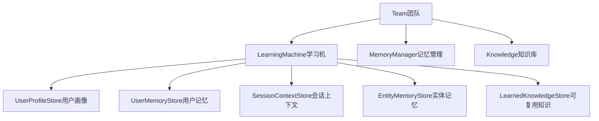
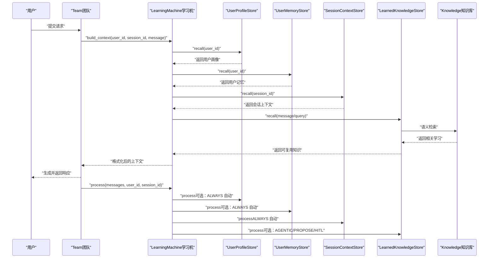
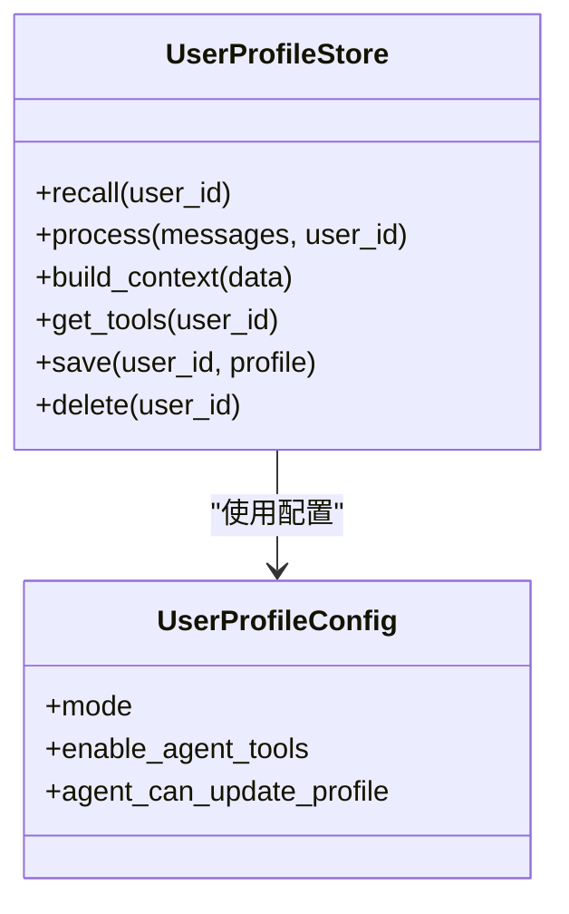
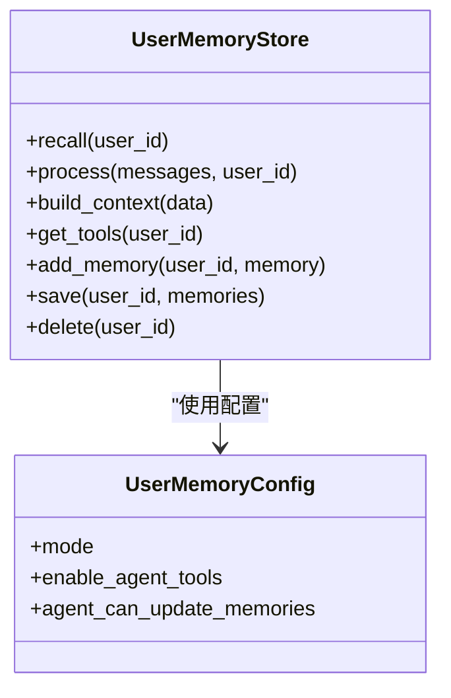
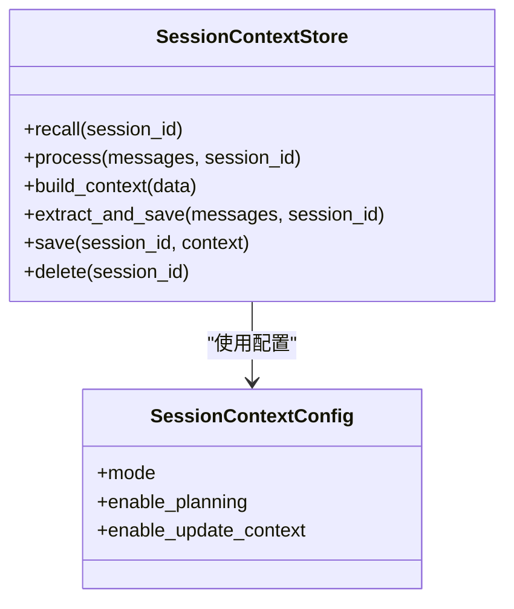
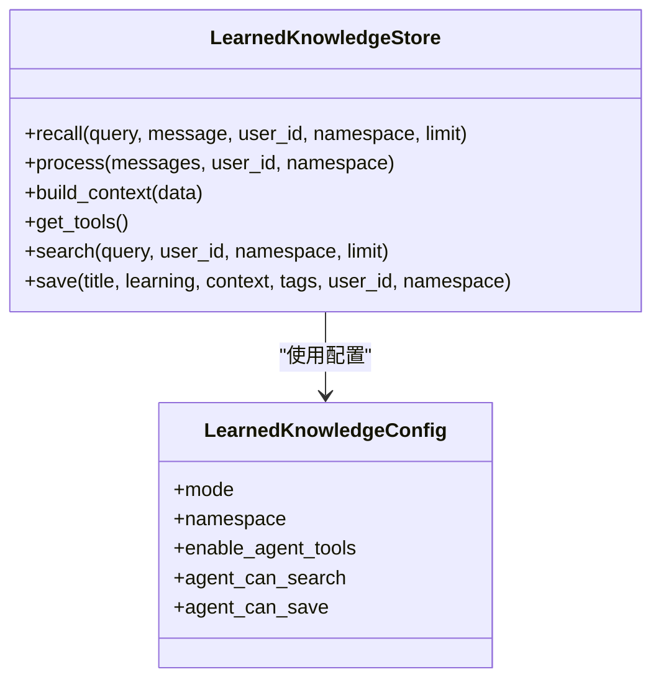
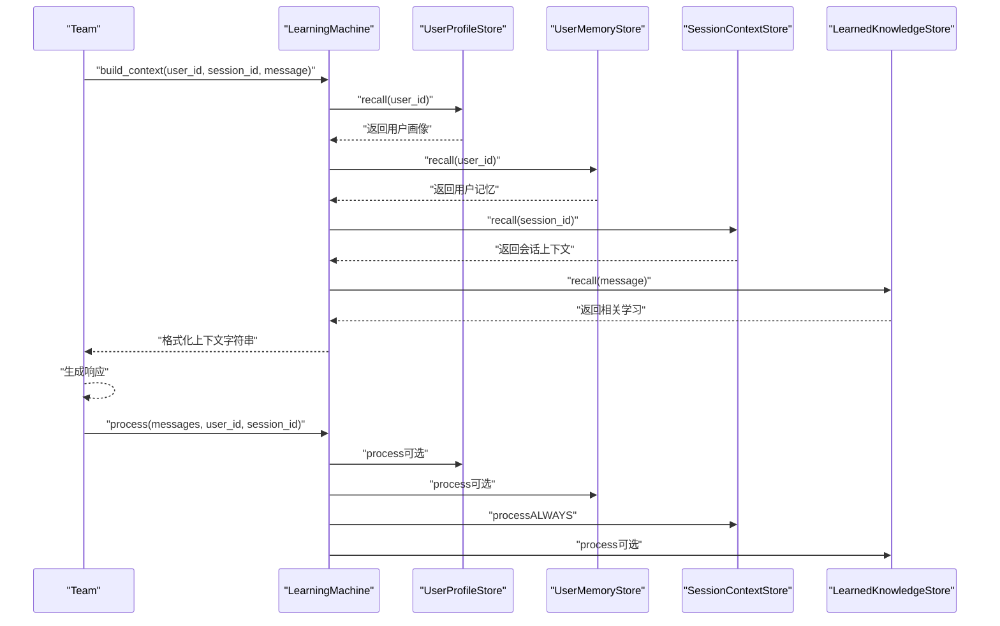
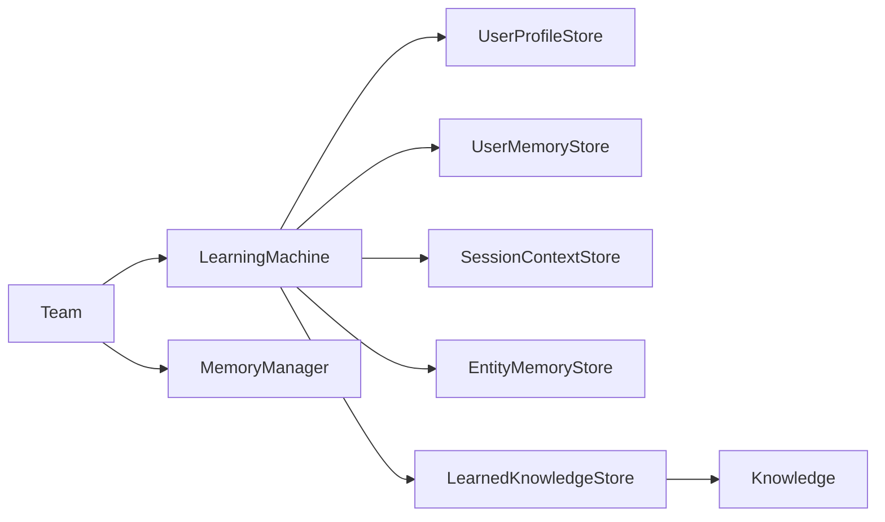
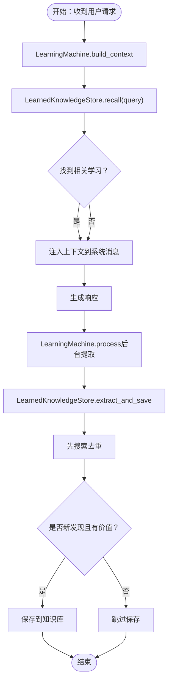

# 智能团队记忆

<cite>
**本文档引用的文件**
- [01_team_always_learn.py](file://cookbook/03_teams/12_learning/01_team_always_learn.py)
- [02_team_configured_learning.py](file://cookbook/03_teams/12_learning/02_team_configured_learning.py)
- [learning_machine.py](file://cookbook/03_teams/06_memory/learning_machine.py)
- [learned_knowledge.py](file://libs/agno/agno/learn/stores/learned_knowledge.py)
- [session_context.py](file://libs/agno/agno/learn/stores/session_context.py)
- [user_profile.py](file://libs/agno/agno/learn/stores/user_profile.py)
- [user_memory.py](file://libs/agno/agno/learn/stores/user_memory.py)
- [config.py](file://libs/agno/agno/learn/config.py)
- [machine.py](file://libs/agno/agno/learn/machine.py)
- [_messages.py](file://libs/agno/agno/team/_messages.py)
- [team.py](file://libs/agno/agno/team/team.py)
</cite>

## 目录
1. [简介](#简介)
2. [项目结构](#项目结构)
3. [核心组件](#核心组件)
4. [架构总览](#架构总览)
5. [详细组件分析](#详细组件分析)
6. [依赖关系分析](#依赖关系分析)
7. [性能考虑](#性能考虑)
8. [故障排查指南](#故障排查指南)
9. [结论](#结论)
10. [附录](#附录)

## 简介
本文件面向智能团队记忆系统的使用者与开发者，系统性阐述团队在交互过程中如何自动学习并沉淀知识，包括用户画像、会话上下文、实体记忆以及可复用的组织洞察。文档覆盖自动学习机制、知识提取策略、存储与检索、配置与使用示例，并给出调试与优化建议，帮助提升团队协作效率与决策质量。

## 项目结构
智能团队记忆体系由三大层面构成：
- 团队层：Team 作为编排者，负责调度成员、注入上下文、触发学习流程。
- 学习机层：LearningMachine 统一协调多个学习存储（用户画像、用户记忆、会话上下文、实体记忆、可复用知识）。
- 存储层：各类 LearningStore 提供结构化存储、语义检索与工具接口。

**图表来源**
- [team.py:70-200](file://libs/agno/agno/team/team.py#L70-L200)
- [machine.py:52-163](file://libs/agno/agno/learn/machine.py#L52-L163)
- [config.py:52-371](file://libs/agno/agno/learn/config.py#L52-L371)

**章节来源**
- [team.py:70-200](file://libs/agno/agno/team/team.py#L70-L200)
- [machine.py:52-163](file://libs/agno/agno/learn/machine.py#L52-L163)
- [config.py:52-371](file://libs/agno/agno/learn/config.py#L52-L371)

## 核心组件
- Team：团队编排器，负责接收用户请求、委派给成员、构建系统消息、注入学习上下文、触发学习与存储。
- LearningMachine：统一学习中枢，按配置启用不同学习存储，负责召回、格式化上下文、暴露工具、异步处理与维护。
- LearningStore 系列：具体学习类型的存储实现，提供 recall/process/build_context/get_tools 等能力。
- MemoryManager：与传统记忆管理配合，支持用户历史记忆注入到系统消息中。
- Knowledge：向量知识库，用于 LearnedKnowledgeStore 的语义检索与去重。

**章节来源**
- [team.py:70-200](file://libs/agno/agno/team/team.py#L70-L200)
- [machine.py:52-163](file://libs/agno/agno/learn/machine.py#L52-L163)
- [learned_knowledge.py:49-96](file://libs/agno/agno/learn/stores/learned_knowledge.py#L49-L96)
- [session_context.py:56-106](file://libs/agno/agno/learn/stores/session_context.py#L56-L106)
- [user_profile.py:60-106](file://libs/agno/agno/learn/stores/user_profile.py#L60-L106)
- [user_memory.py:55-96](file://libs/agno/agno/learn/stores/user_memory.py#L55-L96)
- [_messages.py:473-527](file://libs/agno/agno/team/_messages.py#L473-L527)

## 架构总览
下图展示了从用户请求到团队响应的完整链路，以及学习机如何在其中注入上下文与触发学习：

**图表来源**
- [machine.py:350-419](file://libs/agno/agno/learn/machine.py#L350-L419)
- [learned_knowledge.py:105-162](file://libs/agno/agno/learn/stores/learned_knowledge.py#L105-L162)
- [session_context.py:107-126](file://libs/agno/agno/learn/stores/session_context.py#L107-L126)
- [user_profile.py:107-126](file://libs/agno/agno/learn/stores/user_profile.py#L107-L126)
- [user_memory.py:97-116](file://libs/agno/agno/learn/stores/user_memory.py#L97-L116)

## 详细组件分析

### 用户画像（UserProfile）学习
- 目标：长期稳定的结构化用户特征（姓名、偏好等）。
- 触发方式：
  - ALWAYS 模式：对话后自动提取并保存。
  - AGENTIC 模式：通过工具显式更新。
- 上下文注入：在系统消息中以“个人资料”XML块形式自然呈现，指导个性化回复。
- 工具：update_profile（仅在启用代理工具或 AGENTIC 模式时暴露）。

**图表来源**
- [user_profile.py:60-106](file://libs/agno/agno/learn/stores/user_profile.py#L60-L106)
- [config.py:52-105](file://libs/agno/agno/learn/config.py#L52-L105)

**章节来源**
- [user_profile.py:183-262](file://libs/agno/agno/learn/stores/user_profile.py#L183-L262)
- [config.py:52-105](file://libs/agno/agno/learn/config.py#L52-L105)

### 用户记忆（UserMemory）学习
- 目标：非结构化的用户观察、偏好与上下文，跨会话持久化。
- 触发方式：ALWAYS 自动提取；AGENTIC 通过工具显式增删改。
- 上下文注入：以“过往记忆”XML块形式注入，指导自然化个性化。
- 工具：update_user_memory（添加/更新/删除/清空记忆）。

**图表来源**
- [user_memory.py:55-96](file://libs/agno/agno/learn/stores/user_memory.py#L55-L96)
- [config.py:107-164](file://libs/agno/agno/learn/config.py#L107-L164)

**章节来源**
- [user_memory.py:173-253](file://libs/agno/agno/learn/stores/user_memory.py#L173-L253)
- [config.py:107-164](file://libs/agno/agno/learn/config.py#L107-L164)

### 会话上下文（SessionContext）学习
- 目标：当前会话的状态摘要、目标、计划与进度，确保消息截断场景下的连续性。
- 触发方式：ALWAYS 模式，每轮自动更新；支持“规划模式”（goal/plan/progress）。
- 上下文注入：以“会话上下文”XML块形式注入，包含摘要与指导原则。
- 工具：系统管理，无需代理工具。

**图表来源**
- [session_context.py:56-106](file://libs/agno/agno/learn/stores/session_context.py#L56-L106)
- [config.py:170-225](file://libs/agno/agno/learn/config.py#L170-L225)

**章节来源**
- [session_context.py:188-230](file://libs/agno/agno/learn/stores/session_context.py#L188-L230)
- [config.py:170-225](file://libs/agno/agno/learn/config.py#L170-L225)

### 可复用知识（LearnedKnowledge）学习
- 目标：跨用户、跨任务的通用洞察与最佳实践，支持命名空间隔离与共享。
- 触发方式：
  - AGENTIC：代理主动发现并保存，先搜索去重再保存。
  - PROPOSE：代理提议，经人工确认后保存。
  - ALWAYS：后台自动提取（带去重检测）。
- 检索机制：基于向量知识库的语义搜索，支持命名空间过滤。
- 工具：search_learnings、save_learning。

**图表来源**
- [learned_knowledge.py:49-96](file://libs/agno/agno/learn/stores/learned_knowledge.py#L49-L96)
- [config.py:227-287](file://libs/agno/agno/learn/config.py#L227-L287)

**章节来源**
- [learned_knowledge.py:230-388](file://libs/agno/agno/learn/stores/learned_knowledge.py#L230-L388)
- [learned_knowledge.py:731-779](file://libs/agno/agno/learn/stores/learned_knowledge.py#L731-L779)
- [config.py:227-287](file://libs/agno/agno/learn/config.py#L227-L287)

### 实体记忆（EntityMemory）学习
- 目标：第三方实体（公司、项目、产品等）的事实、事件与关系图谱。
- 触发方式：ALWAYS 自动；支持命名空间隔离（user/global/custom）。
- 工具：search_entities、create_entity、update_entity、add_fact、add_event、add_relationship 等。

**章节来源**
- [config.py:289-371](file://libs/agno/agno/learn/config.py#L289-L371)

### 学习机（LearningMachine）与团队集成
- LearningMachine：统一管理各学习存储，提供 build_context/arecall/process 等统一接口。
- 团队集成：Team 在构建系统消息时调用 LearningMachine.build_context 注入上下文；在响应后调用 process 触发后台学习。

**图表来源**
- [machine.py:350-419](file://libs/agno/agno/learn/machine.py#L350-L419)
- [machine.py:498-539](file://libs/agno/agno/learn/machine.py#L498-L539)
- [_messages.py:473-527](file://libs/agno/agno/team/_messages.py#L473-L527)

**章节来源**
- [machine.py:350-419](file://libs/agno/agno/learn/machine.py#L350-L419)
- [machine.py:498-539](file://libs/agno/agno/learn/machine.py#L498-L539)
- [_messages.py:473-527](file://libs/agno/agno/team/_messages.py#L473-L527)

## 依赖关系分析
- Team 依赖 LearningMachine 与 MemoryManager/Knowledge，以构建系统消息与触发学习。
- LearningMachine 依赖各 LearningStore 与 Knowledge，负责统一调度与上下文格式化。
- 各 LearningStore 依赖数据库与模型（某些模式需要），提供 recall/process/build_context/get_tools。

**图表来源**
- [team.py:70-200](file://libs/agno/agno/team/team.py#L70-L200)
- [machine.py:52-163](file://libs/agno/agno/learn/machine.py#L52-L163)
- [learned_knowledge.py:49-96](file://libs/agno/agno/learn/stores/learned_knowledge.py#L49-L96)

**章节来源**
- [team.py:70-200](file://libs/agno/agno/team/team.py#L70-L200)
- [machine.py:52-163](file://libs/agno/agno/learn/machine.py#L52-L163)
- [learned_knowledge.py:49-96](file://libs/agno/agno/learn/stores/learned_knowledge.py#L49-L96)

## 性能考虑
- 异步处理：LearningMachine 支持异步 recall/aprocess，降低等待时间。
- 并行提取：Team 在响应后并行触发各存储的后台提取，避免阻塞主流程。
- 语义检索：LearnedKnowledgeStore 使用向量知识库进行语义搜索，需合理设置命名空间与 limit。
- 模型用量：学习过程会调用模型进行抽取与工具执行，注意统计与控制成本。

**章节来源**
- [machine.py:393-419](file://libs/agno/agno/learn/machine.py#L393-L419)
- [machine.py:539-567](file://libs/agno/agno/learn/machine.py#L539-L567)
- [learned_knowledge.py:780-800](file://libs/agno/agno/learn/stores/learned_knowledge.py#L780-L800)

## 故障排查指南
- 日志级别：通过 debug_mode 或环境变量 AGNO_DEBUG 控制日志级别，便于定位问题。
- 存储状态检查：各 Store 提供 was_updated/was_updated 属性，可判断是否发生更新。
- 知识库配置：LearnedKnowledgeStore 需要配置知识库实例，否则无法检索或保存。
- 会话上下文：SessionContextStore 仅支持 ALWAYS 模式，其他模式会被忽略。
- 用户记忆注入：若使用 MemoryManager，需确保数据库为同步类型，异步数据库需使用异步接口。

**章节来源**
- [learned_knowledge.py:469-476](file://libs/agno/agno/learn/stores/learned_knowledge.py#L469-L476)
- [session_context.py:88-92](file://libs/agno/agno/learn/stores/session_context.py#L88-L92)
- [_messages.py:481-485](file://libs/agno/agno/team/_messages.py#L481-L485)

## 结论
智能团队记忆通过 LearningMachine 将用户画像、用户记忆、会话上下文与可复用知识有机整合，形成“自动学习—结构化存储—语义检索—自然应用”的闭环。它能够显著减少重复劳动、提供上下文参考并加速决策过程。通过合理的配置与调试，可在保证性能的同时获得稳定的学习效果。

## 附录

### 配置与使用示例路径
- 启用团队自动学习（Always 模式）
  - 示例文件：[01_team_always_learn.py:1-89](file://cookbook/03_teams/12_learning/01_team_always_learn.py#L1-L89)
- 精细化配置（UserProfile/UserMemory/SessionContext 分别配置）
  - 示例文件：[02_team_configured_learning.py:1-109](file://cookbook/03_teams/12_learning/02_team_configured_learning.py#L1-L109)
- LearningMachine 与用户画像示例
  - 示例文件：[learning_machine.py:1-67](file://cookbook/03_teams/06_memory/learning_machine.py#L1-L67)

### 关键流程图：可复用知识保存与检索

**图表来源**
- [learned_knowledge.py:1148-1181](file://libs/agno/agno/learn/stores/learned_knowledge.py#L1148-L1181)
- [learned_knowledge.py:105-162](file://libs/agno/agno/learn/stores/learned_knowledge.py#L105-L162)