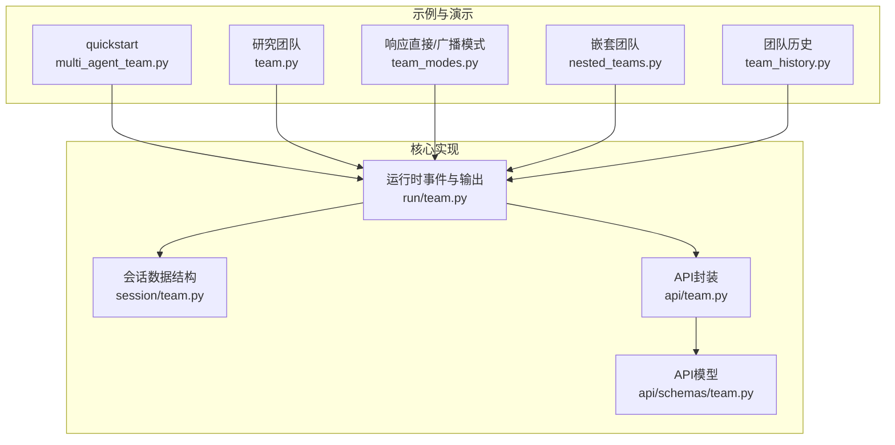
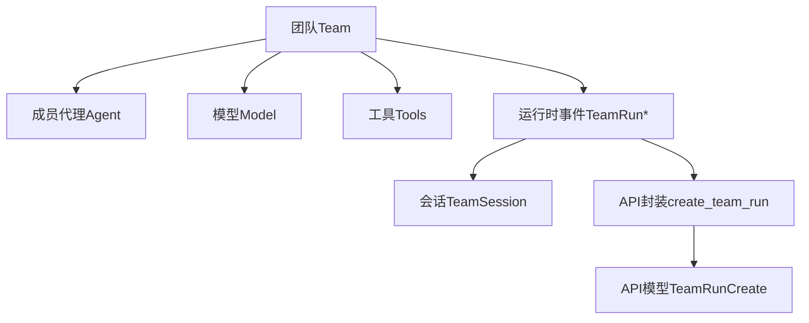
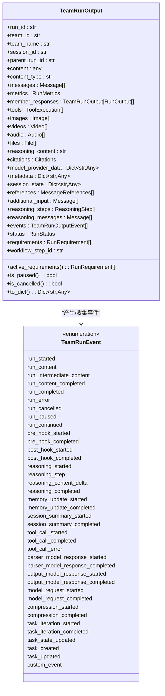
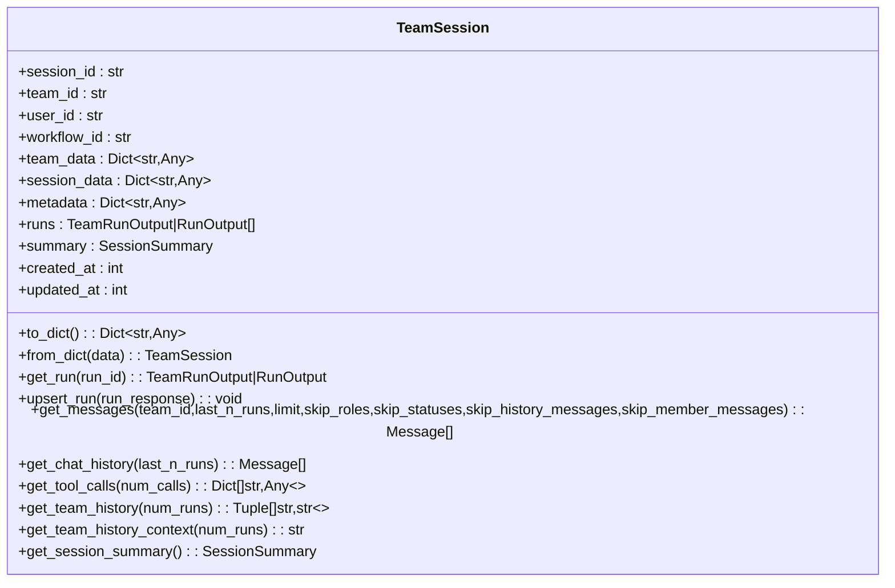
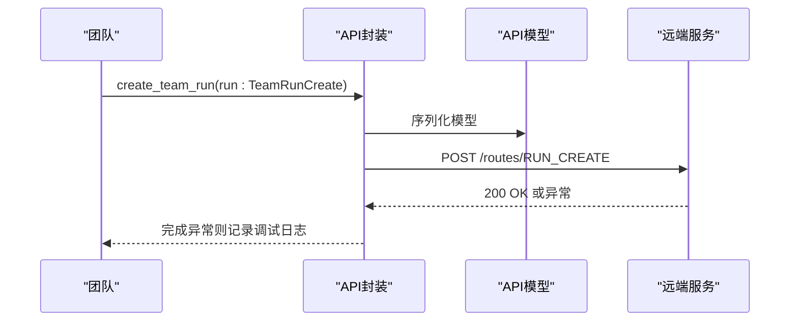
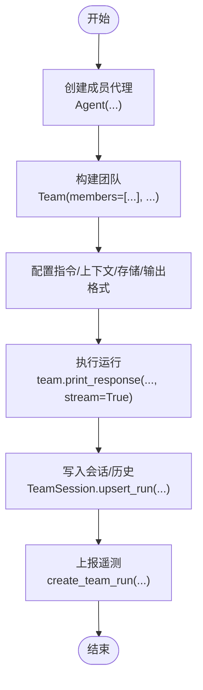
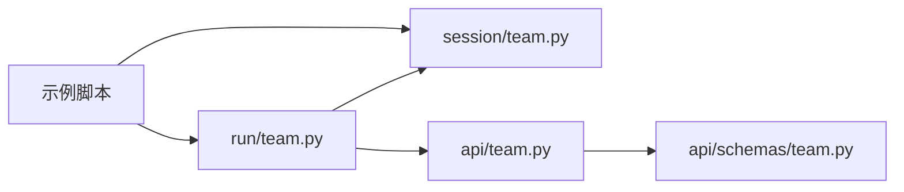

# 团队基础

<cite>
**本文引用的文件**
- [multi_agent_team.py](file://cookbook/00_quickstart/multi_agent_team.py)
- [team.py（研究团队）](file://cookbook/01_demo/teams/research/team.py)
- [team_modes.py（模式示例）](file://cookbook/03_teams/01_quickstart/02_respond_directly_router_team.py)
- [nested_teams.py（嵌套团队）](file://cookbook/03_teams/01_quickstart/nested_teams.py)
- [team_history.py（团队历史）](file://cookbook/03_teams/01_quickstart/05_team_history.py)
- [team.py（运行实现）](file://libs/agno/agno/run/team.py)
- [team.py（API封装）](file://libs/agno/agno/api/team.py)
- [team.py（会话封装）](file://libs/agno/agno/session/team.py)
- [team.py（API模型）](file://libs/agno/agno/api/schemas/team.py)
</cite>

## 目录
1. [简介](#简介)
2. [项目结构](#项目结构)
3. [核心组件](#核心组件)
4. [架构总览](#架构总览)
5. [详细组件分析](#详细组件分析)
6. [依赖关系分析](#依赖关系分析)
7. [性能考虑](#性能考虑)
8. [故障排除指南](#故障排除指南)
9. [结论](#结论)
10. [附录](#附录)

## 简介
本章节面向团队基础能力，系统性介绍多代理团队的核心概念、基本架构与运行机制。内容涵盖团队的创建方式、配置选项与初始化流程；团队属性与方法（成员管理、状态控制、生命周期管理）；基础运行机制（任务分配、消息传递、协调策略）；以及与代理、会话、工具系统的集成关系。文末提供常见使用场景与最佳实践建议，并通过具体示例路径帮助快速上手。

## 项目结构
团队相关代码主要分布在以下位置：
- 示例与用法：cookbook/00_quickstart、cookbook/01_demo/teams/research、cookbook/03_teams/01_quickstart
- 核心实现：libs/agno/agno/run/team.py（运行时事件与输出）、libs/agno/agno/session/team.py（会话数据结构）、libs/agno/agno/api/team.py（API封装）、libs/agno/agno/api/schemas/team.py（API模型）

**图表来源**
- [multi_agent_team.py:1-167](file://cookbook/00_quickstart/multi_agent_team.py#L1-L167)
- [team.py（研究团队）](file://cookbook/01_demo/teams/research/team.py)
- [team_modes.py（模式示例）](file://cookbook/03_teams/01_quickstart/02_respond_directly_router_team.py)
- [nested_teams.py（嵌套团队）](file://cookbook/03_teams/01_quickstart/nested_teams.py)
- [team_history.py（团队历史）](file://cookbook/03_teams/01_quickstart/05_team_history.py)
- [team.py（运行实现）:1-1012](file://libs/agno/agno/run/team.py#L1-L1012)
- [team.py（API封装）:1-31](file://libs/agno/agno/api/team.py#L1-L31)
- [team.py（会话封装）:1-348](file://libs/agno/agno/session/team.py#L1-L348)
- [team.py（API模型）:1-17](file://libs/agno/agno/api/schemas/team.py#L1-L17)

**章节来源**
- [multi_agent_team.py:1-167](file://cookbook/00_quickstart/multi_agent_team.py#L1-L167)
- [team.py（运行实现）:1-1012](file://libs/agno/agno/run/team.py#L1-L1012)
- [team.py（会话封装）:1-348](file://libs/agno/agno/session/team.py#L1-L348)
- [team.py（API封装）:1-31](file://libs/agno/agno/api/team.py#L1-L31)
- [team.py（API模型）:1-17](file://libs/agno/agno/api/schemas/team.py#L1-L17)

## 核心组件
- 团队运行时事件与输出：定义了完整的团队运行生命周期事件（开始、内容增量、完成、错误、暂停/继续、推理、记忆更新、会话摘要、模型请求、压缩、任务迭代等），并提供统一的 TeamRunOutput 结构承载最终结果与中间状态。
- 团队会话：以 TeamSession 为核心，存储团队会话元数据、关联的运行记录、会话摘要，并提供按条件筛选消息、获取聊天历史、提取工具调用、生成团队历史上下文等能力。
- 团队API封装：提供同步与异步接口用于上报团队运行事件到遥测服务，便于观测与审计。
- 团队API模型：定义上报数据结构 TeamRunCreate，包含会话ID、运行ID、自定义数据与SDK版本信息。

**章节来源**
- [team.py（运行实现）:130-800](file://libs/agno/agno/run/team.py#L130-L800)
- [team.py（会话封装）:15-348](file://libs/agno/agno/session/team.py#L15-L348)
- [team.py（API封装）:7-31](file://libs/agno/agno/api/team.py#L7-L31)
- [team.py（API模型）:8-17](file://libs/agno/agno/api/schemas/team.py#L8-L17)

## 架构总览
团队系统围绕“团队运行时事件与输出”展开，向上对接代理与工作流，向下连接会话持久化与遥测上报。团队在运行过程中产生丰富的事件，这些事件被序列化为 TeamRunOutput 并可写入 TeamSession，同时通过 API 封装上报至远端服务。

**图表来源**
- [team.py（运行实现）:130-800](file://libs/agno/agno/run/team.py#L130-L800)
- [team.py（会话封装）:15-348](file://libs/agno/agno/session/team.py#L15-L348)
- [team.py（API封装）:7-31](file://libs/agno/agno/api/team.py#L7-L31)
- [team.py（API模型）:8-17](file://libs/agno/agno/api/schemas/team.py#L8-L17)

## 详细组件分析

### 组件A：团队运行时事件与输出
- 事件体系：覆盖从运行开始、内容增量、推理、工具调用、内存更新、会话摘要、模型请求、压缩、任务迭代到结束/错误/取消/暂停/继续的完整生命周期。
- 输出结构：TeamRunOutput 统一承载运行结果，包含输入内容、消息列表、指标、成员响应、媒体附件、引用、推理步骤与消息、会话状态、元数据、要求（人类在环）等。
- 任务模式：提供任务迭代开始/完成、任务状态更新、任务创建/更新等事件，支持前端实时渲染任务列表。

**图表来源**
- [team.py（运行实现）:130-800](file://libs/agno/agno/run/team.py#L130-L800)

**章节来源**
- [team.py（运行实现）:130-800](file://libs/agno/agno/run/team.py#L130-L800)

### 组件B：团队会话（TeamSession）
- 数据结构：保存会话ID、团队ID、用户ID、工作流ID、团队数据、会话数据、元数据、运行列表、会话摘要等。
- 能力：
  - upsert_run：按运行ID更新或新增运行记录。
  - get_messages：按团队ID、成员ID、状态、角色、历史标记等过滤消息，支持限制数量与最近N轮。
  - get_chat_history：返回用户与助手消息（跳过系统与成员消息）。
  - get_tool_calls：逆序提取工具调用。
  - get_team_history / get_team_history_context：将已完成的团队主运行整理为结构化历史或格式化的上下文字符串。
  - get_session_summary：获取会话摘要。

**图表来源**
- [team.py（会话封装）:15-348](file://libs/agno/agno/session/team.py#L15-L348)

**章节来源**
- [team.py（会话封装）:15-348](file://libs/agno/agno/session/team.py#L15-L348)

### 组件C：团队API封装与模型
- 同步/异步上报：create_team_run 与 acreate_team_run 将 TeamRunCreate 发送到远端路由，失败时记录调试日志。
- 模型定义：TeamRunCreate 包含会话ID、运行ID、任意数据与SDK版本，类型字段固定为团队运行事件类型。

**图表来源**
- [team.py（API封装）:7-31](file://libs/agno/agno/api/team.py#L7-L31)
- [team.py（API模型）:8-17](file://libs/agno/agno/api/schemas/team.py#L8-L17)

**章节来源**
- [team.py（API封装）:7-31](file://libs/agno/agno/api/team.py#L7-L31)
- [team.py（API模型）:8-17](file://libs/agno/agno/api/schemas/team.py#L8-L17)

### 组件D：团队创建与配置示例
- 基本团队：通过 Agent 创建成员，再以成员列表初始化 Team，设置指令、数据库、上下文注入等参数，支持打印响应与流式输出。
- 响应直接团队：示例展示“响应直接”路由策略，适合需要快速决策或单点输出的场景。
- 广播模式团队：示例展示“广播”协作模式，适合需要并行收集多方意见后统一合成的场景。
- 嵌套团队：示例展示团队内嵌团队，形成更复杂的组织形态。
- 团队历史：示例展示如何利用会话历史与团队历史上下文增强后续交互。

**图表来源**
- [multi_agent_team.py:39-117](file://cookbook/00_quickstart/multi_agent_team.py#L39-L117)
- [team_modes.py（模式示例）](file://cookbook/03_teams/01_quickstart/02_respond_directly_router_team.py)
- [nested_teams.py（嵌套团队）](file://cookbook/03_teams/01_quickstart/nested_teams.py)
- [team_history.py（团队历史）](file://cookbook/03_teams/01_quickstart/05_team_history.py)
- [team.py（会话封装）:92-112](file://libs/agno/agno/session/team.py#L92-L112)
- [team.py（API封装）:7-31](file://libs/agno/agno/api/team.py#L7-L31)

**章节来源**
- [multi_agent_team.py:39-117](file://cookbook/00_quickstart/multi_agent_team.py#L39-L117)
- [team_modes.py（模式示例）](file://cookbook/03_teams/01_quickstart/02_respond_directly_router_team.py)
- [nested_teams.py（嵌套团队）](file://cookbook/03_teams/01_quickstart/nested_teams.py)
- [team_history.py（团队历史）](file://cookbook/03_teams/01_quickstart/05_team_history.py)
- [team.py（会话封装）:92-112](file://libs/agno/agno/session/team.py#L92-L112)
- [team.py（API封装）:7-31](file://libs/agno/agno/api/team.py#L7-L31)

## 依赖关系分析
- 运行时事件与输出依赖消息、指标、推理步骤、工具执行等子系统，形成统一的事件注册表与反序列化机制。
- 会话封装依赖运行输出与会话摘要，提供消息过滤与历史聚合能力。
- API封装依赖API路由与模型，负责上报与容错。
- 示例层通过导入运行实现与会话封装，组合出不同团队模式与配置。

**图表来源**
- [team.py（运行实现）:649-701](file://libs/agno/agno/run/team.py#L649-L701)
- [team.py（会话封装）:53-84](file://libs/agno/agno/session/team.py#L53-L84)
- [team.py（API封装）:7-31](file://libs/agno/agno/api/team.py#L7-L31)
- [team.py（API模型）:8-17](file://libs/agno/agno/api/schemas/team.py#L8-L17)

**章节来源**
- [team.py（运行实现）:649-701](file://libs/agno/agno/run/team.py#L649-L701)
- [team.py（会话封装）:53-84](file://libs/agno/agno/session/team.py#L53-L84)
- [team.py（API封装）:7-31](file://libs/agno/agno/api/team.py#L7-L31)
- [team.py（API模型）:8-17](file://libs/agno/agno/api/schemas/team.py#L8-L17)

## 性能考虑
- 事件序列化与反序列化：TeamRunOutput 提供 to_dict 与 from_dict，注意避免重复序列化大对象（如消息列表、媒体附件）。
- 会话消息过滤：get_messages 支持按状态、角色、历史标记过滤，合理设置 limit 与 last_n_runs 可降低内存占用。
- 工具结果压缩：运行时事件包含压缩开始/完成事件，可在工具结果体量较大时启用压缩以减少传输与存储成本。
- 流式输出：print_response 支持流式输出，建议在长文本或多媒体场景下开启以改善用户体验。

[本节为通用性能建议，不直接分析具体文件]

## 故障排除指南
- 运行错误事件：当发生错误时，运行输出包含错误类型、ID与附加数据，便于定位问题。
- 暂停/继续：当需要人工干预时，运行可能被暂停，需检查 requirements 并在满足后继续。
- 上报失败：API封装在上报失败时记录调试日志，检查网络与远端服务状态。
- 历史为空：若 get_team_history/get_messages 返回空，请确认会话中已完成的主运行是否存在且未被过滤。

**章节来源**
- [team.py（运行实现）:286-332](file://libs/agno/agno/run/team.py#L286-L332)
- [team.py（API封装）:16-30](file://libs/agno/agno/api/team.py#L16-L30)
- [team.py（会话封装）:269-340](file://libs/agno/agno/session/team.py#L269-L340)

## 结论
团队基础能力以统一的运行时事件与输出为核心，结合会话持久化与遥测上报，形成可扩展、可观测的多代理协作框架。通过示例可快速掌握基本团队、响应直接团队与广播模式团队的创建与配置方法，并在此基础上进行嵌套团队与历史上下文增强等高级用法。

[本节为总结性内容，不直接分析具体文件]

## 附录
- 快速开始示例路径：[multi_agent_team.py:39-117](file://cookbook/00_quickstart/multi_agent_team.py#L39-L117)
- 响应直接/广播模式示例路径：[team_modes.py（模式示例）](file://cookbook/03_teams/01_quickstart/02_respond_directly_router_team.py)
- 嵌套团队示例路径：[nested_teams.py（嵌套团队）](file://cookbook/03_teams/01_quickstart/nested_teams.py)
- 团队历史示例路径：[team_history.py（团队历史）](file://cookbook/03_teams/01_quickstart/05_team_history.py)
- 运行时事件与输出参考：[team.py（运行实现）:130-800](file://libs/agno/agno/run/team.py#L130-L800)
- 会话数据结构参考：[team.py（会话封装）:15-348](file://libs/agno/agno/session/team.py#L15-L348)
- API封装与模型参考：[team.py（API封装）:7-31](file://libs/agno/agno/api/team.py#L7-L31)、[team.py（API模型）:8-17](file://libs/agno/agno/api/schemas/team.py#L8-L17)