# 团队多模态

<cite>
**本文引用的文件**
- [cookbook/02_agents/12_multimodal/README.md](file://cookbook/02_agents/12_multimodal/README.md)
- [cookbook/03_teams/19_multimodal/README.md](file://cookbook/03_teams/19_multimodal/README.md)
- [cookbook/02_agents/12_multimodal/image_to_text.py](file://cookbook/02_agents/12_multimodal/image_to_text.py)
- [cookbook/02_agents/12_multimodal/audio_to_text.py](file://cookbook/02_agents/12_multimodal/audio_to_text.py)
- [cookbook/02_agents/12_multimodal/video_caption.py](file://cookbook/02_agents/12_multimodal/video_caption.py)
- [cookbook/02_agents/12_multimodal/media_input_for_tool.py](file://cookbook/02_agents/12_multimodal/media_input_for_tool.py)
- [cookbook/02_agents/12_multimodal/audio_sentiment_analysis.py](file://cookbook/02_agents/12_multimodal/audio_sentiment_analysis.py)
- [cookbook/02_agents/12_multimodal/image_to_structured_output.py](file://cookbook/02_agents/12_multimodal/image_to_structured_output.py)
- [cookbook/03_teams/19_multimodal/image_to_text.py](file://cookbook/03_teams/19_multimodal/image_to_text.py)
- [cookbook/03_teams/19_multimodal/generate_image_with_team.py](file://cookbook/03_teams/19_multimodal/generate_image_with_team.py)
- [cookbook/03_teams/19_multimodal/video_caption_generation.py](file://cookbook/03_teams/19_multimodal/video_caption_generation.py)
- [libs/agno/agno/tools/moviepy_video.py](file://libs/agno/agno/tools/moviepy_video.py)
- [libs/agno/agno/os/routers/teams/router.py](file://libs/agno/agno/os/routers/teams/router.py)
- [libs/agno/agno/utils/tokens.py](file://libs/agno/agno/utils/tokens.py)
- [libs/agno/tests/unit/utils/test_media_reconstruction.py](file://libs/agno/tests/unit/utils/test_media_reconstruction.py)
</cite>

## 目录
1. [引言](#引言)
2. [项目结构](#项目结构)
3. [核心组件](#核心组件)
4. [架构总览](#架构总览)
5. [详细组件分析](#详细组件分析)
6. [依赖关系分析](#依赖关系分析)
7. [性能考虑](#性能考虑)
8. [故障排查指南](#故障排查指南)
9. [结论](#结论)
10. [附录](#附录)

## 引言
本文件面向团队多模态系统，系统性梳理图像分析、音频处理与视频理解等能力，并围绕多模态工具的集成（媒体输入处理、多模态模型使用、输出整合）展开。文档覆盖以下典型应用：图像到文本、音频情感分析、视频字幕生成、多模态知识问答；并给出配置要点（输入格式、模型选择、性能优化）、可直接定位的代码示例路径以及优化与最佳实践建议。

## 项目结构
多模态示例主要分布在“cookbook/02_agents/12_multimodal”与“cookbook/03_teams/19_multimodal”两个目录中，前者聚焦单智能体多模态范式，后者聚焦团队协作下的多模态工作流。同时，底层基础设施如视频工具、媒体路由与令牌估算等位于“libs/agno”。

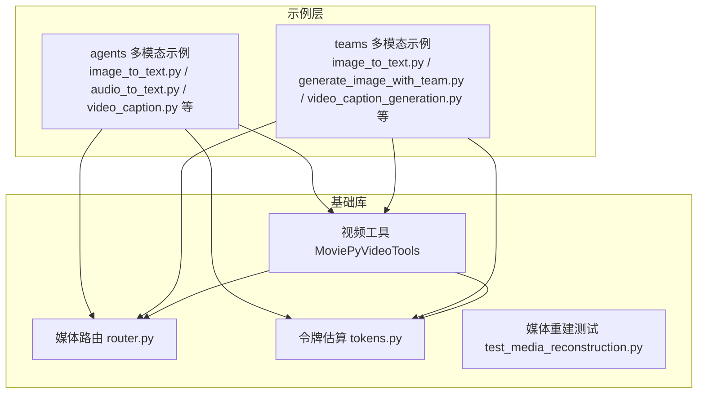

图表来源
- [cookbook/02_agents/12_multimodal/image_to_text.py:1-32](file://cookbook/02_agents/12_multimodal/image_to_text.py#L1-L32)
- [cookbook/03_teams/19_multimodal/generate_image_with_team.py:1-68](file://cookbook/03_teams/19_multimodal/generate_image_with_team.py#L1-L68)
- [libs/agno/agno/tools/moviepy_video.py:1-31](file://libs/agno/agno/tools/moviepy_video.py#L1-L31)
- [libs/agno/agno/os/routers/teams/router.py:220-253](file://libs/agno/agno/os/routers/teams/router.py#L220-L253)
- [libs/agno/agno/utils/tokens.py:501-531](file://libs/agno/agno/utils/tokens.py#L501-L531)

章节来源
- [cookbook/02_agents/12_multimodal/README.md:1-24](file://cookbook/02_agents/12_multimodal/README.md#L1-L24)
- [cookbook/03_teams/19_multimodal/README.md:1-21](file://cookbook/03_teams/19_multimodal/README.md#L1-L21)

## 核心组件
- 媒体输入与路由
  - 路由器对上传的图片、音频、视频进行类型识别与转码（如 base64），并注入到后续处理流程。
  - 支持多媒体列表的重建与校验，确保下游模型接收正确的媒体对象。
- 视频处理工具
  - MoviePyVideoTools 提供视频处理、音频提取、字幕生成与嵌入等工具集，按需启用。
- 模型与输出
  - 示例中广泛使用 OpenAI 与 Google Gemini 的多模态模型，支持 Markdown 输出、结构化输出与流式响应。
- 团队协作
  - 将不同角色拆分为多个智能体，通过明确的指令与工具分工，完成端到端的多模态任务。

章节来源
- [libs/agno/agno/os/routers/teams/router.py:220-253](file://libs/agno/agno/os/routers/teams/router.py#L220-L253)
- [libs/agno/agno/tools/moviepy_video.py:1-31](file://libs/agno/agno/tools/moviepy_video.py#L1-L31)
- [libs/agno/tests/unit/utils/test_media_reconstruction.py:169-213](file://libs/agno/tests/unit/utils/test_media_reconstruction.py#L169-L213)

## 架构总览
下图展示了从用户输入到多模态处理与输出的关键交互路径，涵盖媒体路由、工具调用与模型推理。

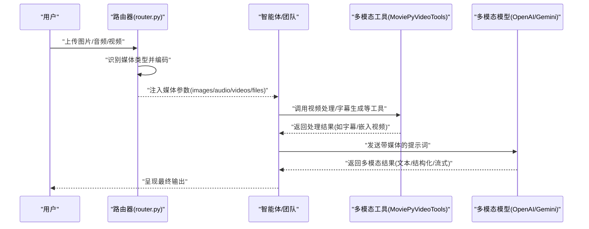

图表来源
- [libs/agno/agno/os/routers/teams/router.py:220-253](file://libs/agno/agno/os/routers/teams/router.py#L220-L253)
- [libs/agno/agno/tools/moviepy_video.py:12-31](file://libs/agno/agno/tools/moviepy_video.py#L12-L31)
- [cookbook/02_agents/12_multimodal/video_caption.py:13-38](file://cookbook/02_agents/12_multimodal/video_caption.py#L13-L38)

## 详细组件分析

### 图像到文本（单智能体）
- 能力概述
  - 使用图像作为输入，结合多模态模型生成描述或创意文本。
- 关键点
  - 指定模型与 Markdown 输出；通过 Image 对象传入本地文件或远程 URL。
- 代码示例路径
  - [cookbook/02_agents/12_multimodal/image_to_text.py:1-32](file://cookbook/02_agents/12_multimodal/image_to_text.py#L1-L32)

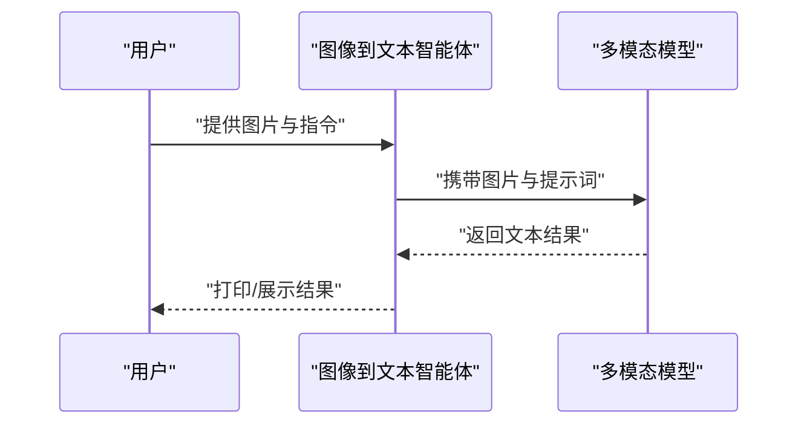

图表来源
- [cookbook/02_agents/12_multimodal/image_to_text.py:17-31](file://cookbook/02_agents/12_multimodal/image_to_text.py#L17-L31)

章节来源
- [cookbook/02_agents/12_multimodal/image_to_text.py:1-32](file://cookbook/02_agents/12_multimodal/image_to_text.py#L1-L32)

### 音频到文本与情感分析（单智能体）
- 能力概述
  - 将音频转写为文字；可结合上下文进行情感分析；支持流式输出。
- 关键点
  - 使用 Audio 对象加载二进制音频；Gemini/OpenAI 模型用于转写与分析；SQLite 会话数据库用于上下文持久化。
- 代码示例路径
  - [cookbook/02_agents/12_multimodal/audio_to_text.py:1-37](file://cookbook/02_agents/12_multimodal/audio_to_text.py#L1-L37)
  - [cookbook/02_agents/12_multimodal/audio_sentiment_analysis.py:1-47](file://cookbook/02_agents/12_multimodal/audio_sentiment_analysis.py#L1-L47)

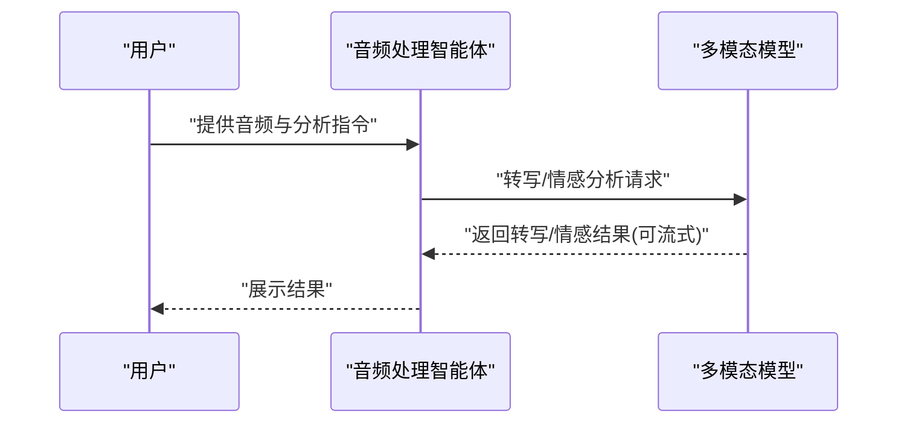

图表来源
- [cookbook/02_agents/12_multimodal/audio_to_text.py:16-36](file://cookbook/02_agents/12_multimodal/audio_to_text.py#L16-L36)
- [cookbook/02_agents/12_multimodal/audio_sentiment_analysis.py:17-46](file://cookbook/02_agents/12_multimodal/audio_sentiment_analysis.py#L17-L46)

章节来源
- [cookbook/02_agents/12_multimodal/audio_to_text.py:1-37](file://cookbook/02_agents/12_multimodal/audio_to_text.py#L1-L37)
- [cookbook/02_agents/12_multimodal/audio_sentiment_analysis.py:1-47](file://cookbook/02_agents/12_multimodal/audio_sentiment_analysis.py#L1-L47)

### 视频字幕生成（单智能体）
- 能力概述
  - 自动提取音频、转写、生成 SRT 字幕并嵌入视频。
- 关键点
  - 通过 MoviePyVideoTools 组合工具链；明确顺序化的处理步骤。
- 代码示例路径
  - [cookbook/02_agents/12_multimodal/video_caption.py:1-47](file://cookbook/02_agents/12_multimodal/video_caption.py#L1-L47)

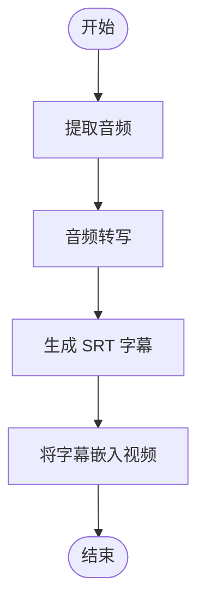

图表来源
- [cookbook/02_agents/12_multimodal/video_caption.py:29-36](file://cookbook/02_agents/12_multimodal/video_caption.py#L29-L36)

章节来源
- [cookbook/02_agents/12_multimodal/video_caption.py:1-47](file://cookbook/02_agents/12_multimodal/video_caption.py#L1-L47)

### 多模态知识问答与结构化输出
- 能力概述
  - 结合图像与提示词生成结构化输出（如电影剧本），提升结果的可解析性与一致性。
- 关键点
  - 使用 Pydantic 模型定义输出结构；配合多模态模型进行约束生成。
- 代码示例路径
  - [cookbook/02_agents/12_multimodal/image_to_structured_output.py:1-49](file://cookbook/02_agents/12_multimodal/image_to_structured_output.py#L1-L49)

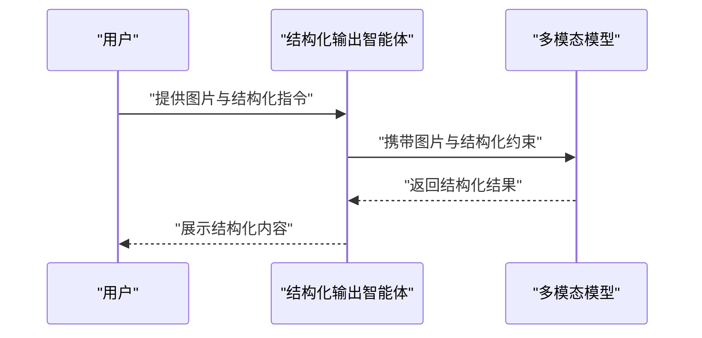

图表来源
- [cookbook/02_agents/12_multimodal/image_to_structured_output.py:31-48](file://cookbook/02_agents/12_multimodal/image_to_structured_output.py#L31-L48)

章节来源
- [cookbook/02_agents/12_multimodal/image_to_structured_output.py:1-49](file://cookbook/02_agents/12_multimodal/image_to_structured_output.py#L1-L49)

### 多模态工具接入与媒体输入（工具侧访问）
- 能力概述
  - 工具可直接访问传入的文件/媒体，实现 OCR、文档处理等能力；可控制是否将媒体直接送入模型、是否存储媒体。
- 关键点
  - 通过 Toolkit 定义工具；在工具函数中读取 Sequence[File] 并进行处理；示例中关闭“发送媒体到模型”，开启“存储媒体”以复用。
- 代码示例路径
  - [cookbook/02_agents/12_multimodal/media_input_for_tool.py:1-122](file://cookbook/02_agents/12_multimodal/media_input_for_tool.py#L1-L122)

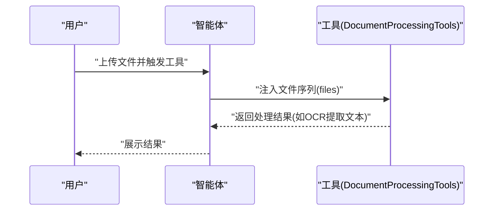

图表来源
- [cookbook/02_agents/12_multimodal/media_input_for_tool.py:20-71](file://cookbook/02_agents/12_multimodal/media_input_for_tool.py#L20-L71)

章节来源
- [cookbook/02_agents/12_multimodal/media_input_for_tool.py:1-122](file://cookbook/02_agents/12_multimodal/media_input_for_tool.py#L1-L122)

### 团队协作：图像故事创作
- 能力概述
  - 将“图像分析”和“创意写作”拆分为不同角色，协同生成故事。
- 关键点
  - 明确角色职责与协作顺序；共享上下文与指令。
- 代码示例路径
  - [cookbook/03_teams/19_multimodal/image_to_text.py:1-63](file://cookbook/03_teams/19_multimodal/image_to_text.py#L1-L63)

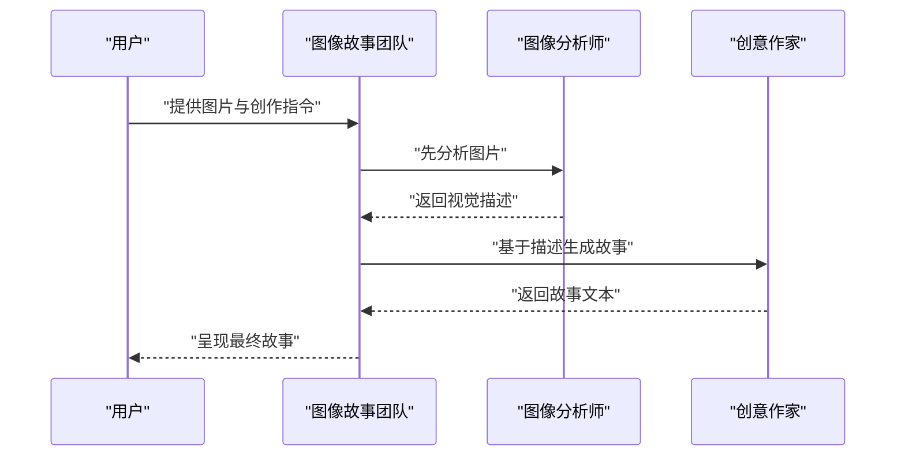

图表来源
- [cookbook/03_teams/19_multimodal/image_to_text.py:41-52](file://cookbook/03_teams/19_multimodal/image_to_text.py#L41-L52)

章节来源
- [cookbook/03_teams/19_multimodal/image_to_text.py:1-63](file://cookbook/03_teams/19_multimodal/image_to_text.py#L1-L63)

### 团队协作：图像生成（提示工程 + DALL-E）
- 能力概述
  - “提示工程师”优化提示，“图像生成器”使用 DALL-E 生成高质量图像。
- 关键点
  - 工具链明确、角色职责清晰；支持流式事件输出。
- 代码示例路径
  - [cookbook/03_teams/19_multimodal/generate_image_with_team.py:1-68](file://cookbook/03_teams/19_multimodal/generate_image_with_team.py#L1-L68)

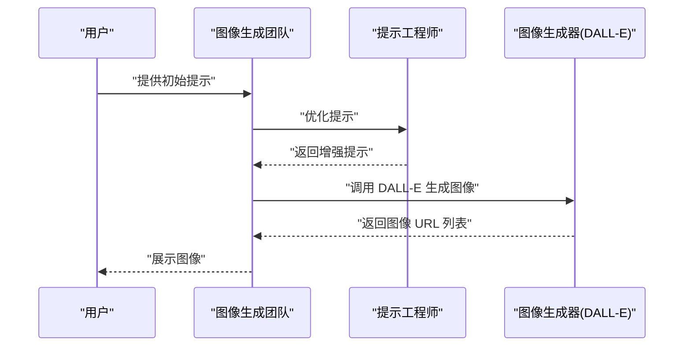

图表来源
- [cookbook/03_teams/19_multimodal/generate_image_with_team.py:44-54](file://cookbook/03_teams/19_multimodal/generate_image_with_team.py#L44-L54)

章节来源
- [cookbook/03_teams/19_multimodal/generate_image_with_team.py:1-68](file://cookbook/03_teams/19_multimodal/generate_image_with_team.py#L1-L68)

### 团队协作：视频字幕生成与嵌入
- 能力概述
  - 将“视频处理”和“字幕生成”拆分为不同角色，严格遵循处理顺序。
- 关键点
  - 工具组合明确；角色职责与团队指令清晰。
- 代码示例路径
  - [cookbook/03_teams/19_multimodal/video_caption_generation.py:1-65](file://cookbook/03_teams/19_multimodal/video_caption_generation.py#L1-L65)

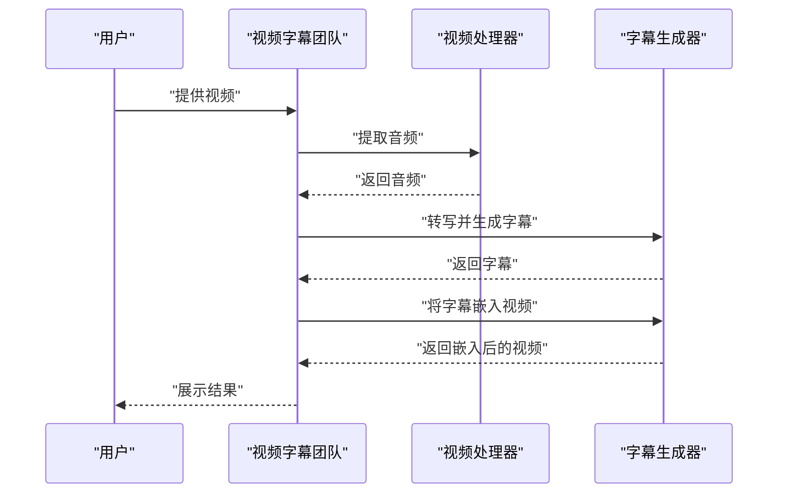

图表来源
- [cookbook/03_teams/19_multimodal/video_caption_generation.py:43-56](file://cookbook/03_teams/19_multimodal/video_caption_generation.py#L43-L56)

章节来源
- [cookbook/03_teams/19_multimodal/video_caption_generation.py:1-65](file://cookbook/03_teams/19_multimodal/video_caption_generation.py#L1-L65)

## 依赖关系分析
- 媒体路由与令牌估算
  - 路由器负责识别图片/音频/视频并进行编码；令牌估算模块根据时长/分辨率等估算 token 数量，辅助成本与上下文控制。
- 工具依赖
  - 视频工具依赖 moviepy；若未安装，运行时报错提示安装依赖。
- 测试与重建
  - 单元测试覆盖了图片/音频/视频的重建逻辑，确保数据在传输与处理过程中的完整性。

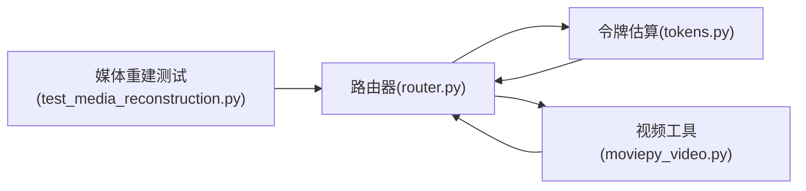

图表来源
- [libs/agno/agno/os/routers/teams/router.py:220-253](file://libs/agno/agno/os/routers/teams/router.py#L220-L253)
- [libs/agno/agno/utils/tokens.py:501-531](file://libs/agno/agno/utils/tokens.py#L501-L531)
- [libs/agno/agno/tools/moviepy_video.py:6-9](file://libs/agno/agno/tools/moviepy_video.py#L6-L9)
- [libs/agno/tests/unit/utils/test_media_reconstruction.py:169-213](file://libs/agno/tests/unit/utils/test_media_reconstruction.py#L169-L213)

章节来源
- [libs/agno/agno/os/routers/teams/router.py:220-253](file://libs/agno/agno/os/routers/teams/router.py#L220-L253)
- [libs/agno/agno/utils/tokens.py:501-531](file://libs/agno/agno/utils/tokens.py#L501-L531)
- [libs/agno/agno/tools/moviepy_video.py:6-9](file://libs/agno/agno/tools/moviepy_video.py#L6-L9)
- [libs/agno/tests/unit/utils/test_media_reconstruction.py:169-213](file://libs/agno/tests/unit/utils/test_media_reconstruction.py#L169-L213)

## 性能考虑
- 输入格式与体积
  - 图片/音频/视频的 MIME 类型与尺寸直接影响 token 估算与处理开销；优先使用标准格式与合理分辨率。
- 令牌估算
  - 音频按时长估算 token；视频按帧序列估算 token；在高分辨率与高帧率场景下，token 成本显著上升。
- 流式输出
  - 在音频转写与情感分析中使用流式输出，可降低首屏延迟并改善用户体验。
- 工具链优化
  - 视频处理应尽量串行且按需启用工具，避免不必要的中间产物；对大文件建议分段处理或降采样。
- 存储与复用
  - 对于需要重复使用的媒体，开启存储可减少重复传输与计算。

章节来源
- [libs/agno/agno/utils/tokens.py:501-531](file://libs/agno/agno/utils/tokens.py#L501-L531)
- [cookbook/02_agents/12_multimodal/audio_to_text.py:32-36](file://cookbook/02_agents/12_multimodal/audio_to_text.py#L32-L36)
- [cookbook/02_agents/12_multimodal/audio_sentiment_analysis.py:35-46](file://cookbook/02_agents/12_multimodal/audio_sentiment_analysis.py#L35-L46)

## 故障排查指南
- 缺少视频处理依赖
  - 现象：导入 MoviePyVideoTools 抛出 ImportError，提示安装 moviepy 与 ffmpeg。
  - 处理：按照错误提示安装依赖后重试。
  - 参考路径：[libs/agno/agno/tools/moviepy_video.py:6-9](file://libs/agno/agno/tools/moviepy_video.py#L6-L9)
- 媒体类型不匹配
  - 现象：上传非支持类型的媒体导致处理失败。
  - 处理：确认上传媒体的 MIME 类型在路由器支持范围内；必要时转换格式。
  - 参考路径：[libs/agno/agno/os/routers/teams/router.py:220-253](file://libs/agno/agno/os/routers/teams/router.py#L220-L253)
- 媒体重建异常
  - 现象：多媒体对象在传输后无法正确重建。
  - 处理：检查编码/解码流程；参考单元测试中的重建逻辑。
  - 参考路径：[libs/agno/tests/unit/utils/test_media_reconstruction.py:169-213](file://libs/agno/tests/unit/utils/test_media_reconstruction.py#L169-L213)

章节来源
- [libs/agno/agno/tools/moviepy_video.py:6-9](file://libs/agno/agno/tools/moviepy_video.py#L6-L9)
- [libs/agno/agno/os/routers/teams/router.py:220-253](file://libs/agno/agno/os/routers/teams/router.py#L220-L253)
- [libs/agno/tests/unit/utils/test_media_reconstruction.py:169-213](file://libs/agno/tests/unit/utils/test_media_reconstruction.py#L169-L213)

## 结论
团队多模态系统通过“单智能体多模态范式 + 团队协作工作流”的双轨设计，覆盖图像、音频、视频等主流媒体形态，并提供从输入处理、工具集成到输出整合的完整闭环。借助明确的角色分工、结构化输出与流式体验，团队可在知识问答、创意生成、内容生产等场景高效落地。建议在实际部署中关注依赖安装、媒体格式与令牌估算，结合流式输出与工具链优化，持续迭代性能与稳定性。

## 附录
- 快速定位示例
  - 图像到文本：[cookbook/02_agents/12_multimodal/image_to_text.py:1-32](file://cookbook/02_agents/12_multimodal/image_to_text.py#L1-L32)
  - 音频到文本/情感分析：[cookbook/02_agents/12_multimodal/audio_to_text.py:1-37](file://cookbook/02_agents/12_multimodal/audio_to_text.py#L1-L37)，[cookbook/02_agents/12_multimodal/audio_sentiment_analysis.py:1-47](file://cookbook/02_agents/12_multimodal/audio_sentiment_analysis.py#L1-L47)
  - 视频字幕生成：[cookbook/02_agents/12_multimodal/video_caption.py:1-47](file://cookbook/02_agents/12_multimodal/video_caption.py#L1-L47)
  - 结构化输出：[cookbook/02_agents/12_multimodal/image_to_structured_output.py:1-49](file://cookbook/02_agents/12_multimodal/image_to_structured_output.py#L1-L49)
  - 工具侧媒体访问：[cookbook/02_agents/12_multimodal/media_input_for_tool.py:1-122](file://cookbook/02_agents/12_multimodal/media_input_for_tool.py#L1-L122)
  - 团队协作：图像故事创作、图像生成、视频字幕生成
    - [cookbook/03_teams/19_multimodal/image_to_text.py:1-63](file://cookbook/03_teams/19_multimodal/image_to_text.py#L1-L63)
    - [cookbook/03_teams/19_multimodal/generate_image_with_team.py:1-68](file://cookbook/03_teams/19_multimodal/generate_image_with_team.py#L1-L68)
    - [cookbook/03_teams/19_multimodal/video_caption_generation.py:1-65](file://cookbook/03_teams/19_multimodal/video_caption_generation.py#L1-L65)