# 图像处理

<cite>
**本文引用的文件**   
- [libs/agno/agno/media.py](file://libs/agno/agno/media.py)
- [libs/agno/agno/tools/opencv.py](file://libs/agno/agno/tools/opencv.py)
- [libs/agno/agno/tools/fal.py](file://libs/agno/agno/tools/fal.py)
- [cookbook/02_agents/12_multimodal/image_to_text.py](file://cookbook/02_agents/12_multimodal/image_to_text.py)
- [cookbook/02_agents/12_multimodal/image_to_image.py](file://cookbook/02_agents/12_multimodal/image_to_image.py)
- [cookbook/02_agents/12_multimodal/image_to_structured_output.py](file://cookbook/02_agents/12_multimodal/image_to_structured_output.py)
- [cookbook/02_agents/12_multimodal/image_to_audio.py](file://cookbook/02_agents/12_multimodal/image_to_audio.py)
- [cookbook/03_teams/19_multimodal/image_to_text.py](file://cookbook/03_teams/19_multimodal/image_to_text.py)
- [cookbook/03_teams/19_multimodal/image_to_structured_output.py](file://cookbook/03_teams/19_multimodal/image_to_structured_output.py)
- [cookbook/03_teams/19_multimodal/image_to_image_transformation.py](file://cookbook/03_teams/19_multimodal/image_to_image_transformation.py)
- [cookbook/03_teams/19_multimodal/generate_image_with_team.py](file://cookbook/03_teams/19_multimodal/generate_image_with_team.py)
- [cookbook/90_models/anthropic/image_input_url.py](file://cookbook/90_models/anthropic/image_input_url.py)
- [cookbook/90_models/anthropic/image_input_local_file.py](file://cookbook/90_models/anthropic/image_input_local_file.py)
- [cookbook/90_models/anthropic/image_input_bytes.py](file://cookbook/90_models/anthropic/image_input_bytes.py)
- [cookbook/91_tools/opencv_tools.py](file://cookbook/91_tools/opencv_tools.py)
- [libs/agno/tests/integration/workflows/test_parallel_steps.py](file://libs/agno/tests/integration/workflows/test_parallel_steps.py)
</cite>

## 目录
1. [简介](#简介)
2. [项目结构](#项目结构)
3. [核心组件](#核心组件)
4. [架构总览](#架构总览)
5. [详细组件分析](#详细组件分析)
6. [依赖关系分析](#依赖关系分析)
7. [性能考虑](#性能考虑)
8. [故障排查指南](#故障排查指南)
9. [结论](#结论)
10. [附录](#附录)

## 简介
本章节系统性梳理团队在图像处理方面的能力与实践，覆盖从“图像到文本”“图像到图像”“图像到结构化输出”，以及“图像生成”的完整链路；并详解图像输入格式（本地文件、URL、字节数据）的统一处理方式，图像分析工具（如 OCR、分类、检测）与图像生成模型（如 DALL·E、Fal AI）的配置与使用方法。文档同时提供多场景实战案例路径与可视化流程图，帮助读者快速落地文档分析、图像增强、风格转换与创意生成等应用，并总结优化技巧与最佳实践。

## 项目结构
围绕图像处理的关键代码分布在以下模块：
- 统一媒体模型：用于标准化图像/音频/视频输入输出，支持多种来源与序列化
- 工具集：OpenCV 工具（摄像头采集）、Fal AI 工具（图像/视频生成）
- 示例与用法：单智能体与团队协作的多模态图像任务
- 输入格式示例：Anthropic 模型的 URL、本地文件、字节三种输入方式

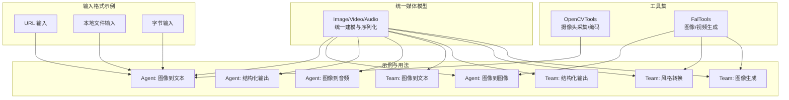

**图表来源**
- [libs/agno/agno/media.py:10-113](file://libs/agno/agno/media.py#L10-L113)
- [libs/agno/agno/tools/opencv.py:18-41](file://libs/agno/agno/tools/opencv.py#L18-L41)
- [libs/agno/agno/tools/fal.py:22-44](file://libs/agno/agno/tools/fal.py#L22-L44)
- [cookbook/02_agents/12_multimodal/image_to_text.py:17-31](file://cookbook/02_agents/12_multimodal/image_to_text.py#L17-L31)
- [cookbook/02_agents/12_multimodal/image_to_image.py:15-27](file://cookbook/02_agents/12_multimodal/image_to_image.py#L15-L27)
- [cookbook/02_agents/12_multimodal/image_to_structured_output.py:31-45](file://cookbook/02_agents/12_multimodal/image_to_structured_output.py#L31-L45)
- [cookbook/02_agents/12_multimodal/image_to_audio.py:22-49](file://cookbook/02_agents/12_multimodal/image_to_audio.py#L22-L49)
- [cookbook/03_teams/19_multimodal/image_to_text.py:18-52](file://cookbook/03_teams/19_multimodal/image_to_text.py#L18-L52)
- [cookbook/03_teams/19_multimodal/image_to_structured_output.py:32-66](file://cookbook/03_teams/19_multimodal/image_to_structured_output.py#L32-L66)
- [cookbook/03_teams/19_multimodal/image_to_image_transformation.py:16-52](file://cookbook/03_teams/19_multimodal/image_to_image_transformation.py#L16-L52)
- [cookbook/03_teams/19_multimodal/generate_image_with_team.py:20-54](file://cookbook/03_teams/19_multimodal/generate_image_with_team.py#L20-L54)
- [cookbook/90_models/anthropic/image_input_url.py:17-31](file://cookbook/90_models/anthropic/image_input_url.py#L17-L31)
- [cookbook/90_models/anthropic/image_input_local_file.py:28-36](file://cookbook/90_models/anthropic/image_input_local_file.py#L28-L36)
- [cookbook/90_models/anthropic/image_input_bytes.py:20-42](file://cookbook/90_models/anthropic/image_input_bytes.py#L20-L42)

**章节来源**
- [libs/agno/agno/media.py:10-113](file://libs/agno/agno/media.py#L10-L113)
- [libs/agno/agno/tools/opencv.py:18-41](file://libs/agno/agno/tools/opencv.py#L18-L41)
- [libs/agno/agno/tools/fal.py:22-44](file://libs/agno/agno/tools/fal.py#L22-L44)
- [cookbook/02_agents/12_multimodal/image_to_text.py:17-31](file://cookbook/02_agents/12_multimodal/image_to_text.py#L17-L31)
- [cookbook/02_agents/12_multimodal/image_to_image.py:15-27](file://cookbook/02_agents/12_multimodal/image_to_image.py#L15-L27)
- [cookbook/02_agents/12_multimodal/image_to_structured_output.py:31-45](file://cookbook/02_agents/12_multimodal/image_to_structured_output.py#L31-L45)
- [cookbook/02_agents/12_multimodal/image_to_audio.py:22-49](file://cookbook/02_agents/12_multimodal/image_to_audio.py#L22-L49)
- [cookbook/03_teams/19_multimodal/image_to_text.py:18-52](file://cookbook/03_teams/19_multimodal/image_to_text.py#L18-L52)
- [cookbook/03_teams/19_multimodal/image_to_structured_output.py:32-66](file://cookbook/03_teams/19_multimodal/image_to_structured_output.py#L32-L66)
- [cookbook/03_teams/19_multimodal/image_to_image_transformation.py:16-52](file://cookbook/03_teams/19_multimodal/image_to_image_transformation.py#L16-L52)
- [cookbook/03_teams/19_multimodal/generate_image_with_team.py:20-54](file://cookbook/03_teams/19_multimodal/generate_image_with_team.py#L20-L54)
- [cookbook/90_models/anthropic/image_input_url.py:17-31](file://cookbook/90_models/anthropic/image_input_url.py#L17-L31)
- [cookbook/90_models/anthropic/image_input_local_file.py:28-36](file://cookbook/90_models/anthropic/image_input_local_file.py#L28-L36)
- [cookbook/90_models/anthropic/image_input_bytes.py:20-42](file://cookbook/90_models/anthropic/image_input_bytes.py#L20-L42)

## 核心组件
- 统一图像模型（Image）：支持 url、filepath、content 三类输入来源，自动校验与归一化为字节流，提供 base64 编解码、元数据字段与工具输出映射
- OpenCV 工具（OpenCVTools）：封装摄像头图像/视频采集，兼容多平台后端，支持预览与录制
- Fal AI 工具（FalTools）：封装远程图像/视频生成与图像到图像变换，支持队列日志回调与结果解析
- 多模态 Agent 示例：涵盖图像到文本、图像到图像、图像到结构化输出、图像到音频等典型任务
- 团队协作示例：以角色分工实现更复杂的图像理解与生成流水线（风格规划、提示工程、生成与转换）

**章节来源**
- [libs/agno/agno/media.py:10-113](file://libs/agno/agno/media.py#L10-L113)
- [libs/agno/agno/tools/opencv.py:18-41](file://libs/agno/agno/tools/opencv.py#L18-L41)
- [libs/agno/agno/tools/fal.py:22-44](file://libs/agno/agno/tools/fal.py#L22-L44)
- [cookbook/02_agents/12_multimodal/image_to_text.py:17-31](file://cookbook/02_agents/12_multimodal/image_to_text.py#L17-L31)
- [cookbook/02_agents/12_multimodal/image_to_image.py:15-27](file://cookbook/02_agents/12_multimodal/image_to_image.py#L15-L27)
- [cookbook/02_agents/12_multimodal/image_to_structured_output.py:31-45](file://cookbook/02_agents/12_multimodal/image_to_structured_output.py#L31-L45)
- [cookbook/02_agents/12_multimodal/image_to_audio.py:22-49](file://cookbook/02_agents/12_multimodal/image_to_audio.py#L22-L49)
- [cookbook/03_teams/19_multimodal/image_to_text.py:18-52](file://cookbook/03_teams/19_multimodal/image_to_text.py#L18-L52)
- [cookbook/03_teams/19_multimodal/image_to_structured_output.py:32-66](file://cookbook/03_teams/19_multimodal/image_to_structured_output.py#L32-L66)
- [cookbook/03_teams/19_multimodal/image_to_image_transformation.py:16-52](file://cookbook/03_teams/19_multimodal/image_to_image_transformation.py#L16-L52)
- [cookbook/03_teams/19_multimodal/generate_image_with_team.py:20-54](file://cookbook/03_teams/19_multimodal/generate_image_with_team.py#L20-L54)

## 架构总览
下图展示了从“图像输入”到“多模态处理/生成”的整体架构，以及团队协作与工具集成的关键节点。

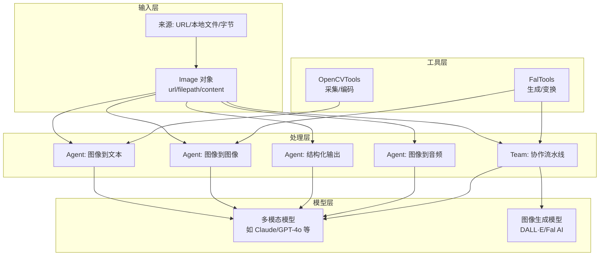

**图表来源**
- [libs/agno/agno/media.py:10-113](file://libs/agno/agno/media.py#L10-L113)
- [libs/agno/agno/tools/opencv.py:18-41](file://libs/agno/agno/tools/opencv.py#L18-L41)
- [libs/agno/agno/tools/fal.py:22-44](file://libs/agno/agno/tools/fal.py#L22-L44)
- [cookbook/02_agents/12_multimodal/image_to_text.py:17-31](file://cookbook/02_agents/12_multimodal/image_to_text.py#L17-L31)
- [cookbook/02_agents/12_multimodal/image_to_image.py:15-27](file://cookbook/02_agents/12_multimodal/image_to_image.py#L15-L27)
- [cookbook/02_agents/12_multimodal/image_to_structured_output.py:31-45](file://cookbook/02_agents/12_multimodal/image_to_structured_output.py#L31-L45)
- [cookbook/02_agents/12_multimodal/image_to_audio.py:22-49](file://cookbook/02_agents/12_multimodal/image_to_audio.py#L22-L49)
- [cookbook/03_teams/19_multimodal/image_to_text.py:18-52](file://cookbook/03_teams/19_multimodal/image_to_text.py#L18-L52)
- [cookbook/03_teams/19_multimodal/image_to_structured_output.py:32-66](file://cookbook/03_teams/19_multimodal/image_to_structured_output.py#L32-L66)
- [cookbook/03_teams/19_multimodal/image_to_image_transformation.py:16-52](file://cookbook/03_teams/19_multimodal/image_to_image_transformation.py#L16-L52)
- [cookbook/03_teams/19_multimodal/generate_image_with_team.py:20-54](file://cookbook/03_teams/19_multimodal/generate_image_with_team.py#L20-L54)

## 详细组件分析

### 统一图像模型（Image）
- 能力概览
  - 支持三种输入来源：url（远程地址）、filepath（本地路径）、content（原始字节）
  - 自动校验并归一化为字节流，便于跨模型与工具传输
  - 提供 base64 编解码、元数据（格式、MIME、细节级别等）与工具输出映射
- 关键行为
  - get_content_bytes：按优先级加载字节（内存>URL>本地）
  - to_base64/from_base64：序列化/反序列化
  - to_dict：可选包含 base64 内容，便于 API 输出
- 典型用法路径
  - [libs/agno/agno/media.py:54-94](file://libs/agno/agno/media.py#L54-L94)

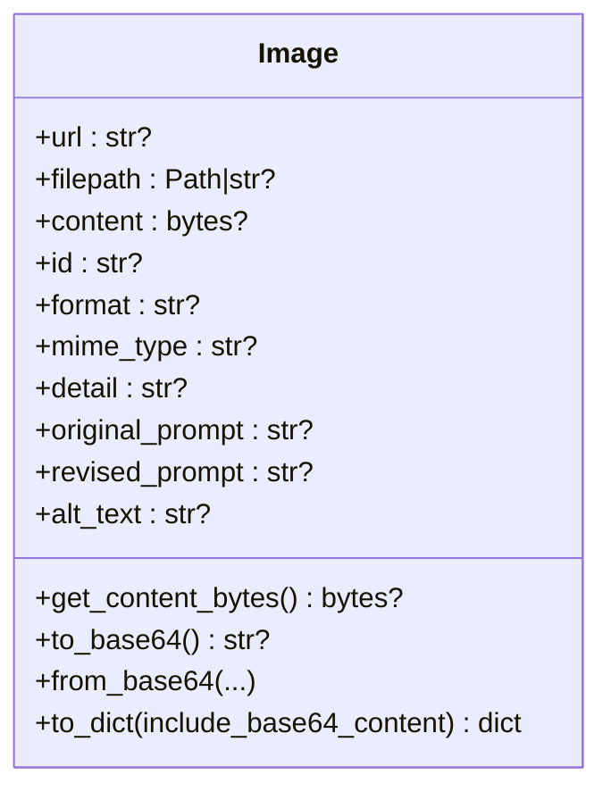

**图表来源**
- [libs/agno/agno/media.py:10-113](file://libs/agno/agno/media.py#L10-L113)

**章节来源**
- [libs/agno/agno/media.py:10-113](file://libs/agno/agno/media.py#L10-L113)

### OpenCV 工具（OpenCVTools）
- 能力概览
  - 摄像头图像采集：支持多平台后端探测、预览窗口、按键控制
  - 摄像头视频录制：自适应帧率与编解码器选择，临时文件写入与清理
  - 可配置启用项：全量开启或仅启用特定功能
- 关键行为
  - capture_image：捕获单帧并编码为 PNG 字节，返回 Image 对象
  - capture_video：录制指定时长视频，返回 Video 对象
- 典型用法路径
  - [libs/agno/agno/tools/opencv.py:43-146](file://libs/agno/agno/tools/opencv.py#L43-L146)
  - [libs/agno/agno/tools/opencv.py:147-322](file://libs/agno/agno/tools/opencv.py#L147-L322)
  - [cookbook/91_tools/opencv_tools.py:116-136](file://cookbook/91_tools/opencv_tools.py#L116-L136)

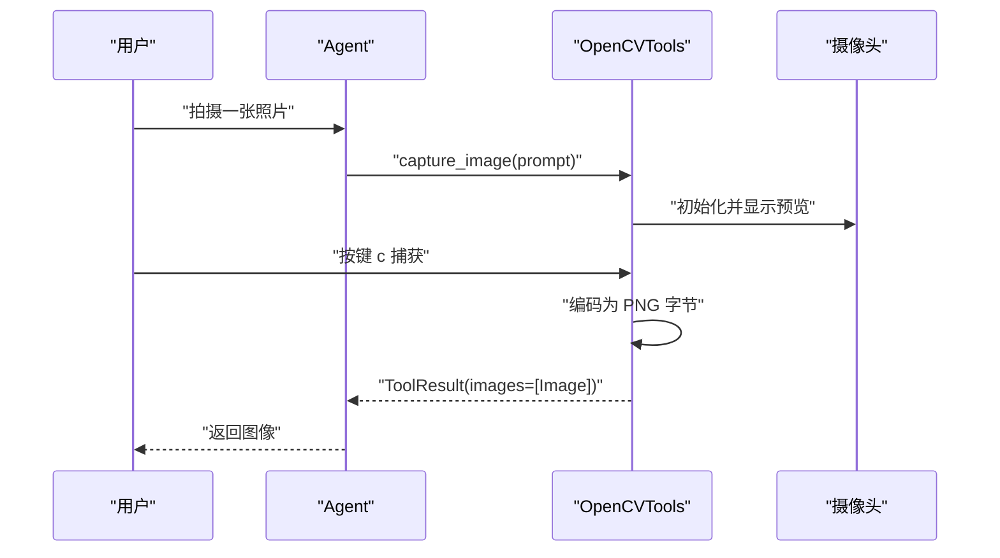

**图表来源**
- [libs/agno/agno/tools/opencv.py:43-146](file://libs/agno/agno/tools/opencv.py#L43-L146)
- [cookbook/91_tools/opencv_tools.py:116-136](file://cookbook/91_tools/opencv_tools.py#L116-L136)

**章节来源**
- [libs/agno/agno/tools/opencv.py:18-41](file://libs/agno/agno/tools/opencv.py#L18-L41)
- [libs/agno/agno/tools/opencv.py:43-146](file://libs/agno/agno/tools/opencv.py#L43-L146)
- [libs/agno/agno/tools/opencv.py:147-322](file://libs/agno/agno/tools/opencv.py#L147-L322)
- [cookbook/91_tools/opencv_tools.py:116-136](file://cookbook/91_tools/opencv_tools.py#L116-L136)

### Fal AI 工具（FalTools）
- 能力概览
  - generate_media：订阅模型生成图像或视频，解析结果并返回 Artifact
  - image_to_image：基于输入图像与提示进行风格/内容变换
  - 队列日志回调：去重打印运行日志
- 关键行为
  - 订阅模型、解析结果、构造 Image/Video 对象
  - 错误处理与异常返回
- 典型用法路径
  - [libs/agno/agno/tools/fal.py:54-94](file://libs/agno/agno/tools/fal.py#L54-L94)
  - [libs/agno/agno/tools/fal.py:95-128](file://libs/agno/agno/tools/fal.py#L95-L128)
  - [cookbook/02_agents/12_multimodal/image_to_image.py:15-37](file://cookbook/02_agents/12_multimodal/image_to_image.py#L15-L37)
  - [cookbook/03_teams/19_multimodal/image_to_image_transformation.py:16-52](file://cookbook/03_teams/19_multimodal/image_to_image_transformation.py#L16-L52)
  - [cookbook/03_teams/19_multimodal/generate_image_with_team.py:20-54](file://cookbook/03_teams/19_multimodal/generate_image_with_team.py#L20-L54)

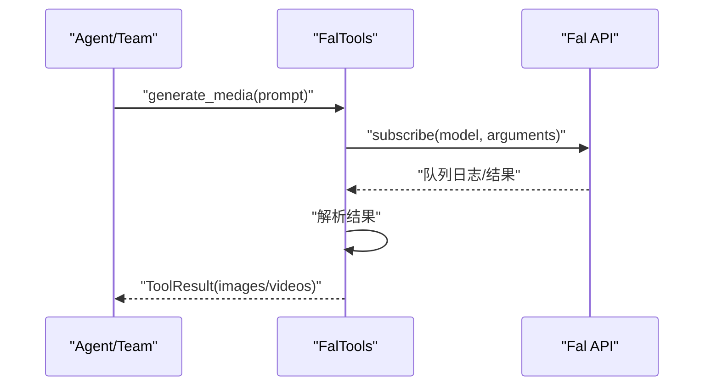

**图表来源**
- [libs/agno/agno/tools/fal.py:54-94](file://libs/agno/agno/tools/fal.py#L54-L94)
- [cookbook/02_agents/12_multimodal/image_to_image.py:15-37](file://cookbook/02_agents/12_multimodal/image_to_image.py#L15-L37)
- [cookbook/03_teams/19_multimodal/generate_image_with_team.py:20-54](file://cookbook/03_teams/19_multimodal/generate_image_with_team.py#L20-L54)

**章节来源**
- [libs/agno/agno/tools/fal.py:22-44](file://libs/agno/agno/tools/fal.py#L22-L44)
- [libs/agno/agno/tools/fal.py:54-94](file://libs/agno/agno/tools/fal.py#L54-L94)
- [libs/agno/agno/tools/fal.py:95-128](file://libs/agno/agno/tools/fal.py#L95-L128)
- [cookbook/02_agents/12_multimodal/image_to_image.py:15-37](file://cookbook/02_agents/12_multimodal/image_to_image.py#L15-L37)
- [cookbook/03_teams/19_multimodal/image_to_image_transformation.py:16-52](file://cookbook/03_teams/19_multimodal/image_to_image_transformation.py#L16-L52)
- [cookbook/03_teams/19_multimodal/generate_image_with_team.py:20-54](file://cookbook/03_teams/19_multimodal/generate_image_with_team.py#L20-L54)

### 图像到文本（Agent）
- 场景：基于图像生成描述、故事或摘要
- 关键点：Agent 接收 images 参数，模型支持多模态理解
- 典型用法路径
  - [cookbook/02_agents/12_multimodal/image_to_text.py:17-31](file://cookbook/02_agents/12_multimodal/image_to_text.py#L17-L31)
  - [cookbook/03_teams/19_multimodal/image_to_text.py:18-52](file://cookbook/03_teams/19_multimodal/image_to_text.py#L18-L52)

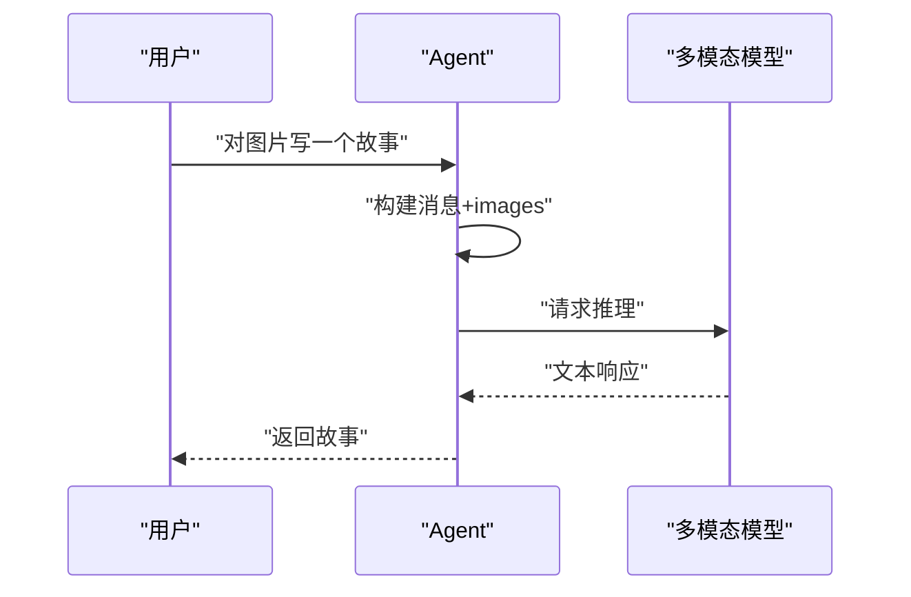

**图表来源**
- [cookbook/02_agents/12_multimodal/image_to_text.py:17-31](file://cookbook/02_agents/12_multimodal/image_to_text.py#L17-L31)
- [cookbook/03_teams/19_multimodal/image_to_text.py:18-52](file://cookbook/03_teams/19_multimodal/image_to_text.py#L18-L52)

**章节来源**
- [cookbook/02_agents/12_multimodal/image_to_text.py:17-31](file://cookbook/02_agents/12_multimodal/image_to_text.py#L17-L31)
- [cookbook/03_teams/19_multimodal/image_to_text.py:18-52](file://cookbook/03_teams/19_multimodal/image_to_text.py#L18-L52)

### 图像到图像（Agent/Team）
- 场景：基于提示对现有图像进行风格/内容变换
- 关键点：FalTools.image_to_image 作为工具被 Agent/Team 调用
- 典型用法路径
  - [cookbook/02_agents/12_multimodal/image_to_image.py:15-37](file://cookbook/02_agents/12_multimodal/image_to_image.py#L15-L37)
  - [cookbook/03_teams/19_multimodal/image_to_image_transformation.py:16-52](file://cookbook/03_teams/19_multimodal/image_to_image_transformation.py#L16-L52)

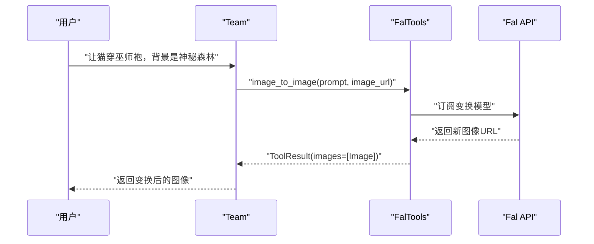

**图表来源**
- [cookbook/02_agents/12_multimodal/image_to_image.py:15-37](file://cookbook/02_agents/12_multimodal/image_to_image.py#L15-L37)
- [cookbook/03_teams/19_multimodal/image_to_image_transformation.py:16-52](file://cookbook/03_teams/19_multimodal/image_to_image_transformation.py#L16-L52)
- [libs/agno/agno/tools/fal.py:95-128](file://libs/agno/agno/tools/fal.py#L95-L128)

**章节来源**
- [cookbook/02_agents/12_multimodal/image_to_image.py:15-37](file://cookbook/02_agents/12_multimodal/image_to_image.py#L15-L37)
- [cookbook/03_teams/19_multimodal/image_to_image_transformation.py:16-52](file://cookbook/03_teams/19_multimodal/image_to_image_transformation.py#L16-L52)
- [libs/agno/agno/tools/fal.py:95-128](file://libs/agno/agno/tools/fal.py#L95-L128)

### 图像到结构化输出（Agent/Team）
- 场景：从图像中提取信息并生成结构化剧本/脚本
- 关键点：通过 output_schema 约束输出结构，确保一致性
- 典型用法路径
  - [cookbook/02_agents/12_multimodal/image_to_structured_output.py:31-45](file://cookbook/02_agents/12_multimodal/image_to_structured_output.py#L31-L45)
  - [cookbook/03_teams/19_multimodal/image_to_structured_output.py:32-66](file://cookbook/03_teams/19_multimodal/image_to_structured_output.py#L32-L66)

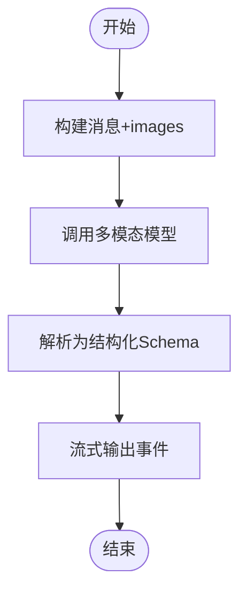

**图表来源**
- [cookbook/02_agents/12_multimodal/image_to_structured_output.py:31-45](file://cookbook/02_agents/12_multimodal/image_to_structured_output.py#L31-L45)
- [cookbook/03_teams/19_multimodal/image_to_structured_output.py:32-66](file://cookbook/03_teams/19_multimodal/image_to_structured_output.py#L32-L66)

**章节来源**
- [cookbook/02_agents/12_multimodal/image_to_structured_output.py:31-45](file://cookbook/02_agents/12_multimodal/image_to_structured_output.py#L31-L45)
- [cookbook/03_teams/19_multimodal/image_to_structured_output.py:32-66](file://cookbook/03_teams/19_multimodal/image_to_structured_output.py#L32-L66)

### 图像到音频（Agent）
- 场景：先图像到文本，再文本到音频（TTS），形成图文音联动
- 关键点：两次 Agent 调用，中间文本作为 TTS 输入
- 典型用法路径
  - [cookbook/02_agents/12_multimodal/image_to_audio.py:22-54](file://cookbook/02_agents/12_multimodal/image_to_audio.py#L22-L54)

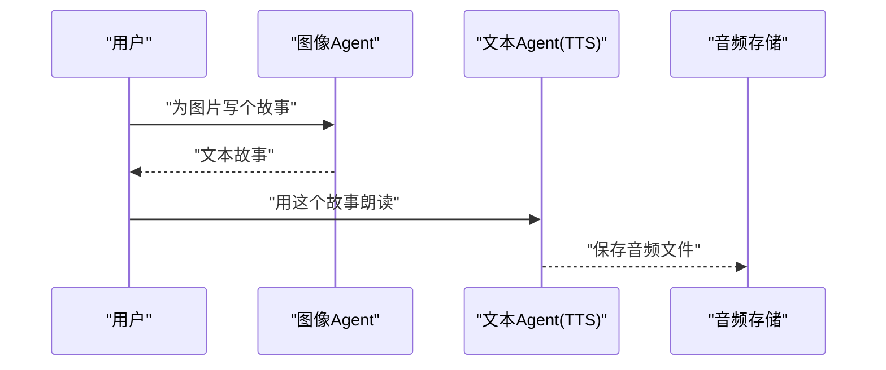

**图表来源**
- [cookbook/02_agents/12_multimodal/image_to_audio.py:22-54](file://cookbook/02_agents/12_multimodal/image_to_audio.py#L22-L54)

**章节来源**
- [cookbook/02_agents/12_multimodal/image_to_audio.py:22-54](file://cookbook/02_agents/12_multimodal/image_to_audio.py#L22-L54)

### 图像输入格式处理（URL/本地文件/字节）
- 能力概览：统一通过 Image(url/filepath/content) 接收，内部自动归一化
- 典型用法路径
  - URL 输入：[cookbook/90_models/anthropic/image_input_url.py:17-31](file://cookbook/90_models/anthropic/image_input_url.py#L17-L31)
  - 本地文件输入：[cookbook/90_models/anthropic/image_input_local_file.py:28-36](file://cookbook/90_models/anthropic/image_input_local_file.py#L28-L36)
  - 字节输入：[cookbook/90_models/anthropic/image_input_bytes.py:20-42](file://cookbook/90_models/anthropic/image_input_bytes.py#L20-L42)

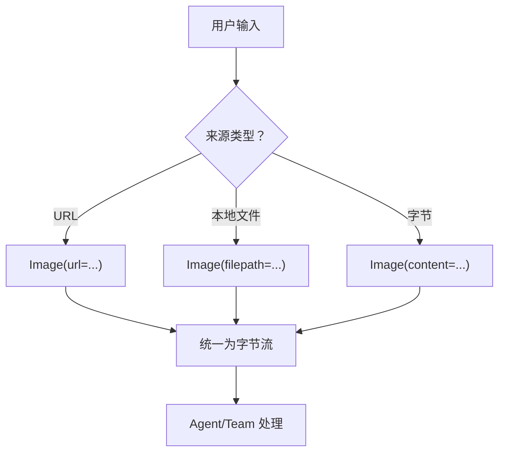

**图表来源**
- [libs/agno/agno/media.py:54-65](file://libs/agno/agno/media.py#L54-L65)
- [cookbook/90_models/anthropic/image_input_url.py:17-31](file://cookbook/90_models/anthropic/image_input_url.py#L17-L31)
- [cookbook/90_models/anthropic/image_input_local_file.py:28-36](file://cookbook/90_models/anthropic/image_input_local_file.py#L28-L36)
- [cookbook/90_models/anthropic/image_input_bytes.py:20-42](file://cookbook/90_models/anthropic/image_input_bytes.py#L20-L42)

**章节来源**
- [libs/agno/agno/media.py:54-65](file://libs/agno/agno/media.py#L54-L65)
- [cookbook/90_models/anthropic/image_input_url.py:17-31](file://cookbook/90_models/anthropic/image_input_url.py#L17-L31)
- [cookbook/90_models/anthropic/image_input_local_file.py:28-36](file://cookbook/90_models/anthropic/image_input_local_file.py#L28-L36)
- [cookbook/90_models/anthropic/image_input_bytes.py:20-42](file://cookbook/90_models/anthropic/image_input_bytes.py#L20-L42)

## 依赖关系分析
- 组件耦合
  - Agent/Team 依赖 Image 统一模型与工具集（OpenCV/Fal）
  - 工具集依赖外部库（OpenCV/Fal SDK），需正确安装与权限配置
- 流程耦合
  - 图像到结构化输出依赖 Pydantic Schema 约束
  - 图像到图像依赖 Fal API Key 与模型可用性
- 可能的循环依赖
  - 当前结构为单向依赖（Agent/Team -> 工具 -> 外部服务），无循环

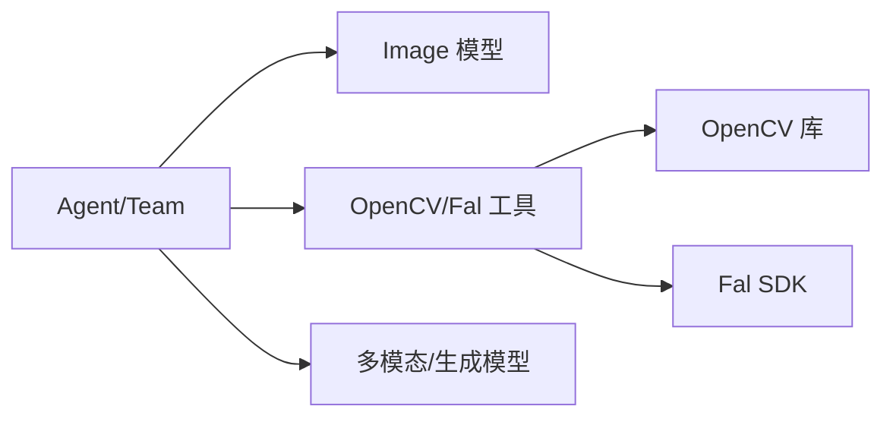

**图表来源**
- [libs/agno/agno/media.py:10-113](file://libs/agno/agno/media.py#L10-L113)
- [libs/agno/agno/tools/opencv.py:12-15](file://libs/agno/agno/tools/opencv.py#L12-L15)
- [libs/agno/agno/tools/fal.py:16-19](file://libs/agno/agno/tools/fal.py#L16-L19)
- [cookbook/02_agents/12_multimodal/image_to_structured_output.py:31-45](file://cookbook/02_agents/12_multimodal/image_to_structured_output.py#L31-L45)
- [cookbook/02_agents/12_multimodal/image_to_image.py:15-37](file://cookbook/02_agents/12_multimodal/image_to_image.py#L15-L37)

**章节来源**
- [libs/agno/agno/media.py:10-113](file://libs/agno/agno/media.py#L10-L113)
- [libs/agno/agno/tools/opencv.py:12-15](file://libs/agno/agno/tools/opencv.py#L12-L15)
- [libs/agno/agno/tools/fal.py:16-19](file://libs/agno/agno/tools/fal.py#L16-L19)
- [cookbook/02_agents/12_multimodal/image_to_structured_output.py:31-45](file://cookbook/02_agents/12_multimodal/image_to_structured_output.py#L31-L45)
- [cookbook/02_agents/12_multimodal/image_to_image.py:15-37](file://cookbook/02_agents/12_multimodal/image_to_image.py#L15-L37)

## 性能考虑
- 输入归一化与缓存
  - 使用 Image.get_content_bytes 自动下载/读取，避免重复 IO；必要时在上层缓存字节流
- 工具调用开销
  - OpenCV 摄像头采集与编码存在 CPU/IO 开销，建议在需要时才启用预览窗口
  - Fal API 订阅可能有排队延迟，建议异步处理与日志去重
- 模型推理
  - 多模态模型对大分辨率图像消耗更高，可通过 Image.detail 或降采样策略降低成本
- 并发与流式
  - 使用流式输出（stream=True）提升交互体验，注意下游处理的背压管理

## 故障排查指南
- OpenCV 工具
  - 摄像头无法打开：检查权限与占用，尝试不同后端（AVFoundation/DShow/V4L2）
  - 录制失败：确认编解码器可用性与临时目录写入权限
  - 参考路径：[libs/agno/agno/tools/opencv.py:56-145](file://libs/agno/agno/tools/opencv.py#L56-L145)
- Fal 工具
  - API Key 未设置：确保环境变量已配置
  - 订阅失败：检查网络与模型可用性，查看日志回调
  - 参考路径：[libs/agno/agno/tools/fal.py:32-93](file://libs/agno/agno/tools/fal.py#L32-L93)
- 图像到结构化输出
  - Schema 不匹配：检查输出模式与约束，必要时放宽或修正提示
  - 参考路径：[cookbook/03_teams/19_multimodal/image_to_structured_output.py:32-66](file://cookbook/03_teams/19_multimodal/image_to_structured_output.py#L32-L66)
- 并行步骤测试
  - 若出现类型断言失败，检查并行步骤是否正确产出 ImageClassification/QualityAssessment
  - 参考路径：[libs/agno/tests/integration/workflows/test_parallel_steps.py:800-815](file://libs/agno/tests/integration/workflows/test_parallel_steps.py#L800-L815)

**章节来源**
- [libs/agno/agno/tools/opencv.py:56-145](file://libs/agno/agno/tools/opencv.py#L56-L145)
- [libs/agno/agno/tools/fal.py:32-93](file://libs/agno/agno/tools/fal.py#L32-L93)
- [cookbook/03_teams/19_multimodal/image_to_structured_output.py:32-66](file://cookbook/03_teams/19_multimodal/image_to_structured_output.py#L32-L66)
- [libs/agno/tests/integration/workflows/test_parallel_steps.py:800-815](file://libs/agno/tests/integration/workflows/test_parallel_steps.py#L800-L815)

## 结论
团队在图像处理方面具备完整的“输入归一化—工具集成—多模态推理—结构化输出/生成”的能力闭环。通过统一的 Image 模型与可插拔工具集，能够灵活适配多种输入来源与任务场景。配合团队协作模式，可进一步实现从“图像理解”到“创意生成”的复杂工作流。建议在实际项目中结合性能与稳定性需求，合理选择输入策略、工具与模型，并建立完善的监控与回退机制。

## 附录
- 最佳实践清单
  - 输入层：优先使用 Image(url/filepath/content)，并在上层做缓存与尺寸控制
  - 工具层：按需启用 OpenCV 预览，录制时选择兼容性更好的编解码器
  - 模型层：根据任务选择合适的多模态/生成模型，关注细节级别与分辨率
  - 输出层：结构化输出使用 Schema 约束，流式输出注意事件聚合与错误处理
- 典型应用场景
  - 文档数字化：图像到文本 + OCR（如需）+ 结构化抽取
  - 图像理解：图像到文本/结构化输出，支撑检索与摘要
  - 视觉内容创作：图像到图像风格转换、创意生成与多模态联动（图文音）