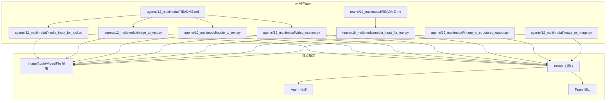
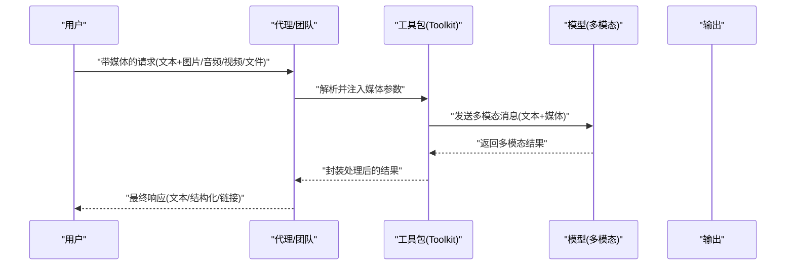
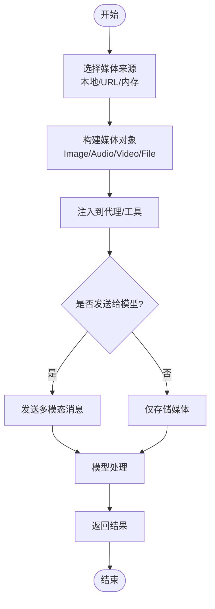
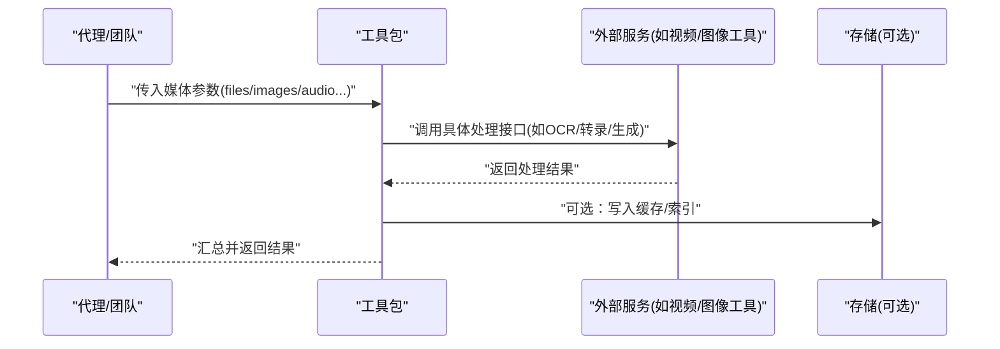
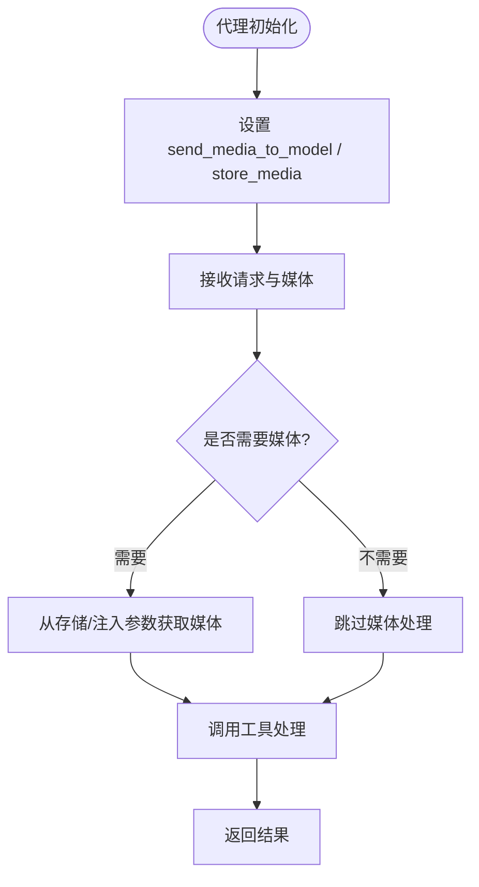
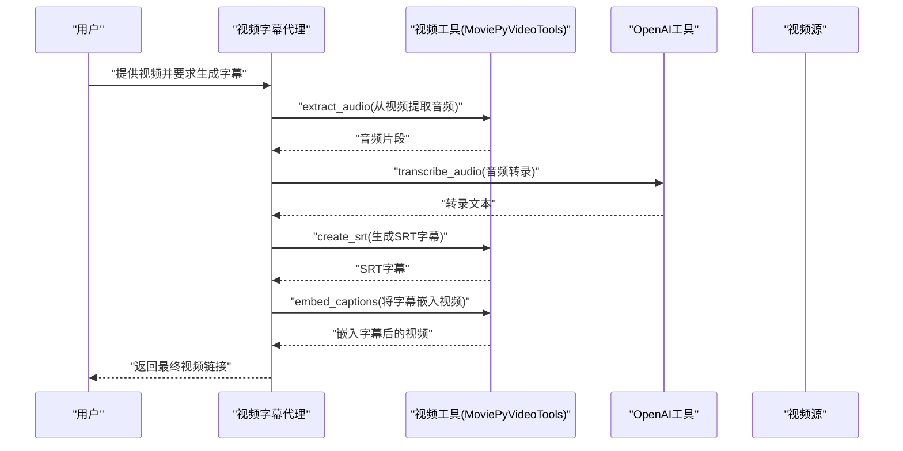
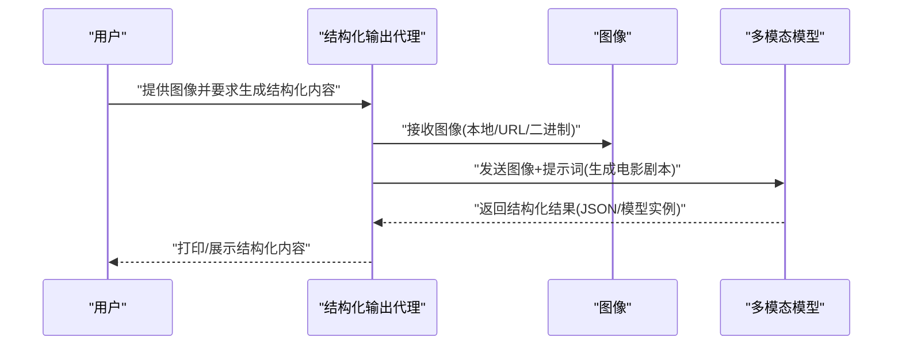
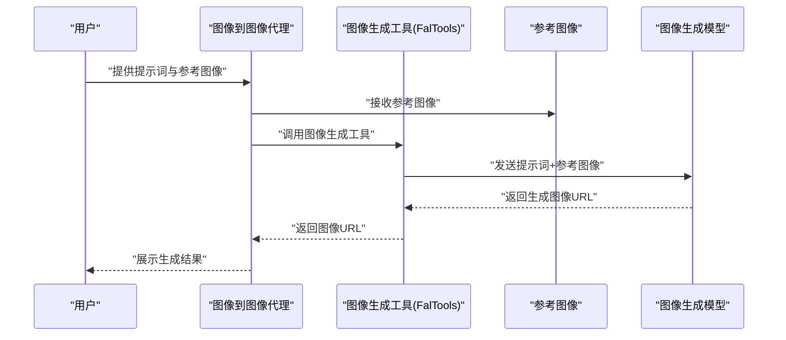
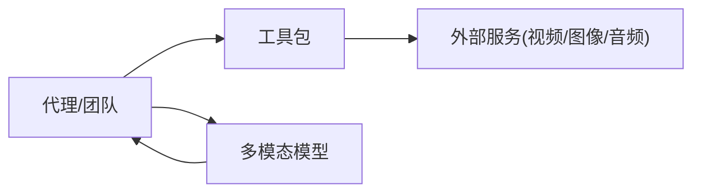

# 媒体集成

<cite>
**本文引用的文件**
- [cookbook/02_agents/12_multimodal/README.md](file://cookbook/02_agents/12_multimodal/README.md)
- [cookbook/03_teams/19_multimodal/README.md](file://cookbook/03_teams/19_multimodal/README.md)
- [cookbook/02_agents/12_multimodal/media_input_for_tool.py](file://cookbook/02_agents/12_multimodal/media_input_for_tool.py)
- [cookbook/02_agents/12_multimodal/image_to_text.py](file://cookbook/02_agents/12_multimodal/image_to_text.py)
- [cookbook/02_agents/12_multimodal/audio_to_text.py](file://cookbook/02_agents/12_multimodal/audio_to_text.py)
- [cookbook/02_agents/12_multimodal/video_caption.py](file://cookbook/02_agents/12_multimodal/video_caption.py)
- [cookbook/03_teams/19_multimodal/media_input_for_tool.py](file://cookbook/03_teams/19_multimodal/media_input_for_tool.py)
- [cookbook/02_agents/12_multimodal/image_to_structured_output.py](file://cookbook/02_agents/12_multimodal/image_to_structured_output.py)
- [cookbook/02_agents/12_multimodal/image_to_image.py](file://cookbook/02_agents/12_multimodal/image_to_image.py)
</cite>

## 目录
1. [简介](#简介)
2. [项目结构](#项目结构)
3. [核心组件](#核心组件)
4. [架构总览](#架构总览)
5. [详细组件分析](#详细组件分析)
6. [依赖分析](#依赖分析)
7. [性能考虑](#性能考虑)
8. [故障排查指南](#故障排查指南)
9. [结论](#结论)
10. [附录](#附录)

## 简介
本文件围绕“团队媒体集成功能”展开，系统性梳理仓库中多模态媒体集成的核心能力与实现路径，重点覆盖以下方面：
- 媒体输入处理：统一接入图像、音频、视频与文件，支持本地文件、URL、二进制内容等多种来源
- 多模态工具组合：通过工具包（Toolkit）封装媒体处理能力，实现跨模态协作与流水线化处理
- 媒体数据流管理：在代理（Agent）与团队（Team）中实现媒体数据的注入、存储与共享
- 格式统一与转换：以抽象的媒体类型（Image/Audio/Video/File）屏蔽底层格式差异，确保上层一致使用体验
- 复杂工作流示例：从媒体预处理到多模态分析再到结果整合的完整链路
- 能力扩展与应用：面向复杂多模态任务、数据分析与内容理解的实际场景
- 优化与最佳实践：缓存策略、性能调优与错误处理建议

## 项目结构
多模态示例主要集中在 cookbook 的 agents 与 teams 子目录中，并辅以若干工具类与测试用例。下图给出与媒体集成相关的关键文件与关系概览。

图表来源
- [cookbook/02_agents/12_multimodal/README.md:1-24](file://cookbook/02_agents/12_multimodal/README.md#L1-L24)
- [cookbook/03_teams/19_multimodal/README.md:1-21](file://cookbook/03_teams/19_multimodal/README.md#L1-L21)
- [cookbook/02_agents/12_multimodal/media_input_for_tool.py:1-122](file://cookbook/02_agents/12_multimodal/media_input_for_tool.py#L1-L122)
- [cookbook/02_agents/12_multimodal/image_to_text.py:1-32](file://cookbook/02_agents/12_multimodal/image_to_text.py#L1-L32)
- [cookbook/02_agents/12_multimodal/audio_to_text.py:1-37](file://cookbook/02_agents/12_multimodal/audio_to_text.py#L1-L37)
- [cookbook/02_agents/12_multimodal/video_caption.py:1-47](file://cookbook/02_agents/12_multimodal/video_caption.py#L1-L47)
- [cookbook/03_teams/19_multimodal/media_input_for_tool.py:1-114](file://cookbook/03_teams/19_multimodal/media_input_for_tool.py#L1-L114)
- [cookbook/02_agents/12_multimodal/image_to_structured_output.py:1-49](file://cookbook/02_agents/12_multimodal/image_to_structured_output.py#L1-L49)
- [cookbook/02_agents/12_multimodal/image_to_image.py:1-37](file://cookbook/02_agents/12_multimodal/image_to_image.py#L1-L37)

章节来源
- [cookbook/02_agents/12_multimodal/README.md:1-24](file://cookbook/02_agents/12_multimodal/README.md#L1-L24)
- [cookbook/03_teams/19_multimodal/README.md:1-21](file://cookbook/03_teams/19_multimodal/README.md#L1-L21)

## 核心组件
- 媒体抽象类型
  - Image：用于图像输入，支持本地路径、URL 或二进制内容
  - Audio：用于音频输入，支持网络下载或内存中的音频字节
  - Video：用于视频输入，可结合视频处理工具进行转码、截帧、提取音频等
  - File：通用文件抽象，常用于文档类（如 PDF）的 OCR 文本抽取
- 工具包（Toolkit）
  - 将媒体处理逻辑封装为可复用的工具函数，供代理或团队直接调用
  - 示例：PDF 文本抽取、视频字幕生成与嵌入、图像风格转换等
- 代理（Agent）与团队（Team）
  - 代理负责接收用户输入与媒体，调度工具并产出结果
  - 团队在代理基础上引入成员与指令，实现更复杂的多步工作流与决策

章节来源
- [cookbook/02_agents/12_multimodal/media_input_for_tool.py:20-72](file://cookbook/02_agents/12_multimodal/media_input_for_tool.py#L20-L72)
- [cookbook/03_teams/19_multimodal/media_input_for_tool.py:17-54](file://cookbook/03_teams/19_multimodal/media_input_for_tool.py#L17-L54)
- [cookbook/02_agents/12_multimodal/video_caption.py:13-38](file://cookbook/02_agents/12_multimodal/video_caption.py#L13-L38)
- [cookbook/02_agents/12_multimodal/image_to_image.py:15-27](file://cookbook/02_agents/12_multimodal/image_to_image.py#L15-L27)

## 架构总览
下图展示了媒体从输入到处理再到输出的整体流程，以及工具与代理/团队之间的交互关系。

图表来源
- [cookbook/02_agents/12_multimodal/media_input_for_tool.py:85-114](file://cookbook/02_agents/12_multimodal/media_input_for_tool.py#L85-L114)
- [cookbook/03_teams/19_multimodal/media_input_for_tool.py:79-113](file://cookbook/03_teams/19_multimodal/media_input_for_tool.py#L79-L113)
- [cookbook/02_agents/12_multimodal/video_caption.py:22-46](file://cookbook/02_agents/12_multimodal/video_caption.py#L22-L46)

## 详细组件分析

### 组件一：媒体输入与统一处理
- 设计要点
  - 使用统一的媒体抽象（Image/Audio/Video/File），屏蔽底层格式差异
  - 支持多种来源：本地文件路径、远程 URL、内存中的二进制内容
  - 在代理初始化时控制是否将媒体直接发送给模型，以及是否持久化媒体
- 关键行为
  - 文件上传：通过 File.content 注入二进制内容，工具侧进行模拟 OCR 或解析
  - 图像输入：通过 Image.filepath 或 Image.url 提供图像
  - 音频输入：通过 Audio.content 或网络下载后注入
  - 视频输入：结合视频处理工具链完成音频提取、转录、字幕生成与嵌入

图表来源
- [cookbook/02_agents/12_multimodal/media_input_for_tool.py:87-96](file://cookbook/02_agents/12_multimodal/media_input_for_tool.py#L87-L96)
- [cookbook/03_teams/19_multimodal/media_input_for_tool.py:79-94](file://cookbook/03_teams/19_multimodal/media_input_for_tool.py#L79-L94)

章节来源
- [cookbook/02_agents/12_multimodal/media_input_for_tool.py:28-71](file://cookbook/02_agents/12_multimodal/media_input_for_tool.py#L28-L71)
- [cookbook/03_teams/19_multimodal/media_input_for_tool.py:24-54](file://cookbook/03_teams/19_multimodal/media_input_for_tool.py#L24-L54)

### 组件二：多模态工具组合与跨模态融合
- 设计要点
  - 工具包将媒体处理能力模块化，便于在不同代理/团队中复用
  - 工具函数可直接访问由代理注入的媒体序列（如 files: Sequence[File]）
  - 可与外部服务（如视频处理、图像生成）配合，形成端到端工作流
- 典型流程
  - PDF 文本抽取：工具接收文件列表，逐个处理并返回结构化文本
  - 视频字幕生成：按顺序执行“提取音频→转录→生成字幕→嵌入字幕”
  - 图像风格转换：通过图像生成工具将提示与参考图像结合生成新图像

图表来源
- [cookbook/02_agents/12_multimodal/media_input_for_tool.py:20-26](file://cookbook/02_agents/12_multimodal/media_input_for_tool.py#L20-L26)
- [cookbook/02_agents/12_multimodal/video_caption.py:13-38](file://cookbook/02_agents/12_multimodal/video_caption.py#L13-L38)
- [cookbook/02_agents/12_multimodal/image_to_image.py:15-27](file://cookbook/02_agents/12_multimodal/image_to_image.py#L15-L27)

章节来源
- [cookbook/02_agents/12_multimodal/media_input_for_tool.py:20-26](file://cookbook/02_agents/12_multimodal/media_input_for_tool.py#L20-L26)
- [cookbook/02_agents/12_multimodal/video_caption.py:13-38](file://cookbook/02_agents/12_multimodal/video_caption.py#L13-L38)
- [cookbook/02_agents/12_multimodal/image_to_image.py:15-27](file://cookbook/02_agents/12_multimodal/image_to_image.py#L15-L27)

### 组件三：媒体数据流管理与状态控制
- 关键配置
  - send_media_to_model：控制是否将媒体二进制直接发送给模型，避免大媒体传输开销
  - store_media：控制媒体是否持久化，便于后续工具访问或审计
- 应用场景
  - 仅需模型推理时，关闭 send_media_to_model 并通过 URL/标识符引用媒体
  - 需要多次复用同一媒体时，开启 store_media 并在工具中直接访问

图表来源
- [cookbook/02_agents/12_multimodal/media_input_for_tool.py:87-96](file://cookbook/02_agents/12_multimodal/media_input_for_tool.py#L87-L96)
- [cookbook/03_teams/19_multimodal/media_input_for_tool.py:79-94](file://cookbook/03_teams/19_multimodal/media_input_for_tool.py#L79-L94)

章节来源
- [cookbook/02_agents/12_multimodal/media_input_for_tool.py:87-96](file://cookbook/02_agents/12_multimodal/media_input_for_tool.py#L87-L96)
- [cookbook/03_teams/19_multimodal/media_input_for_tool.py:79-94](file://cookbook/03_teams/19_multimodal/media_input_for_tool.py#L79-L94)

### 组件四：多模态工作流示例（视频字幕生成）
该示例展示了从视频到字幕再到嵌入的完整链路，体现多模态工具的组合与顺序执行。

图表来源
- [cookbook/02_agents/12_multimodal/video_caption.py:13-38](file://cookbook/02_agents/12_multimodal/video_caption.py#L13-L38)

章节来源
- [cookbook/02_agents/12_multimodal/video_caption.py:13-38](file://cookbook/02_agents/12_multimodal/video_caption.py#L13-L38)

### 组件五：结构化输出与媒体驱动的创作
该示例展示如何基于图像生成结构化输出（如电影剧本），体现“图像→结构化”的多模态能力。

图表来源
- [cookbook/02_agents/12_multimodal/image_to_structured_output.py:31-48](file://cookbook/02_agents/12_multimodal/image_to_structured_output.py#L31-L48)

章节来源
- [cookbook/02_agents/12_multimodal/image_to_structured_output.py:17-26](file://cookbook/02_agents/12_multimodal/image_to_structured_output.py#L17-L26)
- [cookbook/02_agents/12_multimodal/image_to_structured_output.py:31-48](file://cookbook/02_agents/12_multimodal/image_to_structured_output.py#L31-L48)

### 组件六：图像到图像的跨模态生成
该示例展示如何通过图像生成工具将提示与参考图像结合，生成新的图像。

图表来源
- [cookbook/02_agents/12_multimodal/image_to_image.py:15-36](file://cookbook/02_agents/12_multimodal/image_to_image.py#L15-L36)

章节来源
- [cookbook/02_agents/12_multimodal/image_to_image.py:15-36](file://cookbook/02_agents/12_multimodal/image_to_image.py#L15-L36)

## 依赖分析
- 模块耦合
  - 代理与工具包之间通过参数注入解耦，工具仅依赖媒体抽象类型
  - 外部服务（如视频处理、图像生成）通过工具接口接入，降低直接耦合
- 数据共享
  - 通过代理/团队的会话状态与媒体存储实现跨步骤的数据共享
  - 对于大媒体，优先采用 URL 引用而非二进制传输
- 可能的循环依赖
  - 当前示例未见循环导入；若自定义工具内部再次封装代理，需谨慎设计生命周期

图表来源
- [cookbook/02_agents/12_multimodal/media_input_for_tool.py:87-114](file://cookbook/02_agents/12_multimodal/media_input_for_tool.py#L87-L114)
- [cookbook/03_teams/19_multimodal/media_input_for_tool.py:79-113](file://cookbook/03_teams/19_multimodal/media_input_for_tool.py#L79-L113)
- [cookbook/02_agents/12_multimodal/video_caption.py:22-46](file://cookbook/02_agents/12_multimodal/video_caption.py#L22-L46)

章节来源
- [cookbook/02_agents/12_multimodal/media_input_for_tool.py:87-114](file://cookbook/02_agents/12_multimodal/media_input_for_tool.py#L87-L114)
- [cookbook/03_teams/19_multimodal/media_input_for_tool.py:79-113](file://cookbook/03_teams/19_multimodal/media_input_for_tool.py#L79-L113)
- [cookbook/02_agents/12_multimodal/video_caption.py:22-46](file://cookbook/02_agents/12_multimodal/video_caption.py#L22-L46)

## 性能考虑
- 媒体大小与传输
  - 对大体积媒体（如高清视频、高分辨率图像），优先使用 URL 引用并关闭 send_media_to_model，减少传输与内存占用
- 缓存策略
  - 对重复使用的媒体或中间结果（如转录文本、字幕），启用 store_media 并建立索引，避免重复计算
- 工具链并行化
  - 在允许的场景下，将独立的媒体处理步骤并行执行（如多段音频并发转录），并在下游合并结果
- 模型调用优化
  - 合理裁剪输入上下文，仅保留必要的媒体片段与提示词，提升响应速度与成本控制

## 故障排查指南
- 常见问题
  - 媒体无法读取：检查文件路径、URL 可达性与权限；确认媒体格式受支持
  - 工具无响应：确认工具已正确注册到代理/团队，并具备相应权限
  - 结果为空：检查工具参数注入是否生效，必要时开启调试模式观察媒体注入过程
- 排查步骤
  - 打印注入的媒体对象（如 files/images/audio），核对数量与内容
  - 逐步执行工具链（如先验证音频提取，再验证转录），定位失败环节
  - 查看模型返回的错误信息，确认多模态消息格式是否符合预期

章节来源
- [cookbook/02_agents/12_multimodal/media_input_for_tool.py:41-42](file://cookbook/02_agents/12_multimodal/media_input_for_tool.py#L41-L42)
- [cookbook/03_teams/19_multimodal/media_input_for_tool.py:26-27](file://cookbook/03_teams/19_multimodal/media_input_for_tool.py#L26-L27)

## 结论
本仓库提供了完整的多模态媒体集成范式：以统一的媒体抽象为核心，通过工具包实现模块化与可复用的处理能力，并在代理与团队层面实现复杂工作流的编排与执行。借助合理的数据流管理、缓存与性能优化策略，团队能够高效应对图像、音频、视频与文档等多模态任务，支撑数据分析与内容理解等多样化应用场景。

## 附录
- 快速运行示例
  - 进入示例目录，使用提供的 Python 解释器运行对应脚本，即可体验媒体输入、工具调用与结果输出的完整流程
- 进一步阅读
  - 参考 agents 与 teams 的多模态 README，了解各示例的前置条件与运行方式

章节来源
- [cookbook/02_agents/12_multimodal/README.md:17-24](file://cookbook/02_agents/12_multimodal/README.md#L17-L24)
- [cookbook/03_teams/19_multimodal/README.md:5-9](file://cookbook/03_teams/19_multimodal/README.md#L5-L9)