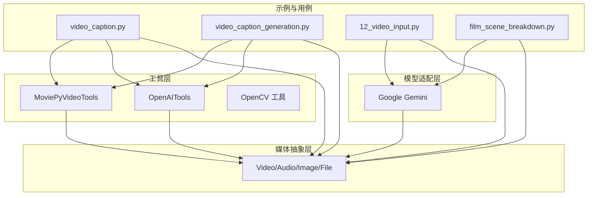
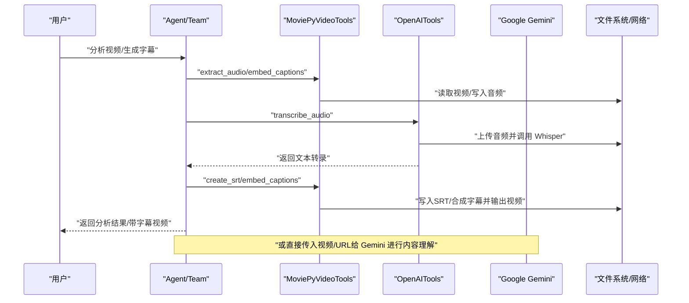
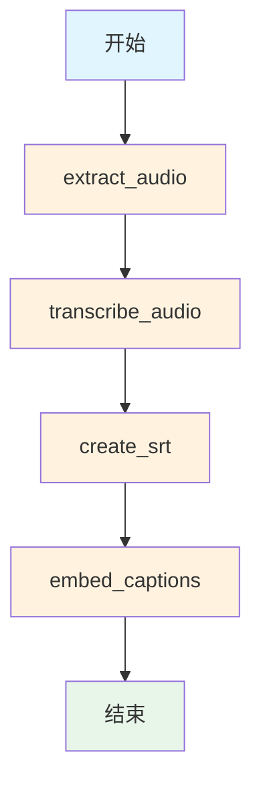
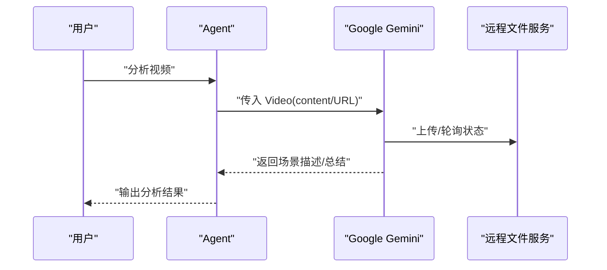
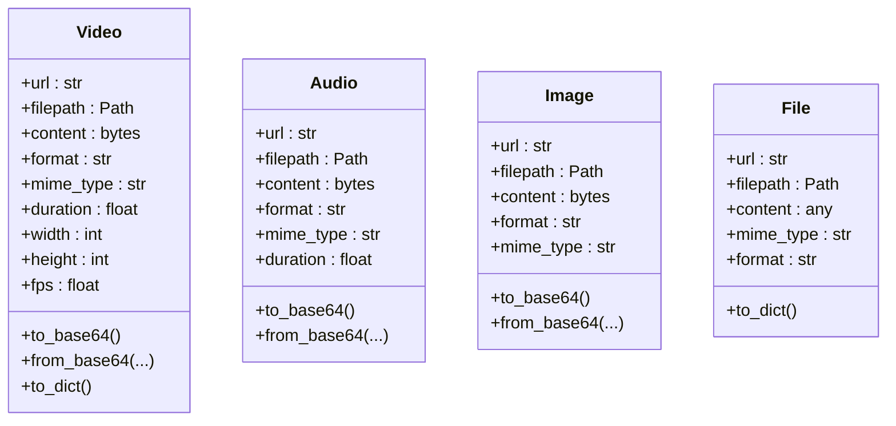
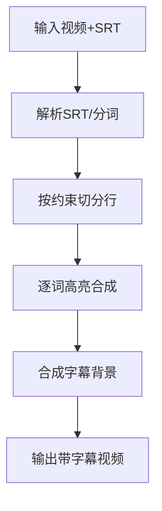
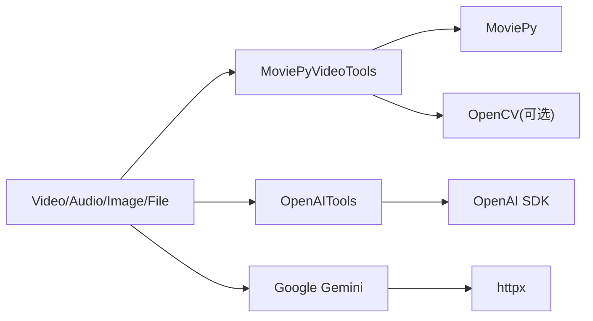

# 视频处理

<cite>
**本文引用的文件**
- [libs/agno/agno/tools/moviepy_video.py](file://libs/agno/agno/tools/moviepy_video.py)
- [libs/agno/agno/tools/openai.py](file://libs/agno/agno/tools/openai.py)
- [libs/agno/agno/media.py](file://libs/agno/agno/media.py)
- [libs/agno/agno/models/google/gemini.py](file://libs/agno/agno/models/google/gemini.py)
- [cookbook/02_agents/12_multimodal/video_caption.py](file://cookbook/02_agents/12_multimodal/video_caption.py)
- [cookbook/03_teams/19_multimodal/video_caption_generation.py](file://cookbook/03_teams/19_multimodal/video_caption_generation.py)
- [cookbook/gemini_3/12_video_input.py](file://cookbook/gemini_3/12_video_input.py)
- [cookbook/gemini_3/use_cases/film_scene_breakdown.py](file://cookbook/gemini_3/use_cases/film_scene_breakdown.py)
- [libs/agno/agno/models/message.py](file://libs/agno/agno/models/message.py)
- [libs/agno/agno/tools/opencv.py](file://libs/agno/agno/tools/opencv.py)
- [cookbook/04_workflows/05_conditional_branching/selector_media_pipeline.md](file://cookbook/04_workflows/05_conditional_branching/selector_media_pipeline.md)
</cite>

## 目录
1. [简介](#简介)
2. [项目结构](#项目结构)
3. [核心组件](#核心组件)
4. [架构总览](#架构总览)
5. [详细组件分析](#详细组件分析)
6. [依赖分析](#依赖分析)
7. [性能考虑](#性能考虑)
8. [故障排查指南](#故障排查指南)
9. [结论](#结论)
10. [附录](#附录)

## 简介
本文件系统性梳理团队在视频处理方面的能力与实践，覆盖以下关键主题：
- 视频字幕生成：从视频提取音频、转录、生成 SRT 字幕并嵌入到视频。
- 视频内容理解：直接向模型传入视频或在线链接，进行场景描述、总结与问答。
- 视频输入格式处理：支持本地文件、URL 下载、在线视频链接（如 YouTube）、以及字节流。
- 分析工具配置与使用：视频转录模型（Whisper）、内容识别算法（Gemini）、字幕生成技术（MoviePy）。
- 典型任务示例：视频内容分析、自动字幕生成、视频摘要、内容标注。
- 能力扩展价值：多媒体内容理解、视频内容创作辅助、视频分析等应用场景。
- 优化技巧与最佳实践：编码格式选择、并发与进度控制、资源释放与错误处理。

## 项目结构
围绕视频处理的关键代码分布在以下模块：
- 工具层：视频处理工具（MoviePyVideoTools）、转录工具（OpenAITools）、摄像头录制（OpenCV 工具）。
- 媒体抽象层：统一的 Video/Audio/Image/File 数据结构，便于跨模型与工具传递。
- 模型适配层：Google Gemini 对视频输入的适配与上传处理。
- 示例与用例：Agent/Team 管道、视频输入示例、电影场景分解用例、工作流路由。

**图表来源**
- [cookbook/02_agents/12_multimodal/video_caption.py:1-47](file://cookbook/02_agents/12_multimodal/video_caption.py#L1-L47)
- [cookbook/03_teams/19_multimodal/video_caption_generation.py:1-65](file://cookbook/03_teams/19_multimodal/video_caption_generation.py#L1-L65)
- [cookbook/gemini_3/12_video_input.py:1-97](file://cookbook/gemini_3/12_video_input.py#L1-L97)
- [cookbook/gemini_3/use_cases/film_scene_breakdown.py:1-150](file://cookbook/gemini_3/use_cases/film_scene_breakdown.py#L1-L150)
- [libs/agno/agno/tools/moviepy_video.py:1-350](file://libs/agno/agno/tools/moviepy_video.py#L1-L350)
- [libs/agno/agno/tools/openai.py:1-203](file://libs/agno/agno/tools/openai.py#L1-L203)
- [libs/agno/agno/media.py:231-335](file://libs/agno/agno/media.py#L231-L335)
- [libs/agno/agno/models/google/gemini.py:905-963](file://libs/agno/agno/models/google/gemini.py#L905-L963)

**章节来源**
- [cookbook/02_agents/12_multimodal/video_caption.py:1-47](file://cookbook/02_agents/12_multimodal/video_caption.py#L1-L47)
- [cookbook/03_teams/19_multimodal/video_caption_generation.py:1-65](file://cookbook/03_teams/19_multimodal/video_caption_generation.py#L1-L65)
- [cookbook/gemini_3/12_video_input.py:1-97](file://cookbook/gemini_3/12_video_input.py#L1-L97)
- [cookbook/gemini_3/use_cases/film_scene_breakdown.py:1-150](file://cookbook/gemini_3/use_cases/film_scene_breakdown.py#L1-L150)
- [libs/agno/agno/tools/moviepy_video.py:1-350](file://libs/agno/agno/tools/moviepy_video.py#L1-L350)
- [libs/agno/agno/tools/openai.py:1-203](file://libs/agno/agno/tools/openai.py#L1-L203)
- [libs/agno/agno/media.py:231-335](file://libs/agno/agno/media.py#L231-L335)
- [libs/agno/agno/models/google/gemini.py:905-963](file://libs/agno/agno/models/google/gemini.py#L905-L963)

## 核心组件
- MoviePyVideoTools：提供视频处理、字幕生成与嵌入能力，支持按需启用功能，内部封装了音频提取、SRT 写入、字幕行切分与逐词高亮合成等逻辑。
- OpenAITools：封装 Whisper 转录 API，将音频转为文本；同时提供图像生成与语音合成工具（与视频处理相关时可配合使用）。
- Video/Audio/Image/File 抽象：统一对输入/输出媒体的表示，支持 URL、本地路径、字节流三种来源，并提供 base64 编解码与元数据管理。
- Google Gemini：对视频输入进行适配，支持直接传入 URL 或本地文件，内部处理上传与状态轮询，确保文件可用后再发起对话。

**章节来源**
- [libs/agno/agno/tools/moviepy_video.py:12-31](file://libs/agno/agno/tools/moviepy_video.py#L12-L31)
- [libs/agno/agno/tools/openai.py:23-81](file://libs/agno/agno/tools/openai.py#L23-L81)
- [libs/agno/agno/media.py:231-335](file://libs/agno/agno/media.py#L231-L335)
- [libs/agno/agno/models/google/gemini.py:905-963](file://libs/agno/agno/models/google/gemini.py#L905-L963)

## 架构总览
下图展示了从“用户输入”到“视频分析/字幕生成”的端到端流程，涵盖 Agent/Team 管道、工具调用与模型交互：

**图表来源**
- [cookbook/02_agents/12_multimodal/video_caption.py:22-38](file://cookbook/02_agents/12_multimodal/video_caption.py#L22-L38)
- [cookbook/03_teams/19_multimodal/video_caption_generation.py:17-56](file://cookbook/03_teams/19_multimodal/video_caption_generation.py#L17-L56)
- [libs/agno/agno/tools/moviepy_video.py:224-350](file://libs/agno/agno/tools/moviepy_video.py#L224-L350)
- [libs/agno/agno/tools/openai.py:83-102](file://libs/agno/agno/tools/openai.py#L83-L102)
- [libs/agno/agno/models/google/gemini.py:905-963](file://libs/agno/agno/models/google/gemini.py#L905-L963)

## 详细组件分析

### 组件一：视频字幕生成流水线（Agent/Team）
- Agent/Team 通过工具链完成“提取音频 → 转录 → 生成 SRT → 嵌入字幕”的四步流程。
- MoviePyVideoTools 负责音频提取、SRT 写入与字幕嵌入；OpenAITools 负责 Whisper 转录。
- Team 模式下可将职责拆分为“视频处理器”和“字幕生成器”，提升协作与可维护性。

**图表来源**
- [cookbook/02_agents/12_multimodal/video_caption.py:29-36](file://cookbook/02_agents/12_multimodal/video_caption.py#L29-L36)
- [cookbook/03_teams/19_multimodal/video_caption_generation.py:49-54](file://cookbook/03_teams/19_multimodal/video_caption_generation.py#L49-L54)
- [libs/agno/agno/tools/moviepy_video.py:224-350](file://libs/agno/agno/tools/moviepy_video.py#L224-L350)
- [libs/agno/agno/tools/openai.py:83-102](file://libs/agno/agno/tools/openai.py#L83-L102)

**章节来源**
- [cookbook/02_agents/12_multimodal/video_caption.py:1-47](file://cookbook/02_agents/12_multimodal/video_caption.py#L1-L47)
- [cookbook/03_teams/19_multimodal/video_caption_generation.py:1-65](file://cookbook/03_teams/19_multimodal/video_caption_generation.py#L1-L65)
- [libs/agno/agno/tools/moviepy_video.py:224-350](file://libs/agno/agno/tools/moviepy_video.py#L224-L350)
- [libs/agno/agno/tools/openai.py:83-102](file://libs/agno/agno/tools/openai.py#L83-L102)

### 组件二：视频内容理解与分析（Gemini）
- 支持直接传入视频字节流或在线 URL，Gemini 会自动处理上传与状态轮询，完成后进行视觉与音频联合理解。
- 示例中演示了从字节流与 YouTube 链接两种输入方式，并给出典型提示词模板。

**图表来源**
- [cookbook/gemini_3/12_video_input.py:52-72](file://cookbook/gemini_3/12_video_input.py#L52-L72)
- [libs/agno/agno/models/google/gemini.py:905-963](file://libs/agno/agno/models/google/gemini.py#L905-L963)

**章节来源**
- [cookbook/gemini_3/12_video_input.py:1-97](file://cookbook/gemini_3/12_video_input.py#L1-L97)
- [libs/agno/agno/models/google/gemini.py:905-963](file://libs/agno/agno/models/google/gemini.py#L905-L963)

### 组件三：视频输入格式与媒体抽象
- Video/Audio/Image/File 统一抽象，支持 URL、本地路径、字节流三种来源；提供 base64 编解码与元数据字段。
- 消息层对视频进行重建与还原，保证跨组件传递的一致性。

**图表来源**
- [libs/agno/agno/media.py:231-335](file://libs/agno/agno/media.py#L231-L335)
- [libs/agno/agno/media.py:115-228](file://libs/agno/agno/media.py#L115-L228)
- [libs/agno/agno/media.py:10-107](file://libs/agno/agno/media.py#L10-L107)
- [libs/agno/agno/media.py:338-497](file://libs/agno/agno/media.py#L338-L497)

**章节来源**
- [libs/agno/agno/media.py:231-335](file://libs/agno/agno/media.py#L231-L335)
- [libs/agno/agno/models/message.py:188-207](file://libs/agno/agno/models/message.py#L188-L207)

### 组件四：视频处理工具（MoviePyVideoTools）
- 功能点：音频提取、SRT 写入、字幕行切分、逐词高亮合成、字幕嵌入与输出。
- 性能与质量：支持自定义字体、颜色、描边宽度；输出采用 libx264+aac 编码，线程数与预设参数可调。

**图表来源**
- [libs/agno/agno/tools/moviepy_video.py:33-79](file://libs/agno/agno/tools/moviepy_video.py#L33-L79)
- [libs/agno/agno/tools/moviepy_video.py:261-350](file://libs/agno/agno/tools/moviepy_video.py#L261-L350)

**章节来源**
- [libs/agno/agno/tools/moviepy_video.py:12-350](file://libs/agno/agno/tools/moviepy_video.py#L12-L350)

### 组件五：转录工具（OpenAITools）
- 功能点：调用 Whisper API 将音频转为文本，返回纯文本结果。
- 配置：可通过环境变量设置 API Key，指定转录模型。

**章节来源**
- [libs/agno/agno/tools/openai.py:23-102](file://libs/agno/agno/tools/openai.py#L23-L102)

### 组件六：工作流与路由（可选）
- 通过工作流的 Router 选择“视频”或“图片”流水线，体现媒体类型驱动的任务编排能力。

**章节来源**
- [cookbook/04_workflows/05_conditional_branching/selector_media_pipeline.md:20-83](file://cookbook/04_workflows/05_conditional_branching/selector_media_pipeline.md#L20-L83)

## 依赖分析
- 组件耦合与内聚
  - MoviePyVideoTools 与 OpenAITools 在 Agent/Team 管道中紧密协作，前者负责视频/字幕处理，后者负责转录。
  - Video 抽象贯穿所有组件，降低上层对具体来源（URL/本地/字节流）的感知成本。
  - Gemini 适配层对视频上传与状态轮询进行了封装，简化了上层调用。
- 外部依赖
  - MoviePy：用于视频/音频处理与字幕合成。
  - OpenAI SDK：用于 Whisper 转录。
  - httpx：用于下载远程资源（示例中）。
  - OpenCV：用于摄像头录制（与视频处理互补）。

**图表来源**
- [libs/agno/agno/tools/moviepy_video.py:6-9](file://libs/agno/agno/tools/moviepy_video.py#L6-L9)
- [libs/agno/agno/tools/openai.py:12-15](file://libs/agno/agno/tools/openai.py#L12-L15)
- [libs/agno/agno/models/google/gemini.py:905-963](file://libs/agno/agno/models/google/gemini.py#L905-L963)
- [libs/agno/agno/tools/opencv.py:179-243](file://libs/agno/agno/tools/opencv.py#L179-L243)

**章节来源**
- [libs/agno/agno/tools/moviepy_video.py:6-9](file://libs/agno/agno/tools/moviepy_video.py#L6-L9)
- [libs/agno/agno/tools/openai.py:12-15](file://libs/agno/agno/tools/openai.py#L12-L15)
- [libs/agno/agno/models/google/gemini.py:905-963](file://libs/agno/agno/models/google/gemini.py#L905-L963)
- [libs/agno/agno/tools/opencv.py:179-243](file://libs/agno/agno/tools/opencv.py#L179-L243)

## 性能考虑
- 编码与输出
  - 字幕嵌入输出采用 libx264+aac，预设“medium”，线程数可调，兼顾质量与速度。
- 并发与进度
  - MoviePy 写入时默认禁用进度条，减少 IO 干扰；可按需开启日志观察。
- 资源释放
  - 处理完成后显式关闭 VideoClip/CompositeVideoClip 等对象，避免内存泄漏。
- 上传与轮询
  - Gemini 对本地文件上传采用轮询检测状态，建议在大文件场景下预留等待时间。
- 优化建议
  - 对长视频可分段处理，减少单次转录与合成压力。
  - 使用更高分辨率的字幕背景与更合适的字体大小，平衡可读性与性能。
  - 在 Team 模式下按职责拆分工具，避免单个 Agent/Team 承担过多计算。

**章节来源**
- [libs/agno/agno/tools/moviepy_video.py:328-344](file://libs/agno/agno/tools/moviepy_video.py#L328-L344)
- [libs/agno/agno/models/google/gemini.py:940-948](file://libs/agno/agno/models/google/gemini.py#L940-L948)

## 故障排查指南
- “未安装 moviepy/ffmpeg”
  - 现象：导入失败或运行时报错。
  - 处理：安装依赖库，确保 ffmpeg 可用。
- “OPENAI_API_KEY 未设置”
  - 现象：初始化 OpenAITools 抛出异常。
  - 处理：设置环境变量或在构造函数中传入。
- “视频文件不存在/不可读”
  - 现象：上传失败或读取异常。
  - 处理：检查路径与权限，确认文件存在且可读。
- “转录失败/返回空文本”
  - 现象：Whisper 返回错误或空结果。
  - 处理：检查音频质量与时长，重试或更换音频格式。
- “字幕嵌入失败/输出为空”
  - 现象：SRT 解析异常或合成失败。
  - 处理：验证 SRT 格式与时间戳，确保字幕行切分逻辑正常。

**章节来源**
- [libs/agno/agno/tools/moviepy_video.py:6-9](file://libs/agno/agno/tools/moviepy_video.py#L6-L9)
- [libs/agno/agno/tools/openai.py:59-61](file://libs/agno/agno/tools/openai.py#L59-L61)
- [libs/agno/agno/models/google/gemini.py:936-948](file://libs/agno/agno/models/google/gemini.py#L936-L948)

## 结论
团队已形成一套完整的视频处理能力：从输入格式适配（本地/URL/在线链接）、内容理解（Gemini）、到字幕生成（MoviePy+Whisper）与嵌入（MoviePy），并可在 Agent/Team 管道中灵活编排。通过统一的媒体抽象与工具化封装，既保证了易用性，也为后续扩展（如视频摘要、内容标注、工作流编排）奠定了基础。

## 附录
- 典型任务示例路径
  - 视频字幕生成（Agent）：[cookbook/02_agents/12_multimodal/video_caption.py:1-47](file://cookbook/02_agents/12_multimodal/video_caption.py#L1-L47)
  - 视频字幕生成（Team）：[cookbook/03_teams/19_multimodal/video_caption_generation.py:1-65](file://cookbook/03_teams/19_multimodal/video_caption_generation.py#L1-L65)
  - 视频内容理解（Gemini）：[cookbook/gemini_3/12_video_input.py:1-97](file://cookbook/gemini_3/12_video_input.py#L1-L97)
  - 电影场景分解（多模态团队）：[cookbook/gemini_3/use_cases/film_scene_breakdown.py:1-150](file://cookbook/gemini_3/use_cases/film_scene_breakdown.py#L1-L150)
- 工具与模型参考
  - 视频处理工具：[libs/agno/agno/tools/moviepy_video.py:1-350](file://libs/agno/agno/tools/moviepy_video.py#L1-L350)
  - 转录工具：[libs/agno/agno/tools/openai.py:1-203](file://libs/agno/agno/tools/openai.py#L1-L203)
  - 媒体抽象：[libs/agno/agno/media.py:231-335](file://libs/agno/agno/media.py#L231-L335)
  - 模型适配（Gemini）：[libs/agno/agno/models/google/gemini.py:905-963](file://libs/agno/agno/models/google/gemini.py#L905-L963)