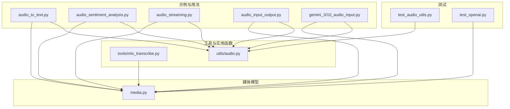
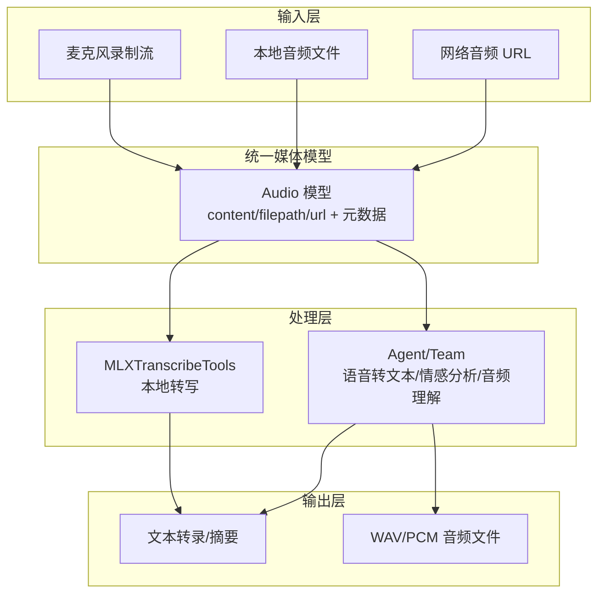
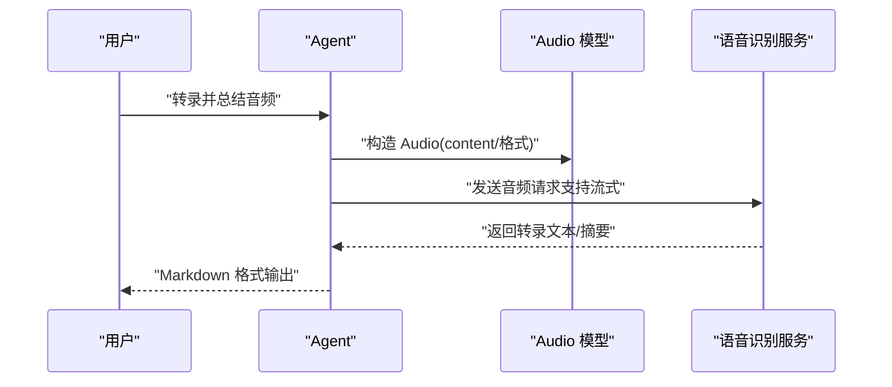
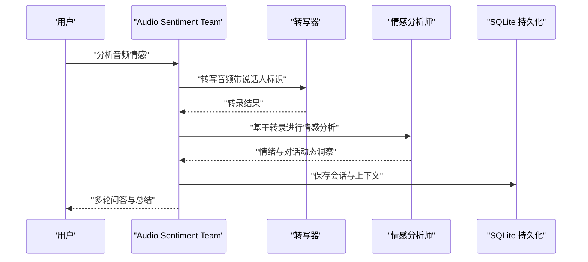
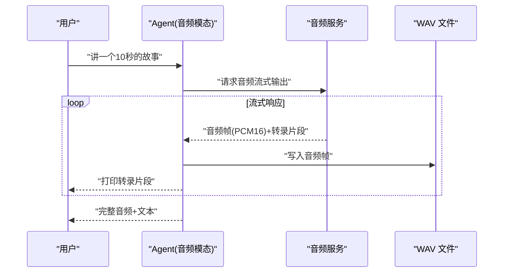
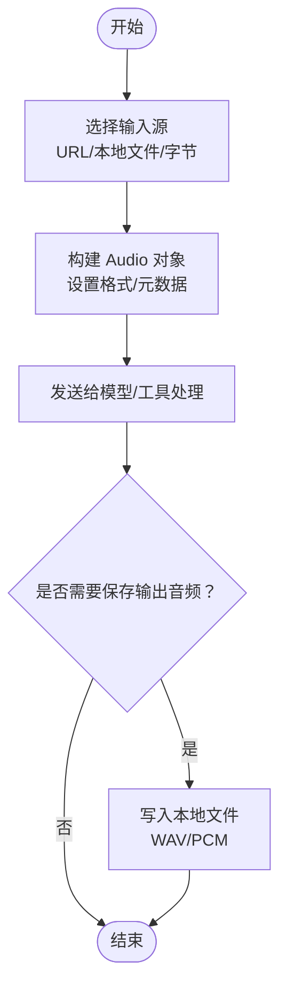
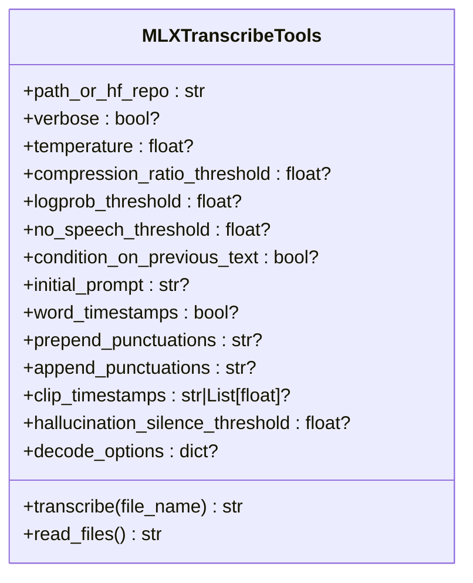
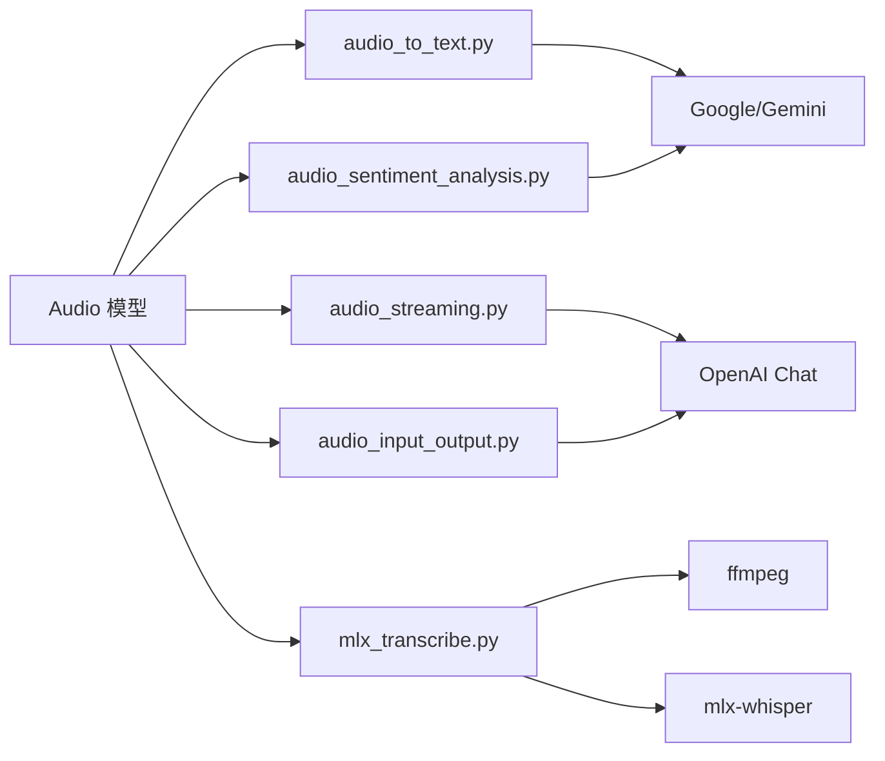

# 音频处理

<cite>
**本文引用的文件**
- [cookbook/02_agents/12_multimodal/audio_to_text.py](file://cookbook/02_agents/12_multimodal/audio_to_text.py)
- [cookbook/02_agents/12_multimodal/audio_sentiment_analysis.py](file://cookbook/02_agents/12_multimodal/audio_sentiment_analysis.py)
- [cookbook/03_teams/19_multimodal/audio_sentiment_analysis.py](file://cookbook/03_teams/19_multimodal/audio_sentiment_analysis.py)
- [cookbook/02_agents/12_multimodal/audio_streaming.py](file://cookbook/02_agents/12_multimodal/audio_streaming.py)
- [cookbook/02_agents/12_multimodal/audio_input_output.py](file://cookbook/02_agents/12_multimodal/audio_input_output.py)
- [cookbook/gemini_3/10_audio_input.py](file://cookbook/gemini_3/10_audio_input.py)
- [libs/agno/agno/utils/audio.py](file://libs/agno/agno/utils/audio.py)
- [libs/agno/agno/tools/mlx_transcribe.py](file://libs/agno/agno/tools/mlx_transcribe.py)
- [libs/agno/agno/media.py](file://libs/agno/agno/media.py)
- [libs/agno/tests/unit/utils/test_audio_utils.py](file://libs/agno/tests/unit/utils/test_audio_utils.py)
- [libs/agno/tests/unit/utils/test_openai.py](file://libs/agno/tests/unit/utils/test_openai.py)
- [cookbook/90_models/openai/chat/audio_output_stream.py](file://cookbook/90_models/openai/chat/audio_output_stream.py)
</cite>

## 目录
1. [简介](#简介)
2. [项目结构](#项目结构)
3. [核心组件](#核心组件)
4. [架构总览](#架构总览)
5. [详细组件分析](#详细组件分析)
6. [依赖分析](#依赖分析)
7. [性能考虑](#性能考虑)
8. [故障排查指南](#故障排查指南)
9. [结论](#结论)
10. [附录](#附录)

## 简介
本文件系统性梳理团队在音频处理方面的能力与实践，覆盖以下核心能力：
- 语音转文本：支持在线音频、本地文件与流式音频的转写，并可结合多轮对话与会话记忆进行会议记录、语音助手等场景。
- 音频情感分析：基于多智能体协作，先转写再进行情绪与对话动态分析，支持持久化与多轮追问。
- 音频理解：通过统一的音频输入接口，实现多格式（MP3/WAV/FLAC/OGG 等）音频的直接理解与摘要。

同时，文档详细说明音频输入格式处理（URL 下载、本地文件、流式传输、麦克风录制）、音频分析工具的配置与使用（语音识别模型、情感分析算法、音频特征提取），并提供针对会议记录、语音助手、音频内容分析与情感识别的具体用法路径与流程图示。

## 项目结构
围绕音频处理的相关代码主要分布在以下位置：
- 示例与用法：cookbook/02_agents/12_multimodal 与 cookbook/03_teams/19_multimodal 中的音频转写、情感分析与流式输出示例。
- 工具与实用函数：libs/agno/agno/tools 与 libs/agno/agno/utils 提供本地转写工具与通用音频工具。
- 媒体模型：libs/agno/agno/media.py 提供统一的 Audio 输入/输出抽象。
- 测试：libs/agno/tests/unit/utils/test_audio_utils.py 与 test_openai.py 提供音频工具与消息转换的测试用例。

**图表来源**
- [cookbook/02_agents/12_multimodal/audio_to_text.py:1-37](file://cookbook/02_agents/12_multimodal/audio_to_text.py#L1-L37)
- [cookbook/02_agents/12_multimodal/audio_sentiment_analysis.py:1-47](file://cookbook/02_agents/12_multimodal/audio_sentiment_analysis.py#L1-L47)
- [cookbook/02_agents/12_multimodal/audio_streaming.py:1-64](file://cookbook/02_agents/12_multimodal/audio_streaming.py#L1-L64)
- [cookbook/02_agents/12_multimodal/audio_input_output.py:1-47](file://cookbook/02_agents/12_multimodal/audio_input_output.py#L1-L47)
- [cookbook/gemini_3/10_audio_input.py:1-86](file://cookbook/gemini_3/10_audio_input.py#L1-L86)
- [libs/agno/agno/tools/mlx_transcribe.py:1-143](file://libs/agno/agno/tools/mlx_transcribe.py#L1-L143)
- [libs/agno/agno/utils/audio.py:1-50](file://libs/agno/agno/utils/audio.py#L1-L50)
- [libs/agno/agno/media.py:115-208](file://libs/agno/agno/media.py#L115-L208)
- [libs/agno/tests/unit/utils/test_audio_utils.py:1-313](file://libs/agno/tests/unit/utils/test_audio_utils.py#L1-L313)
- [libs/agno/tests/unit/utils/test_openai.py:94-147](file://libs/agno/tests/unit/utils/test_openai.py#L94-L147)

**章节来源**
- [cookbook/02_agents/12_multimodal/audio_to_text.py:1-37](file://cookbook/02_agents/12_multimodal/audio_to_text.py#L1-L37)
- [cookbook/02_agents/12_multimodal/audio_sentiment_analysis.py:1-47](file://cookbook/02_agents/12_multimodal/audio_sentiment_analysis.py#L1-L47)
- [cookbook/03_teams/19_multimodal/audio_sentiment_analysis.py:1-77](file://cookbook/03_teams/19_multimodal/audio_sentiment_analysis.py#L1-L77)
- [cookbook/02_agents/12_multimodal/audio_streaming.py:1-64](file://cookbook/02_agents/12_multimodal/audio_streaming.py#L1-L64)
- [cookbook/02_agents/12_multimodal/audio_input_output.py:1-47](file://cookbook/02_agents/12_multimodal/audio_input_output.py#L1-L47)
- [cookbook/gemini_3/10_audio_input.py:1-86](file://cookbook/gemini_3/10_audio_input.py#L1-L86)
- [libs/agno/agno/tools/mlx_transcribe.py:1-143](file://libs/agno/agno/tools/mlx_transcribe.py#L1-L143)
- [libs/agno/agno/utils/audio.py:1-50](file://libs/agno/agno/utils/audio.py#L1-L50)
- [libs/agno/agno/media.py:115-208](file://libs/agno/agno/media.py#L115-L208)
- [libs/agno/tests/unit/utils/test_audio_utils.py:1-313](file://libs/agno/tests/unit/utils/test_audio_utils.py#L1-L313)
- [libs/agno/tests/unit/utils/test_openai.py:94-147](file://libs/agno/tests/unit/utils/test_openai.py#L94-L147)

## 核心组件
- 统一音频模型 Audio：支持 URL、本地文件路径与原始字节三种输入源，自动归一化为字节；支持格式、采样率、通道数、时长等元数据，以及 LLM 输出的转录文本等字段。
- 本地转写工具 MLXTranscribeTools：封装 MLX Whisper，支持多种解码参数与本地文件读取，适用于 Apple Silicon 平台的高性能本地转写。
- 通用音频工具 write_audio_to_file/write_wav_audio_to_file：将 base64 或 PCM 数据写入磁盘，便于保存与回放。
- 示例脚本：涵盖从网络下载音频、本地文件转写、多轮情感分析、流式音频输出与语音助手等典型场景。

**章节来源**
- [libs/agno/agno/media.py:115-208](file://libs/agno/agno/media.py#L115-L208)
- [libs/agno/agno/tools/mlx_transcribe.py:31-143](file://libs/agno/agno/tools/mlx_transcribe.py#L31-L143)
- [libs/agno/agno/utils/audio.py:8-50](file://libs/agno/agno/utils/audio.py#L8-L50)
- [cookbook/02_agents/12_multimodal/audio_to_text.py:1-37](file://cookbook/02_agents/12_multimodal/audio_to_text.py#L1-L37)
- [cookbook/02_agents/12_multimodal/audio_sentiment_analysis.py:1-47](file://cookbook/02_agents/12_multimodal/audio_sentiment_analysis.py#L1-L47)
- [cookbook/03_teams/19_multimodal/audio_sentiment_analysis.py:1-77](file://cookbook/03_teams/19_multimodal/audio_sentiment_analysis.py#L1-L77)
- [cookbook/02_agents/12_multimodal/audio_streaming.py:1-64](file://cookbook/02_agents/12_multimodal/audio_streaming.py#L1-L64)
- [cookbook/02_agents/12_multimodal/audio_input_output.py:1-47](file://cookbook/02_agents/12_multimodal/audio_input_output.py#L1-L47)
- [cookbook/gemini_3/10_audio_input.py:1-86](file://cookbook/gemini_3/10_audio_input.py#L1-L86)

## 架构总览
下图展示了从“音频输入”到“转写/分析/输出”的端到端流程，包括本地转写工具与统一媒体模型的协作关系。

**图表来源**
- [libs/agno/agno/media.py:115-208](file://libs/agno/agno/media.py#L115-L208)
- [libs/agno/agno/tools/mlx_transcribe.py:31-143](file://libs/agno/agno/tools/mlx_transcribe.py#L31-L143)
- [cookbook/02_agents/12_multimodal/audio_to_text.py:1-37](file://cookbook/02_agents/12_multimodal/audio_to_text.py#L1-L37)
- [cookbook/02_agents/12_multimodal/audio_sentiment_analysis.py:1-47](file://cookbook/02_agents/12_multimodal/audio_sentiment_analysis.py#L1-L47)
- [cookbook/03_teams/19_multimodal/audio_sentiment_analysis.py:1-77](file://cookbook/03_teams/19_multimodal/audio_sentiment_analysis.py#L1-L77)
- [cookbook/02_agents/12_multimodal/audio_streaming.py:1-64](file://cookbook/02_agents/12_multimodal/audio_streaming.py#L1-L64)
- [cookbook/02_agents/12_multimodal/audio_input_output.py:1-47](file://cookbook/02_agents/12_multimodal/audio_input_output.py#L1-L47)
- [cookbook/gemini_3/10_audio_input.py:1-86](file://cookbook/gemini_3/10_audio_input.py#L1-L86)

## 详细组件分析

### 组件一：语音转文本（Audio To Text）
- 场景：会议记录、语音助手、播客转写等。
- 关键点：
  - 使用统一 Audio 抽象接收音频（URL/本地/字节）。
  - 通过 Agent 发起请求，支持流式输出与 Markdown 渲染。
  - 支持多格式音频（示例中包含 MP3/WAV 等）。
- 代码示例路径：
  - [cookbook/02_agents/12_multimodal/audio_to_text.py:1-37](file://cookbook/02_agents/12_multimodal/audio_to_text.py#L1-L37)
  - [cookbook/gemini_3/10_audio_input.py:1-86](file://cookbook/gemini_3/10_audio_input.py#L1-L86)

**图表来源**
- [cookbook/02_agents/12_multimodal/audio_to_text.py:29-36](file://cookbook/02_agents/12_multimodal/audio_to_text.py#L29-L36)
- [cookbook/gemini_3/10_audio_input.py:49-60](file://cookbook/gemini_3/10_audio_input.py#L49-L60)
- [libs/agno/agno/media.py:115-208](file://libs/agno/agno/media.py#L115-L208)

**章节来源**
- [cookbook/02_agents/12_multimodal/audio_to_text.py:1-37](file://cookbook/02_agents/12_multimodal/audio_to_text.py#L1-L37)
- [cookbook/gemini_3/10_audio_input.py:1-86](file://cookbook/gemini_3/10_audio_input.py#L1-L86)
- [libs/agno/agno/media.py:115-208](file://libs/agno/agno/media.py#L115-L208)

### 组件二：音频情感分析（含多轮与持久化）
- 场景：会议/对话的情感趋势分析、情绪洞察与后续追问。
- 关键点：
  - 使用 Team 将“转写器”和“情感分析师”组合，形成多智能体协作。
  - 支持历史上下文注入与 SQLite 持久化，实现跨轮次的记忆。
  - 可多次提问以深化分析。
- 代码示例路径：
  - [cookbook/02_agents/12_multimodal/audio_sentiment_analysis.py:1-47](file://cookbook/02_agents/12_multimodal/audio_sentiment_analysis.py#L1-L47)
  - [cookbook/03_teams/19_multimodal/audio_sentiment_analysis.py:1-77](file://cookbook/03_teams/19_multimodal/audio_sentiment_analysis.py#L1-L77)

**图表来源**
- [cookbook/03_teams/19_multimodal/audio_sentiment_analysis.py:42-76](file://cookbook/03_teams/19_multimodal/audio_sentiment_analysis.py#L42-L76)
- [libs/agno/agno/db/sqlite.py:1-200](file://libs/agno/agno/db/sqlite.py#L1-L200)

**章节来源**
- [cookbook/02_agents/12_multimodal/audio_sentiment_analysis.py:1-47](file://cookbook/02_agents/12_multimodal/audio_sentiment_analysis.py#L1-L47)
- [cookbook/03_teams/19_multimodal/audio_sentiment_analysis.py:1-77](file://cookbook/03_teams/19_multimodal/audio_sentiment_analysis.py#L1-L77)

### 组件三：流式音频传输与输出
- 场景：实时语音助手、边说边听的音频对话体验。
- 关键点：
  - 使用 OpenAI Chat 的音频模态，支持 text 与 audio 同时输出。
  - 通过流式迭代逐步写入 WAV 文件，支持 PCM16 格式。
  - 可在流式过程中打印转录文本并拼接音频帧。
- 代码示例路径：
  - [cookbook/02_agents/12_multimodal/audio_streaming.py:1-64](file://cookbook/02_agents/12_multimodal/audio_streaming.py#L1-L64)
  - [cookbook/90_models/openai/chat/audio_output_stream.py:1-47](file://cookbook/90_models/openai/chat/audio_output_stream.py#L1-L47)

**图表来源**
- [cookbook/02_agents/12_multimodal/audio_streaming.py:38-63](file://cookbook/02_agents/12_multimodal/audio_streaming.py#L38-L63)
- [cookbook/90_models/openai/chat/audio_output_stream.py:37-47](file://cookbook/90_models/openai/chat/audio_output_stream.py#L37-L47)

**章节来源**
- [cookbook/02_agents/12_multimodal/audio_streaming.py:1-64](file://cookbook/02_agents/12_multimodal/audio_streaming.py#L1-L64)
- [cookbook/90_models/openai/chat/audio_output_stream.py:1-47](file://cookbook/90_models/openai/chat/audio_output_stream.py#L1-L47)

### 组件四：音频输入与输出（含本地文件与格式推断）
- 场景：将本地音频作为输入，或将模型生成的音频保存到本地。
- 关键点：
  - Audio 支持从 URL/本地文件/字节读取，并自动推断或显式指定格式。
  - 通过工具函数将 base64 音频写入磁盘，便于后续播放或二次处理。
- 代码示例路径：
  - [cookbook/02_agents/12_multimodal/audio_input_output.py:1-47](file://cookbook/02_agents/12_multimodal/audio_input_output.py#L1-L47)
  - [libs/agno/agno/utils/audio.py:8-50](file://libs/agno/agno/utils/audio.py#L8-L50)
  - [libs/agno/tests/unit/utils/test_openai.py:94-147](file://libs/agno/tests/unit/utils/test_openai.py#L94-L147)

**图表来源**
- [libs/agno/agno/media.py:115-208](file://libs/agno/agno/media.py#L115-L208)
- [libs/agno/agno/utils/audio.py:8-50](file://libs/agno/agno/utils/audio.py#L8-L50)
- [libs/agno/tests/unit/utils/test_openai.py:119-147](file://libs/agno/tests/unit/utils/test_openai.py#L119-L147)

**章节来源**
- [cookbook/02_agents/12_multimodal/audio_input_output.py:1-47](file://cookbook/02_agents/12_multimodal/audio_input_output.py#L1-L47)
- [libs/agno/agno/utils/audio.py:1-50](file://libs/agno/agno/utils/audio.py#L1-L50)
- [libs/agno/tests/unit/utils/test_openai.py:94-147](file://libs/agno/tests/unit/utils/test_openai.py#L94-L147)

### 组件五：本地转写工具（MLX Whisper）
- 场景：在本地进行高性能转写，避免网络依赖与隐私风险。
- 关键点：
  - 支持多种解码参数（温度、阈值、初始提示、词级时间戳等）。
  - 提供安全路径检查，限制文件访问范围。
  - 适配 Apple Silicon 平台，安装依赖后即可使用。
- 代码示例路径：
  - [libs/agno/agno/tools/mlx_transcribe.py:1-143](file://libs/agno/agno/tools/mlx_transcribe.py#L1-L143)

**图表来源**
- [libs/agno/agno/tools/mlx_transcribe.py:31-143](file://libs/agno/agno/tools/mlx_transcribe.py#L31-L143)

**章节来源**
- [libs/agno/agno/tools/mlx_transcribe.py:1-143](file://libs/agno/agno/tools/mlx_transcribe.py#L1-L143)

## 依赖分析
- 组件耦合与内聚：
  - Audio 模型作为统一抽象，被多个示例与工具复用，内聚度高、耦合度低。
  - MLXTranscribeTools 与 Audio 解耦，通过文件路径与解码参数交互。
  - 示例脚本仅依赖 Agent/Team 与 Audio，不直接依赖底层模型细节，便于替换与扩展。
- 外部依赖：
  - OpenAI/Google 模型接口用于音频理解与转写。
  - 本地转写依赖 ffmpeg 与 mlx-whisper。
  - 测试覆盖了音频工具与消息转换逻辑，保障稳定性。

**图表来源**
- [libs/agno/agno/media.py:115-208](file://libs/agno/agno/media.py#L115-L208)
- [cookbook/02_agents/12_multimodal/audio_to_text.py:1-37](file://cookbook/02_agents/12_multimodal/audio_to_text.py#L1-L37)
- [cookbook/02_agents/12_multimodal/audio_sentiment_analysis.py:1-47](file://cookbook/02_agents/12_multimodal/audio_sentiment_analysis.py#L1-L47)
- [cookbook/02_agents/12_multimodal/audio_streaming.py:1-64](file://cookbook/02_agents/12_multimodal/audio_streaming.py#L1-L64)
- [cookbook/02_agents/12_multimodal/audio_input_output.py:1-47](file://cookbook/02_agents/12_multimodal/audio_input_output.py#L1-L47)
- [libs/agno/agno/tools/mlx_transcribe.py:1-143](file://libs/agno/agno/tools/mlx_transcribe.py#L1-L143)

**章节来源**
- [libs/agno/agno/media.py:115-208](file://libs/agno/agno/media.py#L115-L208)
- [libs/agno/agno/tools/mlx_transcribe.py:1-143](file://libs/agno/agno/tools/mlx_transcribe.py#L1-L143)
- [cookbook/02_agents/12_multimodal/audio_to_text.py:1-37](file://cookbook/02_agents/12_multimodal/audio_to_text.py#L1-L37)
- [cookbook/02_agents/12_multimodal/audio_sentiment_analysis.py:1-47](file://cookbook/02_agents/12_multimodal/audio_sentiment_analysis.py#L1-L47)
- [cookbook/02_agents/12_multimodal/audio_streaming.py:1-64](file://cookbook/02_agents/12_multimodal/audio_streaming.py#L1-L64)
- [cookbook/02_agents/12_multimodal/audio_input_output.py:1-47](file://cookbook/02_agents/12_multimodal/audio_input_output.py#L1-L47)

## 性能考虑
- 本地转写优势：在 Apple Silicon 上利用 MLX 加速，减少网络往返与隐私泄露风险；适合高频、批量转写场景。
- 流式输出优化：按帧写入音频文件，降低内存峰值；建议在循环中及时 flush，避免阻塞。
- 格式与采样率：根据下游模型要求选择合适格式（如 PCM16）与采样率（如 24kHz），提升兼容性与质量。
- 缓存与复用：对重复音频可缓存转写结果，减少重复计算；对会话上下文采用增量存储策略。

## 故障排查指南
- 音频写入失败：
  - 检查目标目录是否存在，必要时启用自动创建。
  - 确认 base64 内容有效且与文件扩展名匹配。
  - 参考测试用例定位边界情况（空数据、超大文件、特殊字符文件名等）。
  - 参考路径：[libs/agno/tests/unit/utils/test_audio_utils.py:1-313](file://libs/agno/tests/unit/utils/test_audio_utils.py#L1-L313)
- 音频消息转换异常：
  - 确保 Audio 对象只提供一种内容源（URL/本地/字节），并正确设置 format。
  - 参考测试用例验证不同格式与路径的行为。
  - 参考路径：[libs/agno/tests/unit/utils/test_openai.py:94-147](file://libs/agno/tests/unit/utils/test_openai.py#L94-L147)
- 本地转写报错：
  - 确认已安装 ffmpeg 与 mlx-whisper。
  - 检查文件路径是否在允许范围内，避免越界访问。
  - 参考路径：[libs/agno/agno/tools/mlx_transcribe.py:1-143](file://libs/agno/agno/tools/mlx_transcribe.py#L1-L143)

**章节来源**
- [libs/agno/tests/unit/utils/test_audio_utils.py:1-313](file://libs/agno/tests/unit/utils/test_audio_utils.py#L1-L313)
- [libs/agno/tests/unit/utils/test_openai.py:94-147](file://libs/agno/tests/unit/utils/test_openai.py#L94-L147)
- [libs/agno/agno/tools/mlx_transcribe.py:1-143](file://libs/agno/agno/tools/mlx_transcribe.py#L1-L143)

## 结论
团队在音频处理方面具备完善的“输入—处理—输出—持久化”闭环能力：
- 通过统一的 Audio 抽象与多模型接口，覆盖在线与本地转写、情感分析与流式输出。
- 多智能体协作与会话持久化，满足会议记录与深度分析需求。
- 本地转写工具为隐私与性能提供保障，测试体系确保稳定性与兼容性。
建议在实际项目中结合业务场景选择合适的输入方式与模型配置，并遵循性能与安全最佳实践。

## 附录
- 常用代码示例路径（不含具体代码内容）：
  - 语音转文本：[cookbook/02_agents/12_multimodal/audio_to_text.py:1-37](file://cookbook/02_agents/12_multimodal/audio_to_text.py#L1-L37)
  - 音频情感分析（单智能体/多智能体）：[cookbook/02_agents/12_multimodal/audio_sentiment_analysis.py:1-47](file://cookbook/02_agents/12_multimodal/audio_sentiment_analysis.py#L1-L47)，[cookbook/03_teams/19_multimodal/audio_sentiment_analysis.py:1-77](file://cookbook/03_teams/19_multimodal/audio_sentiment_analysis.py#L1-L77)
  - 流式音频输出：[cookbook/02_agents/12_multimodal/audio_streaming.py:1-64](file://cookbook/02_agents/12_multimodal/audio_streaming.py#L1-L64)，[cookbook/90_models/openai/chat/audio_output_stream.py:1-47](file://cookbook/90_models/openai/chat/audio_output_stream.py#L1-L47)
  - 音频输入/输出与格式推断：[cookbook/02_agents/12_multimodal/audio_input_output.py:1-47](file://cookbook/02_agents/12_multimodal/audio_input_output.py#L1-L47)，[libs/agno/agno/media.py:115-208](file://libs/agno/agno/media.py#L115-L208)
  - 本地转写工具：[libs/agno/agno/tools/mlx_transcribe.py:1-143](file://libs/agno/agno/tools/mlx_transcribe.py#L1-L143)
  - 通用音频工具：[libs/agno/agno/utils/audio.py:1-50](file://libs/agno/agno/utils/audio.py#L1-L50)