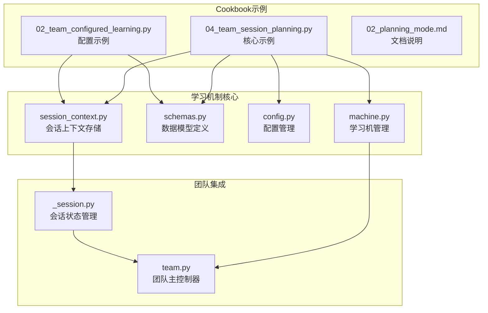
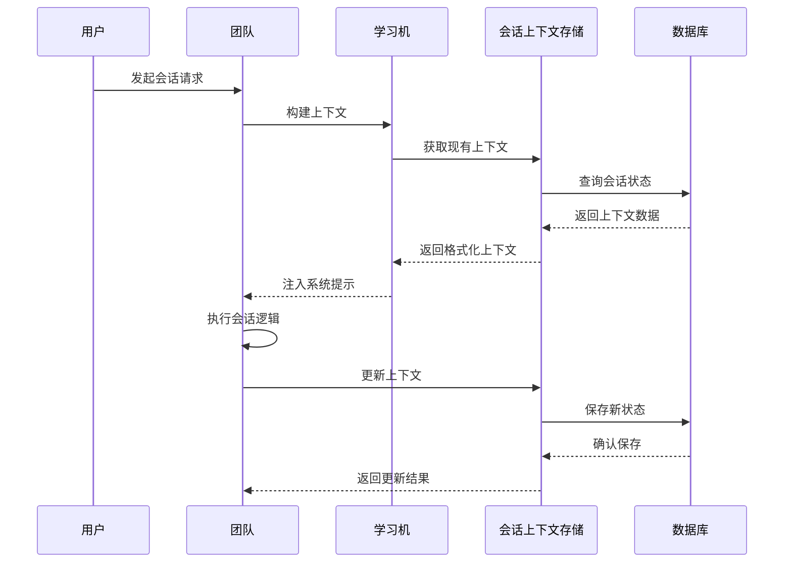
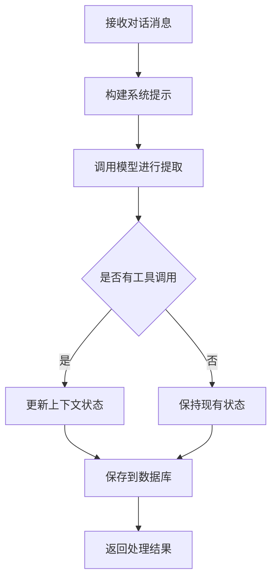
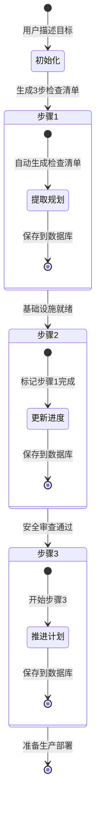
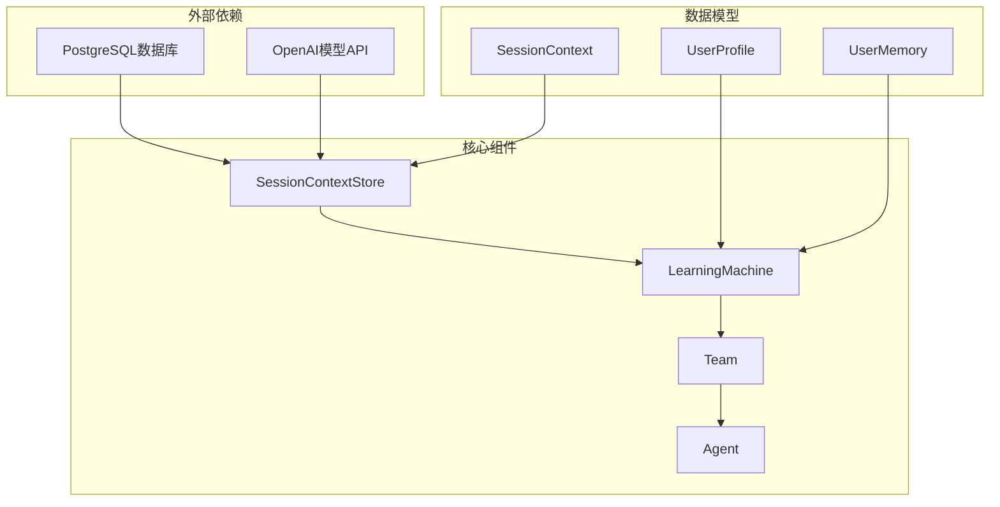

# 团队会话规划

<cite>
**本文档引用的文件**
- [04_team_session_planning.py](file://cookbook/03_teams/12_learning/04_team_session_planning.py)
- [session_context.py](file://libs/agno/agno/learn/stores/session_context.py)
- [schemas.py](file://libs/agno/agno/learn/schemas.py)
- [config.py](file://libs/agno/agno/learn/config.py)
- [machine.py](file://libs/agno/agno/learn/machine.py)
- [_session.py](file://libs/agno/agno/team/_session.py)
- [team.py](file://libs/agno/agno/team/team.py)
- [02_team_configured_learning.py](file://cookbook/03_teams/12_learning/02_team_configured_learning.py)
- [02_team_configured_learning.md](file://cookbook/03_teams/12_learning/02_team_configured_learning.md)
- [03_session_context/02_planning_mode.md](file://cookbook/08_learning/03_session_context/02_planning_mode.md)
- [08_learning/01_basics/3a_session_context_summary.md](file://cookbook/08_learning/01_basics/3a_session_context_summary.md)
- [08_learning/01_basics/3b_session_context_planning.md](file://cookbook/08_learning/01_basics/3b_session_context_planning.md)
- [test_session_state.py](file://libs/agno/tests/integration/teams/test_session_state.py)
- [test_share_sessions.py](file://libs/agno/tests/integration/session/test_share_sessions.py)
</cite>

## 目录
1. [简介](#简介)
2. [项目结构](#项目结构)
3. [核心组件](#核心组件)
4. [架构概览](#架构概览)
5. [详细组件分析](#详细组件分析)
6. [依赖关系分析](#依赖关系分析)
7. [性能考虑](#性能考虑)
8. [故障排除指南](#故障排除指南)
9. [结论](#结论)
10. [附录](#附录)

## 简介

团队会话规划是Agno框架中一个重要的学习机制，它允许团队在多步骤任务中自动维护和追踪会话目标、计划和进度。本文档深入介绍了团队会话规划的学习机制和实现方法，包括如何根据历史会话数据和学习结果制定未来的会话策略。

团队会话规划的核心价值在于：
- **自动化进度追踪**：自动维护目标、子任务和完成状态
- **上下文连续性**：即使消息历史被截断，也能保持会话上下文
- **多轮对话协调**：团队成员可以感知彼此的工作进度
- **决策支持**：为后续行动提供结构化的参考信息

## 项目结构

Agno框架中的团队会话规划功能主要分布在以下模块中：

**图表来源**
- [04_team_session_planning.py:1-121](file://cookbook/03_teams/12_learning/04_team_session_planning.py#L1-L121)
- [session_context.py:1-800](file://libs/agno/agno/learn/stores/session_context.py#L1-L800)
- [schemas.py:307-412](file://libs/agno/agno/learn/schemas.py#L307-L412)

**章节来源**
- [04_team_session_planning.py:1-121](file://cookbook/03_teams/12_learning/04_team_session_planning.py#L1-L121)
- [session_context.py:1-800](file://libs/agno/agno/learn/stores/session_context.py#L1-L800)

## 核心组件

### 会话上下文存储器（SessionContextStore）

会话上下文存储器是团队会话规划的核心组件，负责：
- **状态持久化**：将会话状态保存到数据库
- **自动提取**：基于对话内容自动提取和更新上下文
- **规划追踪**：维护目标、计划和进度信息
- **上下文注入**：向代理系统提示中注入会话上下文

### 会话上下文数据模型

会话上下文数据模型定义了规划模式下的核心字段：
- `goal`：当前会话目标
- `plan`：实现目标的步骤列表
- `progress`：已完成的步骤列表
- `summary`：会话摘要

### 配置管理

SessionContextConfig提供了灵活的配置选项：
- `enable_planning`：启用规划模式（默认False）
- `mode`：学习模式设置（ALWAYS模式）
- `db`：数据库连接
- `model`：用于提取的模型

**章节来源**
- [session_context.py:56-84](file://libs/agno/agno/learn/stores/session_context.py#L56-L84)
- [schemas.py:307-412](file://libs/agno/agno/learn/schemas.py#L307-L412)
- [config.py:171-225](file://libs/agno/agno/learn/config.py#L171-L225)

## 架构概览

团队会话规划的整体架构如下：

**图表来源**
- [machine.py:350-392](file://libs/agno/agno/learn/machine.py#L350-L392)
- [session_context.py:127-187](file://libs/agno/agno/learn/stores/session_context.py#L127-L187)

## 详细组件分析

### 会话规划实现机制

团队会话规划通过以下机制实现：

#### 1. 自动上下文提取

**图表来源**
- [session_context.py:529-574](file://libs/agno/agno/learn/stores/session_context.py#L529-L574)

#### 2. 规划模式的数据结构

在规划模式下，会话上下文包含以下结构：

| 字段 | 类型 | 描述 | 示例 |
|------|------|------|------|
| `goal` | String | 会话目标 | "部署v2.0到生产环境" |
| `plan` | List[String] | 计划步骤 | ["基础设施检查", "安全审查", "生产部署"] |
| `progress` | List[String] | 已完成步骤 | ["基础设施检查", "安全审查"] |
| `summary` | String | 会话摘要 | "已确定部署策略和时间表" |

#### 3. 多轮对话的进度连贯性

**图表来源**
- [04_team_session_planning.py:74-120](file://cookbook/03_teams/12_learning/04_team_session_planning.py#L74-L120)

### 配置和使用示例

#### 基础配置示例

团队会话规划的配置需要以下关键组件：

1. **数据库连接**：用于持久化会话状态
2. **模型配置**：用于上下文提取
3. **学习机配置**：启用会话上下文学习
4. **团队成员**：参与会话规划的代理

#### 动态调整机制

会话规划支持以下动态调整：

- **目标调整**：根据新的需求更新会话目标
- **计划修改**：添加、删除或重新排序步骤
- **进度追踪**：实时更新已完成的任务
- **上下文合并**：整合多个来源的信息

**章节来源**
- [04_team_session_planning.py:33-64](file://cookbook/03_teams/12_learning/04_team_session_planning.py#L33-L64)
- [02_team_configured_learning.py:89-108](file://cookbook/03_teams/12_learning/02_team_configured_learning.py#L89-L108)

### 学习机制详解

#### 上下文提取流程

会话上下文的提取过程包括以下步骤：

1. **消息预处理**：将对话消息转换为文本格式
2. **系统提示构建**：根据现有上下文构建提取提示
3. **模型调用**：使用指定模型进行上下文提取
4. **工具执行**：执行保存上下文的工具
5. **状态更新**：更新内部状态标记

#### 数据持久化策略

会话上下文采用以下持久化策略：

- **会话范围**：每个session_id对应唯一的上下文
- **审计跟踪**：记录agent_id和team_id用于审计
- **增量更新**：基于现有上下文进行增量更新
- **格式化存储**：使用标准化的数据格式

**章节来源**
- [session_context.py:494-643](file://libs/agno/agno/learn/stores/session_context.py#L494-L643)
- [schemas.py:307-412](file://libs/agno/agno/learn/schemas.py#L307-L412)

## 依赖关系分析

团队会话规划涉及多个组件之间的复杂依赖关系：

**图表来源**
- [04_team_session_planning.py:27](file://cookbook/03_teams/12_learning/04_team_session_planning.py#L27)
- [session_context.py:28-53](file://libs/agno/agno/learn/stores/session_context.py#L28-L53)

### 组件耦合度分析

- **低耦合设计**：各组件职责明确，接口清晰
- **可扩展性**：支持自定义存储和模型
- **异步支持**：同时支持同步和异步操作
- **错误处理**：完善的异常处理和日志记录

**章节来源**
- [machine.py:340-539](file://libs/agno/agno/learn/machine.py#L340-L539)
- [session_context.py:127-187](file://libs/agno/agno/learn/stores/session_context.py#L127-L187)

## 性能考虑

### 存储性能优化

- **批量操作**：支持批量上下文提取和保存
- **缓存机制**：内存缓存减少数据库访问
- **异步处理**：后台异步提取避免阻塞主线程
- **连接池**：数据库连接复用提高效率

### 模型调用优化

- **条件调用**：仅在必要时调用模型
- **工具复用**：复用已构建的工具函数
- **参数优化**：合理设置模型参数
- **资源管理**：及时释放模型资源

## 故障排除指南

### 常见问题及解决方案

#### 1. 数据库连接问题

**症状**：上下文无法保存或读取
**原因**：数据库连接配置错误
**解决方案**：
- 检查数据库URL配置
- 验证网络连接
- 确认数据库权限

#### 2. 模型调用失败

**症状**：上下文提取失败
**原因**：模型API配置错误
**解决方案**：
- 验证API密钥
- 检查模型可用性
- 确认请求格式

#### 3. 会话状态不一致

**症状**：团队成员看到不同的会话状态
**原因**：共享数据库配置问题
**解决方案**：
- 确保所有组件使用相同数据库实例
- 检查事务隔离级别
- 验证会话ID一致性

**章节来源**
- [session_context.py:297-325](file://libs/agno/agno/learn/stores/session_context.py#L297-L325)
- [test_session_state.py:48-77](file://libs/agno/tests/integration/teams/test_session_state.py#L48-L77)

## 结论

团队会话规划为Agno框架提供了强大的多步骤任务协调能力。通过自动化的上下文提取、结构化的规划数据模型和灵活的配置选项，团队能够在复杂的协作场景中保持高效的沟通和决策。

### 主要优势

1. **自动化程度高**：无需手动干预即可维护会话状态
2. **扩展性强**：支持自定义字段和业务逻辑
3. **可靠性好**：完善的错误处理和恢复机制
4. **性能优异**：异步处理和缓存优化

### 应用场景

- **项目管理**：跟踪项目里程碑和任务进度
- **产品开发**：协调开发流程和质量检查
- **客户服务**：维护客户问题解决的完整记录
- **教育培训**：跟踪学习进度和知识掌握情况

## 附录

### 配置最佳实践

#### 1. 数据库选择建议

- **开发环境**：SQLite或PostgreSQL
- **生产环境**：PostgreSQL或MySQL
- **高并发场景**：使用连接池和读写分离

#### 2. 模型配置建议

- **成本控制**：使用较小的模型进行上下文提取
- **准确性要求**：根据业务重要性选择合适的模型
- **响应时间**：平衡模型大小和响应速度

#### 3. 监控和评估

- **性能指标**：响应时间、吞吐量、错误率
- **业务指标**：会话完成率、用户满意度
- **成本指标**：API调用次数、存储空间使用

**章节来源**
- [03_session_context/02_planning_mode.md:48-97](file://cookbook/08_learning/03_session_context/02_planning_mode.md#L48-L97)
- [08_learning/01_basics/3b_session_context_planning.md:126-133](file://cookbook/08_learning/01_basics/3b_session_context_planning.md#L126-L133)