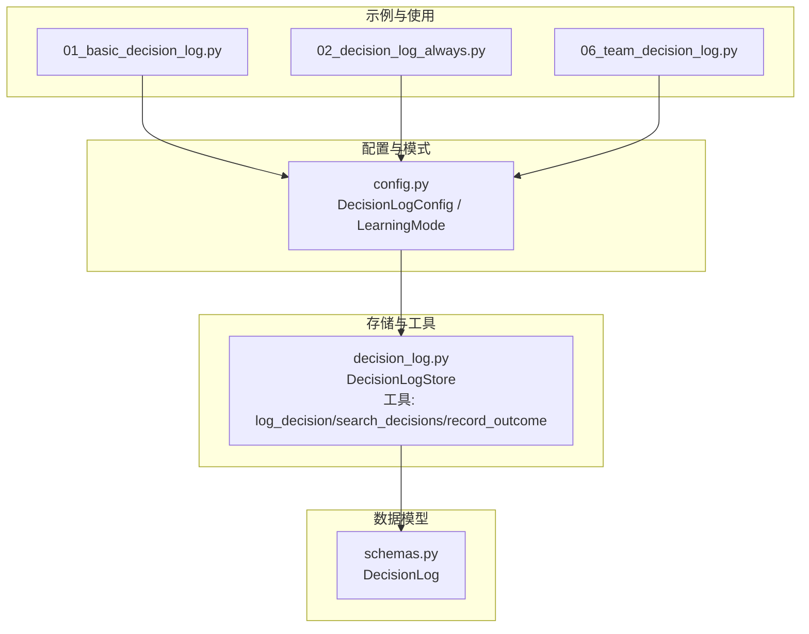
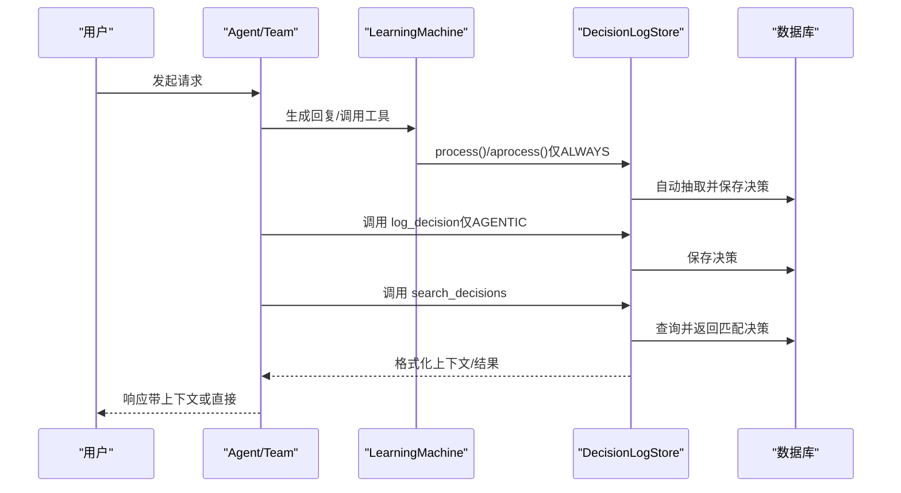
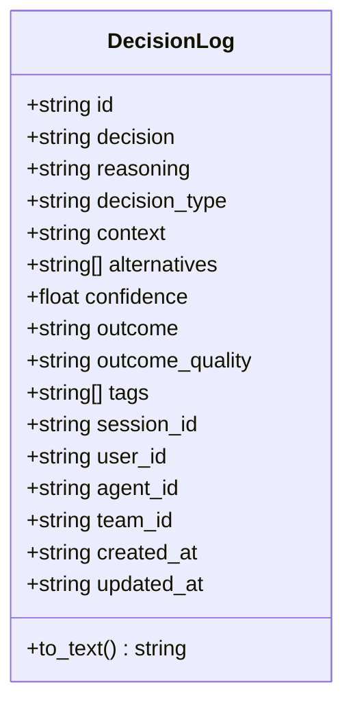
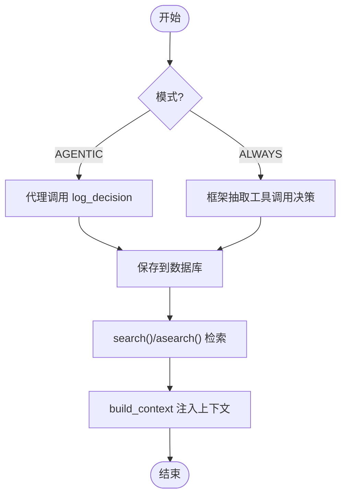
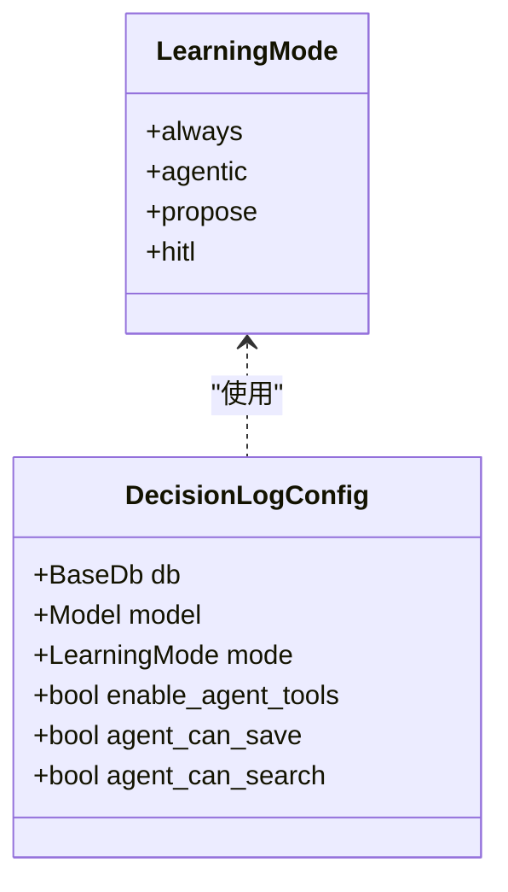
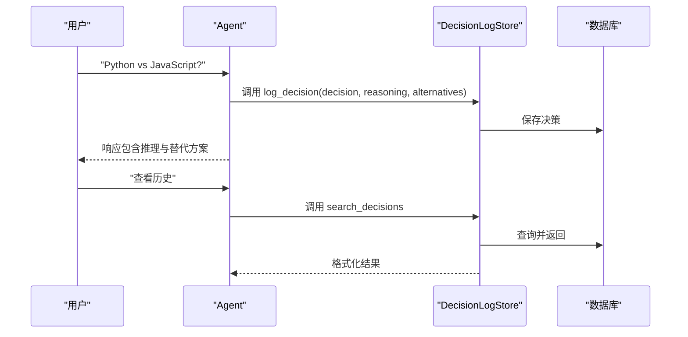
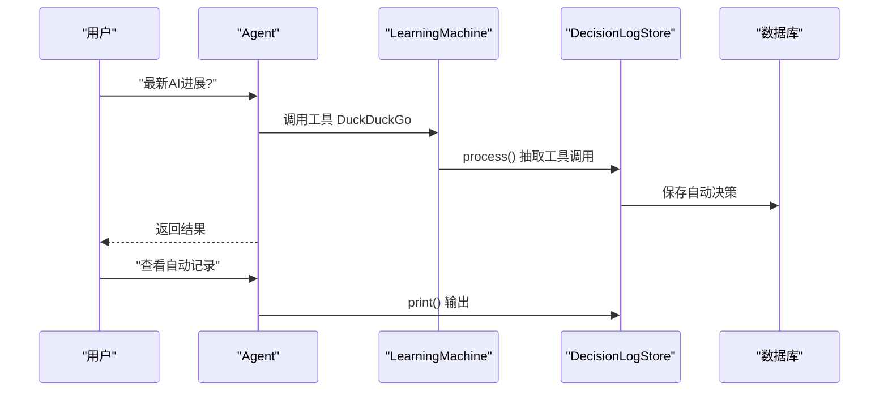
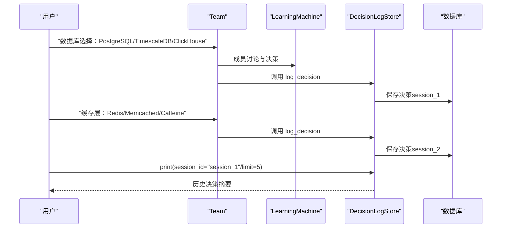
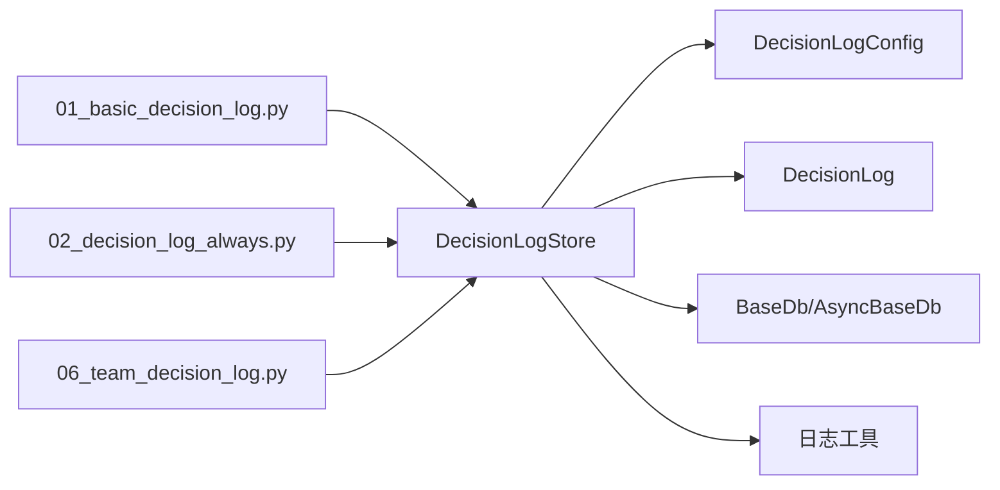

# 团队决策日志

<cite>
**本文引用的文件**
- [decision_log.py](file://libs/agno/agno/learn/stores/decision_log.py)
- [schemas.py](file://libs/agno/agno/learn/schemas.py)
- [config.py](file://libs/agno/agno/learn/config.py)
- [01_basic_decision_log.py](file://cookbook/08_learning/09_decision_logs/01_basic_decision_log.py)
- [02_decision_log_always.py](file://cookbook/08_learning/09_decision_logs/02_decision_log_always.py)
- [06_team_decision_log.py](file://cookbook/03_teams/12_learning/06_team_decision_log.py)
- [01_basic_decision_log.md](file://cookbook/08_learning/09_decision_logs/01_basic_decision_log.md)
- [02_decision_log_always.md](file://cookbook/08_learning/09_decision_logs/02_decision_log_always.md)
- [06_team_decision_log.md](file://cookbook/03_teams/12_learning/06_team_decision_log.md)
</cite>

## 目录
1. [简介](#简介)
2. [项目结构](#项目结构)
3. [核心组件](#核心组件)
4. [架构总览](#架构总览)
5. [详细组件分析](#详细组件分析)
6. [依赖关系分析](#依赖关系分析)
7. [性能考量](#性能考量)
8. [故障排查指南](#故障排查指南)
9. [结论](#结论)
10. [附录](#附录)

## 简介
团队决策日志是用于记录、检索与分析团队在协作过程中做出的关键决策的系统化机制。它围绕以下目标展开：
- 记录决策过程：包括决策内容、推理依据、考虑的替代方案、上下文与结果
- 可追溯性与审计：支持跨会话、跨成员的决策检索与审计
- 团队学习与优化：通过历史决策的结构化分析，沉淀经验、识别模式、提升未来决策质量
- 自动化与半自动化：支持“代理主动记录”和“框架自动抽取”两种模式，满足不同场景需求

## 项目结构
本项目的决策日志能力由三层组成：
- 数据模型层：定义决策日志的数据结构与序列化规则
- 存储与工具层：提供决策日志的增删改查、检索、上下文注入与工具暴露
- 使用示例层：展示在单智能体、自动记录与团队场景下的配置与使用方式

**图表来源**
- [config.py:378-410](file://libs/agno/agno/learn/config.py#L378-L410)
- [schemas.py:895-1010](file://libs/agno/agno/learn/schemas.py#L895-L1010)
- [decision_log.py:49-84](file://libs/agno/agno/learn/stores/decision_log.py#L49-L84)

**章节来源**
- [config.py:31-45](file://libs/agno/agno/learn/config.py#L31-L45)
- [schemas.py:895-1010](file://libs/agno/agno/learn/schemas.py#L895-L1010)
- [decision_log.py:49-84](file://libs/agno/agno/learn/stores/decision_log.py#L49-L84)

## 核心组件
- 决策日志数据模型（DecisionLog）：定义决策的字段与序列化规则，支持检索文本拼接、内部字段标记等
- 决策日志存储（DecisionLogStore）：实现学习存储协议，提供检索、搜索、保存、异步操作、上下文构建、工具构建等能力
- 配置（DecisionLogConfig）：控制模式（ALWAYS/AGENTIC）、是否启用代理工具、过滤器与提示词定制等
- 示例脚本：演示在单智能体（AGENTIC）、自动记录（ALWAYS）与团队场景下的集成与使用

**章节来源**
- [schemas.py:895-1010](file://libs/agno/agno/learn/schemas.py#L895-L1010)
- [decision_log.py:49-84](file://libs/agno/agno/learn/stores/decision_log.py#L49-L84)
- [config.py:378-410](file://libs/agno/agno/learn/config.py#L378-L410)
- [01_basic_decision_log.py:18-53](file://cookbook/08_learning/09_decision_logs/01_basic_decision_log.py#L18-L53)
- [02_decision_log_always.py:16-49](file://cookbook/08_learning/09_decision_logs/02_decision_log_always.py#L16-L49)
- [06_team_decision_log.py:16-68](file://cookbook/03_teams/12_learning/06_team_decision_log.py#L16-L68)

## 架构总览
决策日志的运行流程分为两条主线：
- 主动记录（AGENTIC）：代理在合适时机调用 log_decision 工具，将决策写入存储，并可使用 search_decisions 检索历史
- 自动记录（ALWAYS）：框架在对话后自动从工具调用中抽取决策，形成结构化记录

**图表来源**
- [decision_log.py:133-194](file://libs/agno/agno/learn/stores/decision_log.py#L133-L194)
- [decision_log.py:410-474](file://libs/agno/agno/learn/stores/decision_log.py#L410-L474)
- [decision_log.py:598-696](file://libs/agno/agno/learn/stores/decision_log.py#L598-L696)
- [decision_log.py:702-851](file://libs/agno/agno/learn/stores/decision_log.py#L702-L851)

## 详细组件分析

### 数据模型：DecisionLog
- 字段设计：包含决策主体、推理、类型、上下文、替代方案、置信度、结果与质量、标签、作用域标识（会话/用户/代理/团队）及时间戳
- 序列化：提供 from_dict/to_dict，支持扩展字段与内部字段隔离
- 检索文本：to_text 将多字段拼接为可搜索文本，便于全文检索

**图表来源**
- [schemas.py:895-1010](file://libs/agno/agno/learn/schemas.py#L895-L1010)

**章节来源**
- [schemas.py:895-1010](file://libs/agno/agno/learn/schemas.py#L895-L1010)

### 存储与工具：DecisionLogStore
- 学习存储协议实现：recall/arecall、build_context、get_tools/aget_tools
- 检索与搜索：支持按代理、会话、类型、天数范围与关键词检索
- 工具构建：log_decision、search_decisions、record_outcome（更新结果与质量）
- 自动抽取（ALWAYS）：从消息中的工具调用提取决策并保存
- 上下文注入：将最近决策格式化注入系统提示，辅助后续决策

**图表来源**
- [decision_log.py:133-194](file://libs/agno/agno/learn/stores/decision_log.py#L133-L194)
- [decision_log.py:410-474](file://libs/agno/agno/learn/stores/decision_log.py#L410-L474)
- [decision_log.py:598-696](file://libs/agno/agno/learn/stores/decision_log.py#L598-L696)
- [decision_log.py:702-851](file://libs/agno/agno/learn/stores/decision_log.py#L702-L851)

**章节来源**
- [decision_log.py:85-131](file://libs/agno/agno/learn/stores/decision_log.py#L85-L131)
- [decision_log.py:195-247](file://libs/agno/agno/learn/stores/decision_log.py#L195-L247)
- [decision_log.py:249-294](file://libs/agno/agno/learn/stores/decision_log.py#L249-L294)
- [decision_log.py:702-851](file://libs/agno/agno/learn/stores/decision_log.py#L702-L851)
- [decision_log.py:1026-1097](file://libs/agno/agno/learn/stores/decision_log.py#L1026-L1097)

### 配置：DecisionLogConfig 与 LearningMode
- LearningMode：ALWAYS（自动抽取）、AGENTIC（代理主动）
- DecisionLogConfig：控制数据库、模型、模式、是否启用代理工具、提示词定制等
- 作用域：以 agent_id 为键，跨用户与会话共享同一决策日志空间

**图表来源**
- [config.py:31-45](file://libs/agno/agno/learn/config.py#L31-L45)
- [config.py:378-410](file://libs/agno/agno/learn/config.py#L378-L410)

**章节来源**
- [config.py:31-45](file://libs/agno/agno/learn/config.py#L31-L45)
- [config.py:378-410](file://libs/agno/agno/learn/config.py#L378-L410)

### 使用示例：单智能体（AGENTIC）
- 场景：代理在做重要决策时主动记录，如工具选择、响应风格、澄清等
- 关键点：启用代理工具、允许保存与搜索；通过 log_decision 记录，通过 search_decisions 复用历史

**图表来源**
- [01_basic_decision_log.py:34-53](file://cookbook/08_learning/09_decision_logs/01_basic_decision_log.py#L34-L53)
- [decision_log.py:410-474](file://libs/agno/agno/learn/stores/decision_log.py#L410-L474)
- [decision_log.py:598-696](file://libs/agno/agno/learn/stores/decision_log.py#L598-L696)

**章节来源**
- [01_basic_decision_log.py:18-71](file://cookbook/08_learning/09_decision_logs/01_basic_decision_log.py#L18-L71)
- [01_basic_decision_log.md:21-75](file://cookbook/08_learning/09_decision_logs/01_basic_decision_log.md#L21-L75)

### 使用示例：自动记录（ALWAYS）
- 场景：每次工具调用自动记录为决策，无需代理显式调用
- 关键点：配置 ALWAYS 模式；结合 DuckDuckGo 等工具，自动抽取工具名与参数

**图表来源**
- [02_decision_log_always.py:33-49](file://cookbook/08_learning/09_decision_logs/02_decision_log_always.py#L33-L49)
- [decision_log.py:133-194](file://libs/agno/agno/learn/stores/decision_log.py#L133-L194)
- [decision_log.py:1026-1097](file://libs/agno/agno/learn/stores/decision_log.py#L1026-L1097)

**章节来源**
- [02_decision_log_always.py:16-67](file://cookbook/08_learning/09_decision_logs/02_decision_log_always.py#L16-L67)
- [02_decision_log_always.md:22-31](file://cookbook/08_learning/09_decision_logs/02_decision_log_always.md#L22-L31)

### 使用示例：团队场景
- 场景：架构评审委员会在多次会话中记录重大技术决策，支持跨会话检索与审计
- 关键点：团队成员角色明确；通过 log_decision 记录，通过 print() 查看历史

**图表来源**
- [06_team_decision_log.py:48-68](file://cookbook/03_teams/12_learning/06_team_decision_log.py#L48-L68)
- [06_team_decision_log.py:82-112](file://cookbook/03_teams/12_learning/06_team_decision_log.py#L82-L112)
- [decision_log.py:1114-1157](file://libs/agno/agno/learn/stores/decision_log.py#L1114-L1157)

**章节来源**
- [06_team_decision_log.py:16-113](file://cookbook/03_teams/12_learning/06_team_decision_log.py#L16-L113)
- [06_team_decision_log.md:41-67](file://cookbook/03_teams/12_learning/06_team_decision_log.md#L41-L67)

## 依赖关系分析
- DecisionLogStore 依赖：
  - DecisionLogConfig（模式、数据库、模型、工具开关）
  - DecisionLog（数据模型）
  - 数据库接口（同步/异步）
  - 日志工具（调试/警告）
- 示例脚本依赖：
  - Agent/Team 与 LearningMachine
  - PostgresDb 作为持久化后端
  - 工具（如 DuckDuckGo）

**图表来源**
- [decision_log.py:31-46](file://libs/agno/agno/learn/stores/decision_log.py#L31-L46)
- [config.py:378-410](file://libs/agno/agno/learn/config.py#L378-L410)
- [schemas.py:895-1010](file://libs/agno/agno/learn/schemas.py#L895-L1010)

**章节来源**
- [decision_log.py:31-46](file://libs/agno/agno/learn/stores/decision_log.py#L31-L46)
- [01_basic_decision_log.py:18-21](file://cookbook/08_learning/09_decision_logs/01_basic_decision_log.py#L18-L21)
- [02_decision_log_always.py:16-20](file://cookbook/08_learning/09_decision_logs/02_decision_log_always.py#L16-L20)
- [06_team_decision_log.py:16-24](file://cookbook/03_teams/12_learning/06_team_decision_log.py#L16-L24)

## 性能考量
- 检索过载与过滤：search/asearch 采用超取（limit*3）后在内存中过滤，再截断至 limit，避免频繁数据库往返
- 文本检索：to_text 拼接多字段，注意字段长度与重复内容对检索性能的影响
- 异步支持：提供异步版本的保存与查询，适合高并发场景
- 自动抽取：ALWAYS 模式在每次响应后进行抽取，建议在工具调用频繁时关注数据库写入压力

**章节来源**
- [decision_log.py:702-784](file://libs/agno/agno/learn/stores/decision_log.py#L702-L784)
- [decision_log.py:785-855](file://libs/agno/agno/learn/stores/decision_log.py#L785-L855)
- [decision_log.py:1026-1097](file://libs/agno/agno/learn/stores/decision_log.py#L1026-L1097)

## 故障排查指南
- 工具未注入：确认 DecisionLogConfig 中 enable_agent_tools、agent_can_save、agent_can_search 开关
- 数据库不可用：检查 db 实例类型（同步/异步）与连接字符串
- 模式不匹配：AGENTIC 下不会自动抽取，需确保调用 log_decision；ALWAYS 下不会手动记录，需确保工具调用存在
- 检索为空：确认过滤条件（agent_id/session_id/type/days/query）是否过于严格
- 日志级别：可通过 debug_mode 或环境变量切换日志级别，便于定位问题

**章节来源**
- [decision_log.py:296-331](file://libs/agno/agno/learn/stores/decision_log.py#L296-L331)
- [decision_log.py:724-730](file://libs/agno/agno/learn/stores/decision_log.py#L724-L730)
- [01_basic_decision_log.md:35-45](file://cookbook/08_learning/09_decision_logs/01_basic_decision_log.md#L35-L45)
- [02_decision_log_always.md:24-31](file://cookbook/08_learning/09_decision_logs/02_decision_log_always.md#L24-L31)

## 结论
团队决策日志通过统一的数据模型、灵活的存储与工具体系，以及多样化的使用示例，实现了从“记录—检索—反馈—优化”的闭环。在不同场景下，团队可选择 AGENTIC 的高质量主动记录或 ALWAYS 的全量自动追踪，结合历史决策的结构化检索与上下文注入，持续提升决策质量与团队学习效率。

## 附录

### 决策日志字段定义与用途
- 决策主体（decision）：具体的选择或行动
- 推理（reasoning）：决策依据与思考过程
- 类型（decision_type）：决策分类（如工具选择、响应风格等）
- 上下文（context）：触发决策的具体情境
- 替代方案（alternatives）：曾考虑但未采纳的选项
- 置信度（confidence）：决策时的把握程度
- 结果（outcome）与质量（outcome_quality）：事后补充的结果与评价
- 标签（tags）：便于分类与检索的元信息
- 作用域标识：session_id、user_id、agent_id、team_id、created_at、updated_at

**章节来源**
- [schemas.py:895-1010](file://libs/agno/agno/learn/schemas.py#L895-L1010)

### 配置要点速览
- 模式选择：LearningMode.ALWAYS（自动抽取） vs LearningMode.AGENTIC（代理主动）
- 工具开关：enable_agent_tools、agent_can_save、agent_can_search
- 数据库与模型：db、model 必须正确配置
- 上下文注入：build_context 会在存在工具时提示使用 log_decision/search_decisions

**章节来源**
- [config.py:378-410](file://libs/agno/agno/learn/config.py#L378-L410)
- [decision_log.py:195-247](file://libs/agno/agno/learn/stores/decision_log.py#L195-L247)

### 示例脚本路径参考
- 单智能体（AGENTIC）：[01_basic_decision_log.py:18-71](file://cookbook/08_learning/09_decision_logs/01_basic_decision_log.py#L18-L71)
- 自动记录（ALWAYS）：[02_decision_log_always.py:16-67](file://cookbook/08_learning/09_decision_logs/02_decision_log_always.py#L16-L67)
- 团队场景：[06_team_decision_log.py:16-113](file://cookbook/03_teams/12_learning/06_team_decision_log.py#L16-L113)