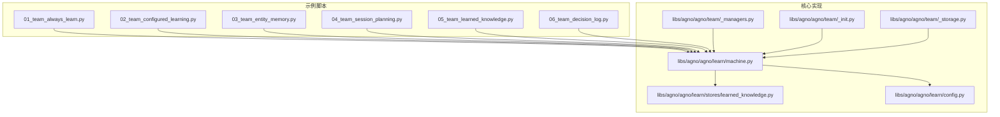
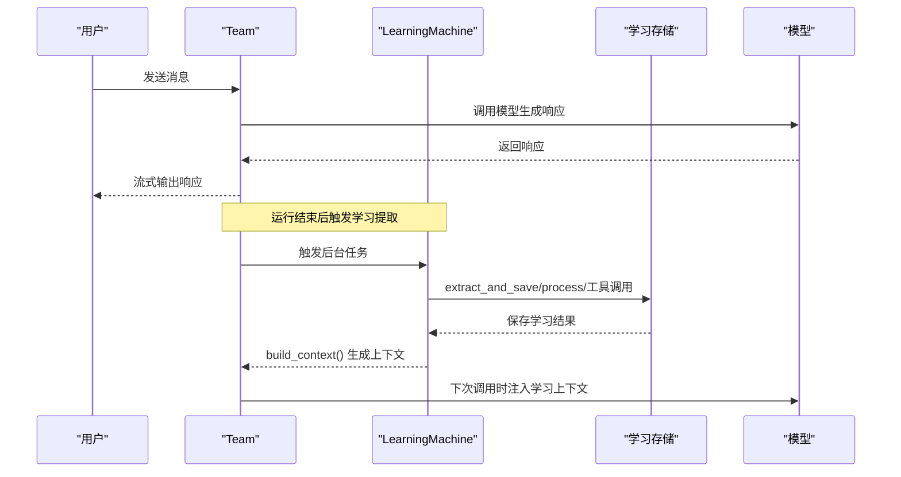
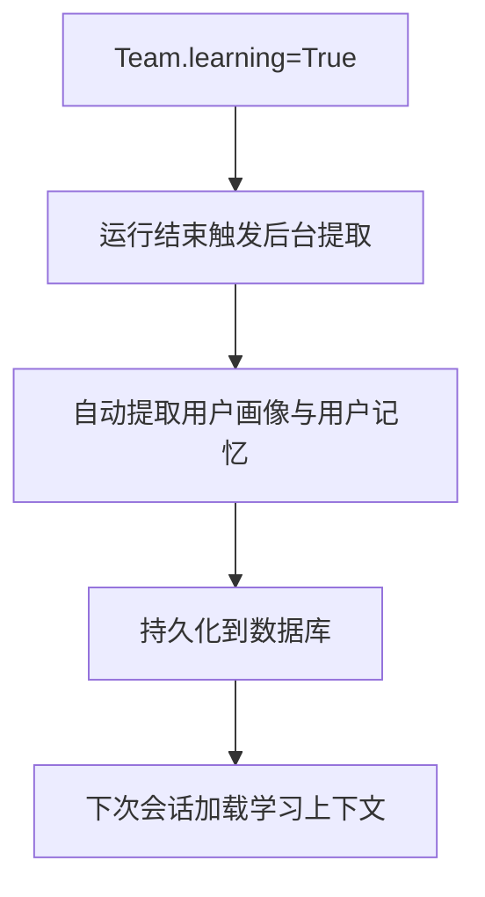
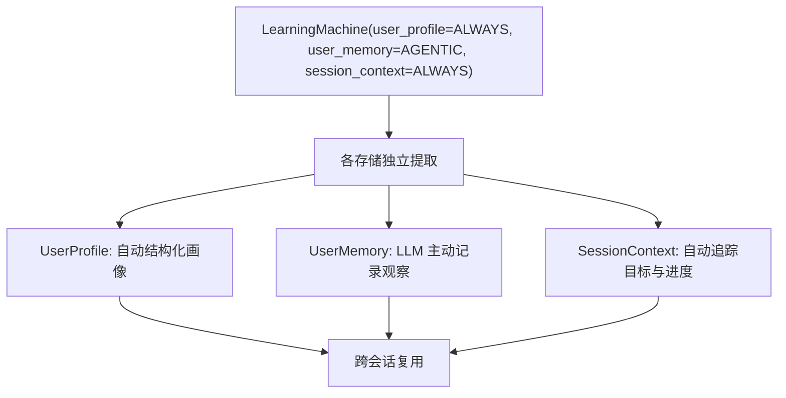
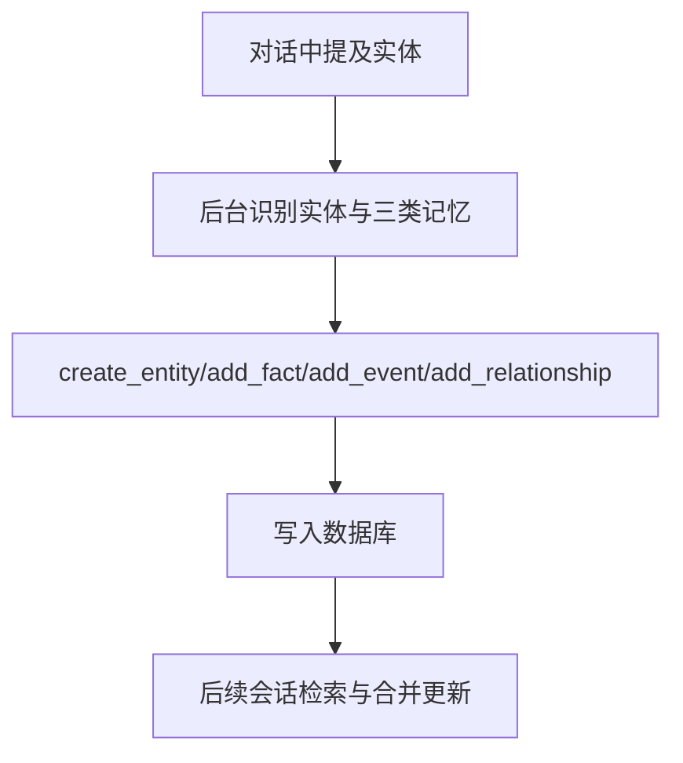
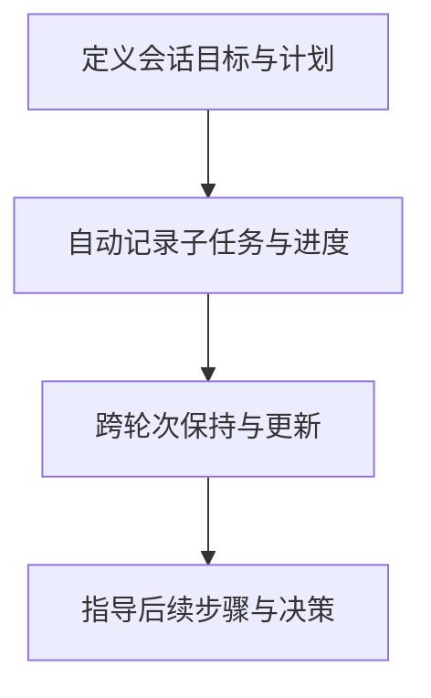
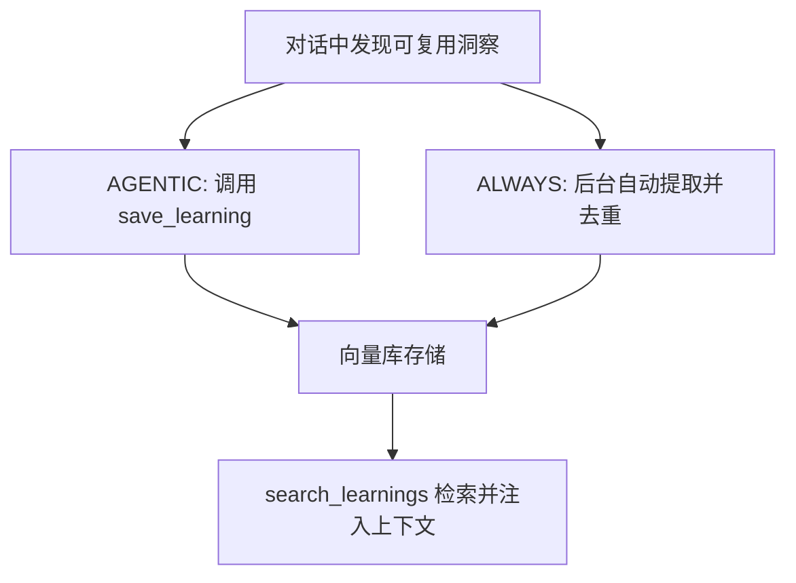
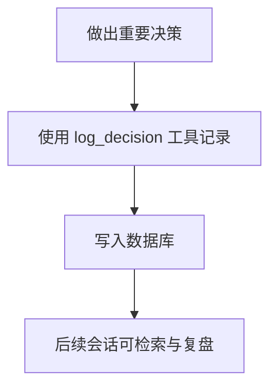
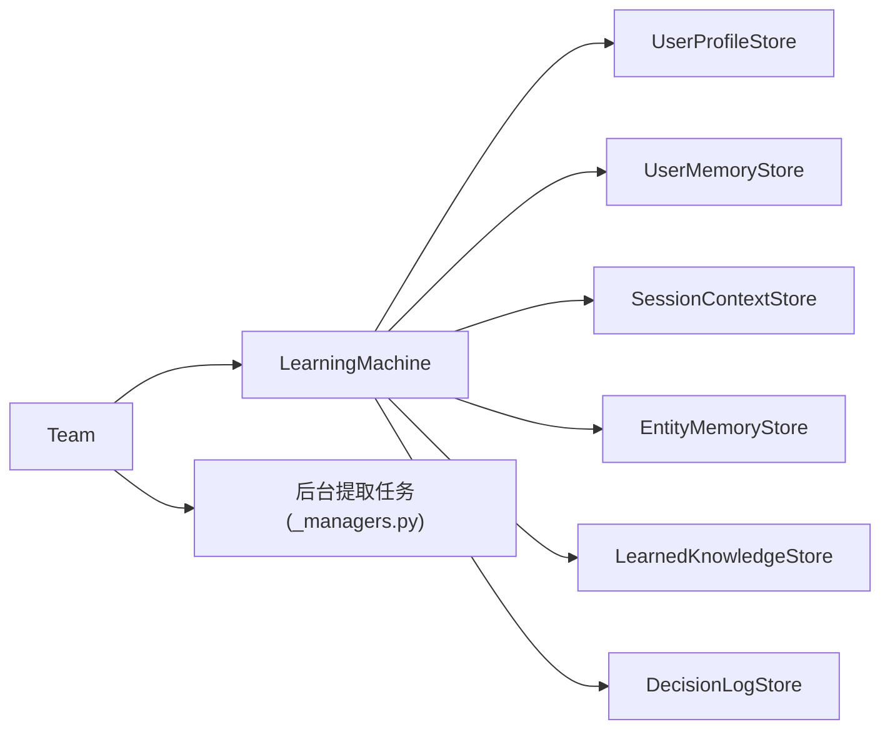

# 团队学习

<cite>
**本文引用的文件**
- [01_team_always_learn.py](file://cookbook/03_teams/12_learning/01_team_always_learn.py)
- [02_team_configured_learning.py](file://cookbook/03_teams/12_learning/02_team_configured_learning.py)
- [03_team_entity_memory.py](file://cookbook/03_teams/12_learning/03_team_entity_memory.py)
- [04_team_session_planning.py](file://cookbook/03_teams/12_learning/04_team_session_planning.py)
- [05_team_learned_knowledge.py](file://cookbook/03_teams/12_learning/05_team_learned_knowledge.py)
- [06_team_decision_log.py](file://cookbook/03_teams/12_learning/06_team_decision_log.py)
- [machine.py](file://libs/agno/agno/learn/machine.py)
- [learned_knowledge.py](file://libs/agno/agno/learn/stores/learned_knowledge.py)
- [_managers.py](file://libs/agno/agno/team/_managers.py)
- [_init.py](file://libs/agno/agno/team/_init.py)
- [_storage.py](file://libs/agno/agno/team/_storage.py)
- [config.py](file://libs/agno/agno/learn/config.py)
- [README.md](file://cookbook/03_teams/12_learning/README.md)
</cite>

## 目录
1. [简介](#简介)
2. [项目结构](#项目结构)
3. [核心组件](#核心组件)
4. [架构总览](#架构总览)
5. [详细组件分析](#详细组件分析)
6. [依赖关系分析](#依赖关系分析)
7. [性能考量](#性能考量)
8. [故障排查指南](#故障排查指南)
9. [结论](#结论)
10. [附录](#附录)

## 简介
本文件面向团队学习系统，系统性阐述团队自学习能力的实现与应用，覆盖以下主题：
- 团队学习模式配置：始终学习模式、配置化学习模式
- 学习策略选择：ALWAYS、AGENTIC、PROPOSE 等模式及其适用场景
- 效果评估与指标：如何衡量学习收益与质量
- 机制说明：经验收集、知识提取、学习总结
- 配置方法：始终学习模式、配置化学习模式、实体记忆集成、会话规划
- 知识管理：学习知识的提取、分类与更新
- 代码示例路径：团队始终学习、团队配置学习、团队实体记忆、团队会话规划、团队学习知识、团队决策日志
- 协作效率提升与优化策略：减少重复劳动、增强上下文一致性、降低认知负担
- 性能优化与最佳实践：并发处理、向量化检索、命名空间隔离、工具调用成本控制

## 项目结构
团队学习示例位于 cookbook/03_teams/12_learning，围绕 Team 的 learning 参数与 LearningMachine 配置展开，涵盖用户画像、用户记忆、会话上下文、实体记忆、学习知识与决策日志等六大维度。

**图表来源**
- [01_team_always_learn.py:1-89](file://cookbook/03_teams/12_learning/01_team_always_learn.py#L1-L89)
- [02_team_configured_learning.py:1-109](file://cookbook/03_teams/12_learning/02_team_configured_learning.py#L1-L109)
- [03_team_entity_memory.py:1-117](file://cookbook/03_teams/12_learning/03_team_entity_memory.py#L1-L117)
- [04_team_session_planning.py:1-121](file://cookbook/03_teams/12_learning/04_team_session_planning.py#L1-L121)
- [05_team_learned_knowledge.py:1-130](file://cookbook/03_teams/12_learning/05_team_learned_knowledge.py#L1-L130)
- [06_team_decision_log.py:1-113](file://cookbook/03_teams/12_learning/06_team_decision_log.py#L1-L113)
- [machine.py:1-200](file://libs/agno/agno/learn/machine.py#L1-L200)
- [learned_knowledge.py:1-200](file://libs/agno/agno/learn/stores/learned_knowledge.py#L1-L200)
- [_managers.py:293-321](file://libs/agno/agno/team/_managers.py#L293-L321)
- [_init.py:579-598](file://libs/agno/agno/team/_init.py#L579-L598)
- [_storage.py:613-754](file://libs/agno/agno/team/_storage.py#L613-L754)
- [config.py:1-272](file://libs/agno/agno/learn/config.py#L1-L272)

**章节来源**
- [README.md:1-26](file://cookbook/03_teams/12_learning/README.md#L1-L26)

## 核心组件
- LearningMachine：统一学习中枢，负责协调用户画像、用户记忆、会话上下文、实体记忆、学习知识、决策日志等存储，并在运行后触发后台提取或在 AGENTIC 模式下注入工具。
- 各学习存储：分别实现不同的学习目标与模式，如 LearnedKnowledgeStore 提供可共享的“可复用洞察”存储与工具。
- Team 集成：Team 在初始化时注入 LearningMachine；在每次运行结束后，通过后台任务触发学习提取；可将学习上下文注入系统提示，增强响应一致性。
- 配置体系：LearningMode 枚举定义 ALWAYS/AGENTIC/PROPOSE/HITL；各存储配置类（如 LearnedKnowledgeConfig、EntityMemoryConfig 等）提供模式、命名空间、工具开关等参数。

**章节来源**
- [machine.py:52-162](file://libs/agno/agno/learn/machine.py#L52-L162)
- [config.py:32-272](file://libs/agno/agno/learn/config.py#L32-L272)
- [_init.py:579-598](file://libs/agno/agno/team/_init.py#L579-L598)
- [_storage.py:613-754](file://libs/agno/agno/team/_storage.py#L613-L754)

## 架构总览
团队学习在“运行—提取—注入—应用”的闭环中工作：
- 运行阶段：Team 执行一次对话，生成响应。
- 提取阶段：根据配置，后台异步提取学习内容（ALWAYS 模式）或等待模型调用工具（AGENTIC 模式）。
- 注入阶段：将学习上下文注入系统提示，影响后续响应。
- 应用阶段：成员在对话中使用学习知识（如检索学习知识、记录决策日志）。

**图表来源**
- [_managers.py:293-321](file://libs/agno/agno/team/_managers.py#L293-L321)
- [learned_knowledge.py:1084-1185](file://libs/agno/agno/learn/stores/learned_knowledge.py#L1084-L1185)
- [machine.py:350-572](file://libs/agno/agno/learn/machine.py#L350-L572)

## 详细组件分析

### 团队始终学习（Always Mode）
- 配置方式：Team.learning=True 即启用自动学习，无需额外配置。
- 学习范围：自动捕获用户画像与用户记忆，适合快速落地、低成本试错。
- 示例路径：[01_team_always_learn.py:1-89](file://cookbook/03_teams/12_learning/01_team_always_learn.py#L1-L89)

**图表来源**
- [01_team_always_learn.py:41-89](file://cookbook/03_teams/12_learning/01_team_always_learn.py#L41-L89)
- [_managers.py:293-321](file://libs/agno/agno/team/_managers.py#L293-L321)

**章节来源**
- [01_team_always_learn.py:1-89](file://cookbook/03_teams/12_learning/01_team_always_learn.py#L1-L89)

### 团队配置化学习（Configured Stores）
- 配置方式：通过 LearningMachine 分别为用户画像、用户记忆、会话上下文设置独立模式（ALWAYS/AGENTIC）。
- 优势：按需启用不同维度的学习，兼顾自动化与可控性。
- 示例路径：[02_team_configured_learning.py:1-109](file://cookbook/03_teams/12_learning/02_team_configured_learning.py#L1-L109)

**图表来源**
- [02_team_configured_learning.py:48-109](file://cookbook/03_teams/12_learning/02_team_configured_learning.py#L48-L109)
- [config.py:32-272](file://libs/agno/agno/learn/config.py#L32-L272)

**章节来源**
- [02_team_configured_learning.py:1-109](file://cookbook/03_teams/12_learning/02_team_configured_learning.py#L1-L109)

### 团队实体记忆（Entity Memory）
- 功能：跟踪人、项目、公司等实体的事实、事件与关系，适合复杂多实体协作场景。
- 配置：EntityMemoryConfig 支持 ALWAYS 模式后台提取，自动识别并写入数据库。
- 示例路径：[03_team_entity_memory.py:1-117](file://cookbook/03_teams/12_learning/03_team_entity_memory.py#L1-L117)

**图表来源**
- [03_team_entity_memory.py:49-117](file://cookbook/03_teams/12_learning/03_team_entity_memory.py#L49-L117)
- [config.py:338-380](file://libs/agno/agno/learn/config.py#L338-L380)

**章节来源**
- [03_team_entity_memory.py:1-117](file://cookbook/03_teams/12_learning/03_team_entity_memory.py#L1-L117)

### 团队会话规划（Session Planning）
- 功能：在会话上下文中追踪目标、子任务与完成状态，支持多步骤任务的持续推进。
- 配置：SessionContextConfig.enable_planning=True 开启规划模式。
- 示例路径：[04_team_session_planning.py:1-121](file://cookbook/03_teams/12_learning/04_team_session_planning.py#L1-L121)

**图表来源**
- [04_team_session_planning.py:49-121](file://cookbook/03_teams/12_learning/04_team_session_planning.py#L49-L121)

**章节来源**
- [04_team_session_planning.py:1-121](file://cookbook/03_teams/12_learning/04_team_session_planning.py#L1-L121)

### 团队学习知识（Learned Knowledge）
- 功能：构建可共享的“可复用洞察”知识库，支持语义检索与工具调用保存。
- 配置：LearnedKnowledgeConfig.mode 支持 AGENTIC/PROPOSE/ALWAYS；结合 Knowledge 与向量数据库实现。
- 示例路径：[05_team_learned_knowledge.py:1-130](file://cookbook/03_teams/12_learning/05_team_learned_knowledge.py#L1-L130)

**图表来源**
- [05_team_learned_knowledge.py:60-130](file://cookbook/03_teams/12_learning/05_team_learned_knowledge.py#L60-L130)
- [learned_knowledge.py:97-200](file://libs/agno/agno/learn/stores/learned_knowledge.py#L97-L200)
- [learned_knowledge.py:1084-1185](file://libs/agno/agno/learn/stores/learned_knowledge.py#L1084-L1185)

**章节来源**
- [05_team_learned_knowledge.py:1-130](file://cookbook/03_teams/12_learning/05_team_learned_knowledge.py#L1-L130)
- [learned_knowledge.py:1-200](file://libs/agno/agno/learn/stores/learned_knowledge.py#L1-L200)

### 团队决策日志（Decision Log）
- 功能：记录重大技术决策的背景、理由与结果，用于审计与复盘。
- 配置：DecisionLogConfig.enable_agent_tools=True 时，允许成员使用工具记录与查询。
- 示例路径：[06_team_decision_log.py:1-113](file://cookbook/03_teams/12_learning/06_team_decision_log.py#L1-L113)

**图表来源**
- [06_team_decision_log.py:48-113](file://cookbook/03_teams/12_learning/06_team_decision_log.py#L48-L113)

**章节来源**
- [06_team_decision_log.py:1-113](file://cookbook/03_teams/12_learning/06_team_decision_log.py#L1-L113)

## 依赖关系分析
- Team 与 LearningMachine：Team 在初始化时注入 LearningMachine；Team 的序列化/反序列化逻辑保留 learning 配置。
- 提取触发：Team 运行结束后，通过后台任务触发学习提取；若已有任务未完成则取消并重新创建。
- 存储解耦：各学习存储独立实现，LearningMachine 统一调度；存储之间互不影响，便于按需启用。

**图表来源**
- [_init.py:579-598](file://libs/agno/agno/team/_init.py#L579-L598)
- [_storage.py:613-754](file://libs/agno/agno/team/_storage.py#L613-L754)
- [_managers.py:293-321](file://libs/agno/agno/team/_managers.py#L293-L321)
- [machine.py:104-162](file://libs/agno/agno/learn/machine.py#L104-L162)

**章节来源**
- [_init.py:579-598](file://libs/agno/agno/team/_init.py#L579-L598)
- [_storage.py:613-754](file://libs/agno/agno/team/_storage.py#L613-L754)
- [_managers.py:293-321](file://libs/agno/agno/team/_managers.py#L293-L321)
- [machine.py:104-162](file://libs/agno/agno/learn/machine.py#L104-L162)

## 性能考量
- 并发与异步：后台提取采用异步任务，避免阻塞主线响应。
- 向量化检索：LearnedKnowledgeStore 使用向量数据库进行语义检索，提高相关性与召回效率。
- 命名空间隔离：学习知识按命名空间（用户/全局/自定义）隔离，减少无关检索开销。
- 工具调用成本：在 AGENTIC 模式下，仅在必要时调用工具，避免不必要的模型推理。
- 模型指标统计：后台提取时可累积模型用量指标，便于成本控制与优化。

**章节来源**
- [learned_knowledge.py:1174-1185](file://libs/agno/agno/learn/stores/learned_knowledge.py#L1174-L1185)
- [learned_knowledge.py:124-134](file://libs/agno/agno/learn/stores/learned_knowledge.py#L124-L134)

## 故障排查指南
- 数据库未提供：若 Team 初始化时未提供数据库，LearningMachine 将不会初始化，导致学习功能不可用。请确保 db 参数正确传入。
- 模型未提供：某些模式（如 ALWAYS）需要模型进行提取，若未提供模型，后台提取将跳过。
- 命名空间错误：LearnedKnowledgeStore 在 user 命名空间下需要 user_id，否则会返回警告并跳过检索。
- 任务冲突：后台提取任务可能被新的运行打断，旧任务会被取消并抛出异常，属预期行为。

**章节来源**
- [_init.py:595-598](file://libs/agno/agno/team/_init.py#L595-L598)
- [learned_knowledge.py:124-126](file://libs/agno/agno/learn/stores/learned_knowledge.py#L124-L126)
- [_managers.py:303-308](file://libs/agno/agno/team/_managers.py#L303-L308)

## 结论
团队学习系统通过 LearningMachine 将多维学习能力整合到 Team 中，既支持“开箱即用”的始终学习模式，也支持“按需定制”的配置化学习模式。结合实体记忆、会话规划、学习知识与决策日志，团队可在长期协作中沉淀知识、提升一致性与效率。实践中应根据业务场景选择合适的学习模式与存储组合，并关注性能与成本控制。

## 附录
- 代码示例路径（不含具体代码内容）：
  - 团队始终学习：[01_team_always_learn.py:1-89](file://cookbook/03_teams/12_learning/01_team_always_learn.py#L1-L89)
  - 团队配置学习：[02_team_configured_learning.py:1-109](file://cookbook/03_teams/12_learning/02_team_configured_learning.py#L1-L109)
  - 团队实体记忆：[03_team_entity_memory.py:1-117](file://cookbook/03_teams/12_learning/03_team_entity_memory.py#L1-L117)
  - 团队会话规划：[04_team_session_planning.py:1-121](file://cookbook/03_teams/12_learning/04_team_session_planning.py#L1-L121)
  - 团队学习知识：[05_team_learned_knowledge.py:1-130](file://cookbook/03_teams/12_learning/05_team_learned_knowledge.py#L1-L130)
  - 团队决策日志：[06_team_decision_log.py:1-113](file://cookbook/03_teams/12_learning/06_team_decision_log.py#L1-L113)
- 核心实现参考：
  - LearningMachine 初始化与存储解析：[machine.py:104-162](file://libs/agno/agno/learn/machine.py#L104-L162)
  - 后台提取流程（Team 触发）：[_managers.py:293-321](file://libs/agno/agno/team/_managers.py#L293-L321)
  - 学习知识提取与工具注入：[learned_knowledge.py:1084-1185](file://libs/agno/agno/learn/stores/learned_knowledge.py#L1084-L1185)
  - 配置枚举与存储配置：[config.py:32-272](file://libs/agno/agno/learn/config.py#L32-L272)