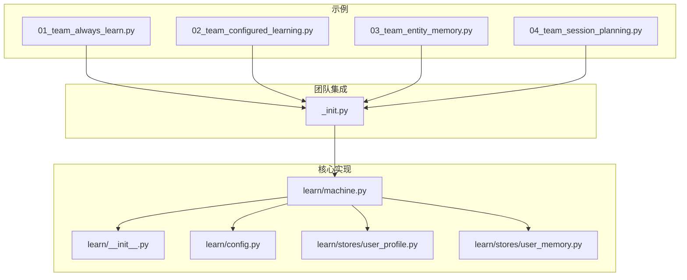
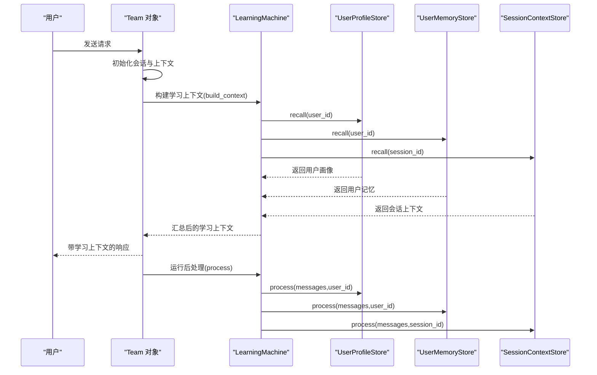
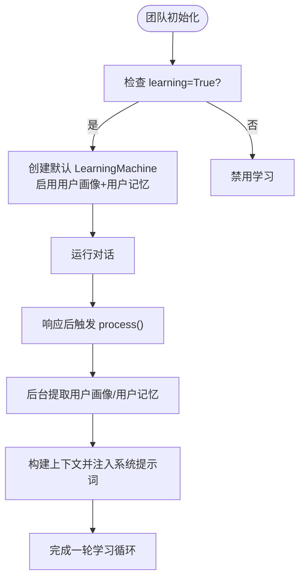
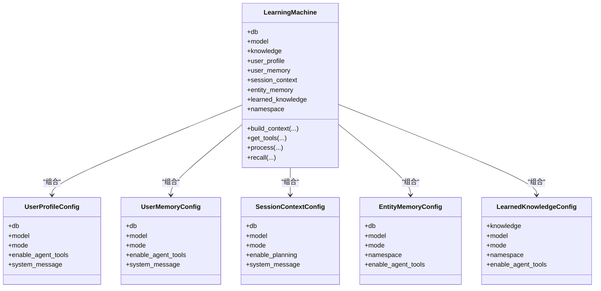
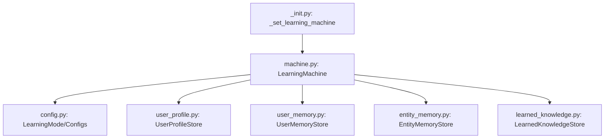

# 团队学习模式

<cite>
**本文档引用的文件**
- [01_team_always_learn.py](file://cookbook/03_teams/12_learning/01_team_always_learn.py)
- [02_team_configured_learning.py](file://cookbook/03_teams/12_learning/02_team_configured_learning.py)
- [_init.py](file://libs/agno/agno/team/_init.py)
- [config.py](file://libs/agno/agno/learn/config.py)
- [machine.py](file://libs/agno/agno/learn/machine.py)
- [user_profile.py](file://libs/agno/agno/learn/stores/user_profile.py)
- [user_memory.py](file://libs/agno/agno/learn/stores/user_memory.py)
- [learn/__init__.py](file://libs/agno/agno/learn/__init__.py)
- [03_team_entity_memory.py](file://cookbook/03_teams/12_learning/03_team_entity_memory.py)
- [04_team_session_planning.py](file://cookbook/03_teams/12_learning/04_team_session_planning.py)
</cite>

## 目录
1. [简介](#简介)
2. [项目结构](#项目结构)
3. [核心组件](#核心组件)
4. [架构总览](#架构总览)
5. [详细组件分析](#详细组件分析)
6. [依赖关系分析](#依赖关系分析)
7. [性能考虑](#性能考虑)
8. [故障排除指南](#故障排除指南)
9. [结论](#结论)

## 简介
本文件系统性阐述团队自学习的两种主要模式：始终学习模式（ALWAYS）与配置化学习模式（CONFIGURED）。始终学习模式通过在团队层面开启学习功能，使系统在每次响应后自动提取用户画像、用户记忆等信息，无需人工干预；配置化学习模式则允许针对不同学习维度（如用户画像、用户记忆、会话上下文、实体记忆、已学知识等）分别配置独立的学习模式与参数，实现精细化控制。

两种模式均基于统一的 LearningMachine 协调器，通过可插拔的学习存储（Store）实现跨会话与会话级的记忆持久化，并支持将学习结果注入到系统提示词中以增强个性化与上下文感知能力。

## 项目结构
围绕团队学习模式的相关代码分布在以下位置：
- 示例脚本：cookbook/03_teams/12_learning 下包含始终学习与配置化学习的示例
- 核心实现：libs/agno/agno/learn 下包含 LearningMachine、配置与存储实现
- 团队集成：libs/agno/agno/team/_init.py 中负责团队初始化与学习机注入

**图表来源**
- [01_team_always_learn.py:1-89](file://cookbook/03_teams/12_learning/01_team_always_learn.py#L1-L89)
- [02_team_configured_learning.py:1-109](file://cookbook/03_teams/12_learning/02_team_configured_learning.py#L1-L109)
- [learn/__init__.py:1-72](file://libs/agno/agno/learn/__init__.py#L1-L72)
- [config.py:1-464](file://libs/agno/agno/learn/config.py#L1-L464)
- [machine.py:1-772](file://libs/agno/agno/learn/machine.py#L1-L772)
- [user_profile.py:1-200](file://libs/agno/agno/learn/stores/user_profile.py#L1-L200)
- [user_memory.py:1-200](file://libs/agno/agno/learn/stores/user_memory.py#L1-L200)
- [_init.py:579-610](file://libs/agno/agno/team/_init.py#L579-L610)

**章节来源**
- [01_team_always_learn.py:1-89](file://cookbook/03_teams/12_learning/01_team_always_learn.py#L1-L89)
- [02_team_configured_learning.py:1-109](file://cookbook/03_teams/12_learning/02_team_configured_learning.py#L1-L109)
- [learn/__init__.py:1-72](file://libs/agno/agno/learn/__init__.py#L1-L72)
- [_init.py:579-610](file://libs/agno/agno/team/_init.py#L579-L610)

## 核心组件
- LearningMode：学习模式枚举，定义 ALWAYS、AGENTIC、PROPOSE、HITL 四种模式
- LearningMachine：统一学习协调器，负责管理多个学习存储（用户画像、用户记忆、会话上下文、实体记忆、已学知识等）
- 学习存储（Store）：具体实现不同学习类型的读写、提取与上下文构建
- 团队初始化：在团队对象上注入 LearningMachine，并根据配置决定是否启用学习

关键要点：
- 始终学习模式：团队 learning=True 时，系统自动创建默认 LearningMachine 并启用用户画像与用户记忆
- 配置化学习模式：通过 LearningMachine 接收各存储的配置对象，按需启用不同模式与参数

**章节来源**
- [config.py:32-45](file://libs/agno/agno/learn/config.py#L32-L45)
- [machine.py:52-95](file://libs/agno/agno/learn/machine.py#L52-L95)
- [_init.py:579-610](file://libs/agno/agno/team/_init.py#L579-L610)

## 架构总览
团队学习模式的运行流程如下：

**图表来源**
- [machine.py:350-419](file://libs/agno/agno/learn/machine.py#L350-L419)
- [machine.py:498-567](file://libs/agno/agno/learn/machine.py#L498-L567)
- [user_profile.py:107-158](file://libs/agno/agno/learn/stores/user_profile.py#L107-L158)
- [user_memory.py:97-171](file://libs/agno/agno/learn/stores/user_memory.py#L97-L171)

## 详细组件分析

### 始终学习模式（ALWAYS）
- 配置方式：在团队初始化时将 learning=True
- 行为特征：系统在每次响应完成后自动后台提取用户画像与用户记忆，不消耗 LLM 决策资源
- 适用场景：希望团队具备基础记忆能力且无需额外工具调用的场景

实现要点：
- 团队初始化时检测 learning=True，若数据库可用则创建默认 LearningMachine（启用用户画像与用户记忆）
- 响应后通过 process 方法触发各存储的提取逻辑
- 将学习结果注入系统提示词，提升个性化与一致性

**图表来源**
- [_init.py:579-610](file://libs/agno/agno/team/_init.py#L579-L610)
- [machine.py:498-567](file://libs/agno/agno/learn/machine.py#L498-L567)
- [user_profile.py:127-181](file://libs/agno/agno/learn/stores/user_profile.py#L127-L181)
- [user_memory.py:117-171](file://libs/agno/agno/learn/stores/user_memory.py#L117-L171)

**章节来源**
- [01_team_always_learn.py:1-89](file://cookbook/03_teams/12_learning/01_team_always_learn.py#L1-L89)
- [_init.py:579-610](file://libs/agno/agno/team/_init.py#L579-L610)

### 配置化学习模式（CONFIGURED）
- 配置方式：通过 LearningMachine 接收各存储的配置对象，分别为其指定 LearningMode
- 行为特征：不同存储可独立选择模式（如用户画像 ALWAYS、用户记忆 AGENTIC、会话上下文 ALWAYS 等）
- 适用场景：需要精细化控制学习行为、区分结构化与非结构化记忆、跟踪会话目标与进度的复杂团队

实现要点：
- 支持多种存储配置：UserProfileConfig、UserMemoryConfig、SessionContextConfig、EntityMemoryConfig、LearnedKnowledgeConfig
- 每个存储可独立启用/禁用工具、指令定制、命名空间等
- 会话上下文支持规划模式（enable_planning），用于跟踪目标、计划与进度

**图表来源**
- [machine.py:52-95](file://libs/agno/agno/learn/machine.py#L52-L95)
- [config.py:52-287](file://libs/agno/agno/learn/config.py#L52-L287)

**章节来源**
- [02_team_configured_learning.py:1-109](file://cookbook/03_teams/12_learning/02_team_configured_learning.py#L1-L109)
- [config.py:52-287](file://libs/agno/agno/learn/config.py#L52-L287)
- [machine.py:111-162](file://libs/agno/agno/learn/machine.py#L111-L162)

### 学习模式详解与最佳实践

- ALWAYS 模式
  - 适合快速落地、无需人工干预的团队
  - 注意后台提取可能带来额外的计算开销
  - 建议配合合适的数据库与模型以平衡性能

- AGENTIC 模式
  - 适合需要模型自主判断何时保存学习的场景
  - 通过工具暴露（如 update_user_profile、update_user_memory）实现可控保存
  - 需要模型具备良好的工具调用意图识别能力

- PROPOSE/HITL 模式
  - PROPOSE：模型提出保存建议，经人工确认后再保存
  - HITL：预留的人类在回路模式，当前阶段主要用于未来扩展
  - 适合对数据质量要求极高的场景

最佳实践：
- 始终学习模式：适用于大多数通用团队，确保基本记忆能力
- 配置化学习模式：针对复杂业务（如项目管理、发布流程、实体关系管理）进行精细化配置
- 合理选择命名空间（namespace）与工具权限，避免过度暴露或权限不足
- 在会话规划场景中启用 SessionContext 的规划模式，以持续跟踪目标与进度

**章节来源**
- [config.py:32-45](file://libs/agno/agno/learn/config.py#L32-L45)
- [learn/__init__.py:13-42](file://libs/agno/agno/learn/__init__.py#L13-L42)

### 示例与使用方法

- 始终学习模式示例路径
  - [01_team_always_learn.py:41-49](file://cookbook/03_teams/12_learning/01_team_always_learn.py#L41-L49)
  - [01_team_always_learn.py:55-89](file://cookbook/03_teams/12_learning/01_team_always_learn.py#L55-L89)

- 配置化学习模式示例路径
  - [02_team_configured_learning.py:48-66](file://cookbook/03_teams/12_learning/02_team_configured_learning.py#L48-L66)
  - [02_team_configured_learning.py:72-109](file://cookbook/03_teams/12_learning/02_team_configured_learning.py#L72-L109)

- 实体记忆与会话规划示例路径
  - [03_team_entity_memory.py:49-64](file://cookbook/03_teams/12_learning/03_team_entity_memory.py#L49-L64)
  - [04_team_session_planning.py:49-64](file://cookbook/03_teams/12_learning/04_team_session_planning.py#L49-L64)

**章节来源**
- [01_team_always_learn.py:1-89](file://cookbook/03_teams/12_learning/01_team_always_learn.py#L1-L89)
- [02_team_configured_learning.py:1-109](file://cookbook/03_teams/12_learning/02_team_configured_learning.py#L1-L109)
- [03_team_entity_memory.py:1-117](file://cookbook/03_teams/12_learning/03_team_entity_memory.py#L1-L117)
- [04_team_session_planning.py:1-121](file://cookbook/03_teams/12_learning/04_team_session_planning.py#L1-L121)

## 依赖关系分析
- 团队层依赖 LearningMachine：通过团队初始化逻辑注入学习机实例
- LearningMachine 依赖各存储配置与存储实现：按需创建并管理存储实例
- 存储实现依赖配置与数据模型：根据配置决定模式与行为，并使用相应数据结构

**图表来源**
- [_init.py:579-610](file://libs/agno/agno/team/_init.py#L579-L610)
- [machine.py:111-162](file://libs/agno/agno/learn/machine.py#L111-L162)
- [config.py:52-287](file://libs/agno/agno/learn/config.py#L52-L287)
- [user_profile.py:60-95](file://libs/agno/agno/learn/stores/user_profile.py#L60-L95)
- [user_memory.py:55-95](file://libs/agno/agno/learn/stores/user_memory.py#L55-L95)

**章节来源**
- [_init.py:579-610](file://libs/agno/agno/team/_init.py#L579-L610)
- [machine.py:111-162](file://libs/agno/agno/learn/machine.py#L111-L162)

## 性能考虑
- ALWAYS 模式：后台并行提取可能增加延迟与资源占用，建议在高并发场景下评估数据库与模型的负载
- AGENTIC 模式：依赖模型的工具调用决策，可能因误调用导致重复或遗漏，建议结合工具权限与提示词优化
- 存储选择：合理设置命名空间与工具权限，避免不必要的查询与更新操作
- 会话规划：启用规划模式会增加上下文维护成本，建议仅在多步骤任务中使用

[本节为通用指导，无需特定文件引用]

## 故障排除指南
- 数据库未提供：当团队未配置数据库时，学习机不会初始化，相关学习功能将被禁用
- 模式不支持：某些存储不支持特定模式（如 UserProfileStore 不支持 PROPOSE/HITL），会在初始化时发出警告
- 工具未注册：在 AGENTIC 模式下，需确保学习机正确生成并注册工具给模型

排查步骤：
- 检查团队初始化日志，确认学习机是否成功创建
- 查看存储初始化日志，确认模式与工具权限配置
- 在会话中打印学习结果，验证上下文注入是否生效

**章节来源**
- [_init.py:595-598](file://libs/agno/agno/team/_init.py#L595-L598)
- [user_profile.py:88-91](file://libs/agno/agno/learn/stores/user_profile.py#L88-L91)
- [user_memory.py:78-81](file://libs/agno/agno/learn/stores/user_memory.py#L78-L81)

## 结论
团队学习模式提供了从“零配置自动学习”到“精细化定制”的完整能力谱系。始终学习模式适合快速落地与通用场景，配置化学习模式则满足复杂业务对学习行为的精细控制需求。通过合理选择模式、配置存储与工具权限，并结合命名空间与上下文注入策略，可以在保证性能的前提下最大化团队的智能协作能力。