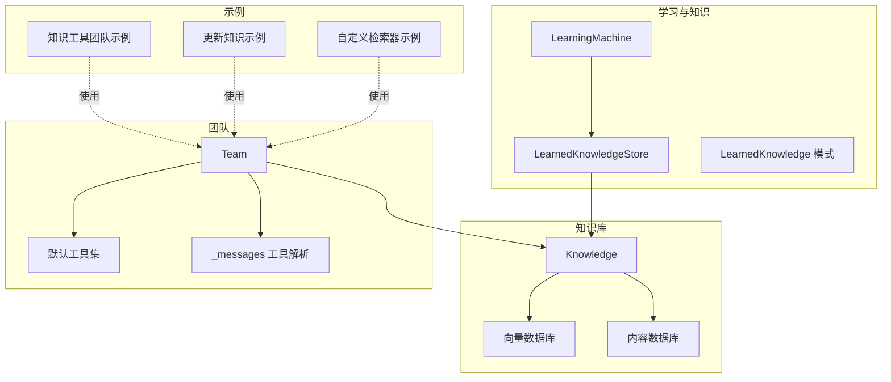
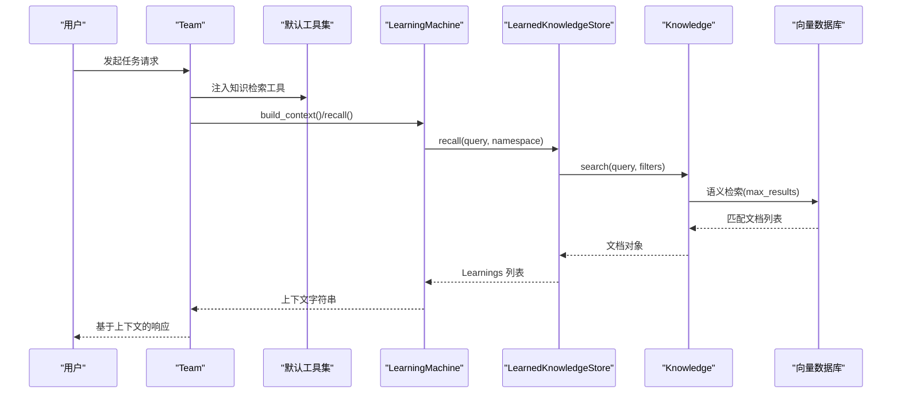
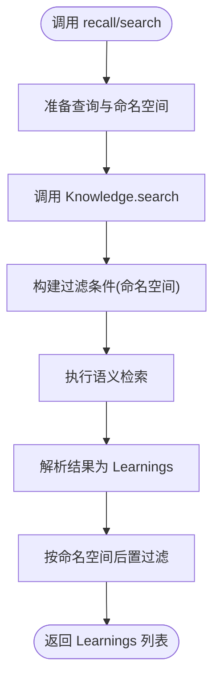
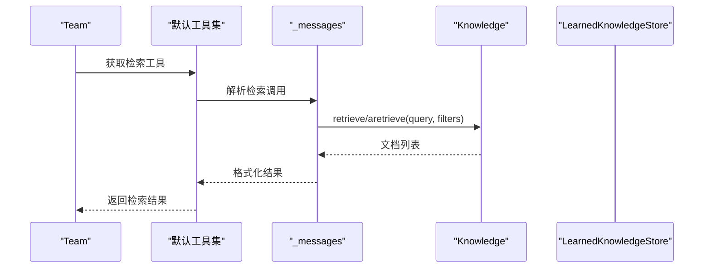
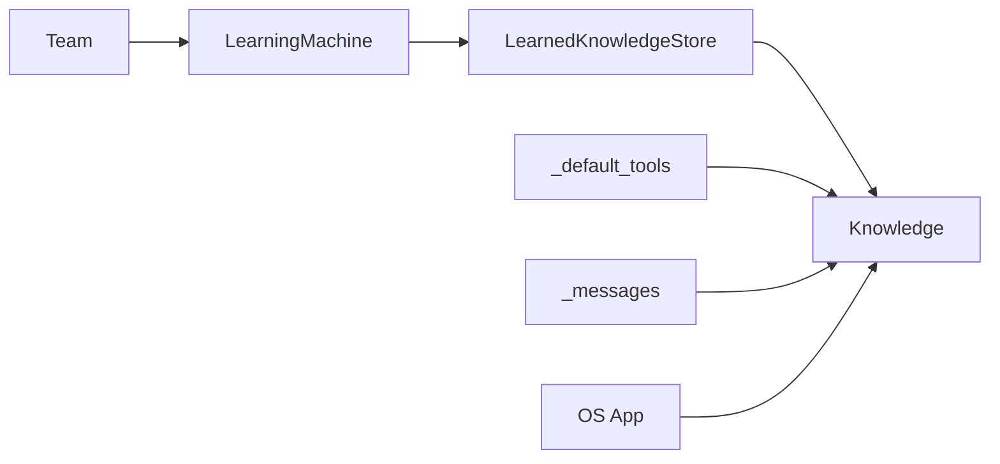

# 团队学习知识

<cite>
**本文引用的文件**
- [learned_knowledge.py](file://libs/agno/agno/learn/stores/learned_knowledge.py)
- [schemas.py](file://libs/agno/agno/learn/schemas.py)
- [knowledge.py](file://libs/agno/agno/knowledge/knowledge.py)
- [team.py](file://libs/agno/agno/team/team.py)
- [_default_tools.py](file://libs/agno/agno/team/_default_tools.py)
- [_messages.py](file://libs/agno/agno/agent/_messages.py)
- [config.py](file://libs/agno/agno/learn/config.py)
- [machine.py](file://libs/agno/agno/learn/machine.py)
- [app.py](file://libs/agno/agno/os/app.py)
- [in_memory_db.py](file://libs/agno/agno/db/in_memory/in_memory_db.py)
- [base.py](file://libs/agno/agno/db/base.py)
- [knowledge_tool_team.md](file://cookbook/10_reasoning/teams/knowledge_tool_team.md)
- [05_team_update_knowledge.md](file://cookbook/03_teams/05_knowledge/05_team_update_knowledge.md)
- [04_team_with_custom_retriever.py](file://cookbook/03_teams/05_knowledge/04_team_with_custom_retriever.py)
</cite>

## 目录
1. [简介](#简介)
2. [项目结构](#项目结构)
3. [核心组件](#核心组件)
4. [架构总览](#架构总览)
5. [详细组件分析](#详细组件分析)
6. [依赖关系分析](#依赖关系分析)
7. [性能考虑](#性能考虑)
8. [故障排查指南](#故障排查指南)
9. [结论](#结论)
10. [附录](#附录)

## 简介
本文件系统性阐述“团队学习知识”的概念、机制与实践方法，围绕以下目标展开：
- 解释团队学习知识的定义：从团队协作中沉淀可复用的洞察与经验，形成跨用户、跨任务共享的知识资产。
- 说明知识的采集、整理、分类与存储流程，以及在团队决策中的应用路径。
- 提供可操作的配置与使用示例，覆盖知识提取、分类策略与知识查询。
- 讨论知识的更新机制与版本管理策略，包括继承、改进与淘汰。

## 项目结构
该仓库以模块化方式组织学习与知识相关能力：
- 学习与知识存储：learned_knowledge 存储层、LearnedKnowledge 数据模型、LearningMachine 统一编排。
- 知识库与检索：Knowledge 核心类提供向量化检索、内容管理与过滤能力。
- 团队集成：Team 类支持知识检索工具注入、上下文注入与知识更新工具。
- 示例与用法：cookbook 中包含团队知识工具、更新知识与自定义检索器等实战示例。

图表来源
- [machine.py:52-340](file://libs/agno/agno/learn/machine.py#L52-L340)
- [learned_knowledge.py:49-120](file://libs/agno/agno/learn/stores/learned_knowledge.py#L49-L120)
- [schemas.py:419-497](file://libs/agno/agno/learn/schemas.py#L419-L497)
- [knowledge.py:41-120](file://libs/agno/agno/knowledge/knowledge.py#L41-L120)
- [team.py:202-228](file://libs/agno/agno/team/team.py#L202-L228)
- [_default_tools.py:1417-1563](file://libs/agno/agno/team/_default_tools.py#L1417-L1563)
- [_messages.py:1893-1925](file://libs/agno/agno/agent/_messages.py#L1893-L1925)
- [knowledge_tool_team.md:60-82](file://cookbook/10_reasoning/teams/knowledge_tool_team.md#L60-L82)
- [05_team_update_knowledge.md:42-61](file://cookbook/03_teams/05_knowledge/05_team_update_knowledge.md#L42-L61)
- [04_team_with_custom_retriever.py:44-87](file://cookbook/03_teams/05_knowledge/04_team_with_custom_retriever.py#L44-L87)

章节来源
- [machine.py:52-340](file://libs/agno/agno/learn/machine.py#L52-L340)
- [learned_knowledge.py:49-120](file://libs/agno/agno/learn/stores/learned_knowledge.py#L49-L120)
- [schemas.py:419-497](file://libs/agno/agno/learn/schemas.py#L419-L497)
- [knowledge.py:41-120](file://libs/agno/agno/knowledge/knowledge.py#L41-L120)
- [team.py:202-228](file://libs/agno/agno/team/team.py#L202-L228)
- [_default_tools.py:1417-1563](file://libs/agno/agno/team/_default_tools.py#L1417-L1563)
- [_messages.py:1893-1925](file://libs/agno/agno/agent/_messages.py#L1893-L1925)
- [knowledge_tool_team.md:60-82](file://cookbook/10_reasoning/teams/knowledge_tool_team.md#L60-L82)
- [05_team_update_knowledge.md:42-61](file://cookbook/03_teams/05_knowledge/05_team_update_knowledge.md#L42-L61)
- [04_team_with_custom_retriever.py:44-87](file://cookbook/03_teams/05_knowledge/04_team_with_custom_retriever.py#L44-L87)

## 核心组件
- LearnedKnowledgeStore：面向“可复用洞察”的存储后端，提供搜索与保存工具、命名空间隔离、语义检索与异步支持。
- LearnedKnowledge：数据模型，包含标题、洞察、上下文、标签与命名空间等字段，支持文本化用于向量化。
- Knowledge：统一的知识库抽象，负责内容插入、检索、删除与过滤，支持向量数据库与内容数据库协同。
- LearningMachine：统一学习编排器，协调多种学习存储（用户画像、会话上下文、实体记忆、已学知识），并提供工具与上下文构建。
- Team：团队容器，可注入知识检索工具、上下文与知识更新工具，支持自定义检索器与依赖传递。

章节来源
- [learned_knowledge.py:49-120](file://libs/agno/agno/learn/stores/learned_knowledge.py#L49-L120)
- [schemas.py:419-497](file://libs/agno/agno/learn/schemas.py#L419-L497)
- [knowledge.py:41-120](file://libs/agno/agno/knowledge/knowledge.py#L41-L120)
- [machine.py:52-340](file://libs/agno/agno/learn/machine.py#L52-L340)
- [team.py:202-228](file://libs/agno/agno/team/team.py#L202-L228)

## 架构总览
团队学习知识的运行时架构由“学习编排—知识存储—检索—团队应用”四层构成：
- 学习编排：LearningMachine 负责初始化各学习存储、构建上下文、暴露工具。
- 知识存储：LearnedKnowledgeStore 基于 Knowledge 实现语义检索与命名空间控制。
- 检索工具：Team 默认工具与消息处理逻辑自动调用知识检索，或通过自定义检索器扩展。
- 团队应用：团队成员在对话中触发搜索与保存，沉淀为可复用知识；后续任务可直接引用。

图表来源
- [machine.py:350-418](file://libs/agno/agno/learn/machine.py#L350-L418)
- [learned_knowledge.py:97-134](file://libs/agno/agno/learn/stores/learned_knowledge.py#L97-L134)
- [knowledge.py:507-591](file://libs/agno/agno/knowledge/knowledge.py#L507-L591)
- [_default_tools.py:1417-1563](file://libs/agno/agno/team/_default_tools.py#L1417-L1563)

## 详细组件分析

### LearnedKnowledgeStore 组件
- 角色与职责
  - 提供 search_learnings 与 save_learning 两类工具，支持同步与异步。
  - 支持命名空间隔离（全局、用户私有、自定义分组），并在 KB 不支持过滤时进行后置过滤。
  - 通过语义检索返回最相关的“可复用洞察”，并支持按用户/命名空间限制可见范围。
- 关键流程
  - recall/arecall：根据查询构建语义检索，返回 learnings 列表。
  - search/asearch：对底层 Knowledge 执行检索，必要时注入命名空间过滤。
  - get_tools/aget_tools：按配置暴露搜索与保存工具。
- 配置要点
  - enable_agent_tools、agent_can_search、agent_can_save 控制工具暴露。
  - namespace 控制可见性边界；user 命名空间需要 user_id。

图表来源
- [learned_knowledge.py:97-134](file://libs/agno/agno/learn/stores/learned_knowledge.py#L97-L134)
- [learned_knowledge.py:731-779](file://libs/agno/agno/learn/stores/learned_knowledge.py#L731-L779)

章节来源
- [learned_knowledge.py:97-134](file://libs/agno/agno/learn/stores/learned_knowledge.py#L97-L134)
- [learned_knowledge.py:731-779](file://libs/agno/agno/learn/stores/learned_knowledge.py#L731-L779)
- [learned_knowledge.py:481-547](file://libs/agno/agno/learn/stores/learned_knowledge.py#L481-L547)
- [learned_knowledge.py:553-641](file://libs/agno/agno/learn/stores/learned_knowledge.py#L553-L641)
- [learned_knowledge.py:647-725](file://libs/agno/agno/learn/stores/learned_knowledge.py#L647-L725)

### LearnedKnowledge 数据模型
- 字段设计
  - 标题、洞察、上下文、标签、命名空间与审计字段（用户/团队/代理标识、时间戳）。
- 序列化与文本化
  - 支持 from_dict/to_dict，to_text 将多字段拼接为可向量化文本，便于检索。
- 扩展性
  - 可通过子类扩展字段，并由 from_dict 自动识别新增字段。

章节来源
- [schemas.py:419-497](file://libs/agno/agno/learn/schemas.py#L419-L497)

### Knowledge 知识库抽象
- 能力概览
  - 插入内容（单个/批量）、异步插入、内容管理（获取、状态、更新、删除）。
  - 检索（同步/异步）、过滤（字典/表达式）、链接隔离（linked_to）。
- 与存储的协作
  - 与向量数据库协同完成语义检索；与内容数据库协同完成元数据与状态管理。
- 高级特性
  - isolate_vector_search：多实例隔离；get_valid_filters：动态过滤键发现。

章节来源
- [knowledge.py:90-501](file://libs/agno/agno/knowledge/knowledge.py#L90-L501)
- [knowledge.py:507-591](file://libs/agno/agno/knowledge/knowledge.py#L507-L591)
- [knowledge.py:692-772](file://libs/agno/agno/knowledge/knowledge.py#L692-L772)

### LearningMachine 统一学习编排
- 组织与初始化
  - 统一管理用户画像、会话上下文、实体记忆、已学知识等存储，支持懒加载与自定义存储。
- 主要接口
  - build_context/abuild_context：构建系统提示上下文。
  - get_tools/aget_tools：聚合各存储工具。
  - recall/arecall/process/aprocess：统一召回与抽取。
- 命名空间与调试
  - 统一 namespace 策略；支持日志级别设置。

章节来源
- [machine.py:104-162](file://libs/agno/agno/learn/machine.py#L104-L162)
- [machine.py:350-418](file://libs/agno/agno/learn/machine.py#L350-L418)
- [machine.py:420-496](file://libs/agno/agno/learn/machine.py#L420-L496)
- [machine.py:572-656](file://libs/agno/agno/learn/machine.py#L572-L656)

### Team 团队集成与知识应用
- 知识检索工具注入
  - 通过默认工具集与消息处理逻辑自动解析检索调用，支持同步/异步检索。
- 自定义检索器
  - 支持 team.knowledge_retriever 自定义检索函数，兼容依赖参数与运行上下文。
- 知识更新工具
  - 可启用 update_knowledge 开关，使团队具备写入知识库的能力。

图表来源
- [_default_tools.py:1417-1563](file://libs/agno/agno/team/_default_tools.py#L1417-L1563)
- [_messages.py:1893-1925](file://libs/agno/agno/agent/_messages.py#L1893-L1925)
- [knowledge.py:507-591](file://libs/agno/agno/knowledge/knowledge.py#L507-L591)

章节来源
- [team.py:202-228](file://libs/agno/agno/team/team.py#L202-L228)
- [_default_tools.py:1417-1563](file://libs/agno/agno/team/_default_tools.py#L1417-L1563)
- [_messages.py:1893-1925](file://libs/agno/agno/agent/_messages.py#L1893-L1925)
- [04_team_with_custom_retriever.py:44-87](file://cookbook/03_teams/05_knowledge/04_team_with_custom_retriever.py#L44-L87)

### 示例与实战
- 知识工具团队
  - 展示团队循环中“规划—检索—评估—补充—汇总”的检索闭环。
- 更新知识
  - 展示团队在运行时写入知识并即时检索验证的流程。
- 自定义检索器
  - 展示如何通过 team.knowledge_retriever 接入依赖与上下文，实现灵活检索。

章节来源
- [knowledge_tool_team.md:60-82](file://cookbook/10_reasoning/teams/knowledge_tool_team.md#L60-L82)
- [05_team_update_knowledge.md:42-61](file://cookbook/03_teams/05_knowledge/05_team_update_knowledge.md#L42-L61)
- [04_team_with_custom_retriever.py:44-87](file://cookbook/03_teams/05_knowledge/04_team_with_custom_retriever.py#L44-L87)

## 依赖关系分析
- 学习存储依赖知识库：LearnedKnowledgeStore 通过 Knowledge 的 search/aretrieve 实现语义检索。
- 团队依赖学习编排：Team 通过 LearningMachine 构建上下文与工具，注入到系统提示中。
- 消息层依赖知识协议：_messages 与 _default_tools 对 Knowledge 协议进行统一解析与调用。
- OS 层配置：app.py 负责整合知识库与数据库配置，确保知识实例可用。

图表来源
- [learned_knowledge.py:456-458](file://libs/agno/agno/learn/stores/learned_knowledge.py#L456-L458)
- [machine.py:144-148](file://libs/agno/agno/learn/machine.py#L144-L148)
- [_default_tools.py:1417-1563](file://libs/agno/agno/team/_default_tools.py#L1417-L1563)
- [_messages.py:1893-1925](file://libs/agno/agno/agent/_messages.py#L1893-L1925)
- [app.py:1236-1251](file://libs/agno/agno/os/app.py#L1236-L1251)

章节来源
- [learned_knowledge.py:456-458](file://libs/agno/agno/learn/stores/learned_knowledge.py#L456-L458)
- [machine.py:144-148](file://libs/agno/agno/learn/machine.py#L144-L148)
- [_default_tools.py:1417-1563](file://libs/agno/agno/team/_default_tools.py#L1417-L1563)
- [_messages.py:1893-1925](file://libs/agno/agno/agent/_messages.py#L1893-L1925)
- [app.py:1236-1251](file://libs/agno/agno/os/app.py#L1236-L1251)

## 性能考虑
- 检索性能
  - 通过 max_results 控制返回数量，避免过长上下文影响响应速度。
  - 在 KB 支持时优先使用 filters，减少后置过滤成本。
- 异步检索
  - 提供 asearch/aretrieve 与异步数据库配合，提升高并发场景下的吞吐。
- 存储与索引
  - isolate_vector_search 与 linked_to 元数据可避免跨实例检索干扰，但需重新索引已有数据。
- 日志与可观测性
  - debug_mode 与 AGNO_DEBUG 环境变量控制日志级别，便于定位性能瓶颈。

## 故障排查指南
- 未配置知识库
  - 现象：search 返回空列表或警告。
  - 处理：确保 LearnedKnowledgeConfig.knowledge 或 LearningMachine.knowledge 已注入。
- 命名空间访问问题
  - 现象：user 命名空间需要 user_id，否则返回空。
  - 处理：调用 recall 时传入 user_id，或切换为 global/自定义命名空间。
- 检索工具不可用
  - 现象：无法调用 search_learnings/save_learning。
  - 处理：确认 enable_agent_tools、agent_can_search、agent_can_save 已开启。
- 自定义检索器异常
  - 现象：team.knowledge_retriever 抛出异常。
  - 处理：检查签名兼容（team/filters/run_context/dependencies），并确保返回格式一致。
- 数据库一致性
  - 现象：删除内容后仍被检索到。
  - 处理：确认 contents_db 与 vector_db 的删除流程均已执行，必要时重建索引。

章节来源
- [learned_knowledge.py:751-753](file://libs/agno/agno/learn/stores/learned_knowledge.py#L751-L753)
- [learned_knowledge.py:123-126](file://libs/agno/agno/learn/stores/learned_knowledge.py#L123-L126)
- [learned_knowledge.py:419-426](file://libs/agno/agno/learn/stores/learned_knowledge.py#L419-L426)
- [_default_tools.py:1417-1563](file://libs/agno/agno/team/_default_tools.py#L1417-L1563)
- [base.py:297-337](file://libs/agno/agno/db/base.py#L297-L337)
- [in_memory_db.py:828-872](file://libs/agno/agno/db/in_memory/in_memory_db.py#L828-L872)

## 结论
团队学习知识体系以 LearningMachine 为核心，结合 LearnedKnowledgeStore 与 Knowledge 抽象，实现了从“协作经验—可复用洞察—团队决策”的闭环。通过命名空间隔离、语义检索与工具化封装，团队可在不同任务中高效复用历史智慧，持续优化协作质量。建议在生产环境中：
- 明确命名空间策略与权限边界；
- 合理设置检索上限与过滤条件；
- 采用异步检索与缓存策略提升性能；
- 建立知识更新与淘汰机制，保持知识库的健康与时效。

## 附录

### 配置与使用要点清单
- LearnedKnowledgeStore
  - enable_agent_tools、agent_can_search、agent_can_save
  - namespace（global/user/custom）
- Knowledge
  - max_results、isolate_vector_search、linked_to
  - insert/insert_many、search/asearch、remove_content_by_id
- Team
  - knowledge_retriever 自定义检索器
  - update_knowledge 写入开关
- LearningMachine
  - stores 初始化与工具聚合
  - build_context/abuild_context、recall/arecall

章节来源
- [learned_knowledge.py:419-426](file://libs/agno/agno/learn/stores/learned_knowledge.py#L419-L426)
- [knowledge.py:48-120](file://libs/agno/agno/knowledge/knowledge.py#L48-L120)
- [team.py:202-228](file://libs/agno/agno/team/team.py#L202-L228)
- [machine.py:350-418](file://libs/agno/agno/learn/machine.py#L350-L418)