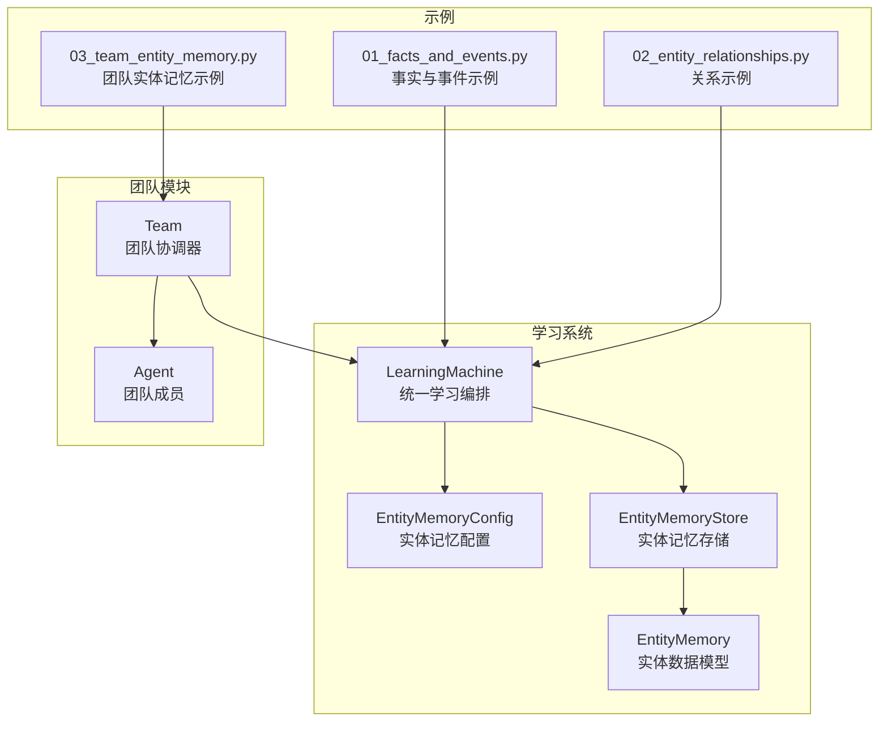
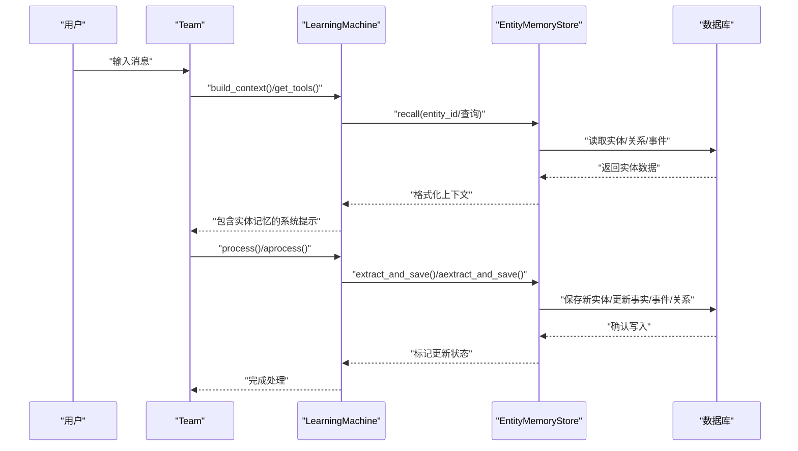
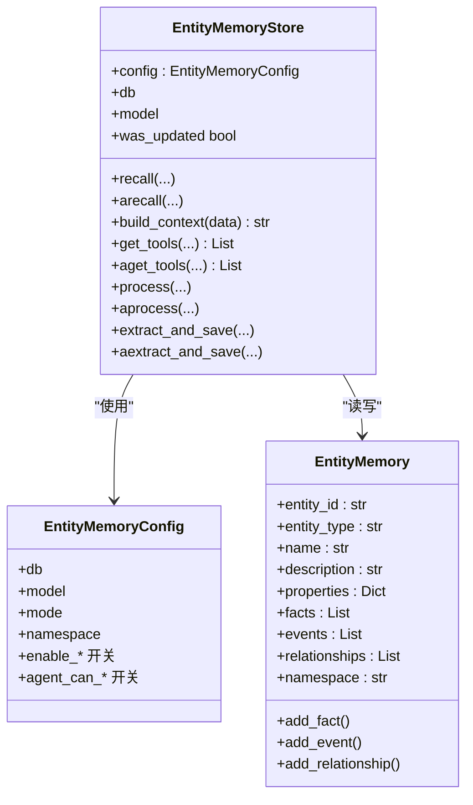
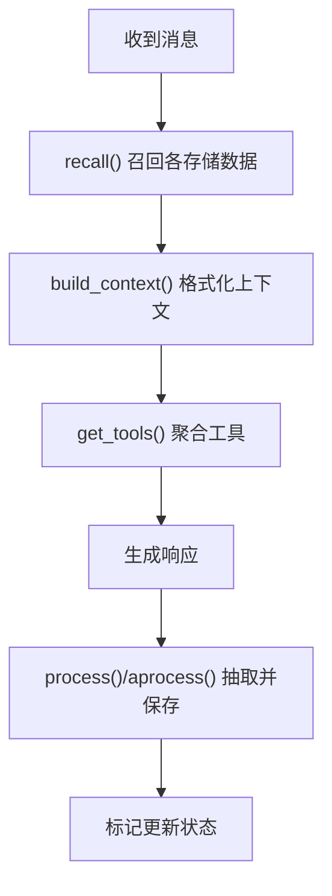
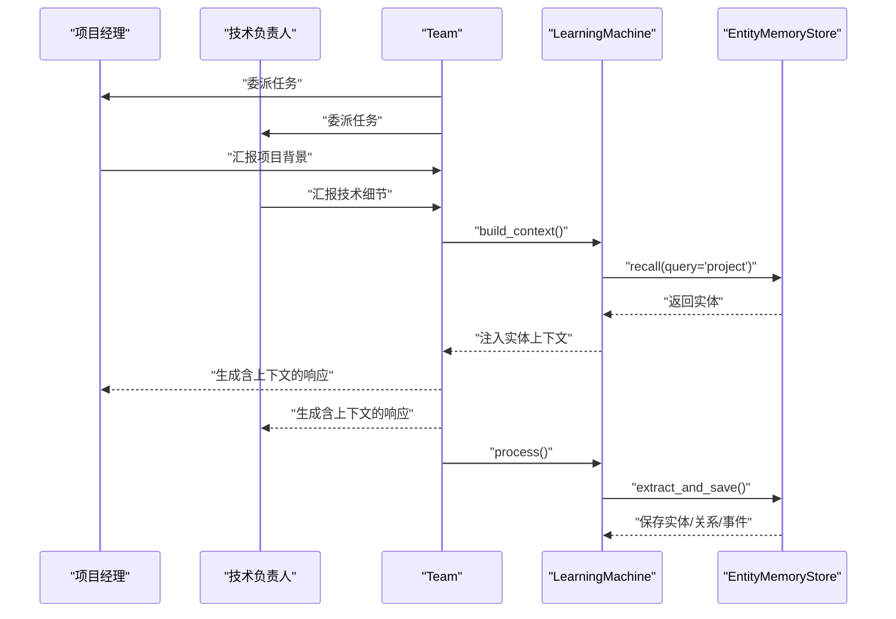
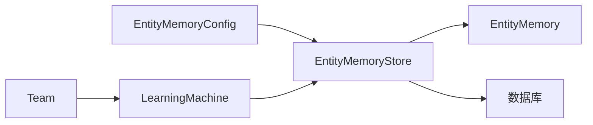

# 团队实体记忆

<cite>
**本文档引用的文件**
- [entity_memory.py](file://libs/agno/agno/learn/stores/entity_memory.py)
- [config.py](file://libs/agno/agno/learn/config.py)
- [machine.py](file://libs/agno/agno/learn/machine.py)
- [schemas.py](file://libs/agno/agno/learn/schemas.py)
- [team.py](file://libs/agno/agno/team/team.py)
- [03_team_entity_memory.py](file://cookbook/03_teams/12_learning/03_team_entity_memory.py)
- [01_facts_and_events.py](file://cookbook/08_learning/04_entity_memory/01_facts_and_events.py)
- [02_entity_relationships.py](file://cookbook/08_learning/04_entity_memory/02_entity_relationships.py)
- [5a_entity_memory_always.md](file://cookbook/08_learning/01_basics/5a_entity_memory_always.md)
- [5b_entity_memory_agentic.md](file://cookbook/08_learning/01_basics/5b_entity_memory_agentic.md)
- [curate.py](file://libs/agno/agno/learn/curate.py)
</cite>

## 目录
1. [简介](#简介)
2. [项目结构](#项目结构)
3. [核心组件](#核心组件)
4. [架构总览](#架构总览)
5. [详细组件分析](#详细组件分析)
6. [依赖关系分析](#依赖关系分析)
7. [性能考虑](#性能考虑)
8. [故障排除指南](#故障排除指南)
9. [结论](#结论)
10. [附录](#附录)

## 简介
本文件系统性阐述团队实体记忆的设计与实现，围绕以下目标展开：
- 解释实体记忆的概念：如何识别与提取团队中的关键实体、实体关系与实体属性
- 详述团队实体记忆的构建流程：实体的自动识别、关系建立与记忆巩固
- 说明实体记忆在团队协作中的价值：提升决策质量与协作效率
- 提供可直接定位的代码示例路径，展示配置与使用方式：实体提取、关系建模与记忆查询
- 总结维护策略与优化方法：去重、更新与清理机制

## 项目结构
团队实体记忆由“学习机”统一编排，实体记忆存储作为学习类型之一，配合团队模块协同工作。核心文件分布如下：
- 学习机与配置：负责统一调度与参数配置
- 实体记忆存储：负责实体的持久化、检索与工具暴露
- 实体数据模型：定义实体的结构与操作接口
- 团队模块：承载多智能体协作，并集成学习机
- 示例与文档：展示实体记忆在团队场景下的使用

**图表来源**
- [machine.py:52-269](file://libs/agno/agno/learn/machine.py#L52-L269)
- [config.py:289-371](file://libs/agno/agno/learn/config.py#L289-L371)
- [entity_memory.py:64-357](file://libs/agno/agno/learn/stores/entity_memory.py#L64-L357)
- [schemas.py:504-687](file://libs/agno/agno/learn/schemas.py#L504-L687)
- [team.py:70-200](file://libs/agno/agno/team/team.py#L70-L200)
- [03_team_entity_memory.py:1-117](file://cookbook/03_teams/12_learning/03_team_entity_memory.py#L1-L117)

**章节来源**
- [machine.py:52-269](file://libs/agno/agno/learn/machine.py#L52-L269)
- [config.py:289-371](file://libs/agno/agno/learn/config.py#L289-L371)
- [entity_memory.py:64-357](file://libs/agno/agno/learn/stores/entity_memory.py#L64-L357)
- [schemas.py:504-687](file://libs/agno/agno/learn/schemas.py#L504-L687)
- [team.py:70-200](file://libs/agno/agno/team/team.py#L70-L200)
- [03_team_entity_memory.py:1-117](file://cookbook/03_teams/12_learning/03_team_entity_memory.py#L1-L117)

## 核心组件
- 实体记忆配置（EntityMemoryConfig）：定义实体记忆的学习模式、命名空间、启用的工具与提取能力
- 实体记忆存储（EntityMemoryStore）：实现实体的检索、构建上下文、暴露工具、后台抽取与异步处理
- 实体数据模型（EntityMemory）：定义实体的核心属性、事实、事件与关系
- 学习机（LearningMachine）：统一编排用户记忆、会话上下文、实体记忆与已学知识
- 团队（Team）：承载多智能体协作，集成学习机以实现跨轮次的记忆共享与沉淀

关键职责与关系：
- 配置决定实体记忆的行为边界（模式、命名空间、工具开关）
- 存储负责与数据库交互、构建上下文注入、工具生成
- 数据模型提供实体结构与增删改查接口
- 学习机协调各存储并将上下文注入到系统提示
- 团队在多智能体场景下复用学习机，实现跨成员的记忆共享

**章节来源**
- [config.py:289-371](file://libs/agno/agno/learn/config.py#L289-L371)
- [entity_memory.py:64-357](file://libs/agno/agno/learn/stores/entity_memory.py#L64-L357)
- [schemas.py:504-687](file://libs/agno/agno/learn/schemas.py#L504-L687)
- [machine.py:52-269](file://libs/agno/agno/learn/machine.py#L52-L269)
- [team.py:70-200](file://libs/agno/agno/team/team.py#L70-L200)

## 架构总览
实体记忆在团队中的端到端流程如下：
- 会话输入经团队协调后，学习机按配置选择实体记忆模式
- ALWAYS 模式下，系统自动从对话中抽取实体、事实、事件与关系
- AGENTIC 模式下，实体管理工具由智能体显式调用进行创建与更新
- 学习机将实体上下文格式化并注入系统提示，增强后续回复的准确性
- 团队成员共享同一学习机实例，实现跨成员的记忆复用

**图表来源**
- [machine.py:350-567](file://libs/agno/agno/learn/machine.py#L350-L567)
- [entity_memory.py:168-227](file://libs/agno/agno/learn/stores/entity_memory.py#L168-L227)
- [03_team_entity_memory.py:70-117](file://cookbook/03_teams/12_learning/03_team_entity_memory.py#L70-L117)

## 详细组件分析

### 组件一：实体记忆存储（EntityMemoryStore）
- 职责
  - 实体检索与上下文构建：根据实体ID或查询词召回实体，格式化为系统提示片段
  - 工具暴露：在 AGENTIC 或开启工具时，向智能体暴露搜索、创建、更新、添加事实/事件/关系等工具
  - 后台抽取：在 ALWAYS 模式下，基于模型与工具自动从对话中抽取实体信息并落库
  - 异步处理：提供异步版本的抽取与工具生成，适配高并发场景
- 关键接口
  - recall/arecall：按实体ID或查询召回实体
  - build_context：将实体数据格式化为上下文字符串
  - get_tools/aget_tools：生成实体管理工具集合
  - process/aprocess：触发后台抽取
  - extract_and_save/aextract_and_save：执行抽取并保存
- 设计要点
  - 支持命名空间控制（user/global/自定义），实现细粒度共享
  - 模式兼容：ALWAYS/AGENTIC/HITL/PROPOSE，其中 PROPOSE/HITL 对实体记忆不支持，自动降级
  - 工具按配置开关动态生成，避免不必要的暴露

**图表来源**
- [entity_memory.py:64-357](file://libs/agno/agno/learn/stores/entity_memory.py#L64-L357)
- [config.py:289-371](file://libs/agno/agno/learn/config.py#L289-L371)
- [schemas.py:504-687](file://libs/agno/agno/learn/schemas.py#L504-L687)

**章节来源**
- [entity_memory.py:64-357](file://libs/agno/agno/learn/stores/entity_memory.py#L64-L357)
- [config.py:289-371](file://libs/agno/agno/learn/config.py#L289-L371)
- [schemas.py:504-687](file://libs/agno/agno/learn/schemas.py#L504-L687)

### 组件二：学习机（LearningMachine）
- 职责
  - 统一编排多个学习存储（用户画像、用户记忆、会话上下文、实体记忆、已学知识）
  - 构建上下文：将各存储召回的数据格式化为系统提示
  - 工具聚合：收集各存储暴露的工具，供智能体调用
  - 处理流程：在对话后触发各存储的抽取与保存逻辑
  - 维护：通过 Curator 提供修剪与去重等维护能力
- 关键接口
  - build_context/abuild_context：构建系统提示
  - get_tools/aget_tools：聚合工具
  - process/aprocess：触发各存储处理
  - recall/arecall：召回原始数据
  - curator：维护接口

**图表来源**
- [machine.py:350-567](file://libs/agno/agno/learn/machine.py#L350-L567)

**章节来源**
- [machine.py:52-269](file://libs/agno/agno/learn/machine.py#L52-L269)
- [machine.py:350-567](file://libs/agno/agno/learn/machine.py#L350-L567)

### 组件三：实体数据模型（EntityMemory）
- 结构
  - 核心属性：实体ID、类型、显示名、描述、键值属性
  - 语义记忆（facts）：时间无关的事实
  - 情节记忆（events）：带时间戳的事件
  - 关系（relationships）：与其他实体的连接
- 操作
  - 添加/更新事实、事件、关系
  - 查询与序列化
- 用途
  - 作为实体记忆存储的读写载体，支撑检索、上下文构建与工具操作

**章节来源**
- [schemas.py:504-687](file://libs/agno/agno/learn/schemas.py#L504-L687)

### 组件四：团队（Team）与实体记忆
- 团队通过集成 LearningMachine，使多智能体在协作过程中共享实体记忆
- 示例展示了在项目管理场景中，团队如何自动跟踪项目、人员与关系，并在后续会话中更新实体信息
- 团队成员可通过共享的学习机访问实体记忆工具，实现跨成员的知识复用

**图表来源**
- [03_team_entity_memory.py:70-117](file://cookbook/03_teams/12_learning/03_team_entity_memory.py#L70-L117)
- [team.py:70-200](file://libs/agno/agno/team/team.py#L70-L200)
- [machine.py:350-567](file://libs/agno/agno/learn/machine.py#L350-L567)

**章节来源**
- [03_team_entity_memory.py:1-117](file://cookbook/03_teams/12_learning/03_team_entity_memory.py#L1-L117)
- [team.py:70-200](file://libs/agno/agno/team/team.py#L70-L200)

## 依赖关系分析
- 配置层：EntityMemoryConfig 控制实体记忆的模式、命名空间与工具开关
- 存储层：EntityMemoryStore 依赖配置与数据库，实现实体的读写与上下文构建
- 数据层：EntityMemory 作为数据模型，被存储层读写
- 编排层：LearningMachine 统一调度各存储，构建上下文并聚合工具
- 应用层：Team 集成 LearningMachine，在多智能体场景下共享实体记忆

**图表来源**
- [config.py:289-371](file://libs/agno/agno/learn/config.py#L289-L371)
- [entity_memory.py:64-357](file://libs/agno/agno/learn/stores/entity_memory.py#L64-L357)
- [schemas.py:504-687](file://libs/agno/agno/learn/schemas.py#L504-L687)
- [machine.py:52-269](file://libs/agno/agno/learn/machine.py#L52-L269)
- [team.py:70-200](file://libs/agno/agno/team/team.py#L70-L200)

**章节来源**
- [config.py:289-371](file://libs/agno/agno/learn/config.py#L289-L371)
- [entity_memory.py:64-357](file://libs/agno/agno/learn/stores/entity_memory.py#L64-L357)
- [schemas.py:504-687](file://libs/agno/agno/learn/schemas.py#L504-L687)
- [machine.py:52-269](file://libs/agno/agno/learn/machine.py#L52-L269)
- [team.py:70-200](file://libs/agno/agno/team/team.py#L70-L200)

## 性能考虑
- 模型调用成本：后台抽取需要调用模型执行工具，建议在对话量较大时启用异步抽取（aextract_and_save）
- 数据库写入：批量写入前可合并多次更新，减少往返开销
- 上下文长度：实体上下文需控制长度，避免超出模型上下文窗口；可结合检索与压缩策略
- 命名空间隔离：合理设置命名空间，避免跨用户/跨团队的无谓扫描
- 工具暴露：仅在必要时开启工具，降低模型推理复杂度

## 故障排除指南
- 模式不支持：PROPOSE/HITL 模式对实体记忆不支持，将自动降级为 ALWAYS；请检查配置
- 命名空间缺失：当命名空间为 user 时需提供 user_id，否则无法检索
- 工具未生效：确保在 AGENTIC 模式或显式开启 enable_agent_tools
- 抽取失败：检查模型与数据库是否正确初始化，查看日志中的警告信息
- 维护不足：定期修剪过期实体与去重重复信息，保持实体图清晰

**章节来源**
- [entity_memory.py:87-94](file://libs/agno/agno/learn/stores/entity_memory.py#L87-L94)
- [entity_memory.py:132-135](file://libs/agno/agno/learn/stores/entity_memory.py#L132-L135)
- [entity_memory.py:2682-2683](file://libs/agno/agno/learn/stores/entity_memory.py#L2682-L2683)
- [entity_memory.py:2730-2731](file://libs/agno/agno/learn/stores/entity_memory.py#L2730-L2731)

## 结论
团队实体记忆通过“配置—存储—编排—应用”的分层设计，实现了对团队协作中关键实体的自动识别、关系建模与持续更新。它不仅提升了团队在复杂多实体场景下的决策质量，也通过命名空间与工具控制保障了安全与可控。结合学习机的上下文注入与团队的多智能体共享机制，实体记忆成为团队长期协作的重要基础设施。

## 附录

### 使用示例与最佳实践
- 团队实体记忆示例
  - [03_team_entity_memory.py:1-117](file://cookbook/03_teams/12_learning/03_team_entity_memory.py#L1-L117)
  - 展示团队如何在项目管理场景中跟踪项目、人员与关系，并在后续会话中更新实体
- 事实与事件示例
  - [01_facts_and_events.py:1-102](file://cookbook/08_learning/04_entity_memory/01_facts_and_events.py#L1-L102)
  - 演示区分事实与事件的 AGENTIC 模式使用
- 关系示例
  - [02_entity_relationships.py:1-101](file://cookbook/08_learning/04_entity_memory/02_entity_relationships.py#L1-L101)
  - 演示如何构建组织结构的知识图谱
- ALWAYS 模式与 AGENTIC 模式的对比
  - [5a_entity_memory_always.md:1-146](file://cookbook/08_learning/01_basics/5a_entity_memory_always.md#L1-L146)
  - [5b_entity_memory_agentic.md:91-122](file://cookbook/08_learning/01_basics/5b_entity_memory_agentic.md#L91-L122)

### 维护与优化
- 维护工具（Curator）
  - [curate.py:1-186](file://libs/agno/agno/learn/curate.py#L1-L186)
  - 提供修剪与去重能力，建议定期清理过期与重复实体
- 实体记忆配置要点
  - [config.py:289-371](file://libs/agno/agno/learn/config.py#L289-L371)
  - 合理设置命名空间与工具开关，平衡自动化与可控性