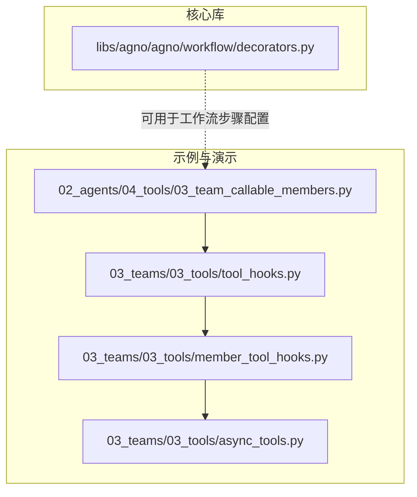
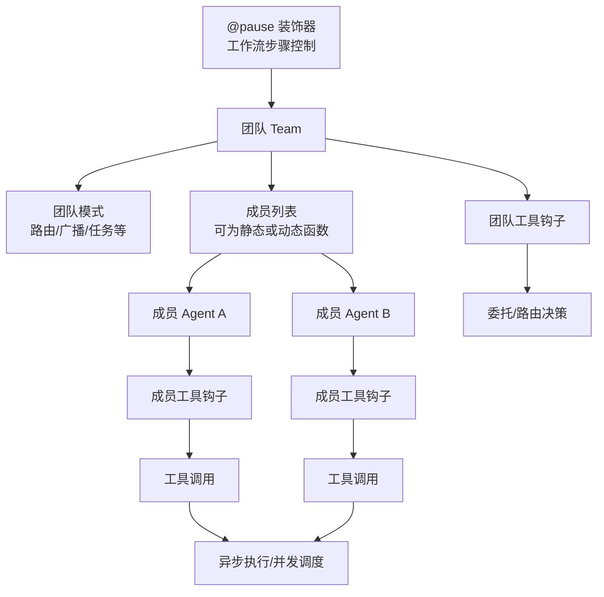
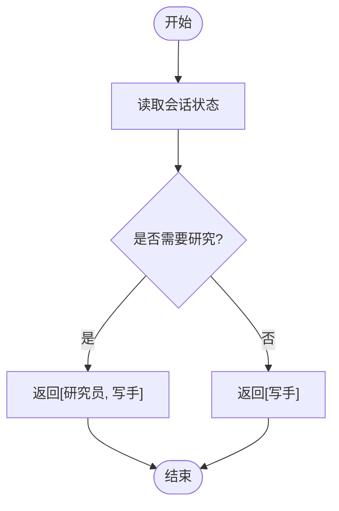
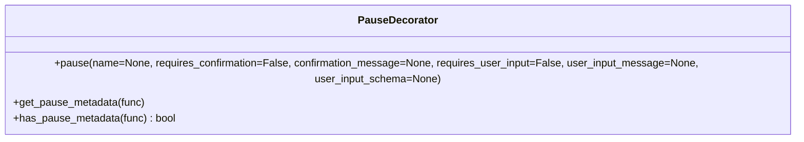
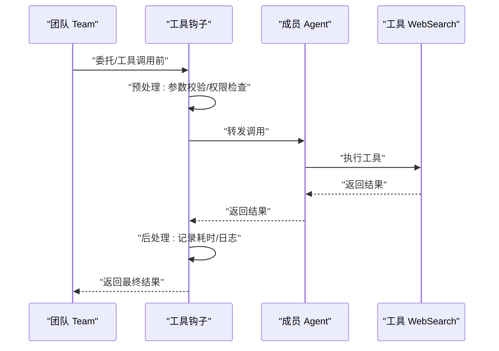
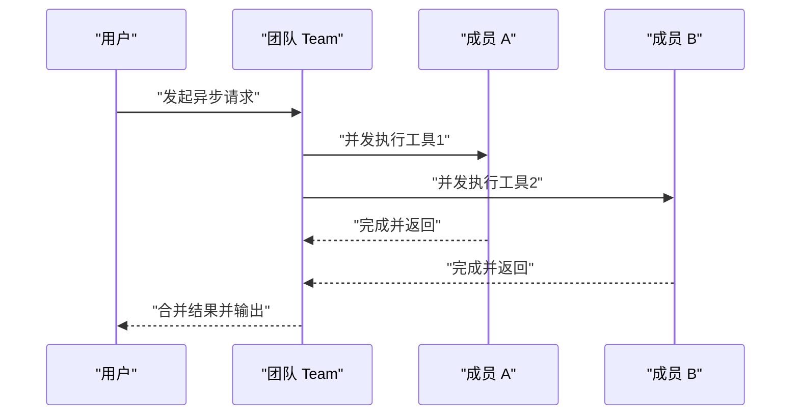
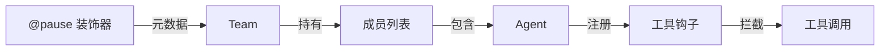

# 团队工具

<cite>
**本文引用的文件**
- [cookbook/02_agents/04_tools/03_team_callable_members.py](file://cookbook/02_agents/04_tools/03_team_callable_members.py)
- [cookbook/03_teams/03_tools/tool_hooks.py](file://cookbook/03_teams/03_tools/tool_hooks.py)
- [cookbook/03_teams/03_tools/member_tool_hooks.py](file://cookbook/03_teams/03_tools/member_tool_hooks.py)
- [cookbook/03_teams/03_tools/async_tools.py](file://cookbook/03_teams/03_tools/async_tools.py)
- [libs/agno/agno/workflow/decorators.py](file://libs/agno/agno/workflow/decorators.py)
</cite>

## 目录
1. [简介](#简介)
2. [项目结构](#项目结构)
3. [核心组件](#核心组件)
4. [架构总览](#架构总览)
5. [详细组件分析](#详细组件分析)
6. [依赖分析](#依赖分析)
7. [性能考虑](#性能考虑)
8. [故障排查指南](#故障排查指南)
9. [结论](#结论)
10. [附录](#附录)

## 简介
本文件面向团队工具系统，围绕“成员工具管理、工具组合与权限控制”、“工具装饰器在团队中的应用”、“团队工具钩子系统（预处理、后处理、工具钩子）”、“异步工具的实现与管理（并发执行与错误处理）”等主题，提供从概念到实操的完整说明。文档同时给出可直接定位到仓库源码的路径，便于读者对照学习与复用。

## 项目结构
本项目的团队工具相关内容主要分布在以下位置：
- cookbook/02_agents/04_tools：演示工具与成员的基本用法，包括“运行时动态选择成员”的示例。
- cookbook/03_teams/03_tools：聚焦团队场景下的工具钩子、成员工具钩子、异步工具等高级能力。
- libs/agno/agno/workflow/decorators.py：工作流步骤装饰器（如暂停与人工确认），与工具钩子在流程层面协同。

**图示来源**
- [cookbook/02_agents/04_tools/03_team_callable_members.py:1-72](file://cookbook/02_agents/04_tools/03_team_callable_members.py#L1-L72)
- [cookbook/03_teams/03_tools/tool_hooks.py:1-89](file://cookbook/03_teams/03_tools/tool_hooks.py#L1-L89)
- [cookbook/03_teams/03_tools/member_tool_hooks.py:1-163](file://cookbook/03_teams/03_tools/member_tool_hooks.py#L1-L163)
- [cookbook/03_teams/03_tools/async_tools.py:1-82](file://cookbook/03_teams/03_tools/async_tools.py#L1-L82)
- [libs/agno/agno/workflow/decorators.py:1-103](file://libs/agno/agno/workflow/decorators.py#L1-L103)

**章节来源**
- [cookbook/02_agents/04_tools/03_team_callable_members.py:1-72](file://cookbook/02_agents/04_tools/03_team_callable_members.py#L1-L72)
- [cookbook/03_teams/03_tools/tool_hooks.py:1-89](file://cookbook/03_teams/03_tools/tool_hooks.py#L1-L89)
- [cookbook/03_teams/03_tools/member_tool_hooks.py:1-163](file://cookbook/03_teams/03_tools/member_tool_hooks.py#L1-L163)
- [cookbook/03_teams/03_tools/async_tools.py:1-82](file://cookbook/03_teams/03_tools/async_tools.py#L1-L82)
- [libs/agno/agno/workflow/decorators.py:1-103](file://libs/agno/agno/workflow/decorators.py#L1-L103)

## 核心组件
- 成员工具管理与动态成员选择：通过在团队中传入一个函数作为成员列表，根据会话状态动态决定成员集合，从而实现按需编排。
- 工具钩子体系：支持在团队或成员级别注册钩子，对委托与工具调用进行预处理、后处理与审计。
- 权限控制：基于用户身份与会话状态，在钩子中校验访问权限，确保合规调用。
- 异步工具与并发：在团队中以异步方式执行工具，结合并发策略提升吞吐与响应速度。
- 工具装饰器：在工作流步骤中使用装饰器标注暂停、人工确认与用户输入需求，增强可控性与可观测性。

**章节来源**
- [cookbook/02_agents/04_tools/03_team_callable_members.py:31-51](file://cookbook/02_agents/04_tools/03_team_callable_members.py#L31-L51)
- [cookbook/03_teams/03_tools/tool_hooks.py:22-33](file://cookbook/03_teams/03_tools/tool_hooks.py#L22-L33)
- [cookbook/03_teams/03_tools/member_tool_hooks.py:62-92](file://cookbook/03_teams/03_tools/member_tool_hooks.py#L62-L92)
- [cookbook/03_teams/03_tools/async_tools.py:75-81](file://cookbook/03_teams/03_tools/async_tools.py#L75-L81)
- [libs/agno/agno/workflow/decorators.py:11-55](file://libs/agno/agno/workflow/decorators.py#L11-L55)

## 架构总览
下图展示了团队工具在运行时的交互关系：团队协调成员、成员执行工具、工具钩子拦截与记录、异步执行与并发调度、以及工作流装饰器对步骤的控制。

**图示来源**
- [cookbook/03_teams/03_tools/tool_hooks.py:67-79](file://cookbook/03_teams/03_tools/tool_hooks.py#L67-L79)
- [cookbook/03_teams/03_tools/member_tool_hooks.py:123-136](file://cookbook/03_teams/03_tools/member_tool_hooks.py#L123-L136)
- [cookbook/03_teams/03_tools/async_tools.py:57-70](file://cookbook/03_teams/03_tools/async_tools.py#L57-L70)
- [libs/agno/agno/workflow/decorators.py:11-55](file://libs/agno/agno/workflow/decorators.py#L11-L55)

## 详细组件分析

### 成员工具管理与动态成员选择
- 动态成员选择：通过向团队传入一个函数，依据会话状态动态返回成员列表，实现“按需编组”。该机制适合任务类型变化、资源弹性分配等场景。
- 示例要点：在示例中，当会话状态指示需要研究时，团队包含研究员与写手；否则仅包含写手。

**图示来源**
- [cookbook/02_agents/04_tools/03_team_callable_members.py:31-38](file://cookbook/02_agents/04_tools/03_team_callable_members.py#L31-L38)

**章节来源**
- [cookbook/02_agents/04_tools/03_team_callable_members.py:31-51](file://cookbook/02_agents/04_tools/03_team_callable_members.py#L31-L51)

### 工具装饰器在团队中的应用
- 装饰器能力：在工作流步骤上使用装饰器标注“暂停、人工确认、用户输入”等元数据，便于在执行前进行拦截与交互。
- 典型用途：在团队协作中，对关键步骤增加人工审核或输入收集，保证质量与合规。

**图示来源**
- [libs/agno/agno/workflow/decorators.py:11-103](file://libs/agno/agno/workflow/decorators.py#L11-L103)

**章节来源**
- [libs/agno/agno/workflow/decorators.py:11-103](file://libs/agno/agno/workflow/decorators.py#L11-L103)

### 工具钩子系统：预处理、后处理与工具钩子
- 钩子类型与职责：
  - 预处理钩子：在委托或工具调用前进行参数校验、权限检查、上下文注入等。
  - 后处理钩子：在调用完成后进行耗时统计、结果归档、异常上报等。
  - 工具钩子：针对具体工具调用进行拦截，统一记录与审计。
- 示例要点：
  - 日志与耗时统计：在钩子中记录函数名、执行时间，便于性能分析与问题定位。
  - 委托权限控制：在委托给成员前，依据用户ID与会话状态判断是否具备相应权限。

**图示来源**
- [cookbook/03_teams/03_tools/tool_hooks.py:22-33](file://cookbook/03_teams/03_tools/tool_hooks.py#L22-L33)
- [cookbook/03_teams/03_tools/member_tool_hooks.py:62-92](file://cookbook/03_teams/03_tools/member_tool_hooks.py#L62-L92)

**章节来源**
- [cookbook/03_teams/03_tools/tool_hooks.py:22-33](file://cookbook/03_teams/03_tools/tool_hooks.py#L22-L33)
- [cookbook/03_teams/03_tools/member_tool_hooks.py:62-92](file://cookbook/03_teams/03_tools/member_tool_hooks.py#L62-L92)

### 异步工具的实现与管理
- 异步执行：团队支持以异步方式打印响应，适用于需要并发执行多个工具或成员的任务。
- 并发策略：在团队中组合不同类型的工具（如网页搜索、维基百科、AgentQL抓取），通过异步并发提升整体效率。
- 错误处理：建议在钩子或工具内部捕获异常并记录，避免单点失败影响全局。

**图示来源**
- [cookbook/03_teams/03_tools/async_tools.py:75-81](file://cookbook/03_teams/03_tools/async_tools.py#L75-L81)

**章节来源**
- [cookbook/03_teams/03_tools/async_tools.py:75-81](file://cookbook/03_teams/03_tools/async_tools.py#L75-L81)

### 成员信息管理与工具调用限制
- 成员信息：每个成员拥有独立的角色、指令、工具集与钩子配置，可在团队中并行协作。
- 工具调用限制：可通过钩子实现调用次数限制、频率限制、参数白名单等策略，保障系统稳定与安全。
- 工具选择策略：结合任务类型与成员专长，采用“路由/广播/任务”等模式选择合适的工具与成员组合。

**章节来源**
- [cookbook/03_teams/03_tools/tool_hooks.py:39-79](file://cookbook/03_teams/03_tools/tool_hooks.py#L39-L79)
- [cookbook/03_teams/03_tools/member_tool_hooks.py:98-136](file://cookbook/03_teams/03_tools/member_tool_hooks.py#L98-L136)

## 依赖分析
- 组件耦合：
  - 团队与成员：团队持有成员列表（静态或动态函数），成员持有工具与钩子。
  - 钩子与工具：钩子在工具调用前后介入，形成弱耦合的横切关注点。
  - 工作流装饰器：与团队/成员解耦，通过元数据驱动步骤行为。
- 外部依赖：
  - 第三方工具包（如网页搜索、维基百科、AgentQL）由成员工具集承载，团队通过工具钩子统一治理。

**图示来源**
- [cookbook/03_teams/03_tools/tool_hooks.py:67-79](file://cookbook/03_teams/03_tools/tool_hooks.py#L67-L79)
- [libs/agno/agno/workflow/decorators.py:58-90](file://libs/agno/agno/workflow/decorators.py#L58-L90)

**章节来源**
- [cookbook/03_teams/03_tools/tool_hooks.py:67-79](file://cookbook/03_teams/03_tools/tool_hooks.py#L67-L79)
- [libs/agno/agno/workflow/decorators.py:58-90](file://libs/agno/agno/workflow/decorators.py#L58-L90)

## 性能考虑
- 并发与吞吐：优先采用异步并发执行工具，减少串行等待；合理拆分任务，避免单个成员过载。
- 资源配额：通过钩子实施调用频率与参数范围限制，防止热点工具导致系统抖动。
- 观测与回放：利用钩子记录耗时与日志，建立指标看板，快速定位瓶颈。
- 缓存与复用：在团队与成员层面对工具结果进行缓存，降低重复计算成本（参考示例中的缓存开关）。

[本节为通用指导，无需列出章节来源]

## 故障排查指南
- 权限不足：若出现委托失败或工具调用被拒，请检查钩子中的权限校验逻辑与会话状态字段。
- 超时与阻塞：启用异步执行并观察并发分支的完成顺序；必要时增加超时与重试策略。
- 日志与追踪：通过钩子记录的函数名与耗时定位慢调用；结合工作流装饰器的元数据核对步骤执行情况。
- 参数校验：在钩子中加入参数合法性检查，提前发现非法输入导致的异常。

**章节来源**
- [cookbook/03_teams/03_tools/member_tool_hooks.py:62-92](file://cookbook/03_teams/03_tools/member_tool_hooks.py#L62-L92)
- [cookbook/03_teams/03_tools/tool_hooks.py:22-33](file://cookbook/03_teams/03_tools/tool_hooks.py#L22-L33)

## 结论
团队工具系统通过“动态成员选择、工具钩子治理、权限控制、异步并发与工作流装饰器”构建了高可用、可审计、可扩展的协作框架。实践中应结合业务场景选择合适的模式与策略，持续优化性能与安全性，并以钩子与日志为抓手，实现可观测与可追溯。

[本节为总结性内容，无需列出章节来源]

## 附录
- 快速定位示例：
  - 动态成员选择：[示例路径:31-51](file://cookbook/02_agents/04_tools/03_team_callable_members.py#L31-L51)
  - 工具钩子与日志：[示例路径:22-33](file://cookbook/03_teams/03_tools/tool_hooks.py#L22-L33)
  - 成员工具钩子与权限控制：[示例路径:62-92](file://cookbook/03_teams/03_tools/member_tool_hooks.py#L62-L92)
  - 异步工具与并发：[示例路径:75-81](file://cookbook/03_teams/03_tools/async_tools.py#L75-L81)
  - 工作流步骤装饰器：[示例路径:11-55](file://libs/agno/agno/workflow/decorators.py#L11-L55)

[本节为索引性内容，无需列出章节来源]