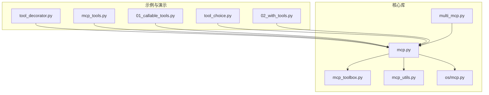
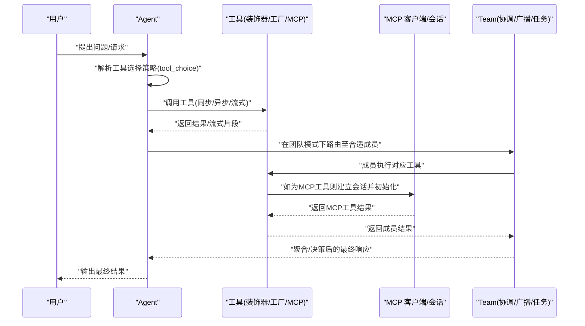
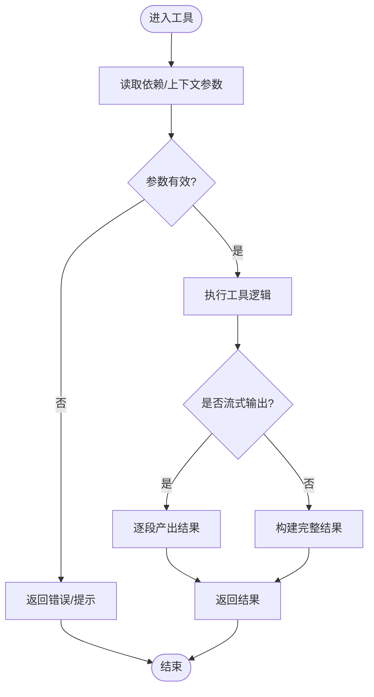
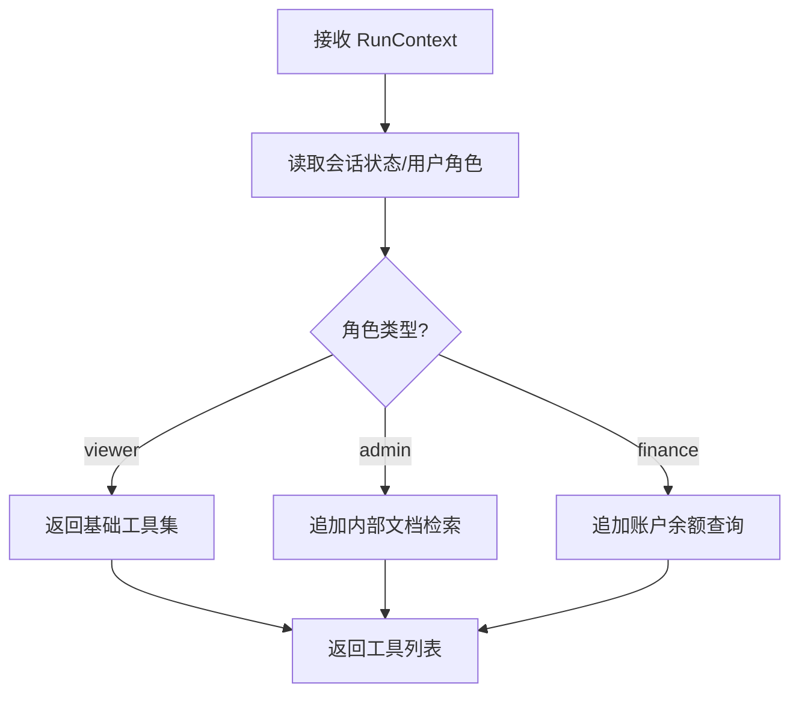
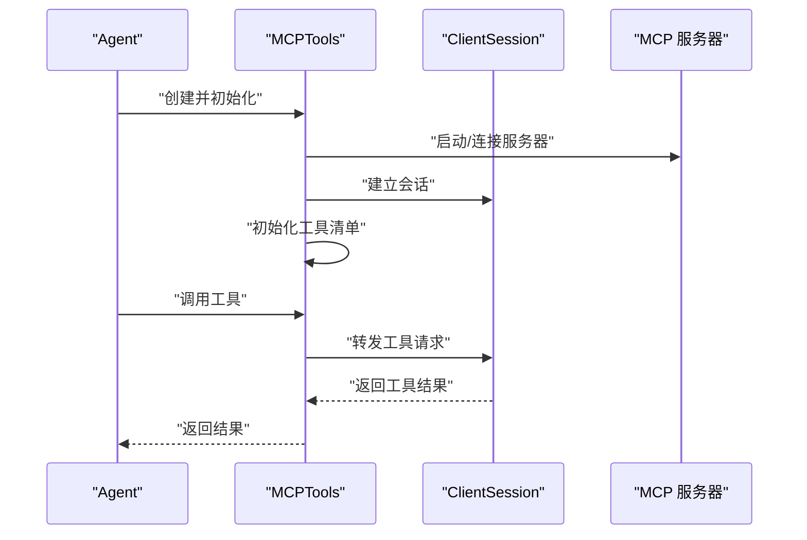
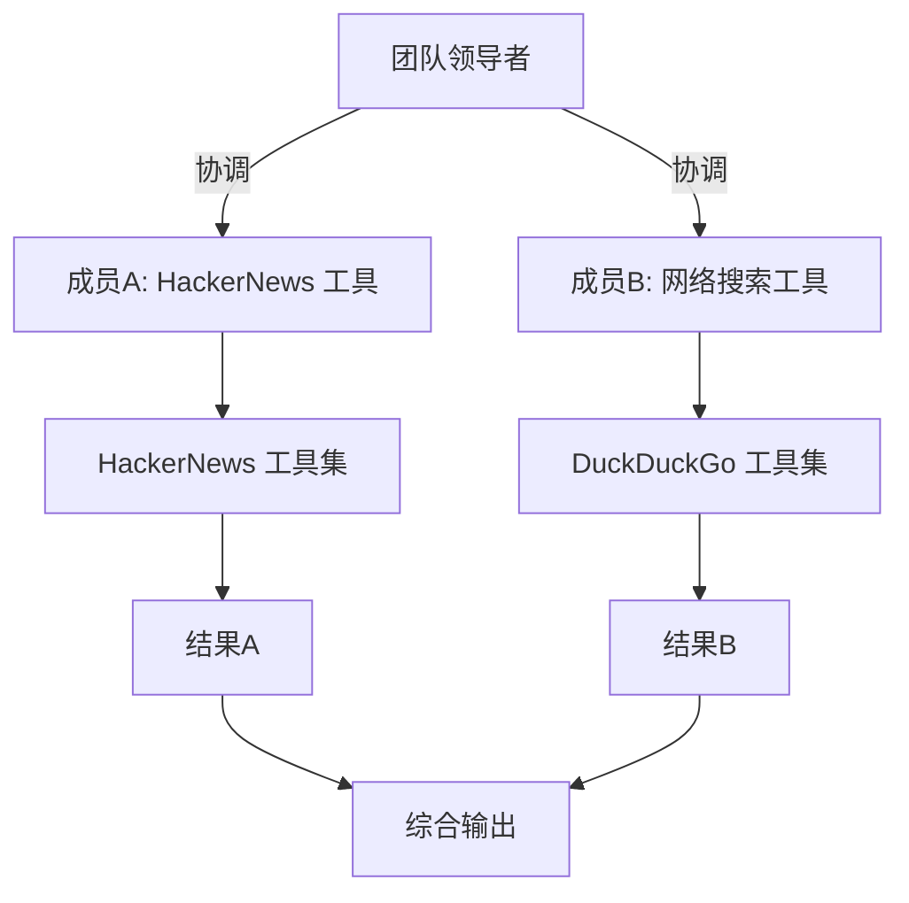
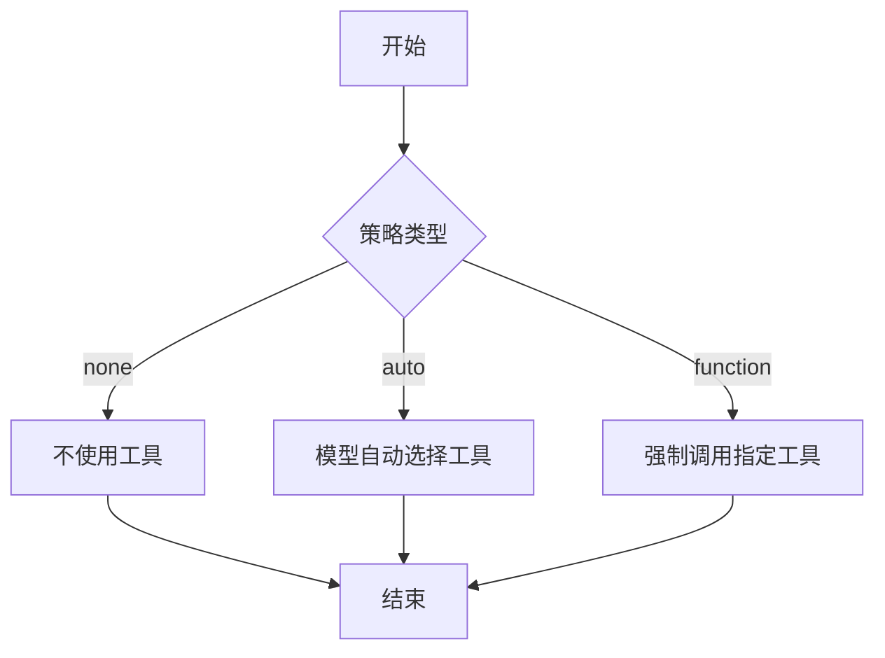
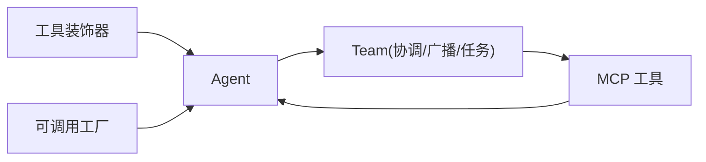

# 工具管理

<cite>
**本文引用的文件**
- [tool_decorator.py](file://cookbook/91_tools/tool_decorator/tool_decorator.py)
- [mcp_tools.py](file://cookbook/91_tools/mcp_tools.py)
- [02_with_tools.py](file://cookbook/03_teams/02_modes/coordinate/02_with_tools.py)
- [01_callable_tools.py](file://cookbook/02_agents/04_tools/01_callable_tools.py)
- [tool_choice.py](file://cookbook/02_agents/04_tools/tool_choice.py)
- [mcp.py](file://libs/agno/agno/tools/mcp/mcp.py)
- [multi_mcp.py](file://libs/agno/agno/tools/mcp/multi_mcp.py)
- [mcp_toolbox.py](file://libs/agno/agno/tools/mcp_toolbox.py)
- [mcp_utils.py](file://libs/agno/agno/utils/mcp.py)
- [mcp_lib.py](file://libs/agno/agno/os/mcp.py)
</cite>

## 目录
1. [简介](#简介)
2. [项目结构](#项目结构)
3. [核心组件](#核心组件)
4. [架构总览](#架构总览)
5. [组件详解](#组件详解)
6. [依赖关系分析](#依赖关系分析)
7. [性能与优化](#性能与优化)
8. [故障排查指南](#故障排查指南)
9. [结论](#结论)
10. [附录](#附录)

## 简介
本文件面向团队工具管理系统，系统性阐述工具的创建、配置与管理流程，涵盖工具解析、工具连接与初始化、工具装饰器在团队中的应用、工具在不同团队模式下的行为差异（协调模式、广播模式、任务模式）、动态解析机制（可调用工厂与MCP工具连接管理），以及工具权限控制与访问管理策略。同时提供调试、性能优化与安全注意事项，帮助读者快速上手并稳定运行。

## 项目结构
围绕“工具管理”的相关实现主要分布在以下区域：
- 示例与演示：cookbook/91_tools、cookbook/02_agents/04_tools、cookbook/03_teams/02_modes
- 核心库：libs/agno/agno/tools/mcp、libs/agno/agno/utils/mcp、libs/agno/agno/os/mcp

下图给出与“工具管理”直接相关的文件与模块关系概览：

图表来源
- [tool_decorator.py:1-158](file://cookbook/91_tools/tool_decorator/tool_decorator.py#L1-L158)
- [mcp_tools.py:1-55](file://cookbook/91_tools/mcp_tools.py#L1-L55)
- [01_callable_tools.py:1-94](file://cookbook/02_agents/04_tools/01_callable_tools.py#L1-L94)
- [tool_choice.py:1-48](file://cookbook/02_agents/04_tools/tool_choice.py#L1-L48)
- [02_with_tools.py:1-72](file://cookbook/03_teams/02_modes/coordinate/02_with_tools.py#L1-L72)
- [mcp.py](file://libs/agno/agno/tools/mcp/mcp.py)
- [multi_mcp.py](file://libs/agno/agno/tools/mcp/multi_mcp.py)
- [mcp_toolbox.py](file://libs/agno/agno/tools/mcp_toolbox.py)
- [mcp_utils.py](file://libs/agno/agno/utils/mcp.py)
- [os/mcp.py](file://libs/agno/agno/os/mcp.py)

章节来源
- [tool_decorator.py:1-158](file://cookbook/91_tools/tool_decorator/tool_decorator.py#L1-L158)
- [mcp_tools.py:1-55](file://cookbook/91_tools/mcp_tools.py#L1-L55)
- [01_callable_tools.py:1-94](file://cookbook/02_agents/04_tools/01_callable_tools.py#L1-L94)
- [tool_choice.py:1-48](file://cookbook/02_agents/04_tools/tool_choice.py#L1-L48)
- [02_with_tools.py:1-72](file://cookbook/03_teams/02_modes/coordinate/02_with_tools.py#L1-L72)

## 核心组件
- 工具装饰器与工具函数
  - 使用装饰器声明工具，支持同步与异步函数，支持流式输出与结果展示。
  - 支持通过依赖注入在运行时读取上下文参数，实现灵活的工具行为。
- 可调用工厂（Callable Factory）
  - 将工具以可调用对象形式传入，按用户或会话动态解析工具集，支持缓存与角色驱动的权限控制。
- MCP 工具与连接管理
  - 基于 MCP 协议的外部工具连接，支持标准输入输出方式启动服务器，进行工具初始化与调用。
- 团队模式下的工具行为
  - 在协调模式中，由领导者根据工具能力分配任务；在广播/任务模式下，工具分发与执行策略有所不同，需结合团队路由与成员能力设计。

章节来源
- [tool_decorator.py:20-45](file://cookbook/91_tools/tool_decorator/tool_decorator.py#L20-L45)
- [01_callable_tools.py:44-55](file://cookbook/02_agents/04_tools/01_callable_tools.py#L44-L55)
- [mcp_tools.py:22-43](file://cookbook/91_tools/mcp_tools.py#L22-L43)
- [02_with_tools.py:20-60](file://cookbook/03_teams/02_modes/coordinate/02_with_tools.py#L20-L60)

## 架构总览
下图展示从“工具装饰器/工厂/MCP”到“Agent/Team”的整体调用链路与数据流：

图表来源
- [tool_decorator.py:20-45](file://cookbook/91_tools/tool_decorator/tool_decorator.py#L20-L45)
- [01_callable_tools.py:44-55](file://cookbook/02_agents/04_tools/01_callable_tools.py#L44-L55)
- [mcp_tools.py:22-43](file://cookbook/91_tools/mcp_tools.py#L22-L43)
- [02_with_tools.py:46-60](file://cookbook/03_teams/02_modes/coordinate/02_with_tools.py#L46-L60)

## 组件详解

### 工具装饰器与参数验证、返回值处理
- 装饰器用法
  - 同步与异步工具均可通过装饰器注册，支持描述信息与结果展示开关。
  - 支持静态方法与实例方法两种绑定方式，便于组织复杂工具集合。
- 参数验证与依赖注入
  - 工具可通过 Agent 的依赖字典读取上下文参数，实现参数默认值与动态注入。
- 返回值处理
  - 支持字符串、JSON 序列化结果与流式迭代输出，满足不同工具的输出形态。

图表来源
- [tool_decorator.py:20-45](file://cookbook/91_tools/tool_decorator/tool_decorator.py#L20-L45)
- [tool_decorator.py:64-88](file://cookbook/91_tools/tool_decorator/tool_decorator.py#L64-L88)

章节来源
- [tool_decorator.py:20-45](file://cookbook/91_tools/tool_decorator/tool_decorator.py#L20-L45)
- [tool_decorator.py:64-88](file://cookbook/91_tools/tool_decorator/tool_decorator.py#L64-L88)

### 动态工具解析与可调用工厂
- 工厂函数签名
  - 接收运行上下文参数，按用户角色、会话状态等动态决定可用工具集合。
- 缓存与复用
  - 按用户或会话 ID 对工具集进行缓存，避免重复创建与初始化。
- 权限控制
  - 基于角色（如 viewer/admin/finance）控制工具可见性与可用性，实现最小权限原则。

图表来源
- [01_callable_tools.py:44-55](file://cookbook/02_agents/04_tools/01_callable_tools.py#L44-L55)

章节来源
- [01_callable_tools.py:44-55](file://cookbook/02_agents/04_tools/01_callable_tools.py#L44-L55)

### MCP 工具连接与初始化
- 连接方式
  - 通过标准输入输出启动 MCP 服务器，建立客户端会话。
- 初始化流程
  - 创建 MCP 工具集并初始化，随后注入到 Agent 中统一调度。
- 多 MCP 管理
  - 支持多源 MCP 工具聚合与生命周期管理，便于跨服务工具整合。

图表来源
- [mcp_tools.py:22-43](file://cookbook/91_tools/mcp_tools.py#L22-L43)
- [mcp.py](file://libs/agno/agno/tools/mcp/mcp.py)
- [multi_mcp.py](file://libs/agno/agno/tools/mcp/multi_mcp.py)

章节来源
- [mcp_tools.py:22-43](file://cookbook/91_tools/mcp_tools.py#L22-L43)
- [mcp.py](file://libs/agno/agno/tools/mcp/mcp.py)
- [multi_mcp.py](file://libs/agno/agno/tools/mcp/multi_mcp.py)

### 团队模式下的工具行为差异
- 协调模式
  - 领导者根据工具能力与任务需求，将子任务委派给具备相应工具的成员，实现“按需匹配”。
- 广播/任务模式
  - 广播模式下工具可能被多个成员接收与执行；任务模式下工具调用与任务拆解策略不同，需结合路由与成员能力设计。
- 实战示例
  - 示例展示了在协调模式下，不同成员拥有专用工具（如 HackerNews 搜索与网络搜索），领导者根据主题选择合适成员。

图表来源
- [02_with_tools.py:20-60](file://cookbook/03_teams/02_modes/coordinate/02_with_tools.py#L20-L60)

章节来源
- [02_with_tools.py:20-60](file://cookbook/03_teams/02_modes/coordinate/02_with_tools.py#L20-L60)

### 工具选择策略与调用限制
- 工具选择策略
  - 支持关闭工具、自动选择与强制指定工具名称三种策略，满足不同场景的安全与可控性要求。
- 调用限制
  - 可通过工具调用次数限制、会话状态与依赖注入实现调用频率与范围控制。

图表来源
- [tool_choice.py:19-38](file://cookbook/02_agents/04_tools/tool_choice.py#L19-L38)

章节来源
- [tool_choice.py:19-38](file://cookbook/02_agents/04_tools/tool_choice.py#L19-L38)

## 依赖关系分析
- 工具装饰器与可调用工厂依赖 Agent 的上下文与依赖注入机制，确保工具在运行期可读取用户/会话信息。
- MCP 工具依赖 MCP 客户端会话与服务器，需要稳定的连接与初始化流程。
- 团队模式依赖成员工具集与路由策略，协调模式强调“按工具选人”，广播/任务模式强调“按任务分发”。

图表来源
- [tool_decorator.py:20-45](file://cookbook/91_tools/tool_decorator/tool_decorator.py#L20-L45)
- [01_callable_tools.py:44-55](file://cookbook/02_agents/04_tools/01_callable_tools.py#L44-L55)
- [mcp_tools.py:22-43](file://cookbook/91_tools/mcp_tools.py#L22-L43)
- [02_with_tools.py:46-60](file://cookbook/03_teams/02_modes/coordinate/02_with_tools.py#L46-L60)

章节来源
- [tool_decorator.py:20-45](file://cookbook/91_tools/tool_decorator/tool_decorator.py#L20-L45)
- [01_callable_tools.py:44-55](file://cookbook/02_agents/04_tools/01_callable_tools.py#L44-L55)
- [mcp_tools.py:22-43](file://cookbook/91_tools/mcp_tools.py#L22-L43)
- [02_with_tools.py:46-60](file://cookbook/03_teams/02_modes/coordinate/02_with_tools.py#L46-L60)

## 性能与优化
- 工具集缓存
  - 可调用工厂按用户/会话缓存工具集，减少重复创建成本。
- 流式输出
  - 对长耗时工具采用流式输出，提升用户体验与响应速度。
- MCP 连接池
  - 复用 MCP 会话与连接，避免频繁启动/销毁带来的开销。
- 调用限制与节流
  - 结合工具调用次数限制与会话状态，对高频工具进行节流与限流。

## 故障排查指南
- 工具装饰器未生效
  - 检查装饰器是否正确包裹函数，确认 Agent 的工具列表已包含该工具。
- 异步工具无输出
  - 确认异步函数的调用路径与事件循环，检查依赖注入参数是否正确传递。
- MCP 工具连接失败
  - 检查 MCP 服务器命令与参数，确认会话初始化成功且工具清单可加载。
- 团队模式路由异常
  - 核查成员工具集与任务分配策略，确保领导者具备正确的路由逻辑。

章节来源
- [tool_decorator.py:20-45](file://cookbook/91_tools/tool_decorator/tool_decorator.py#L20-L45)
- [mcp_tools.py:22-43](file://cookbook/91_tools/mcp_tools.py#L22-L43)
- [02_with_tools.py:46-60](file://cookbook/03_teams/02_modes/coordinate/02_with_tools.py#L46-L60)

## 结论
通过工具装饰器、可调用工厂与 MCP 工具的组合，团队工具管理系统实现了灵活、可扩展与可维护的工具生态。配合工具选择策略与团队模式，可在保证安全性的同时最大化工具的使用效率。建议在生产环境中结合缓存、流式输出、连接复用与调用限制等手段，持续优化性能与稳定性。

## 附录
- 快速参考
  - 工具装饰器示例路径：[tool_decorator.py:20-45](file://cookbook/91_tools/tool_decorator/tool_decorator.py#L20-L45)
  - 可调用工厂示例路径：[01_callable_tools.py:44-55](file://cookbook/02_agents/04_tools/01_callable_tools.py#L44-L55)
  - MCP 工具示例路径：[mcp_tools.py:22-43](file://cookbook/91_tools/mcp_tools.py#L22-L43)
  - 团队协调模式示例路径：[02_with_tools.py:20-60](file://cookbook/03_teams/02_modes/coordinate/02_with_tools.py#L20-L60)
  - 工具选择策略示例路径：[tool_choice.py:19-38](file://cookbook/02_agents/04_tools/tool_choice.py#L19-L38)