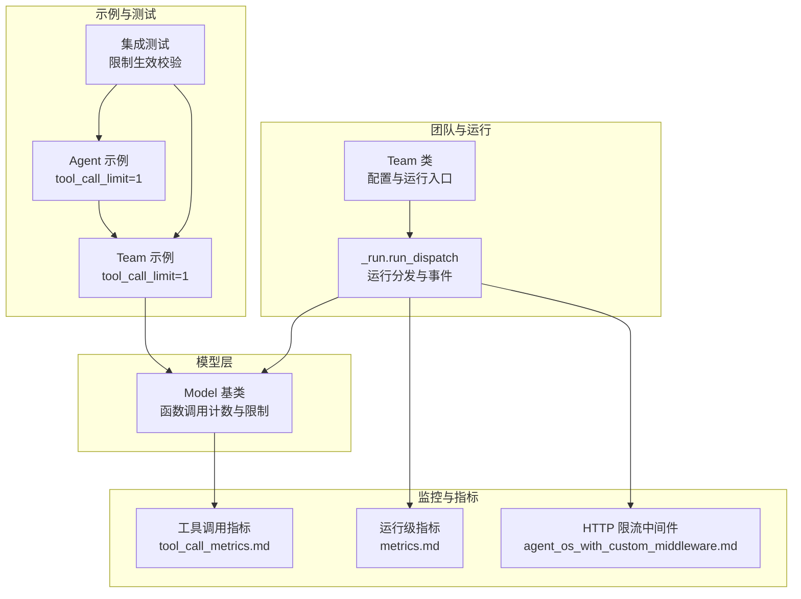
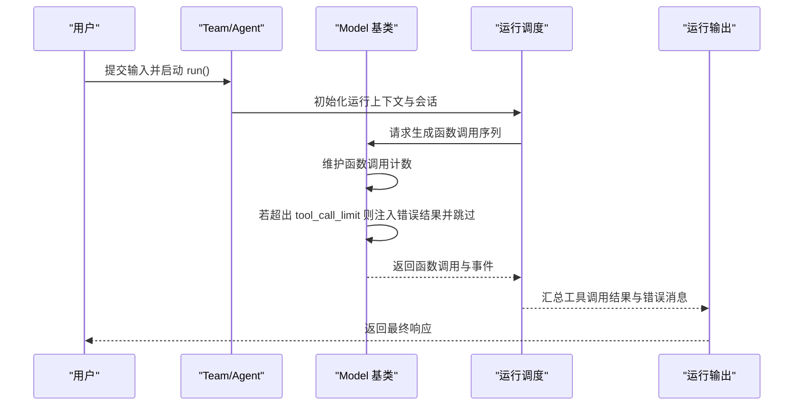
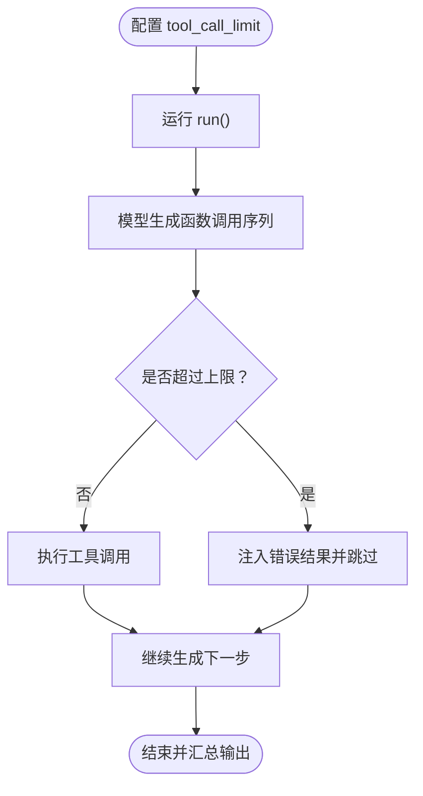
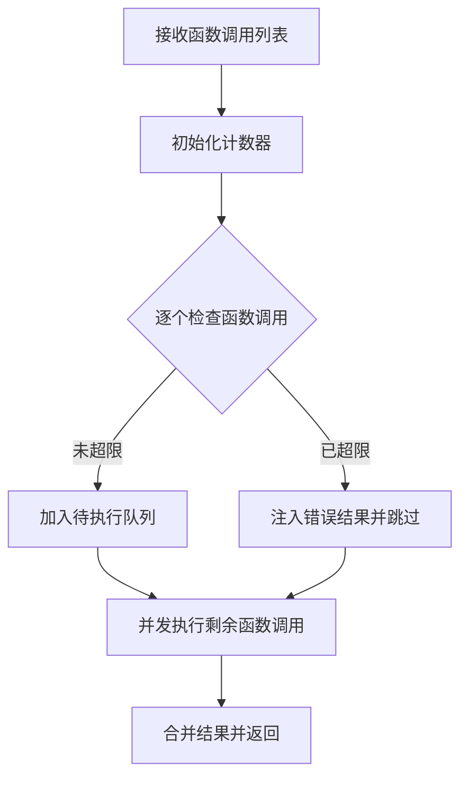
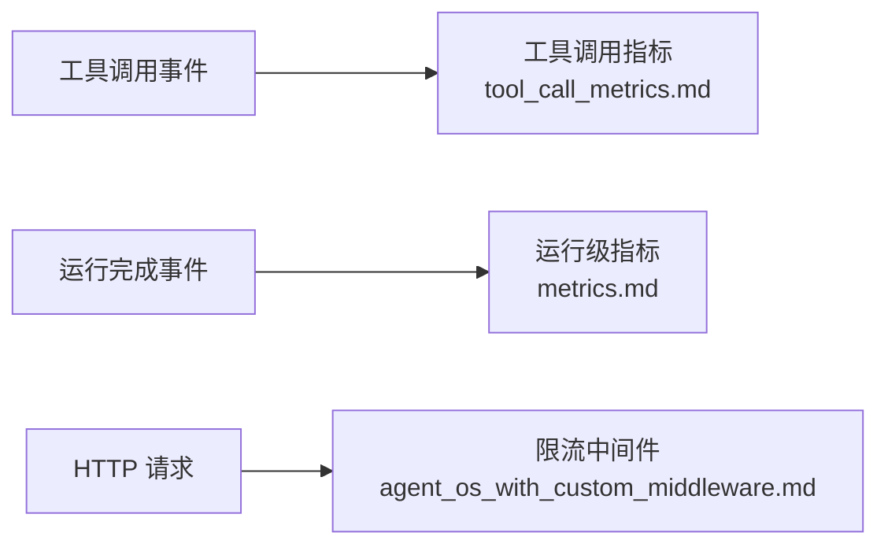
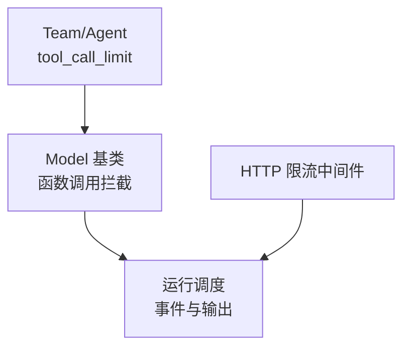

# 工具调用限制

<cite>
**本文引用的文件**
- [libs/agno/agno/team/team.py](file://libs/agno/agno/team/team.py)
- [libs/agno/agno/models/base.py](file://libs/agno/agno/models/base.py)
- [libs/agno/agno/team/_run.py](file://libs/agno/agno/team/_run.py)
- [libs/agno/tests/integration/agent/test_tool_call_limit.py](file://libs/agno/tests/integration/agent/test_tool_call_limit.py)
- [cookbook/02_agents/04_tools/tool_call_limit.py](file://cookbook/02_agents/04_tools/tool_call_limit.py)
- [cookbook/03_teams/03_tools/tool_call_limit.py](file://cookbook/03_teams/03_tools/tool_call_limit.py)
- [cookbook/02_agents/14_advanced/tool_call_metrics.md](file://cookbook/02_agents/14_advanced/tool_call_metrics.md)
- [cookbook/04_workflows/06_advanced_concepts/run_control/metrics.md](file://cookbook/04_workflows/06_advanced_concepts/run_control/metrics.md)
- [cookbook/05_agent_os/middleware/agent_os_with_custom_middleware.md](file://cookbook/05_agent_os/middleware/agent_os_with_custom_middleware.md)
</cite>

## 目录
1. [简介](#简介)
2. [项目结构](#项目结构)
3. [核心组件](#核心组件)
4. [架构总览](#架构总览)
5. [详细组件分析](#详细组件分析)
6. [依赖分析](#依赖分析)
7. [性能考虑](#性能考虑)
8. [故障排查指南](#故障排查指南)
9. [结论](#结论)
10. [附录](#附录)

## 简介
本文件围绕“团队工具调用限制”主题，系统梳理了在多智能体与团队协作场景下，如何通过配置与实现机制对工具调用进行次数限制、频率控制与时间窗口管理，并解释其在资源保护、性能优化与成本控制方面的价值。文档覆盖以下关键点：
- 配置与管理：全局限制、成员特定限制、工具特定限制
- 实现机制：计数器管理、时间窗口控制、状态跟踪
- 与团队策略结合：任务调度、资源分配、负载均衡
- 监控、告警与故障处理：指标采集、可视化与异常恢复

## 项目结构
与工具调用限制直接相关的代码分布在以下模块：
- 团队与运行生命周期：Team 类、运行调度与事件流
- 模型层工具调用处理：函数调用计数与限制拦截
- 示例与测试：Agent/Team 层面的工具调用限制示例与集成测试
- 监控与指标：工具调用级与运行级指标采集

**图表来源**
- [libs/agno/agno/team/team.py](file://libs/agno/agno/team/team.py)
- [libs/agno/agno/team/_run.py](file://libs/agno/agno/team/_run.py)
- [libs/agno/agno/models/base.py](file://libs/agno/agno/models/base.py)
- [cookbook/02_agents/04_tools/tool_call_limit.py](file://cookbook/02_agents/04_tools/tool_call_limit.py)
- [cookbook/03_teams/03_tools/tool_call_limit.py](file://cookbook/03_teams/03_tools/tool_call_limit.py)
- [libs/agno/tests/integration/agent/test_tool_call_limit.py](file://libs/agno/tests/integration/agent/test_tool_call_limit.py)
- [cookbook/02_agents/14_advanced/tool_call_metrics.md](file://cookbook/02_agents/14_advanced/tool_call_metrics.md)
- [cookbook/04_workflows/06_advanced_concepts/run_control/metrics.md](file://cookbook/04_workflows/06_advanced_concepts/run_control/metrics.md)
- [cookbook/05_agent_os/middleware/agent_os_with_custom_middleware.md](file://cookbook/05_agent_os/middleware/agent_os_with_custom_middleware.md)

**章节来源**
- [libs/agno/agno/team/team.py](file://libs/agno/agno/team/team.py)
- [libs/agno/agno/team/_run.py](file://libs/agno/agno/team/_run.py)
- [libs/agno/agno/models/base.py](file://libs/agno/agno/models/base.py)
- [cookbook/02_agents/04_tools/tool_call_limit.py](file://cookbook/02_agents/04_tools/tool_call_limit.py)
- [cookbook/03_teams/03_tools/tool_call_limit.py](file://cookbook/03_teams/03_tools/tool_call_limit.py)
- [libs/agno/tests/integration/agent/test_tool_call_limit.py](file://libs/agno/tests/integration/agent/test_tool_call_limit.py)
- [cookbook/02_agents/14_advanced/tool_call_metrics.md](file://cookbook/02_agents/14_advanced/tool_call_metrics.md)
- [cookbook/04_workflows/06_advanced_concepts/run_control/metrics.md](file://cookbook/04_workflows/06_advanced_concepts/run_control/metrics.md)
- [cookbook/05_agent_os/middleware/agent_os_with_custom_middleware.md](file://cookbook/05_agent_os/middleware/agent_os_with_custom_middleware.md)

## 核心组件
- Team 与 Agent 的 tool_call_limit 配置：用于限制单次运行内工具调用的总次数，涵盖模型自身调用与委托成员调用。
- 模型层函数调用计数与拦截：在模型生成函数调用序列时，维护当前调用计数并在超过限制时注入错误消息并跳过后续调用。
- 运行生命周期与事件：运行开始、工具调用开始、暂停、完成等事件，便于监控与可观测性。
- 示例与测试：Agent 与 Team 的 tool_call_limit=1 示例，以及针对该限制的集成测试。

**章节来源**
- [libs/agno/agno/team/team.py](file://libs/agno/agno/team/team.py)
- [libs/agno/agno/models/base.py](file://libs/agno/agno/models/base.py)
- [libs/agno/agno/team/_run.py](file://libs/agno/agno/team/_run.py)
- [cookbook/02_agents/04_tools/tool_call_limit.py](file://cookbook/02_agents/04_tools/tool_call_limit.py)
- [cookbook/03_teams/03_tools/tool_call_limit.py](file://cookbook/03_teams/03_tools/tool_call_limit.py)
- [libs/agno/tests/integration/agent/test_tool_call_limit.py](file://libs/agno/tests/integration/agent/test_tool_call_limit.py)

## 架构总览
工具调用限制在“配置—运行—拦截—反馈”的闭环中工作：
- 配置阶段：Team/Agent 属性 tool_call_limit 指定上限
- 运行阶段：模型生成函数调用序列，运行调度器参与事件分发
- 拦截阶段：模型基类在函数调用前检查计数，超限时注入错误结果并跳过
- 反馈阶段：运行输出包含工具调用结果与错误消息，便于监控与审计

**图表来源**
- [libs/agno/agno/team/team.py](file://libs/agno/agno/team/team.py)
- [libs/agno/agno/models/base.py](file://libs/agno/agno/models/base.py)
- [libs/agno/agno/team/_run.py](file://libs/agno/agno/team/_run.py)

## 详细组件分析

### 组件一：Team/Agent 的工具调用限制配置
- Team/Agent 支持 tool_call_limit 属性，用于限制单次运行内的工具调用总数（包括模型自身与委托成员的调用）。
- 示例与测试展示了 tool_call_limit=1 的行为：当模型尝试发起多个工具调用时，仅执行第一个，其余被拦截并返回错误消息。

**图表来源**
- [cookbook/02_agents/04_tools/tool_call_limit.py](file://cookbook/02_agents/04_tools/tool_call_limit.py)
- [cookbook/03_teams/03_tools/tool_call_limit.py](file://cookbook/03_teams/03_tools/tool_call_limit.py)
- [libs/agno/tests/integration/agent/test_tool_call_limit.py](file://libs/agno/tests/integration/agent/test_tool_call_limit.py)

**章节来源**
- [libs/agno/agno/team/team.py](file://libs/agno/agno/team/team.py)
- [cookbook/02_agents/04_tools/tool_call_limit.py](file://cookbook/02_agents/04_tools/tool_call_limit.py)
- [cookbook/03_teams/03_tools/tool_call_limit.py](file://cookbook/03_teams/03_tools/tool_call_limit.py)
- [libs/agno/tests/integration/agent/test_tool_call_limit.py](file://libs/agno/tests/integration/agent/test_tool_call_limit.py)

### 组件二：模型层的函数调用计数与拦截
- 模型基类在处理函数调用序列时，维护当前调用计数；一旦超过 function_call_limit（由 tool_call_limit 传入），则：
  - 为该函数调用注入错误结果
  - 跳过该函数调用的执行
- 该机制确保无论模型如何决策，实际执行的工具调用不会超过设定上限。

**图表来源**
- [libs/agno/agno/models/base.py](file://libs/agno/agno/models/base.py)

**章节来源**
- [libs/agno/agno/models/base.py](file://libs/agno/agno/models/base.py)

### 组件三：运行生命周期与事件
- 运行调度负责：
  - 会话加载与状态解析
  - 事件分发（开始、工具调用开始、暂停、完成等）
  - 结果汇总与输出
- 事件可用于监控工具调用的触发与暂停情况，辅助定位限制生效与异常。

**章节来源**
- [libs/agno/agno/team/_run.py](file://libs/agno/agno/team/_run.py)

### 组件四：监控与指标
- 工具调用级指标：可通过 run_output.tools 获取每个工具的独立指标，如耗时、Token 用量等。
- 运行级指标：可通过 run_response.metrics 获取整体执行时长、步骤级耗时等。
- HTTP 层限流中间件：可作为外部频率控制手段，配合时间窗口与滑动窗口策略实现请求级节流。

**图表来源**
- [cookbook/02_agents/14_advanced/tool_call_metrics.md](file://cookbook/02_agents/14_advanced/tool_call_metrics.md)
- [cookbook/04_workflows/06_advanced_concepts/run_control/metrics.md](file://cookbook/04_workflows/06_advanced_concepts/run_control/metrics.md)
- [cookbook/05_agent_os/middleware/agent_os_with_custom_middleware.md](file://cookbook/05_agent_os/middleware/agent_os_with_custom_middleware.md)

**章节来源**
- [cookbook/02_agents/14_advanced/tool_call_metrics.md](file://cookbook/02_agents/14_advanced/tool_call_metrics.md)
- [cookbook/04_workflows/06_advanced_concepts/run_control/metrics.md](file://cookbook/04_workflows/06_advanced_concepts/run_control/metrics.md)
- [cookbook/05_agent_os/middleware/agent_os_with_custom_middleware.md](file://cookbook/05_agent_os/middleware/agent_os_with_custom_middleware.md)

## 依赖分析
- Team/Agent 与模型层的耦合：Team/Agent 将 tool_call_limit 传递给模型层，模型层在函数调用处理时使用该限制。
- 运行调度与事件：运行调度器负责事件分发与结果汇总，与工具调用拦截共同构成可观测性基础。
- 外部限流中间件：可在 HTTP 入口处对请求进行频率控制，作为补充手段与内部工具调用限制协同。

**图表来源**
- [libs/agno/agno/team/team.py](file://libs/agno/agno/team/team.py)
- [libs/agno/agno/models/base.py](file://libs/agno/agno/models/base.py)
- [libs/agno/agno/team/_run.py](file://libs/agno/agno/team/_run.py)
- [cookbook/05_agent_os/middleware/agent_os_with_custom_middleware.md](file://cookbook/05_agent_os/middleware/agent_os_with_custom_middleware.md)

**章节来源**
- [libs/agno/agno/team/team.py](file://libs/agno/agno/team/team.py)
- [libs/agno/agno/models/base.py](file://libs/agno/agno/models/base.py)
- [libs/agno/agno/team/_run.py](file://libs/agno/agno/team/_run.py)
- [cookbook/05_agent_os/middleware/agent_os_with_custom_middleware.md](file://cookbook/05_agent_os/middleware/agent_os_with_custom_middleware.md)

## 性能考虑
- 资源保护：通过 tool_call_limit 限制工具调用次数，降低 LLM API 与外部服务调用压力，避免资源枯竭。
- 响应速度：减少不必要的工具调用链路，缩短端到端响应时间。
- 成本控制：在高频场景下，限制工具调用次数可显著降低调用成本。
- 监控与优化：结合工具调用级与运行级指标，识别热点工具与慢调用，指导优化与容量规划。

[本节为通用建议，无需具体文件来源]

## 故障排查指南
- 现象：工具调用被意外中断或部分失败
  - 检查是否设置了 tool_call_limit 并接近上限
  - 查看运行输出中的工具调用结果与错误消息
- 现象：限制未生效
  - 确认 Team/Agent 的 tool_call_limit 是否正确传递至模型层
  - 检查运行调度是否正常分发事件
- 现象：外部请求过于频繁
  - 引入 HTTP 层限流中间件，采用滑动窗口策略控制请求速率
- 建议：
  - 使用工具调用级与运行级指标进行持续监控
  - 在测试与预生产环境验证限制策略的效果

**章节来源**
- [libs/agno/tests/integration/agent/test_tool_call_limit.py](file://libs/agno/tests/integration/agent/test_tool_call_limit.py)
- [libs/agno/agno/models/base.py](file://libs/agno/agno/models/base.py)
- [cookbook/02_agents/14_advanced/tool_call_metrics.md](file://cookbook/02_agents/14_advanced/tool_call_metrics.md)
- [cookbook/04_workflows/06_advanced_concepts/run_control/metrics.md](file://cookbook/04_workflows/06_advanced_concepts/run_control/metrics.md)
- [cookbook/05_agent_os/middleware/agent_os_with_custom_middleware.md](file://cookbook/05_agent_os/middleware/agent_os_with_custom_middleware.md)

## 结论
工具调用限制是团队协作与多智能体系统中保障稳定性与可控性的关键机制。通过在 Team/Agent 层面配置 tool_call_limit，并在模型层实施函数调用计数与拦截，可有效实现资源保护、性能优化与成本控制。结合运行级与工具调用级指标，以及 HTTP 层限流中间件，可构建完善的监控、告警与故障处理体系，支撑复杂场景下的稳定运行。

[本节为总结性内容，无需具体文件来源]

## 附录

### A. 配置与管理要点
- 全局限制：在 Team/Agent 上设置 tool_call_limit，统一约束单次运行内的工具调用总数
- 成员特定限制：通过成员代理的独立配置实现差异化限制
- 工具特定限制：在工具层面增加调用频率与时间窗口控制（需结合外部中间件与数据库状态）

**章节来源**
- [libs/agno/agno/team/team.py](file://libs/agno/agno/team/team.py)
- [libs/agno/agno/models/base.py](file://libs/agno/agno/models/base.py)

### B. 代码示例路径
- Agent 层 tool_call_limit 示例：[tool_call_limit.py](file://cookbook/02_agents/04_tools/tool_call_limit.py)
- Team 层 tool_call_limit 示例：[tool_call_limit.py](file://cookbook/03_teams/03_tools/tool_call_limit.py)
- 集成测试（限制生效）：[test_tool_call_limit.py](file://libs/agno/tests/integration/agent/test_tool_call_limit.py)

**章节来源**
- [cookbook/02_agents/04_tools/tool_call_limit.py](file://cookbook/02_agents/04_tools/tool_call_limit.py)
- [cookbook/03_teams/03_tools/tool_call_limit.py](file://cookbook/03_teams/03_tools/tool_call_limit.py)
- [libs/agno/tests/integration/agent/test_tool_call_limit.py](file://libs/agno/tests/integration/agent/test_tool_call_limit.py)

### C. 监控与告警
- 工具调用级指标：参考 [tool_call_metrics.md](file://cookbook/02_agents/14_advanced/tool_call_metrics.md)
- 运行级指标：参考 [metrics.md](file://cookbook/04_workflows/06_advanced_concepts/run_control/metrics.md)
- HTTP 层限流中间件：参考 [agent_os_with_custom_middleware.md](file://cookbook/05_agent_os/middleware/agent_os_with_custom_middleware.md)

**章节来源**
- [cookbook/02_agents/14_advanced/tool_call_metrics.md](file://cookbook/02_agents/14_advanced/tool_call_metrics.md)
- [cookbook/04_workflows/06_advanced_concepts/run_control/metrics.md](file://cookbook/04_workflows/06_advanced_concepts/run_control/metrics.md)
- [cookbook/05_agent_os/middleware/agent_os_with_custom_middleware.md](file://cookbook/05_agent_os/middleware/agent_os_with_custom_middleware.md)