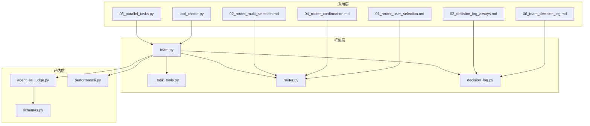
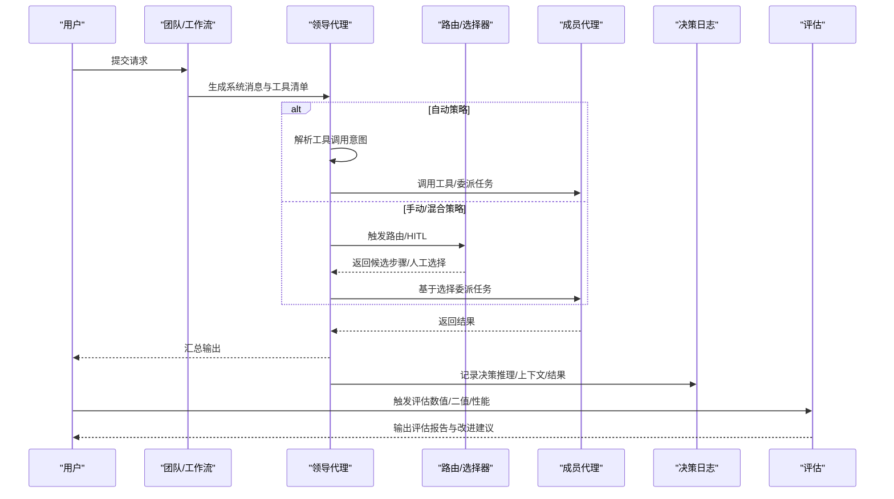
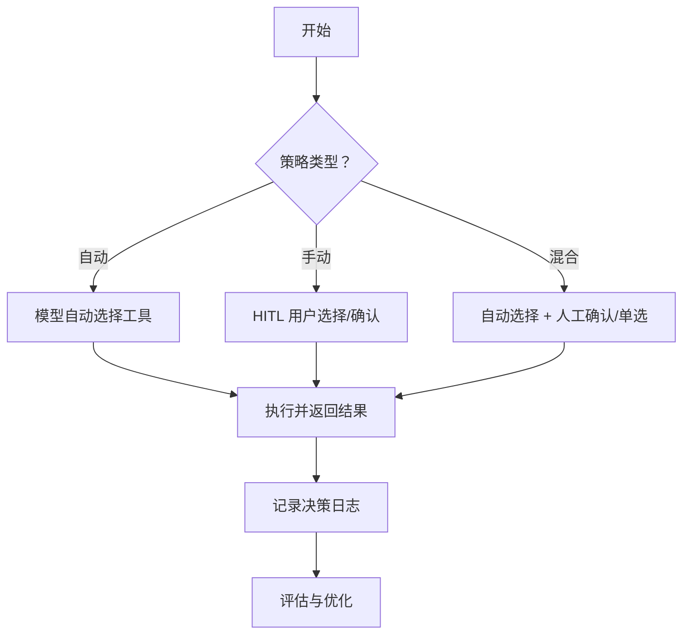
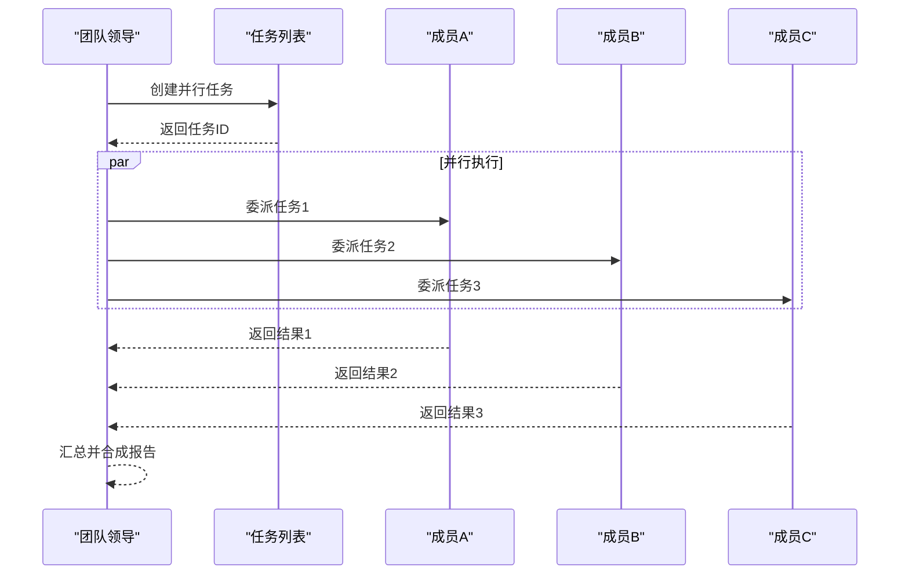
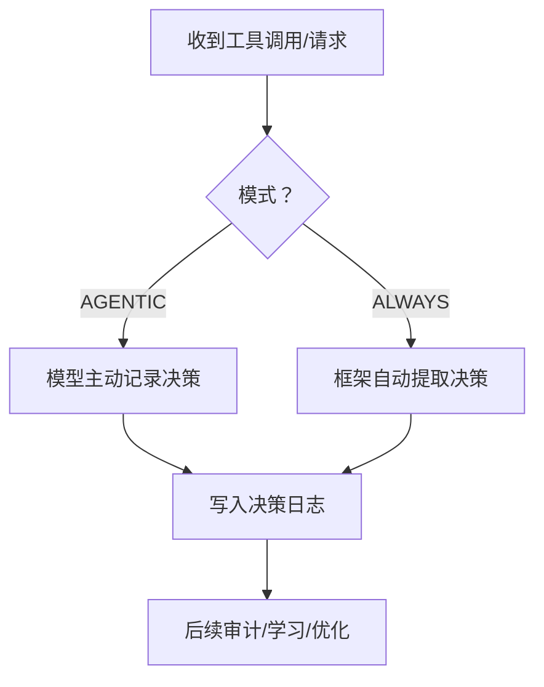
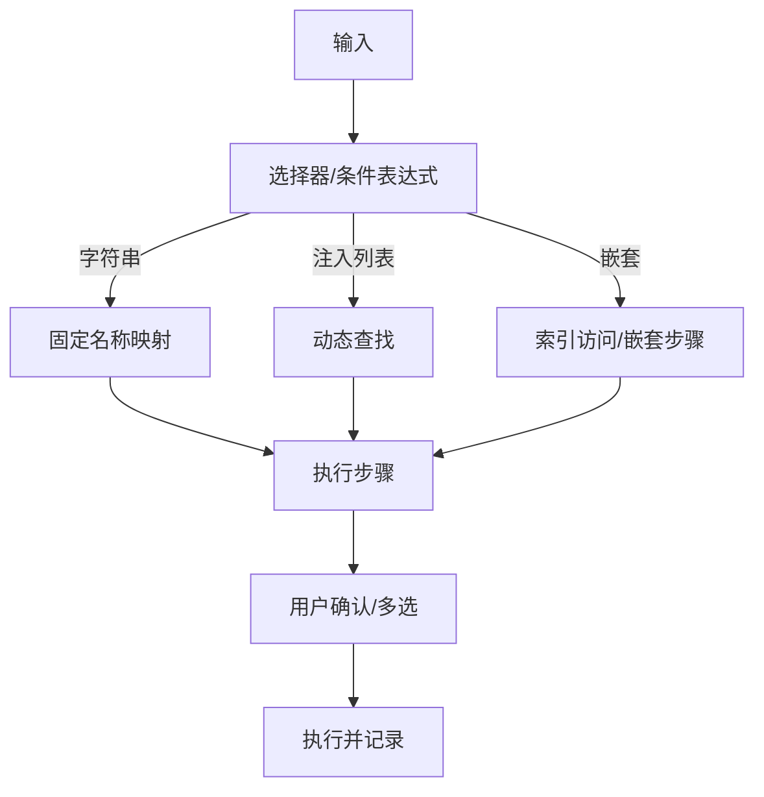
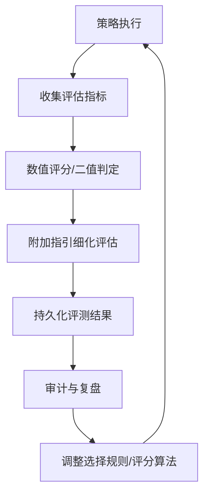
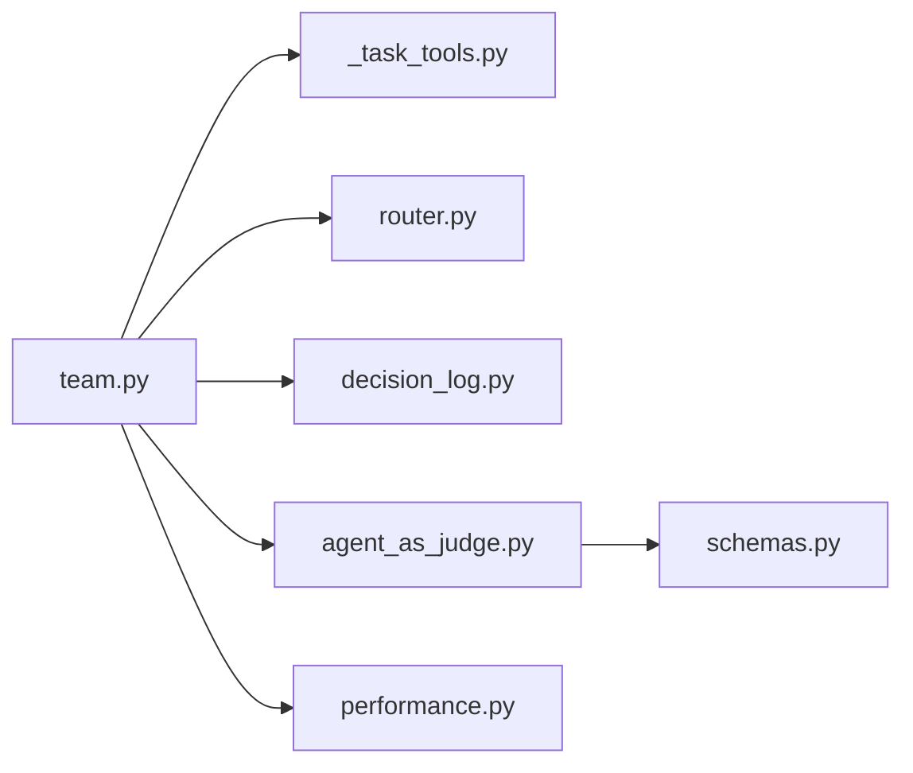

# 工具选择策略

<cite>
**本文引用的文件**
- [tool_choice.py](file://cookbook/02_agents/04_tools/tool_choice.py)
- [tool_choice.md](file://cookbook/02_agents/04_tools/tool_choice.md)
- [human_in_the_loop.py](file://cookbook/00_quickstart/human_in_the_loop.py)
- [05_parallel_tasks.py](file://cookbook/03_teams/02_modes/tasks/05_parallel_tasks.py)
- [task_mode.md](file://cookbook/03_teams/01_quickstart/task_mode.md)
- [06_team_decision_log.md](file://cookbook/03_teams/12_learning/06_team_decision_log.md)
- [02_decision_log_always.md](file://cookbook/08_learning/09_decision_logs/02_decision_log_always.md)
- [01_router_user_selection.md](file://cookbook/04_workflows/_07_human_in_the_loop/router/01_router_user_selection.md)
- [04_router_confirmation.md](file://cookbook/04_workflows/_07_human_in_the_loop/router/04_router_confirmation.md)
- [02_router_multi_selection.md](file://cookbook/04_workflows/_07_human_in_the_loop/router/02_router_multi_selection.md)
- [router.py](file://libs/agno/agno/workflow/router.py)
- [team.py](file://libs/agno/agno/team/team.py)
- [_task_tools.py](file://libs/agno/agno/team/_task_tools.py)
- [decision_log.py](file://libs/agno/agno/learn/stores/decision_log.py)
- [agent_as_judge.py](file://libs/agno/agno/eval/agent_as_judge.py)
- [agent_as_judge_with_guidelines.py.md](file://cookbook/09_evals/agent_as_judge/agent_as_judge_with_guidelines.py.md)
- [agent_as_judge_binary.py.md](file://cookbook/09_evals/agent_as_judge/agent_as_judge_binary.py.md)
- [accuracy_with_tools.py.md](file://cookbook/09_evals/accuracy/accuracy_with_tools.py.md)
- [accuracy_9_11_bigger_or_9_99.py.md](file://cookbook/09_evals/accuracy/accuracy_9_11_bigger_or_9_99.py.md)
- [cel_additional_data.py](file://cookbook/04_workflows/07_cel_expressions/condition/cel_additional_data.py)
- [performance.py](file://libs/agno/agno/eval/performance.py)
- [schemas.py](file://libs/agno/agno/os/routers/evals/schemas.py)
</cite>

## 目录
1. [简介](#简介)
2. [项目结构](#项目结构)
3. [核心组件](#核心组件)
4. [架构总览](#架构总览)
5. [详细组件分析](#详细组件分析)
6. [依赖分析](#依赖分析)
7. [性能考虑](#性能考虑)
8. [故障排查指南](#故障排查指南)
9. [结论](#结论)
10. [附录](#附录)

## 简介
本文件围绕“团队工具选择策略系统”进行系统化文档化，涵盖策略类型（自动选择、手动选择、混合选择）、在团队协作中的作用（任务匹配、资源优化、效率提升）、决策机制（优先级排序、权重计算、冲突解决）、配置方法（选择规则、评分算法、决策树）、以及评估与持续改进。文档以仓库中的示例与实现为基础，提供可追溯的源码路径与可视化图示，帮助读者快速理解并落地工具选择策略。

## 项目结构
该系统由三大层次构成：
- 应用层：示例脚本与工作流，展示工具选择策略与人类在环（HITL）交互。
- 框架层：团队、路由、任务管理与学习存储等核心模块，提供策略执行与反馈闭环。
- 评估层：评测组件与指标，用于量化策略效果并指导优化。

**图表来源**
- [tool_choice.py:1-48](file://cookbook/02_agents/04_tools/tool_choice.py#L1-L48)
- [05_parallel_tasks.py:1-81](file://cookbook/03_teams/02_modes/tasks/05_parallel_tasks.py#L1-L81)
- [01_router_user_selection.md:1-98](file://cookbook/04_workflows/_07_human_in_the_loop/router/01_router_user_selection.md#L1-L98)
- [04_router_confirmation.md:1-42](file://cookbook/04_workflows/_07_human_in_the_loop/router/04_router_confirmation.md#L1-L42)
- [02_router_multi_selection.md:1-41](file://cookbook/04_workflows/_07_human_in_the_loop/router/02_router_multi_selection.md#L1-L41)
- [team.py:1-200](file://libs/agno/agno/team/team.py#L1-L200)
- [_task_tools.py:1-200](file://libs/agno/agno/team/_task_tools.py#L1-L200)
- [router.py:308-338](file://libs/agno/agno/workflow/router.py#L308-L338)
- [decision_log.py:1-200](file://libs/agno/agno/learn/stores/decision_log.py#L1-L200)
- [agent_as_judge.py:220-250](file://libs/agno/agno/eval/agent_as_judge.py#L220-L250)
- [performance.py:598-779](file://libs/agno/agno/eval/performance.py#L598-L779)
- [schemas.py:103-145](file://libs/agno/agno/os/routers/evals/schemas.py#L103-L145)

**章节来源**
- [tool_choice.py:1-48](file://cookbook/02_agents/04_tools/tool_choice.py#L1-L48)
- [05_parallel_tasks.py:1-81](file://cookbook/03_teams/02_modes/tasks/05_parallel_tasks.py#L1-L81)
- [01_router_user_selection.md:1-98](file://cookbook/04_workflows/_07_human_in_the_loop/router/01_router_user_selection.md#L1-L98)
- [04_router_confirmation.md:1-42](file://cookbook/04_workflows/_07_human_in_the_loop/router/04_router_confirmation.md#L1-L42)
- [02_router_multi_selection.md:1-41](file://cookbook/04_workflows/_07_human_in_the_loop/router/02_router_multi_selection.md#L1-L41)
- [team.py:1-200](file://libs/agno/agno/team/team.py#L1-L200)
- [_task_tools.py:1-200](file://libs/agno/agno/team/_task_tools.py#L1-L200)
- [router.py:308-338](file://libs/agno/agno/workflow/router.py#L308-L338)
- [decision_log.py:1-200](file://libs/agno/agno/learn/stores/decision_log.py#L1-L200)
- [agent_as_judge.py:220-250](file://libs/agno/agno/eval/agent_as_judge.py#L220-L250)
- [performance.py:598-779](file://libs/agno/agno/eval/performance.py#L598-L779)
- [schemas.py:103-145](file://libs/agno/agno/os/routers/evals/schemas.py#L103-L145)

## 核心组件
- 工具选择策略入口
  - 模型侧策略：通过工具选择参数控制工具调用行为（禁用、自动、强制）。
  - 人类在环（HITL）：在路由与工作流中引入人工决策点，实现手动选择与确认。
- 团队协作与任务编排
  - 任务模式：支持并行执行、依赖链、成员委派与状态管理。
  - 成员能力与角色：根据成员角色与工具能力进行任务匹配。
- 决策日志与学习
  - 决策日志（AGENTIC/ALWAYS）：记录推理、上下文与结果，支撑审计与反馈。
- 评估与优化
  - 评测组件：数值评分与二值判定，结合附加指引细化评估维度。
  - 性能指标：吞吐、时延、协作得分等，用于策略效果量化。

**章节来源**
- [tool_choice.md:1-86](file://cookbook/02_agents/04_tools/tool_choice.md#L1-L86)
- [human_in_the_loop.py:193-239](file://cookbook/00_quickstart/human_in_the_loop.py#L193-L239)
- [task_mode.md:131-175](file://cookbook/03_teams/01_quickstart/task_mode.md#L131-L175)
- [06_team_decision_log.md:1-39](file://cookbook/03_teams/12_learning/06_team_decision_log.md#L1-L39)
- [02_decision_log_always.md:1-32](file://cookbook/08_learning/09_decision_logs/02_decision_log_always.md#L1-L32)
- [agent_as_judge_with_guidelines.py.md:1-94](file://cookbook/09_evals/agent_as_judge/agent_as_judge_with_guidelines.py.md#L1-L94)
- [agent_as_judge_binary.py.md:1-41](file://cookbook/09_evals/agent_as_judge/agent_as_judge_binary.py.md#L1-L41)
- [performance.py:598-779](file://libs/agno/agno/eval/performance.py#L598-L779)

## 架构总览
下图展示了从请求到工具选择与执行的端到端流程，包括自动策略、手动选择与混合策略的协同。

**图表来源**
- [team.py:1-200](file://libs/agno/agno/team/team.py#L1-L200)
- [router.py:308-338](file://libs/agno/agno/workflow/router.py#L308-L338)
- [01_router_user_selection.md:1-98](file://cookbook/04_workflows/_07_human_in_the_loop/router/01_router_user_selection.md#L1-L98)
- [04_router_confirmation.md:1-42](file://cookbook/04_workflows/_07_human_in_the_loop/router/04_router_confirmation.md#L1-L42)
- [02_router_multi_selection.md:1-41](file://cookbook/04_workflows/_07_human_in_the_loop/router/02_router_multi_selection.md#L1-L41)
- [decision_log.py:1-200](file://libs/agno/agno/learn/stores/decision_log.py#L1-L200)
- [agent_as_judge.py:220-250](file://libs/agno/agno/eval/agent_as_judge.py#L220-L250)
- [performance.py:598-779](file://libs/agno/agno/eval/performance.py#L598-L779)

## 详细组件分析

### 组件A：工具选择策略（自动/手动/混合）
- 自动选择（模型自主决定）
  - 通过工具选择参数控制模型是否调用工具及调用方式。
  - 示例：禁用工具、自动工具、强制调用特定工具。
- 手动选择（人类在环）
  - 路由器支持用户输入选择、多选、确认等模式，实现人工驱动的决策树。
- 混合选择（策略组合）
  - 路由器自动选择 + 用户确认，或路由器自动选择 + 用户单选，形成“先自动、后人工”的混合策略。

**图表来源**
- [tool_choice.md:1-86](file://cookbook/02_agents/04_tools/tool_choice.md#L1-L86)
- [01_router_user_selection.md:1-98](file://cookbook/04_workflows/_07_human_in_the_loop/router/01_router_user_selection.md#L1-L98)
- [04_router_confirmation.md:1-42](file://cookbook/04_workflows/_07_human_in_the_loop/router/04_router_confirmation.md#L1-L42)
- [02_router_multi_selection.md:1-41](file://cookbook/04_workflows/_07_human_in_the_loop/router/02_router_multi_selection.md#L1-L41)

**章节来源**
- [tool_choice.py:1-48](file://cookbook/02_agents/04_tools/tool_choice.py#L1-L48)
- [tool_choice.md:1-86](file://cookbook/02_agents/04_tools/tool_choice.md#L1-L86)
- [human_in_the_loop.py:193-239](file://cookbook/00_quickstart/human_in_the_loop.py#L193-L239)
- [01_router_user_selection.md:1-98](file://cookbook/04_workflows/_07_human_in_the_loop/router/01_router_user_selection.md#L1-L98)
- [04_router_confirmation.md:1-42](file://cookbook/04_workflows/_07_human_in_the_loop/router/04_router_confirmation.md#L1-L42)
- [02_router_multi_selection.md:1-41](file://cookbook/04_workflows/_07_human_in_the_loop/router/02_router_multi_selection.md#L1-L41)

### 组件B：团队协作中的任务匹配与资源优化
- 任务模式与并行执行
  - 支持独立任务并行执行，减少整体时延；依赖链确保顺序一致性。
- 成员委派与能力适配
  - 根据成员角色与工具能力进行任务委派，避免重复与无效调用。
- 会话与上下文共享
  - 通过会话状态与团队历史，降低重复信息传输，提升协作效率。

**图表来源**
- [05_parallel_tasks.py:1-81](file://cookbook/03_teams/02_modes/tasks/05_parallel_tasks.py#L1-L81)
- [_task_tools.py:1-200](file://libs/agno/agno/team/_task_tools.py#L1-L200)
- [task_mode.md:131-175](file://cookbook/03_teams/01_quickstart/task_mode.md#L131-L175)

**章节来源**
- [05_parallel_tasks.py:1-81](file://cookbook/03_teams/02_modes/tasks/05_parallel_tasks.py#L1-L81)
- [task_mode.md:131-175](file://cookbook/03_teams/01_quickstart/task_mode.md#L131-L175)
- [_task_tools.py:1-200](file://libs/agno/agno/team/_task_tools.py#L1-L200)

### 组件C：决策机制（优先级排序、权重计算、冲突解决）
- 决策日志（AGENTIC/ALWAYS）
  - AGENTIC：模型主动记录重要决策，包含决策、推理、替代方案与上下文。
  - ALWAYS：框架自动从工具调用中提取决策，无需模型显式触发。
- 决策树与路由
  - 路由器支持字符串选择、注入选择器与嵌套选择，实现灵活的决策树。
  - 支持用户输入、多选与确认，满足不同场景的人工干预需求。

**图表来源**
- [06_team_decision_log.md:1-39](file://cookbook/03_teams/12_learning/06_team_decision_log.md#L1-L39)
- [02_decision_log_always.md:1-32](file://cookbook/08_learning/09_decision_logs/02_decision_log_always.md#L1-L32)
- [decision_log.py:1-200](file://libs/agno/agno/learn/stores/decision_log.py#L1-L200)
- [router.py:308-338](file://libs/agno/agno/workflow/router.py#L308-L338)

**章节来源**
- [06_team_decision_log.md:1-39](file://cookbook/03_teams/12_learning/06_team_decision_log.md#L1-L39)
- [02_decision_log_always.md:1-32](file://cookbook/08_learning/09_decision_logs/02_decision_log_always.md#L1-L32)
- [decision_log.py:1-200](file://libs/agno/agno/learn/stores/decision_log.py#L1-L200)
- [router.py:308-338](file://libs/agno/agno/workflow/router.py#L308-L338)

### 组件D：配置方法（选择规则、评分算法、决策树）
- 选择规则
  - 路由器选择器：字符串映射、注入选择器（接收上下文与候选集）、嵌套选择。
  - 条件表达式：基于附加数据动态分流。
- 评分算法
  - 数值评分：1-10分，结合附加指引细化评估维度。
  - 二值判定：通过/失败，适合合规性检查。
- 决策树
  - 用户选择/多选：构建自定义处理管线。
  - 自动路由 + 用户确认：先自动决策，再人工确认。

**图表来源**
- [router.py:308-338](file://libs/agno/agno/workflow/router.py#L308-L338)
- [01_router_user_selection.md:1-98](file://cookbook/04_workflows/_07_human_in_the_loop/router/01_router_user_selection.md#L1-L98)
- [02_router_multi_selection.md:1-41](file://cookbook/04_workflows/_07_human_in_the_loop/router/02_router_multi_selection.md#L1-L41)
- [04_router_confirmation.md:1-42](file://cookbook/04_workflows/_07_human_in_the_loop/router/04_router_confirmation.md#L1-L42)
- [cel_additional_data.py:39-73](file://cookbook/04_workflows/07_cel_expressions/condition/cel_additional_data.py#L39-L73)

**章节来源**
- [router.py:308-338](file://libs/agno/agno/workflow/router.py#L308-L338)
- [01_router_user_selection.md:1-98](file://cookbook/04_workflows/_07_human_in_the_loop/router/01_router_user_selection.md#L1-L98)
- [02_router_multi_selection.md:1-41](file://cookbook/04_workflows/_07_human_in_the_loop/router/02_router_multi_selection.md#L1-L41)
- [04_router_confirmation.md:1-42](file://cookbook/04_workflows/_07_human_in_the_loop/router/04_router_confirmation.md#L1-L42)
- [cel_additional_data.py:39-73](file://cookbook/04_workflows/07_cel_expressions/condition/cel_additional_data.py#L39-L73)

### 组件E：评估、优化与持续改进
- 评测组件
  - 数值评分与二值判定，支持附加指引细化评估维度。
  - 评测结果可持久化并用于后续分析。
- 性能指标
  - 响应时间、吞吐、成功率、协作得分、资源利用率等。
- 持续改进
  - 基于评估与决策日志，迭代选择规则与评分算法，优化策略效果。

**图表来源**
- [agent_as_judge.py:220-250](file://libs/agno/agno/eval/agent_as_judge.py#L220-L250)
- [agent_as_judge_with_guidelines.py.md:1-94](file://cookbook/09_evals/agent_as_judge/agent_as_judge_with_guidelines.py.md#L1-L94)
- [agent_as_judge_binary.py.md:1-41](file://cookbook/09_evals/agent_as_judge/agent_as_judge_binary.py.md#L1-L41)
- [accuracy_with_tools.py.md:44-90](file://cookbook/09_evals/accuracy/accuracy_with_tools.py.md#L44-L90)
- [accuracy_9_11_bigger_or_9_99.py.md:21-58](file://cookbook/09_evals/accuracy/accuracy_9_11_bigger_or_9_99.py.md#L21-L58)
- [performance.py:598-779](file://libs/agno/agno/eval/performance.py#L598-L779)
- [schemas.py:103-145](file://libs/agno/agno/os/routers/evals/schemas.py#L103-L145)

**章节来源**
- [agent_as_judge.py:220-250](file://libs/agno/agno/eval/agent_as_judge.py#L220-L250)
- [agent_as_judge_with_guidelines.py.md:1-94](file://cookbook/09_evals/agent_as_judge/agent_as_judge_with_guidelines.py.md#L1-L94)
- [agent_as_judge_binary.py.md:1-41](file://cookbook/09_evals/agent_as_judge/agent_as_judge_binary.py.md#L1-L41)
- [accuracy_with_tools.py.md:44-90](file://cookbook/09_evals/accuracy/accuracy_with_tools.py.md#L44-L90)
- [accuracy_9_11_bigger_or_9_99.py.md:21-58](file://cookbook/09_evals/accuracy/accuracy_9_11_bigger_or_9_99.py.md#L21-L58)
- [performance.py:598-779](file://libs/agno/agno/eval/performance.py#L598-L779)
- [schemas.py:103-145](file://libs/agno/agno/os/routers/evals/schemas.py#L103-L145)

## 依赖分析
- 组件耦合
  - 团队模块与任务工具紧密耦合，负责任务创建、委派与状态更新。
  - 路由器与工作流模块解耦，通过接口暴露选择器与用户交互能力。
  - 决策日志与评估模块通过统一的数据结构进行集成。
- 外部依赖
  - 数据库与持久化：PostgreSQL/SQLite等用于存储评估与决策日志。
  - 模型服务：OpenAIResponses等用于工具调用与响应生成。

**图表来源**
- [team.py:1-200](file://libs/agno/agno/team/team.py#L1-L200)
- [_task_tools.py:1-200](file://libs/agno/agno/team/_task_tools.py#L1-L200)
- [router.py:308-338](file://libs/agno/agno/workflow/router.py#L308-L338)
- [decision_log.py:1-200](file://libs/agno/agno/learn/stores/decision_log.py#L1-L200)
- [agent_as_judge.py:220-250](file://libs/agno/agno/eval/agent_as_judge.py#L220-L250)
- [performance.py:598-779](file://libs/agno/agno/eval/performance.py#L598-L779)
- [schemas.py:103-145](file://libs/agno/agno/os/routers/evals/schemas.py#L103-L145)

**章节来源**
- [team.py:1-200](file://libs/agno/agno/team/team.py#L1-L200)
- [_task_tools.py:1-200](file://libs/agno/agno/team/_task_tools.py#L1-L200)
- [router.py:308-338](file://libs/agno/agno/workflow/router.py#L308-L338)
- [decision_log.py:1-200](file://libs/agno/agno/learn/stores/decision_log.py#L1-L200)
- [agent_as_judge.py:220-250](file://libs/agno/agno/eval/agent_as_judge.py#L220-L250)
- [performance.py:598-779](file://libs/agno/agno/eval/performance.py#L598-L779)
- [schemas.py:103-145](file://libs/agno/agno/os/routers/evals/schemas.py#L103-L145)

## 性能考虑
- 并行执行
  - 在任务模式中优先使用并行执行以缩短总时延，同时注意资源上限与依赖约束。
- 工具调用开销
  - 控制工具调用频率与参数大小，避免不必要的外部调用。
- 评估与日志
  - 评估与决策日志的持久化应异步化，避免阻塞主流程。
- 会话与缓存
  - 合理利用会话状态与缓存，减少重复计算与网络往返。

## 故障排查指南
- 工具选择异常
  - 检查工具选择参数是否正确设置（禁用/自动/强制）。
  - 确认工具清单与模型支持情况。
- 路由器选择失败
  - 校验选择器返回值是否在候选集中；检查用户输入格式与多选配置。
- 决策日志缺失
  - 确认学习模式（AGENTIC/ALWAYS）配置；检查工具调用是否触发记录。
- 评估结果异常
  - 核对附加指引与阈值设置；检查评测组件的输入与期望输出。

**章节来源**
- [tool_choice.md:1-86](file://cookbook/02_agents/04_tools/tool_choice.md#L1-L86)
- [01_router_user_selection.md:1-98](file://cookbook/04_workflows/_07_human_in_the_loop/router/01_router_user_selection.md#L1-L98)
- [02_decision_log_always.md:1-32](file://cookbook/08_learning/09_decision_logs/02_decision_log_always.md#L1-L32)
- [agent_as_judge_with_guidelines.py.md:1-94](file://cookbook/09_evals/agent_as_judge/agent_as_judge_with_guidelines.py.md#L1-L94)

## 结论
本系统通过“自动/手动/混合”工具选择策略，结合团队任务编排、决策日志与评估体系，实现了面向团队协作的高效工具选择与持续优化。建议在实际落地中：
- 明确策略边界：自动策略用于常规场景，手动/混合策略用于关键决策。
- 建立评估闭环：以数值评分与二值判定为核心，辅以附加指引细化评估维度。
- 强化审计与学习：利用决策日志沉淀经验，驱动规则与算法迭代。
- 注重性能与稳定性：通过并行执行、异步评估与缓存机制提升整体性能。

## 附录
- 示例与参考路径
  - 工具选择策略：[tool_choice.py:1-48](file://cookbook/02_agents/04_tools/tool_choice.py#L1-L48)，[tool_choice.md:1-86](file://cookbook/02_agents/04_tools/tool_choice.md#L1-L86)
  - 并行任务与团队协作：[05_parallel_tasks.py:1-81](file://cookbook/03_teams/02_modes/tasks/05_parallel_tasks.py#L1-L81)，[task_mode.md:131-175](file://cookbook/03_teams/01_quickstart/task_mode.md#L131-L175)
  - 人类在环与路由：[01_router_user_selection.md:1-98](file://cookbook/04_workflows/_07_human_in_the_loop/router/01_router_user_selection.md#L1-L98)，[04_router_confirmation.md:1-42](file://cookbook/04_workflows/_07_human_in_the_loop/router/04_router_confirmation.md#L1-L42)，[02_router_multi_selection.md:1-41](file://cookbook/04_workflows/_07_human_in_the_loop/router/02_router_multi_selection.md#L1-L41)
  - 决策日志：[06_team_decision_log.md:1-39](file://cookbook/03_teams/12_learning/06_team_decision_log.md#L1-L39)，[02_decision_log_always.md:1-32](file://cookbook/08_learning/09_decision_logs/02_decision_log_always.md#L1-L32)
  - 评估与指标：[agent_as_judge.py:220-250](file://libs/agno/agno/eval/agent_as_judge.py#L220-L250)，[performance.py:598-779](file://libs/agno/agno/eval/performance.py#L598-L779)，[schemas.py:103-145](file://libs/agno/agno/os/routers/evals/schemas.py#L103-L145)