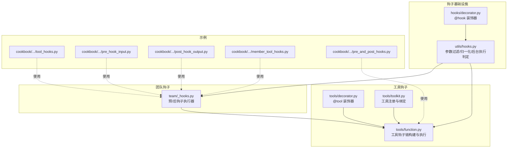
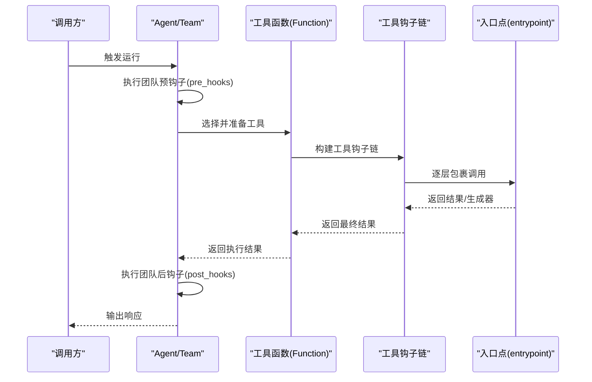
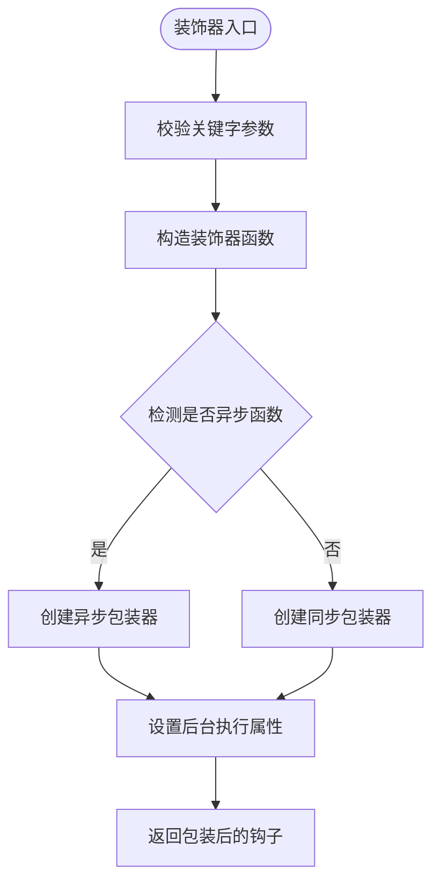
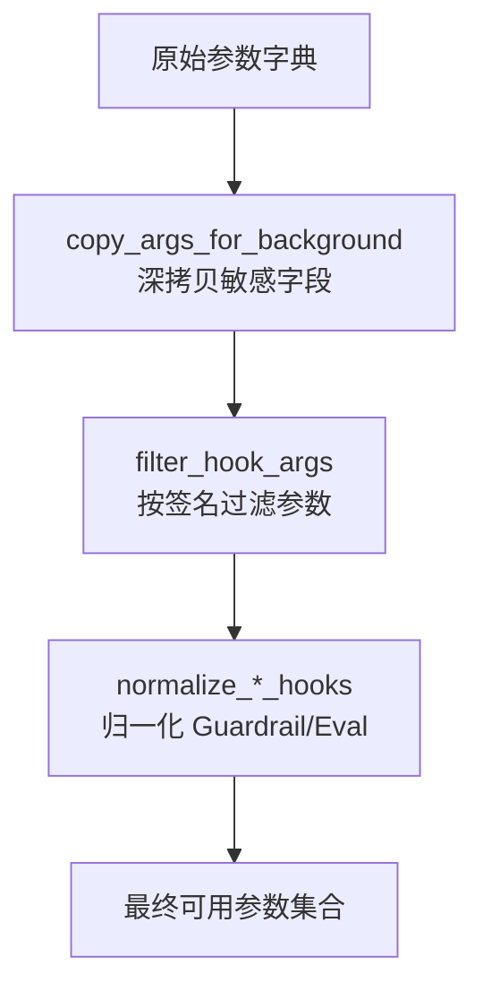
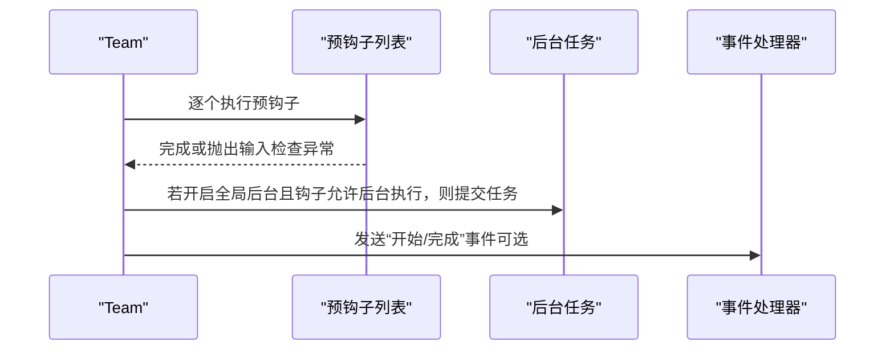
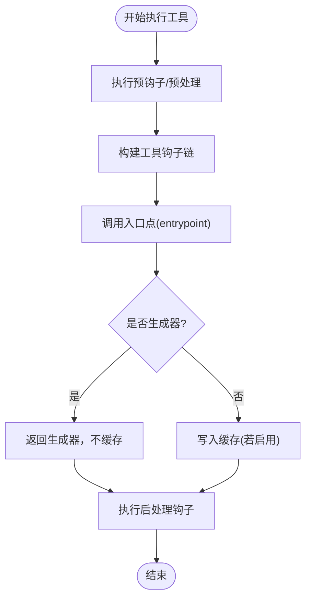
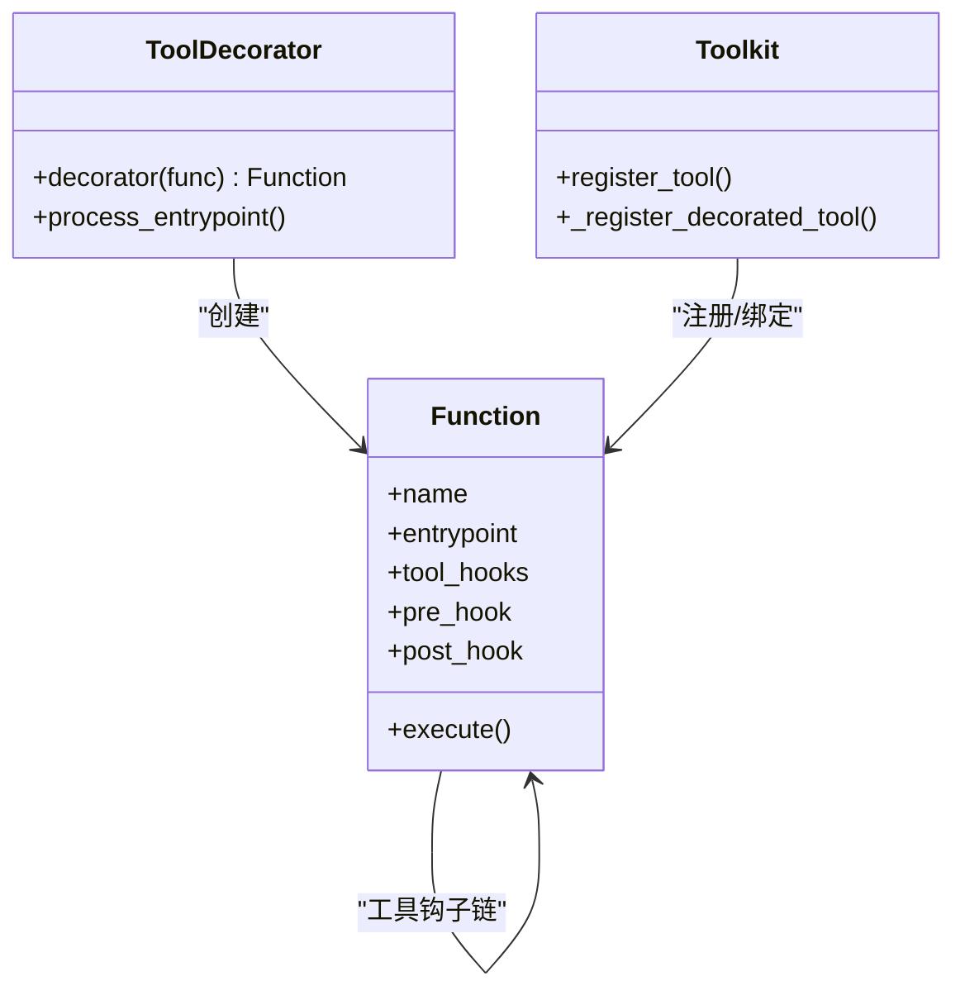
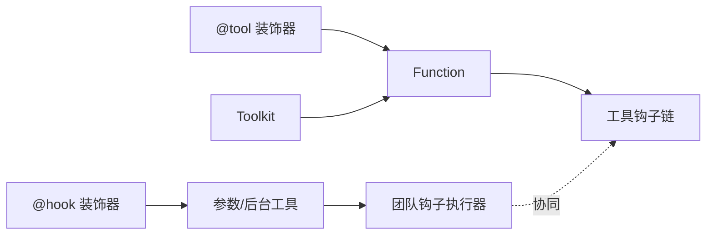

# 工具钩子

<cite>
**本文引用的文件**
- [libs/agno/agno/hooks/decorator.py](file://libs/agno/agno/hooks/decorator.py)
- [libs/agno/agno/utils/hooks.py](file://libs/agno/agno/utils/hooks.py)
- [libs/agno/agno/team/_hooks.py](file://libs/agno/agno/team/_hooks.py)
- [libs/agno/agno/tools/function.py](file://libs/agno/agno/tools/function.py)
- [libs/agno/agno/tools/decorator.py](file://libs/agno/agno/tools/decorator.py)
- [libs/agno/agno/tools/toolkit.py](file://libs/agno/agno/tools/toolkit.py)
- [cookbook/02_agents/09_hooks/tool_hooks.py](file://cookbook/02_agents/09_hooks/tool_hooks.py)
- [cookbook/02_agents/09_hooks/pre_hook_input.py](file://cookbook/02_agents/09_hooks/pre_hook_input.py)
- [cookbook/02_agents/09_hooks/post_hook_output.py](file://cookbook/02_agents/09_hooks/post_hook_output.py)
- [cookbook/03_teams/03_tools/member_tool_hooks.py](file://cookbook/03_teams/03_tools/member_tool_hooks.py)
- [cookbook/91_tools/tool_hooks/pre_and_post_hooks.py](file://cookbook/91_tools/tool_hooks/pre_and_post_hooks.py)
</cite>

## 目录
1. [简介](#简介)
2. [项目结构](#项目结构)
3. [核心组件](#核心组件)
4. [架构总览](#架构总览)
5. [详细组件分析](#详细组件分析)
6. [依赖分析](#依赖分析)
7. [性能考虑](#性能考虑)
8. [故障排查指南](#故障排查指南)
9. [结论](#结论)
10. [附录](#附录)

## 简介
本文件系统性地介绍“工具钩子”在团队协作与工具执行流程中的设计与使用方法。内容覆盖：
- 预处理钩子、后处理钩子与工具钩子的实现与差异
- 成员工具钩子与全局工具钩子的区别与适用场景
- 钩子的执行时机、执行顺序与钩子链管理
- 钩子的配置方式：注册、参数传递、返回值处理
- 具体示例路径：自定义钩子、钩子组合与钩子继承
- 在工具执行过程中的作用：工具前处理、工具后处理、工具异常处理
- 调试、性能优化与最佳实践

## 项目结构
围绕“工具钩子”的核心代码主要分布在以下模块：
- 钩子装饰器与通用工具：libs/agno/agno/hooks/decorator.py、libs/agno/agno/utils/hooks.py
- 团队运行期钩子执行：libs/agno/agno/team/_hooks.py
- 工具函数与工具钩子链：libs/agno/agno/tools/function.py、libs/agno/agno/tools/decorator.py、libs/agno/agno/tools/toolkit.py
- 示例：cookbook 中的 Agent/Team/工具层钩子示例

图表来源
- [libs/agno/agno/hooks/decorator.py:1-165](file://libs/agno/agno/hooks/decorator.py#L1-L165)
- [libs/agno/agno/utils/hooks.py:1-179](file://libs/agno/agno/utils/hooks.py#L1-L179)
- [libs/agno/agno/team/_hooks.py:1-624](file://libs/agno/agno/team/_hooks.py#L1-L624)
- [libs/agno/agno/tools/function.py:900-1099](file://libs/agno/agno/tools/function.py#L900-L1099)
- [libs/agno/agno/tools/decorator.py:280-293](file://libs/agno/agno/tools/decorator.py#L280-L293)
- [libs/agno/agno/tools/toolkit.py:208-269](file://libs/agno/agno/tools/toolkit.py#L208-L269)
- [cookbook/02_agents/09_hooks/tool_hooks.py:1-53](file://cookbook/02_agents/09_hooks/tool_hooks.py#L1-L53)
- [cookbook/02_agents/09_hooks/pre_hook_input.py:1-163](file://cookbook/02_agents/09_hooks/pre_hook_input.py#L1-L163)
- [cookbook/02_agents/09_hooks/post_hook_output.py:1-191](file://cookbook/02_agents/09_hooks/post_hook_output.py#L1-L191)
- [cookbook/03_teams/03_tools/member_tool_hooks.py:1-163](file://cookbook/03_teams/03_tools/member_tool_hooks.py#L1-L163)
- [cookbook/91_tools/tool_hooks/pre_and_post_hooks.py:1-110](file://cookbook/91_tools/tool_hooks/pre_and_post_hooks.py#L1-L110)

章节来源
- [libs/agno/agno/hooks/decorator.py:1-165](file://libs/agno/agno/hooks/decorator.py#L1-L165)
- [libs/agno/agno/utils/hooks.py:1-179](file://libs/agno/agno/utils/hooks.py#L1-L179)
- [libs/agno/agno/team/_hooks.py:1-624](file://libs/agno/agno/team/_hooks.py#L1-L624)
- [libs/agno/agno/tools/function.py:900-1099](file://libs/agno/agno/tools/function.py#L900-L1099)
- [libs/agno/agno/tools/decorator.py:280-293](file://libs/agno/agno/tools/decorator.py#L280-L293)
- [libs/agno/agno/tools/toolkit.py:208-269](file://libs/agno/agno/tools/toolkit.py#L208-L269)

## 核心组件
- 钩子装饰器与后台执行控制：提供 @hook(run_in_background=...) 以声明钩子在后台任务中运行，并合并多层装饰器的属性。
- 钩子参数归一化与过滤：根据钩子签名动态筛选传参，避免不必要或不兼容的参数进入钩子。
- 团队运行期钩子：统一管理 pre_hooks/post_hooks 的执行顺序、事件流、异常传播与后台任务调度。
- 工具钩子链：在工具函数执行前后按顺序包裹中间件，支持同步/异步工具与生成器工具。
- 工具装饰器与注册：@tool 装饰器将函数包装为 Function 并注入工具钩子、确认策略等元数据。

章节来源
- [libs/agno/agno/hooks/decorator.py:56-135](file://libs/agno/agno/hooks/decorator.py#L56-L135)
- [libs/agno/agno/utils/hooks.py:15-179](file://libs/agno/agno/utils/hooks.py#L15-L179)
- [libs/agno/agno/team/_hooks.py:222-624](file://libs/agno/agno/team/_hooks.py#L222-L624)
- [libs/agno/agno/tools/function.py:900-1099](file://libs/agno/agno/tools/function.py#L900-L1099)
- [libs/agno/agno/tools/decorator.py:280-293](file://libs/agno/agno/tools/decorator.py#L280-L293)

## 架构总览
下图展示了从“工具调用”到“钩子链执行”的整体流程，以及“团队钩子”与“工具钩子”的协同关系。

图表来源
- [libs/agno/agno/team/_hooks.py:222-624](file://libs/agno/agno/team/_hooks.py#L222-L624)
- [libs/agno/agno/tools/function.py:900-1099](file://libs/agno/agno/tools/function.py#L900-L1099)

## 详细组件分析

### 组件A：钩子装饰器与后台执行控制
- 功能要点
  - @hook(run_in_background=...)：为单个钩子声明后台执行；支持同步/异步钩子。
  - 多装饰器叠加时采用“OR”逻辑合并 run_in_background 属性。
  - should_run_in_background(hook)：遍历包装链查找属性，确保装饰器叠加正确生效。
- 参数与返回
  - 输入：被装饰的钩子函数
  - 输出：带属性标记的包装函数（同步/异步）
- 使用建议
  - 对耗时但非阻塞的任务（如通知、日志上报）启用后台执行。
  - 注意：异步钩子需配合异步运行接口使用。

图表来源
- [libs/agno/agno/hooks/decorator.py:56-135](file://libs/agno/agno/hooks/decorator.py#L56-L135)
- [libs/agno/agno/hooks/decorator.py:138-165](file://libs/agno/agno/hooks/decorator.py#L138-L165)

章节来源
- [libs/agno/agno/hooks/decorator.py:56-135](file://libs/agno/agno/hooks/decorator.py#L56-L135)
- [libs/agno/agno/hooks/decorator.py:138-165](file://libs/agno/agno/hooks/decorator.py#L138-L165)

### 组件B：钩子参数归一化与过滤
- 功能要点
  - copy_args_for_background：对敏感参数进行深拷贝，避免并发竞态。
  - filter_hook_args：按钩子签名过滤参数，支持 **kwargs 的全量透传。
  - normalize_pre_hooks/normalize_post_hooks：将 Guardrail/Eval 等对象转换为可执行钩子，并保留后台执行标记。
- 性能与安全
  - 深拷贝仅针对关键字段，避免不必要的开销。
  - 对签名解析失败的情况回退为全量参数透传，保证稳定性。

图表来源
- [libs/agno/agno/utils/hooks.py:15-179](file://libs/agno/agno/utils/hooks.py#L15-L179)

章节来源
- [libs/agno/agno/utils/hooks.py:15-179](file://libs/agno/agno/utils/hooks.py#L15-L179)

### 组件C：团队运行期钩子（预/后）
- 功能要点
  - _execute_pre_hooks/_execute_post_hooks：顺序执行多个钩子，支持事件流、异常捕获与后台任务调度。
  - 支持“全局后台模式”：当团队开启后台执行时，优先同步执行守卫类钩子，其余钩子提交至后台任务。
  - 支持 per-hook 后台控制：通过 @hook(run_in_background=True) 为特定钩子启用后台。
- 执行顺序
  - 钩子列表按顺序依次执行，每个钩子可选择是否阻塞当前线程。
  - 事件流：在 stream_events=True 时，钩子开始/结束事件会被发出并持久化。

图表来源
- [libs/agno/agno/team/_hooks.py:222-624](file://libs/agno/agno/team/_hooks.py#L222-L624)

章节来源
- [libs/agno/agno/team/_hooks.py:222-624](file://libs/agno/agno/team/_hooks.py#L222-L624)

### 组件D：工具钩子链（工具级中间件）
- 功能要点
  - 工具钩子链：在工具入口点两侧按顺序包裹中间件，形成“内层包裹外层”的嵌套链。
  - 支持同步/异步工具与生成器工具：生成器工具不缓存结果，且 session_state 以引用方式更新。
  - 参数注入：根据钩子签名自动注入 agent、team、run_context、fc 等上下文。
- 执行顺序
  - 顺序执行：外层钩子先于内层钩子执行，内部钩子包裹入口点。
  - 异常处理：入口点异常被捕获并转换为执行结果，finally 中执行后处理钩子。

图表来源
- [libs/agno/agno/tools/function.py:900-1099](file://libs/agno/agno/tools/function.py#L900-L1099)

章节来源
- [libs/agno/agno/tools/function.py:900-1099](file://libs/agno/agno/tools/function.py#L900-L1099)

### 组件E：工具装饰器与注册
- 功能要点
  - @tool 装饰器：将普通函数包装为 Function，注入名称、描述、确认策略、外部执行等元信息。
  - 工具注册：Toolkit 自动绑定实例方法，处理 include/exclude、stop_after_tool_call、requires_confirmation 等策略。
- 与钩子的关系
  - @tool 可同时配置工具级 pre_hook/post_hook，用于工具前/后处理。
  - 工具钩子链与团队钩子链相互独立，分别作用于工具层与运行层。

图表来源
- [libs/agno/agno/tools/decorator.py:280-293](file://libs/agno/agno/tools/decorator.py#L280-L293)
- [libs/agno/agno/tools/function.py:900-1099](file://libs/agno/agno/tools/function.py#L900-L1099)
- [libs/agno/agno/tools/toolkit.py:208-269](file://libs/agno/agno/tools/toolkit.py#L208-L269)

章节来源
- [libs/agno/agno/tools/decorator.py:280-293](file://libs/agno/agno/tools/decorator.py#L280-L293)
- [libs/agno/agno/tools/toolkit.py:208-269](file://libs/agno/agno/tools/toolkit.py#L208-L269)

### 组件F：示例与用法

#### 示例1：工具级 pre/post 钩子
- 作用：对单个工具函数在执行前后进行拦截，适合细粒度控制与可观测性。
- 关键点：支持同步/异步，可修改结果或抛出异常中断执行。

章节来源
- [cookbook/91_tools/tool_hooks/pre_and_post_hooks.py:1-110](file://cookbook/91_tools/tool_hooks/pre_and_post_hooks.py#L1-L110)

#### 示例2：工具中间件（全局工具钩子）
- 作用：为所有工具调用添加统一的中间件（如计时、日志），适合横切关注点。
- 关键点：钩子接收 function_name、func、args，必须调用 next_func(**args) 继续链路。

章节来源
- [cookbook/02_agents/09_hooks/tool_hooks.py:1-53](file://cookbook/02_agents/09_hooks/tool_hooks.py#L1-L53)

#### 示例3：成员工具钩子（权限控制）
- 作用：在委托给成员代理前进行权限校验，防止越权操作。
- 关键点：基于会话状态与用户身份判断，可通过抛出异常阻止后续执行。

章节来源
- [cookbook/03_teams/03_tools/member_tool_hooks.py:1-163](file://cookbook/03_teams/03_tools/member_tool_hooks.py#L1-L163)

#### 示例4：输入/输出验证钩子
- 作用：在运行前进行输入校验，在运行后进行输出质量校验。
- 关键点：可抛出 InputCheckError/OutputCheckError 中断流程并携带触发原因。

章节来源
- [cookbook/02_agents/09_hooks/pre_hook_input.py:1-163](file://cookbook/02_agents/09_hooks/pre_hook_input.py#L1-L163)
- [cookbook/02_agents/09_hooks/post_hook_output.py:1-191](file://cookbook/02_agents/09_hooks/post_hook_output.py#L1-L191)

## 依赖分析
- 组件耦合
  - 钩子装饰器与参数工具：@hook 与 utils/hooks 的紧密配合，确保后台执行与参数过滤一致。
  - 团队钩子与工具钩子：分属不同层级（运行层 vs 工具层），通过各自执行器解耦。
  - 工具装饰器与注册：@tool 与 Toolkit 负责工具元数据与生命周期管理。
- 外部依赖
  - 异步运行与后台任务：需要运行环境支持后台任务队列（如 FastAPI 后台任务）。
  - 事件系统：团队钩子在事件流中发出“开始/完成”事件，便于可观测性与审计。

图表来源
- [libs/agno/agno/hooks/decorator.py:56-135](file://libs/agno/agno/hooks/decorator.py#L56-L135)
- [libs/agno/agno/utils/hooks.py:15-179](file://libs/agno/agno/utils/hooks.py#L15-L179)
- [libs/agno/agno/team/_hooks.py:222-624](file://libs/agno/agno/team/_hooks.py#L222-L624)
- [libs/agno/agno/tools/decorator.py:280-293](file://libs/agno/agno/tools/decorator.py#L280-L293)
- [libs/agno/agno/tools/toolkit.py:208-269](file://libs/agno/agno/tools/toolkit.py#L208-L269)

章节来源
- [libs/agno/agno/hooks/decorator.py:56-135](file://libs/agno/agno/hooks/decorator.py#L56-L135)
- [libs/agno/agno/utils/hooks.py:15-179](file://libs/agno/agno/utils/hooks.py#L15-L179)
- [libs/agno/agno/team/_hooks.py:222-624](file://libs/agno/agno/team/_hooks.py#L222-L624)
- [libs/agno/agno/tools/decorator.py:280-293](file://libs/agno/agno/tools/decorator.py#L280-L293)
- [libs/agno/agno/tools/toolkit.py:208-269](file://libs/agno/agno/tools/toolkit.py#L208-L269)

## 性能考虑
- 后台执行
  - 使用 @hook(run_in_background=True) 将非关键钩子放入后台任务，降低主流程阻塞。
  - 全局后台模式：团队级别开启后台执行时，守卫类钩子仍同步执行以保证异常快速反馈。
- 参数深拷贝
  - 仅对敏感字段进行深拷贝，避免不必要的序列化成本。
- 工具缓存
  - 工具执行结果缓存仅适用于非生成器函数，生成器工具直接返回迭代器，不缓存。
- 异步钩子
  - 异步钩子仅能在异步运行接口中使用，同步接口禁止混用异步钩子。

## 故障排查指南
- 常见问题
  - 钩子参数不匹配：使用 filter_hook_args 自动过滤参数，若签名解析失败则回退全量透传。
  - 后台执行失败：检查后台任务队列是否可用，查看日志中的执行失败记录。
  - 异步钩子报错：确保使用异步运行接口（如 arun）。
- 调试建议
  - 开启调试模式：团队钩子执行器会在 finally 中重置全局日志模式，避免钩子影响后续日志。
  - 事件流：开启 stream_events 以观察钩子开始/完成事件，便于定位执行时序问题。
  - 输入/输出校验：利用 InputCheckError/OutputCheckError 快速定位输入或输出质量问题。

章节来源
- [libs/agno/agno/utils/hooks.py:156-179](file://libs/agno/agno/utils/hooks.py#L156-L179)
- [libs/agno/agno/team/_hooks.py:314-317](file://libs/agno/agno/team/_hooks.py#L314-L317)
- [libs/agno/agno/team/_hooks.py:419-422](file://libs/agno/agno/team/_hooks.py#L419-L422)

## 结论
工具钩子体系通过“团队钩子”和“工具钩子”的双层设计，实现了从运行层到工具层的精细化控制与可观测性。借助 @hook 装饰器与参数归一化工具，开发者可以灵活地组合同步/异步、前台/后台的钩子策略；通过工具中间件与成员工具钩子，既能实现全局横切关注点，也能满足细粒度的权限与业务控制需求。结合事件流与异常模型，该体系在保障安全性的同时，提供了良好的扩展性与可维护性。

## 附录
- 最佳实践
  - 将耗时但非关键逻辑放入后台钩子，减少主流程延迟。
  - 使用工具中间件统一处理日志、计时、鉴权等横切关注点。
  - 对生成器工具谨慎使用缓存，优先保证实时性。
  - 明确区分“成员工具钩子”与“全局工具钩子”，前者面向成员权限与委托，后者面向工具调用的通用行为。
  - 在复杂场景中，结合输入/输出验证钩子，确保数据质量与合规性。