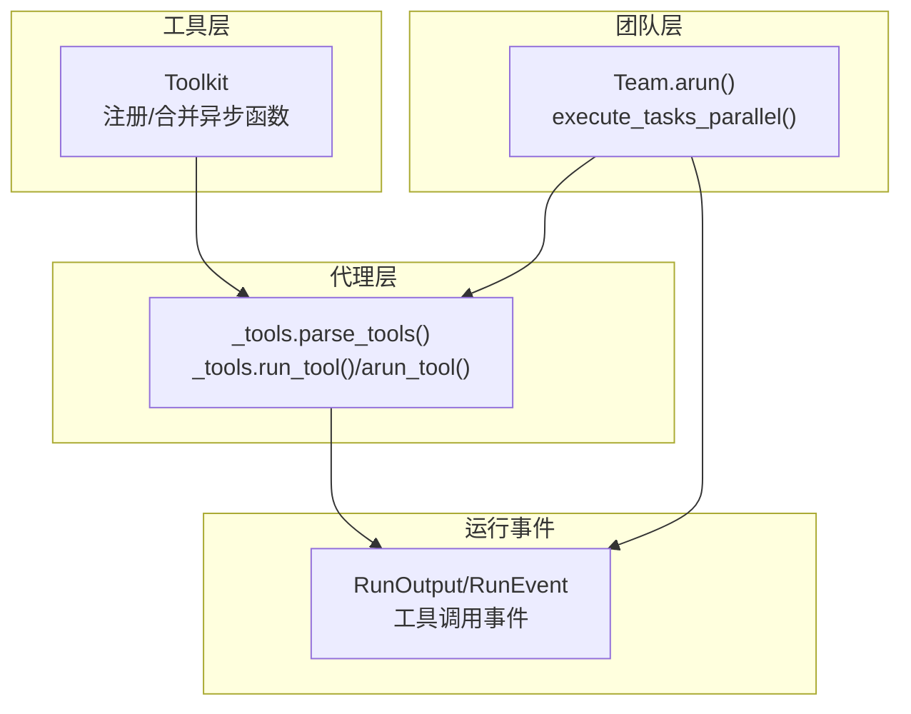
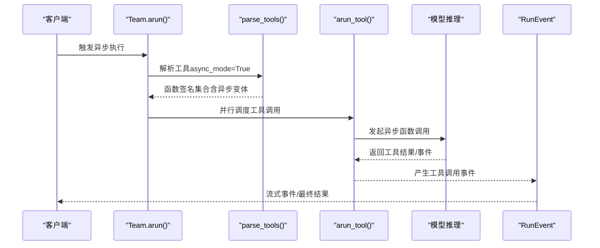
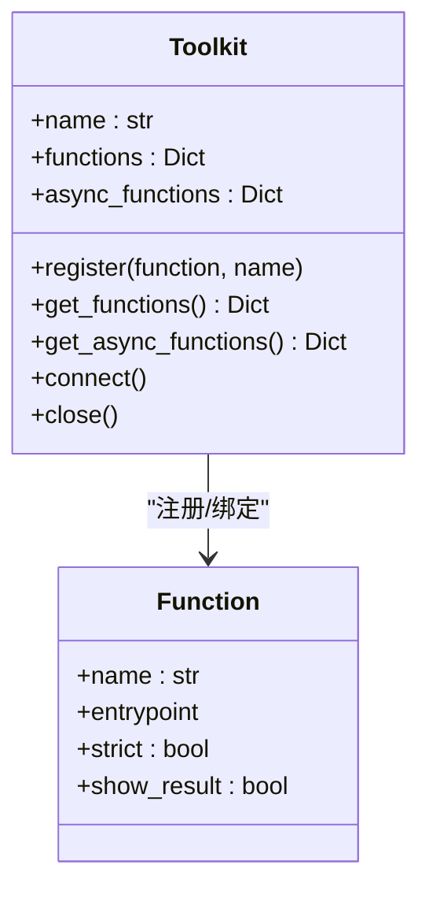
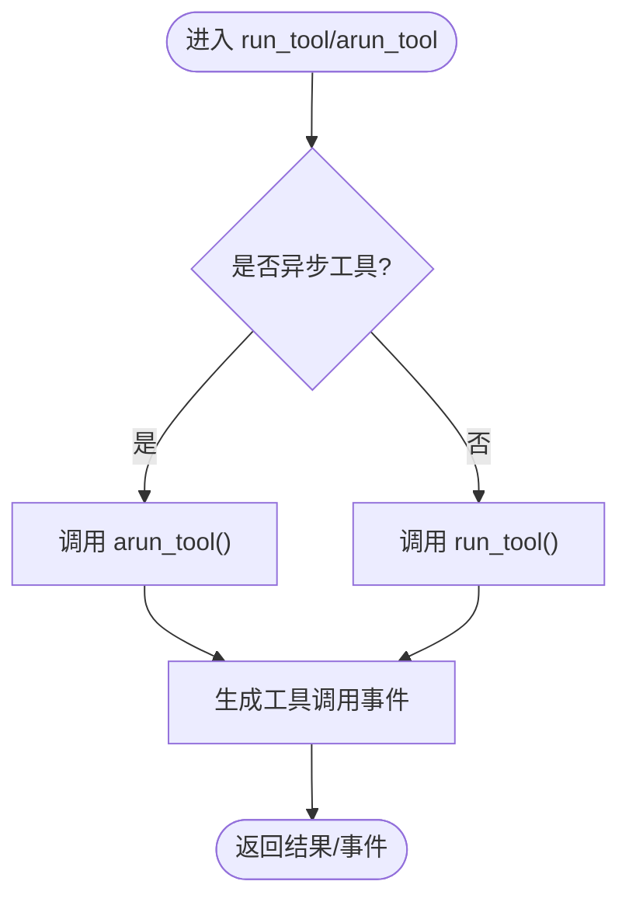
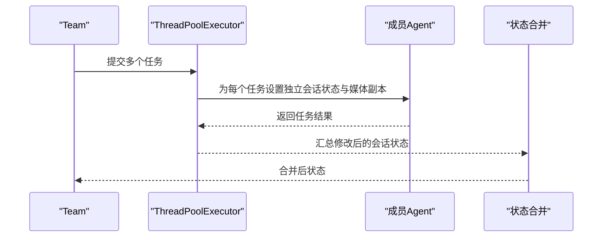
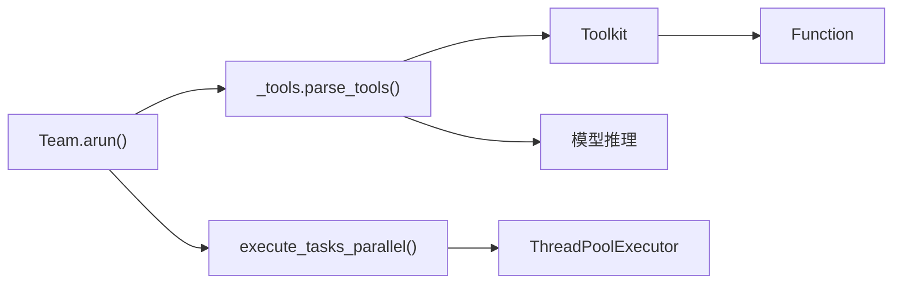

# 异步工具

<cite>
**本文引用的文件**
- [libs/agno/agno/tools/toolkit.py](file://libs/agno/agno/tools/toolkit.py)
- [libs/agno/agno/agent/_tools.py](file://libs/agno/agno/agent/_tools.py)
- [libs/agno/agno/team/team.py](file://libs/agno/agno/team/team.py)
- [libs/agno/agno/team/_task_tools.py](file://libs/agno/agno/team/_task_tools.py)
- [libs/agno/agno/run/agent.py](file://libs/agno/agno/run/agent.py)
- [cookbook/03_teams/03_tools/async_tools.py](file://cookbook/03_teams/03_tools/async_tools.py)
- [cookbook/03_teams/02_modes/tasks/07_async_task_mode.py](file://cookbook/03_teams/02_modes/tasks/07_async_task_mode.py)
- [cookbook/03_teams/02_modes/tasks/07_async_task_mode.md](file://cookbook/03_teams/02_modes/tasks/07_async_task_mode.md)
- [libs/agno/tests/integration/agent/test_async_tool_calling.py](file://libs/agno/tests/integration/agent/test_async_tool_calling.py)
- [libs/agno/tests/unit/tools/test_toolkit.py](file://libs/agno/tests/unit/tools/test_toolkit.py)
</cite>

## 目录
1. [简介](#简介)
2. [项目结构](#项目结构)
3. [核心组件](#核心组件)
4. [架构总览](#架构总览)
5. [详细组件分析](#详细组件分析)
6. [依赖分析](#依赖分析)
7. [性能考量](#性能考量)
8. [故障排除指南](#故障排除指南)
9. [结论](#结论)
10. [附录](#附录)

## 简介
本文件系统性梳理团队异步工具体系的设计与实现，覆盖异步工具的定义、配置、执行与生命周期管理；解释异步与同步工具在执行模式、资源管理与性能上的差异；给出并发执行、异步等待与异步错误处理的实践路径；并通过具体示例与图示展示异步函数工具、异步类工具与异步工具包的创建与使用方式，帮助团队在协作场景中高效实现并行处理、资源共享与状态同步。

## 项目结构
围绕异步工具的关键代码分布在以下模块：
- 工具注册与分发：工具包 Toolkit 及其同步/异步函数字典
- 工具解析与执行：Agent 工具解析、同步/异步执行器
- 团队并行执行：Team 任务模式与并行工具
- 运行事件模型：RunOutput/RunEvent 与工具调用事件
- 示例与测试：cookbook 中的异步示例与集成/单元测试

图表来源
- [libs/agno/agno/tools/toolkit.py:153-325](file://libs/agno/agno/tools/toolkit.py#L153-L325)
- [libs/agno/agno/agent/_tools.py:340-503](file://libs/agno/agno/agent/_tools.py#L340-L503)
- [libs/agno/agno/team/team.py:1-200](file://libs/agno/agno/team/team.py#L1-L200)
- [libs/agno/agno/team/_task_tools.py:647-839](file://libs/agno/agno/team/_task_tools.py#L647-L839)
- [libs/agno/agno/run/agent.py:134-200](file://libs/agno/agno/run/agent.py#L134-L200)

章节来源
- [libs/agno/agno/tools/toolkit.py:153-325](file://libs/agno/agno/tools/toolkit.py#L153-L325)
- [libs/agno/agno/agent/_tools.py:340-503](file://libs/agno/agno/agent/_tools.py#L340-L503)
- [libs/agno/agno/team/team.py:1-200](file://libs/agno/agno/team/team.py#L1-L200)
- [libs/agno/agno/team/_task_tools.py:647-839](file://libs/agno/agno/team/_task_tools.py#L647-L839)
- [libs/agno/agno/run/agent.py:134-200](file://libs/agno/agno/run/agent.py#L134-L200)

## 核心组件
- 工具包 Toolkit
  - 支持同步与异步函数注册，自动检测协程函数并分别登记到 functions 与 async_functions 字典
  - 提供 get_async_functions() 合并策略：优先使用异步变体，缺失时回退到同步实现
  - 支持连接管理（_requires_connect）、缓存等高级特性
- 工具解析与执行
  - parse_tools() 根据 async_mode 选择 Toolkit.get_functions() 或 get_async_functions()
  - run_tool()/arun_tool() 分别处理同步与异步工具调用，支持流式事件
  - _tools.raise_if_async_tools() 在同步上下文阻止异步工具执行
- 团队并行执行
  - Team.arun() 在 tasks 模式下并发委派任务
  - execute_tasks_parallel() 使用线程池并发执行多个成员任务
- 运行事件模型
  - RunEvent 定义工具调用开始/完成/错误等事件，便于异步流式观察

章节来源
- [libs/agno/agno/tools/toolkit.py:153-325](file://libs/agno/agno/tools/toolkit.py#L153-L325)
- [libs/agno/agno/agent/_tools.py:46-102](file://libs/agno/agno/agent/_tools.py#L46-L102)
- [libs/agno/agno/agent/_tools.py:340-503](file://libs/agno/agno/agent/_tools.py#L340-L503)
- [libs/agno/agno/team/team.py:1-200](file://libs/agno/agno/team/team.py#L1-L200)
- [libs/agno/agno/team/_task_tools.py:647-839](file://libs/agno/agno/team/_task_tools.py#L647-L839)
- [libs/agno/agno/run/agent.py:134-200](file://libs/agno/agno/run/agent.py#L134-L200)

## 架构总览
异步工具在系统中的交互路径如下：

图表来源
- [libs/agno/agno/team/team.py:1-200](file://libs/agno/agno/team/team.py#L1-L200)
- [libs/agno/agno/agent/_tools.py:340-503](file://libs/agno/agno/agent/_tools.py#L340-L503)
- [libs/agno/agno/run/agent.py:134-200](file://libs/agno/agno/run/agent.py#L134-L200)

## 详细组件分析

### 组件一：异步工具包 Toolkit
- 注册机制
  - register() 自动识别协程函数并写入 async_functions
  - _register_async_tools() 支持显式映射（异步名≠同步名）的工具注册
- 合并策略
  - get_async_functions() 以异步变体优先，回退到同步实现，确保异步上下文优先使用高性能实现
- 生命周期
  - connect()/close() 用于需要连接管理的工具包（如数据库）

图表来源
- [libs/agno/agno/tools/toolkit.py:153-325](file://libs/agno/agno/tools/toolkit.py#L153-L325)

章节来源
- [libs/agno/agno/tools/toolkit.py:153-325](file://libs/agno/agno/tools/toolkit.py#L153-L325)

### 组件二：异步工具解析与执行
- 工具解析
  - parse_tools() 根据 async_mode 选择 Toolkit 的同步或异步函数字典
- 同步/异步执行
  - run_tool() 处理同步工具调用与事件
  - arun_tool() 处理异步工具调用与事件，支持流式事件推送
- 异步工具限制
  - _tools.raise_if_async_tools() 在同步 run/print_response 中拦截异步工具并抛出异常

图表来源
- [libs/agno/agno/agent/_tools.py:46-102](file://libs/agno/agno/agent/_tools.py#L46-L102)
- [libs/agno/agno/agent/_tools.py:695-754](file://libs/agno/agno/agent/_tools.py#L695-L754)

章节来源
- [libs/agno/agno/agent/_tools.py:46-102](file://libs/agno/agno/agent/_tools.py#L46-L102)
- [libs/agno/agno/agent/_tools.py:695-754](file://libs/agno/agno/agent/_tools.py#L695-L754)

### 组件三：团队并行执行与任务模式
- Team.arun()
  - 在 tasks 模式下并发委派任务，内部使用 asyncio.gather 实现非阻塞并发
- execute_tasks_parallel()
  - 使用线程池并发执行多个成员任务，避免阻塞事件循环
  - 对每个任务复制媒体资源，避免并发修改
  - 收敛会话状态变更，保证状态一致性

图表来源
- [libs/agno/agno/team/_task_tools.py:647-839](file://libs/agno/agno/team/_task_tools.py#L647-L839)

章节来源
- [libs/agno/agno/team/team.py:1-200](file://libs/agno/agno/team/team.py#L1-L200)
- [libs/agno/agno/team/_task_tools.py:647-839](file://libs/agno/agno/team/_task_tools.py#L647-L839)

### 组件四：异步工具在团队协作中的作用
- 并行处理
  - 团队任务并行与成员任务并行双层并发，显著降低端到端延迟
- 资源共享
  - 通过线程池隔离媒体与会话状态副本，避免竞态
- 状态同步
  - 任务完成后统一合并会话状态，保证全局一致性

章节来源
- [libs/agno/agno/team/_task_tools.py:647-839](file://libs/agno/agno/team/_task_tools.py#L647-L839)

### 组件五：异步工具示例与最佳实践
- 异步函数工具
  - 使用 @tool 装饰的异步方法会被自动识别并注册到 async_functions
- 异步类工具
  - 类内同时提供同步与异步方法，Toolkit 优先使用异步变体
- 异步工具包
  - 通过 async_tools 参数显式映射异步实现，适用于异步方法命名与同步不一致的场景

章节来源
- [libs/agno/tests/unit/tools/test_toolkit.py:503-553](file://libs/agno/tests/unit/tools/test_toolkit.py#L503-L553)
- [libs/agno/tests/unit/tools/test_toolkit.py:686-727](file://libs/agno/tests/unit/tools/test_toolkit.py#L686-L727)

## 依赖分析
- 组件耦合
  - Toolkit 与 Function 强关联，负责函数注册与属性继承
  - Agent 工具层依赖 Toolkit 的函数字典，并根据 async_mode 切换执行器
  - Team 层依赖 Agent 工具层与任务工具，实现多成员并行
- 外部依赖
  - concurrent.futures.ThreadPoolExecutor 用于任务并行
  - asyncio 用于事件循环与 gather 并发

图表来源
- [libs/agno/agno/tools/toolkit.py:153-325](file://libs/agno/agno/tools/toolkit.py#L153-L325)
- [libs/agno/agno/agent/_tools.py:340-503](file://libs/agno/agno/agent/_tools.py#L340-L503)
- [libs/agno/agno/team/_task_tools.py:647-839](file://libs/agno/agno/team/_task_tools.py#L647-L839)

章节来源
- [libs/agno/agno/tools/toolkit.py:153-325](file://libs/agno/agno/tools/toolkit.py#L153-L325)
- [libs/agno/agno/agent/_tools.py:340-503](file://libs/agno/agno/agent/_tools.py#L340-L503)
- [libs/agno/agno/team/_task_tools.py:647-839](file://libs/agno/agno/team/_task_tools.py#L647-L839)

## 性能考量
- 执行模式
  - 异步工具在异步上下文下可显著减少阻塞，提升吞吐
- 资源管理
  - 线程池大小应与 CPU/IO 负载匹配；对 IO 密集型任务建议适度增大
  - 媒体与会话状态副本避免锁竞争，但需控制副本数量与大小
- 缓存与连接
  - 启用 Toolkit 缓存可减少重复计算；连接型工具包应合理复用连接并及时关闭

## 故障排除指南
- 同步上下文使用异步工具
  - 现象：同步 run/print_response 抛出异常，提示改用异步执行
  - 处理：将调用改为 arun/aprint_response，或移除异步工具
- 异步工具错误处理
  - 现象：工具调用失败，但运行仍完成
  - 处理：检查工具返回内容与错误事件，必要时在上游增加重试或降级
- 并发状态冲突
  - 现象：任务间状态不一致
  - 处理：确认 execute_tasks_parallel 是否正确合并会话状态

章节来源
- [libs/agno/agno/agent/_tools.py:46-102](file://libs/agno/agno/agent/_tools.py#L46-L102)
- [libs/agno/agno/team/_task_tools.py:647-839](file://libs/agno/agno/team/_task_tools.py#L647-L839)

## 结论
异步工具体系通过 Toolkit 的异步注册与合并策略、Agent 的同步/异步执行器以及 Team 的并行任务工具，实现了从工具定义到团队协作的全链路异步能力。在实际工程中，应优先在异步上下文中使用异步工具，合理配置线程池与缓存，严格处理异步错误与状态合并，从而获得更高的并发性能与更好的用户体验。

## 附录

### 典型使用路径与示例索引
- 异步团队执行（示例）
  - [cookbook/03_teams/03_tools/async_tools.py:75-82](file://cookbook/03_teams/03_tools/async_tools.py#L75-L82)
- 任务模式异步执行（示例）
  - [cookbook/03_teams/02_modes/tasks/07_async_task_mode.py:80-92](file://cookbook/03_teams/02_modes/tasks/07_async_task_mode.py#L80-L92)
  - [cookbook/03_teams/02_modes/tasks/07_async_task_mode.md:24-32](file://cookbook/03_teams/02_modes/tasks/07_async_task_mode.md#L24-L32)
- 异步工具并发测试
  - [libs/agno/tests/integration/agent/test_async_tool_calling.py:43-75](file://libs/agno/tests/integration/agent/test_async_tool_calling.py#L43-L75)
- 异步工具包与类工具测试
  - [libs/agno/tests/unit/tools/test_toolkit.py:503-553](file://libs/agno/tests/unit/tools/test_toolkit.py#L503-L553)
  - [libs/agno/tests/unit/tools/test_toolkit.py:686-727](file://libs/agno/tests/unit/tools/test_toolkit.py#L686-L727)