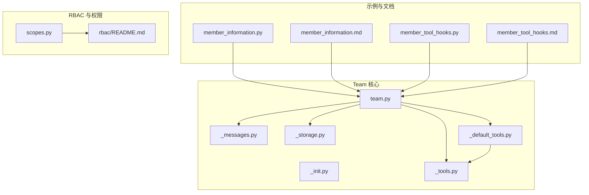
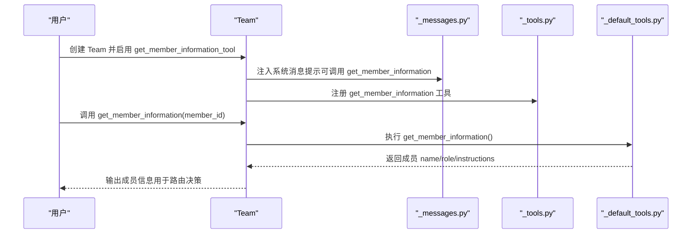
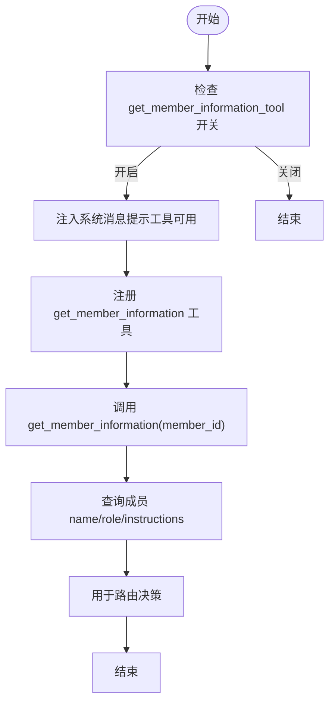
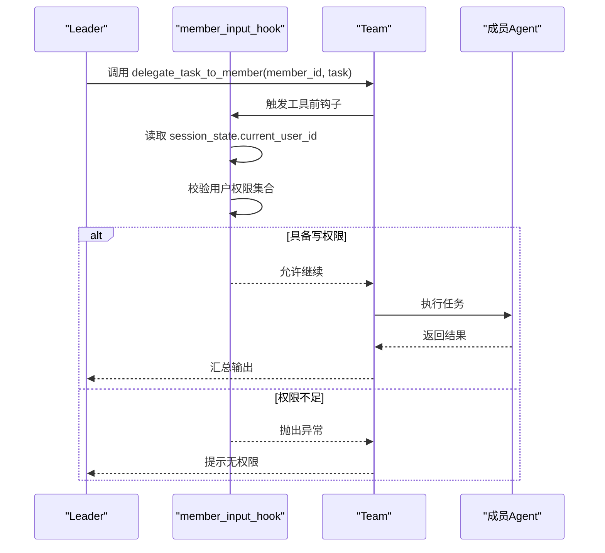
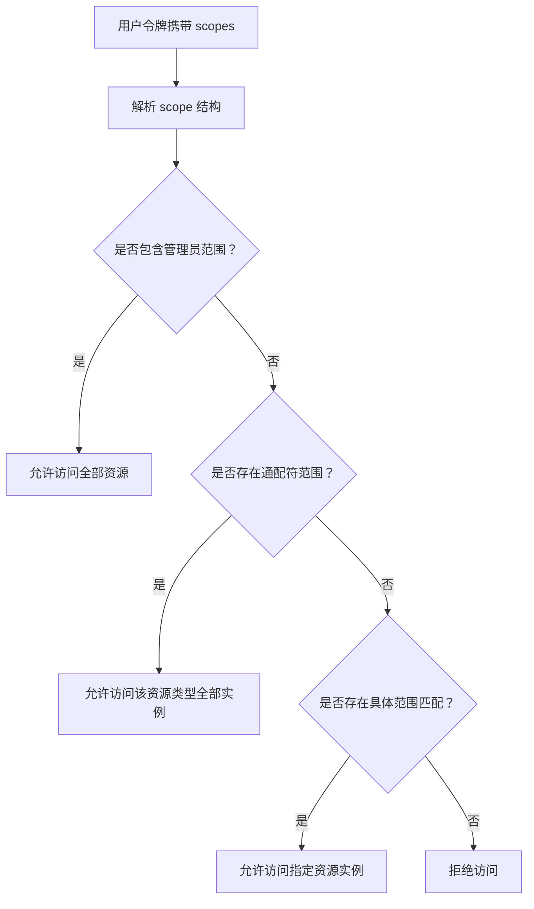
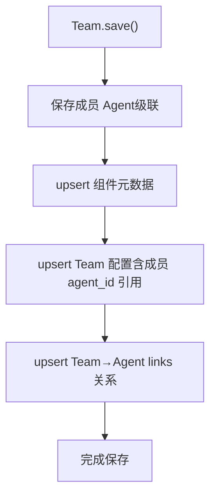
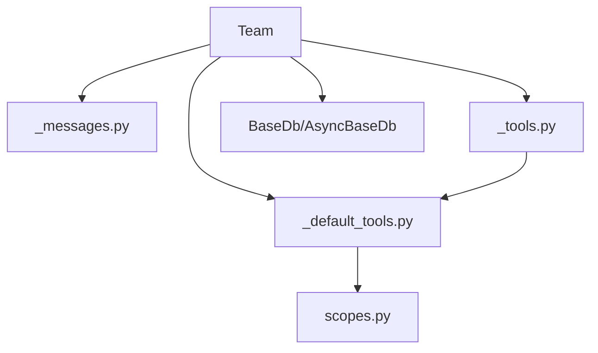

# 成员信息管理

<cite>
**本文引用的文件**
- [member_information.py](file://cookbook/03_teams/03_tools/member_information.py)
- [member_information.md](file://cookbook/03_teams/03_tools/member_information.md)
- [team.py](file://libs/agno/agno/team/team.py)
- [_default_tools.py](file://libs/agno/agno/team/_default_tools.py)
- [_init.py](file://libs/agno/agno/team/_init.py)
- [_messages.py](file://libs/agno/agno/team/_messages.py)
- [_storage.py](file://libs/agno/agno/team/_storage.py)
- [_tools.py](file://libs/agno/agno/team/_tools.py)
- [scopes.py](file://libs/agno/agno/os/scopes.py)
- [README.md](file://cookbook/05_agent_os/rbac/README.md)
- [member_tool_hooks.py](file://cookbook/03_teams/03_tools/member_tool_hooks.py)
- [member_tool_hooks.md](file://cookbook/03_teams/03_tools/member_tool_hooks.md)
- [test_callable_resources.py](file://libs/agno/tests/unit/team/test_callable_resources.py)
- [save_team.md](file://cookbook/93_components/save_team.md)
</cite>

## 目录
1. [简介](#简介)
2. [项目结构](#项目结构)
3. [核心组件](#核心组件)
4. [架构总览](#架构总览)
5. [详细组件分析](#详细组件分析)
6. [依赖分析](#依赖分析)
7. [性能考虑](#性能考虑)
8. [故障排查指南](#故障排查指南)
9. [结论](#结论)
10. [附录](#附录)

## 简介
本文件面向团队成员信息管理系统，围绕成员ID、名称、角色与权限的获取与管理展开，系统性阐述成员信息在团队协作中的作用、动态更新机制、查询与过滤方法，并给出在工具选择与任务分配中的应用示例与最佳实践。文档以代码库中的实际实现为依据，结合示例与流程图，帮助读者快速理解并落地成员信息管理。

## 项目结构
成员信息管理涉及以下关键模块与文件：
- 示例与文档：支持协调团队示例、成员信息工具说明
- Team 核心：Team 类定义、成员工具注册、系统消息注入
- 默认工具：成员信息查询工具实现
- RBAC 与权限：范围定义、访问控制与钩子
- 测试与持久化：可调用成员缓存测试、团队保存与链接

图表来源
- [member_information.py:1-60](file://cookbook/03_teams/03_tools/member_information.py#L1-L60)
- [member_information.md:1-62](file://cookbook/03_teams/03_tools/member_information.md#L1-L62)
- [team.py:1-800](file://libs/agno/agno/team/team.py#L1-L800)
- [_default_tools.py:1-800](file://libs/agno/agno/team/_default_tools.py#L1-L800)
- [_init.py:1-200](file://libs/agno/agno/team/_init.py#L1-L200)
- [_messages.py:213-214](file://libs/agno/agno/team/_messages.py#L213-L214)
- [_storage.py:559-560](file://libs/agno/agno/team/_storage.py#L559-L560)
- [_tools.py:293-294](file://libs/agno/agno/team/_tools.py#L293-L294)
- [scopes.py:1-488](file://libs/agno/agno/os/scopes.py#L1-L488)
- [README.md:1-348](file://cookbook/05_agent_os/rbac/README.md#L1-L348)

章节来源
- [member_information.py:1-60](file://cookbook/03_teams/03_tools/member_information.py#L1-L60)
- [member_information.md:1-62](file://cookbook/03_teams/03_tools/member_information.md#L1-L62)
- [team.py:1-800](file://libs/agno/agno/team/team.py#L1-L800)

## 核心组件
- Team 成员信息工具开关
  - get_member_information_tool：布尔开关，启用后在系统消息中注入“获取成员信息”工具提示，并在工具列表中添加 get_member_information 工具。
- 成员信息查询工具
  - get_member_information：在运行时按成员ID查询成员的 name、role、instructions 等信息，辅助路由决策。
- 成员工具钩子
  - member_input_hook：在工具调用前进行权限校验，防止越权委托任务。
- RBAC 范围与访问控制
  - AgentOSScope：定义系统范围、资源范围与通配符范围；提供解析、匹配与默认映射。
- 团队保存与成员链接
  - Team.save() 递归保存成员，upsert 组件与配置，并建立 Team→Agent 的链接，确保加载时成员版本一致。

章节来源
- [team.py:221-222](file://libs/agno/agno/team/team.py#L221-L222)
- [team.py:1387-1388](file://libs/agno/agno/team/team.py#L1387-L1388)
- [_tools.py:293-294](file://libs/agno/agno/team/_tools.py#L293-L294)
- [_messages.py:213-214](file://libs/agno/agno/team/_messages.py#L213-L214)
- [_storage.py:559-560](file://libs/agno/agno/team/_storage.py#L559-L560)
- [member_tool_hooks.py:62-83](file://cookbook/03_teams/03_tools/member_tool_hooks.py#L62-L83)
- [scopes.py:26-67](file://libs/agno/agno/os/scopes.py#L26-L67)
- [save_team.md:44-97](file://cookbook/93_components/save_team.md#L44-L97)

## 架构总览
成员信息管理在 Team 生命周期中的关键交互如下：

图表来源
- [_messages.py:213-214](file://libs/agno/agno/team/_messages.py#L213-L214)
- [_tools.py:293-294](file://libs/agno/agno/team/_tools.py#L293-L294)
- [_default_tools.py:1-800](file://libs/agno/agno/team/_default_tools.py#L1-L800)

## 详细组件分析

### 成员信息查询工具
- 启用方式
  - 在 Team 初始化时设置 get_member_information_tool=True，系统会自动在系统消息中提示可用工具，并在工具列表中注册 get_member_information。
- 运行时行为
  - Leader 或其他成员可在运行时调用 get_member_information(member_id)，返回成员的 name、role、instructions 等字段，用于更精准的路由与任务分配。
- 示例路径
  - 支持协调团队示例展示了如何启用工具并进行成员信息查询与任务路由。

图表来源
- [_messages.py:213-214](file://libs/agno/agno/team/_messages.py#L213-L214)
- [_tools.py:293-294](file://libs/agno/agno/team/_tools.py#L293-L294)
- [_default_tools.py:1-800](file://libs/agno/agno/team/_default_tools.py#L1-L800)

章节来源
- [team.py:221-222](file://libs/agno/agno/team/team.py#L221-L222)
- [team.py:1387-1388](file://libs/agno/agno/team/team.py#L1387-L1388)
- [_tools.py:293-294](file://libs/agno/agno/team/_tools.py#L293-L294)
- [_messages.py:213-214](file://libs/agno/agno/team/_messages.py#L213-L214)
- [member_information.py:39-49](file://cookbook/03_teams/03_tools/member_information.py#L39-L49)
- [member_information.md:20-34](file://cookbook/03_teams/03_tools/member_information.md#L20-L34)

### 成员工具钩子与权限控制
- 钩子签名与时机
  - tool_hooks 在工具调用前执行，通过 run_context.session_state 获取当前用户上下文，对 delegate_task_to_member 进行权限校验。
- 权限检查逻辑
  - 当目标成员为写操作专用成员时，若用户不具备相应权限则抛出异常，阻止越权操作。
- 示例路径
  - 医疗团队示例展示了如何在工具输入阶段进行权限拦截，保障成员能力与权限的一致性。

图表来源
- [member_tool_hooks.py:62-83](file://cookbook/03_teams/03_tools/member_tool_hooks.py#L62-L83)
- [_default_tools.py:538-675](file://libs/agno/agno/team/_default_tools.py#L538-L675)

章节来源
- [member_tool_hooks.py:1-83](file://cookbook/03_teams/03_tools/member_tool_hooks.py#L1-L83)
- [member_tool_hooks.md:1-46](file://cookbook/03_teams/03_tools/member_tool_hooks.md#L1-L46)
- [_default_tools.py:538-675](file://libs/agno/agno/team/_default_tools.py#L538-L675)

### RBAC 范围与访问控制
- 范围类型
  - 全局资源范围：如 agents:read
  - 单资源范围：如 agents:agent-1:run
  - 通配符范围：如 agents:*:run
- 访问控制层次
  - 管理员范围优先于通配符范围，再优于具体范围
- 默认映射
  - GET /agents、POST /teams/*/runs 等端点具有默认所需范围，确保资源可见性与运行权限受控。

图表来源
- [scopes.py:95-215](file://libs/agno/agno/os/scopes.py#L95-L215)
- [scopes.py:299-357](file://libs/agno/agno/os/scopes.py#L299-L357)
- [README.md:90-147](file://cookbook/05_agent_os/rbac/README.md#L90-L147)

章节来源
- [scopes.py:1-488](file://libs/agno/agno/os/scopes.py#L1-L488)
- [README.md:1-348](file://cookbook/05_agent_os/rbac/README.md#L1-L348)

### 团队保存与成员链接
- 保存流程
  - Team.save() 先保存所有成员 Agent，再 upsert Team 组件元数据与配置，并建立 Team→Agent 的 links 关系，确保加载时能正确找到成员版本。
- 版本与链接
  - 配置中仅存储成员 agent_id 引用，避免嵌套全量数据；links 记录 Team 版本→成员版本的固定关联。

图表来源
- [save_team.md:44-97](file://cookbook/93_components/save_team.md#L44-L97)

章节来源
- [save_team.md:44-97](file://cookbook/93_components/save_team.md#L44-L97)

## 依赖分析
- 组件耦合与内聚
  - Team 对成员工具的依赖通过 _tools.py 注册与 _messages.py 注入系统消息实现，内聚度高、扩展性强。
  - RBAC 与权限控制通过 scopes.py 与工具钩子协同，形成“范围定义—访问控制—运行时拦截”的闭环。
- 外部依赖与集成点
  - 数据库接口 BaseDb/AsyncBaseDb 用于会话状态与历史读取（非成员信息直接存储），但与成员信息查询工具配合良好。
  - JWT 中间件与授权配置在 AgentOS 层面启用时，GET 列表端点会自动按用户范围过滤结果。

图表来源
- [_messages.py:213-214](file://libs/agno/agno/team/_messages.py#L213-L214)
- [_tools.py:293-294](file://libs/agno/agno/team/_tools.py#L293-L294)
- [_default_tools.py:1-800](file://libs/agno/agno/team/_default_tools.py#L1-L800)
- [scopes.py:1-488](file://libs/agno/agno/os/scopes.py#L1-L488)

章节来源
- [_messages.py:213-214](file://libs/agno/agno/team/_messages.py#L213-L214)
- [_tools.py:293-294](file://libs/agno/agno/team/_tools.py#L293-L294)
- [_default_tools.py:1-800](file://libs/agno/agno/team/_default_tools.py#L1-L800)
- [scopes.py:1-488](file://libs/agno/agno/os/scopes.py#L1-L488)

## 性能考虑
- 工具调用开销
  - get_member_information 为运行时查询，建议在需要时才调用，避免频繁查询造成响应延迟。
- 缓存与工厂
  - 可利用 Team 的 callable_members_cache_key 与缓存机制减少重复解析成员列表的成本（适用于可调用工厂成员）。
- 日志与调试
  - debug_mode 与 show_members_responses 可辅助定位成员交互问题，但生产环境应谨慎开启以降低日志开销。

## 故障排查指南
- 成员信息工具不可用
  - 确认 Team 初始化时已设置 get_member_information_tool=True，且系统消息中存在工具提示。
- 成员信息查询失败
  - 检查成员ID是否正确；确认成员列表可解析且非空；查看可调用工厂成员缓存是否命中。
- 权限拦截导致委托失败
  - 检查 session_state 中的用户ID与权限集合；确认工具钩子是否正确配置；核对 RBAC 范围是否覆盖目标成员。
- 可调用成员缓存问题
  - 参考单元测试中的缓存键自定义与重复调用场景，确保缓存键与用户上下文一致。

章节来源
- [test_callable_resources.py:193-238](file://libs/agno/tests/unit/team/test_callable_resources.py#L193-L238)
- [_messages.py:213-214](file://libs/agno/agno/team/_messages.py#L213-L214)
- [_tools.py:293-294](file://libs/agno/agno/team/_tools.py#L293-L294)
- [member_tool_hooks.py:62-83](file://cookbook/03_teams/03_tools/member_tool_hooks.py#L62-L83)

## 结论
成员信息管理通过“工具开关+运行时查询+权限钩子+RBAC 范围”的组合，实现了成员ID、名称、角色与权限的动态获取与控制。它在团队协作中承担成员识别、角色分配与权限验证的关键职责，既保证了任务路由的准确性，也确保了成员能力使用的安全性。结合缓存与日志策略，可在保证性能的同时提升可观测性与可维护性。

## 附录
- 代码示例路径（不展示具体代码内容）
  - 启用成员信息工具与运行示例：[member_information.py:39-49](file://cookbook/03_teams/03_tools/member_information.py#L39-L49)
  - 成员信息查询工具实现：[_default_tools.py:1-800](file://libs/agno/agno/team/_default_tools.py#L1-L800)
  - 工具钩子与权限拦截：[member_tool_hooks.py:62-83](file://cookbook/03_teams/03_tools/member_tool_hooks.py#L62-L83)
  - RBAC 范围与默认映射：[scopes.py:1-488](file://libs/agno/agno/os/scopes.py#L1-L488)
  - 团队保存与成员链接：[save_team.md:44-97](file://cookbook/93_components/save_team.md#L44-L97)