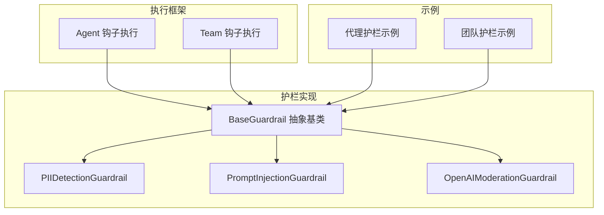
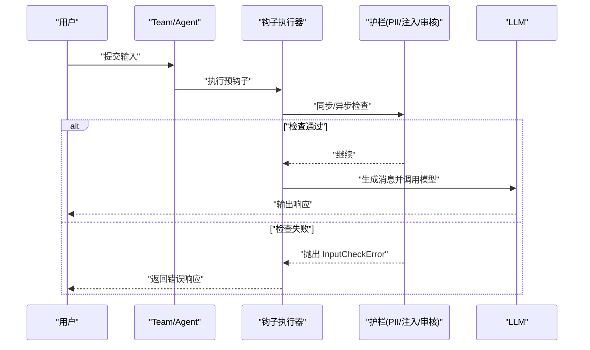
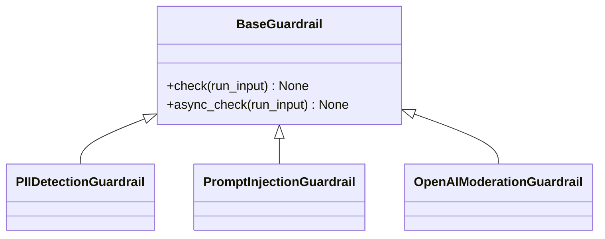
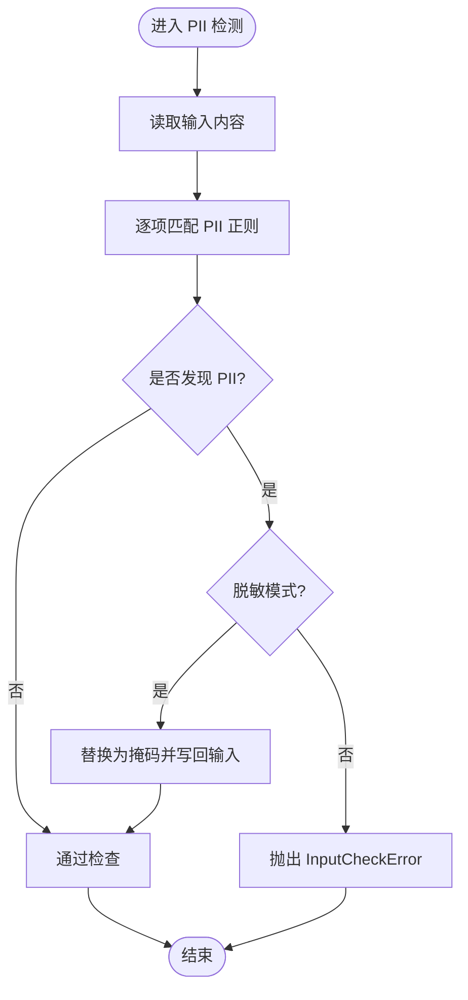
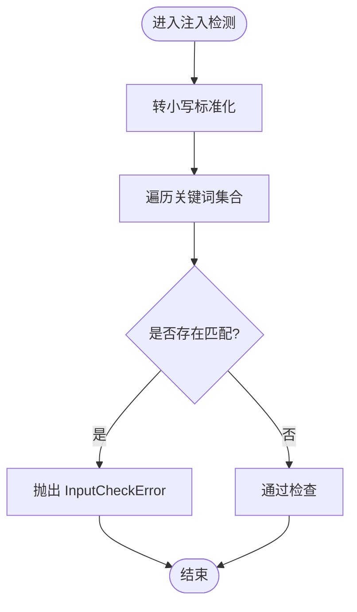
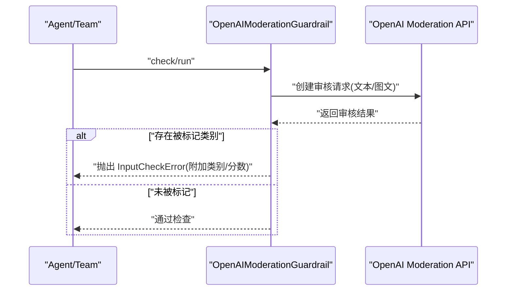
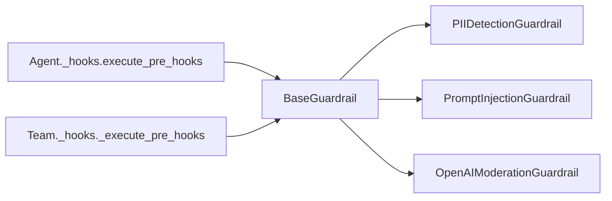

# 团队护栏

<cite>
**本文档引用的文件**
- [libs/agno/agno/guardrails/base.py](file://libs/agno/agno/guardrails/base.py)
- [libs/agno/agno/guardrails/pii.py](file://libs/agno/agno/guardrails/pii.py)
- [libs/agno/agno/guardrails/prompt_injection.py](file://libs/agno/agno/guardrails/prompt_injection.py)
- [libs/agno/agno/guardrails/openai.py](file://libs/agno/agno/guardrails/openai.py)
- [libs/agno/agno/agent/_hooks.py](file://libs/agno/agno/agent/_hooks.py)
- [libs/agno/agno/team/_hooks.py](file://libs/agno/agno/team/_hooks.py)
- [cookbook/02_agents/08_guardrails/pii_detection.py](file://cookbook/02_agents/08_guardrails/pii_detection.py)
- [cookbook/02_agents/08_guardrails/prompt_injection.py](file://cookbook/02_agents/08_guardrails/prompt_injection.py)
- [cookbook/02_agents/08_guardrails/openai_moderation.py](file://cookbook/02_agents/08_guardrails/openai_moderation.py)
- [cookbook/02_agents/08_guardrails/custom_guardrail.py](file://cookbook/02_agents/08_guardrails/custom_guardrail.py)
- [cookbook/03_teams/18_guardrails/pii_detection.py](file://cookbook/03_teams/18_guardrails/pii_detection.py)
- [cookbook/03_teams/18_guardrails/openai_moderation.py](file://cookbook/03_teams/18_guardrails/openai_moderation.py)
- [cookbook/03_teams/18_guardrails/prompt_injection.md](file://cookbook/03_teams/18_guardrails/prompt_injection.md)
- [cookbook/00_quickstart/agent_with_guardrails.py](file://cookbook/00_quickstart/agent_with_guardrails.py)
- [cookbook/02_agents/08_guardrails/pii_detection.md](file://cookbook/02_agents/08_guardrails/pii_detection.md)
- [cookbook/02_agents/08_guardrails/openai_moderation.md](file://cookbook/02_agents/08_guardrails/openai_moderation.md)
- [cookbook/02_agents/08_guardrails/custom_guardrail.md](file://cookbook/02_agents/08_guardrails/custom_guardrail.md)
- [libs/agno/tests/unit/agent/test_hooks_guardrails.py](file://libs/agno/tests/unit/agent/test_hooks_guardrails.py)
- [libs/agno/tests/unit/team/test_hooks_guardrails.py](file://libs/agno/tests/unit/team/test_hooks_guardrails.py)
- [libs/agno/tests/integration/agent/test_guardrails.py](file://libs/agno/tests/integration/agent/test_guardrails.py)
- [cookbook/01_demo/agents/scout/connectors/s3.py](file://cookbook/01_demo/agents/scout/connectors/s3.py)
</cite>

## 目录
1. [简介](#简介)
2. [项目结构](#项目结构)
3. [核心组件](#核心组件)
4. [架构总览](#架构总览)
5. [详细组件分析](#详细组件分析)
6. [依赖分析](#依赖分析)
7. [性能考虑](#性能考虑)
8. [故障排查指南](#故障排查指南)
9. [结论](#结论)
10. [附录](#附录)

## 简介
本文件面向团队护栏系统，系统性阐述团队在多智能体协作场景下的安全机制与实施方法。重点覆盖以下方面：
- 安全机制：输入验证、PII 检测、提示注入防护
- 配置方法：护栏规则定义、执行策略、响应处理
- 实施路径：代理护栏、团队护栏、安全策略集成
- 协作场景：风险控制、合规保证、安全审计
- 代码示例：OpenAI 审核集成、PII 检测配置、提示注入防护
- 最佳实践：安全策略制定、风险评估、应急响应

## 项目结构
护栏能力由“护栏抽象基类 + 具体护栏实现 + 钩子执行框架”构成，并在代理与团队层面统一接入。示例代码位于 cookbook 中，便于快速上手。

图表来源
- [libs/agno/agno/guardrails/base.py:8-19](file://libs/agno/agno/guardrails/base.py#L8-L19)
- [libs/agno/agno/guardrails/pii.py:10-95](file://libs/agno/agno/guardrails/pii.py#L10-L95)
- [libs/agno/agno/guardrails/prompt_injection.py:9-53](file://libs/agno/agno/guardrails/prompt_injection.py#L9-L53)
- [libs/agno/agno/guardrails/openai.py:12-145](file://libs/agno/agno/guardrails/openai.py#L12-L145)
- [libs/agno/agno/agent/_hooks.py:59-209](file://libs/agno/agno/agent/_hooks.py#L59-L209)
- [libs/agno/agno/team/_hooks.py:554-578](file://libs/agno/agno/team/_hooks.py#L554-L578)

章节来源
- [libs/agno/agno/guardrails/base.py:8-19](file://libs/agno/agno/guardrails/base.py#L8-L19)
- [libs/agno/agno/guardrails/pii.py:10-95](file://libs/agno/agno/guardrails/pii.py#L10-L95)
- [libs/agno/agno/guardrails/prompt_injection.py:9-53](file://libs/agno/agno/guardrails/prompt_injection.py#L9-L53)
- [libs/agno/agno/guardrails/openai.py:12-145](file://libs/agno/agno/guardrails/openai.py#L12-L145)
- [libs/agno/agno/agent/_hooks.py:59-209](file://libs/agno/agno/agent/_hooks.py#L59-L209)
- [libs/agno/agno/team/_hooks.py:554-578](file://libs/agno/agno/team/_hooks.py#L554-L578)

## 核心组件
- 护栏抽象基类：定义同步与异步检查接口，约束实现规范。
- PII 检测护栏：识别并处理 SSN、信用卡、邮箱、电话等敏感信息，支持拦截或脱敏。
- 提示注入护栏：检测越狱、角色扮演、忽略指令等注入模式，阻止危险输入。
- OpenAI 内容审核护栏：对接 OpenAI Moderation API，按类别拦截违规内容，支持文本与图片。
- 钩子执行框架：在代理与团队运行前统一执行护栏钩子，异常即刻中断，保障安全边界。

章节来源
- [libs/agno/agno/guardrails/base.py:8-19](file://libs/agno/agno/guardrails/base.py#L8-L19)
- [libs/agno/agno/guardrails/pii.py:10-95](file://libs/agno/agno/guardrails/pii.py#L10-L95)
- [libs/agno/agno/guardrails/prompt_injection.py:9-53](file://libs/agno/agno/guardrails/prompt_injection.py#L9-L53)
- [libs/agno/agno/guardrails/openai.py:12-145](file://libs/agno/agno/guardrails/openai.py#L12-L145)
- [libs/agno/agno/agent/_hooks.py:59-209](file://libs/agno/agno/agent/_hooks.py#L59-L209)
- [libs/agno/agno/team/_hooks.py:554-578](file://libs/agno/agno/team/_hooks.py#L554-L578)

## 架构总览
护栏在代理与团队生命周期的“预执行钩子”阶段介入，确保输入在进入模型前完成安全校验。下图展示典型流程：

图表来源
- [libs/agno/agno/agent/_hooks.py:59-209](file://libs/agno/agno/agent/_hooks.py#L59-L209)
- [libs/agno/agno/team/_hooks.py:554-578](file://libs/agno/agno/team/_hooks.py#L554-L578)
- [libs/agno/agno/guardrails/base.py:8-19](file://libs/agno/agno/guardrails/base.py#L8-L19)

## 详细组件分析

### 护栏抽象基类与钩子执行
- 抽象基类要求实现同步与异步检查方法，确保在同步与异步运行模式下均能正确拦截。
- 钩子执行器在首次运行时将护栏实例规范化为绑定方法；在后台模式下，护栏优先执行，非护栏钩子延后排队，避免对被拒绝输入产生副作用。

图表来源
- [libs/agno/agno/guardrails/base.py:8-19](file://libs/agno/agno/guardrails/base.py#L8-L19)
- [libs/agno/agno/guardrails/pii.py:10-95](file://libs/agno/agno/guardrails/pii.py#L10-L95)
- [libs/agno/agno/guardrails/prompt_injection.py:9-53](file://libs/agno/agno/guardrails/prompt_injection.py#L9-L53)
- [libs/agno/agno/guardrails/openai.py:12-145](file://libs/agno/agno/guardrails/openai.py#L12-L145)

章节来源
- [libs/agno/agno/guardrails/base.py:8-19](file://libs/agno/agno/guardrails/base.py#L8-L19)
- [libs/agno/agno/agent/_hooks.py:59-209](file://libs/agno/agno/agent/_hooks.py#L59-L209)
- [libs/agno/agno/team/_hooks.py:554-578](file://libs/agno/agno/team/_hooks.py#L554-L578)

### PII 检测护栏
- 功能：识别并处理多种 PII 类型（SSN、信用卡、邮箱、电话），支持拦截与脱敏两种模式。
- 拦截模式：检测到 PII 直接抛出输入检查异常，阻止后续模型调用。
- 脱敏模式：将 PII 替换为掩码后写回输入，继续执行，降低泄露风险。
- 配置要点：可启用/禁用各类检测、支持自定义正则扩展。

图表来源
- [libs/agno/agno/guardrails/pii.py:48-95](file://libs/agno/agno/guardrails/pii.py#L48-L95)
- [cookbook/02_agents/08_guardrails/pii_detection.md:75-115](file://cookbook/02_agents/08_guardrails/pii_detection.md#L75-L115)

章节来源
- [libs/agno/agno/guardrails/pii.py:10-95](file://libs/agno/agno/guardrails/pii.py#L10-L95)
- [cookbook/02_agents/08_guardrails/pii_detection.py:16-142](file://cookbook/02_agents/08_guardrails/pii_detection.py#L16-L142)
- [cookbook/02_agents/08_guardrails/pii_detection.md:75-115](file://cookbook/02_agents/08_guardrails/pii_detection.md#L75-L115)
- [libs/agno/tests/unit/agent/test_hooks_guardrails.py:529-540](file://libs/agno/tests/unit/agent/test_hooks_guardrails.py#L529-L540)

### 提示注入护栏
- 功能：检测常见提示注入关键词与模式，如“忽略先前指令”“越狱”“角色扮演”等，防止系统提示被绕过。
- 执行策略：输入中出现任一关键词即抛出异常，阻止潜在越狱行为。
- 适用场景：面向公众的客服/聊天场景，保护系统指令完整性。

图表来源
- [libs/agno/agno/guardrails/prompt_injection.py:38-53](file://libs/agno/agno/guardrails/prompt_injection.py#L38-L53)
- [cookbook/03_teams/18_guardrails/prompt_injection.md:19-52](file://cookbook/03_teams/18_guardrails/prompt_injection.md#L19-L52)

章节来源
- [libs/agno/agno/guardrails/prompt_injection.py:9-53](file://libs/agno/agno/guardrails/prompt_injection.py#L9-L53)
- [cookbook/02_agents/08_guardrails/prompt_injection.py:17-96](file://cookbook/02_agents/08_guardrails/prompt_injection.py#L17-L96)
- [cookbook/03_teams/18_guardrails/prompt_injection.md:19-52](file://cookbook/03_teams/18_guardrails/prompt_injection.md#L19-L52)

### OpenAI 内容审核护栏
- 功能：调用 OpenAI Moderation API，基于多类别（暴力、仇恨、自我伤害、非法等）判断是否拦截。
- 支持：默认拦截任一类别，也可配置仅拦截指定类别；支持文本+图片多模态输入。
- 异常：违规时抛出输入检查异常，包含类别与置信度等附加信息。

图表来源
- [libs/agno/agno/guardrails/openai.py:54-145](file://libs/agno/agno/guardrails/openai.py#L54-L145)
- [cookbook/02_agents/08_guardrails/openai_moderation.md:46-278](file://cookbook/02_agents/08_guardrails/openai_moderation.md#L46-L278)

章节来源
- [libs/agno/agno/guardrails/openai.py:12-145](file://libs/agno/agno/guardrails/openai.py#L12-L145)
- [cookbook/02_agents/08_guardrails/openai_moderation.py:21-114](file://cookbook/02_agents/08_guardrails/openai_moderation.py#L21-L114)
- [cookbook/02_agents/08_guardrails/openai_moderation.md:46-278](file://cookbook/02_agents/08_guardrails/openai_moderation.md#L46-L278)
- [libs/agno/tests/integration/agent/test_guardrails.py:557-581](file://libs/agno/tests/integration/agent/test_guardrails.py#L557-L581)

### 自定义护栏与团队护栏
- 自定义护栏：示例展示如何继承抽象基类，按业务规则拦截输入，适用于敏感话题、低质内容等场景。
- 团队护栏：将护栏作为团队预钩子，统一保护团队成员与协作输出，结合后台模式实现更稳健的执行顺序。

章节来源
- [cookbook/02_agents/08_guardrails/custom_guardrail.py:14-28](file://cookbook/02_agents/08_guardrails/custom_guardrail.py#L14-L28)
- [cookbook/00_quickstart/agent_with_guardrails.py:39-69](file://cookbook/00_quickstart/agent_with_guardrails.py#L39-L69)
- [cookbook/03_teams/18_guardrails/pii_detection.py:16-32](file://cookbook/03_teams/18_guardrails/pii_detection.py#L16-L32)
- [cookbook/03_teams/18_guardrails/openai_moderation.py:51-76](file://cookbook/03_teams/18_guardrails/openai_moderation.py#L51-L76)

## 依赖分析
护栏实现与钩子执行框架耦合度低，通过抽象基类解耦具体规则与执行时机；团队与代理共享同一套护栏接口，便于统一策略与审计。

图表来源
- [libs/agno/agno/guardrails/base.py:8-19](file://libs/agno/agno/guardrails/base.py#L8-L19)
- [libs/agno/agno/agent/_hooks.py:59-209](file://libs/agno/agno/agent/_hooks.py#L59-L209)
- [libs/agno/agno/team/_hooks.py:554-578](file://libs/agno/agno/team/_hooks.py#L554-L578)

章节来源
- [libs/agno/agno/guardrails/base.py:8-19](file://libs/agno/agno/guardrails/base.py#L8-L19)
- [libs/agno/agno/agent/_hooks.py:59-209](file://libs/agno/agno/agent/_hooks.py#L59-L209)
- [libs/agno/agno/team/_hooks.py:554-578](file://libs/agno/agno/team/_hooks.py#L554-L578)

## 性能考虑
- 护栏检查为轻量级操作，建议在同步模式下优先执行，以尽早短路高风险输入。
- 异步护栏适合外部服务调用（如 OpenAI 审核），避免阻塞主线程。
- 后台模式下，护栏优先执行，非护栏钩子延后，减少副作用开销与资源浪费。
- PII 脱敏模式在输入被替换后继续执行，避免重复扫描，提升吞吐。

## 故障排查指南
- 护栏未生效
  - 检查是否正确设置为预钩子；确认钩子已规范化为绑定方法。
  - 章节来源
    - [cookbook/02_agents/08_guardrails/custom_guardrail.md:90-101](file://cookbook/02_agents/08_guardrails/custom_guardrail.md#L90-L101)
- 护栏误报/漏报
  - 调整 PII 正则或关键词列表；在脱敏模式下验证输入是否被正确替换。
  - 章节来源
    - [libs/agno/tests/unit/agent/test_hooks_guardrails.py:529-540](file://libs/agno/tests/unit/agent/test_hooks_guardrails.py#L529-L540)
- OpenAI 审核异常
  - 确认 API 密钥与网络连通；检查 raise_for_categories 配置是否符合预期。
  - 章节来源
    - [libs/agno/tests/integration/agent/test_guardrails.py:557-581](file://libs/agno/tests/integration/agent/test_guardrails.py#L557-L581)
- 团队护栏执行顺序问题
  - 使用后台模式确保护栏优先执行，非护栏钩子延后。
  - 章节来源
    - [libs/agno/agno/team/_hooks.py:554-578](file://libs/agno/agno/team/_hooks.py#L554-L578)

## 结论
团队护栏通过“护栏抽象 + 钩子执行 + 多模态审核”的组合，实现了对输入的前置安全控制。在代理与团队层面统一接入，既能满足合规与风险控制需求，又可通过脱敏与后台模式提升可用性与性能。建议结合企业安全策略与法规要求，制定护栏规则清单与应急响应流程，持续优化检测精度与执行效率。

## 附录
- 示例参考路径
  - PII 检测护栏示例：[cookbook/02_agents/08_guardrails/pii_detection.py:16-142](file://cookbook/02_agents/08_guardrails/pii_detection.py#L16-L142)
  - 提示注入护栏示例：[cookbook/02_agents/08_guardrails/prompt_injection.py:17-96](file://cookbook/02_agents/08_guardrails/prompt_injection.py#L17-L96)
  - OpenAI 审核护栏示例：[cookbook/02_agents/08_guardrails/openai_moderation.py:21-114](file://cookbook/02_agents/08_guardrails/openai_moderation.py#L21-L114)
  - 自定义护栏示例：[cookbook/02_agents/08_guardrails/custom_guardrail.py:14-28](file://cookbook/02_agents/08_guardrails/custom_guardrail.py#L14-L28)
  - 团队护栏示例（PII）：[cookbook/03_teams/18_guardrails/pii_detection.py:16-32](file://cookbook/03_teams/18_guardrails/pii_detection.py#L16-L32)
  - 团队护栏示例（OpenAI 审核）：[cookbook/03_teams/18_guardrails/openai_moderation.py:51-76](file://cookbook/03_teams/18_guardrails/openai_moderation.py#L51-L76)
- 安全策略与合规参考
  - 企业安全与合规政策：[cookbook/01_demo/agents/scout/connectors/s3.py:320-864](file://cookbook/01_demo/agents/scout/connectors/s3.py#L320-L864)