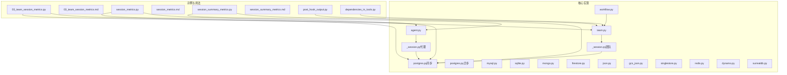
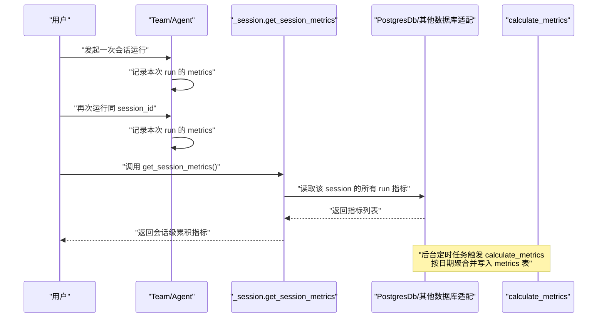
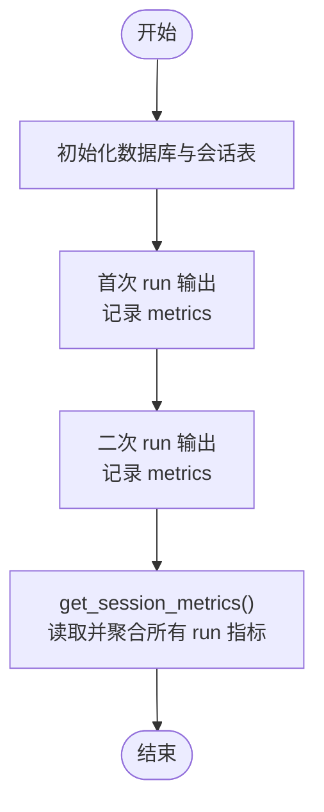
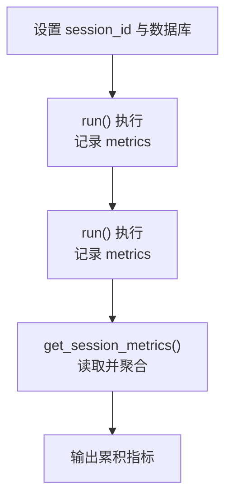
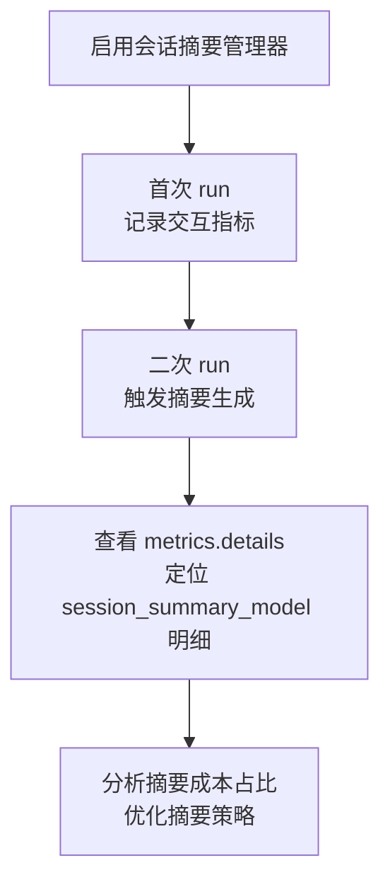
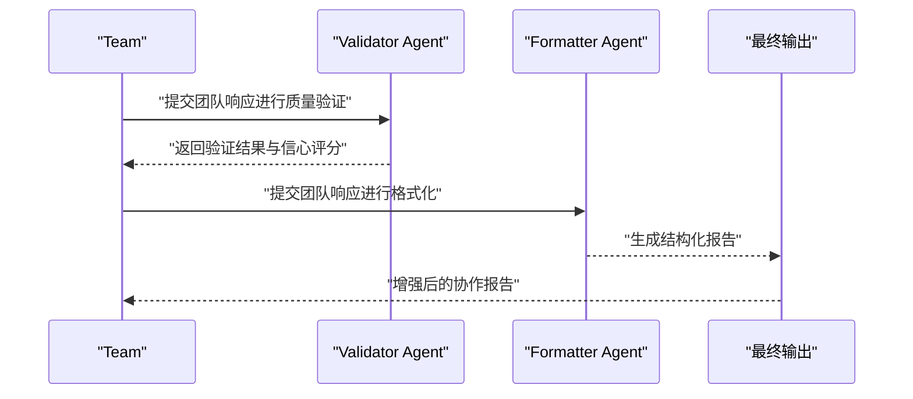
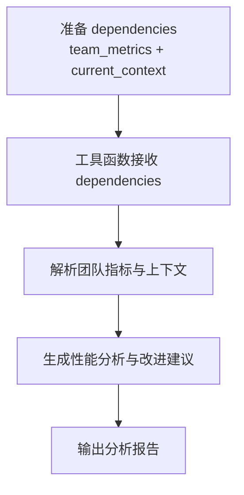
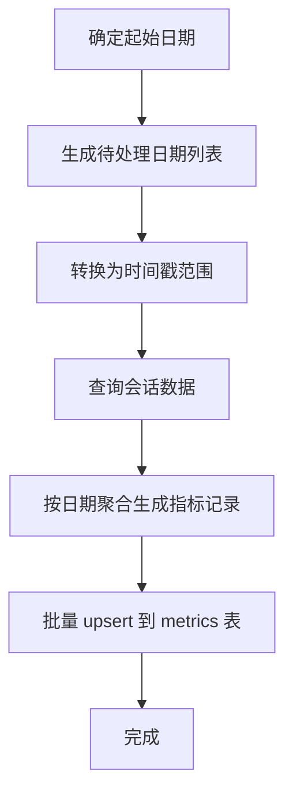
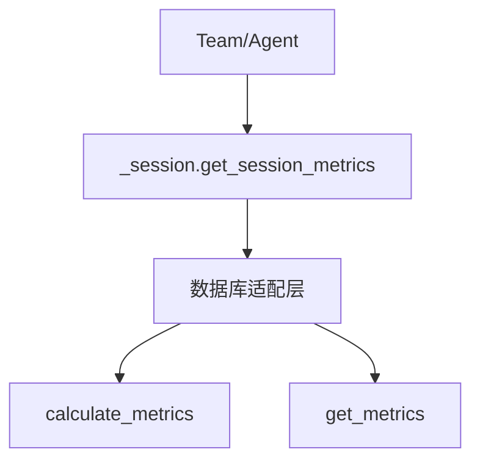

# 团队会话指标

<cite>
**本文引用的文件**
- [03_team_session_metrics.py](file://cookbook/03_teams/22_metrics/03_team_session_metrics.py)
- [03_team_session_metrics.md](file://cookbook/03_teams/22_metrics/03_team_session_metrics.md)
- [session_metrics.py](file://cookbook/02_agents/14_advanced/session_metrics.py)
- [session_metrics.md](file://cookbook/02_agents/14_advanced/session_metrics.md)
- [session_summary_metrics.py](file://cookbook/02_agents/14_advanced/session_summary_metrics.py)
- [session_summary_metrics.md](file://cookbook/02_agents/14_advanced/session_summary_metrics.md)
- [post_hook_output.py](file://cookbook/03_teams/13_hooks/post_hook_output.py)
- [dependencies_in_tools.py](file://cookbook/03_teams/17_dependencies/dependencies_in_tools.py)
- [team.py](file://libs/agno/agno/team/team.py)
- [_session.py（团队）](file://libs/agno/agno/team/_session.py)
- [agent.py](file://libs/agno/agno/agent/agent.py)
- [_session.py（代理）](file://libs/agno/agno/agent/_session.py)
- [postgres.py（同步）](file://libs/agno/agno/db/postgres/postgres.py)
- [postgres.py（异步）](file://libs/agno/agno/db/postgres/async_postgres.py)
- [mysql.py](file://libs/agno/agno/db/mysql/mysql.py)
- [sqlite.py](file://libs/agno/agno/db/sqlite/sqlite.py)
- [mongo.py](file://libs/agno/agno/db/mongo/mongo.py)
- [firestore.py](file://libs/agno/agno/db/firestore/firestore.py)
- [json.py](file://libs/agno/agno/db/json/json_db.py)
- [gcs_json.py](file://libs/agno/agno/db/gcs_json/gcs_json_db.py)
- [singlestore.py](file://libs/agno/agno/db/singlestore/singlestore.py)
- [redis.py](file://libs/agno/agno/db/redis/redis.py)
- [dynamo.py](file://libs/agno/agno/db/dynamo/dynamo.py)
- [surrealdb.py](file://libs/agno/agno/db/surrealdb/surrealdb.py)
- [workflow.py](file://libs/agno/agno/workflow/workflow.py)
- [test_session.py](file://libs/agno/tests/integration/db/postgres/test_session.py)
- [test_evals.py](file://libs/agno/tests/integration/db/postgres/test_evals.py)
</cite>

## 目录
1. [简介](#简介)
2. [项目结构](#项目结构)
3. [核心组件](#核心组件)
4. [架构总览](#架构总览)
5. [详细组件分析](#详细组件分析)
6. [依赖关系分析](#依赖关系分析)
7. [性能考量](#性能考量)
8. [故障排查指南](#故障排查指南)
9. [结论](#结论)
10. [附录](#附录)

## 简介
本文件围绕“团队会话指标”主题，系统性阐述会话管理功能在团队协作中的应用，包括会话数据采集、会话分析与会话优化。文档聚焦于以下目标：
- 会话数据采集：通过多数据库后端持久化会话与运行指标，支持跨 run 累积统计。
- 会话分析：提供会话级指标聚合、质量评估与性能分析能力。
- 会话优化：基于指标洞察进行成本控制、效率提升与协作质量改进。
- 实战示例：给出可直接参考的代码路径与流程图，帮助快速落地。

## 项目结构
围绕团队会话指标的关键文件主要分布在两个层面：
- 示例与用法：cookbook 中的“会话指标”示例脚本与说明文档，演示如何启用会话级指标、如何查看累积指标以及如何结合会话摘要与输出钩子进行质量评估。
- 核心实现：libs/agno 中的数据库适配层与会话管理模块，负责指标计算、存储与查询。

图表来源
- [03_team_session_metrics.py:1-68](file://cookbook/03_teams/22_metrics/03_team_session_metrics.py#L1-L68)
- [session_metrics.py:1-50](file://cookbook/02_agents/14_advanced/session_metrics.py#L1-L50)
- [session_summary_metrics.py:1-69](file://cookbook/02_agents/14_advanced/session_summary_metrics.py#L1-L69)
- [post_hook_output.py:58-281](file://cookbook/03_teams/13_hooks/post_hook_output.py#L58-L281)
- [dependencies_in_tools.py:46-139](file://cookbook/03_teams/17_dependencies/dependencies_in_tools.py#L46-L139)
- [team.py:1565-1566](file://libs/agno/agno/team/team.py#L1565-L1566)
- [_session.py（团队）:473-485](file://libs/agno/agno/team/_session.py#L473-L485)
- [agent.py:974-975](file://libs/agno/agno/agent/agent.py#L974-L975)
- [_session.py（代理）:544-557](file://libs/agno/agno/agent/_session.py#L544-L557)
- [postgres.py（同步）:1908-1978](file://libs/agno/agno/db/postgres/postgres.py#L1908-L1978)
- [postgres.py（异步）:1669-1737](file://libs/agno/agno/db/postgres/async_postgres.py#L1669-L1737)
- [workflow.py:6967-6977](file://libs/agno/agno/workflow/workflow.py#L6967-L6977)

章节来源
- [03_team_session_metrics.py:1-68](file://cookbook/03_teams/22_metrics/03_team_session_metrics.py#L1-L68)
- [session_metrics.py:1-50](file://cookbook/02_agents/14_advanced/session_metrics.py#L1-L50)
- [session_summary_metrics.py:1-69](file://cookbook/02_agents/14_advanced/session_summary_metrics.py#L1-L69)
- [team.py:1565-1566](file://libs/agno/agno/team/team.py#L1565-L1566)
- [agent.py:974-975](file://libs/agno/agno/agent/agent.py#L974-L975)

## 核心组件
- 会话指标采集与聚合
  - 通过数据库适配层（PostgreSQL、MySQL、SQLite、Mongo、Firestore、JSON、GCS JSON、SingleStore、Redis、Dynamo、SurrealDB 等）持久化每次 run 的指标，并在会话维度进行聚合。
  - 团队与代理均提供统一的会话指标读取接口，便于跨组件复用。
- 会话摘要与质量评估
  - 结合会话摘要管理器，区分“会话摘要模型”的 token 使用与其他模型调用，辅助成本归因与优化。
  - 通过后处理钩子对团队输出进行质量验证与格式化，形成可读性强的协作报告。
- 依赖注入与工具化分析
  - 在工具中访问 run 上下文中的依赖数据，实现“团队指标 + 当前上下文”的综合分析。

章节来源
- [03_team_session_metrics.py:1-68](file://cookbook/03_teams/22_metrics/03_team_session_metrics.py#L1-L68)
- [session_summary_metrics.py:1-69](file://cookbook/02_agents/14_advanced/session_summary_metrics.py#L1-L69)
- [post_hook_output.py:58-281](file://cookbook/03_teams/13_hooks/post_hook_output.py#L58-L281)
- [dependencies_in_tools.py:46-139](file://cookbook/03_teams/17_dependencies/dependencies_in_tools.py#L46-L139)

## 架构总览
下图展示了从“会话运行”到“指标持久化与聚合”的整体流程，以及与数据库适配层、会话管理模块的关系。

图表来源
- [team.py:1565-1566](file://libs/agno/agno/team/team.py#L1565-L1566)
- [_session.py（团队）:473-485](file://libs/agno/agno/team/_session.py#L473-L485)
- [agent.py:974-975](file://libs/agno/agno/agent/agent.py#L974-L975)
- [_session.py（代理）:544-557](file://libs/agno/agno/agent/_session.py#L544-L557)
- [postgres.py（同步）:1908-1978](file://libs/agno/agno/db/postgres/postgres.py#L1908-L1978)
- [postgres.py（异步）:1669-1737](file://libs/agno/agno/db/postgres/async_postgres.py#L1669-L1737)

## 详细组件分析

### 组件A：会话指标采集与聚合（团队）
- 功能要点
  - 同一 session_id 下多次 run 的指标会被持久化并在会话维度聚合。
  - 提供 get_session_metrics 接口，读取并汇总 token、耗时等指标。
- 关键流程
  - 初始化数据库连接与表名，确保会话指标可跨 run 持久化。
  - 多次 run 后，调用 get_session_metrics 获取累积指标。
- 代码路径
  - [03_team_session_metrics.py:1-68](file://cookbook/03_teams/22_metrics/03_team_session_metrics.py#L1-L68)
  - [team.py:1565-1566](file://libs/agno/agno/team/team.py#L1565-L1566)
  - [_session.py（团队）:473-485](file://libs/agno/agno/team/_session.py#L473-L485)

图表来源
- [03_team_session_metrics.py:47-67](file://cookbook/03_teams/22_metrics/03_team_session_metrics.py#L47-L67)
- [team.py:1565-1566](file://libs/agno/agno/team/team.py#L1565-L1566)
- [_session.py（团队）:473-485](file://libs/agno/agno/team/_session.py#L473-L485)

章节来源
- [03_team_session_metrics.py:1-68](file://cookbook/03_teams/22_metrics/03_team_session_metrics.py#L1-L68)
- [03_team_session_metrics.md:1-47](file://cookbook/03_teams/22_metrics/03_team_session_metrics.md#L1-L47)
- [team.py:1565-1566](file://libs/agno/agno/team/team.py#L1565-L1566)
- [_session.py（团队）:473-485](file://libs/agno/agno/team/_session.py#L473-L485)

### 组件B：会话指标采集与聚合（代理）
- 功能要点
  - 代理同样支持会话级指标累积，适用于个人对话场景的成本与性能分析。
- 关键流程
  - 设置 session_id 与数据库实例，多次 run 后通过 get_session_metrics 获取累积指标。
- 代码路径
  - [session_metrics.py:1-50](file://cookbook/02_agents/14_advanced/session_metrics.py#L1-L50)
  - [agent.py:974-975](file://libs/agno/agno/agent/agent.py#L974-L975)
  - [_session.py（代理）:544-557](file://libs/agno/agno/agent/_session.py#L544-L557)

图表来源
- [session_metrics.py:29-49](file://cookbook/02_agents/14_advanced/session_metrics.py#L29-L49)
- [agent.py:974-975](file://libs/agno/agno/agent/agent.py#L974-L975)
- [_session.py（代理）:544-557](file://libs/agno/agno/agent/_session.py#L544-L557)

章节来源
- [session_metrics.py:1-50](file://cookbook/02_agents/14_advanced/session_metrics.py#L1-L50)
- [session_metrics.md:1-64](file://cookbook/02_agents/14_advanced/session_metrics.md#L1-L64)
- [agent.py:974-975](file://libs/agno/agno/agent/agent.py#L974-L975)
- [_session.py（代理）:544-557](file://libs/agno/agno/agent/_session.py#L544-L557)

### 组件C：会话摘要与模型明细指标
- 功能要点
  - 启用会话摘要后，摘要模型的 token 使用被单独记录在“session_summary_model”明细中，便于区分“摘要成本”与“交互成本”。
- 关键流程
  - 配置 SessionSummaryManager 与 enable_session_summaries。
  - 观察 run metrics 的 details 字段，定位摘要模型明细。
- 代码路径
  - [session_summary_metrics.py:1-69](file://cookbook/02_agents/14_advanced/session_summary_metrics.py#L1-L69)

图表来源
- [session_summary_metrics.py:24-68](file://cookbook/02_agents/14_advanced/session_summary_metrics.py#L24-L68)

章节来源
- [session_summary_metrics.py:1-69](file://cookbook/02_agents/14_advanced/session_summary_metrics.py#L1-L69)
- [session_summary_metrics.md:1-13](file://cookbook/02_agents/14_advanced/session_summary_metrics.md#L1-L13)

### 组件D：团队输出质量评估与格式化
- 功能要点
  - 通过 post_hooks 对团队输出进行质量验证（完整性、协作度、一致性、专业性、安全性），并格式化为结构化报告。
- 关键流程
  - 定义验证 Agent 与格式化 Agent。
  - 在团队中注册 add_collaboration_summary 钩子，自动增强输出。
- 代码路径
  - [post_hook_output.py:58-281](file://cookbook/03_teams/13_hooks/post_hook_output.py#L58-L281)

图表来源
- [post_hook_output.py:58-281](file://cookbook/03_teams/13_hooks/post_hook_output.py#L58-L281)

章节来源
- [post_hook_output.py:58-281](file://cookbook/03_teams/13_hooks/post_hook_output.py#L58-L281)

### 组件E：工具化团队性能分析（依赖注入）
- 功能要点
  - 工具可通过 run_context.dependencies 访问“团队指标 + 当前上下文”，进行综合分析与建议输出。
- 关键流程
  - 在 run 时注入 dependencies（如 team_metrics、current_context）。
  - 工具函数根据传入数据生成分析报告。
- 代码路径
  - [dependencies_in_tools.py:46-139](file://cookbook/03_teams/17_dependencies/dependencies_in_tools.py#L46-L139)

图表来源
- [dependencies_in_tools.py:46-139](file://cookbook/03_teams/17_dependencies/dependencies_in_tools.py#L46-L139)

章节来源
- [dependencies_in_tools.py:46-139](file://cookbook/03_teams/17_dependencies/dependencies_in_tools.py#L46-L139)

### 组件F：数据库适配层与指标计算
- 功能要点
  - 各数据库适配层提供 calculate_metrics，按日期范围拉取会话数据并计算日指标，写入 metrics 表。
  - 支持同步与异步实现，覆盖 PostgreSQL、MySQL、SQLite、Mongo、Firestore、JSON、GCS JSON、SingleStore、Redis、Dynamo、SurrealDB 等。
- 关键流程
  - 计算起始日期（基于已有 metrics 或最早会话）。
  - 获取日期列表并转换为时间戳范围。
  - 拉取会话数据并聚合，生成指标记录，批量 upsert。
- 代码路径
  - [postgres.py（同步）:1908-1978](file://libs/agno/agno/db/postgres/postgres.py#L1908-L1978)
  - [postgres.py（异步）:1669-1737](file://libs/agno/agno/db/postgres/async_postgres.py#L1669-L1737)
  - [mysql.py:1669-1734](file://libs/agno/agno/db/mysql/mysql.py#L1669-L1734)
  - [sqlite.py:1850-1919](file://libs/agno/agno/db/sqlite/sqlite.py#L1850-L1919)
  - [mongo.py:1569-1626](file://libs/agno/agno/db/mongo/mongo.py#L1569-L1626)
  - [firestore.py:1401-1454](file://libs/agno/agno/db/firestore/firestore.py#L1401-L1454)
  - [json.py:801-867](file://libs/agno/agno/db/json/json_db.py#L801-L867)
  - [gcs_json.py:803-867](file://libs/agno/agno/db/gcs_json/gcs_json_db.py#L803-L867)
  - [singlestore.py:1708-1769](file://libs/agno/agno/db/singlestore/singlestore.py#L1708-L1769)
  - [redis.py:1116-1178](file://libs/agno/agno/db/redis/redis.py#L1116-L1178)
  - [dynamo.py:1132-1206](file://libs/agno/agno/db/dynamo/dynamo.py#L1132-L1206)
  - [surrealdb.py:1114-1177](file://libs/agno/agno/db/surrealdb/surrealdb.py#L1114-L1177)

图表来源
- [postgres.py（同步）:1908-1978](file://libs/agno/agno/db/postgres/postgres.py#L1908-L1978)
- [postgres.py（异步）:1669-1737](file://libs/agno/agno/db/postgres/async_postgres.py#L1669-L1737)

章节来源
- [postgres.py（同步）:1908-1978](file://libs/agno/agno/db/postgres/postgres.py#L1908-L1978)
- [postgres.py（异步）:1669-1737](file://libs/agno/agno/db/postgres/async_postgres.py#L1669-L1737)
- [mysql.py:1669-1734](file://libs/agno/agno/db/mysql/mysql.py#L1669-L1734)
- [sqlite.py:1850-1919](file://libs/agno/agno/db/sqlite/sqlite.py#L1850-L1919)
- [mongo.py:1569-1626](file://libs/agno/agno/db/mongo/mongo.py#L1569-L1626)
- [firestore.py:1401-1454](file://libs/agno/agno/db/firestore/firestore.py#L1401-L1454)
- [json.py:801-867](file://libs/agno/agno/db/json/json_db.py#L801-L867)
- [gcs_json.py:803-867](file://libs/agno/agno/db/gcs_json/gcs_json_db.py#L803-L867)
- [singlestore.py:1708-1769](file://libs/agno/agno/db/singlestore/singlestore.py#L1708-L1769)
- [redis.py:1116-1178](file://libs/agno/agno/db/redis/redis.py#L1116-L1178)
- [dynamo.py:1132-1206](file://libs/agno/agno/db/dynamo/dynamo.py#L1132-L1206)
- [surrealdb.py:1114-1177](file://libs/agno/agno/db/surrealdb/surrealdb.py#L1114-L1177)

## 依赖关系分析
- 组件耦合
  - Team/Agent 与 _session 模块解耦，通过统一接口 get_session_metrics 获取会话指标。
  - 数据库适配层独立，提供 calculate_metrics 与 get_metrics，支持多种存储后端。
- 外部依赖
  - PostgreSQL/MySQL/SQLite 等关系型数据库；MongoDB、Firestore 等文档数据库；Redis、Dynamo、SurrealDB 等键值/图数据库；JSON/GCS JSON 等轻量存储。
- 循环依赖
  - 未发现直接循环依赖；各模块职责清晰：会话管理负责聚合，数据库适配负责持久化与计算。

图表来源
- [team.py:1565-1566](file://libs/agno/agno/team/team.py#L1565-L1566)
- [_session.py（团队）:473-485](file://libs/agno/agno/team/_session.py#L473-L485)
- [agent.py:974-975](file://libs/agno/agno/agent/agent.py#L974-L975)
- [_session.py（代理）:544-557](file://libs/agno/agno/agent/_session.py#L544-L557)
- [postgres.py（同步）:1908-1978](file://libs/agno/agno/db/postgres/postgres.py#L1908-L1978)

章节来源
- [team.py:1565-1566](file://libs/agno/agno/team/team.py#L1565-L1566)
- [_session.py（团队）:473-485](file://libs/agno/agno/team/_session.py#L473-L485)
- [agent.py:974-975](file://libs/agno/agno/agent/agent.py#L974-L975)
- [_session.py（代理）:544-557](file://libs/agno/agno/agent/_session.py#L544-L557)

## 性能考量
- 指标计算频率
  - 建议按天或按小时触发 calculate_metrics，避免频繁全量扫描。
- 存储选择
  - 高吞吐场景优先考虑 PostgreSQL/MySQL/SingleStore；低延迟场景可选 Redis；云原生项目可选 Firestore/Dynamo。
- 会话摘要成本
  - 通过 session_summary_metrics 的明细字段识别摘要开销，合理调整摘要策略（长度、频率）。
- 查询优化
  - 在数据库侧建立合适索引（如 created_at、session_id），减少聚合查询成本。

## 故障排查指南
- 无法获取会话指标
  - 确认是否设置了 session_id，且数据库已正确初始化。
  - 参考：[team.py:1565-1566](file://libs/agno/agno/team/team.py#L1565-L1566)、[_session.py（团队）:473-485](file://libs/agno/agno/team/_session.py#L473-L485)
- 指标为空或不更新
  - 检查 calculate_metrics 是否被触发，确认日期范围与会话数据是否存在。
  - 参考：[postgres.py（同步）:1908-1978](file://libs/agno/agno/db/postgres/postgres.py#L1908-L1978)、[postgres.py（异步）:1669-1737](file://libs/agno/agno/db/postgres/async_postgres.py#L1669-L1737)
- 会话摘要明细缺失
  - 确认已启用会话摘要管理器并观察 metrics.details。
  - 参考：[session_summary_metrics.py:24-68](file://cookbook/02_agents/14_advanced/session_summary_metrics.py#L24-L68)
- 团队输出质量不达标
  - 检查 post_hooks 的验证与格式化逻辑，必要时调整验证规则或提示词。
  - 参考：[post_hook_output.py:58-281](file://cookbook/03_teams/13_hooks/post_hook_output.py#L58-L281)
- 评估数据缺失
  - 确认 dependencies 注入是否正确，工具函数能否读取 team_metrics 与 current_context。
  - 参考：[dependencies_in_tools.py:46-139](file://cookbook/03_teams/17_dependencies/dependencies_in_tools.py#L46-L139)

章节来源
- [team.py:1565-1566](file://libs/agno/agno/team/team.py#L1565-L1566)
- [_session.py（团队）:473-485](file://libs/agno/agno/team/_session.py#L473-L485)
- [postgres.py（同步）:1908-1978](file://libs/agno/agno/db/postgres/postgres.py#L1908-L1978)
- [postgres.py（异步）:1669-1737](file://libs/agno/agno/db/postgres/async_postgres.py#L1669-L1737)
- [session_summary_metrics.py:24-68](file://cookbook/02_agents/14_advanced/session_summary_metrics.py#L24-L68)
- [post_hook_output.py:58-281](file://cookbook/03_teams/13_hooks/post_hook_output.py#L58-L281)
- [dependencies_in_tools.py:46-139](file://cookbook/03_teams/17_dependencies/dependencies_in_tools.py#L46-L139)

## 结论
团队会话指标体系通过“会话数据采集—指标聚合—质量评估—工具化分析”的闭环，为团队协作提供了可观测性与可优化点。结合多数据库适配层与统一的会话接口，可在不同场景下灵活落地。建议：
- 明确会话边界与 session_id 设计，确保指标可追溯。
- 启用会话摘要并关注明细成本，平衡质量与成本。
- 引入后处理钩子与工具化分析，持续提升协作质量与效率。
- 定期运行 calculate_metrics，保持指标新鲜度与准确性。

## 附录
- 典型使用场景
  - 成本追踪：按会话统计 token 消耗，用于账单核算与预算控制。
  - 性能分析：识别高 token/长耗时会话，定位优化点。
  - 协作质量：通过输出验证与格式化，形成可读性强的协作报告。
- 相关测试参考
  - [test_session.py:721-754](file://libs/agno/tests/integration/db/postgres/test_session.py#L721-L754)
  - [test_evals.py:48-70](file://libs/agno/tests/integration/db/postgres/test_evals.py#L48-L70)