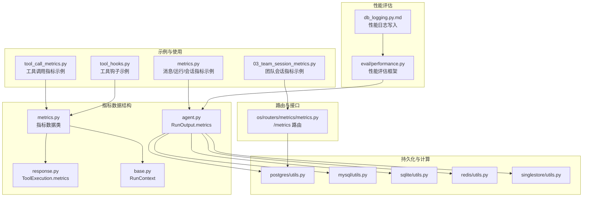
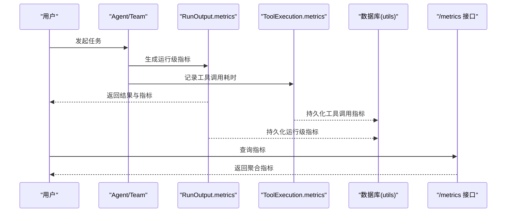
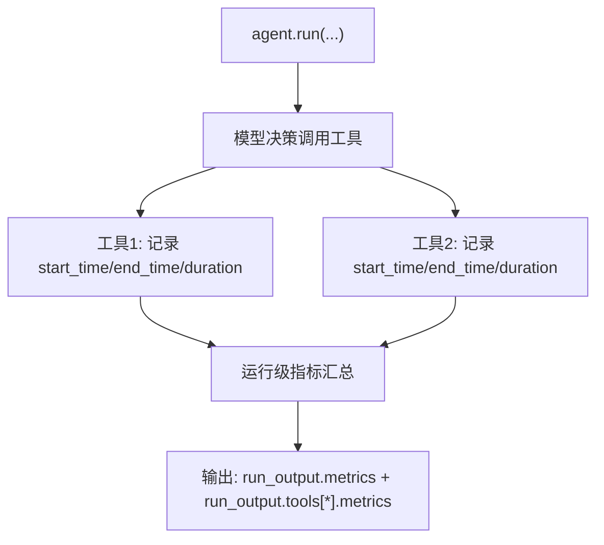
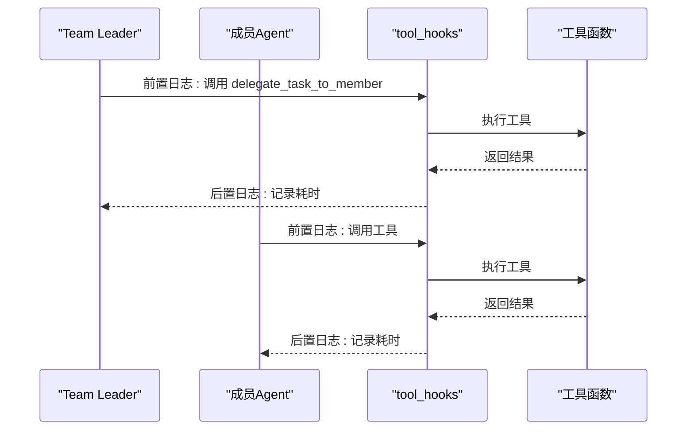
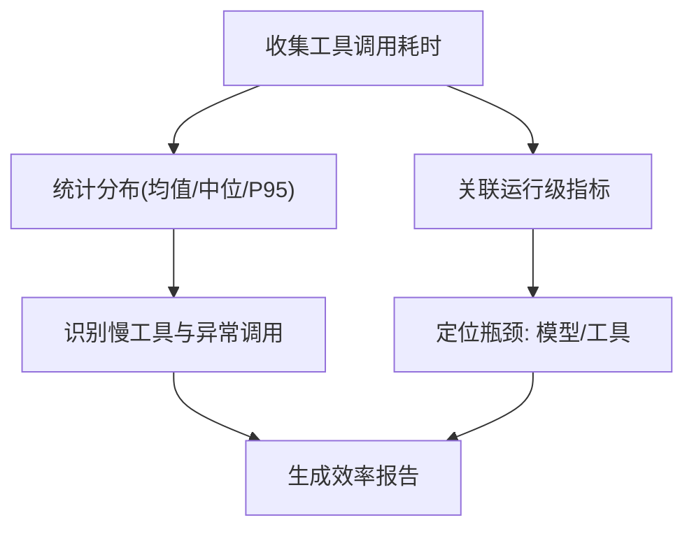
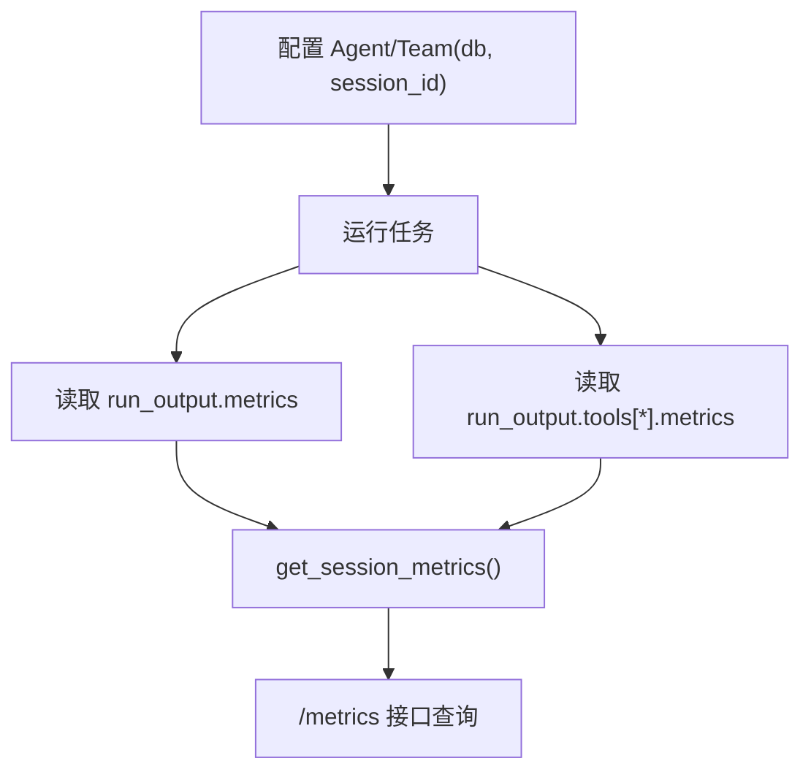
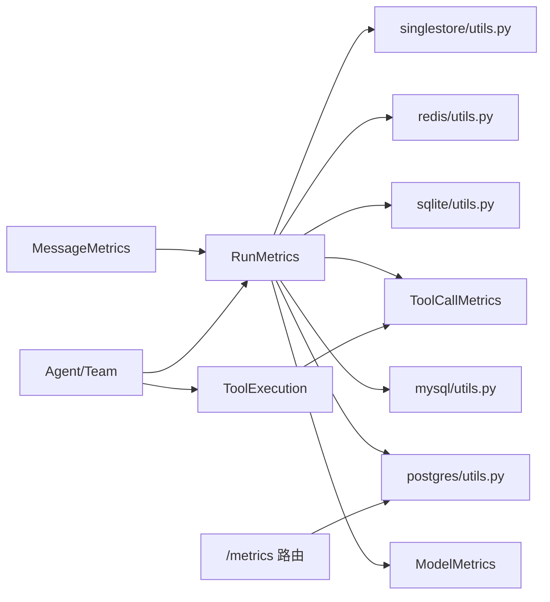

# 团队工具指标

<cite>
**本文引用的文件**
- [tool_call_metrics.py](file://cookbook/02_agents/14_advanced/tool_call_metrics.py)
- [tool_call_metrics.md](file://cookbook/02_agents/14_advanced/tool_call_metrics.md)
- [metrics.py](file://cookbook/02_agents/14_advanced/metrics.py)
- [metrics.md](file://cookbook/02_agents/14_advanced/metrics.md)
- [03_team_session_metrics.md](file://cookbook/03_teams/22_metrics/03_team_session_metrics.md)
- [03_team_session_metrics.py](file://cookbook/03_teams/22_metrics/03_team_session_metrics.py)
- [01_team_metrics.md](file://cookbook/03_teams/22_metrics/01_team_metrics.md)
- [tool_hooks.md](file://cookbook/03_teams/03_tools/tool_hooks.md)
- [tool_hooks.py](file://cookbook/03_teams/03_tools/tool_hooks.py)
- [test_tool_hooks.py](file://libs/agno/tests/integration/agent/test_tool_hooks.py)
- [metrics.py](file://libs/agno/agno/metrics.py)
- [response.py](file://libs/agno/agno/models/response.py)
- [base.py](file://libs/agno/agno/run/base.py)
- [agent.py](file://libs/agno/agno/run/agent.py)
- [metrics.py](file://libs/agno/agno/os/routers/metrics/metrics.py)
- [performance.py](file://libs/agno/agno/eval/performance.py)
- [db_logging.py.md](file://cookbook/09_evals/performance/db_logging.py.md)
- [postgres/utils.py](file://libs/agno/agno/db/postgres/utils.py)
- [mysql/utils.py](file://libs/agno/agno/db/mysql/utils.py)
- [sqlite/utils.py](file://libs/agno/agno/db/sqlite/utils.py)
- [redis/utils.py](file://libs/agno/agno/db/redis/utils.py)
- [singlestore/utils.py](file://libs/agno/agno/db/singlestore/utils.py)
- [test_metrics_routes.py](file://libs/agno/tests/system/tests/test_metrics_routes.py)
</cite>

## 目录
1. [简介](#简介)
2. [项目结构](#项目结构)
3. [核心组件](#核心组件)
4. [架构总览](#架构总览)
5. [详细组件分析](#详细组件分析)
6. [依赖分析](#依赖分析)
7. [性能考量](#性能考量)
8. [故障排查指南](#故障排查指南)
9. [结论](#结论)
10. [附录](#附录)

## 简介
本文件系统性阐述“团队工具指标”的使用监控能力，覆盖工具调用统计、工具性能分析与工具效率评估三大维度。文档从指标数据结构、采集与存储、可视化与报告、到团队协作中的应用价值与优化建议，提供从入门到进阶的完整指南。读者将学会如何配置与使用工具指标，如何基于指标进行效率评估与优化，并掌握在团队协作中提升工具使用效率与质量的方法。

## 项目结构
围绕“团队工具指标”，仓库中与之直接相关的内容主要分布在以下区域：
- 指标数据结构与采集：metrics.py、response.py、run/base.py、run/agent.py
- 工具调用与性能指标示例：cookbook/02_agents/14_advanced 下的 metrics 与 tool_call_metrics 示例
- 团队会话级指标与路由接口：cookbook/03_teams/22_metrics 与 os/routers/metrics/metrics.py
- 工具钩子与可观测性：cookbook/03_teams/03_tools/tool_hooks.* 与 tests/integration/agent/test_tool_hooks.py
- 指标持久化与计算：各数据库 utils.py（postgres/mysql/sqlite/redis/singlestore）
- 性能评估与日志：agno/eval/performance.py 与 cookbook/09_evals/performance/db_logging.py.md

**图表来源**
- [tool_call_metrics.py:1-55](file://cookbook/02_agents/14_advanced/tool_call_metrics.py#L1-L55)
- [metrics.py:1-67](file://cookbook/02_agents/14_advanced/metrics.py#L1-L67)
- [03_team_session_metrics.py](file://cookbook/03_teams/22_metrics/03_team_session_metrics.py)
- [tool_hooks.py](file://cookbook/03_teams/03_tools/tool_hooks.py)
- [metrics.py:1-800](file://libs/agno/agno/metrics.py#L1-L800)
- [response.py:1-200](file://libs/agno/agno/models/response.py#L1-L200)
- [base.py:1-200](file://libs/agno/agno/run/base.py#L1-L200)
- [agent.py:1-200](file://libs/agno/agno/run/agent.py#L1-L200)
- [postgres/utils.py:272-310](file://libs/agno/agno/db/postgres/utils.py#L272-L310)
- [mysql/utils.py:235-273](file://libs/agno/agno/db/mysql/utils.py#L235-L273)
- [sqlite/utils.py:246-288](file://libs/agno/agno/db/sqlite/utils.py#L246-L288)
- [redis/utils.py:182-220](file://libs/agno/agno/db/redis/utils.py#L182-L220)
- [singlestore/utils.py:210-248](file://libs/agno/agno/db/singlestore/utils.py#L210-L248)
- [metrics.py:43-71](file://libs/agno/agno/os/routers/metrics/metrics.py#L43-L71)
- [performance.py:176-779](file://libs/agno/agno/eval/performance.py#L176-L779)
- [db_logging.py.md:1-64](file://cookbook/09_evals/performance/db_logging.py.md#L1-L64)

**章节来源**
- [tool_call_metrics.py:1-55](file://cookbook/02_agents/14_advanced/tool_call_metrics.py#L1-L55)
- [metrics.py:1-67](file://cookbook/02_agents/14_advanced/metrics.py#L1-L67)
- [03_team_session_metrics.py](file://cookbook/03_teams/22_metrics/03_team_session_metrics.py)
- [tool_hooks.py](file://cookbook/03_teams/03_tools/tool_hooks.py)
- [metrics.py:1-800](file://libs/agno/agno/metrics.py#L1-L800)
- [response.py:1-200](file://libs/agno/agno/models/response.py#L1-L200)
- [base.py:1-200](file://libs/agno/agno/run/base.py#L1-L200)
- [agent.py:1-200](file://libs/agno/agno/run/agent.py#L1-L200)
- [postgres/utils.py:272-310](file://libs/agno/agno/db/postgres/utils.py#L272-L310)
- [mysql/utils.py:235-273](file://libs/agno/agno/db/mysql/utils.py#L235-L273)
- [sqlite/utils.py:246-288](file://libs/agno/agno/db/sqlite/utils.py#L246-L288)
- [redis/utils.py:182-220](file://libs/agno/agno/db/redis/utils.py#L182-L220)
- [singlestore/utils.py:210-248](file://libs/agno/agno/db/singlestore/utils.py#L210-L248)
- [metrics.py:43-71](file://libs/agno/agno/os/routers/metrics/metrics.py#L43-L71)
- [performance.py:176-779](file://libs/agno/agno/eval/performance.py#L176-L779)
- [db_logging.py.md:1-64](file://cookbook/09_evals/performance/db_logging.py.md#L1-L64)

## 核心组件
- 指标数据结构
  - 运行级指标 RunMetrics：包含总耗时、首 token 时间、分模型明细 details 等
  - 消息级指标 MessageMetrics：包含消息粒度的 token 与耗时
  - 工具调用指标 ToolCallMetrics：包含工具执行的起止时间与耗时
  - 会话级指标 SessionMetrics：跨 run 的累计 token 与成本等
- 工具调用与性能
  - 工具调用对象 ToolExecution：携带 metrics 字段，记录每次工具执行的耗时
  - 工具钩子 tool_hooks：在工具调用前后注入日志与耗时统计，支持多层钩子
- 指标采集与持久化
  - 通过 Agent/Team 的 run 输出获取指标
  - 通过数据库 utils 计算并落库，支持多数据库适配
  - 提供 /metrics 接口查询聚合指标
- 性能评估
  - 性能评估框架 PerformanceEval：支持运行时长与内存占用统计
  - 性能日志写入：将评估结果持久化到数据库

**章节来源**
- [metrics.py:10-800](file://libs/agno/agno/metrics.py#L10-L800)
- [response.py:26-108](file://libs/agno/agno/models/response.py#L26-L108)
- [tool_call_metrics.py:1-55](file://cookbook/02_agents/14_advanced/tool_call_metrics.py#L1-L55)
- [tool_hooks.py](file://cookbook/03_teams/03_tools/tool_hooks.py)
- [postgres/utils.py:272-310](file://libs/agno/agno/db/postgres/utils.py#L272-L310)
- [metrics.py:43-71](file://libs/agno/agno/os/routers/metrics/metrics.py#L43-L71)
- [performance.py:176-779](file://libs/agno/agno/eval/performance.py#L176-L779)
- [db_logging.py.md:1-64](file://cookbook/09_evals/performance/db_logging.py.md#L1-L64)

## 架构总览
下图展示了从“工具调用”到“指标采集、存储与查询”的整体流程，以及团队协作中的指标应用路径。

**图表来源**
- [agent.py:1-200](file://libs/agno/agno/run/agent.py#L1-L200)
- [response.py:26-108](file://libs/agno/agno/models/response.py#L26-L108)
- [postgres/utils.py:272-310](file://libs/agno/agno/db/postgres/utils.py#L272-L310)
- [metrics.py:43-71](file://libs/agno/agno/os/routers/metrics/metrics.py#L43-L71)

## 详细组件分析

### 工具调用统计与性能分析
- 工具调用指标字段
  - 工具名称、开始/结束时间、耗时
  - 可与运行级与模型级指标联动，形成完整的调用链路分析
- 示例与使用
  - 示例脚本演示如何打印运行级、工具级与模型级指标
  - 工具钩子在工具调用前后记录耗时，便于定位慢工具

**图表来源**
- [tool_call_metrics.py:1-55](file://cookbook/02_agents/14_advanced/tool_call_metrics.py#L1-L55)
- [tool_call_metrics.md:1-71](file://cookbook/02_agents/14_advanced/tool_call_metrics.md#L1-L71)
- [response.py:26-108](file://libs/agno/agno/models/response.py#L26-L108)

**章节来源**
- [tool_call_metrics.py:1-55](file://cookbook/02_agents/14_advanced/tool_call_metrics.py#L1-L55)
- [tool_call_metrics.md:1-71](file://cookbook/02_agents/14_advanced/tool_call_metrics.md#L1-L71)
- [response.py:26-108](file://libs/agno/agno/models/response.py#L26-L108)

### 工具性能监控与工具钩子
- 工具钩子的作用
  - 在工具调用前记录参数，在调用后记录耗时，形成端到端可观测性
  - 支持在 Agent 级与 Team Leader 级分别注册钩子，实现多层监控
- 测试验证
  - 单测验证钩子在工具调用前后的日志输出与拦截行为

**图表来源**
- [tool_hooks.md:1-43](file://cookbook/03_teams/03_tools/tool_hooks.md#L1-L43)
- [tool_hooks.py](file://cookbook/03_teams/03_tools/tool_hooks.py)
- [test_tool_hooks.py:1-131](file://libs/agno/tests/integration/agent/test_tool_hooks.py#L1-L131)

**章节来源**
- [tool_hooks.md:1-43](file://cookbook/03_teams/03_tools/tool_hooks.md#L1-L43)
- [tool_hooks.py](file://cookbook/03_teams/03_tools/tool_hooks.py)
- [test_tool_hooks.py:1-131](file://libs/agno/tests/integration/agent/test_tool_hooks.py#L1-L131)

### 工具效率评估与报告
- 效率评估维度
  - 工具调用耗时分布、平均/中位/尾部延迟
  - 工具调用频率与成功率
  - 与运行级指标结合，定位“模型推理慢”还是“工具执行慢”
- 报告建议
  - 按工具维度输出耗时统计与异常告警
  - 按会话维度输出累计 token 与成本，辅助成本控制

[本图为概念性流程，无需图表来源]

**章节来源**
- [tool_call_metrics.py:1-55](file://cookbook/02_agents/14_advanced/tool_call_metrics.py#L1-L55)
- [metrics.py:277-440](file://libs/agno/agno/metrics.py#L277-L440)

### 指标配置与使用
- 配置要点
  - 为 Agent/Team 指定 db，启用指标持久化
  - 通过 session_id 跨 run 累计指标，便于会话级分析
  - 使用 tool_hooks 记录工具调用耗时
- 使用步骤
  - 运行任务后读取 run_output.metrics 与 run_output.tools[*].metrics
  - 调用 get_session_metrics 获取会话级累计指标
  - 通过 /metrics 接口查询聚合指标

**图表来源**
- [metrics.py:1-67](file://cookbook/02_agents/14_advanced/metrics.py#L1-L67)
- [03_team_session_metrics.py](file://cookbook/03_teams/22_metrics/03_team_session_metrics.py)
- [metrics.py:43-71](file://libs/agno/agno/os/routers/metrics/metrics.py#L43-L71)

**章节来源**
- [metrics.py:1-67](file://cookbook/02_agents/14_advanced/metrics.py#L1-L67)
- [03_team_session_metrics.py](file://cookbook/03_teams/22_metrics/03_team_session_metrics.py)
- [metrics.py:43-71](file://libs/agno/agno/os/routers/metrics/metrics.py#L43-L71)

### 指标在团队协作中的意义
- 工具使用效率
  - 通过工具调用耗时与成功率，识别低效工具与重复调用
- 工具性能优化
  - 定位慢工具，推动异步化、缓存与并发优化
- 工具选择指导
  - 基于耗时与成本的综合评估，指导工具选型与组合

[本节为概念性总结，无需章节来源]

## 依赖分析
- 指标数据结构依赖
  - RunMetrics 依赖 ModelMetrics、MessageMetrics、ToolCallMetrics
  - ToolExecution 依赖 ToolCallMetrics
- 运行时依赖
  - RunOutput.metrics 由运行过程累积
  - ToolExecution.metrics 由工具执行过程记录
- 存储与查询依赖
  - 各数据库 utils 负责指标计算与落库
  - /metrics 路由负责指标查询与刷新

**图表来源**
- [metrics.py:10-800](file://libs/agno/agno/metrics.py#L10-L800)
- [response.py:26-108](file://libs/agno/agno/models/response.py#L26-L108)
- [agent.py:1-200](file://libs/agno/agno/run/agent.py#L1-L200)
- [postgres/utils.py:272-310](file://libs/agno/agno/db/postgres/utils.py#L272-L310)
- [mysql/utils.py:235-273](file://libs/agno/agno/db/mysql/utils.py#L235-L273)
- [sqlite/utils.py:246-288](file://libs/agno/agno/db/sqlite/utils.py#L246-L288)
- [redis/utils.py:182-220](file://libs/agno/agno/db/redis/utils.py#L182-L220)
- [singlestore/utils.py:210-248](file://libs/agno/agno/db/singlestore/utils.py#L210-L248)
- [metrics.py:43-71](file://libs/agno/agno/os/routers/metrics/metrics.py#L43-L71)

**章节来源**
- [metrics.py:10-800](file://libs/agno/agno/metrics.py#L10-L800)
- [response.py:26-108](file://libs/agno/agno/models/response.py#L26-L108)
- [agent.py:1-200](file://libs/agno/agno/run/agent.py#L1-L200)
- [postgres/utils.py:272-310](file://libs/agno/agno/db/postgres/utils.py#L272-L310)
- [mysql/utils.py:235-273](file://libs/agno/agno/db/mysql/utils.py#L235-L273)
- [sqlite/utils.py:246-288](file://libs/agno/agno/db/sqlite/utils.py#L246-L288)
- [redis/utils.py:182-220](file://libs/agno/agno/db/redis/utils.py#L182-L220)
- [singlestore/utils.py:210-248](file://libs/agno/agno/db/singlestore/utils.py#L210-L248)
- [metrics.py:43-71](file://libs/agno/agno/os/routers/metrics/metrics.py#L43-L71)

## 性能考量
- 指标采集开销
  - 工具钩子与计时器会引入少量开销，建议在生产环境按需开启
- 存储与查询
  - 大规模指标写入建议异步落库，避免阻塞主线程
  - 查询接口应支持分页与过滤，降低响应延迟
- 性能评估
  - 使用 PerformanceEval 进行基准测试，关注预热与迭代次数对结果的影响
  - 性能日志写入建议与评估框架解耦，便于灵活扩展

[本节为通用建议，无需章节来源]

## 故障排查指南
- 指标缺失
  - 检查 Agent/Team 是否正确配置 db 与 session_id
  - 确认运行输出中 metrics 字段是否存在
- 工具钩子无效
  - 确认钩子注册顺序与生效范围
  - 查看日志中钩子的前后置输出
- 指标查询异常
  - 检查 /metrics 路由返回的数据结构与字段
  - 确认数据库连接与权限

**章节来源**
- [test_tool_hooks.py:1-131](file://libs/agno/tests/integration/agent/test_tool_hooks.py#L1-L131)
- [test_metrics_routes.py:92-223](file://libs/agno/tests/system/tests/test_metrics_routes.py#L92-L223)

## 结论
通过工具调用统计、工具性能监控与工具效率评估，团队可以建立完善的工具使用观测体系。结合会话级指标与多数据库持久化方案，既能满足日常效率优化，也能支撑长期的成本与质量治理。建议在实践中逐步完善指标体系，持续迭代工具选择与使用策略。

## 附录
- 快速上手清单
  - 为 Agent/Team 配置 db 与 session_id
  - 开启工具钩子记录工具调用耗时
  - 使用 run_output.metrics 与 run_output.tools[*].metrics 分析效率
  - 通过 /metrics 接口与 get_session_metrics() 获取聚合指标
- 参考示例
  - 工具调用指标示例：[tool_call_metrics.py:1-55](file://cookbook/02_agents/14_advanced/tool_call_metrics.py#L1-L55)
  - 消息/运行/会话指标示例：[metrics.py:1-67](file://cookbook/02_agents/14_advanced/metrics.py#L1-L67)
  - 团队会话指标示例：[03_team_session_metrics.py](file://cookbook/03_teams/22_metrics/03_team_session_metrics.py)
  - 工具钩子示例：[tool_hooks.py](file://cookbook/03_teams/03_tools/tool_hooks.py)
  - 指标路由接口：[/metrics:43-71](file://libs/agno/agno/os/routers/metrics/metrics.py#L43-L71)
  - 性能评估框架：[performance.py:176-779](file://libs/agno/agno/eval/performance.py#L176-L779)
  - 性能日志写入：[db_logging.py.md:1-64](file://cookbook/09_evals/performance/db_logging.py.md#L1-L64)