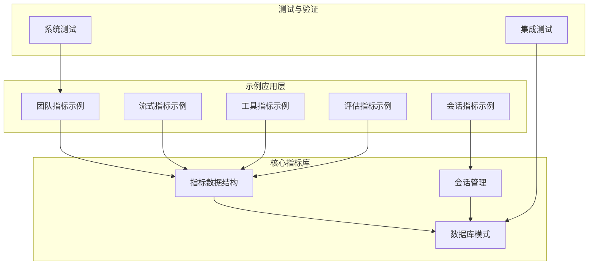
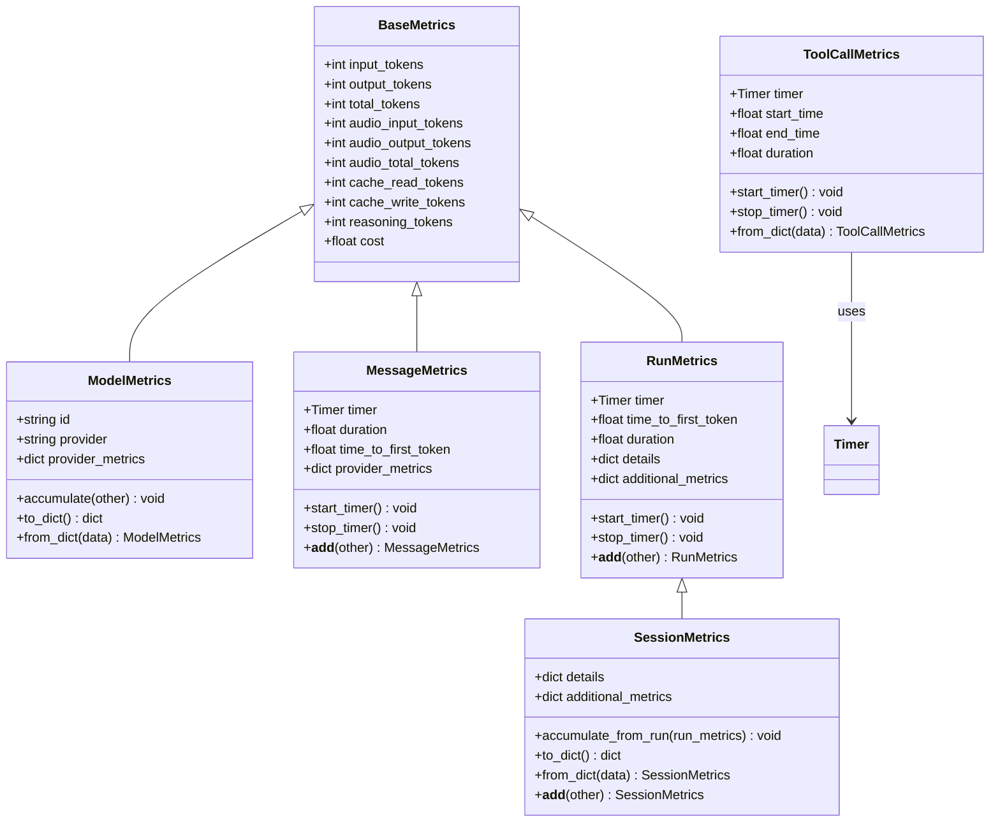
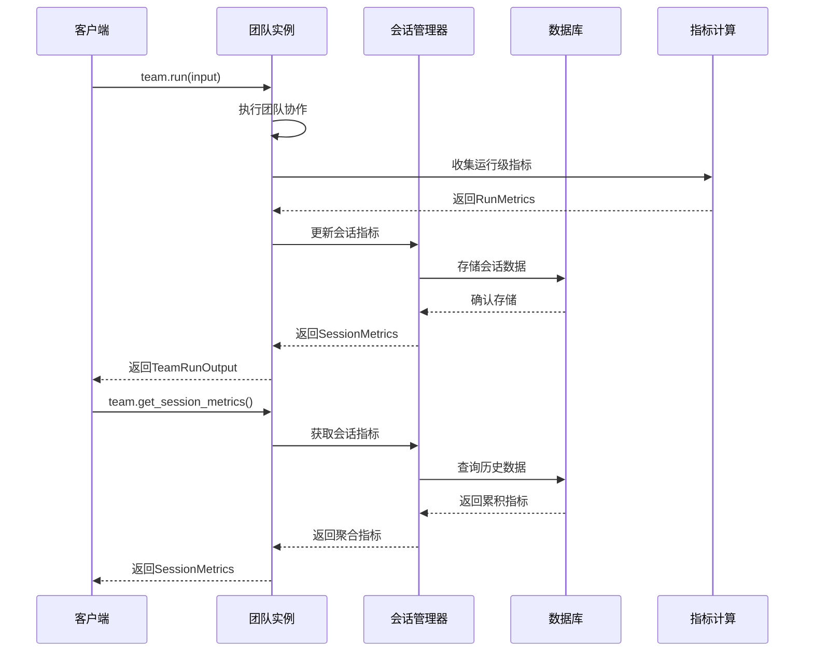
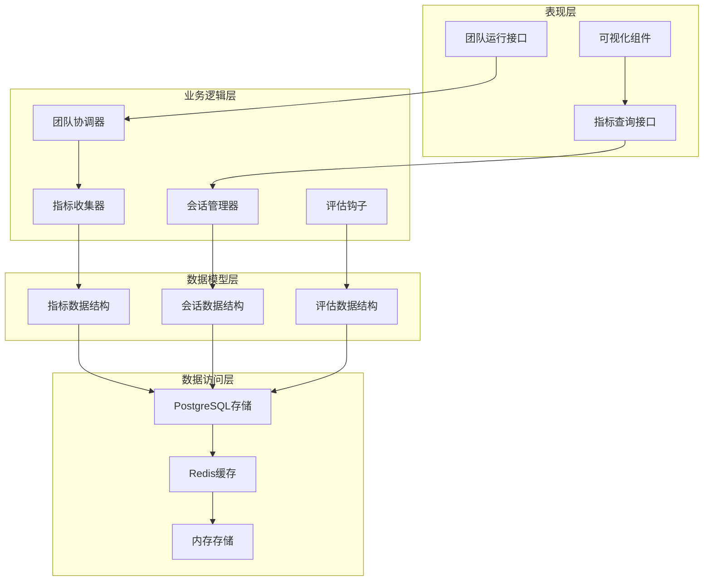
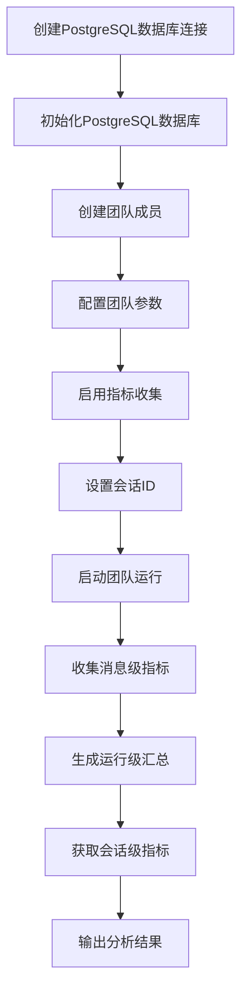
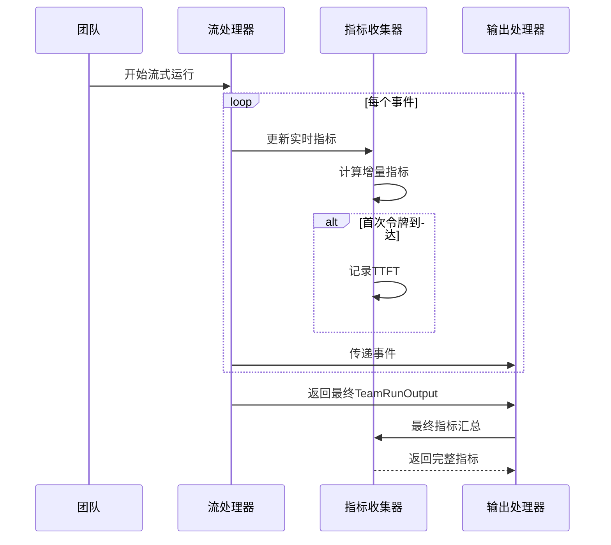
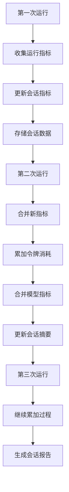
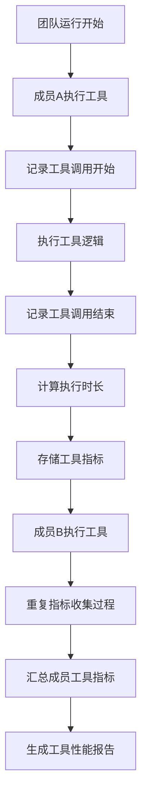
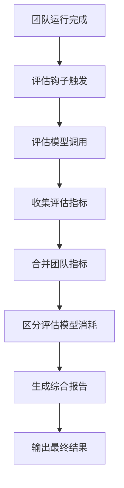
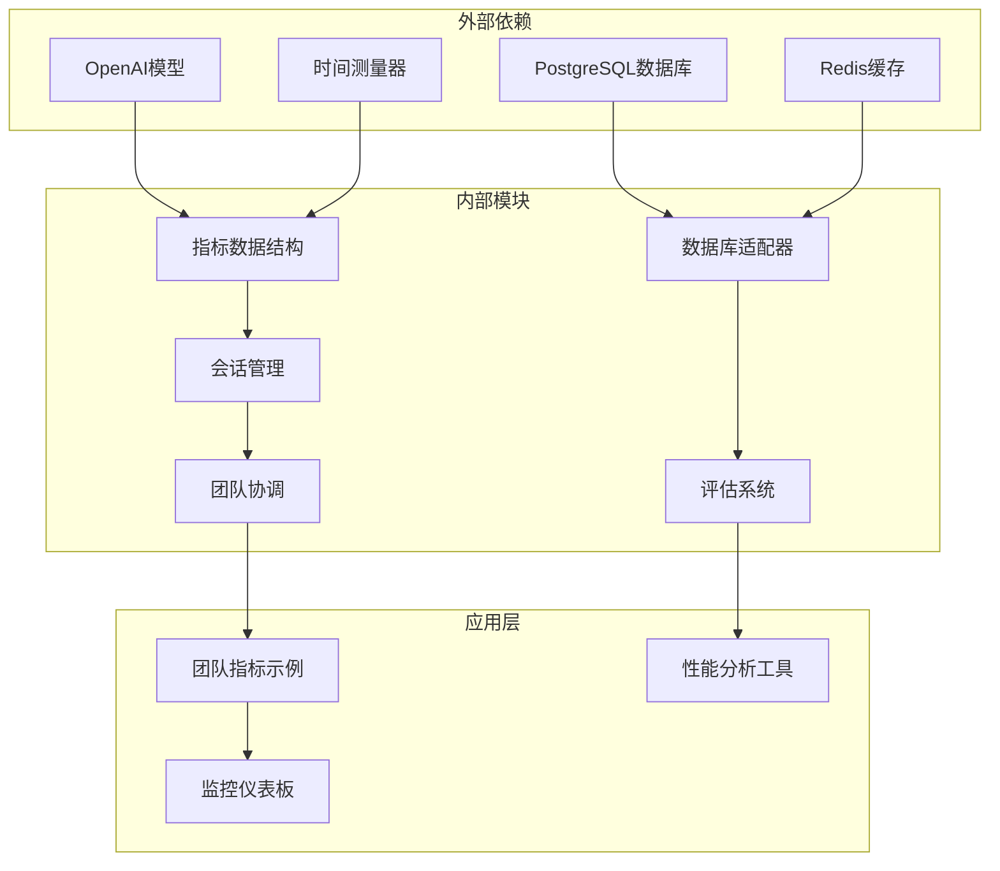

# 团队指标基础

<cite>
**本文档引用的文件**
- [01_team_metrics.py](file://cookbook/03_teams/22_metrics/01_team_metrics.py)
- [02_team_streaming_metrics.py](file://cookbook/03_teams/22_metrics/02_team_streaming_metrics.py)
- [03_team_session_metrics.py](file://cookbook/03_teams/22_metrics/03_team_session_metrics.py)
- [04_team_tool_metrics.md](file://cookbook/03_teams/22_metrics/04_team_tool_metrics.md)
- [05_team_eval_metrics.py](file://cookbook/03_teams/22_metrics/05_team_eval_metrics.py)
- [metrics.py](file://libs/agno/agno/metrics.py)
- [_session.py](file://libs/agno/agno/team/_session.py)
- [schemas.py](file://libs/agno/agno/db/postgres/schemas.py)
- [test_metrics_routes.py](file://libs/agno/tests/system/tests/test_metrics_routes.py)
- [dependencies_in_tools.py](file://cookbook/03_teams/17_dependencies/dependencies_in_tools.py)
- [team.py](file://libs/agno/agno/team/team.py)
</cite>

## 目录
1. [简介](#简介)
2. [项目结构](#项目结构)
3. [核心组件](#核心组件)
4. [架构概览](#架构概览)
5. [详细组件分析](#详细组件分析)
6. [依赖关系分析](#依赖关系分析)
7. [性能考虑](#性能考虑)
8. [故障排除指南](#故障排除指南)
9. [结论](#结论)
10. [附录](#附录)

## 简介

团队指标基础是构建智能团队系统的重要基础设施，它提供了对团队协作性能的全面监控和分析能力。本项目通过多层次的指标体系，从消息级、运行级到会话级，为团队协作提供了完整的性能洞察。

团队指标监控的核心价值在于：
- **实时性能监控**：提供团队协作过程中的实时性能数据
- **效率分析**：通过多维度指标分析团队协作效率
- **优化指导**：基于数据分析提供针对性的优化建议
- **瓶颈识别**：快速定位性能瓶颈和协作障碍
- **持续改进**：建立数据驱动的团队优化机制

## 项目结构

该项目采用模块化的组织方式，围绕团队指标监控形成了完整的生态系统：

**图表来源**
- [01_team_metrics.py:1-96](file://cookbook/03_teams/22_metrics/01_team_metrics.py#L1-L96)
- [metrics.py:1-800](file://libs/agno/agno/metrics.py#L1-L800)
- [_session.py:470-669](file://libs/agno/agno/team/_session.py#L470-L669)

**章节来源**
- [01_team_metrics.py:1-96](file://cookbook/03_teams/22_metrics/01_team_metrics.py#L1-L96)
- [metrics.py:1-800](file://libs/agno/agno/metrics.py#L1-L800)
- [_session.py:470-669](file://libs/agno/agno/team/_session.py#L470-L669)

## 核心组件

### 指标数据结构体系

团队指标系统建立了完整的数据结构层次，支持从细粒度的消息级指标到宏观的会话级聚合：

**图表来源**
- [metrics.py:34-506](file://libs/agno/agno/metrics.py#L34-L506)

### 团队指标获取机制

团队指标系统提供了多种获取指标的方式，满足不同场景的需求：

**图表来源**
- [_session.py:503-526](file://libs/agno/agno/team/_session.py#L503-L526)
- [team.py:71-1679](file://libs/agno/agno/team/team.py#L71-L1679)

**章节来源**
- [metrics.py:277-506](file://libs/agno/agno/metrics.py#L277-L506)
- [_session.py:473-526](file://libs/agno/agno/team/_session.py#L473-L526)
- [team.py:71-1679](file://libs/agno/agno/team/team.py#L71-L1679)

## 架构概览

团队指标监控系统采用分层架构设计，确保了系统的可扩展性和维护性：

**图表来源**
- [01_team_metrics.py:19-44](file://cookbook/03_teams/22_metrics/01_team_metrics.py#L19-L44)
- [schemas.py:74-96](file://libs/agno/agno/db/postgres/schemas.py#L74-L96)

## 详细组件分析

### 基础指标配置示例

基础的团队指标配置展示了如何设置团队以收集和分析协作性能数据：

**图表来源**
- [01_team_metrics.py:19-77](file://cookbook/03_teams/22_metrics/01_team_metrics.py#L19-L77)

该示例演示了以下关键配置：
- **数据库连接**：使用PostgreSQL作为持久化存储
- **团队成员**：包含具有特定工具的专业化代理
- **指标收集**：启用详细的运行时指标跟踪
- **会话管理**：通过会话ID进行跨多次运行的数据累积

**章节来源**
- [01_team_metrics.py:19-77](file://cookbook/03_teams/22_metrics/01_team_metrics.py#L19-L77)

### 流式指标处理

流式指标处理机制允许在团队协作过程中实时捕获和分析性能数据：

**图表来源**
- [02_team_streaming_metrics.py:38-47](file://cookbook/03_teams/22_metrics/02_team_streaming_metrics.py#L38-L47)

**章节来源**
- [02_team_streaming_metrics.py:38-47](file://cookbook/03_teams/22_metrics/02_team_streaming_metrics.py#L38-L47)

### 会话级指标聚合

会话级指标聚合机制提供了跨多次运行的性能趋势分析：

**图表来源**
- [03_team_session_metrics.py:48-67](file://cookbook/03_teams/22_metrics/03_team_session_metrics.py#L48-L67)

**章节来源**
- [03_team_session_metrics.py:48-67](file://cookbook/03_teams/22_metrics/03_team_session_metrics.py#L48-L67)

### 工具调用级指标

工具调用级指标提供了最细粒度的性能洞察，帮助识别具体工具的性能瓶颈：

**图表来源**
- [04_team_tool_metrics.md:21-31](file://cookbook/03_teams/22_metrics/04_team_tool_metrics.md#L21-L31)

**章节来源**
- [04_team_tool_metrics.md:21-31](file://cookbook/03_teams/22_metrics/04_team_tool_metrics.md#L21-L31)

### 评估指标集成

评估指标集成为团队协作提供了质量保证和性能验证机制：

**图表来源**
- [05_team_eval_metrics.py:50-77](file://cookbook/03_teams/22_metrics/05_team_eval_metrics.py#L50-L77)

**章节来源**
- [05_team_eval_metrics.py:50-77](file://cookbook/03_teams/22_metrics/05_team_eval_metrics.py#L50-L77)

## 依赖关系分析

团队指标系统展现了清晰的依赖层次结构，确保了模块间的松耦合和高内聚：

**图表来源**
- [team.py:191-192](file://libs/agno/agno/team/team.py#L191-L192)
- [schemas.py:74-96](file://libs/agno/agno/db/postgres/schemas.py#L74-L96)

**章节来源**
- [team.py:191-192](file://libs/agno/agno/team/team.py#L191-L192)
- [schemas.py:74-96](file://libs/agno/agno/db/postgres/schemas.py#L74-L96)

## 性能考虑

团队指标系统在设计时充分考虑了性能优化，采用了多种策略来确保高效运行：

### 指标收集优化

- **增量收集**：只收集必要的指标数据，避免冗余信息
- **异步处理**：使用异步操作减少阻塞影响
- **缓存机制**：利用Redis缓存热点数据
- **批量写入**：合并多个指标更新为单次写入操作

### 内存管理

- **流式处理**：支持流式指标处理，减少内存占用
- **定时清理**：定期清理过期的指标数据
- **分页加载**：大数据量时采用分页策略
- **压缩存储**：对历史数据进行压缩存储

### 并发控制

- **线程安全**：确保多线程环境下的数据一致性
- **锁机制**：使用适当的锁来保护共享资源
- **无锁数据结构**：在可能的情况下使用无锁数据结构
- **超时控制**：设置合理的超时时间防止死锁

## 故障排除指南

### 常见问题及解决方案

#### 指标数据缺失

**问题描述**：团队运行后无法获取预期的指标数据

**可能原因**：
- 未正确配置指标收集参数
- 数据库连接异常
- 权限不足导致数据写入失败

**解决方案**：
1. 检查团队初始化时的指标收集配置
2. 验证数据库连接字符串和权限设置
3. 确认指标表结构与代码定义一致

#### 指标计算错误

**问题描述**：会话级指标计算结果不准确

**可能原因**：
- 多次运行间的指标累加逻辑错误
- 不同模型类型的指标混淆
- 时间戳处理异常

**解决方案**：
1. 验证SessionMetrics.accumulate_from_run方法的实现
2. 检查模型类型标识符的一致性
3. 确认时间戳转换的准确性

#### 性能瓶颈识别

**问题描述**：指标收集过程影响团队运行性能

**诊断步骤**：
1. 使用性能分析工具识别慢查询
2. 检查数据库索引是否合理
3. 分析网络延迟对指标收集的影响

**优化建议**：
1. 实施指标数据的异步写入
2. 优化数据库查询语句
3. 增加适当的缓存层

**章节来源**
- [test_metrics_routes.py:92-223](file://libs/agno/tests/system/tests/test_metrics_routes.py#L92-L223)

## 结论

团队指标基础为智能团队系统提供了强大的监控和分析能力。通过多层次的指标体系，团队可以：

- **实时监控协作性能**：及时发现协作过程中的问题
- **量化团队效率**：通过具体数据评估团队表现
- **识别优化机会**：基于数据分析制定改进策略
- **建立持续改进机制**：形成数据驱动的优化循环

该系统的设计充分体现了现代软件工程的最佳实践，包括模块化设计、清晰的职责分离和完善的错误处理机制。通过合理配置和使用，团队指标系统将成为提升协作效率和质量的重要工具。

## 附录

### 最佳实践指南

#### 指标配置最佳实践

1. **明确指标目标**：根据团队的具体需求选择合适的指标类型
2. **合理设置阈值**：为关键指标设置合理的警告和告警阈值
3. **定期审查配置**：随着团队发展调整指标配置
4. **文档化配置**：保持指标配置的文档完整性

#### 数据存储优化

1. **分区策略**：按时间对指标数据进行分区存储
2. **索引优化**：为常用的查询字段建立适当的索引
3. **归档策略**：对历史数据实施自动归档
4. **备份策略**：建立定期的数据备份机制

#### 监控和告警

1. **多级告警**：设置不同严重程度的告警级别
2. **告警抑制**：避免重复告警影响运维效率
3. **告警通知**：确保关键告警能够及时传达给相关人员
4. **告警分析**：定期分析告警数据找出根本原因