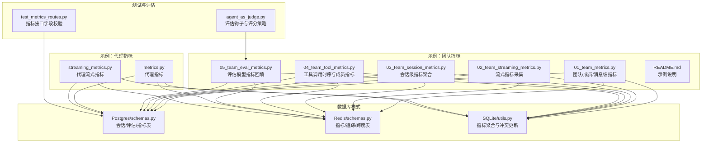
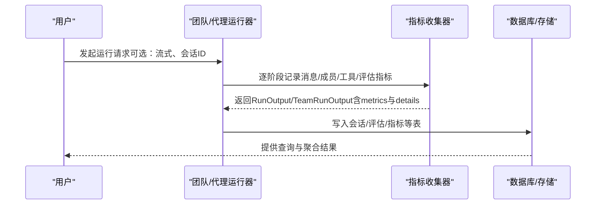
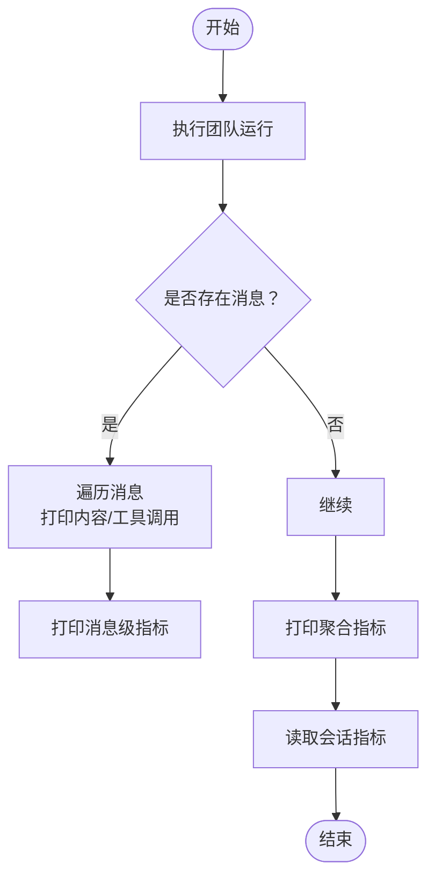
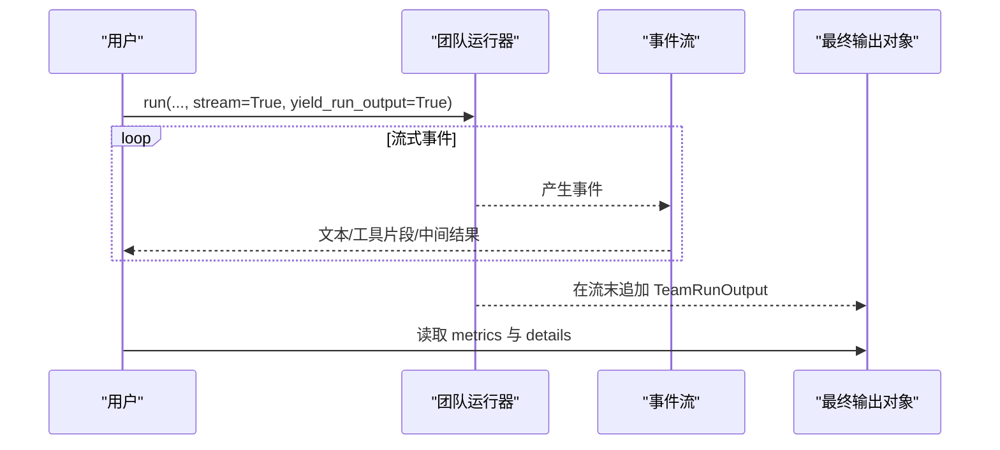
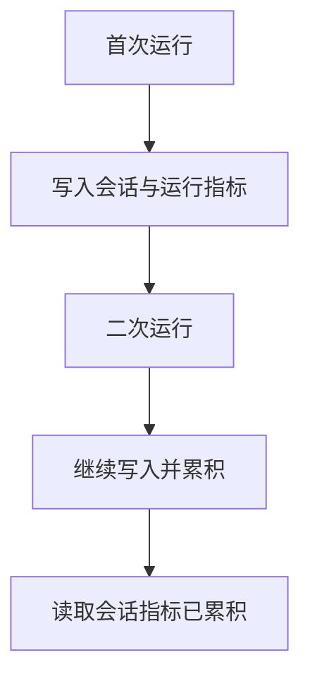
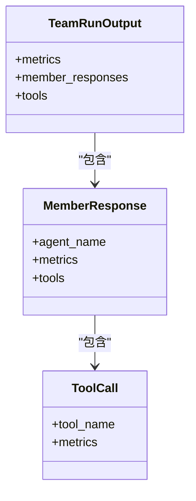
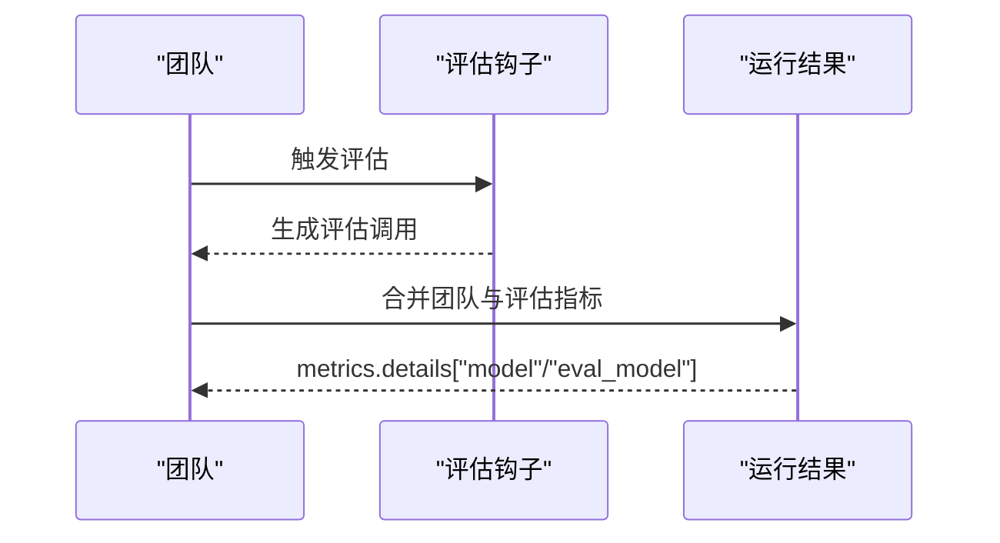
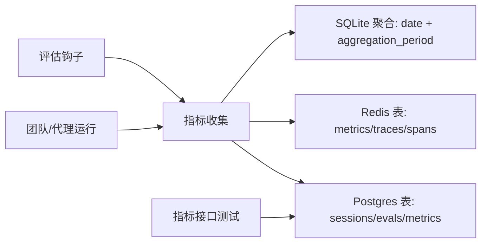

# 团队指标监控

<cite>
**本文引用的文件**
- [01_team_metrics.py](file://cookbook/03_teams/22_metrics/01_team_metrics.py)
- [02_team_streaming_metrics.py](file://cookbook/03_teams/22_metrics/02_team_streaming_metrics.py)
- [03_team_session_metrics.py](file://cookbook/03_teams/22_metrics/03_team_session_metrics.py)
- [04_team_tool_metrics.py](file://cookbook/03_teams/22_metrics/04_team_tool_metrics.py)
- [05_team_eval_metrics.py](file://cookbook/03_teams/22_metrics/05_team_eval_metrics.py)
- [README.md](file://cookbook/03_teams/22_metrics/README.md)
- [metrics.py](file://cookbook/02_agents/14_advanced/metrics.py)
- [streaming_metrics.py](file://cookbook/02_agents/14_advanced/streaming_metrics.py)
- [schemas.py（Postgres）](file://libs/agno/agno/db/postgres/schemas.py)
- [schemas.py（Redis）](file://libs/agno/agno/db/redis/schemas.py)
- [utils.py（SQLite）](file://libs/agno/agno/db/sqlite/utils.py)
- [test_metrics_routes.py](file://libs/agno/tests/system/tests/test_metrics_routes.py)
- [agent_as_judge.py](file://libs/agno/agno/eval/agent_as_judge.py)
- [dependencies_in_tools.py](file://cookbook/03_teams/17_dependencies/dependencies_in_tools.py)
</cite>

## 目录
1. [简介](#简介)
2. [项目结构](#项目结构)
3. [核心组件](#核心组件)
4. [架构总览](#架构总览)
5. [详细组件分析](#详细组件分析)
6. [依赖关系分析](#依赖关系分析)
7. [性能考量](#性能考量)
8. [故障排查指南](#故障排查指南)
9. [结论](#结论)
10. [附录](#附录)

## 简介
本文件面向团队指标监控系统，围绕“团队指标、流式指标、会话指标、工具指标、评估指标”的配置与使用进行系统化说明。内容涵盖指标定义、采集与存储策略、分析与可视化、在团队优化中的应用（性能瓶颈识别、资源利用率分析、优化建议），并提供可直接定位到仓库源码的示例路径，帮助读者快速落地。

## 项目结构
本项目的指标监控示例主要集中在“团队指标”示例目录中，并辅以“代理指标”示例与数据库模式定义，形成从单体到团队、从实时到持久化的完整链路。

图表来源
- [01_team_metrics.py:1-96](file://cookbook/03_teams/22_metrics/01_team_metrics.py#L1-L96)
- [02_team_streaming_metrics.py:1-57](file://cookbook/03_teams/22_metrics/02_team_streaming_metrics.py#L1-L57)
- [03_team_session_metrics.py:1-68](file://cookbook/03_teams/22_metrics/03_team_session_metrics.py#L1-L68)
- [04_team_tool_metrics.py:1-65](file://cookbook/03_teams/22_metrics/04_team_tool_metrics.py#L1-L65)
- [05_team_eval_metrics.py:1-86](file://cookbook/03_teams/22_metrics/05_team_eval_metrics.py#L1-L86)
- [metrics.py:1-67](file://cookbook/02_agents/14_advanced/metrics.py#L1-L67)
- [streaming_metrics.py:1-44](file://cookbook/02_agents/14_advanced/streaming_metrics.py#L1-L44)
- [schemas.py（Postgres）:74-96](file://libs/agno/agno/db/postgres/schemas.py#L74-L96)
- [schemas.py（Redis）:36-68](file://libs/agno/agno/db/redis/schemas.py#L36-L68)
- [utils.py（SQLite）:223-248](file://libs/agno/agno/db/sqlite/utils.py#L223-L248)
- [test_metrics_routes.py:187-223](file://libs/agno/tests/system/tests/test_metrics_routes.py#L187-L223)
- [agent_as_judge.py:220-250](file://libs/agno/agno/eval/agent_as_judge.py#L220-L250)

章节来源
- [README.md:1-18](file://cookbook/03_teams/22_metrics/README.md#L1-L18)

## 核心组件
- 团队指标（Run Metrics）
  - 支持获取团队整体、成员级、消息级指标；可打印聚合指标与会话级指标。
  - 示例路径：[01_team_metrics.py:1-96](file://cookbook/03_teams/22_metrics/01_team_metrics.py#L1-L96)
- 流式指标（Streaming Metrics）
  - 通过开启流式输出并在流结束时接收最终输出对象，提取完整指标与按模型类型的明细。
  - 示例路径：[02_team_streaming_metrics.py:1-57](file://cookbook/03_teams/22_metrics/02_team_streaming_metrics.py#L1-L57)
- 会话指标（Session Metrics）
  - 多次运行在同一会话下累积，最终返回会话级聚合指标。
  - 示例路径：[03_team_session_metrics.py:1-68](file://cookbook/03_teams/22_metrics/03_team_session_metrics.py#L1-L68)
- 工具指标（Tool Metrics）
  - 展示成员工具调用时序与成员级指标，便于定位工具耗时与调用次数。
  - 示例路径：[04_team_tool_metrics.py:1-65](file://cookbook/03_teams/22_metrics/04_team_tool_metrics.py#L1-L65)
- 评估指标（Eval Metrics）
  - 使用评估钩子后，评估模型的调用指标会回填至“eval_model”明细中，与团队自有模型指标区分。
  - 示例路径：[05_team_eval_metrics.py:1-86](file://cookbook/03_teams/22_metrics/05_team_eval_metrics.py#L1-L86)
- 代理指标（Agent Metrics）
  - 单代理场景下的消息级与会话级指标采集，便于对比与复用。
  - 示例路径：[metrics.py:1-67](file://cookbook/02_agents/14_advanced/metrics.py#L1-L67)，[streaming_metrics.py:1-44](file://cookbook/02_agents/14_advanced/streaming_metrics.py#L1-L44)

章节来源
- [01_team_metrics.py:1-96](file://cookbook/03_teams/22_metrics/01_team_metrics.py#L1-L96)
- [02_team_streaming_metrics.py:1-57](file://cookbook/03_teams/22_metrics/02_team_streaming_metrics.py#L1-L57)
- [03_team_session_metrics.py:1-68](file://cookbook/03_teams/22_metrics/03_team_session_metrics.py#L1-L68)
- [04_team_tool_metrics.py:1-65](file://cookbook/03_teams/22_metrics/04_team_tool_metrics.py#L1-L65)
- [05_team_eval_metrics.py:1-86](file://cookbook/03_teams/22_metrics/05_team_eval_metrics.py#L1-L86)
- [metrics.py:1-67](file://cookbook/02_agents/14_advanced/metrics.py#L1-L67)
- [streaming_metrics.py:1-44](file://cookbook/02_agents/14_advanced/streaming_metrics.py#L1-L44)

## 架构总览
下图展示了从“运行请求”到“指标采集与存储”的端到端流程，以及不同存储后端的模式映射。

图表来源
- [01_team_metrics.py:49-77](file://cookbook/03_teams/22_metrics/01_team_metrics.py#L49-L77)
- [02_team_streaming_metrics.py:38-56](file://cookbook/03_teams/22_metrics/02_team_streaming_metrics.py#L38-L56)
- [03_team_session_metrics.py:48-67](file://cookbook/03_teams/22_metrics/03_team_session_metrics.py#L48-L67)
- [04_team_tool_metrics.py:40-64](file://cookbook/03_teams/22_metrics/04_team_tool_metrics.py#L40-L64)
- [05_team_eval_metrics.py:50-85](file://cookbook/03_teams/22_metrics/05_team_eval_metrics.py#L50-L85)
- [schemas.py（Postgres）:74-96](file://libs/agno/agno/db/postgres/schemas.py#L74-L96)
- [schemas.py（Redis）:36-68](file://libs/agno/agno/db/redis/schemas.py#L36-L68)

## 详细组件分析

### 组件A：团队指标（Run Metrics）
- 功能要点
  - 获取团队整体指标、成员级指标、消息级指标。
  - 支持打印聚合指标与会话级指标。
- 关键实现路径
  - 运行团队并打印消息与指标：[01_team_metrics.py:49-77](file://cookbook/03_teams/22_metrics/01_team_metrics.py#L49-L77)
  - 读取会话指标：[01_team_metrics.py:77-77](file://cookbook/03_teams/22_metrics/01_team_metrics.py#L77-L77)
- 数据结构与复杂度
  - 指标结构包含总量与按模型类型拆分的明细，时间复杂度与消息/成员数量线性相关。
- 错误处理与边界
  - 当无消息或指标为空时，示例中包含空值保护逻辑，避免异常。

图表来源
- [01_team_metrics.py:49-77](file://cookbook/03_teams/22_metrics/01_team_metrics.py#L49-L77)

章节来源
- [01_team_metrics.py:1-96](file://cookbook/03_teams/22_metrics/01_team_metrics.py#L1-L96)

### 组件B：流式指标（Streaming Metrics）
- 功能要点
  - 通过开启流式输出并在流结束时接收最终输出对象，提取完整指标与按模型类型的明细。
- 关键实现路径
  - 流式运行并捕获最终输出对象：[02_team_streaming_metrics.py:38-56](file://cookbook/03_teams/22_metrics/02_team_streaming_metrics.py#L38-L56)
  - 代理侧流式指标示例：[streaming_metrics.py:24-43](file://cookbook/02_agents/14_advanced/streaming_metrics.py#L24-L43)
- 数据结构与复杂度
  - 指标明细按模型类型分组，便于区分主模型与评估模型的调用开销。

图表来源
- [02_team_streaming_metrics.py:38-56](file://cookbook/03_teams/22_metrics/02_team_streaming_metrics.py#L38-L56)
- [streaming_metrics.py:24-43](file://cookbook/02_agents/14_advanced/streaming_metrics.py#L24-L43)

章节来源
- [02_team_streaming_metrics.py:1-57](file://cookbook/03_teams/22_metrics/02_team_streaming_metrics.py#L1-L57)
- [streaming_metrics.py:1-44](file://cookbook/02_agents/14_advanced/streaming_metrics.py#L1-L44)

### 组件C：会话指标（Session Metrics）
- 功能要点
  - 同一会话内多次运行的指标会累积，最终返回会话级聚合指标。
- 关键实现路径
  - 多次运行并读取会话指标：[03_team_session_metrics.py:48-67](file://cookbook/03_teams/22_metrics/03_team_session_metrics.py#L48-L67)
- 存储与聚合
  - 聚合逻辑在数据库层实现，示例中通过接口读取聚合结果。

图表来源
- [03_team_session_metrics.py:48-67](file://cookbook/03_teams/22_metrics/03_team_session_metrics.py#L48-L67)

章节来源
- [03_team_session_metrics.py:1-68](file://cookbook/03_teams/22_metrics/03_team_session_metrics.py#L1-L68)

### 组件D：工具指标（Tool Metrics）
- 功能要点
  - 展示成员工具调用时序与成员级指标，便于定位工具耗时与调用次数。
- 关键实现路径
  - 成员工具调用与指标打印：[04_team_tool_metrics.py:40-64](file://cookbook/03_teams/22_metrics/04_team_tool_metrics.py#L40-L64)
- 分析价值
  - 通过工具调用计数与时序，识别高成本工具与潜在优化点。

图表来源
- [04_team_tool_metrics.py:40-64](file://cookbook/03_teams/22_metrics/04_team_tool_metrics.py#L40-L64)

章节来源
- [04_team_tool_metrics.py:1-65](file://cookbook/03_teams/22_metrics/04_team_tool_metrics.py#L1-L65)

### 组件E：评估指标（Eval Metrics）
- 功能要点
  - 使用评估钩子后，评估模型的调用指标会回填至“eval_model”明细中，与团队自有模型指标区分。
- 关键实现路径
  - 评估钩子配置与指标读取：[05_team_eval_metrics.py:22-85](file://cookbook/03_teams/22_metrics/05_team_eval_metrics.py#L22-L85)
  - 评分策略与指令构建：[agent_as_judge.py:220-250](file://libs/agno/agno/eval/agent_as_judge.py#L220-L250)
- 分析价值
  - 将“团队模型”与“评估模型”的消耗分离，便于精细化成本与质量分析。

图表来源
- [05_team_eval_metrics.py:22-85](file://cookbook/03_teams/22_metrics/05_team_eval_metrics.py#L22-L85)
- [agent_as_judge.py:220-250](file://libs/agno/agno/eval/agent_as_judge.py#L220-L250)

章节来源
- [05_team_eval_metrics.py:1-86](file://cookbook/03_teams/22_metrics/05_team_eval_metrics.py#L1-L86)
- [agent_as_judge.py:220-250](file://libs/agno/agno/eval/agent_as_judge.py#L220-L250)

### 组件F：代理指标（Agent Metrics）
- 功能要点
  - 单代理场景下的消息级与会话级指标采集，便于对比与复用。
- 关键实现路径
  - 代理指标打印与会话指标读取：[metrics.py:28-66](file://cookbook/02_agents/14_advanced/metrics.py#L28-L66)
  - 代理流式指标采集：[streaming_metrics.py:24-43](file://cookbook/02_agents/14_advanced/streaming_metrics.py#L24-L43)

章节来源
- [metrics.py:1-67](file://cookbook/02_agents/14_advanced/metrics.py#L1-L67)
- [streaming_metrics.py:1-44](file://cookbook/02_agents/14_advanced/streaming_metrics.py#L1-L44)

## 依赖关系分析
- 存储后端
  - Postgres：会话、评估、指标等表结构定义清晰，支持JSONB字段与复合索引。
  - Redis：指标、追踪、跨度等表结构定义，兼容基础接口。
  - SQLite：指标聚合与冲突更新策略，基于日期与聚合周期的唯一约束。
- 接口与测试
  - 指标接口字段校验确保返回结构一致性。
- 评估集成
  - 评估钩子与评分策略影响指标明细中的“eval_model”部分。

图表来源
- [schemas.py（Postgres）:74-96](file://libs/agno/agno/db/postgres/schemas.py#L74-L96)
- [schemas.py（Redis）:36-68](file://libs/agno/agno/db/redis/schemas.py#L36-L68)
- [utils.py（SQLite）:223-248](file://libs/agno/agno/db/sqlite/utils.py#L223-L248)
- [test_metrics_routes.py:187-223](file://libs/agno/tests/system/tests/test_metrics_routes.py#L187-L223)

章节来源
- [schemas.py（Postgres）:1-356](file://libs/agno/agno/db/postgres/schemas.py#L1-L356)
- [schemas.py（Redis）:1-160](file://libs/agno/agno/db/redis/schemas.py#L1-L160)
- [utils.py（SQLite）:223-248](file://libs/agno/agno/db/sqlite/utils.py#L223-L248)
- [test_metrics_routes.py:187-223](file://libs/agno/tests/system/tests/test_metrics_routes.py#L187-L223)

## 性能考量
- 指标粒度与开销
  - 消息级与成员级指标越细，写入与聚合成本越高；建议按需启用。
- 流式与非流式
  - 流式场景仅在末尾追加最终输出对象，减少中间态存储压力。
- 存储选择
  - 高频写入与实时查询可考虑Redis；长周期聚合与历史分析可考虑Postgres/SQLite。
- 聚合策略
  - SQLite基于日期与聚合周期的唯一约束，避免重复计算；合理设置聚合周期可降低写放大。

## 故障排查指南
- 指标为空
  - 检查运行是否成功、是否启用指标收集参数；参考示例中的空值保护逻辑。
- 会话指标未更新
  - 确认是否使用相同会话ID；检查数据库写入与查询逻辑。
- 评估指标缺失
  - 确认是否配置了评估钩子；核对“eval_model”明细是否存在。
- 接口字段不一致
  - 参考接口测试用例，确保返回字段完整。

章节来源
- [test_metrics_routes.py:187-223](file://libs/agno/tests/system/tests/test_metrics_routes.py#L187-L223)

## 结论
通过上述团队指标监控体系，可以实现从“运行时指标”到“会话级聚合”再到“评估与工具维度”的全链路可观测性。结合数据库模式与聚合策略，团队可在保证性能的前提下，持续优化资源利用率与协作效率。

## 附录
- 团队指标配置与使用示例路径
  - 团队指标：[01_team_metrics.py:1-96](file://cookbook/03_teams/22_metrics/01_team_metrics.py#L1-L96)
  - 流式指标：[02_team_streaming_metrics.py:1-57](file://cookbook/03_teams/22_metrics/02_team_streaming_metrics.py#L1-L57)
  - 会话指标：[03_team_session_metrics.py:1-68](file://cookbook/03_teams/22_metrics/03_team_session_metrics.py#L1-L68)
  - 工具指标：[04_team_tool_metrics.py:1-65](file://cookbook/03_teams/22_metrics/04_team_tool_metrics.py#L1-L65)
  - 评估指标：[05_team_eval_metrics.py:1-86](file://cookbook/03_teams/22_metrics/05_team_eval_metrics.py#L1-L86)
- 代理指标示例路径
  - 代理指标：[metrics.py:1-67](file://cookbook/02_agents/14_advanced/metrics.py#L1-L67)
  - 代理流式指标：[streaming_metrics.py:1-44](file://cookbook/02_agents/14_advanced/streaming_metrics.py#L1-L44)
- 数据库模式与聚合
  - Postgres模式：[schemas.py（Postgres）:74-96](file://libs/agno/agno/db/postgres/schemas.py#L74-L96)
  - Redis模式：[schemas.py（Redis）:36-68](file://libs/agno/agno/db/redis/schemas.py#L36-L68)
  - SQLite聚合：[utils.py（SQLite）:223-248](file://libs/agno/agno/db/sqlite/utils.py#L223-L248)
- 指标接口测试
  - [test_metrics_routes.py:187-223](file://libs/agno/tests/system/tests/test_metrics_routes.py#L187-L223)
- 评估钩子与评分策略
  - [agent_as_judge.py:220-250](file://libs/agno/agno/eval/agent_as_judge.py#L220-L250)
- 团队工具依赖访问示例（指标在工具中的应用）
  - [dependencies_in_tools.py:46-174](file://cookbook/03_teams/17_dependencies/dependencies_in_tools.py#L46-L174)