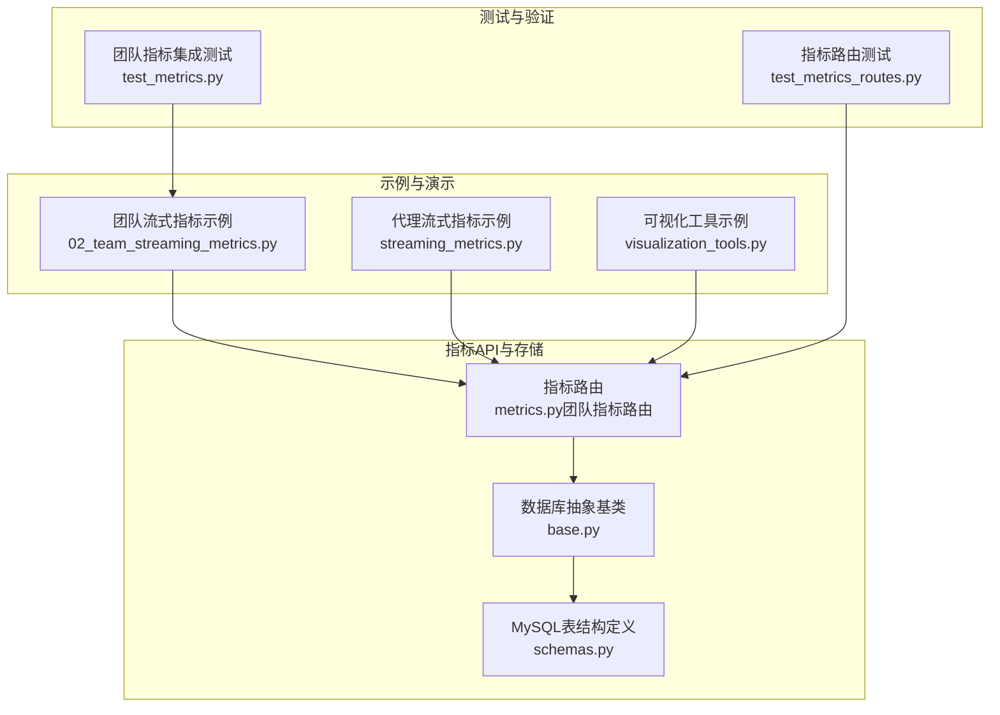
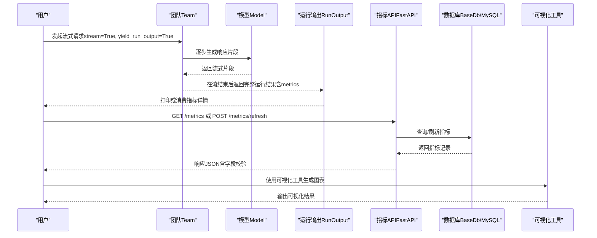
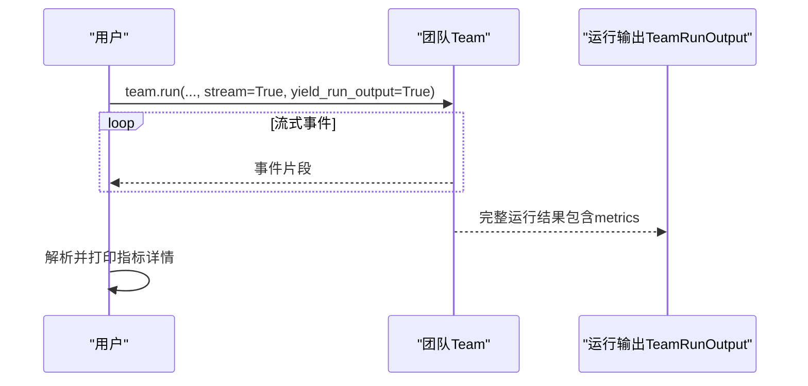
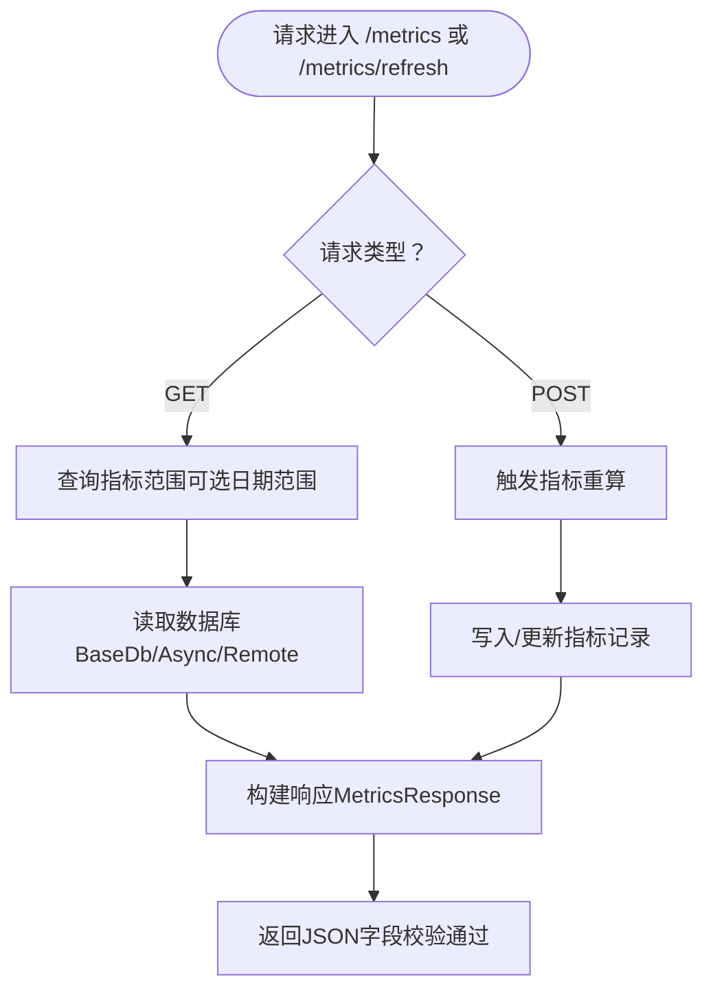
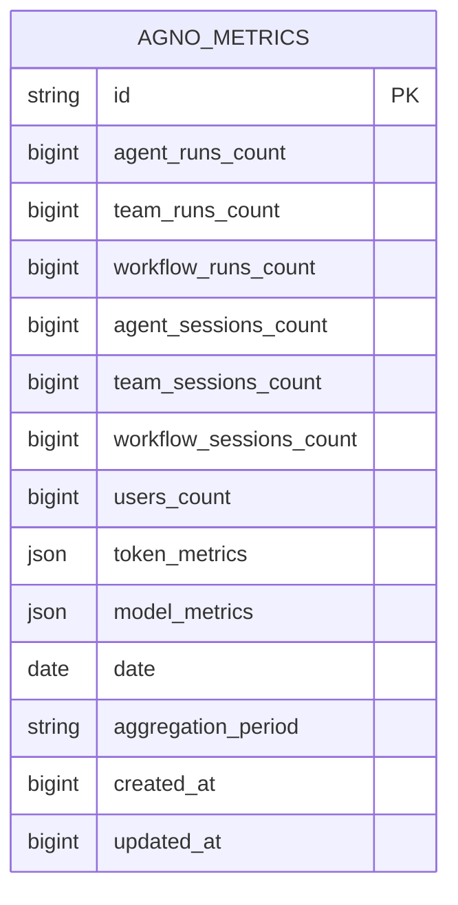
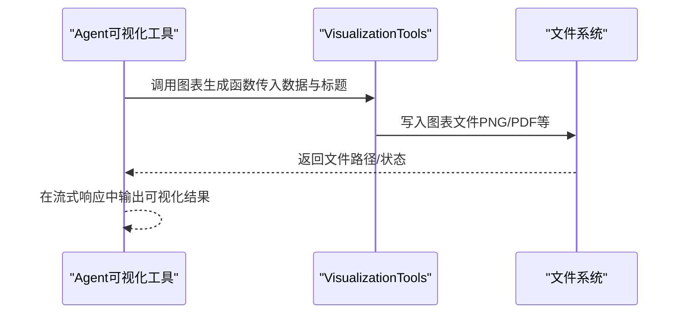
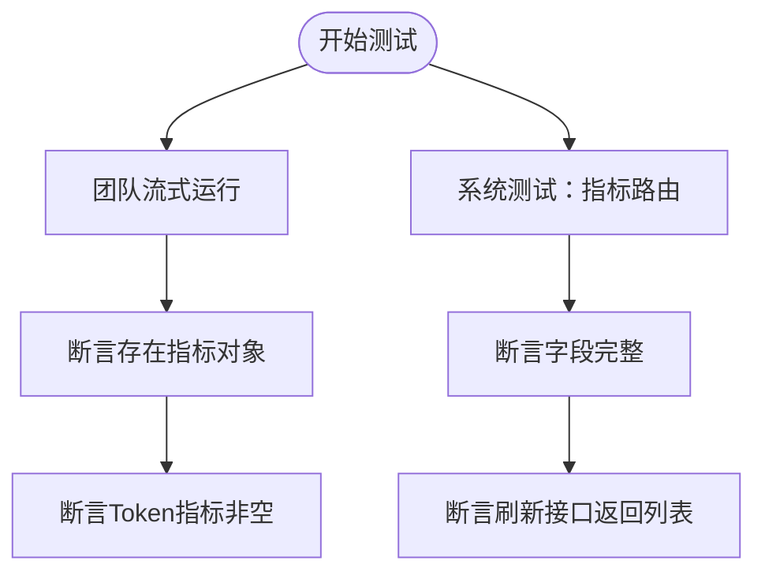
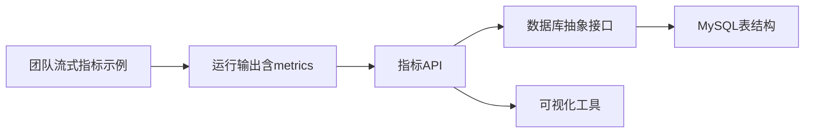

# 团队流式指标

<cite>
**本文引用的文件**
- [02_team_streaming_metrics.py](file://cookbook/03_teams/22_metrics/02_team_streaming_metrics.py)
- [streaming_metrics.py](file://cookbook/02_agents/14_advanced/streaming_metrics.py)
- [metrics.py（团队指标路由）](file://libs/agno/agno/os/routers/metrics/metrics.py)
- [base.py（数据库抽象基类）](file://libs/agno/agno/db/base.py)
- [schemas.py（MySQL表结构定义）](file://libs/agno/agno/db/mysql/schemas.py)
- [visualization_tools.py](file://cookbook/91_tools/visualization_tools.py)
- [test_metrics_routes.py](file://libs/agno/tests/system/tests/test_metrics_routes.py)
- [test_metrics.py](file://libs/agno/tests/integration/teams/test_metrics.py)
</cite>

## 目录
1. [简介](#简介)
2. [项目结构](#项目结构)
3. [核心组件](#核心组件)
4. [架构总览](#架构总览)
5. [详细组件分析](#详细组件分析)
6. [依赖关系分析](#依赖关系分析)
7. [性能考量](#性能考量)
8. [故障排查指南](#故障排查指南)
9. [结论](#结论)
10. [附录](#附录)

## 简介
本文件围绕“团队流式指标”主题，系统性阐述如何在团队协作场景下实现流式数据采集、实时分析与动态展示。内容覆盖：
- 流式数据采集：通过开启流式输出并设置返回完整运行结果，捕获团队运行过程中的指标。
- 实时分析：在流式事件中解析并聚合模型调用、Token消耗等关键指标。
- 动态展示：结合可视化工具对指标进行图表化呈现，辅助团队快速理解系统状态。
- 配置与使用：从数据源连接、实时处理到可视化展示的端到端流程说明。
- 应用场景：实时性能监控、动态负载分析、即时响应机制等。
- 性能优化与最佳实践：针对高并发、低延迟的流式处理建议。

## 项目结构
与“团队流式指标”直接相关的核心文件分布如下：
- 示例演示：团队流式指标采集与打印
- 指标API：FastAPI 路由，支持查询与刷新系统指标
- 数据库抽象：统一的指标表结构与接口
- 可视化工具：面向业务的图表生成与展示
- 测试用例：验证指标字段与刷新流程

**图示来源**
- [02_team_streaming_metrics.py:1-57](file://cookbook/03_teams/22_metrics/02_team_streaming_metrics.py#L1-L57)
- [streaming_metrics.py:1-44](file://cookbook/02_agents/14_advanced/streaming_metrics.py#L1-L44)
- [metrics.py（团队指标路由）:1-206](file://libs/agno/agno/os/routers/metrics/metrics.py#L1-L206)
- [base.py（数据库抽象基类）:1-800](file://libs/agno/agno/db/base.py#L1-L800)
- [schemas.py（MySQL表结构定义）:73-95](file://libs/agno/agno/db/mysql/schemas.py#L73-L95)
- [visualization_tools.py:1-273](file://cookbook/91_tools/visualization_tools.py#L1-L273)
- [test_metrics_routes.py:187-223](file://libs/agno/tests/system/tests/test_metrics_routes.py#L187-L223)
- [test_metrics.py:90-132](file://libs/agno/tests/integration/teams/test_metrics.py#L90-L132)

**章节来源**
- [02_team_streaming_metrics.py:1-57](file://cookbook/03_teams/22_metrics/02_team_streaming_metrics.py#L1-L57)
- [metrics.py（团队指标路由）:1-206](file://libs/agno/agno/os/routers/metrics/metrics.py#L1-L206)
- [base.py（数据库抽象基类）:1-800](file://libs/agno/agno/db/base.py#L1-L800)
- [schemas.py（MySQL表结构定义）:73-95](file://libs/agno/agno/db/mysql/schemas.py#L73-L95)
- [visualization_tools.py:1-273](file://cookbook/91_tools/visualization_tools.py#L1-L273)
- [test_metrics_routes.py:187-223](file://libs/agno/tests/system/tests/test_metrics_routes.py#L187-L223)
- [test_metrics.py:90-132](file://libs/agno/tests/integration/teams/test_metrics.py#L90-L132)

## 核心组件
- 团队流式指标采集器：通过开启流式输出并设置返回完整运行结果，捕获团队运行结束时的指标对象，支持按模型类型分组查看细节。
- 指标API服务：提供查询与手动刷新指标的HTTP接口，支持异步/远程数据库适配。
- 数据库存储：统一的指标表结构定义，包含运行次数、会话数、Token统计、模型使用统计等字段。
- 可视化工具：封装多种图表生成函数，便于将指标转化为直观的可视化结果。
- 测试与验证：覆盖指标字段完整性与刷新流程的系统测试。

**章节来源**
- [02_team_streaming_metrics.py:37-57](file://cookbook/03_teams/22_metrics/02_team_streaming_metrics.py#L37-L57)
- [metrics.py（团队指标路由）:43-205](file://libs/agno/agno/os/routers/metrics/metrics.py#L43-L205)
- [base.py（数据库抽象基类）:279-290](file://libs/agno/agno/db/base.py#L279-L290)
- [schemas.py（MySQL表结构定义）:73-95](file://libs/agno/agno/db/mysql/schemas.py#L73-L95)
- [visualization_tools.py:1-273](file://cookbook/91_tools/visualization_tools.py#L1-L273)
- [test_metrics_routes.py:187-223](file://libs/agno/tests/system/tests/test_metrics_routes.py#L187-L223)

## 架构总览
下图展示了从团队运行到指标采集、API查询与刷新、以及可视化展示的整体流程。

**图示来源**
- [02_team_streaming_metrics.py:37-57](file://cookbook/03_teams/22_metrics/02_team_streaming_metrics.py#L37-L57)
- [metrics.py（团队指标路由）:95-203](file://libs/agno/agno/os/routers/metrics/metrics.py#L95-L203)
- [base.py（数据库抽象基类）:279-290](file://libs/agno/agno/db/base.py#L279-L290)
- [schemas.py（MySQL表结构定义）:73-95](file://libs/agno/agno/db/mysql/schemas.py#L73-L95)
- [visualization_tools.py:138-272](file://cookbook/91_tools/visualization_tools.py#L138-L272)

## 详细组件分析

### 组件A：团队流式指标采集与展示
- 关键点
  - 启用流式输出与完整运行结果返回，以便在流结束后获取指标对象。
  - 支持按模型类型分组打印指标细节，便于定位具体模型的使用情况。
- 典型流程
  - 创建团队与成员
  - 以流式方式运行任务
  - 在流结束后提取并打印指标
- 适用场景
  - 实时性能监控：观察Token消耗、模型调用次数等
  - 动态负载分析：按模型维度拆解资源占用
  - 即时响应机制：在流式过程中持续反馈指标变化

**图示来源**
- [02_team_streaming_metrics.py:37-57](file://cookbook/03_teams/22_metrics/02_team_streaming_metrics.py#L37-L57)

**章节来源**
- [02_team_streaming_metrics.py:1-57](file://cookbook/03_teams/22_metrics/02_team_streaming_metrics.py#L1-L57)

### 组件B：指标API（查询与刷新）
- 关键点
  - 提供GET /metrics查询历史指标范围与最新更新时间
  - 提供POST /metrics/refresh手动触发指标重算
  - 自动适配异步/远程数据库，统一返回格式
- 字段说明（节选）
  - 运行计数：agent_runs_count、team_runs_count、workflow_runs_count
  - 会话计数：agent_sessions_count、team_sessions_count、workflow_sessions_count
  - 用户计数：users_count
  - Token统计：input_tokens、output_tokens、total_tokens、audio_*、cache_*、reasoning_tokens
  - 模型统计：model_metrics（模型ID、提供商、调用次数）
  - 时间戳：date、created_at、updated_at
- 测试验证
  - 字段完整性校验
  - 刷新接口返回列表且字段齐全

**图示来源**
- [metrics.py（团队指标路由）:43-205](file://libs/agno/agno/os/routers/metrics/metrics.py#L43-L205)
- [test_metrics_routes.py:187-223](file://libs/agno/tests/system/tests/test_metrics_routes.py#L187-L223)

**章节来源**
- [metrics.py（团队指标路由）:1-206](file://libs/agno/agno/os/routers/metrics/metrics.py#L1-L206)
- [test_metrics_routes.py:187-223](file://libs/agno/tests/system/tests/test_metrics_routes.py#L187-L223)

### 组件C：数据库指标表结构与接口
- 表结构要点（MySQL）
  - 主键：id
  - 计数字段：agent_runs_count、team_runs_count、workflow_runs_count、agent_sessions_count、team_sessions_count、workflow_sessions_count、users_count
  - JSON字段：token_metrics、model_metrics
  - 时间字段：date、aggregation_period、created_at、updated_at
  - 约束：唯一约束（date, aggregation_period）
- 抽象接口
  - get_metrics(starting_date, ending_date)
  - calculate_metrics()

**图示来源**
- [schemas.py（MySQL表结构定义）:73-95](file://libs/agno/agno/db/mysql/schemas.py#L73-L95)
- [base.py（数据库抽象基类）:279-290](file://libs/agno/agno/db/base.py#L279-L290)

**章节来源**
- [schemas.py（MySQL表结构定义）:73-95](file://libs/agno/agno/db/mysql/schemas.py#L73-L95)
- [base.py（数据库抽象基类）:279-290](file://libs/agno/agno/db/base.py#L279-L290)

### 组件D：可视化工具与动态展示
- 能力概述
  - 支持柱状图、折线图、散点图、饼图、直方图等多种图表
  - 可按需启用特定图表类型，控制输出目录
  - 面向业务场景的提示词与指令，强调洞察与建议
- 使用建议
  - 将指标API返回的统计数据喂给可视化工具，生成图表并输出到指定目录
  - 结合流式输出，在任务执行过程中逐步展示阶段性结果

**图示来源**
- [visualization_tools.py:1-273](file://cookbook/91_tools/visualization_tools.py#L1-L273)

**章节来源**
- [visualization_tools.py:1-273](file://cookbook/91_tools/visualization_tools.py#L1-L273)

### 组件E：集成测试与验证
- 团队指标集成测试
  - 验证流式完成后存在指标对象
  - 验证Token相关指标非空
- 指标路由系统测试
  - GET /metrics字段完整性
  - POST /metrics/refresh返回列表且字段齐全

**图示来源**
- [test_metrics.py:90-132](file://libs/agno/tests/integration/teams/test_metrics.py#L90-L132)
- [test_metrics_routes.py:187-223](file://libs/agno/tests/system/tests/test_metrics_routes.py#L187-L223)

**章节来源**
- [test_metrics.py:90-132](file://libs/agno/tests/integration/teams/test_metrics.py#L90-L132)
- [test_metrics_routes.py:187-223](file://libs/agno/tests/system/tests/test_metrics_routes.py#L187-L223)

## 依赖关系分析
- 组件耦合
  - 团队流式指标示例依赖运行输出对象中的metrics字段
  - 指标API依赖数据库抽象接口，支持同步/异步/远程数据库
  - 可视化工具独立于指标API，但可接收其输出的数据
- 外部依赖
  - FastAPI用于暴露指标查询与刷新接口
  - SQLAlchemy JSON类型用于存储复杂指标结构
  - Matplotlib用于图表生成（在可视化工具示例中）

**图示来源**
- [02_team_streaming_metrics.py:37-57](file://cookbook/03_teams/22_metrics/02_team_streaming_metrics.py#L37-L57)
- [metrics.py（团队指标路由）:95-203](file://libs/agno/agno/os/routers/metrics/metrics.py#L95-L203)
- [base.py（数据库抽象基类）:279-290](file://libs/agno/agno/db/base.py#L279-L290)
- [schemas.py（MySQL表结构定义）:73-95](file://libs/agno/agno/db/mysql/schemas.py#L73-L95)
- [visualization_tools.py:1-273](file://cookbook/91_tools/visualization_tools.py#L1-L273)

**章节来源**
- [metrics.py（团队指标路由）:1-206](file://libs/agno/agno/os/routers/metrics/metrics.py#L1-L206)
- [base.py（数据库抽象基类）:1-800](file://libs/agno/agno/db/base.py#L1-L800)
- [schemas.py（MySQL表结构定义）:73-95](file://libs/agno/agno/db/mysql/schemas.py#L73-L95)
- [visualization_tools.py:1-273](file://cookbook/91_tools/visualization_tools.py#L1-L273)

## 性能考量
- 流式处理
  - 使用流式输出降低首字节延迟，提升交互体验
  - 在流式事件中避免频繁落库，可在流结束后统一汇总指标
- 指标计算
  - 异步/远程数据库适配，减少阻塞
  - 批量计算与缓存策略，避免重复计算
- 存储设计
  - 指标表采用JSON字段存储复杂统计，注意索引与查询优化
  - 唯一约束（date, aggregation_period）确保幂等更新
- 可视化
  - 图表生成建议异步化，避免阻塞主流程
  - 控制图表数量与复杂度，优先选择易于解读的图表类型

[本节为通用指导，不直接分析具体文件，故无“章节来源”]

## 故障排查指南
- 指标为空
  - 确认团队运行已开启yield_run_output，确保流结束后能拿到完整运行结果
  - 检查数据库是否正确初始化与写入指标
- API返回异常
  - 校验认证头与参数（日期范围、db_id、table）
  - 查看后端日志，确认数据库连接与权限
- 刷新失败
  - 确认数据库具备最新schema版本
  - 检查计算逻辑与依赖服务可用性

**章节来源**
- [metrics.py（团队指标路由）:105-128](file://libs/agno/agno/os/routers/metrics/metrics.py#L105-L128)
- [test_metrics_routes.py:187-223](file://libs/agno/tests/system/tests/test_metrics_routes.py#L187-L223)
- [test_metrics.py:90-132](file://libs/agno/tests/integration/teams/test_metrics.py#L90-L132)

## 结论
团队流式指标体系通过“流式采集—实时分析—动态展示”的闭环，显著提升了团队的响应速度与决策效率。配合指标API与可视化工具，团队可以在任务执行过程中即时掌握性能与负载状况，并基于数据驱动做出快速调整。建议在生产环境中结合异步计算、批量更新与图表异步生成等优化手段，进一步提升系统的吞吐与稳定性。

[本节为总结性内容，不直接分析具体文件，故无“章节来源”]

## 附录
- 快速上手步骤
  - 启用团队流式运行并设置返回完整运行结果
  - 在流结束后提取并打印指标详情
  - 通过API查询历史指标或手动刷新
  - 使用可视化工具生成图表并输出到指定目录
- 相关文件路径
  - 团队流式指标示例：[02_team_streaming_metrics.py:1-57](file://cookbook/03_teams/22_metrics/02_team_streaming_metrics.py#L1-L57)
  - 指标API路由：[metrics.py（团队指标路由）:1-206](file://libs/agno/agno/os/routers/metrics/metrics.py#L1-L206)
  - 数据库抽象与表结构：[base.py（数据库抽象基类）:279-290](file://libs/agno/agno/db/base.py#L279-L290)、[schemas.py（MySQL表结构定义）:73-95](file://libs/agno/agno/db/mysql/schemas.py#L73-L95)
  - 可视化工具示例：[visualization_tools.py:1-273](file://cookbook/91_tools/visualization_tools.py#L1-L273)
  - 测试用例：[test_metrics_routes.py:187-223](file://libs/agno/tests/system/tests/test_metrics_routes.py#L187-L223)、[test_metrics.py:90-132](file://libs/agno/tests/integration/teams/test_metrics.py#L90-L132)

[本节为补充信息，不直接分析具体文件，故无“章节来源”]