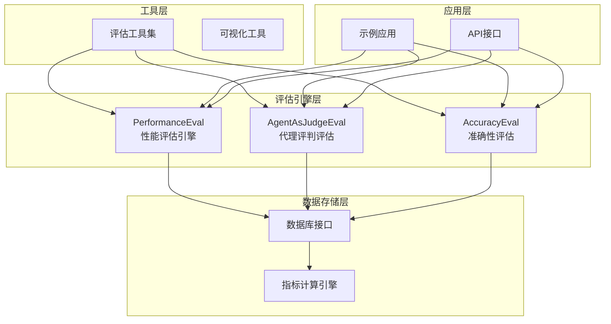
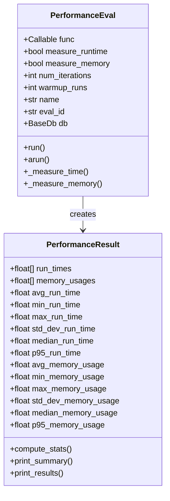
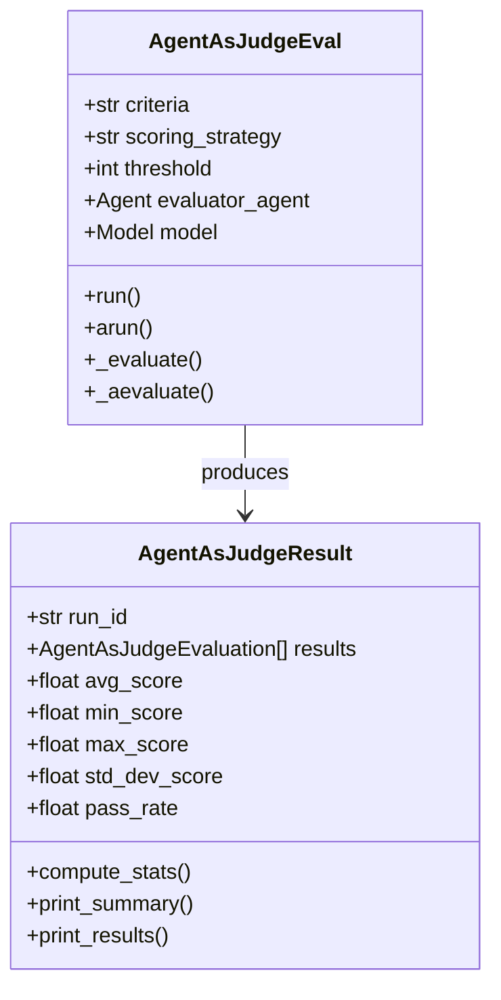
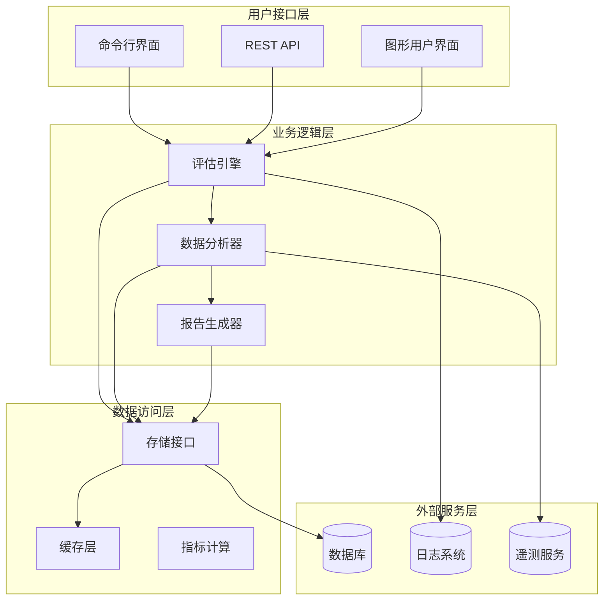
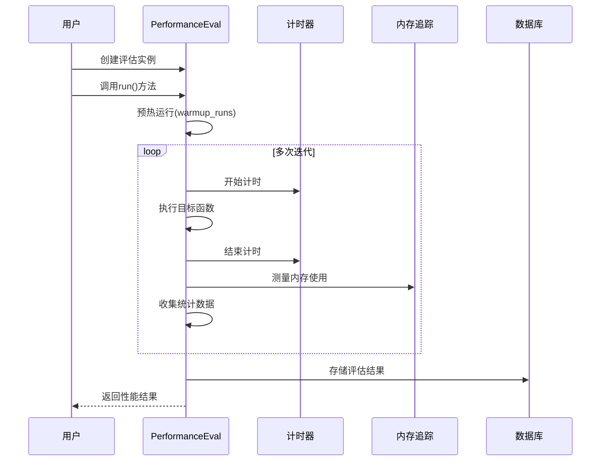
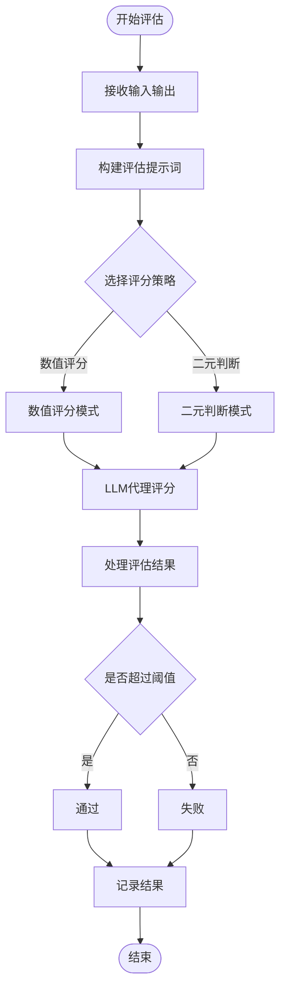
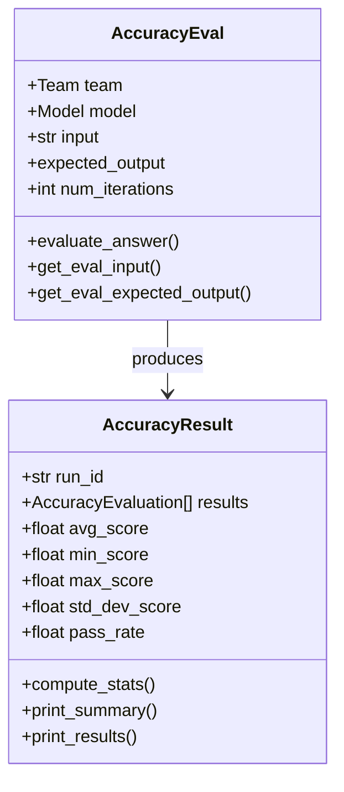
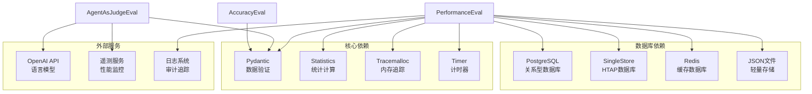

# 团队评估指标

<cite>
**本文档引用的文件**
- [performance.py](file://libs/agno/agno/eval/performance.py)
- [agent_as_judge.py](file://libs/agno/agno/eval/agent_as_judge.py)
- [accuracy.py](file://libs/agno/agno/eval/accuracy.py)
- [evals.py](file://libs/agno/agno/db/schemas/evals.py)
- [test_evals.py](file://libs/agno/tests/integration/db/postgres/test_evals.py)
- [performance/README.md](file://cookbook/09_evals/performance/README.md)
- [instantiate_team.py](file://cookbook/09_evals/performance/instantiate_team.py)
- [team_response_with_memory_and_reasoning.py](file://cookbook/09_evals/performance/team_response_with_memory_and_reasoning.py)
- [db_logging.py](file://cookbook/09_evals/performance/db_logging.py)
- [simple_response.py](file://cookbook/09_evals/performance/simple_response.py)
- [accuracy_team.py](file://cookbook/09_evals/accuracy/accuracy_team.py)
- [agent_as_judge_team.py](file://cookbook/09_evals/agent_as_judge/agent_as_judge_team.py)
- [async_postgres.py](file://libs/agno/agno/db/postgres/async_postgres.py)
- [singlestore.py](file://libs/agno/agno/db/singlestore/singlestore.py)
- [redis.py](file://libs/agno/agno/db/redis/redis.py)
- [json_db.py](file://libs/agno/agno/db/json/json_db.py)
- [gcs_json_db.py](file://libs/agno/agno/db/gcs_json/gcs_json_db.py)
- [schemas.py](file://libs/agno/agno/os/routers/evals/schemas.py)
</cite>

## 目录
1. [简介](#简介)
2. [项目结构](#项目结构)
3. [核心组件](#核心组件)
4. [架构概览](#架构概览)
5. [详细组件分析](#详细组件分析)
6. [依赖关系分析](#依赖关系分析)
7. [性能考量](#性能考量)
8. [故障排除指南](#故障排除指南)
9. [结论](#结论)
10. [附录](#附录)

## 简介

本文件为团队评估指标的综合技术文档，旨在为团队提供一套完整的评估体系，涵盖性能评估、准确性评估和质量评估三大维度。该系统通过标准化的评估流程、可配置的评估参数和自动化的报告生成功能，帮助团队建立持续改进的质量管理体系。

评估指标系统的核心价值在于：
- **标准化评估流程**：提供统一的评估框架和执行规范
- **多维度指标覆盖**：从性能、准确性、质量等多个角度全面评估
- **自动化报告生成**：自动生成详细的评估报告和趋势分析
- **持续改进支持**：通过历史数据对比和趋势分析推动持续优化

## 项目结构

评估指标系统采用模块化设计，主要分为以下几个核心层次：

**图表来源**
- [performance.py:180-780](file://libs/agno/agno/eval/performance.py#L180-L780)
- [agent_as_judge.py:166-929](file://libs/agno/agno/eval/agent_as_judge.py#L166-L929)
- [accuracy.py:257-288](file://libs/agno/agno/eval/accuracy.py#L257-L288)

**章节来源**
- [performance.py:1-780](file://libs/agno/agno/eval/performance.py#L1-L780)
- [agent_as_judge.py:1-929](file://libs/agno/agno/eval/agent_as_judge.py#L1-L929)
- [accuracy.py:257-288](file://libs/agno/agno/eval/accuracy.py#L257-L288)

## 核心组件

### 性能评估引擎 (PerformanceEval)

性能评估引擎是评估系统的核心组件，负责测量函数执行的时间和内存使用情况。其主要特性包括：

- **多统计指标**：提供平均值、最小值、最大值、标准差、中位数和95百分位数
- **内存增长跟踪**：支持详细的内存分配分析和增长模式识别
- **异步支持**：同时支持同步和异步函数的性能测量
- **基准测试**：内置预热运行机制，减少首次调用的影响

**图表来源**
- [performance.py:19-177](file://libs/agno/agno/eval/performance.py#L19-L177)
- [performance.py:179-780](file://libs/agno/agno/eval/performance.py#L179-L780)

### 代理评判评估 (AgentAsJudgeEval)

代理评判评估组件通过LLM代理进行输出质量评估，支持数值评分和二元判断两种模式：

- **数值评分模式**：1-10分制，支持阈值设置和统计分析
- **二元判断模式**：通过/失败，适用于快速质量检查
- **自定义标准**：支持用户定义的评估标准和指导原则
- **详细反馈**：提供评估理由和改进建议

**图表来源**
- [agent_as_judge.py:81-164](file://libs/agno/agno/eval/agent_as_judge.py#L81-L164)
- [agent_as_judge.py:166-929](file://libs/agno/agno/eval/agent_as_judge.py#L166-L929)

### 准确性评估 (AccuracyEval)

准确性评估专注于测量输出与预期结果的一致性程度，特别适用于团队协作场景：

- **多轮评估**：支持多次迭代以提高评估稳定性
- **团队集成**：直接支持团队对象的准确性评估
- **灵活输入**：支持字符串和可调用对象作为输入
- **详细日志**：记录评估过程和结果用于后续分析

**章节来源**
- [performance.py:179-780](file://libs/agno/agno/eval/performance.py#L179-L780)
- [agent_as_judge.py:166-929](file://libs/agno/agno/eval/agent_as_judge.py#L166-L929)
- [accuracy.py:257-288](file://libs/agno/agno/eval/accuracy.py#L257-L288)

## 架构概览

评估指标系统的整体架构采用分层设计，确保了良好的可扩展性和维护性：

**图表来源**
- [performance.py:481-780](file://libs/agno/agno/eval/performance.py#L481-L780)
- [agent_as_judge.py:467-929](file://libs/agno/agno/eval/agent_as_judge.py#L467-L929)
- [evals.py:20-35](file://libs/agno/agno/db/schemas/evals.py#L20-L35)

## 详细组件分析

### 性能评估工作流

性能评估通过标准化的工作流程确保评估结果的准确性和可重复性：

**图表来源**
- [performance.py:481-622](file://libs/agno/agno/eval/performance.py#L481-L622)

#### 性能指标详解

系统提供的性能指标包括：

| 指标类型 | 描述 | 计算方式 | 应用场景 |
|---------|------|----------|----------|
| 平均运行时间 | 单次执行的平均耗时 | 所有迭代的平均值 | 基准性能评估 |
| 最小/最大运行时间 | 执行时间的极值 | 统计学极值 | 异常检测 |
| 标准差 | 运行时间的离散程度 | 标准差公式 | 性能稳定性评估 |
| 中位数 | 中间值，抗异常值 | 排序后中间值 | 健壮性评估 |
| 95百分位数 | 排序后95%分位的耗时 | 百分位数计算 | 性能上限评估 |

**章节来源**
- [performance.py:19-177](file://libs/agno/agno/eval/performance.py#L19-L177)
- [performance.py:481-622](file://libs/agno/agno/eval/performance.py#L481-L622)

### 代理评判评估流程

代理评判评估通过LLM代理实现智能化的质量评估：

**图表来源**
- [agent_as_judge.py:273-400](file://libs/agno/agno/eval/agent_as_judge.py#L273-L400)
- [agent_as_judge.py:467-571](file://libs/agno/agno/eval/agent_as_judge.py#L467-L571)

#### 评估标准配置

评估标准的配置支持多种方式：

- **基本标准**：简单的通过/失败判断
- **数值标准**：1-10分制的详细评分
- **自定义指导**：针对特定场景的评估规则
- **阈值设置**：数值评分的通过门槛

**章节来源**
- [agent_as_judge.py:166-400](file://libs/agno/agno/eval/agent_as_judge.py#L166-L400)
- [agent_as_judge.py:467-571](file://libs/agno/agno/eval/agent_as_judge.py#L467-L571)

### 准确性评估实现

准确性评估专门针对团队协作场景设计，支持复杂的团队交互：

**图表来源**
- [accuracy.py:257-288](file://libs/agno/agno/eval/accuracy.py#L257-L288)

**章节来源**
- [accuracy.py:257-288](file://libs/agno/agno/eval/accuracy.py#L257-L288)

## 依赖关系分析

评估指标系统具有清晰的依赖层次结构：

**图表来源**
- [performance.py:1-14](file://libs/agno/agno/eval/performance.py#L1-L14)
- [agent_as_judge.py:1-25](file://libs/agno/agno/eval/agent_as_judge.py#L1-L25)

**章节来源**
- [performance.py:1-14](file://libs/agno/agno/eval/performance.py#L1-L14)
- [agent_as_judge.py:1-25](file://libs/agno/agno/eval/agent_as_judge.py#L1-L25)

## 性能考量

### 内存管理优化

评估系统在内存管理方面采用了多项优化策略：

- **垃圾回收协调**：在测量前主动触发垃圾回收，确保测量准确性
- **基准值计算**：通过多次测量计算内存使用基准值，消除环境影响
- **快照比较**：支持内存快照比较，精确定位内存增长源
- **资源清理**：及时停止内存追踪，释放系统资源

### 并发处理能力

系统支持多种并发模式以适应不同的评估需求：

- **异步评估**：支持异步函数的性能测量
- **批量评估**：支持多个评估案例的批量处理
- **并行执行**：在支持的情况下并行执行多个评估任务
- **资源限制**：通过配置参数控制资源消耗

## 故障排除指南

### 常见问题及解决方案

| 问题类型 | 症状描述 | 可能原因 | 解决方案 |
|----------|----------|----------|----------|
| 评估超时 | 评估长时间无响应 | 函数执行时间过长 | 增加超时时间或优化被测函数 |
| 内存不足 | 评估过程中内存使用过高 | 内存泄漏或基准值计算错误 | 启用内存增长跟踪，检查代码泄漏 |
| 数据库连接失败 | 无法保存评估结果 | 数据库配置错误 | 检查数据库连接参数和网络连通性 |
| 评估结果异常 | 性能指标明显偏离预期 | 环境因素干扰 | 增加预热运行次数，清理系统缓存 |

### 调试模式使用

系统提供了详细的调试模式支持：

- **详细日志**：显示每个评估步骤的详细信息
- **内存快照**：记录内存分配的详细信息
- **性能分析**：提供CPU使用情况分析
- **错误追踪**：定位评估过程中的异常

**章节来源**
- [performance.py:359-480](file://libs/agno/agno/eval/performance.py#L359-L480)
- [agent_as_judge.py:338-400](file://libs/agno/agno/eval/agent_as_judge.py#L338-L400)

## 结论

团队评估指标系统通过标准化的评估流程、丰富的指标体系和自动化的报告生成功能，为团队协作提供了强有力的支持。系统的主要优势包括：

1. **全面性**：涵盖性能、准确性、质量等多个评估维度
2. **灵活性**：支持自定义评估标准和配置选项
3. **可扩展性**：模块化设计便于功能扩展和定制
4. **易用性**：简洁的API和丰富的示例代码降低使用门槛

通过持续使用该评估系统，团队可以建立数据驱动的质量管理体系，不断提升协作效率和工作质量。

## 附录

### 使用示例路径

以下是一些关键使用示例的文件路径：

- **性能评估基础示例**：[simple_response.py:1-43](file://cookbook/09_evals/performance/simple_response.py#L1-L43)
- **团队性能评估示例**：[instantiate_team.py:1-38](file://cookbook/09_evals/performance/instantiate_team.py#L1-L38)
- **复杂团队性能评估**：[team_response_with_memory_and_reasoning.py:1-800](file://cookbook/09_evals/performance/team_response_with_memory_and_reasoning.py#L1-L800)
- **数据库日志记录示例**：[db_logging.py:1-49](file://cookbook/09_evals/performance/db_logging.py#L1-L49)
- **团队准确性评估**：[accuracy_team.py:1-64](file://cookbook/09_evals/accuracy/accuracy_team.py#L1-L64)
- **团队质量评估**：[agent_as_judge_team.py:1-73](file://cookbook/09_evals/agent_as_judge/agent_as_judge_team.py#L1-L73)

### 配置参数说明

| 参数名称 | 类型 | 默认值 | 描述 |
|----------|------|--------|------|
| num_iterations | int | 50 | 评估迭代次数 |
| warmup_runs | int | 10 | 预热运行次数 |
| measure_runtime | bool | True | 是否测量运行时间 |
| measure_memory | bool | True | 是否测量内存使用 |
| memory_growth_tracking | bool | False | 是否启用内存增长跟踪 |
| print_summary | bool | False | 是否打印摘要 |
| print_results | bool | False | 是否打印详细结果 |