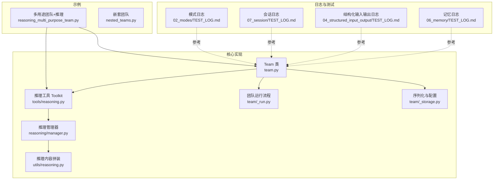
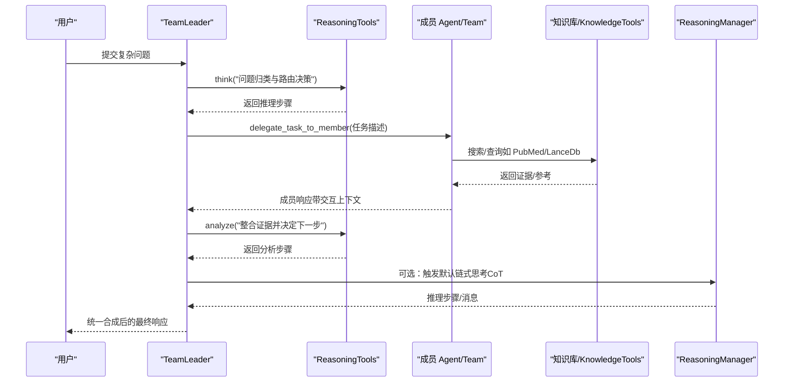
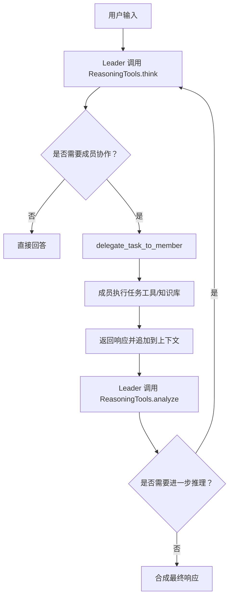
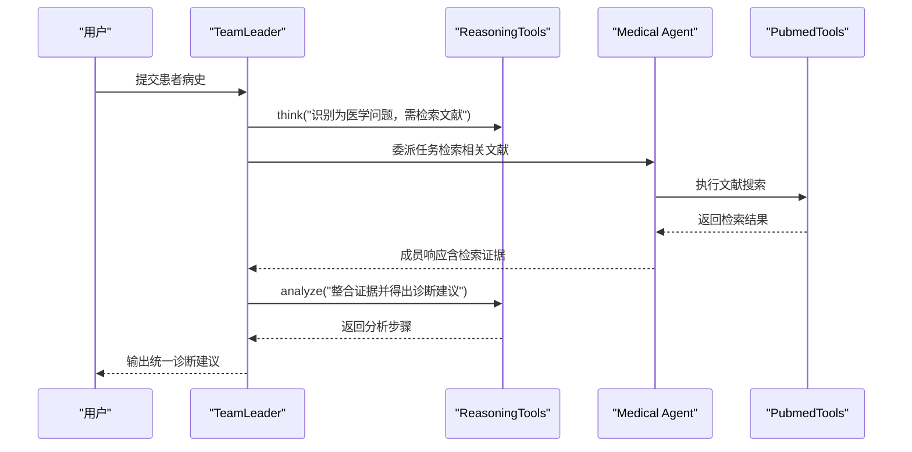
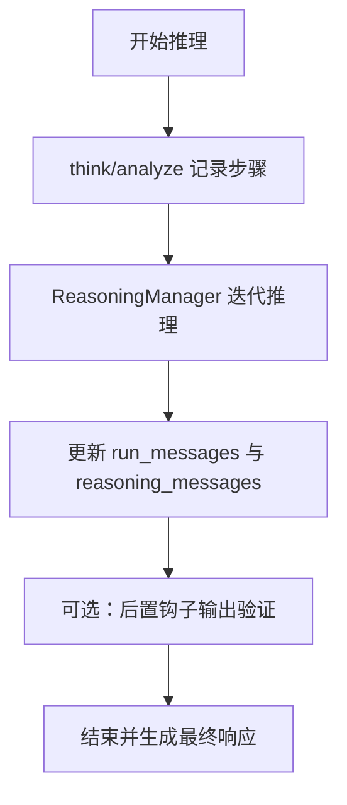
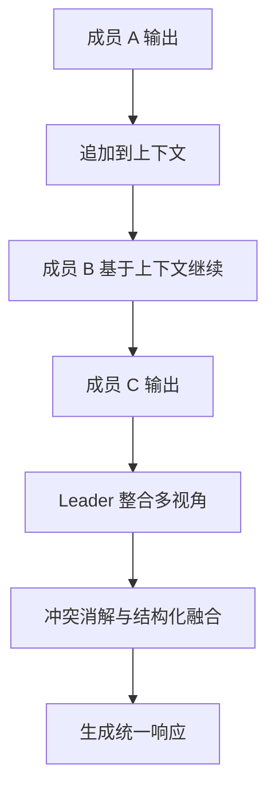
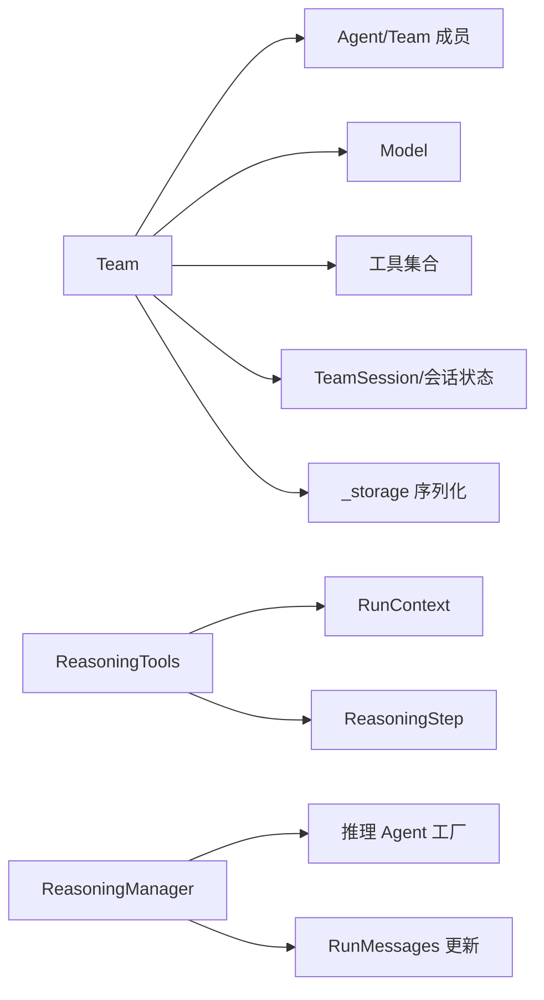

# 团队推理

<cite>
**本文引用的文件**
- [cookbook/03_teams/11_reasoning/reasoning_multi_purpose_team.py](file://cookbook/03_teams/11_reasoning/reasoning_multi_purpose_team.py)
- [cookbook/03_teams/11_reasoning/reasoning_multi_purpose_team.md](file://cookbook/03_teams/11_reasoning/reasoning_multi_purpose_team.md)
- [libs/agno/agno/tools/reasoning.py](file://libs/agno/agno/tools/reasoning.py)
- [libs/agno/agno/reasoning/manager.py](file://libs/agno/agno/reasoning/manager.py)
- [libs/agno/agno/team/team.py](file://libs/agno/agno/team/team.py)
- [libs/agno/agno/team/_storage.py](file://libs/agno/agno/team/_storage.py)
- [libs/agno/agno/team/_run.py](file://libs/agno/agno/team/_run.py)
- [cookbook/03_teams/01_quickstart/nested_teams.py](file://cookbook/03_teams/01_quickstart/nested_teams.py)
- [cookbook/03_teams/02_modes/TEST_LOG.md](file://cookbook/03_teams/02_modes/TEST_LOG.md)
- [cookbook/03_teams/07_session/TEST_LOG.md](file://cookbook/03_teams/07_session/TEST_LOG.md)
- [cookbook/03_teams/04_structured_input_output/TEST_LOG.md](file://cookbook/03_teams/04_structured_input_output/TEST_LOG.md)
- [cookbook/03_teams/06_memory/TEST_LOG.md](file://cookbook/03_teams/06_memory/TEST_LOG.md)
- [cookbook/03_teams/13_hooks/post_hook_output.py](file://cookbook/03_teams/13_hooks/post_hook_output.py)
- [libs/agno/tests/unit/team/test_team_config.py](file://libs/agno/tests/unit/team/test_team_config.py)
- [libs/agno/agno/utils/reasoning.py](file://libs/agno/agno/utils/reasoning.py)
</cite>

## 目录
1. [简介](#简介)
2. [项目结构](#项目结构)
3. [核心组件](#核心组件)
4. [架构总览](#架构总览)
5. [详细组件分析](#详细组件分析)
6. [依赖分析](#依赖分析)
7. [性能考虑](#性能考虑)
8. [故障排除指南](#故障排除指南)
9. [结论](#结论)
10. [附录](#附录)

## 简介
本文件面向“团队推理”能力的实现与应用，围绕以下目标展开：
- 多目的团队推理：通过推理工具驱动的链式思考，结合成员专业化分工，实现复杂问题的结构化分解与协同求解。
- 医疗历史分析与决策协调：以推理工具为“中枢”，在成员间共享交互上下文，完成从症状到文献检索再到综合诊断建议的闭环。
- 推理过程管理：构建推理链、记录思维过程、生成可验证的结果；在团队内实现观点交换、共识达成与决策融合。
- 推理工具集成：ReasoningTools 的参数配置与效果评估；与知识库、外部工具的联动。
- 性能优化与故障排除：运行日志、会话缓存、历史消息控制、错误事件处理等。

## 项目结构
本仓库提供了丰富的团队推理示例与底层实现，重点分布在以下位置：
- 示例：cookbook/03_teams/11_reasoning 下的“多用途团队+推理”示例，展示推理工具如何与多领域成员协作。
- 核心实现：libs/agno/agno/team 与 libs/agno/agno/reasoning、libs/agno/agno/tools 中的推理与团队模块。
- 日志与测试：各模式与功能示例配套的测试日志，便于理解系统行为与调试。

**图表来源**
- [cookbook/03_teams/11_reasoning/reasoning_multi_purpose_team.py:167-214](file://cookbook/03_teams/11_reasoning/reasoning_multi_purpose_team.py#L167-L214)
- [libs/agno/agno/team/team.py:70-200](file://libs/agno/agno/team/team.py#L70-L200)
- [libs/agno/agno/tools/reasoning.py:10-49](file://libs/agno/agno/tools/reasoning.py#L10-L49)
- [libs/agno/agno/reasoning/manager.py:106-185](file://libs/agno/agno/reasoning/manager.py#L106-L185)
- [libs/agno/agno/team/_run.py:174-200](file://libs/agno/agno/team/_run.py#L174-L200)
- [libs/agno/agno/team/_storage.py:444-634](file://libs/agno/agno/team/_storage.py#L444-L634)
- [libs/agno/agno/utils/reasoning.py:85-104](file://libs/agno/agno/utils/reasoning.py#L85-L104)
- [cookbook/03_teams/02_modes/TEST_LOG.md:49-104](file://cookbook/03_teams/02_modes/TEST_LOG.md#L49-L104)
- [cookbook/03_teams/07_session/TEST_LOG.md:745-802](file://cookbook/03_teams/07_session/TEST_LOG.md#L745-L802)
- [cookbook/03_teams/04_structured_input_output/TEST_LOG.md:205-701](file://cookbook/03_teams/04_structured_input_output/TEST_LOG.md#L205-L701)
- [cookbook/03_teams/06_memory/TEST_LOG.md:19-82](file://cookbook/03_teams/06_memory/TEST_LOG.md#L19-L82)

**章节来源**
- [cookbook/03_teams/11_reasoning/reasoning_multi_purpose_team.py:1-241](file://cookbook/03_teams/11_reasoning/reasoning_multi_purpose_team.py#L1-L241)
- [libs/agno/agno/team/team.py:70-200](file://libs/agno/agno/team/team.py#L70-L200)

## 核心组件
- Team：团队容器，负责成员编排、执行模式、上下文注入、会话状态与历史管理、工具与钩子等。
- ReasoningTools：推理工具集，提供 think/analyze 等工具，用于在委托前进行结构化思考与分析，并将步骤持久化到会话状态。
- ReasoningManager：统一的推理管理器，支持原生推理模型与默认链式思考（CoT），并产出事件与结果。
- 运行与会话：团队运行生命周期、会话读写、历史消息与交互共享、工具序列化与配置导出。

**章节来源**
- [libs/agno/agno/team/team.py:70-200](file://libs/agno/agno/team/team.py#L70-L200)
- [libs/agno/agno/tools/reasoning.py:10-187](file://libs/agno/agno/tools/reasoning.py#L10-L187)
- [libs/agno/agno/reasoning/manager.py:106-185](file://libs/agno/agno/reasoning/manager.py#L106-L185)
- [libs/agno/agno/team/_run.py:174-200](file://libs/agno/agno/team/_run.py#L174-L200)
- [libs/agno/agno/team/_storage.py:444-634](file://libs/agno/agno/team/_storage.py#L444-L634)

## 架构总览
下图展示了“多用途团队+推理”的端到端流程：Leader 持有推理工具，在委托成员前进行链式思考；成员间通过共享交互上下文实现信息复用；推理结果被整合进最终响应。

**图表来源**
- [cookbook/03_teams/11_reasoning/reasoning_multi_purpose_team.py:167-214](file://cookbook/03_teams/11_reasoning/reasoning_multi_purpose_team.py#L167-L214)
- [libs/agno/agno/tools/reasoning.py:51-187](file://libs/agno/agno/tools/reasoning.py#L51-L187)
- [libs/agno/agno/reasoning/manager.py:790-900](file://libs/agno/agno/reasoning/manager.py#L790-L900)

## 详细组件分析

### 多用途团队与推理工具集成
- 设计要点
  - Leader 持有 ReasoningTools，先进行 think/analyze，再根据分析结果选择合适成员或直接回答。
  - 多成员覆盖不同领域（Web、金融、医学、代码、Agno 框架知识等），通过共享交互上下文提升协作效率。
  - 支持同步与异步两种执行路径，便于在不同场景下权衡吞吐与延迟。
- 关键配置
  - tools: ReasoningTools（可启用 few-shot 示例）
  - share_member_interactions: True，使成员间交互上下文在后续委托中复用
  - members: 多个专业 Agent 或子 Team
- 代码片段路径
  - [多用途团队定义与成员初始化:167-214](file://cookbook/03_teams/11_reasoning/reasoning_multi_purpose_team.py#L167-L214)
  - [推理工具使用示例与说明:20-34](file://cookbook/03_teams/11_reasoning/reasoning_multi_purpose_team.md#L20-L34)

**图表来源**
- [cookbook/03_teams/11_reasoning/reasoning_multi_purpose_team.py:167-214](file://cookbook/03_teams/11_reasoning/reasoning_multi_purpose_team.py#L167-L214)
- [libs/agno/agno/tools/reasoning.py:51-187](file://libs/agno/agno/tools/reasoning.py#L51-L187)

**章节来源**
- [cookbook/03_teams/11_reasoning/reasoning_multi_purpose_team.py:167-214](file://cookbook/03_teams/11_reasoning/reasoning_multi_purpose_team.py#L167-L214)
- [cookbook/03_teams/11_reasoning/reasoning_multi_purpose_team.md:1-71](file://cookbook/03_teams/11_reasoning/reasoning_multi_purpose_team.md#L1-L71)

### 医疗历史分析与决策协调
- 场景说明
  - 将患者病史作为输入，由 Leader 先进行推理分析，判断是否需要医学文献检索；
  - 医学 Agent 使用 PubmedTools 搜索最新文献，结果通过共享交互上下文传递给后续成员；
  - 最终由 Leader 综合证据与建议，给出统一诊断意见。
- 关键点
  - ReasoningTools.think/analyze 用于在委托前明确任务优先级与下一步动作；
  - share_member_interactions 保证 Researcher 的发现能直接被 Writer/Medical Agent 使用；
  - 可结合知识库（LanceDb）与外部工具（PubMed）提升准确性。
- 代码片段路径
  - [推理与委托流程说明:45-62](file://cookbook/03_teams/11_reasoning/reasoning_multi_purpose_team.md#L45-L62)
  - [推理工具 API（think/analyze）:51-187](file://libs/agno/agno/tools/reasoning.py#L51-L187)

**图表来源**
- [cookbook/03_teams/11_reasoning/reasoning_multi_purpose_team.md:45-62](file://cookbook/03_teams/11_reasoning/reasoning_multi_purpose_team.md#L45-L62)
- [libs/agno/agno/tools/reasoning.py:51-187](file://libs/agno/agno/tools/reasoning.py#L51-L187)

**章节来源**
- [cookbook/03_teams/11_reasoning/reasoning_multi_purpose_team.md:45-62](file://cookbook/03_teams/11_reasoning/reasoning_multi_purpose_team.md#L45-L62)
- [libs/agno/agno/tools/reasoning.py:51-187](file://libs/agno/agno/tools/reasoning.py#L51-L187)

### 推理过程管理：链路构建、记录与验证
- 链式思考与步骤持久化
  - ReasoningTools 将每一步思考与分析以 ReasoningStep 形式保存至会话状态，便于回溯与复用。
  - ReasoningManager 提供默认链式思考（CoT）流程，支持同步与异步迭代，逐步推进到最终答案。
- 结果整合与验证
  - 推理消息会被更新到 run_messages，最终写入 run_output；
  - 可通过后置钩子对团队输出进行质量评估（全面性、协作度、一致性、专业性、安全性）。
- 代码片段路径
  - [推理步骤记录与格式化:72-115](file://libs/agno/agno/tools/reasoning.py#L72-L115)
  - [推理结果整合到消息与输出:85-104](file://libs/agno/agno/utils/reasoning.py#L85-L104)
  - [默认链式思考（CoT）流程:790-900](file://libs/agno/agno/reasoning/manager.py#L790-L900)
  - [输出质量验证示例:58-83](file://cookbook/03_teams/13_hooks/post_hook_output.py#L58-L83)

**图表来源**
- [libs/agno/agno/tools/reasoning.py:72-115](file://libs/agno/agno/tools/reasoning.py#L72-L115)
- [libs/agno/agno/utils/reasoning.py:85-104](file://libs/agno/agno/utils/reasoning.py#L85-L104)
- [libs/agno/agno/reasoning/manager.py:790-900](file://libs/agno/agno/reasoning/manager.py#L790-L900)
- [cookbook/03_teams/13_hooks/post_hook_output.py:58-83](file://cookbook/03_teams/13_hooks/post_hook_output.py#L58-L83)

**章节来源**
- [libs/agno/agno/tools/reasoning.py:51-187](file://libs/agno/agno/tools/reasoning.py#L51-L187)
- [libs/agno/agno/utils/reasoning.py:85-104](file://libs/agno/agno/utils/reasoning.py#L85-L104)
- [libs/agno/agno/reasoning/manager.py:790-900](file://libs/agno/agno/reasoning/manager.py#L790-L900)
- [cookbook/03_teams/13_hooks/post_hook_output.py:58-83](file://cookbook/03_teams/13_hooks/post_hook_output.py#L58-L83)

### 团队成员间的推理协调：观点交换、共识与融合
- 观点交换
  - 通过共享交互上下文（share_member_interactions）实现成员间“证据接力”，减少重复工作。
- 共识达成
  - Leader 在 analyze 中对多个成员输出进行整合与冲突消解，必要时要求验证或最终确认。
- 决策融合
  - 将来自不同领域的成员输出统一为一致、连贯的最终响应，避免简单拼接。
- 代码片段路径
  - [共享交互上下文配置:132-133](file://libs/agno/agno/team/team.py#L132-L133)
  - [序列化与配置导出（含共享交互）:467-468](file://libs/agno/agno/team/_storage.py#L467-L468)

**图表来源**
- [libs/agno/agno/team/team.py:132-133](file://libs/agno/agno/team/team.py#L132-L133)
- [libs/agno/agno/team/_storage.py:467-468](file://libs/agno/agno/team/_storage.py#L467-L468)

**章节来源**
- [libs/agno/agno/team/team.py:132-133](file://libs/agno/agno/team/team.py#L132-L133)
- [libs/agno/agno/team/_storage.py:467-468](file://libs/agno/agno/team/_storage.py#L467-L468)

### 推理工具的使用：集成、参数与效果评估
- 集成方式
  - 将 ReasoningTools 注入 Team 的 tools 列表，即可在委托前进行链式思考。
- 参数配置
  - add_instructions/add_few_shot：增强工具描述与示例，提高正确使用率。
  - tool_choice/tool_call_limit：限制工具调用次数与策略，控制成本与风险。
- 效果评估
  - 通过后置钩子对团队输出进行评分与反馈，持续改进协作质量。
- 代码片段路径
  - [ReasoningTools 初始化与工具注册:10-49](file://libs/agno/agno/tools/reasoning.py#L10-L49)
  - [few-shot 示例与说明注入:24-34](file://libs/agno/agno/tools/reasoning.py#L24-L34)
  - [工具序列化与配置导出:540-559](file://libs/agno/agno/team/_storage.py#L540-L559)
  - [输出质量验证示例:58-83](file://cookbook/03_teams/13_hooks/post_hook_output.py#L58-L83)

**章节来源**
- [libs/agno/agno/tools/reasoning.py:10-49](file://libs/agno/agno/tools/reasoning.py#L10-L49)
- [libs/agno/agno/team/_storage.py:540-559](file://libs/agno/agno/team/_storage.py#L540-L559)
- [cookbook/03_teams/13_hooks/post_hook_output.py:58-83](file://cookbook/03_teams/13_hooks/post_hook_output.py#L58-L83)

### 嵌套团队与多层级协调
- 场景说明
  - 将 Team 作为另一个 Team 的成员，形成三层协调结构（父团队协调子团队，子团队内部再协调成员）。
- 关键点
  - 父团队的 system prompt 自动组装子团队与成员角色，确保跨层级的职责清晰。
  - 通过嵌套结构实现大型任务的分层分工与统一合成。
- 代码片段路径
  - [嵌套团队示例与系统提示组装说明:1-82](file://cookbook/03_teams/01_quickstart/nested_teams.py#L1-L82)
  - [嵌套团队配置序列化为引用:259-271](file://libs/agno/tests/unit/team/test_team_config.py#L259-L271)

**章节来源**
- [cookbook/03_teams/01_quickstart/nested_teams.py:1-82](file://cookbook/03_teams/01_quickstart/nested_teams.py#L1-L82)
- [libs/agno/tests/unit/team/test_team_config.py:259-271](file://libs/agno/tests/unit/team/test_team_config.py#L259-L271)

## 依赖分析
- 组件耦合
  - Team 对 Agent/Team 成员、Model、工具、会话与存储模块存在直接依赖。
  - ReasoningTools 依赖 RunContext 与 ReasoningStep，向会话状态写入推理步骤。
  - ReasoningManager 依赖推理 Agent 工厂与消息更新逻辑，统一推理事件与结果。
- 外部依赖与集成点
  - 模型适配：ReasoningManager 支持多种原生推理模型类型检测与适配。
  - 工具与知识库：Team 可加载多种工具与知识库（如 LanceDb），并在运行期序列化配置。
- 潜在循环依赖
  - 当前模块划分清晰，未见明显循环依赖迹象。

**图表来源**
- [libs/agno/agno/team/team.py:70-200](file://libs/agno/agno/team/team.py#L70-L200)
- [libs/agno/agno/tools/reasoning.py:10-49](file://libs/agno/agno/tools/reasoning.py#L10-L49)
- [libs/agno/agno/reasoning/manager.py:106-185](file://libs/agno/agno/reasoning/manager.py#L106-L185)
- [libs/agno/agno/team/_storage.py:444-634](file://libs/agno/agno/team/_storage.py#L444-L634)

**章节来源**
- [libs/agno/agno/team/team.py:70-200](file://libs/agno/agno/team/team.py#L70-L200)
- [libs/agno/agno/tools/reasoning.py:10-49](file://libs/agno/agno/tools/reasoning.py#L10-L49)
- [libs/agno/agno/reasoning/manager.py:106-185](file://libs/agno/agno/reasoning/manager.py#L106-L185)
- [libs/agno/agno/team/_storage.py:444-634](file://libs/agno/agno/team/_storage.py#L444-L634)

## 性能考虑
- 会话与历史
  - 通过 cache_session 与 num_team_history_runs 控制会话缓存与历史消息数量，降低上下文开销。
  - read_chat_history 与 past sessions 搜索可用于个性化与上下文丰富，但需权衡延迟与成本。
- 工具调用限制
  - tool_call_limit 与 tool_choice 可控成本与风险，避免过度工具调用导致延迟与失败。
- 推理迭代
  - ReasoningManager 的 min_steps/max_steps 与调试级别影响推理深度与可观测性。
- 日志与监控
  - 测试日志显示系统提示组装、工具添加、历史消息注入等关键步骤，便于定位性能瓶颈。

**章节来源**
- [libs/agno/agno/team/_storage.py:444-634](file://libs/agno/agno/team/_storage.py#L444-L634)
- [libs/agno/agno/reasoning/manager.py:790-900](file://libs/agno/agno/reasoning/manager.py#L790-L900)
- [cookbook/03_teams/02_modes/TEST_LOG.md:49-104](file://cookbook/03_teams/02_modes/TEST_LOG.md#L49-L104)
- [cookbook/03_teams/07_session/TEST_LOG.md:745-802](file://cookbook/03_teams/07_session/TEST_LOG.md#L745-L802)
- [cookbook/03_teams/04_structured_input_output/TEST_LOG.md:205-701](file://cookbook/03_teams/04_structured_input_output/TEST_LOG.md#L205-L701)
- [cookbook/03_teams/06_memory/TEST_LOG.md:19-82](file://cookbook/03_teams/06_memory/TEST_LOG.md#L19-L82)

## 故障排除指南
- 常见问题
  - 推理工具未正确序列化：检查工具列表与 Function/Toolkit 序列化逻辑。
  - 会话状态缺失或历史消息不完整：确认 cache_session、read_chat_history、past sessions 搜索开关。
  - 推理结果为空或非结构化：检查推理代理输出 schema 与消息提取逻辑。
- 定位手段
  - 查看系统提示组装与工具添加日志，确认模式与成员角色已正确注入。
  - 使用后置钩子对输出进行质量评估，快速识别协作与合成问题。
- 代码片段路径
  - [工具序列化异常处理:540-559](file://libs/agno/agno/team/_storage.py#L540-L559)
  - [推理错误日志与警告:877-880](file://libs/agno/agno/reasoning/manager.py#L877-L880)
  - [输出质量验证示例:58-83](file://cookbook/03_teams/13_hooks/post_hook_output.py#L58-L83)

**章节来源**
- [libs/agno/agno/team/_storage.py:540-559](file://libs/agno/agno/team/_storage.py#L540-L559)
- [libs/agno/agno/reasoning/manager.py:877-880](file://libs/agno/agno/reasoning/manager.py#L877-L880)
- [cookbook/03_teams/13_hooks/post_hook_output.py:58-83](file://cookbook/03_teams/13_hooks/post_hook_output.py#L58-L83)

## 结论
本团队推理体系以 ReasoningTools 为核心，结合 Team 的成员编排与上下文共享机制，实现了从复杂问题拆解、多域证据检索到统一合成的闭环。通过嵌套团队、推理管理器与后置钩子等能力，系统在准确性、协作效率与可维护性方面取得平衡。建议在实际部署中：
- 明确推理工具的启用策略与 few-shot 示例；
- 合理设置历史与会话缓存，控制上下文规模；
- 使用后置钩子进行持续的质量评估与反馈；
- 在高并发场景下关注工具调用限制与推理迭代深度。

## 附录
- 示例代码片段路径
  - [多用途团队定义与成员初始化:167-214](file://cookbook/03_teams/11_reasoning/reasoning_multi_purpose_team.py#L167-L214)
  - [推理工具 API（think/analyze）:51-187](file://libs/agno/agno/tools/reasoning.py#L51-L187)
  - [默认链式思考（CoT）流程:790-900](file://libs/agno/agno/reasoning/manager.py#L790-L900)
  - [嵌套团队示例:1-82](file://cookbook/03_teams/01_quickstart/nested_teams.py#L1-L82)
- 相关日志参考
  - [模式日志（系统提示与工具添加）:49-104](file://cookbook/03_teams/02_modes/TEST_LOG.md#L49-L104)
  - [会话日志（历史消息与上下文注入）:745-802](file://cookbook/03_teams/07_session/TEST_LOG.md#L745-L802)
  - [结构化输入输出日志:205-701](file://cookbook/03_teams/04_structured_input_output/TEST_LOG.md#L205-L701)
  - [记忆日志（上下文与偏好）:19-82](file://cookbook/03_teams/06_memory/TEST_LOG.md#L19-L82)