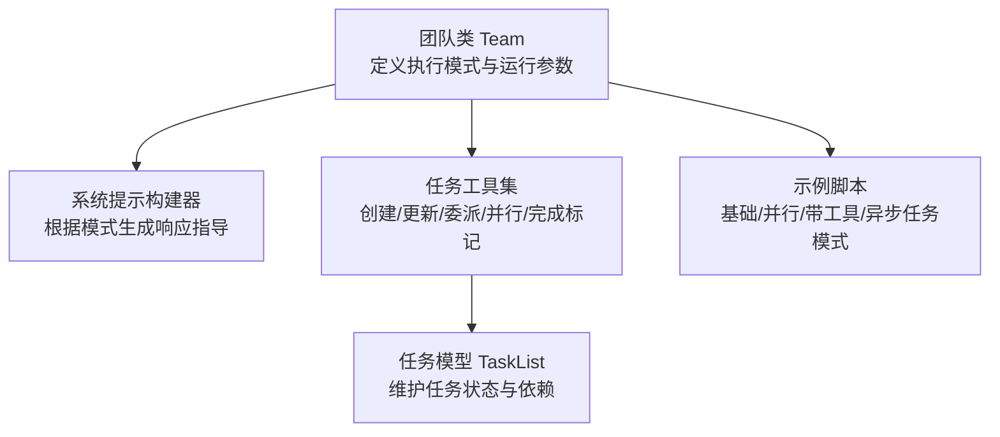
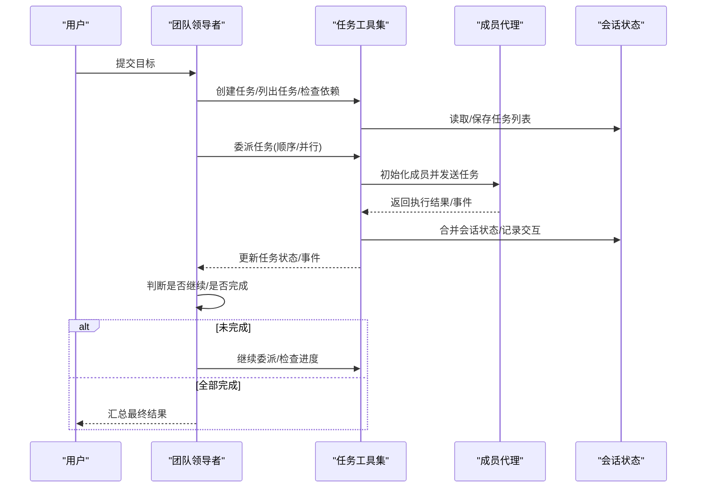
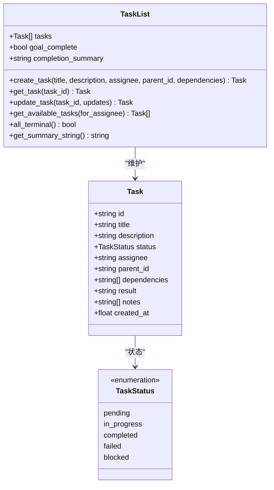
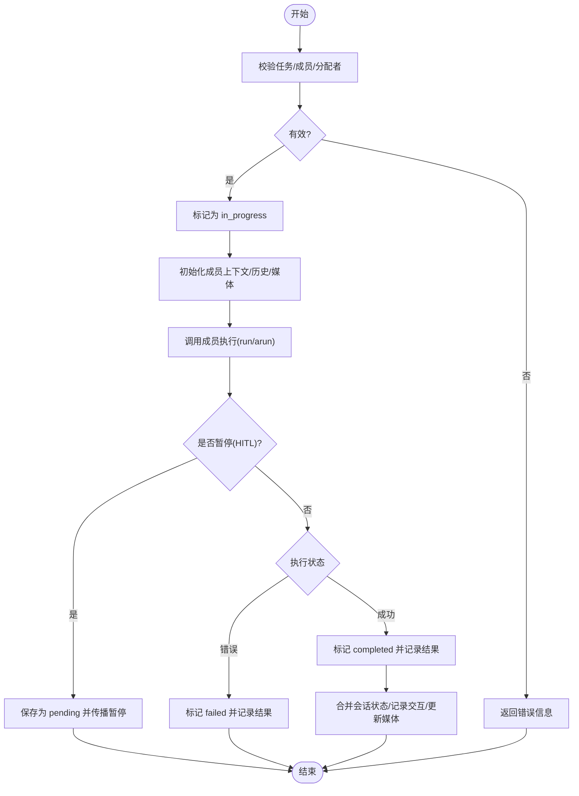
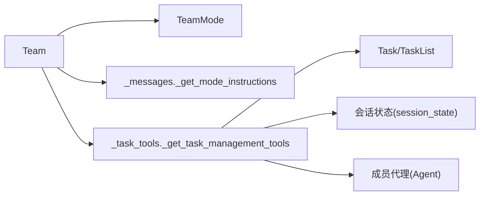

# 任务模式

<cite>
**本文引用的文件**
- [libs/agno/agno/team/team.py](file://libs/agno/agno/team/team.py)
- [libs/agno/agno/team/mode.py](file://libs/agno/agno/team/mode.py)
- [libs/agno/agno/team/_messages.py](file://libs/agno/agno/team/_messages.py)
- [libs/agno/agno/team/_task_tools.py](file://libs/agno/agno/team/_task_tools.py)
- [libs/agno/agno/team/task.py](file://libs/agno/agno/team/task.py)
- [cookbook/03_teams/01_quickstart/task_mode.py](file://cookbook/03_teams/01_quickstart/task_mode.py)
- [cookbook/03_teams/02_modes/tasks/04_basic_task_mode.py](file://cookbook/03_teams/02_modes/tasks/04_basic_task_mode.py)
- [cookbook/03_teams/02_modes/tasks/05_parallel_tasks.py](file://cookbook/03_teams/02_modes/tasks/05_parallel_tasks.py)
- [cookbook/03_teams/02_modes/tasks/06_task_mode_with_tools.py](file://cookbook/03_teams/02_modes/tasks/06_task_mode_with_tools.py)
- [cookbook/03_teams/02_modes/tasks/07_async_task_mode.py](file://cookbook/03_teams/02_modes/tasks/07_async_task_mode.py)
- [cookbook/03_teams/01_quickstart/task_mode.md](file://cookbook/03_teams/01_quickstart/task_mode.md)
</cite>

## 目录
1. [简介](#简介)
2. [项目结构](#项目结构)
3. [核心组件](#核心组件)
4. [架构总览](#架构总览)
5. [详细组件分析](#详细组件分析)
6. [依赖分析](#依赖分析)
7. [性能考虑](#性能考虑)
8. [故障排查指南](#故障排查指南)
9. [结论](#结论)
10. [附录](#附录)

## 简介
任务模式是团队执行的最高自治形态：由团队领导者将用户目标自动拆解为离散任务，通过专用工具委派给成员并持续循环，直至所有任务完成。该模式强调“自主执行、任务分解、进度跟踪、并行处理”等能力，适用于需要复杂任务分解与进度管理的项目。

## 项目结构
围绕任务模式的关键代码分布在以下模块：
- 团队与模式定义：team.py、mode.py
- 系统提示与模式指令：_messages.py
- 任务模型与任务列表：task.py
- 任务工具集（创建/更新/委派/并行/完成标记等）：_task_tools.py
- 示例与使用方式：cookbook 中多份示例脚本

图表来源
- [libs/agno/agno/team/team.py:70-112](file://libs/agno/agno/team/team.py#L70-L112)
- [libs/agno/agno/team/_messages.py:120-195](file://libs/agno/agno/team/_messages.py#L120-L195)
- [libs/agno/agno/team/_task_tools.py:55-74](file://libs/agno/agno/team/_task_tools.py#L55-L74)
- [libs/agno/agno/team/task.py:78-108](file://libs/agno/agno/team/task.py#L78-L108)
- [cookbook/03_teams/02_modes/tasks/04_basic_task_mode.py:59-74](file://cookbook/03_teams/02_modes/tasks/04_basic_task_mode.py#L59-L74)

章节来源
- [libs/agno/agno/team/team.py:70-112](file://libs/agno/agno/team/team.py#L70-L112)
- [libs/agno/agno/team/mode.py:6-23](file://libs/agno/agno/team/mode.py#L6-L23)
- [libs/agno/agno/team/_messages.py:120-195](file://libs/agno/agno/team/_messages.py#L120-L195)
- [libs/agno/agno/team/_task_tools.py:55-74](file://libs/agno/agno/team/_task_tools.py#L55-L74)
- [libs/agno/agno/team/task.py:78-108](file://libs/agno/agno/team/task.py#L78-L108)
- [cookbook/03_teams/02_modes/tasks/04_basic_task_mode.py:59-74](file://cookbook/03_teams/02_modes/tasks/04_basic_task_mode.py#L59-L74)

## 核心组件
- Team 类与 TeamMode
  - Team 提供 mode、max_iterations 等关键配置，控制团队在任务模式下的行为。
  - TeamMode 定义了 coordinate、route、broadcast、tasks 等执行模式，其中 tasks 即任务模式。
- 系统提示与模式指令
  - _get_mode_instructions 根据 TeamMode 生成“如何响应”的指导，任务模式强调“规划—执行—完成”的闭环。
- 任务模型与任务列表
  - Task/TaskList 提供任务的增删改查、依赖管理、阻塞状态计算与序列化。
- 任务工具集
  - 提供 create_task、update_task_status、list_tasks、add_task_note、mark_all_complete、execute_task、execute_tasks_parallel、aexecute_task 等工具，支撑任务全生命周期管理与执行。

章节来源
- [libs/agno/agno/team/team.py:70-112](file://libs/agno/agno/team/team.py#L70-L112)
- [libs/agno/agno/team/mode.py:6-23](file://libs/agno/agno/team/mode.py#L6-L23)
- [libs/agno/agno/team/_messages.py:127-147](file://libs/agno/agno/team/_messages.py#L127-L147)
- [libs/agno/agno/team/task.py:22-71](file://libs/agno/agno/team/task.py#L22-L71)
- [libs/agno/agno/team/task.py:78-108](file://libs/agno/agno/team/task.py#L78-L108)
- [libs/agno/agno/team/_task_tools.py:141-178](file://libs/agno/agno/team/_task_tools.py#L141-L178)
- [libs/agno/agno/team/_task_tools.py:234-240](file://libs/agno/agno/team/_task_tools.py#L234-L240)
- [libs/agno/agno/team/_task_tools.py:245-259](file://libs/agno/agno/team/_task_tools.py#L245-L259)
- [libs/agno/agno/team/_task_tools.py:264-275](file://libs/agno/agno/team/_task_tools.py#L264-L275)
- [libs/agno/agno/team/_task_tools.py:366-504](file://libs/agno/agno/team/_task_tools.py#L366-L504)
- [libs/agno/agno/team/_task_tools.py:508-646](file://libs/agno/agno/team/_task_tools.py#L508-L646)
- [libs/agno/agno/team/_task_tools.py:650-805](file://libs/agno/agno/team/_task_tools.py#L650-L805)

## 架构总览
任务模式的运行流程可抽象为：领导者基于用户目标生成任务清单，按依赖与可用性选择下一个可执行任务，委派给成员执行，收集结果并更新任务状态，循环直至全部完成或达到最大迭代次数。

图表来源
- [libs/agno/agno/team/_task_tools.py:366-504](file://libs/agno/agno/team/_task_tools.py#L366-L504)
- [libs/agno/agno/team/_task_tools.py:650-805](file://libs/agno/agno/team/_task_tools.py#L650-L805)
- [libs/agno/agno/team/task.py:109-148](file://libs/agno/agno/team/task.py#L109-L148)
- [libs/agno/agno/team/_messages.py:127-147](file://libs/agno/agno/team/_messages.py#L127-L147)

## 详细组件分析

### 组件一：任务模型与依赖管理
- 数据结构
  - Task：包含 id、title、description、status、assignee、dependencies、result、notes、created_at 等字段。
  - TaskList：维护任务集合、全局完成标志与摘要，并提供 CRUD、查询、依赖管理与序列化。
- 关键算法
  - 可用任务筛选：仅返回 pending 且依赖满足的任务。
  - 阻塞状态重算：当依赖失败时自动将被依赖任务标记为失败；当依赖解除时恢复为 pending。
  - 终止条件判断：所有任务进入终止态（completed 或 failed）时判定整体完成。
- 复杂度
  - 依赖检查与阻塞重算对每个 pending/blocked 任务遍历其依赖，时间复杂度 O(N+D)，N 为任务数，D 为依赖边数。

图表来源
- [libs/agno/agno/team/task.py:22-71](file://libs/agno/agno/team/task.py#L22-L71)
- [libs/agno/agno/team/task.py:78-108](file://libs/agno/agno/team/task.py#L78-L108)
- [libs/agno/agno/team/task.py:131-142](file://libs/agno/agno/team/task.py#L131-L142)
- [libs/agno/agno/team/task.py:184-223](file://libs/agno/agno/team/task.py#L184-L223)

章节来源
- [libs/agno/agno/team/task.py:22-71](file://libs/agno/agno/team/task.py#L22-L71)
- [libs/agno/agno/team/task.py:78-108](file://libs/agno/agno/team/task.py#L78-L108)
- [libs/agno/agno/team/task.py:131-142](file://libs/agno/agno/team/task.py#L131-L142)
- [libs/agno/agno/team/task.py:184-223](file://libs/agno/agno/team/task.py#L184-L223)

### 组件二：任务工具集（任务生命周期与执行）
- 工具职责
  - 任务管理：create_task、update_task_status、list_tasks、add_task_note、mark_all_complete。
  - 任务执行：execute_task（同步）、aexecute_task（异步）、execute_tasks_parallel（并行）。
  - 事件与会话：事件发射、成员交互记录、会话状态合并、媒体资源传递。
- 执行流程（顺序任务）
  - 校验任务与成员有效性，更新任务状态为 in_progress，初始化成员上下文，调用成员 run/arun，处理暂停、错误与成功分支，回写任务状态与结果，合并会话状态。
- 执行流程（并行任务）
  - 校验所有任务与成员，批量标记为 in_progress，线程池并发执行，汇总结果与事件，分别处理暂停、错误与成功，回写状态。

图表来源
- [libs/agno/agno/team/_task_tools.py:366-504](file://libs/agno/agno/team/_task_tools.py#L366-L504)
- [libs/agno/agno/team/_task_tools.py:508-646](file://libs/agno/agno/team/_task_tools.py#L508-L646)
- [libs/agno/agno/team/_task_tools.py:650-805](file://libs/agno/agno/team/_task_tools.py#L650-L805)

章节来源
- [libs/agno/agno/team/_task_tools.py:141-178](file://libs/agno/agno/team/_task_tools.py#L141-L178)
- [libs/agno/agno/team/_task_tools.py:182-230](file://libs/agno/agno/team/_task_tools.py#L182-L230)
- [libs/agno/agno/team/_task_tools.py:234-240](file://libs/agno/agno/team/_task_tools.py#L234-L240)
- [libs/agno/agno/team/_task_tools.py:245-259](file://libs/agno/agno/team/_task_tools.py#L245-L259)
- [libs/agno/agno/team/_task_tools.py:264-275](file://libs/agno/agno/team/_task_tools.py#L264-L275)
- [libs/agno/agno/team/_task_tools.py:366-504](file://libs/agno/agno/team/_task_tools.py#L366-L504)
- [libs/agno/agno/team/_task_tools.py:508-646](file://libs/agno/agno/team/_task_tools.py#L508-L646)
- [libs/agno/agno/team/_task_tools.py:650-805](file://libs/agno/agno/team/_task_tools.py#L650-L805)

### 组件三：系统提示与模式指令
- 模式指令
  - 任务模式的系统提示强调“将目标拆分为离散任务、委派给成员、审查结果、在完成后标记完成”，并给出规划、执行、完成阶段的具体建议。
- 指令注入
  - _get_mode_instructions 根据 Team.mode 动态拼接相应模式的指导文本，确保领导者具备正确的执行范式。

章节来源
- [libs/agno/agno/team/_messages.py:127-147](file://libs/agno/agno/team/_messages.py#L127-L147)

### 组件四：示例与用法
- 基础任务模式
  - 展示团队以任务模式运行，领导者将目标分解为研究、设计、写作等任务并委派执行，最后汇总输出。
- 并行任务
  - 展示使用 execute_tasks_parallel 并发执行相互独立的任务，提升吞吐。
- 带工具的任务
  - 成员具备真实工具（如网络搜索），任务之间通过依赖关系串联。
- 异步任务
  - 使用异步 API（arun/aprint_response）进行非阻塞执行，适合服务端场景。

章节来源
- [cookbook/03_teams/01_quickstart/task_mode.py:36-58](file://cookbook/03_teams/01_quickstart/task_mode.py#L36-L58)
- [cookbook/03_teams/02_modes/tasks/04_basic_task_mode.py:59-74](file://cookbook/03_teams/02_modes/tasks/04_basic_task_mode.py#L59-L74)
- [cookbook/03_teams/02_modes/tasks/05_parallel_tasks.py:54-70](file://cookbook/03_teams/02_modes/tasks/05_parallel_tasks.py#L54-L70)
- [cookbook/03_teams/02_modes/tasks/06_task_mode_with_tools.py:48-63](file://cookbook/03_teams/02_modes/tasks/06_task_mode_with_tools.py#L48-L63)
- [cookbook/03_teams/02_modes/tasks/07_async_task_mode.py:58-74](file://cookbook/03_teams/02_modes/tasks/07_async_task_mode.py#L58-L74)

## 依赖分析
- 组件耦合
  - Team 依赖模式定义与系统提示构建器，用于生成领导者的行为指导。
  - 任务工具集依赖任务模型与会话状态，负责任务生命周期与成员交互。
  - 任务模型独立于具体执行，便于持久化与跨会话复用。
- 外部依赖
  - 成员代理（Agent）的执行接口（run/arun）与事件流，任务工具集负责桥接与转发。
  - 会话状态（session_state）作为共享存储，贯穿任务创建、更新与最终汇总。

图表来源
- [libs/agno/agno/team/team.py:98-108](file://libs/agno/agno/team/team.py#L98-L108)
- [libs/agno/agno/team/mode.py:6-23](file://libs/agno/agno/team/mode.py#L6-L23)
- [libs/agno/agno/team/_messages.py:127-147](file://libs/agno/agno/team/_messages.py#L127-L147)
- [libs/agno/agno/team/_task_tools.py:55-74](file://libs/agno/agno/team/_task_tools.py#L55-L74)
- [libs/agno/agno/team/task.py:78-108](file://libs/agno/agno/team/task.py#L78-L108)

章节来源
- [libs/agno/agno/team/team.py:98-108](file://libs/agno/agno/team/team.py#L98-L108)
- [libs/agno/agno/team/_task_tools.py:55-74](file://libs/agno/agno/team/_task_tools.py#L55-L74)
- [libs/agno/agno/team/task.py:78-108](file://libs/agno/agno/team/task.py#L78-L108)

## 性能考虑
- 并行执行
  - 对相互独立的任务使用 execute_tasks_parallel，结合线程池并发执行，显著缩短总耗时。
- 依赖管理
  - 合理设置 depends_on，避免不必要的串行，最大化并行度。
- 会话状态合并
  - 仅在必要时合并成员会话状态，减少大对象拷贝与写入开销。
- 事件与媒体
  - 控制附加媒体数量与类型，避免在高并发场景中造成内存压力。
- 最大迭代保护
  - max_iterations 防止无限循环，建议根据任务规模合理设置上限。

## 故障排查指南
- 任务无法执行
  - 检查任务状态是否为 pending/in_progress；确认 assignee 是否已分配；核对依赖是否满足。
- 成员执行异常
  - 观察返回的错误状态与结果，定位成员执行问题；必要时重新委派或调整任务描述。
- 任务被阻塞
  - 检查依赖任务是否失败；若失败则会被自动标记为 failed；修复上游任务后阻塞状态会恢复。
- 会话状态不一致
  - 确认任务工具在执行后正确合并会话状态；避免在并发场景下直接共享可变状态。
- HITL 暂停
  - 当成员返回暂停信号时，任务状态回退为 pending，等待人工干预后重试。

章节来源
- [libs/agno/agno/team/_task_tools.py:381-383](file://libs/agno/agno/team/_task_tools.py#L381-L383)
- [libs/agno/agno/team/_task_tools.py:468-476](file://libs/agno/agno/team/_task_tools.py#L468-L476)
- [libs/agno/agno/team/_task_tools.py:612-619](file://libs/agno/agno/team/_task_tools.py#L612-L619)
- [libs/agno/agno/team/task.py:184-223](file://libs/agno/agno/team/task.py#L184-L223)

## 结论
任务模式通过“任务分解—委派执行—进度跟踪—循环收敛”的闭环，实现了高度自治的团队协作。借助任务模型与工具集，团队能够在复杂目标面前保持清晰的进度可见性与可控的执行节奏。配合并行执行与依赖管理，可在保证质量的同时提升整体效率。对于需要复杂任务分解与进度管理的项目，任务模式是优先选择。

## 附录
- 适用场景
  - 需要将复杂目标拆解为多步骤、多角色协作的任务清单。
  - 对执行过程有强跟踪需求，需实时查看任务状态与结果。
  - 存在明确的先后依赖关系，但同时存在可并行的子任务。
- 与其他模式的区别与选择
  - coordinate：由领导者统一协调与合成，适合需要集中决策与整合的场景。
  - route：单点路由到专家，适合单一领域问题。
  - broadcast：向全体成员广播任务，适合多视角对比与综合。
  - tasks：自主循环、任务驱动，适合复杂、长周期、多依赖的项目。
- 设计原则
  - 任务粒度适中，职责单一；明确依赖关系；为成员提供完整上下文；及时记录任务备注与观察。
- 错误处理与优化
  - 使用 max_iterations 防护；利用 mark_all_complete 正常退出；在失败时回退状态并重试或重排计划；在并发场景下谨慎合并会话状态与媒体资源。