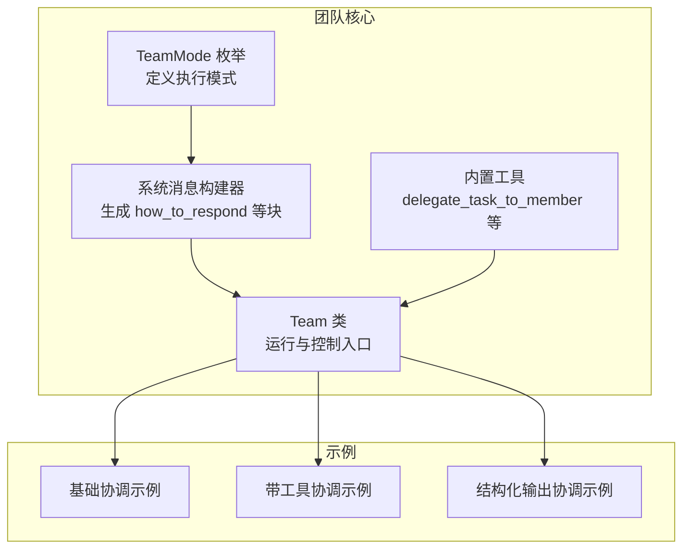
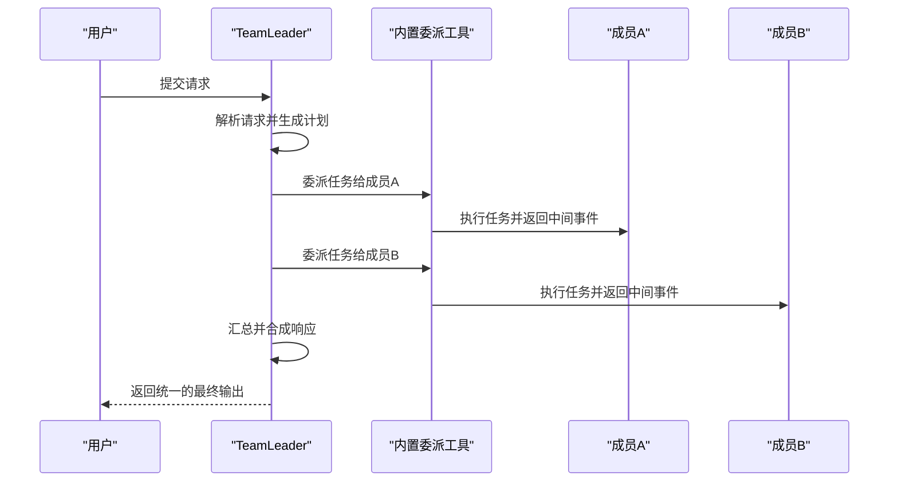
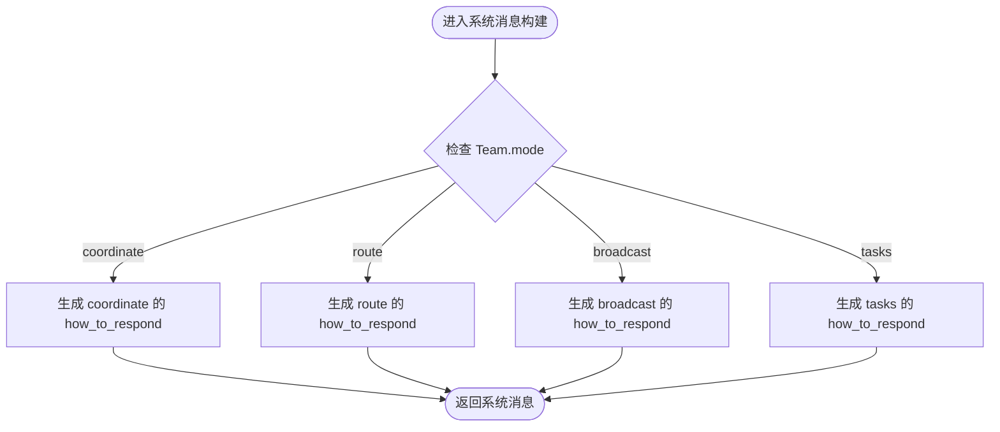
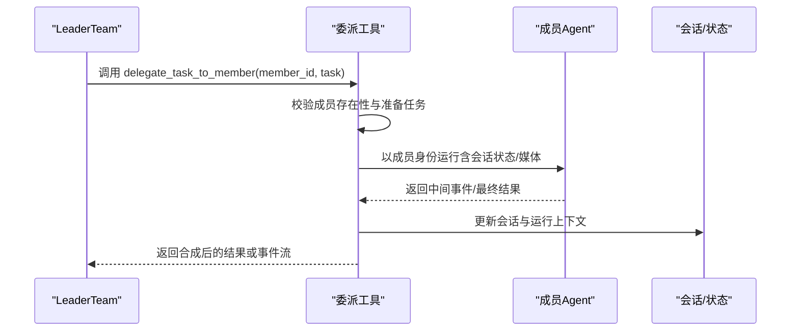
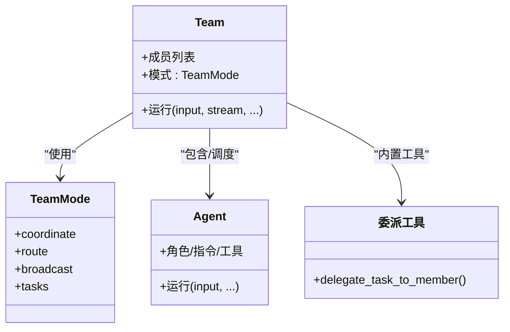
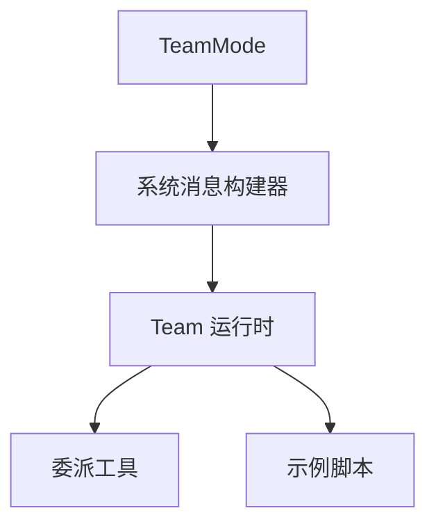

# 协调模式

<cite>
**本文引用的文件**
- [libs/agno/agno/team/mode.py](file://libs/agno/agno/team/mode.py)
- [libs/agno/agno/team/_messages.py](file://libs/agno/agno/team/_messages.py)
- [libs/agno/agno/team/_default_tools.py](file://libs/agno/agno/team/_default_tools.py)
- [libs/agno/agno/team/team.py](file://libs/agno/agno/team/team.py)
- [cookbook/03_teams/02_modes/coordinate/01_basic.py](file://cookbook/03_teams/02_modes/coordinate/01_basic.py)
- [cookbook/03_teams/02_modes/coordinate/02_with_tools.py](file://cookbook/03_teams/02_modes/coordinate/02_with_tools.py)
- [cookbook/03_teams/02_modes/coordinate/03_structured_output.py](file://cookbook/03_teams/02_modes/coordinate/03_structured_output.py)
- [cookbook/03_teams/01_quickstart/01_basic_coordination.md](file://cookbook/03_teams/01_quickstart/01_basic_coordination.md)
- [cookbook/03_teams/02_modes/coordinate/README.md](file://cookbook/03_teams/02_modes/coordinate/README.md)
</cite>

## 目录
1. [简介](#简介)
2. [项目结构](#项目结构)
3. [核心组件](#核心组件)
4. [架构总览](#架构总览)
5. [详细组件分析](#详细组件分析)
6. [依赖分析](#依赖分析)
7. [性能考虑](#性能考虑)
8. [故障排查指南](#故障排查指南)
9. [结论](#结论)
10. [附录](#附录)

## 简介
协调模式（coordinate mode）是团队的默认监督者模式，由团队领导者（Leader）统一调度成员（Agent 或子团队），完成任务选择、任务委派、响应合成与最终输出。该模式强调集中控制、统一决策与响应合成，适用于需要明确分工、跨领域协作与高质量整合输出的场景。

## 项目结构
围绕协调模式的相关实现分布在以下位置：
- 团队模式定义与系统提示生成：libs/agno/agno/team/mode.py、libs/agno/agno/team/_messages.py
- 内置委派工具与成员交互流程：libs/agno/agno/team/_default_tools.py
- 团队类与运行时控制：libs/agno/agno/team/team.py
- 示例与使用说明：cookbook/03_teams/02_modes/coordinate/*.py 及相关文档

图表来源
- [libs/agno/agno/team/mode.py:6-24](file://libs/agno/agno/team/mode.py#L6-L24)
- [libs/agno/agno/team/_messages.py:120-195](file://libs/agno/agno/team/_messages.py#L120-L195)
- [libs/agno/agno/team/_default_tools.py:538-750](file://libs/agno/agno/team/_default_tools.py#L538-L750)
- [libs/agno/agno/team/team.py:719-800](file://libs/agno/agno/team/team.py#L719-L800)

章节来源
- [libs/agno/agno/team/mode.py:6-24](file://libs/agno/agno/team/mode.py#L6-L24)
- [libs/agno/agno/team/_messages.py:120-195](file://libs/agno/agno/team/_messages.py#L120-L195)
- [libs/agno/agno/team/team.py:719-800](file://libs/agno/agno/team/team.py#L719-L800)

## 核心组件
- TeamMode 枚举：定义 coordinate、route、broadcast、tasks 等模式，coordinate 为默认监督者模式。
- 系统消息构建器：根据模式动态生成 how_to_respond 指令，指导 Leader 如何选择成员、委派任务与合成响应。
- 内置委派工具：提供 delegate_task_to_member 等工具，供 Leader 在运行时委派任务给成员并收集结果。
- Team 类：封装运行时上下文、会话状态、工具与钩子，协调成员执行并进行响应合成。

章节来源
- [libs/agno/agno/team/mode.py:6-24](file://libs/agno/agno/team/mode.py#L6-L24)
- [libs/agno/agno/team/_messages.py:120-195](file://libs/agno/agno/team/_messages.py#L120-L195)
- [libs/agno/agno/team/_default_tools.py:538-750](file://libs/agno/agno/team/_default_tools.py#L538-L750)
- [libs/agno/agno/team/team.py:719-800](file://libs/agno/agno/team/team.py#L719-L800)

## 架构总览
协调模式的运行流程如下：
- Leader 接收用户输入，基于系统消息中的 how_to_respond 指令进行分析与规划。
- 依据请求特性与成员角色/工具，选择合适成员并委派任务。
- 收集成员响应，进行去重、对齐、补充与结构化整合，形成统一的最终输出。

图表来源
- [libs/agno/agno/team/_messages.py:175-192](file://libs/agno/agno/team/_messages.py#L175-L192)
- [libs/agno/agno/team/_default_tools.py:538-750](file://libs/agno/agno/team/_default_tools.py#L538-L750)

## 详细组件分析

### 组件A：TeamMode 与系统提示
- TeamMode.coordinate 定义了“默认监督者模式”，强调“选择成员、编写任务、合成响应”的统一流程。
- 系统消息构建器根据模式生成 how_to_respond，其中 coordinate 模式包含：
  - 成员匹配原则：按角色与工具适配度选择成员
  - 任务描述要求：自包含、提供上下文、明确期望结果
  - 合成策略：综合多成员输出，解决矛盾、填补空白、添加结构

图表来源
- [libs/agno/agno/team/mode.py:6-24](file://libs/agno/agno/team/mode.py#L6-L24)
- [libs/agno/agno/team/_messages.py:120-195](file://libs/agno/agno/team/_messages.py#L120-L195)

章节来源
- [libs/agno/agno/team/mode.py:6-24](file://libs/agno/agno/team/mode.py#L6-L24)
- [libs/agno/agno/team/_messages.py:120-195](file://libs/agno/agno/team/_messages.py#L120-L195)

### 组件B：内置委派工具 delegate_task_to_member
- 工具职责：根据成员 ID 与任务描述，将任务委派给指定成员；支持同步与异步两种执行路径。
- 关键流程：
  - 查找成员并准备任务与历史上下文
  - 以成员身份运行，透传会话状态与媒体资源
  - 处理暂停（人工介入）、存储与回传事件
  - 更新团队运行上下文与会话状态

图表来源
- [libs/agno/agno/team/_default_tools.py:538-750](file://libs/agno/agno/team/_default_tools.py#L538-L750)

章节来源
- [libs/agno/agno/team/_default_tools.py:538-750](file://libs/agno/agno/team/_default_tools.py#L538-L750)

### 组件C：协调模式示例（基础/工具/结构化输出）
- 基础协调示例：展示 Leader 先让研究员收集信息，再让写作者润色，最终合成统一输出。
- 带工具协调示例：成员具备专用工具（如新闻检索、网络搜索），Leader 根据需求路由到合适成员。
- 结构化输出协调示例：Leader 协调市场与风险分析师，将结果整合为结构化模型。

图表来源
- [cookbook/03_teams/02_modes/coordinate/01_basic.py:12-72](file://cookbook/03_teams/02_modes/coordinate/01_basic.py#L12-L72)
- [cookbook/03_teams/02_modes/coordinate/02_with_tools.py:9-72](file://cookbook/03_teams/02_modes/coordinate/02_with_tools.py#L9-L72)
- [cookbook/03_teams/02_modes/coordinate/03_structured_output.py:11-87](file://cookbook/03_teams/02_modes/coordinate/03_structured_output.py#L11-L87)
- [libs/agno/agno/team/mode.py:6-24](file://libs/agno/agno/team/mode.py#L6-L24)

章节来源
- [cookbook/03_teams/02_modes/coordinate/01_basic.py:12-72](file://cookbook/03_teams/02_modes/coordinate/01_basic.py#L12-L72)
- [cookbook/03_teams/02_modes/coordinate/02_with_tools.py:9-72](file://cookbook/03_teams/02_modes/coordinate/02_with_tools.py#L9-L72)
- [cookbook/03_teams/02_modes/coordinate/03_structured_output.py:11-87](file://cookbook/03_teams/02_modes/coordinate/03_structured_output.py#L11-L87)

## 依赖分析
- TeamMode.coordinate 依赖系统消息构建器生成的 how_to_respond 指令，驱动 Leader 的决策与合成策略。
- Team 类在运行时加载成员、会话与工具，调用内置委派工具完成任务委派与结果聚合。
- 示例脚本展示了不同场景下的配置差异：是否启用工具、是否使用结构化输出、是否显示成员响应等。

图表来源
- [libs/agno/agno/team/mode.py:6-24](file://libs/agno/agno/team/mode.py#L6-L24)
- [libs/agno/agno/team/_messages.py:120-195](file://libs/agno/agno/team/_messages.py#L120-L195)
- [libs/agno/agno/team/team.py:719-800](file://libs/agno/agno/team/team.py#L719-L800)
- [libs/agno/agno/team/_default_tools.py:538-750](file://libs/agno/agno/team/_default_tools.py#L538-L750)

章节来源
- [libs/agno/agno/team/mode.py:6-24](file://libs/agno/agno/team/mode.py#L6-L24)
- [libs/agno/agno/team/_messages.py:120-195](file://libs/agno/agno/team/_messages.py#L120-L195)
- [libs/agno/agno/team/team.py:719-800](file://libs/agno/agno/team/team.py#L719-L800)
- [libs/agno/agno/team/_default_tools.py:538-750](file://libs/agno/agno/team/_default_tools.py#L538-L750)

## 性能考虑
- 流式输出：示例中支持流式输出，可提升交互体验与感知延迟。
- 会话状态与历史：合理设置 add_session_state_to_context、num_history_runs 等参数，避免上下文冗余导致的性能下降。
- 工具调用限制：通过 tool_call_limit 控制工具调用次数，防止过度消耗。
- 并发与暂停：在委派工具中处理成员暂停（人工介入）与事件传播，确保流程可控。

## 故障排查指南
- 成员未找到：当委派成员 ID 错误时，委派工具会返回可用成员列表提示，需核对成员 ID。
- 无响应或空结果：检查成员是否正确返回内容或工具调用结果，必要时调整任务描述与期望输出。
- 合成偏差：若合成结果质量不佳，可优化 Leader 的 how_to_respond 指令与成员任务拆分策略。

章节来源
- [libs/agno/agno/team/_default_tools.py:538-750](file://libs/agno/agno/team/_default_tools.py#L538-L750)

## 结论
协调模式通过“集中控制、统一决策、响应合成”实现高效的团队协作，适合需要明确分工与高质量整合输出的任务。结合内置委派工具与系统消息构建器，开发者可快速搭建从基础到结构化输出的多种协调场景。

## 附录

### 配置参数说明（节选）
- Team.mode：执行模式，默认 coordinate
- Team.instructions：协调指令，用于指导 Leader 的委派与合成策略
- Team.markdown：是否启用 Markdown 格式化
- Team.show_members_responses：是否显示成员响应
- Team.output_schema：结构化输出的 Pydantic 模型
- Team.tool_call_limit：工具调用上限
- Team.stream/stream_events：是否开启流式输出与事件流

章节来源
- [libs/agno/agno/team/team.py:97-172](file://libs/agno/agno/team/team.py#L97-L172)
- [libs/agno/agno/team/_messages.py:254-325](file://libs/agno/agno/team/_messages.py#L254-L325)
- [cookbook/03_teams/02_modes/coordinate/01_basic.py:47-60](file://cookbook/03_teams/02_modes/coordinate/01_basic.py#L47-L60)
- [cookbook/03_teams/02_modes/coordinate/02_with_tools.py:46-60](file://cookbook/03_teams/02_modes/coordinate/02_with_tools.py#L46-L60)
- [cookbook/03_teams/02_modes/coordinate/03_structured_output.py:58-71](file://cookbook/03_teams/02_modes/coordinate/03_structured_output.py#L58-L71)

### 适用场景
- 需要统一决策与响应合成的任务
- 跨领域协作（如研究+写作、市场+风险分析）
- 对最终输出格式与质量有较高要求的场景

### 与其他模式的区别与选择标准
- coordinate：默认监督者模式，适合需要统一决策与合成的场景
- route：单成员路由，适合单一专家即可解决的问题
- broadcast：全体成员并行响应，适合多视角对比与综合
- tasks：自主任务分解与执行，适合复杂目标的迭代推进

章节来源
- [libs/agno/agno/team/mode.py:6-24](file://libs/agno/agno/team/mode.py#L6-L24)
- [libs/agno/agno/team/_messages.py:120-195](file://libs/agno/agno/team/_messages.py#L120-L195)