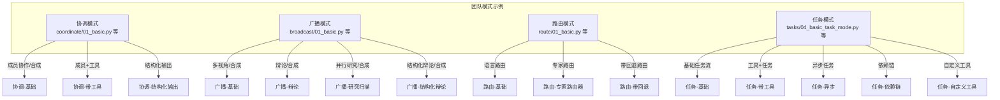
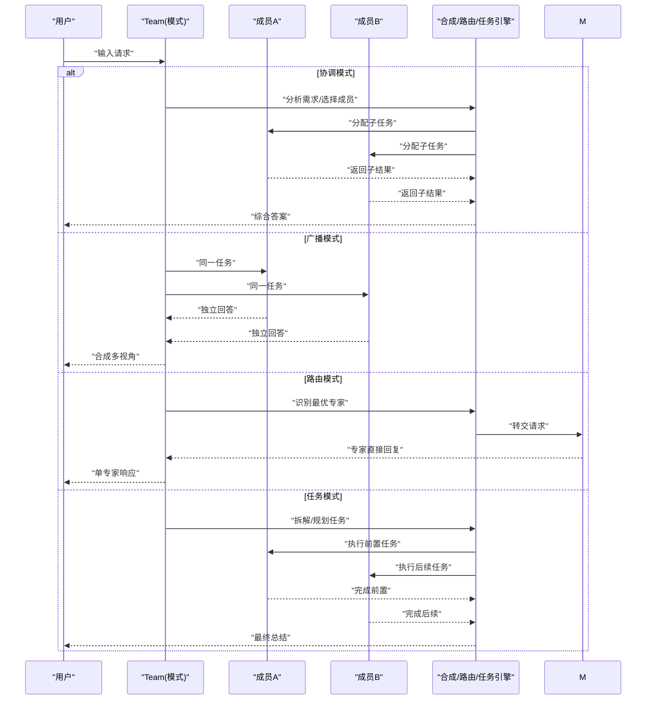
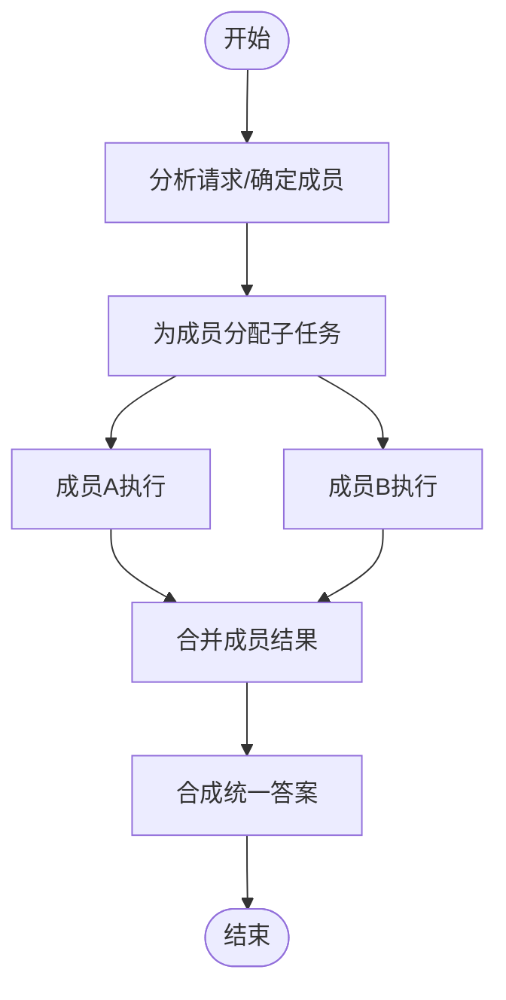
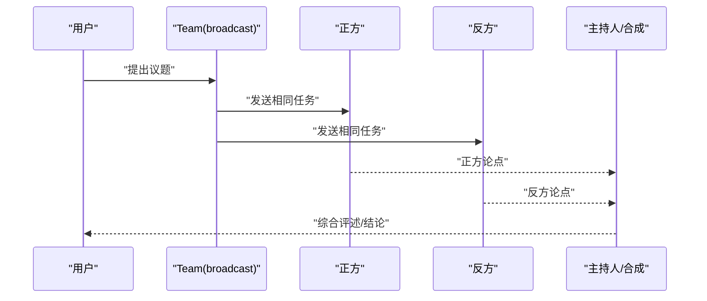
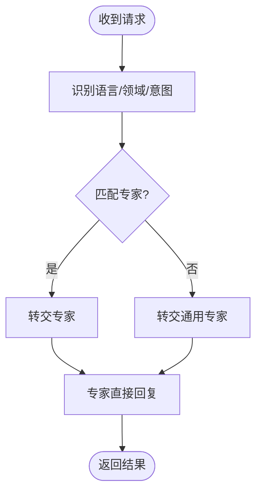
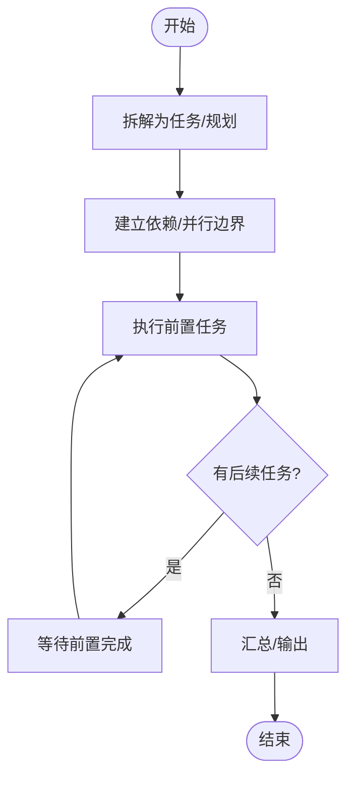
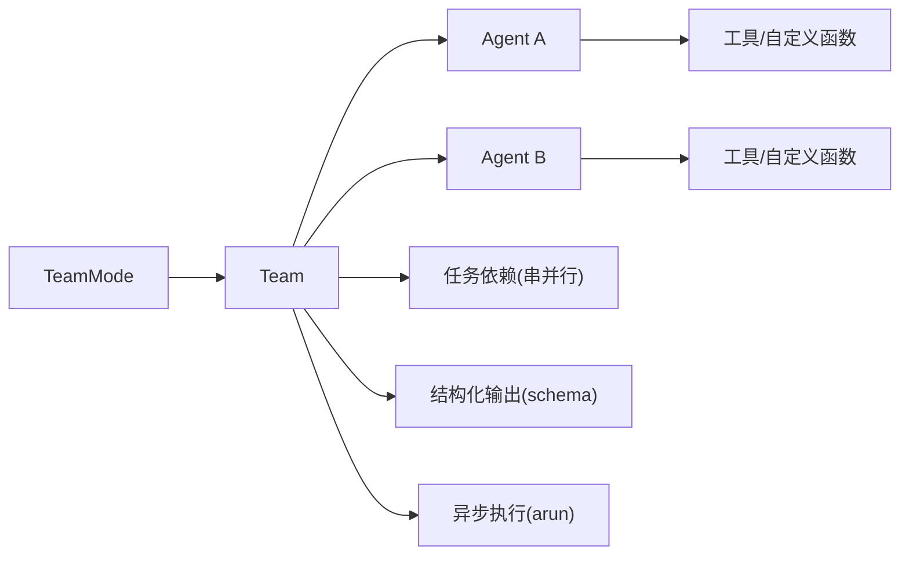

# 团队模式

<cite>
**本文引用的文件**
- [cookbook/03_teams/02_modes/coordinate/01_basic.py](file://cookbook/03_teams/02_modes/coordinate/01_basic.py)
- [cookbook/03_teams/02_modes/coordinate/02_with_tools.py](file://cookbook/03_teams/02_modes/coordinate/02_with_tools.py)
- [cookbook/03_teams/02_modes/coordinate/03_structured_output.py](file://cookbook/03_teams/02_modes/coordinate/03_structured_output.py)
- [cookbook/03_teams/02_modes/broadcast/01_basic.py](file://cookbook/03_teams/02_modes/broadcast/01_basic.py)
- [cookbook/03_teams/02_modes/broadcast/02_debate.py](file://cookbook/03_teams/02_modes/broadcast/02_debate.py)
- [cookbook/03_teams/02_modes/broadcast/03_research_sweep.py](file://cookbook/03_teams/02_modes/broadcast/03_research_sweep.py)
- [cookbook/03_teams/02_modes/broadcast/04_structured_debate.py](file://cookbook/03_teams/02_modes/broadcast/04_structured_debate.py)
- [cookbook/03_teams/02_modes/route/01_basic.py](file://cookbook/03_teams/02_modes/route/01_basic.py)
- [cookbook/03_teams/02_modes/route/02_specialist_router.py](file://cookbook/03_teams/02_modes/route/02_specialist_router.py)
- [cookbook/03_teams/02_modes/route/03_with_fallback.py](file://cookbook/03_teams/02_modes/route/03_with_fallback.py)
- [cookbook/03_teams/02_modes/tasks/04_basic_task_mode.py](file://cookbook/03_teams/02_modes/tasks/04_basic_task_mode.py)
- [cookbook/03_teams/02_modes/tasks/06_task_mode_with_tools.py](file://cookbook/03_teams/02_modes/tasks/06_task_mode_with_tools.py)
- [cookbook/03_teams/02_modes/tasks/07_async_task_mode.py](file://cookbook/03_teams/02_modes/tasks/07_async_task_mode.py)
- [cookbook/03_teams/02_modes/tasks/08_dependency_chain.py](file://cookbook/03_teams/02_modes/tasks/08_dependency_chain.py)
- [cookbook/03_teams/02_modes/tasks/09_custom_tools.py](file://cookbook/03_teams/02_modes/tasks/09_custom_tools.py)
</cite>

## 目录
1. [简介](#简介)
2. [项目结构](#项目结构)
3. [核心组件](#核心组件)
4. [架构总览](#架构总览)
5. [详细组件分析](#详细组件分析)
6. [依赖关系分析](#依赖关系分析)
7. [性能考量](#性能考量)
8. [故障排除指南](#故障排除指南)
9. [结论](#结论)
10. [附录](#附录)

## 简介
本文件系统性梳理团队模式（Team Modes）在示例代码中的实现与用法，覆盖以下五类模式：动态协调模式（coordinate）、广播模式（broadcast）、路由模式（route）、任务模式（tasks），以及它们的组合与进阶用法（如带工具、结构化输出、辩论、回退路由、异步执行、任务依赖链）。文档从工作原理、配置要点、优缺点、适用场景、模式间转换策略、性能与可靠性考量、到具体示例路径与排错建议，帮助读者快速掌握如何在不同业务目标下选择与编排团队模式。

## 项目结构
示例位于 cookbook/03_teams/02_modes 下，按模式分目录组织，每个模式包含若干典型用例脚本，便于直接运行与对比学习。

图表来源
- [cookbook/03_teams/02_modes/coordinate/01_basic.py:1-72](file://cookbook/03_teams/02_modes/coordinate/01_basic.py#L1-L72)
- [cookbook/03_teams/02_modes/broadcast/01_basic.py:1-82](file://cookbook/03_teams/02_modes/broadcast/01_basic.py#L1-L82)
- [cookbook/03_teams/02_modes/route/01_basic.py:1-77](file://cookbook/03_teams/02_modes/route/01_basic.py#L1-L77)
- [cookbook/03_teams/02_modes/tasks/04_basic_task_mode.py:1-85](file://cookbook/03_teams/02_modes/tasks/04_basic_task_mode.py#L1-L85)

章节来源
- [cookbook/03_teams/02_modes/coordinate/01_basic.py:1-72](file://cookbook/03_teams/02_modes/coordinate/01_basic.py#L1-L72)
- [cookbook/03_teams/02_modes/broadcast/01_basic.py:1-82](file://cookbook/03_teams/02_modes/broadcast/01_basic.py#L1-L82)
- [cookbook/03_teams/02_modes/route/01_basic.py:1-77](file://cookbook/03_teams/02_modes/route/01_basic.py#L1-L77)
- [cookbook/03_teams/02_modes/tasks/04_basic_task_mode.py:1-85](file://cookbook/03_teams/02_modes/tasks/04_basic_task_mode.py#L1-L85)

## 核心组件
- 团队模式枚举与团队类：示例通过 TeamMode 枚举指定模式，Team 负责成员编排、指令注入、响应合成与流式输出控制。
- 成员代理（Agent）：每个成员具备角色、模型与可选工具，承担具体子任务或视角。
- 工具系统：示例中使用 DuckDuckGoTools、HackerNewsTools 等，或自定义 @tool 装饰器函数，用于增强成员能力。
- 结构化输出：通过 output_schema 指定 Pydantic 模型，使最终结果符合固定结构。
- 异步执行：提供 arun/aprint_response 等异步接口，适合高并发服务端场景。
- 任务依赖：通过 depends_on 等机制构建串并行混合的任务流水线。

章节来源
- [cookbook/03_teams/02_modes/coordinate/01_basic.py:12-60](file://cookbook/03_teams/02_modes/coordinate/01_basic.py#L12-L60)
- [cookbook/03_teams/02_modes/broadcast/01_basic.py:12-71](file://cookbook/03_teams/02_modes/broadcast/01_basic.py#L12-L71)
- [cookbook/03_teams/02_modes/route/01_basic.py:12-58](file://cookbook/03_teams/02_modes/route/01_basic.py#L12-L58)
- [cookbook/03_teams/02_modes/tasks/04_basic_task_mode.py:13-74](file://cookbook/03_teams/02_modes/tasks/04_basic_task_mode.py#L13-L74)

## 架构总览
下图展示了五类模式在调用时的高层交互：请求进入 Team，根据模式类型分派到不同调度逻辑；协调/广播/路由模式侧重“谁来处理+如何合成”，任务模式侧重“分解任务+执行+汇总”。

图表来源
- [cookbook/03_teams/02_modes/coordinate/01_basic.py:47-60](file://cookbook/03_teams/02_modes/coordinate/01_basic.py#L47-L60)
- [cookbook/03_teams/02_modes/broadcast/01_basic.py:58-71](file://cookbook/03_teams/02_modes/broadcast/01_basic.py#L58-L71)
- [cookbook/03_teams/02_modes/route/01_basic.py:46-58](file://cookbook/03_teams/02_modes/route/01_basic.py#L46-L58)
- [cookbook/03_teams/02_modes/tasks/04_basic_task_mode.py:59-74](file://cookbook/03_teams/02_modes/tasks/04_basic_task_mode.py#L59-L74)

## 详细组件分析

### 动态协调模式（coordinate）
- 工作原理
  - 领导者分析请求，选择合适成员，为每个成员构造具体任务，最后将成员结果综合为统一答案。
  - 支持成员工具、结构化输出与多成员协同。
- 配置要点
  - 指定 mode=TeamMode.coordinate
  - 为团队与成员分别设置角色化指令
  - 可开启 show_members_responses 与 markdown 输出
  - 可通过 output_schema 指定结构化输出模型
- 优点
  - 统一合成，避免重复信息
  - 易于控制输出格式与质量
- 缺点
  - 合成成本与延迟取决于成员数量与合成复杂度
  - 对领导者指令依赖度较高
- 适用场景
  - 需要跨领域整合信息并形成统一结论的任务
- 示例路径
  - 基础协调：[cookbook/03_teams/02_modes/coordinate/01_basic.py:1-72](file://cookbook/03_teams/02_modes/coordinate/01_basic.py#L1-L72)
  - 带工具协调：[cookbook/03_teams/02_modes/coordinate/02_with_tools.py:1-72](file://cookbook/03_teams/02_modes/coordinate/02_with_tools.py#L1-L72)
  - 结构化输出协调：[cookbook/03_teams/02_modes/coordinate/03_structured_output.py:1-87](file://cookbook/03_teams/02_modes/coordinate/03_structured_output.py#L1-L87)

图表来源
- [cookbook/03_teams/02_modes/coordinate/01_basic.py:47-60](file://cookbook/03_teams/02_modes/coordinate/01_basic.py#L47-L60)

章节来源
- [cookbook/03_teams/02_modes/coordinate/01_basic.py:1-72](file://cookbook/03_teams/02_modes/coordinate/01_basic.py#L1-L72)
- [cookbook/03_teams/02_modes/coordinate/02_with_tools.py:1-72](file://cookbook/03_teams/02_modes/coordinate/02_with_tools.py#L1-L72)
- [cookbook/03_teams/02_modes/coordinate/03_structured_output.py:1-87](file://cookbook/03_teams/02_modes/coordinate/03_structured_output.py#L1-L87)

### 广播模式（broadcast）
- 工作原理
  - 将同一任务同时发送给所有成员，各自独立思考并输出，再由领导者进行合成。
  - 适合多视角、辩论、并行收集信息等场景。
- 配置要点
  - 指定 mode=TeamMode.broadcast
  - 可设置 markdown 与 show_members_responses
- 优点
  - 并行性强，能快速获得多角度观点
- 缺点
  - 合成负担较重，可能产生冗余信息
- 适用场景
  - 多视角分析、辩论、并行调研
- 示例路径
  - 广播-基础：[cookbook/03_teams/02_modes/broadcast/01_basic.py:1-82](file://cookbook/03_teams/02_modes/broadcast/01_basic.py#L1-L82)
  - 广播-辩论：[cookbook/03_teams/02_modes/broadcast/02_debate.py:1-73](file://cookbook/03_teams/02_modes/broadcast/02_debate.py#L1-L73)
  - 广播-研究扫描：[cookbook/03_teams/02_modes/broadcast/03_research_sweep.py:1-86](file://cookbook/03_teams/02_modes/broadcast/03_research_sweep.py#L1-L86)
  - 广播-结构化辩论：[cookbook/03_teams/02_modes/broadcast/04_structured_debate.py:1-39](file://cookbook/03_teams/02_modes/broadcast/04_structured_debate.py#L1-L39)

图表来源
- [cookbook/03_teams/02_modes/broadcast/02_debate.py:47-62](file://cookbook/03_teams/02_modes/broadcast/02_debate.py#L47-L62)

章节来源
- [cookbook/03_teams/02_modes/broadcast/01_basic.py:1-82](file://cookbook/03_teams/02_modes/broadcast/01_basic.py#L1-L82)
- [cookbook/03_teams/02_modes/broadcast/02_debate.py:1-73](file://cookbook/03_teams/02_modes/broadcast/02_debate.py#L1-L73)
- [cookbook/03_teams/02_modes/broadcast/03_research_sweep.py:1-86](file://cookbook/03_teams/02_modes/broadcast/03_research_sweep.py#L1-L86)
- [cookbook/03_teams/02_modes/broadcast/04_structured_debate.py:1-39](file://cookbook/03_teams/02_modes/broadcast/04_structured_debate.py#L1-L39)

### 路由模式（route）
- 工作原理
  - 根据请求特征（语言、领域、意图）将请求路由至最合适的专家成员，直接返回专家回答，不进行二次合成。
- 配置要点
  - 指定 mode=TeamMode.route
  - 为每个专家设定明确角色与指令
  - 可配置回退专家以兜底
- 优点
  - 低延迟、高专业性
- 缺点
  - 路由规则设计复杂度高
  - 不同专家口径一致性需额外治理
- 适用场景
  - 多语言/多领域路由、专家直连
- 示例路径
  - 路由-基础（语言）：[cookbook/03_teams/02_modes/route/01_basic.py:1-77](file://cookbook/03_teams/02_modes/route/01_basic.py#L1-L77)
  - 路由-专家路由器：[cookbook/03_teams/02_modes/route/02_specialist_router.py:1-79](file://cookbook/03_teams/02_modes/route/02_specialist_router.py#L1-L79)
  - 路由-带回退：[cookbook/03_teams/02_modes/route/03_with_fallback.py:1-90](file://cookbook/03_teams/02_modes/route/03_with_fallback.py#L1-L90)

图表来源
- [cookbook/03_teams/02_modes/route/01_basic.py:46-58](file://cookbook/03_teams/02_modes/route/01_basic.py#L46-L58)
- [cookbook/03_teams/02_modes/route/03_with_fallback.py:55-69](file://cookbook/03_teams/02_modes/route/03_with_fallback.py#L55-L69)

章节来源
- [cookbook/03_teams/02_modes/route/01_basic.py:1-77](file://cookbook/03_teams/02_modes/route/01_basic.py#L1-L77)
- [cookbook/03_teams/02_modes/route/02_specialist_router.py:1-79](file://cookbook/03_teams/02_modes/route/02_specialist_router.py#L1-L79)
- [cookbook/03_teams/02_modes/route/03_with_fallback.py:1-90](file://cookbook/03_teams/02_modes/route/03_with_fallback.py#L1-L90)

### 任务模式（tasks）
- 工作原理
  - 领导者自动将用户目标拆解为离散任务，分配给最合适成员执行，并在完成后进行汇总。
  - 支持并行与串行依赖、异步执行、工具调用与结构化输出。
- 配置要点
  - 指定 mode=TeamMode.tasks
  - 设置 max_iterations 控制迭代上限
  - 使用 depends_on 建立任务依赖链
  - 可启用异步 arun/aprint_response
- 优点
  - 自动化程度高，适合复杂流程编排
- 缺点
  - 任务拆解与依赖建模需要较多工程投入
  - 调试与可观测性要求更高
- 适用场景
  - 研发、产品发布、财务咨询等需要步骤化与质量把关的流程
- 示例路径
  - 任务-基础：[cookbook/03_teams/02_modes/tasks/04_basic_task_mode.py:1-85](file://cookbook/03_teams/02_modes/tasks/04_basic_task_mode.py#L1-L85)
  - 任务-带工具：[cookbook/03_teams/02_modes/tasks/06_task_mode_with_tools.py:1-74](file://cookbook/03_teams/02_modes/tasks/06_task_mode_with_tools.py#L1-L74)
  - 任务-异步：[cookbook/03_teams/02_modes/tasks/07_async_task_mode.py:1-93](file://cookbook/03_teams/02_modes/tasks/07_async_task_mode.py#L1-L93)
  - 任务-依赖链：[cookbook/03_teams/02_modes/tasks/08_dependency_chain.py:1-103](file://cookbook/03_teams/02_modes/tasks/08_dependency_chain.py#L1-L103)
  - 任务-自定义工具：[cookbook/03_teams/02_modes/tasks/09_custom_tools.py:1-199](file://cookbook/03_teams/02_modes/tasks/09_custom_tools.py#L1-L199)

图表来源
- [cookbook/03_teams/02_modes/tasks/08_dependency_chain.py:68-91](file://cookbook/03_teams/02_modes/tasks/08_dependency_chain.py#L68-L91)

章节来源
- [cookbook/03_teams/02_modes/tasks/04_basic_task_mode.py:1-85](file://cookbook/03_teams/02_modes/tasks/04_basic_task_mode.py#L1-L85)
- [cookbook/03_teams/02_modes/tasks/06_task_mode_with_tools.py:1-74](file://cookbook/03_teams/02_modes/tasks/06_task_mode_with_tools.py#L1-L74)
- [cookbook/03_teams/02_modes/tasks/07_async_task_mode.py:1-93](file://cookbook/03_teams/02_modes/tasks/07_async_task_mode.py#L1-L93)
- [cookbook/03_teams/02_modes/tasks/08_dependency_chain.py:1-103](file://cookbook/03_teams/02_modes/tasks/08_dependency_chain.py#L1-L103)
- [cookbook/03_teams/02_modes/tasks/09_custom_tools.py:1-199](file://cookbook/03_teams/02_modes/tasks/09_custom_tools.py#L1-L199)

### 模式选择与切换策略
- 决策因素
  - 任务性质：是否需要合成（协调/广播/任务）、是否只需专家直连（路由）
  - 性能要求：延迟 vs 并发 vs 合成成本
  - 输出形态：是否需要结构化输出
  - 工具能力：成员是否具备专用工具
  - 一致性与治理：多视角/多专家输出的统一与审核
- 切换策略
  - 从广播到协调：当多视角输出需要统一口径时
  - 从任务到路由：当问题可直接路由给专家且无需二次合成时
  - 从协调到任务：当需要流程化拆解与质量把关时
  - 从路由到协调：当专家口径不一致、需要统一结论时
- 组合技巧
  - “路由 + 协调”：先路由到专家，再对多个专家输出进行协调合成
  - “任务 + 广播”：在任务流水线中对关键节点采用广播征询多方意见
  - “任务 + 结构化输出”：在任务末端强制结构化输出，提升下游消费稳定性

[本节为概念性总结，不直接分析具体文件，故无章节来源]

## 依赖关系分析
- 模式与团队类
  - TeamMode 枚举驱动模式行为
  - Team 聚合 Agent、指令、工具、输出模型与运行选项
- 成员与工具
  - 成员可内嵌工具或使用自定义 @tool 函数
  - 工具调用在任务模式中尤为常见
- 任务依赖
  - 通过 depends_on 建模串并行关系，确保执行顺序正确
- 异步与并发
  - 任务模式支持异步 arun，适合服务端高并发场景

图表来源
- [cookbook/03_teams/02_modes/tasks/08_dependency_chain.py:68-91](file://cookbook/03_teams/02_modes/tasks/08_dependency_chain.py#L68-L91)
- [cookbook/03_teams/02_modes/tasks/09_custom_tools.py:13-185](file://cookbook/03_teams/02_modes/tasks/09_custom_tools.py#L13-L185)
- [cookbook/03_teams/02_modes/tasks/07_async_task_mode.py:58-92](file://cookbook/03_teams/02_modes/tasks/07_async_task_mode.py#L58-L92)

章节来源
- [cookbook/03_teams/02_modes/tasks/08_dependency_chain.py:1-103](file://cookbook/03_teams/02_modes/tasks/08_dependency_chain.py#L1-L103)
- [cookbook/03_teams/02_modes/tasks/09_custom_tools.py:1-199](file://cookbook/03_teams/02_modes/tasks/09_custom_tools.py#L1-L199)
- [cookbook/03_teams/02_modes/tasks/07_async_task_mode.py:1-93](file://cookbook/03_teams/02_modes/tasks/07_async_task_mode.py#L1-L93)

## 性能考量
- 并行与延迟
  - 广播模式天然并行，适合多视角快速聚合
  - 路由模式直达专家，延迟最低
  - 协调/任务模式涉及合成与多轮交互，延迟相对较高
- 资源消耗
  - 成员数量越多，合成与并发成本越高
  - 工具调用（网络/外部API）会增加尾延迟与失败率
- 迭代与超时
  - 任务模式建议设置合理的 max_iterations，避免无限循环
  - 异步执行可提升吞吐，但需注意错误传播与资源回收
- 输出稳定性
  - 结构化输出可降低下游解析成本，提高系统鲁棒性

[本节为通用指导，不直接分析具体文件，故无章节来源]

## 故障排除指南
- 无响应或长时间卡顿
  - 检查 max_iterations 是否过小导致任务未完成
  - 排查工具调用是否阻塞（网络/权限/配额）
  - 在任务模式中检查 depends_on 是否形成环或死锁
- 输出不符合预期
  - 协调/广播/路由模式下，确认团队与成员指令是否清晰
  - 任务模式中，核对任务拆解与依赖是否合理
- 结构化输出校验失败
  - 检查 output_schema 字段是否与实际生成内容一致
  - 确认模型输出与 schema 的映射关系
- 异步执行异常
  - 确认 arun 调用链路中未阻塞事件循环
  - 捕获并记录异常，避免静默失败

章节来源
- [cookbook/03_teams/02_modes/tasks/04_basic_task_mode.py:59-74](file://cookbook/03_teams/02_modes/tasks/04_basic_task_mode.py#L59-L74)
- [cookbook/03_teams/02_modes/tasks/08_dependency_chain.py:68-91](file://cookbook/03_teams/02_modes/tasks/08_dependency_chain.py#L68-L91)
- [cookbook/03_teams/02_modes/coordinate/03_structured_output.py:58-71](file://cookbook/03_teams/02_modes/coordinate/03_structured_output.py#L58-L71)

## 结论
- 动态协调模式适合需要统一口径与高质量合成的场景
- 广播模式适合多视角并行探索与辩论
- 路由模式适合专家直连与低延迟诉求
- 任务模式适合复杂流程自动化与质量把关
- 实战中常通过“路由 + 协调”、“任务 + 广播”、“任务 + 结构化输出”等组合实现更稳健的系统

[本节为总结性内容，不直接分析具体文件，故无章节来源]

## 附录
- 快速定位示例
  - 协调模式
    - 基础：[cookbook/03_teams/02_modes/coordinate/01_basic.py:1-72](file://cookbook/03_teams/02_modes/coordinate/01_basic.py#L1-L72)
    - 带工具：[cookbook/03_teams/02_modes/coordinate/02_with_tools.py:1-72](file://cookbook/03_teams/02_modes/coordinate/02_with_tools.py#L1-L72)
    - 结构化输出：[cookbook/03_teams/02_modes/coordinate/03_structured_output.py:1-87](file://cookbook/03_teams/02_modes/coordinate/03_structured_output.py#L1-L87)
  - 广播模式
    - 基础：[cookbook/03_teams/02_modes/broadcast/01_basic.py:1-82](file://cookbook/03_teams/02_modes/broadcast/01_basic.py#L1-L82)
    - 辩论：[cookbook/03_teams/02_modes/broadcast/02_debate.py:1-73](file://cookbook/03_teams/02_modes/broadcast/02_debate.py#L1-L73)
    - 研究扫描：[cookbook/03_teams/02_modes/broadcast/03_research_sweep.py:1-86](file://cookbook/03_teams/02_modes/broadcast/03_research_sweep.py#L1-L86)
    - 结构化辩论：[cookbook/03_teams/02_modes/broadcast/04_structured_debate.py:1-39](file://cookbook/03_teams/02_modes/broadcast/04_structured_debate.py#L1-L39)
  - 路由模式
    - 基础（语言）：[cookbook/03_teams/02_modes/route/01_basic.py:1-77](file://cookbook/03_teams/02_modes/route/01_basic.py#L1-L77)
    - 专家路由器：[cookbook/03_teams/02_modes/route/02_specialist_router.py:1-79](file://cookbook/03_teams/02_modes/route/02_specialist_router.py#L1-L79)
    - 带回退：[cookbook/03_teams/02_modes/route/03_with_fallback.py:1-90](file://cookbook/03_teams/02_modes/route/03_with_fallback.py#L1-L90)
  - 任务模式
    - 基础：[cookbook/03_teams/02_modes/tasks/04_basic_task_mode.py:1-85](file://cookbook/03_teams/02_modes/tasks/04_basic_task_mode.py#L1-L85)
    - 带工具：[cookbook/03_teams/02_modes/tasks/06_task_mode_with_tools.py:1-74](file://cookbook/03_teams/02_modes/tasks/06_task_mode_with_tools.py#L1-L74)
    - 异步：[cookbook/03_teams/02_modes/tasks/07_async_task_mode.py:1-93](file://cookbook/03_teams/02_modes/tasks/07_async_task_mode.py#L1-L93)
    - 依赖链：[cookbook/03_teams/02_modes/tasks/08_dependency_chain.py:1-103](file://cookbook/03_teams/02_modes/tasks/08_dependency_chain.py#L1-L103)
    - 自定义工具：[cookbook/03_teams/02_modes/tasks/09_custom_tools.py:1-199](file://cookbook/03_teams/02_modes/tasks/09_custom_tools.py#L1-L199)